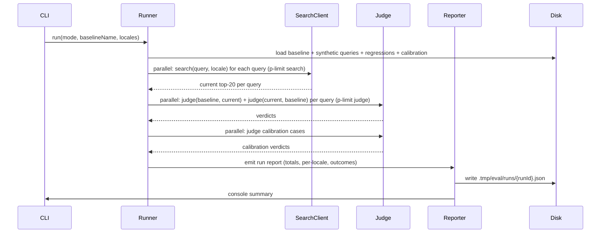

# feat: Semantic Search Eval Harness

## Overview

Build a local CLI eval harness inside `apps/admin` that produces a comparable "is this run better or worse than the saved baseline?" signal for admin's hybrid semantic search. Uses LLM-as-judge pairwise comparison (Haiku 4.5) over a hard-coded set of 30 BCP-47 locales, with native-language synthetic queries plus a growing adversarial regression set, A/B-swap to remove position bias, content-fingerprint drift detection, calibration check, and a console + JSON reporter.

The harness is greenfield — no equivalent exists today. It will be the first OpenRouter-chat caller after `image-text-generation.service.ts` and the first eval-style script after `run-embeds.ts`.

## Problem Frame

Admin's hybrid search (RRF over scene-level pgvector + Postgres FTS) is in active iteration: ranking/fusion tuning, embedding/index changes, query understanding, and content-coverage work are all in flight or upcoming. Today there is no quantitative way to tell whether a given change makes search better or worse — every commit is a guess. Iteration in the coming weeks needs an evidence loop.

Origin doc resolved all product framing: pairwise win-rate, top-30 hard-coded locales, top-20 results, native-language queries, Haiku 4.5 judge, content-fingerprint drift warning, six-verdict ladder including `both-irrelevant`. This plan resolves only the technical decisions: where the code lives, how to call OpenRouter and admin's search, how to obtain the fingerprint, how to schedule parallel calls, and how the calibration set is shaped.

## Requirements Trace

(Carried forward from origin: `docs/brainstorms/2026-05-06-semantic-search-eval-harness-requirements.md`.)

- **R1.** Local CLI runs the suite end-to-end against a configurable admin URL, emitting a headline net-win-rate plus per-query breakdown.
- **R2.** Test queries from two sources: synthetic (LLM-generated, persisted) + adversarial regression file (hand-edited YAML).
- **R3.** Pairwise judge with top-20 results, title + 200-char-truncated snippet, A/B swap.
- **R3a.** Snippet-improvement caveat surfaced in output when ranking unchanged but win-rate jumps.
- **R3b.** Native-language queries only; cross-lingual deferred.
- **R4.** Hard-coded `HARNESS_LOCALES` constant (30 entries).
- **R4a/R4b.** `--quick` (6 locales), full (30), `--locale=xx` (any).
- **R4c.** Per-locale tier (1/2/3) reported alongside win-rate.
- **R5/R5a/R5b.** Baseline = committed snapshot of (queries, results, content fingerprint); drift warning when fingerprints differ.
- **R6.** Calibration set runs on every invocation; failure flags run untrustworthy.
- **R7.** Console summary + timestamped JSON file per run.
- **R7a.** Six-verdict ladder; `both-irrelevant` excluded from net-win-rate, reported separately.
- **R7b.** Net-win-rate = (wins − losses) / (total − both-irrelevant), range [-1, +1].
- **R8.** Decoupled — talks to admin via existing public `/api/search`, no auth, configurable base URL.

## Scope Boundaries

- **Not in v1:** CI gating, web dashboard, persisted multi-run leaderboard, real-user query logs, hand-curated golden set, latency/cost measurement of the search service itself, pointwise NDCG/precision metrics, cross-lingual queries.
- **Not in v1:** Generating synthetic queries fresh each run. Queries are committed alongside the baseline so runs are comparable.
- **Not in v1:** Auto-rebaseline on drift. Drift warns; operator decides.
- **Not in v1:** A new admin endpoint for the content fingerprint. Harness uses the existing prisma client to query directly.
- **Not in v1:** Wrapping any of admin's search service code differently. The harness is strictly an external client of `/api/search`.

## Context & Research

### Relevant Code and Patterns

- `apps/admin/src/services/hybrid-search.service.ts` — search service entry; response shape (lines ~176–216) gives `{ type, id, slug, title, snippet, score, ... }`. Read-only reference.
- `apps/admin/src/app/api/search/route.ts` — REST handler at `GET /api/search?q=&locale=&type=&limit=&offset=&mode=`. Public, no auth, rate-limited 30/min. **Canonical CLI target.**
- `apps/admin/src/scripts/run-embeds.ts` — canonical CLI shape: shebang, plain `process.argv` with `parseSingle`/`parseRepeated` helpers, lazy imports after argv validation, JSON-line stdout logs, SIGINT/SIGTERM handler with prisma disconnect. Mirror this.
- `apps/admin/src/services/image-text-generation.service.ts` — OpenRouter chat-completions reference: env-CSV model id with hardcoded fallback array (`DEFAULT_OPENROUTER_IMAGE_TEXT_MODELS`), 45s `AbortController` timeout, fail-over loop on 404/429/5xx (`shouldTryNextModel`). Mirror this for the judge client.
- `apps/admin/src/services/embeddings.service.ts` — typed errors via discriminated-union error class (`EmbeddingsBatchError` with literal-union `code` field), provider selection (`selectProvider()`), Zod-validated response. Mirror for the judge's typed errors.
- `apps/admin/src/services/hybrid-search.regression.test.ts` — closest existing precedent for a battery of search queries; mocked retrievers + JSON-equality snapshot. The byte-identical contract here must NOT change.
- `apps/admin/src/services/hybrid-search-sql.ts` — tsvector/index expression constants. Don't touch; reference only if calibration probes ever need to verify index use.
- `apps/admin/src/db/client.ts` — `prisma` singleton. The harness uses this for `$queryRaw` content-fingerprint reads.
- `apps/admin/src/config/env.ts` — env registry. Per `apps/admin/AGENTS.md`, no direct `process.env` reads in new code; extend this file for new vars.
- `apps/admin/prisma/schema.prisma` — column-name source of truth: `video_scene_locale` (col `embedding`), `video_transcript_chunk` (col `embedding`, denormalized `language` for partial HNSW), `experience_locale` (col `embedding`, gated `WHERE status = 'PUBLISHED'`). `bcp47` has no underscore in admin (legacy CMS used `bcp_47`).
- `apps/admin/package.json` — `tsx src/scripts/*.ts` script binding pattern; `p-limit@^7.3.0` already a dep for concurrency.

### Institutional Learnings

- `docs/solutions/runtime-errors/silent-semantic-search-degradation-missing-openrouter-key-20260415.md` — calibration is the documented mitigation for silent OpenRouter degradation. Emit `event=judge_calibration_failure` structured log line at error level so a future log alert can fire.
- `docs/solutions/best-practices/rrf-fusion-heterogeneous-content-types-20260415.md` — admin returns cuid strings (not cms ints). Result-identity key for dedup/comparison must be `${type}:${id}` strings.
- `docs/solutions/best-practices/test-first-regression-snapshot-byte-identical-default-20260429.md` — land snapshot test for the comparison engine FIRST (test-first posture for the runner orchestrator).
- `docs/solutions/best-practices/prisma-raw-sql-invariant-assertions-20260423.md` — assert SQL **shape** in unit tests; assert real-DB behavior elsewhere. Apply to the fingerprint reader.
- `docs/solutions/database-issues/postgres-prepared-statement-bind-variable-limit-32767-20260504.md` — bind-var cap. The harness's fingerprint queries are tiny so this is informational, not blocking.
- `docs/solutions/best-practices/prototype-defaults-vs-data-derived-enumeration-20260422.md` — locale enumeration is normally data-derived in admin. The hard-coded `HARNESS_LOCALES` is the harness's deliberate concession (justified in the requirements doc); document explicitly so future readers don't mistake it for an admin contract.
- `docs/solutions/best-practices/nextjs-server-action-llm-structured-output-pattern-2026-04-21.md` — dual-validate LLM structured output: OpenRouter `response_format: json_schema` + Zod re-parse on the client. Cost-tracking shape `totalCostUsd: samples.length * COST_PER_QUERY`.
- `docs/solutions/platform/admin-scene-embeddings-indexer-pattern.md` — admin's run-report idiom is `{ totalTargets, succeeded, skipped, failed, outcomes[] }` with discriminated-union outcomes. The harness's run JSON should mirror this shape so future tooling can diff two run files mechanically.
- `docs/plans/2026-04-23-002-feat-admin-r4-hybrid-search-plan.md` — current admin search constants: `RRF_K=60`, `OVERFETCH_FACTOR=3`, `DEFAULT_LIMIT=20`, `MAX_LIMIT=50`. Score normalized [0,1] rounded 3dp. `searchMode` field in response = `"hybrid" | "keyword-only"` and signals degradation distinct from input `mode`.
- `docs/plans/2026-04-19-001-feat-admin-scene-embeddings-infra-plan.md` — `(video_scene_id, locale)` is the unique key on `video_scene_locale`.

### External References

Skipped. Local research surfaced sufficient pattern coverage. The judge model id (`anthropic/claude-haiku-4-5`) is verifiable against OpenRouter at implementation time; the rest of the design follows established repo conventions.

## Key Technical Decisions

- **Location: `apps/admin/src/scripts/` thin entry + `apps/admin/src/services/search-eval/` modular services.** All harness code lives inside `apps/admin`. The CLI entry stays thin (argv + lazy-import the runner); the runner, judge client, search client, query generator, baseline ops, fingerprint reader, and reporter live as testable modules under `services/search-eval/`. Rationale: harness reuses prisma, env config, OpenRouter conventions all rooted in `apps/admin`; admin already has the `src/scripts/` precedent; AGENTS.md prohibits cross-app imports, so a separate package would have no consumers.
- **Judge model: `anthropic/claude-haiku-4-5` via env override `OPENROUTER_JUDGE_MODEL`, with hardcoded default constant.** Mirror `DEFAULT_OPENROUTER_IMAGE_TEXT_MODELS` shape from `image-text-generation.service.ts`. Implementer to verify the exact OpenRouter model id on first build (`curl https://openrouter.ai/api/v1/models | jq` against `OPENROUTER_API_KEY`).
- **OpenRouter: per-call `fetch` with retry helper, no shared client.** Matches existing convention. The harness adds a small retry helper that handles 5xx + 429 + transport errors with `Retry-After` honored (cap 30s), per-attempt `AbortSignal.timeout` (so retries get fresh budget). This helper lives in `services/search-eval/judge.ts` initially; if a third caller appears, promote to a shared utility.
- **Structured judge output: `response_format: json_schema` + Zod re-parse.** Schema declares the verdict enum (`clearly-A-better | slightly-A-better | tie | slightly-B-better | clearly-B-better | both-irrelevant`) plus a 1-line rationale string. Both server-side schema and client-side Zod must keep enum bounds aligned (drift between them is a documented recurring class).
- **Concurrency: `p-limit` (already a dep).** Two pools: judge pool (default 8) and search pool (default 4, well under admin's 30/min rate limit). Tunable via env `EVAL_JUDGE_CONCURRENCY`, `EVAL_SEARCH_CONCURRENCY`. Both registered in `src/config/env.ts`.
- **Fingerprint: direct `prisma.$queryRaw` from the script.** Single query bundles 3 counts + 3 max(updated_at) for `video_scene_locale`, `video_transcript_chunk`, `experience_locale`, all gated by `embedding IS NOT NULL` (and `status = 'PUBLISHED'` for experiences). No new admin endpoint. Rationale: harness already has DB access, adding an endpoint would expand admin's public surface for one external consumer with no other use case.
- **Drift threshold: any non-zero delta = "drifted".** Console warning, not a block. Rationale: simpler to explain, false-positive rate is acceptable because operator chooses interpretation; no need to invent a "minor drift" tier in v1.
- **Synthetic queries persisted, not regenerated per run.** Committed at `apps/admin/eval/synthetic-queries/{locale}.json`. Rationale: pairwise-vs-baseline requires the same queries on both sides; regenerating each run breaks comparability. A separate `eval:search:regenerate-queries --locale=xx` command exists but is explicit, not automatic.
- **Adversarial regressions: YAML at `apps/admin/eval/regressions.yaml`.** Hand-edit to append. Schema: `entries: [{ locale, query, notes, addedAt, addedBy }]`. No CLI command; lower friction than memorizing flag syntax.
- **Calibration set: ~10 hand-labeled cases at `apps/admin/eval/calibration.json`.** Three case types (see Unit 9). PASS = ≥80% match expected verdict; FAIL = run flagged untrustworthy in console (large `⚠ JUDGE CALIBRATION FAILED`) but does NOT abort. Operator decides whether to trust the run.
- **Run JSON shape: discriminated-union outcomes mirroring admin's R1/R2/R3 backfill report idiom.** See "High-Level Technical Design" below.
- **Baseline = single committed JSON file per "name" at `apps/admin/eval/baselines/{name}.json`.** Default name `default`. Re-baselining via `eval:search:rebaseline [--name=xx]`. Multiple named baselines allowed but not required.
- **Result-identity key: `${type}:${id}` strings.** Per the RRF heterogeneous-content-types learning. Used for the snippet-improvement heuristic (R3a) and any dedup/comparison logic.
- **Cost tracking: per-run input+output tokens × Haiku 4.5 OpenRouter pricing constants, surfaced in console + JSON.** Mirror the cached-snapshot discipline shape. Pricing constants pinned in code (currently ~$1/Mtok input, ~$5/Mtok output for Haiku 4.5; verify at implementation time).

## Open Questions

### Resolved During Planning

- **Where the harness lives:** `apps/admin/src/scripts/eval-search.ts` (entry) + `apps/admin/src/services/search-eval/*.ts` (modules). Data files at `apps/admin/eval/`. Per-run gitignored output at `apps/admin/.tmp/eval/runs/`.
- **Judge model:** `anthropic/claude-haiku-4-5` via env `OPENROUTER_JUDGE_MODEL`. Implementer verifies exact id against OpenRouter on first build.
- **Fingerprint source:** direct `prisma.$queryRaw`, no new endpoint.
- **Concurrency strategy:** `p-limit` with two pools (judge 8 default, search 4 default), env-tunable.
- **Run JSON schema:** discriminated-union outcomes per admin's report idiom; sketched in High-Level Technical Design.
- **Calibration set design:** ~10 cases, three types, ≥80% PASS threshold, soft-warn (don't abort).
- **Synthetic queries:** persisted, regenerable via explicit command.
- **Adversarial regression file:** YAML, hand-edit.
- **Baseline file format/location:** single JSON per name at `apps/admin/eval/baselines/`.

### Deferred to Implementation

- **Exact OpenRouter model id for Haiku 4.5.** Verify with `curl https://openrouter.ai/api/v1/models` on first build. May be `anthropic/claude-haiku-4-5` or `anthropic/claude-haiku-4.5` — confirm before pinning the default constant.
- **Exact Haiku 4.5 OpenRouter pricing.** Look up at implementation time; pin as code constants for cost tracking. Update if OpenRouter pricing changes (tracked in code comment).
- **Empirical `--quick` set validation.** After Phase 3 lands, run pairwise self-comparison (current vs current) per locale on a stable backend. Any locale where net-win-rate strays from ~0 (within ±0.1) signals judge instability and gets swapped out. Live measurement; cannot be predicted at plan time.
- **Native-vs-translation cutoff for synthetic generation.** Generate per-locale natively first; if a locale's queries look broken (judge flags many `both-irrelevant`), fall back to en + translation. Decision is per-locale and made empirically once the harness runs.
- **Final per-locale query count.** Plan calls for ~50 per locale (~1,500 total queries across 30 locales for full mode). Adjust during calibration if total full-run cost exceeds the $5–15 success-criterion budget.
- **Calibration-fail verdict-match threshold.** Plan says ≥80% match expected. Adjust empirically once 5+ runs have measured Haiku's stability on the calibration set.
- **Top-10-regression sort tiebreaker.** When two regressions have the same judge confidence, sort by what — locale tier? raw score delta? query length? Deferred — pick the simplest stable order during implementation and revise if it produces unhelpful surfaces.

## High-Level Technical Design

> _This illustrates the intended approach and is directional guidance for review, not implementation specification. The implementing agent should treat it as context, not code to reproduce._

### Module layout

```
apps/admin/
├── src/
│   ├── scripts/
│   │   └── eval-search.ts                    # Thin CLI entry
│   ├── services/search-eval/
│   │   ├── types.ts                          # Shared types: Verdict, Outcome, RunReport, Baseline, Fingerprint
│   │   ├── search-client.ts                  # GET /api/search wrapper + snippet truncation + result typing
│   │   ├── judge.ts                          # OpenRouter judge client + retry + Zod-validated parse
│   │   ├── query-generator.ts                # Synthetic query generation (LLM-driven, persistable)
│   │   ├── fingerprint.ts                    # prisma.$queryRaw content-fingerprint reader
│   │   ├── baseline.ts                       # Load/save baseline JSON; drift comparison
│   │   ├── calibration.ts                    # Calibration set loader + runner
│   │   ├── runner.ts                         # Orchestrator: A/B-swap pairwise eval w/ p-limit
│   │   ├── reporter.ts                       # Run JSON writer + console summary renderer
│   │   └── locales.ts                        # HARNESS_LOCALES + tier mapping
│   └── config/env.ts                         # Add: OPENROUTER_JUDGE_MODEL, EVAL_JUDGE_CONCURRENCY, EVAL_SEARCH_CONCURRENCY, ADMIN_BASE_URL
├── eval/                                     # COMMITTED data
│   ├── baselines/{name}.json
│   ├── synthetic-queries/{locale}.json
│   ├── regressions.yaml
│   └── calibration.json
└── .tmp/eval/runs/                           # GITIGNORED per-run outputs
```

### Run JSON shape (discriminated-union outcomes per admin's report idiom)

```ts
type RunReport = {
  schemaVersion: "1"
  runId: string // "2026-05-07-1430-<sha>"
  startedAt: string // ISO8601
  finishedAt: string
  gitSha: string
  mode: "quick" | "full" | "locale"
  filterLocale: string | null
  judgeModel: string
  baseline: { name: string; capturedAt: string; gitSha: string }
  contentFingerprint: Fingerprint
  drift: { detected: boolean; details: string }
  calibration: {
    passed: boolean
    matched: number
    total: number
    cases: Array<{
      id: string
      expected: Verdict
      observed: Verdict
      pass: boolean
    }>
  }
  totals: {
    queries: number
    wins: number
    losses: number
    ties: number
    bothIrrelevant: number
    judgeDisagreements: number
    netWinRate: number // (wins - losses) / (total - bothIrrelevant)
  }
  perLocale: Record<
    string,
    {
      tier: 1 | 2 | 3
      queries: number
      wins: number
      losses: number
      ties: number
      bothIrrelevant: number
      netWinRate: number
    }
  >
  cost: { inputTokens: number; outputTokens: number; totalUsd: number }
  outcomes: Outcome[]
}

type Verdict =
  | "clearly-A-better"
  | "slightly-A-better"
  | "tie"
  | "slightly-B-better"
  | "clearly-B-better"
  | "both-irrelevant"

type Outcome =
  | {
      kind: "win" | "loss" | "tie"
      query: string
      locale: string
      tier: 1 | 2 | 3
      source: "synthetic" | "regression"
      baselineResults: SearchResult[]
      currentResults: SearchResult[]
      verdicts: [Verdict, Verdict]
      rationale: string
    }
  | {
      kind: "both-irrelevant"
      query: string
      locale: string
      tier: 1 | 2 | 3
      source: "synthetic" | "regression"
      baselineResults: SearchResult[]
      currentResults: SearchResult[]
      verdicts: [Verdict, Verdict]
    }
  | {
      kind: "judge-disagreement"
      query: string
      locale: string
      tier: 1 | 2 | 3
      source: "synthetic" | "regression"
      baselineResults: SearchResult[]
      currentResults: SearchResult[]
      verdicts: [Verdict, Verdict]
    }
```

### Net-win-rate computation

For each query:

1. Run judge twice: `judge(A=baseline, B=current)` → verdict₁; `judge(A=current, B=baseline)` → verdict₂.
2. Both `both-irrelevant` → outcome kind = `both-irrelevant`, excluded from numerator/denominator.
3. Verdicts disagree on direction (one says A-better, other says B-better in the SAME absolute direction) → outcome kind = `tie` (judge-disagreement counted separately for diagnostics).
4. Both agree direction "current is better" → `win`. Both agree "baseline is better" → `loss`. Both `tie` → `tie`.
5. `netWinRate = (wins - losses) / (totalOutcomes - bothIrrelevantCount)`.

### Pairwise judge prompt (sketch)

```
SYSTEM: You are evaluating two ranked search result lists for relevance to a query.
        Return JSON matching the schema. Choose `both-irrelevant` only if NEITHER list
        contains any result genuinely relevant to the query. Otherwise pick A, B, or tie.

USER:   Query: "{query}"
        Locale: {locale}

        List A (top 20):
        1. {title} — {snippet[:200]}
        2. ...

        List B (top 20):
        1. {title} — {snippet[:200]}
        2. ...

        Compare. Return: { verdict, rationale }.
```

### Sequence (one run, simplified)



## Implementation Units

Phased delivery: Phase 1 builds the foundations needed by everything else, Phase 2 adds the data-input layer, Phase 3 builds the eval engine, Phase 4 adds reporting, Phase 5 wires the CLI. Each phase yields runnable progress.

### Phase 1: Foundation

- [ ] **Unit 1: Env config + locale list + types**

**Goal:** Register all new env vars, define the `HARNESS_LOCALES` constant with tier mapping, and lay down shared TS types so all later units compile against them.

**Requirements:** R4, R4a, R4c, R8.

**Dependencies:** None.

**Files:**

- Modify: `apps/admin/src/config/env.ts` (add `OPENROUTER_JUDGE_MODEL`, `EVAL_JUDGE_CONCURRENCY`, `EVAL_SEARCH_CONCURRENCY`, `ADMIN_BASE_URL`)
- Create: `apps/admin/src/services/search-eval/locales.ts`
- Create: `apps/admin/src/services/search-eval/types.ts`
- Test: `apps/admin/src/services/search-eval/locales.test.ts`

**Approach:**

- `locales.ts` exports `HARNESS_LOCALES` (frozen array of 30 BCP-47 strings from origin doc), `QUICK_LOCALES` (`["en","fr","es","de","pt","ja"]`), and `LOCALE_TIER` (Record<string, 1|2|3>).
- `types.ts` defines `Verdict`, `Outcome`, `Fingerprint`, `Baseline`, `RunReport`, `SearchResult` (mirror admin's `/api/search` response shape from `hybrid-search.service.ts`).
- All env vars optional with sensible defaults; `OPENROUTER_API_KEY` is required (already in `env.ts`).

**Patterns to follow:**

- `apps/admin/src/config/env.ts` line 71 `OPENROUTER_API_KEY` for env shape
- `apps/admin/src/services/hybrid-search.service.ts` lines 176–216 for `SearchResult` typing

**Test scenarios:**

- `HARNESS_LOCALES.length === 30`
- Every locale has a tier in `LOCALE_TIER`
- `QUICK_LOCALES` is a subset of `HARNESS_LOCALES` and all are tier 1

**Verification:**

- TypeScript compiles cleanly across all later units that import these types
- All 30 locales tiered

- [ ] **Unit 2: Search client (admin REST wrapper)**

**Goal:** Encapsulate calls to `GET /api/search`, return typed `SearchResult[]`, truncate snippets to 200 chars before downstream code sees them.

**Requirements:** R3, R8.

**Dependencies:** Unit 1.

**Files:**

- Create: `apps/admin/src/services/search-eval/search-client.ts`
- Test: `apps/admin/src/services/search-eval/search-client.test.ts`

**Approach:**

- `search(baseUrl, query, locale, { limit, mode? })` returns `Promise<SearchResult[]>`.
- Default `limit=20`, `mode="hybrid"`.
- Build URL via `URL` + `searchParams`; never string-concatenate user input.
- Use `AbortSignal.timeout(30_000)` per call.
- On non-2xx, throw a typed `SearchClientError` with `code: "rate_limited" | "validation" | "server_error" | "transport"` (mirror `EmbeddingsBatchError` shape).
- Truncate `snippet` to 200 chars (single-codepoint-safe; use `Array.from(s).slice(0, 200).join("")` for emoji/CJK safety).

**Patterns to follow:**

- `apps/admin/src/services/embeddings.service.ts` for typed error class + AbortController shape
- `apps/admin/src/app/api/search/route.ts` for canonical request/response contract

**Test scenarios:**

- Successful response → returns trimmed `SearchResult[]` with snippets ≤200 codepoints
- 429 → throws `SearchClientError` with `code: "rate_limited"`
- 503 → throws with `code: "server_error"`
- Network/timeout → throws with `code: "transport"`
- Snippet with emoji/CJK does not slice mid-codepoint
- Snippet `null` from search → preserved as empty string for the judge
- `playbackId: null` (legitimate per RRF heterogeneous-content learning) is preserved unchanged

**Verification:**

- Unit tests pass; manual `curl http://localhost:3003/api/search?q=hope&locale=en` returns sensible shape parseable by this client

- [ ] **Unit 3: OpenRouter judge client**

**Goal:** Pairwise-judge an A/B pair, return `Verdict` + 1-line rationale. Wraps a single OpenRouter chat-completions call with retry + structured-output validation.

**Requirements:** R3, R7a.

**Dependencies:** Unit 1.

**Files:**

- Create: `apps/admin/src/services/search-eval/judge.ts`
- Test: `apps/admin/src/services/search-eval/judge.test.ts`

**Approach:**

- `judgePair(input: { query, locale, listA, listB }): Promise<{ verdict: Verdict; rationale: string; tokens: { in: number; out: number } }>`.
- Calls OpenRouter chat-completions with `response_format: { type: "json_schema", schema: { ... } }` declaring the verdict enum + rationale string.
- Zod-validates the parsed JSON re-strictly (independent of OpenRouter's own validation; bounded enums must match).
- Retry helper: 5xx + 429 + transport errors, max 3 attempts, exponential backoff capped 30s, honors `Retry-After`.
- `AbortSignal.timeout(45_000)` per attempt.
- Default model = const `DEFAULT_JUDGE_MODEL = "anthropic/claude-haiku-4-5"`; override via env `OPENROUTER_JUDGE_MODEL`.
- Token counts surfaced for cost rollup.
- Structured log line per call: `event=eval.judge.call locale=xx tokens.in=N tokens.out=N attempts=N`.

**Patterns to follow:**

- `apps/admin/src/services/image-text-generation.service.ts` for env-CSV model selection + try-each-then-fail-over (here we only need one model, but the AbortController + 45s timeout shape applies)
- `apps/admin/src/services/embeddings.service.ts` for typed error class

**Test scenarios:**

- Happy path: stub `fetch` → returns valid json_schema response → returns `Verdict` matching schema
- 5xx → retried then succeeds → returns `Verdict`
- 429 with `Retry-After: 5` → waits ≥5s before retry
- All 3 attempts fail → throws `JudgeError` with `code: "retry_exhausted"`
- Response with verdict outside enum → throws `JudgeError` with `code: "validation"` (Zod catches drift even if OpenRouter accepted)
- Response missing rationale → `JudgeError` with `code: "validation"`
- Timeout → throws with `code: "timeout"`

**Verification:**

- Unit tests cover both success and every error path
- Manual smoke against live OpenRouter: judge a hand-built A/B pair where A is obviously better → verdict is `clearly-A-better`

- [ ] **Unit 4: Content fingerprint reader**

**Goal:** Compute the content-fingerprint object using a single `prisma.$queryRaw` call.

**Requirements:** R5a, R5b.

**Dependencies:** Unit 1.

**Files:**

- Create: `apps/admin/src/services/search-eval/fingerprint.ts`
- Test: `apps/admin/src/services/search-eval/fingerprint.test.ts`

**Approach:**

- `readFingerprint(prisma): Promise<Fingerprint>`.
- Single combined query (one round trip): three `SELECT count(*), max(updated_at)` subqueries unioned or run as a single SELECT with sub-selects:
  - `video_scene_locale WHERE embedding IS NOT NULL`
  - `video_transcript_chunk WHERE embedding IS NOT NULL`
  - `experience_locale WHERE embedding IS NOT NULL AND status = 'PUBLISHED'`
- Result: `{ sceneEmbeddings: { count, maxUpdatedAt }, transcriptEmbeddings: { count, maxUpdatedAt }, experiences: { count, maxUpdatedAt } }`.
- `compareFingerprints(baseline, current)` returns `{ detected: boolean; details: string }`. Detected = any non-zero delta. Details string is human-readable: `Δrows: scene+512, transcript+1024, experience+0; latest update 3d after baseline`.
- All 3 sources nullable in `maxUpdatedAt` (table may be empty in dev).

**Execution note:** Implementer should write the SQL once, then verify against a real local admin DB. The shape of the prisma return is sensitive to PG version — see PG18 array-cast learning in root CLAUDE.md.

**Patterns to follow:**

- `apps/admin/src/services/scene-recommendations-retriever.ts` (uses `prisma.$queryRaw` with locale filters)
- `apps/admin/src/services/hybrid-search-retrievers.ts` (raw-SQL conventions in admin)

**Test scenarios:**

- Empty DB → all counts zero, all `maxUpdatedAt` null
- Populated DB with rows → counts and timestamps reflect reality
- `compareFingerprints(same, same)` → `detected: false`
- `compareFingerprints(baseline, current+512)` → `detected: true`, details mention `+512`
- Equal counts but later `maxUpdatedAt` → `detected: true`, details mention time delta

**Verification:**

- Unit tests assert SQL shape (per `prisma-raw-sql-invariant-assertions-20260423.md`)
- Manual smoke against local admin DB returns sensible numbers

### Phase 2: Data inputs

- [ ] **Unit 5: Synthetic query generator**

**Goal:** Generate ~50 plausible native-language search queries per locale via OpenRouter, persist to `apps/admin/eval/synthetic-queries/{locale}.json`. Stable across runs unless explicitly regenerated.

**Requirements:** R2, R3b, R4.

**Dependencies:** Units 1, 3 (reuses retry + structured-output patterns).

**Files:**

- Create: `apps/admin/src/services/search-eval/query-generator.ts`
- Create: `apps/admin/eval/synthetic-queries/.gitkeep` (commit dir)
- Test: `apps/admin/src/services/search-eval/query-generator.test.ts`

**Approach:**

- `generateQueries(locale, count): Promise<string[]>` — single OpenRouter call returning a JSON array of queries via `response_format: { type: "json_schema" }`.
- Prompt: requests native-language queries spanning themes, felt needs, bible references, and "what would someone struggling with X type?" intent — explicitly asks for variety, NOT for queries derived from a corpus snippet.
- `loadOrGenerate(locale): Promise<string[]>` — reads `eval/synthetic-queries/{locale}.json` if present, else generates and writes.
- `regenerate(locale)` — explicit overwrite. Triggered by `eval:search:regenerate-queries --locale=xx`.
- File schema: `{ locale, generatedAt, model, queries: string[] }`.

**Execution note:** Generation prompts will need iteration per locale, especially Tier-3. Land the simplest possible prompt first; quality tuning is post-v1.

**Patterns to follow:**

- Unit 3 for OpenRouter call shape

**Test scenarios:**

- Locale with no file → generates and writes
- Locale with existing file → returns cached queries without an OpenRouter call
- `regenerate` → overwrites and re-calls OpenRouter
- LLM returns malformed JSON → throws `QueryGeneratorError` with code, file not written

**Verification:**

- Manual: regenerate `en`, eyeball the queries — they should look like things real users would type, not corpus excerpts
- File at `apps/admin/eval/synthetic-queries/en.json` exists and is committable

- [ ] **Unit 6: Adversarial regression file format + loader**

**Goal:** Define and load `apps/admin/eval/regressions.yaml`. Hand-edited YAML; loader merges with synthetic queries.

**Requirements:** R2.

**Dependencies:** Unit 1.

**Files:**

- Create: `apps/admin/eval/regressions.yaml` (initial empty `entries: []` with documentation comment header)
- Create: `apps/admin/src/services/search-eval/regressions.ts`
- Test: `apps/admin/src/services/search-eval/regressions.test.ts`

**Approach:**

- Schema: `entries: Array<{ locale: string; query: string; notes: string; addedAt: string; addedBy: string }>`. Zod-validated on load.
- `loadRegressions(): Promise<{ locale: string; query: string; source: "regression" }[]>` returns flattened, locale-grouped query entries ready for the runner to consume.
- File header comment block documents the schema and how to append.
- Use `yaml` from `package.json` (verify availability; if not present, add as dep at top of this unit).

**Patterns to follow:**

- Existing YAML loaders in apps/admin (search for `.yaml` consumers; note: doppler config files are YAML)

**Test scenarios:**

- Empty `entries: []` → returns `[]`
- Valid entries → returns flattened array
- Entry missing required field → throws Zod validation error with helpful path
- File missing entirely → returns `[]` (file is optional)

**Verification:**

- File schema documented in header comment; teammate reading the file knows how to append without further instruction

### Phase 3: Eval engine

- [ ] **Unit 7: Baseline file format + load/save + drift comparison**

**Goal:** Define the baseline JSON shape and the operations to load, save, and compare a baseline against a current run.

**Requirements:** R5, R5a, R5b.

**Dependencies:** Units 1, 4.

**Files:**

- Create: `apps/admin/src/services/search-eval/baseline.ts`
- Create: `apps/admin/eval/baselines/.gitkeep`
- Test: `apps/admin/src/services/search-eval/baseline.test.ts`

**Approach:**

- Baseline file schema: `{ schemaVersion, name, capturedAt, gitSha, contentFingerprint, queries: Array<{ locale, query, source, results: SearchResult[] }> }`.
- `loadBaseline(name="default"): Promise<Baseline>` — error if not found.
- `saveBaseline(baseline)` — atomic write (`.tmp` + rename).
- `getQueriesForRun(baseline, mode, filterLocale): { locale, query, source }[]` — filters baseline's queries by mode/locale.
- Drift comparison logic from Unit 4 is invoked here.

**Execution note:** Land snapshot test for the baseline JSON shape FIRST (test-first per `test-first-regression-snapshot-byte-identical-default-20260429.md`).

**Patterns to follow:**

- `apps/admin/src/services/core-sync/snapshot-store.ts` (if exists; otherwise just use `fs/promises` + atomic rename)

**Test scenarios:**

- Round-trip: `save` then `load` → equal shape
- Missing file → `BaselineNotFoundError`
- Wrong schemaVersion → `BaselineSchemaError`
- `getQueriesForRun(b, "quick", null)` → only QUICK_LOCALES queries
- `getQueriesForRun(b, "full", null)` → all queries
- `getQueriesForRun(b, "locale", "fr")` → only `fr` queries

**Verification:**

- Snapshot test asserts byte-identical JSON output for a fixed input

- [ ] **Unit 8: Calibration set runner**

**Goal:** Define ~10 hand-labeled calibration cases at `apps/admin/eval/calibration.json`; run them on every harness invocation; flag the run untrustworthy if <80% match expected verdict.

**Requirements:** R6.

**Dependencies:** Units 3, 7.

**Files:**

- Create: `apps/admin/eval/calibration.json`
- Create: `apps/admin/src/services/search-eval/calibration.ts`
- Test: `apps/admin/src/services/search-eval/calibration.test.ts`

**Approach:**

- `calibration.json` schema: `{ cases: Array<{ id, query, locale, listA: SearchResult[], listB: SearchResult[], expected: Verdict, rationale: string }> }`.
- Three case types (~3–4 each):
  1. **Obvious A-wins:** A contains a clearly relevant title for the query, B contains random unrelated videos. `expected: "clearly-A-better"`.
  2. **Obvious tie:** A and B are the same list (different identical orderings, or just identical). `expected: "tie"`.
  3. **Both-irrelevant:** A and B both contain unrelated content for a nonsense query. `expected: "both-irrelevant"`.
- All cases are in en + 1 in fr + 1 in es to spot-check the judge across at least 3 high-resource locales.
- `runCalibration(judge): Promise<CalibrationReport>` runs all cases through `judgePair`, computes `matched/total`, returns report.
- Threshold: `passed = matched / total >= 0.8`.
- Failure emits structured log line `event=judge_calibration_failure cases.failed=N cases.total=N ratio=X` at error level (matches admin's `[search] event=…` shape per `silent-semantic-search-degradation` learning).

**Patterns to follow:**

- Snapshot tests in `hybrid-search.regression.test.ts` for the test-data shape

**Test scenarios:**

- All cases pass → `passed: true`
- 1 case fails out of 10 → `passed: true` (ratio = 0.9)
- 3 cases fail out of 10 → `passed: false` (ratio = 0.7)
- Empty cases → `passed: true`, but emit a different warning (not failure)
- Structured log emitted on failure with the exact event name

**Verification:**

- 10 cases authored and committed
- Running the harness against a stable backend produces `passed: true` consistently across 5 trial runs

- [ ] **Unit 9: Runner (orchestrator)**

**Goal:** Compose Units 2, 3, 4, 7, 8 into a single end-to-end run. Handles: parallel current-search calls, parallel A/B-swap judge calls, outcome aggregation, per-locale rollup, calibration, drift check.

**Requirements:** R1, R3, R5b, R6, R7a, R7b.

**Dependencies:** Units 2, 3, 4, 7, 8.

**Files:**

- Create: `apps/admin/src/services/search-eval/runner.ts`
- Test: `apps/admin/src/services/search-eval/runner.test.ts`

**Approach:**

- `runEval(opts: { mode, baselineName, filterLocale }): Promise<RunReport>`.
- Orchestration steps:
  1. Load baseline → if missing, error early.
  2. Load synthetic queries + regressions → flatten.
  3. Read current content fingerprint via Unit 4.
  4. Compute drift (from Unit 7's compare).
  5. Run calibration (from Unit 8).
  6. For each (locale, query) in scope: search admin via Unit 2. Use `p-limit(EVAL_SEARCH_CONCURRENCY)`. Cache by `${locale}|${query}`.
  7. For each query: two judge calls (A=baseline, B=current) + (A=current, B=baseline). Use `p-limit(EVAL_JUDGE_CONCURRENCY)`.
  8. Combine paired verdicts → `Outcome` per query.
  9. Aggregate: totals, perLocale, cost.
  10. Snippet-improvement heuristic (R3a): if win-rate jumps but most baseline result IDs (`${type}:${id}`) are still in current result IDs → set a flag in report metadata.
  11. Return `RunReport`.
- A/B-swap collapse rule: both verdicts say "current better" → `win`; both say "baseline better" → `loss`; both `tie` → `tie`; both `both-irrelevant` → `both-irrelevant`; otherwise → `judge-disagreement` (counted as `tie` for net-win-rate, surfaced separately for diagnostics).

**Execution note:** Land a snapshot test against a fixture baseline + mocked search + mocked judge BEFORE wiring real OpenRouter. Test-first.

**Patterns to follow:**

- `apps/admin/src/scripts/run-embeds.ts` for orchestrator shape (lazy imports, structured logs, progress markers)
- `apps/admin/src/services/embeddings.service.ts` for `p-limit` usage

**Test scenarios:**

- Mock search + judge to produce: 3 wins, 2 losses, 1 tie, 1 both-irrelevant for a 7-query baseline
- `runEval` returns RunReport with `totals.netWinRate = (3-2)/(7-1) ≈ 0.167`
- A/B-swap disagreement on a single query → outcome `judge-disagreement`, counted as tie in net-win-rate
- Drift detected → `RunReport.drift.detected: true`
- Calibration fails (mocked) → `RunReport.calibration.passed: false` but run still completes
- Search call fails for one query → query excluded from outcomes, error logged, run does not abort
- Snippet-improvement heuristic: same result IDs in both lists → flag set

**Verification:**

- Snapshot test of `RunReport` shape against fixture passes
- Per-locale aggregation totals match outcome list

### Phase 4: Reporter

- [ ] **Unit 10: Reporter (JSON writer + console renderer)**

**Goal:** Produce the per-run JSON file at `.tmp/eval/runs/{runId}.json` and the console summary.

**Requirements:** R7, R7a, R7b.

**Dependencies:** Units 1, 9.

**Files:**

- Create: `apps/admin/src/services/search-eval/reporter.ts`
- Test: `apps/admin/src/services/search-eval/reporter.test.ts`

**Approach:**

- `writeRunJson(report: RunReport): Promise<{ path: string }>` — writes to `apps/admin/.tmp/eval/runs/{runId}.json` (creates dirs if missing).
- `renderConsoleSummary(report: RunReport): string` — multi-section text output:
  - Header: timestamp, gitSha, judgeModel, mode, locales, queries
  - Headline: `Net win rate: +0.123 (45 wins, 32 losses, 21 ties, 8 both-irrelevant)`. Sign-prefix the number.
  - Drift block: warning if `drift.detected`
  - Calibration block: PASS or `⚠ JUDGE CALIBRATION FAILED (7/10)`
  - Per-locale table: locale, tier, wins/ties/losses, net win rate (sortable; default sort by abs(netWinRate) descending so biggest movers float to top)
  - Top 10 regressions: query, locale, tier, judge confidence indicator (🔻🔻 = clearly, 🔻 = slightly), 1-line rationale
  - Snippet-improvement caveat: surface only when heuristic triggered
  - Cost: total tokens + USD
  - Trailing line: path to JSON file
- No emojis required, but a plus-minus prefix on net win rate makes scanning faster — implementer's call.

**Patterns to follow:**

- `apps/admin/src/scripts/run-embeds.ts` for end-of-run summary shape

**Test scenarios:**

- Snapshot test for console output against a fixed RunReport
- JSON file path matches `runs/{runId}.json` format
- Top 10 regressions sorted by judge confidence (clearly > slightly), then by locale tier, then alphabetical
- Drift warning text includes the exact `Δrows: …` format
- Calibration PASS produces no warning section; FAIL produces highlighted warning

**Verification:**

- Snapshot tests pass; manual eyeball of console output reads cleanly in a normal terminal

### Phase 5: CLI

- [ ] **Unit 11: CLI entry + pnpm scripts**

**Goal:** Wire the CLI entry point that runs the full pipeline, register pnpm scripts, handle SIGINT/SIGTERM cleanly.

**Requirements:** R1, R4a, R4b, R5 (re-baseline command).

**Dependencies:** Units 1–10.

**Files:**

- Create: `apps/admin/src/scripts/eval-search.ts`
- Modify: `apps/admin/package.json` (scripts section)
- Modify: `apps/admin/.gitignore` (add `.tmp/eval/`)

**Approach:**

- Subcommand pattern via first positional arg: `run` (default), `rebaseline`, `regenerate-queries`, `calibrate`.
- Flag parsing: `parseSingle("--name")`, `parseSingle("--locale")`, `--quick` and `--full` as booleans; mirror `run-embeds.ts` helpers.
- Lazy-import services AFTER argv validation (so missing env produces friendly stderr, not zod crash at module-load time).
- SIGINT/SIGTERM handler: prisma disconnect + exit 130.
- pnpm scripts:
  - `eval:search` → `tsx src/scripts/eval-search.ts run`
  - `eval:search:quick` → `tsx src/scripts/eval-search.ts run --quick`
  - `eval:search:full` → `tsx src/scripts/eval-search.ts run --full`
  - `eval:search:locale` → `tsx src/scripts/eval-search.ts run --locale` (operator passes `--locale=xx`)
  - `eval:search:rebaseline` → `tsx src/scripts/eval-search.ts rebaseline`
  - `eval:search:regenerate-queries` → `tsx src/scripts/eval-search.ts regenerate-queries`
  - `eval:search:calibrate` → `tsx src/scripts/eval-search.ts calibrate`
- `rebaseline` subcommand: runs the same pipeline as `run` but DOES NOT compare to existing baseline — writes a fresh baseline file at `eval/baselines/{name}.json` with current results + fingerprint. Confirms with operator via stderr prompt or `--yes` flag.
- `calibrate` subcommand: runs only the calibration set, prints PASS/FAIL with detail. Useful before kicking off a full run.

**Patterns to follow:**

- `apps/admin/src/scripts/run-embeds.ts` argv parsing, lazy imports, SIGINT/SIGTERM, structured logging

**Test scenarios:**

- `eval:search` with no baseline → exits 1 with helpful message ("run `eval:search:rebaseline` first")
- `eval:search:quick` → mode = "quick", uses QUICK_LOCALES
- `eval:search:locale --locale=fr` → mode = "locale", filterLocale = "fr"
- `eval:search:rebaseline` (no `--yes`) → prompts; with `--yes` writes immediately
- SIGINT during a run → prisma disconnects, exits 130

**Verification:**

- All pnpm script entries resolve and run end-to-end against a local admin
- Help output (`eval:search --help` or no-args) is informative

## System-Wide Impact

- **Interaction graph:** Harness is read-only. Calls `GET /api/search` (read), reads `video_scene_locale`, `video_transcript_chunk`, `experience_locale` via prisma (read), calls OpenRouter (external). Writes ONLY to local files under `apps/admin/eval/` (committed) and `apps/admin/.tmp/eval/` (gitignored). No mutations to admin's database; no calls to admin's `/api/admin-embeds/*` mutation proxies.
- **Error propagation:** Search errors per query → log + skip that query, run continues. Judge errors after retry exhaustion → outcome marked `judge-disagreement` (treated as tie), run continues. Fingerprint read failure → run aborts (without it the comparison is meaningless). OpenRouter total failure → run aborts after first un-retryable error.
- **State lifecycle risks:** Atomic file writes for baseline (`.tmp` + rename). Per-run JSON written only after the full run completes (no partial files). Synthetic-query files are write-once unless explicitly regenerated.
- **API surface parity:** Adds **no new admin API endpoints** in v1. The `Not in v1` boundary explicitly defers a `/api/eval/index-fingerprint` endpoint; if a future remote-runner needs it, that's a follow-on.
- **Integration coverage:** Unit tests cover prompt assembly, baseline shape, runner orchestration with mocks. **Real-DB and real-OpenRouter behavior is integration-only** — verified by running the harness against a local admin + real OpenRouter once at the end of each phase. Mocked tests prove SHAPE (per the `mocked-shape-vs-real-contract-discipline` principle); real runs prove CONTRACT.

## Risks & Dependencies

- **Risk: Haiku 4.5 multilingual competence cliff.** Tier-3 locales (km, yue, kk, ta, te, ur, fil, etc.) may produce noisy verdicts. **Mitigation:** the calibration set covers en+fr+es; if Tier-3 produces high `both-irrelevant` rates or unstable repeat-run net-win-rates, swap to Sonnet 4.6 for those locales (env-tunable judge model). Re-baseline required if judge changes — flag explicitly in console.
- **Risk: OpenRouter rate-limit / cost overrun.** A full run estimates 1,500 queries × 2 judge calls = 3,000 calls. **Mitigation:** `p-limit` cap at 8 keeps pressure bounded; per-run cost tracking surfaces overruns before they accumulate; full mode is opt-in.
- **Risk: Admin API rate limit (30/min) hit during a full run.** 1,500 search calls at 4-concurrent puts pressure on the limiter. **Mitigation:** `EVAL_SEARCH_CONCURRENCY` default 4 keeps under 240/min if all instant; in practice most queries take ~200ms so steady-state is well under 30/min for any individual operator. If hit, retries with `Retry-After` cover it — same retry helper as the judge client.
- **Risk: Synthetic-query quality varies by locale.** Tier-3 generation may produce nonsense queries. **Mitigation:** queries are committed to disk and human-reviewable before becoming a baseline. The `regenerate-queries` command is explicit, never silent.
- **Risk: `bcp47` mismatch silently returns 0 results.** Per `prototype-defaults-vs-data-derived-enumeration-20260422.md`, admin returns 0 for any locale not present in DB. **Mitigation:** when a query returns 0 results, log `event=eval.empty_results locale=xx query=...` and surface the count in the run report; this becomes a content-coverage diagnostic.
- **Dependency: OpenRouter API key.** Reuses existing shared key (cms+manager+web). Document harness as a fourth consumer in `apps/admin/AGENTS.md` so a future rotation isn't surprised.
- **Dependency: Local admin running.** Default `ADMIN_BASE_URL=http://localhost:3003` assumes `pnpm --filter @forge/admin dev` is up. Document in unit-11 help output. Operator can override for staging/prod.

## Documentation / Operational Notes

- Add a section to `apps/admin/CLAUDE.md` titled "Search eval harness" with: how to run, where data lives, how to add a regression, how to re-baseline, when to re-baseline, what calibration failure means.
- Add `apps/admin/AGENTS.md` rule: `OPENROUTER_API_KEY` is consumed by the search-eval harness (4th consumer alongside cms/manager/web).
- After Unit 11 lands and the first real run succeeds, run a `ce:compound` to capture: the empirical `--quick` set validation result (per Open Question), Haiku 4.5's actual exact OpenRouter id, and any locale that needs a Sonnet override.
- After v1 ships and gets used for ~2 weeks, write a follow-on `feat-NNN` roadmap ticket capturing: cross-lingual test suite (R3b deferred), per-locale calibration sets, Sonnet override for Tier-3, optional `/api/eval/index-fingerprint` admin endpoint if a remote runner is ever needed.

## Alternative Approaches Considered

- **Standalone `packages/search-eval` package.** Rejected. (a) The harness reuses prisma client, env config, and OpenRouter conventions all rooted in `apps/admin`; (b) admin already has the `src/scripts/` precedent; (c) AGENTS.md prohibits cross-app imports, so a shared package would have only one consumer (admin) and no other plausible callers in v1.
- **New `/api/eval/index-fingerprint` endpoint.** Rejected for v1. (a) Admin's public API is intentionally narrow; adding a fingerprint endpoint to expose internal table counts widens the attack surface for one external consumer that already has DB access; (b) the harness is local-only in v1, so the decoupling argument from R8 (multi-environment targeting) doesn't apply to the fingerprint specifically — only to the search call. If the harness ever runs from outside admin (CI, remote leaderboard, etc.), revisit.
- **`commander` or `yargs` for argv parsing.** Rejected. `run-embeds.ts` uses plain `process.argv` with thin helpers; harness should match. New deps not justified.
- **Persisted multi-run leaderboard / sqlite.** Out of scope for v1 (origin doc explicit non-goal). Revisit if iteration cadence makes a leaderboard genuinely useful.
- **Pointwise NDCG/precision@k metrics alongside pairwise.** Out of scope for v1 (origin doc explicit non-goal). Pairwise is sufficient for the "better or worse" question and avoids judge-drift artifacts.

## Phased Delivery

- **Phase 1 (Foundation):** Units 1–4. Lands env config, types, search client, judge client, fingerprint reader. After Phase 1, the building blocks compile and unit-pass.
- **Phase 2 (Inputs):** Units 5–6. Lands synthetic query generation and the regression file format. After Phase 2, queries can be authored.
- **Phase 3 (Engine):** Units 7–9. Lands baselines, calibration, and the runner orchestrator. After Phase 3, an end-to-end run produces a `RunReport` from mocked judge + real search.
- **Phase 4 (Reporter):** Unit 10. Lands JSON writer + console summary. After Phase 4, a real run produces human-readable output.
- **Phase 5 (CLI):** Unit 11. Lands the CLI entry + pnpm scripts + initial baseline. After Phase 5, the harness is complete and runnable end-to-end.
- **Phase 6 (Quality):** Out of plan scope but worth flagging — empirically validate the `--quick` locale set, hand-author the calibration cases, hand-tune synthetic prompts where Tier-3 produces noise. This is post-merge iteration, not part of v1 ship.

## Sources & References

- **Origin document:** [docs/brainstorms/2026-05-06-semantic-search-eval-harness-requirements.md](../brainstorms/2026-05-06-semantic-search-eval-harness-requirements.md)
- Hybrid search service: `apps/admin/src/services/hybrid-search.service.ts`
- Hybrid search REST handler: `apps/admin/src/app/api/search/route.ts`
- Canonical CLI script shape: `apps/admin/src/scripts/run-embeds.ts`
- OpenRouter chat-completions reference: `apps/admin/src/services/image-text-generation.service.ts`
- OpenRouter embeddings reference (typed errors): `apps/admin/src/services/embeddings.service.ts`
- Prisma client singleton: `apps/admin/src/db/client.ts`
- Env registry: `apps/admin/src/config/env.ts`
- Search regression precedent: `apps/admin/src/services/hybrid-search.regression.test.ts`
- Related plans:
  - [docs/plans/2026-04-23-002-feat-admin-r4-hybrid-search-plan.md](2026-04-23-002-feat-admin-r4-hybrid-search-plan.md) — current admin search constants and contract
  - [docs/plans/2026-04-19-001-feat-admin-scene-embeddings-infra-plan.md](2026-04-19-001-feat-admin-scene-embeddings-infra-plan.md) — scene-embeddings table shape
- Related learnings:
  - `docs/solutions/runtime-errors/silent-semantic-search-degradation-missing-openrouter-key-20260415.md`
  - `docs/solutions/best-practices/rrf-fusion-heterogeneous-content-types-20260415.md`
  - `docs/solutions/best-practices/test-first-regression-snapshot-byte-identical-default-20260429.md`
  - `docs/solutions/best-practices/prisma-raw-sql-invariant-assertions-20260423.md`
  - `docs/solutions/best-practices/prototype-defaults-vs-data-derived-enumeration-20260422.md`
  - `docs/solutions/best-practices/nextjs-server-action-llm-structured-output-pattern-2026-04-21.md`
  - `docs/solutions/platform/admin-scene-embeddings-indexer-pattern.md`
