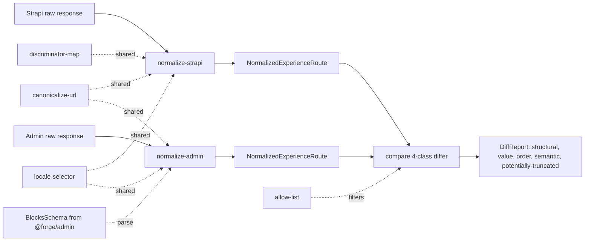

# feat: response parity harness for consumer migration (Unit 4)

## Summary

Implementation plan for Unit 4 of the consumer-side Strapi → admin migration: a fixture-driven response parity harness in `packages/graphql/src/parity/` that normalizes Strapi and admin GraphQL responses to one shared route shape and emits a structured, deterministic diff classified across four classes (structural, value, order, semantic) per R12a. Lands as a standalone foundational PR with no consumer-side code attached. Initial scope is the canary route's `experienceBySlug` operation; fixtures expand per-route as U5 ramps.

---

## Problem Frame

U5's canary opens behind `dual-read` mode, where Strapi keeps rendering the user-facing response while admin is fetched in parallel for parity logging. Without a comparator, "logged" means nothing — there is no signal to gate canary progression on, no PR evidence, and no rollback trigger. U4 ships the comparator that turns the parallel fetch into an actionable signal, before U5's dual-read mode goes live.

The comparator faces three traps that would silently produce wrong answers if not handled deliberately:

- Strapi v5 caps nested relations at 10 rows by default (`docs/solutions/performance-issues/strapi-nested-relation-truncation-and-n-plus-one-manager-20260328.md`). A naive harness would flag every truncated tail as drift, masking real differences in noise.
- Strapi serves images as root-relative paths (`/images/...`); admin enforces `z.string().url()` (absolute). Without canonicalization-first, every image field produces a false-positive value diff.
- The Strapi locale-priority logic has caused a production wrong-language watch-page incident (`docs/solutions/logic-errors/strapi-graphql-pagination-cap-wrong-language-watch-page-20260504.md`). A locale-correctness check that compares raw locale arrays misses the real bug — which is whether the locale selector picked the right variant.

These traps shape the harness contract: canonicalize-then-diff, not diff-then-explain; capture fixtures with explicit `pagination: { limit: -1 }` on every nested relation; locale correctness is resolved-locale equality (both sides' resolved `locale` field equals the URL locale).

---

## Requirements

- R1. Parity comparator lives in `packages/graphql` and compares normalized route data (not raw GraphQL JSON) between Strapi and admin sources. Traces to brief R12.
- R2. Diff output classifies mismatches across four classes — structural, value, order, semantic. Each class has at least one hand-rolled fixture covering a known-bad scenario. Structural and semantic mismatches are blocking; value and order mismatches are configurable per route. Traces to brief R12a.
- R3. Comparator is fixture-driven first. A live-comparison entry point exists but is env-gated and off by default — only used after the fixture suite passes and the canary's auth/env wiring is stable. The harness lands before or in the same PR as U5's `dual-read` mode. Traces to brief R13.
- R4. Comparator output is structured, deterministic across runs, and suitable as PR evidence — no timestamp noise, stable field ordering, JSON-serializable. Traces to brief R14.
- R5. `packages/graphql/` gains a Vitest test runner — this is the package's first runtime test surface. The harness test suite is the first runtime test in the package.
- R6. Fixtures are two-tier: hand-rolled per-branch fixtures (one per diff class, plus per-block-discriminator coverage) and at least one captured-from-live fixture per diff class. Captured fixtures come from the upstream source (raw Strapi/admin responses), never from the normalizer being tested.
- R7. The harness's deletion contract is documented in a top-of-file checklist in `packages/graphql/src/parity/index.ts` on the first PR — keyed to consumer-migration cutover. Mirrors `docs/solutions/best-practices/throwaway-operator-harness-deletion-contract-20260430.md`.
- R8. Strapi-side fixture-capture queries explicitly set `pagination: { limit: -1 }` on every nested relation array inside block fragments (placement is on `quotes`, `items`, `slots[].content`, `questions`, `infoBlocks.blocks`, etc. — not the top-level `experiences` query, since the canary's by-slug path returns one experience and the dynamic-zone `blocks` field has no pagination arg). Truncation detection in fixture mode trusts the capture-time `-1` guarantee; live mode reads response metadata (`pagination.total > returned.length`) when available. Length-10 alone is NOT a trigger. When `potentiallyTruncated` is set, the differ reclassifies missing-tail entries on that side out of the structural class into a separate `potentially-truncated` channel.
- R9. URL canonicalization runs before the differ. Both sides pass through one canonicalizer that produces an absolute https form; raw input values are preserved in the diff record so reviewers can see what each side returned.
- R10. The semantic class's locale-correctness check is **resolved-locale equality**: both sides' resolved `locale` field must equal the URL locale. When Strapi falls back to a different locale because content is missing, its resolved `locale` field diverges and the semantic class fires. (This replaces an earlier "selector output identity" framing — `experienceBySlug` returns already-resolved `ExperienceLocale`, not a list of variants the selector picks from.)

**Origin acceptance examples carried forward:**

- AE5 (covers brief R6, R6a, R12, R12a) — given a canary experience whose admin record contains every supported block variant, the harness's normalizer + differ produce an empty diff across all four classes against the Strapi response for the same logical experience. Covered by U6 captured fixtures.

---

## Scope Boundaries

> Note: this plan's local Implementation Units are numbered U1-U6. The references below to feat-104's Units 1, 5, 6, 7 are the _parent_ migration plan's units (`docs/plans/2026-04-22-001-feat-admin-core-consumer-migration-plan.md`), not this plan's. Disambiguated explicitly.

- feat-104's Unit 1 (consumer query inventory) — landed on main 2026-05-07 via PR #907 at `docs/admin-core-migration/query-inventory.md`. The inventory is the source of truth for which consumer operations need eventual U4 fixture coverage during feat-104's Unit 5 expansion; this plan does not duplicate or re-derive that surface. Field-level `?` parity tags in the inventory are explicitly designated to be resolved by _this_ plan's harness during expansion — surfacing alignment, not scope creep
- feat-104's Unit 5 canary code — content-source flag (`FORGE_CONTENT_API`), runtime block adapter (consumer-app side), `dual-read` wiring, route-level integration, ISR / metadata behavior
- feat-104's Unit 7 runbook, observability dashboards, threshold definitions (R18a)
- Property-test or generated-fixture approach — origin lean is pure-data; revisit only if hand-rolled fixture volume becomes intractable
- Mobile / TV normalizer parity (separate fixture sets and normalizers in feat-104's Unit 6)
- Live admin auth wiring beyond what anonymous PUBLIC `experienceBySlug` already supports
- Comparator coverage for routes beyond the canary — added per-route during feat-104's Unit 5 expansion, not in this plan
- Adding a CI parity job — lives in feat-104's Unit 7 or alongside feat-104's Unit 5 canary PR; this plan ships the harness, not its automation
- Re-capturing fixtures on a schedule — sequencing of fixture-staleness handling deferred to feat-104's Units 5 and 7

### Deferred to Follow-Up Work

- Per-route fixture sets for homepage, watch-video, watch-video-by-slug, search, recommendations — added in their respective feat-104 Unit 5 expansion PRs
- A CI job that runs the live-mode comparator against staged admin — feat-104's Unit 7
- Apollo persisted-cache parity for mobile / TV — feat-104's Unit 6 (gated on R16 cache-invalidation experiment)

---

## Context & Research

### Relevant Code and Patterns

- `packages/graphql/src/index.ts` — barrel re-exports for `graphql` (Strapi) and `adminGraphql` (admin) factories; the harness adds a third subpath export `./parity`
- `packages/graphql/src/graphql.ts`, `packages/graphql/src/admin.ts` — dual-client factory pattern; harness reuses both factories for typed query documents
- `packages/graphql/src/__tests__/dual-client.types.ts` — typecheck-only AE1 isolation pattern; the harness adds a parallel `.types.ts` proof that a normalized Strapi result and a normalized admin result are not interchangeable structurally
- `apps/web/src/lib/content.ts` — canonical canary read path (`resolveWatchPage`); the existing single normalization seam returning `ResolvedWatchPage`. The harness's `NormalizedExperienceRoute` shape is informed by this contract but is not the same type — the consumer-app adapter (U5) and the harness normalizer have different jobs
- `apps/web/src/lib/fragments/watch-experience.ts` — Strapi block fragment composition; the source of the 16-type Strapi component inventory the discriminator mapping table covers
- `docs/admin-core-migration/query-inventory.md` — the U1-landed inventory enumerating every `graphql(` and raw `gql\`\`` callsite in web/mobile/TV with per-field parity tags (`direct-admin-parity`/`adapter-required`/`missing`/`intentionally-deprecated`/`?`). The harness's per-route fixture set during feat-104's Unit 5 expansion is driven from this inventory; the inventory's field-level `?`tags are this harness's job to resolve. Note: admin's currently-PUBLIC queries are exactly four —`experienceBySlug`, `searchExperiences`, `search`(NOT`hybridSearch`— admin's wire field is`search`), `sceneRecommendations`
- `apps/admin/src/domain/blocks.ts` — admin's Zod `BlocksSchema`. The admin-side normalizer imports this from `@forge/admin` to recover types from the opaque `JSON` `blocks` field on `experienceBySlug`. **Seventeen** `t`-discriminated kinds; sixteen map 1:1 to Strapi components, plus admin-only `videoRecommendations` (per `apps/admin/src/domain/blocks.ts:355-360` — "forward-looking", no Strapi precedent). The discriminator-map's bidirectional totality test asserts 16 admin↔Strapi entries; `videoRecommendations` is enumerated separately as an `adminOnlyKinds` list with admin-only fixtures
- `apps/admin/src/graphql/types/experience.ts` — admin's `experienceBySlug` resolver, `authScopes: { public: true }`, `blocks` exposed as the generic `JSON` scalar
- `apps/web/src/lib/content.test.ts` — Vitest mock pattern (`vi.mocked(queryMock).mockResolvedValueOnce(...)`); the canonical mock-shape precedent the harness follows for hand-rolled fixtures
- `.github/workflows/ci.yml` (admin-schema-drift, graphql-generate jobs) — regen-then-diff pattern, relevant when U7 or U5 wires the CI job

### Institutional Learnings

- `docs/solutions/best-practices/mocked-shape-vs-real-contract-discipline-20260506.md` — hand-rolled fixtures alone are insufficient; the harness needs at least one captured-from-live fixture per diff class to prove production contract, not just branch shape
- `docs/solutions/best-practices/producer-consumer-report-file-contract-pattern-20260506.md` — Strapi `__typename` ↔ admin `kind` discriminator drift; pick one canonical literal-set (admin's `kind`) and normalize before diffing
- `docs/solutions/performance-issues/strapi-nested-relation-truncation-and-n-plus-one-manager-20260328.md` — Strapi v5 caps nested relations at 10; fixture-capture queries must set `pagination: { limit: -1 }`; runtime-captured arrays of length 10 are flagged as potentially-truncated
- `docs/solutions/logic-errors/strapi-graphql-pagination-cap-wrong-language-watch-page-20260504.md` — locale-correctness compares selector output, not raw arrays
- `docs/solutions/integration-issues/mobile-relative-image-url-no-base-origin-20260408.md` — URL canonicalization is normalize-then-diff; both sides pass through `canonicalizeUrl(raw, { schema })` before the differ runs
- `docs/solutions/architecture-patterns/dual-client-gql-tada-multi-schema-codegen-pattern-20260507.md` — harness reuses the existing `graphql()` and `adminGraphql()` factories from `@forge/graphql`; does not introduce a third factory
- `docs/solutions/cms/admin-app-data-model-decisions.md` — source of the expected-divergence allow-list; entries not on the list are real drift
- `docs/solutions/best-practices/throwaway-operator-harness-deletion-contract-20260430.md` — top-of-file deletion checklist in `parity/index.ts` on PR1, keyed to consumer-migration cutover
- `docs/solutions/best-practices/nextjs-route-shape-migration-cross-cutting-contract-drift-20260430.md` — fixture provenance: capture from upstream raw responses, not from the normalizer being validated (avoid circularity)
- `docs/solutions/best-practices/graphql-callsite-inventory-dual-pattern-sweep-20260507.md` — landed 2026-05-07 alongside U1 inventory: any consumer-callsite sweep must dual-grep `graphql(` AND `gql\`` to catch raw Apollo template literals. The harness's capture script and any future per-route fixture-add automation must dual-sweep, not gql.tada-only

---

## Key Technical Decisions

- **Pure-data normalizers + custom JSON-serializable differ.** No third-party deep-diff dependency. Rationale: origin's lean (R12 framing); the four diff classes per R12a need bespoke logic anyway (semantic class compares selector output, not just deep equality), and a generic differ would only handle one of four classes well. Custom differ also produces directly-PR-quotable JSON without post-processing.

- **Admin's `kind` enum is the canonical discriminator.** Strapi `__typename` is mapped to admin `kind` in the Strapi normalizer before diffing. Rationale: admin is the migration target — normalizing Strapi → admin reduces churn when the harness retires; alternatives (canonicalize to a third name, or keep both forms) double the cognitive load on diff readers and make the deletion checklist messier.

- **URL canonicalization is normalize-then-diff, not diff-then-explain.** Both sides pass through one canonicalizer before the differ; raw input values are preserved in the diff record. Rationale: alternative produces an unmanageable false-positive rate on every image field. Per `docs/solutions/integration-issues/mobile-relative-image-url-no-base-origin-20260408.md`.

- **Locale correctness is resolved-locale equality, not selector-output identity.** Both sides' resolved `locale` field must equal the URL locale. Rationale: admin's `experienceBySlug(locale, slug)` returns `ExperienceLocale` (the locale-resolved row, no `localizations` array); Strapi's `experiences(filters, locale)` returns an Experience with the requested locale already applied. Neither side returns "a list of variants the selector picks from," so the original "selector output identity" framing was incompatible with the actual return shapes (per doc-review FEAS-3 + ADV-004). The resolved-locale check still catches the prod wrong-language incident: when Strapi falls back to a different locale because content is missing, its resolved `locale` field diverges from the URL locale and the semantic class fires. No separate locale-selector module is needed — the check is a field comparison in the differ.

- **Strapi fixture-capture queries explicitly set `pagination: { limit: -1 }` on every nested relation array inside block fragments.** The placement is on the nested relation arrays inside each block component — not the top-level `experiences` query, since the canary's by-slug path returns one experience and the dynamic-zone `blocks` field has no pagination arg. Specifically: `bibleQuotesCarousel.quotes`, `mediaCollection.items`, `container.slots` (and slot-level `content`), `relatedQuestions.questions`, `infoBlocks.blocks` (the InfoBlocks one — distinct from the dynamic-zone Experience.blocks), `videoCarousel.items`, `navigationCarousel.items`. The capture script defines its OWN fragments separate from `apps/web/src/lib/fragments/watch-experience.ts` because the production fragments do not set this override. The Strapi normalizer's truncation-detection heuristic relies on response metadata (e.g., `pagination.total > returned.length` when available, or trusting the capture-time `-1` guarantee for fixture mode) — NOT on raw `length === 10`. Rationale: per doc-review FEAS-4, length-10 alone conflates "Strapi cap-truncated" with "happens-to-be-cap-sized"; the heuristic mis-classifies legitimate 10-item collections. Relying on capture-time guarantees + response meta avoids the false positive while still catching real truncation in live mode.

- **Two-tier fixtures: hand-rolled per-branch + captured-from-live per class.** Hand-rolled fixtures cover branch shape (each diff class, each block discriminator); captured fixtures cover production contract. Captured fixtures are taken from raw Strapi / admin responses, never from the normalizer under test. Rationale: per `mocked-shape-vs-real-contract-discipline-20260506.md` and `nextjs-route-shape-migration-cross-cutting-contract-drift-20260430.md`.

- **Admin block validation reuses `BlocksSchema` from `@forge/admin`, exposed via a new subpath export on admin's `package.json`.** The admin normalizer imports the Zod schema and runs it against the opaque `JSON` `blocks` field. Admin's `package.json` gains an `exports` entry for `./domain/blocks` (and an `exports` map if none exists today). Rationale: alternative #1 (duplicating the Zod schema into `packages/graphql`) creates two sources of truth for block shape and guarantees drift; rejected. Alternative #2 (TypeScript path mapping in `packages/graphql/tsconfig.json`) works at compile time but bypasses pnpm's workspace resolution and surprises tooling that follows package boundaries; rejected. Subpath export is the canonical way to expose admin's stable contract to a workspace sibling. **No import cycle exists**: admin does not import from `@forge/graphql`, and `@forge/admin` is already a `packages/graphql` devDep (added in U3 for schema codegen) — verified during planning.

- **Expected-divergence allow-list is a static structured TS object with rationale per entry.** Seeded from `docs/solutions/cms/admin-app-data-model-decisions.md`. Rationale: makes "why this divergence is fine" reviewable in code, prevents the allow-list from becoming a sink for un-investigated diffs.

- **Live-comparison mode is env-gated and off by default.** Activated by `FORGE_PARITY_LIVE=1` plus configured Strapi + admin endpoints. Rationale: keeps fixture mode fast and offline; matches R13's gating.

- **Admin GraphQL endpoint URL varies by environment; production auth host is on the harness blocklist.** Locally, admin's GraphQL endpoint is `http://localhost:3003/api/graphql` (per `apps/admin/package.json`'s `next dev --port 3003`). In production it's `https://admin.jesusfilm.org/api/graphql`. PR #909 (2026-05-07) split admin's auth flows onto `auth.jesusfilm.org`; `apps/admin/src/proxy.ts` is staged to return 404 for any `/api/*` request hitting the auth host (note: not yet wired as middleware as of 2026-05-08 — the proxy function exists but no `apps/admin/middleware.ts` invokes it). The capture script and live-mode entry point's `FORGE_ADMIN_URL` validation: **reject** `auth.jesusfilm.org` and other known non-admin hosts; **allow** any other URL. A positive admin-host match would block legitimate localhost / preview / Railway service URLs. Note: `AUTH_TRUSTED_ORIGINS` (Better Auth login callbacks) is orthogonal to anonymous PUBLIC GraphQL reads — only `CORS_ALLOWED_ORIGINS` on `apps/admin/src/app/api/graphql/route.ts` gates harness traffic.

- **`./parity` subpath export on `@forge/graphql`.** Internals are addressable only via the subpath. Rationale: keeps the harness's surface explicit and enumerable, matches the existing `./graphql` and `./admin` pattern from U3, and makes the deletion checklist a single import-graph search.

- **Deletion contract ships in PR1 as a top-of-file checklist** in `packages/graphql/src/parity/index.ts`. Rationale: per `throwaway-operator-harness-deletion-contract-20260430.md` — bake retirement into the harness from day one.

- **Container shape divergence is flattened on the Strapi side, not regrouped on the admin side.** Strapi: `Container { slots: [{ gridSpan, spans, content: [DynamicZone] }] }` (two-level nesting). Admin: `container.content[]` flat array containing `containerSlot` markers as siblings to actual content blocks (see `apps/admin/src/domain/blocks.ts:453-464`). The Strapi normalizer flattens `slots[].content[]` into the admin shape, emitting synthetic `containerSlot` entries that preserve `gridSpan` and `spans`. Rationale: per doc-review FEAS-2 — without explicit handling, every container produces false-positive structural diffs. Admin is the migration target; flattening Strapi to match admin (rather than regrouping admin to match Strapi) reduces churn at harness retirement. Section blocks containing nested zones use the same flatten rule.

- **Diff path grammar is RFC6901 JSON Pointer with numeric-aware sort.** Every diff entry's path is serialized as a JSON Pointer (e.g., `/blocks/3/items/0/url`), with the `~` and `/` escape rules from RFC6901. Sort is numeric-aware — segments that parse as non-negative integers compare numerically (so `/blocks/2` precedes `/blocks/10`, not the lexicographic reverse). Rationale: per doc-review ADV-001 — without an explicit grammar, two normalizer authors emit divergent path formats and lexicographic sort produces visually-confusing reports. RFC6901 is the standard, library-supported, and unambiguous; numeric-aware sort matches reviewer expectations. A test asserts a specific path string for a nested-array entry, not just byte-stability.

- **Absent-field contract: optional fields normalize to `null`; both `undefined` and missing keys map to `null`.** The `NormalizedExperienceRoute` type's optional fields (e.g., `description`, `ogImage`, nested block fields) carry `null` when absent on either side; the differ treats `null` and "missing key" as equivalent post-normalization. Rationale: per doc-review ADV-008 — Strapi `ogImage: null` vs admin field-absent (returned as `undefined`) without an explicit contract either over-reports false positives on every absent optional field or silently equates meaningful-null with meaningful-absent. The `null` convention is documented in `shared-shape.ts` JSDoc; both normalizers enforce it; cross-product tests assert `undefined`/missing keys/explicit `null` all produce the same normalized output.

---

## Open Questions

### Resolved During Planning

- **Implementation pattern**: pure-data normalizers + custom differ (origin lean confirmed)
- **Canonical discriminator**: admin's `kind` enum
- **Fixture provenance**: captured from raw upstream responses
- **Block validation source**: `BlocksSchema` imported from `@forge/admin` via a new subpath export on admin's `package.json`
- **Workspace cycle check**: verified during planning — admin does not import from `@forge/graphql`; `@forge/admin` is already a devDep of `packages/graphql` (added by U3 for schema codegen). Adding `BlocksSchema` import to the parity module does not introduce a cycle
- **Live-mode gating**: env-gated, off by default
- **Subpath export**: `@forge/graphql/parity`
- **Test runner**: Vitest, added to `packages/graphql/` as part of this PR
- **Discriminator count**: 16 shared (Strapi ↔ admin); admin-only `videoRecommendations` enumerated separately in `adminOnlyKinds` set; map totality test imports `BlocksSchema` to surface new admin kinds (resolves doc-review FEAS-1 + ADV-002)
- **Container shape divergence**: Strapi flatten — Strapi's `container.slots[].content[]` flattens to admin's flat `container.content[]` with synthetic `containerSlot` markers (resolves doc-review FEAS-2)
- **Locale correctness framing**: resolved-locale equality (both sides' `locale` field equals URL locale), not selector-output identity. No locale-selector module needed (resolves doc-review FEAS-3 + ADV-004)
- **Truncation heuristic**: capture-time `pagination: { limit: -1 }` guarantee in fixture mode; response-meta in live mode (`pagination.total > returned.length`); length-10 alone is NOT a trigger (resolves doc-review ADV-005)
- **Diff path grammar**: RFC6901 JSON Pointer with numeric-aware segment sort (resolves doc-review ADV-001)
- **Absent-field contract**: optional fields normalize to `null` on absence; `undefined` and missing keys both → `null` (resolves doc-review ADV-008)

### Deferred to Implementation

- **Base origin for URL canonicalizer**: likely an env var read at canonicalizer construction (`FORGE_STRAPI_PUBLIC_ORIGIN` or similar); the exact var name and whether it has a sensible default for fixture mode is decided during implementation
- **Capture-script location**: `packages/graphql/scripts/capture-parity-fixture.ts` vs root-level `scripts/`. Defer; the script is dev-only tooling and either location works
- **Sanitization rules for captured fixtures**: which fields (auth headers, IDs, internal-only timestamps) get redacted on capture. Defer until first capture run reveals concrete cases
- **Whether the canary route's captured fixture lives in this PR or the U5 canary PR**: leaning _this PR_ with placeholder route name parameterized; U5 canary PR adds the real route's captured fixture set. Resolve when U5 canary route is selected

---

## Output Structure

    packages/graphql/
    ├── package.json                                # adds vitest devDep + test script
    ├── vitest.config.ts                             # new
    ├── src/
    │   ├── index.ts                                 # adds ./parity subpath re-export (no behavior change to existing exports)
    │   └── parity/
    │       ├── index.ts                             # public surface + top-of-file deletion checklist
    │       ├── shared-shape.ts                      # NormalizedExperienceRoute type
    │       ├── canonicalize-url.ts                  # URL canonicalizer
    │       ├── discriminator-map.ts                 # Strapi __typename ↔ admin kind table (16 entries; videoRecommendations admin-only)
    │       ├── path-pointer.ts                      # RFC6901 JSON Pointer encode + numeric-aware sort comparator
    │       ├── normalize-strapi.ts                  # Strapi response → NormalizedExperienceRoute (handles container.slots[].content[] flatten)
    │       ├── normalize-admin.ts                   # admin response → NormalizedExperienceRoute (via BlocksSchema)
    │       ├── compare.ts                           # 4-class differ
    │       ├── allow-list.ts                        # expected-divergence allow-list
    │       ├── live.ts                              # env-gated live-mode entry point
    │       ├── canonicalize-url.test.ts
    │       ├── discriminator-map.test.ts
    │       ├── normalize-strapi.test.ts
    │       ├── normalize-admin.test.ts
    │       ├── compare.test.ts
    │       ├── compare.types.ts                     # typecheck-only Strapi-vs-admin result-isolation proof
    │       └── __fixtures__/
    │           ├── hand-rolled/
    │           │   ├── structural-missing-field.ts
    │           │   ├── value-title-mismatch.ts
    │           │   ├── order-blocks-reordered.ts
    │           │   ├── semantic-locale-fallthrough.ts
    │           │   └── per-block/                   # one fixture pair per block discriminator
    │           └── captured/
    │               └── canary-experience.ts         # placeholder; populated when canary route is selected
    └── scripts/
        └── capture-parity-fixture.ts                # one-shot capture from configured endpoints

This is a scope declaration; the implementer may adjust the layout if implementation reveals a better grouping (e.g., consolidating the canonicalizers into one file).

---

## High-Level Technical Design

> _This illustrates the intended approach and is directional guidance for review, not implementation specification. The implementing agent should treat it as context, not code to reproduce._

The two normalizers consume the same canonicalizers and locale selector so that when they emit `NormalizedExperienceRoute`, the only differences left should be real drift. The differ takes both shapes plus the allow-list and emits a deterministic diff record across the four R12a classes plus the `potentially-truncated` downgrade channel for Strapi's pagination-cap edge case.

---

## Implementation Units

### U1. Vitest infra + parity package scaffolding

**Goal:** Set up the test runner in `packages/graphql/` and the empty parity module structure with the deletion contract in place.

**Requirements:** R5, R7

**Dependencies:** None

**Files:**

- Modify: `packages/graphql/package.json`
- Create: `packages/graphql/vitest.config.ts`
- Modify: `packages/graphql/src/index.ts`
- Create: `packages/graphql/src/parity/index.ts`

**Approach:**

- Add `vitest` to `devDependencies` in `packages/graphql/package.json`. Add a `test` script.
- Vitest config follows the conventions used in other workspace packages (Node environment, default include patterns).
- `src/index.ts` re-exports `./parity` via a subpath, mirroring the existing `./graphql` and `./admin` pattern.
- `src/parity/index.ts` carries a top-of-file deletion checklist (env vars, exports, import-graph references, CI hooks) keyed to consumer-migration cutover. Empty public surface initially — populated in later units.
- Add `"./parity"` to the `exports` map in `package.json` so consumers import as `@forge/graphql/parity`.

**Patterns to follow:**

- `packages/graphql/src/index.ts` and the existing dual-client subpath exports
- Top-of-file deletion checklist pattern from `docs/solutions/best-practices/throwaway-operator-harness-deletion-contract-20260430.md`

**Test scenarios:**

- Happy path: `pnpm --filter @forge/graphql test` runs and reports zero tests passing without errors
- Edge: `import { /* placeholder */ } from "@forge/graphql/parity"` from a consuming package typechecks (this proves the subpath export wires through correctly)

**Verification:**

- `pnpm --filter @forge/graphql typecheck` passes
- `pnpm --filter @forge/graphql test` exits zero
- The deletion checklist enumerates every artifact this PR introduces (vitest config, `parity/` files, package exports map entry, test script)

---

### U2. Shared route shape, URL canonicalizer, discriminator map, path pointer

**Goal:** Define the shared output shape both normalizers emit, plus the three pieces of shared logic both normalizers and the differ consume.

**Requirements:** R1, R9, R10

**Dependencies:** U1

**Files:**

- Create: `packages/graphql/src/parity/shared-shape.ts`
- Create: `packages/graphql/src/parity/canonicalize-url.ts`
- Create: `packages/graphql/src/parity/discriminator-map.ts`
- Create: `packages/graphql/src/parity/path-pointer.ts`
- Test: `packages/graphql/src/parity/canonicalize-url.test.ts`
- Test: `packages/graphql/src/parity/discriminator-map.test.ts`
- Test: `packages/graphql/src/parity/path-pointer.test.ts`

**Approach:**

- `shared-shape.ts`: exports `NormalizedExperienceRoute`, the type both normalizers produce. Carries `id`, `slug`, `locale`, `title`, `description`, `ogImage`, `blocks` (discriminated union over admin's `kind`), and a `meta` channel including `potentiallyTruncated: boolean`, `source: "strapi" | "admin"`, and `rawUrls` for canonicalization audit. **Absent-field contract** (per Key Decisions): all optional fields normalize to `null` on absence — both `undefined` and missing keys map to `null`. Documented in JSDoc on each optional field. No `selectedVariantId` field — locale correctness is checked via the `locale` field directly (resolved-locale equality).
- `canonicalize-url.ts`: takes a raw URL string and a config (`{ schema: "strapi" | "admin"; baseOrigin: string }`); returns `{ canonical: string; raw: string }`. Strapi root-relative paths get prepended with `baseOrigin`; admin absolute URLs are normalized for trailing slashes, lowercased host, and stripped of UTM-style query keys. Raw form is preserved alongside canonical for diff records.
- `discriminator-map.ts`: bidirectional table mapping the 16 shared Strapi `__typename` ↔ admin `kind` pairs. Admin's `videoRecommendations` is enumerated in a separate `adminOnlyKinds` set. Total over the known shared set; lookup miss returns an explicit `{ kind: "unknown"; raw: string }` sentinel rather than throwing. A test imports `BlocksSchema` from `@forge/admin/domain/blocks` and asserts every shared discriminator has a map entry — surfacing new admin kinds as test failures rather than silent unknown-sentinel passes.
- `path-pointer.ts`: RFC6901 JSON Pointer encoder + numeric-aware sort comparator. `encode(segments)` joins with `/` after escaping `~` → `~0` and `/` → `~1` per RFC6901. `compare(a, b)` splits both on `/`, compares segment-by-segment with non-negative integer segments compared numerically (so `/blocks/2` precedes `/blocks/10`). Pure functions; no locale-dependent string sort.

**Patterns to follow:**

- Discriminator mapping table pattern: a single exported object with explicit, sorted entries; tests assert totality against `BlocksSchema`
- RFC6901: https://www.rfc-editor.org/rfc/rfc6901 — keep the implementation small and standard

**Test scenarios:**

- Happy path: `canonicalizeUrl("/images/foo.jpg", { schema: "strapi", baseOrigin: "https://cdn.example.com" })` returns `{ canonical: "https://cdn.example.com/images/foo.jpg", raw: "/images/foo.jpg" }`
- Happy path: `canonicalizeUrl("https://cdn.example.com/foo.jpg/", { schema: "admin", baseOrigin: ... })` returns canonical with trailing slash stripped and UTM keys removed; raw preserved verbatim
- Edge: empty string input throws a typed error
- Edge: Strapi schema with absolute URL passes through unchanged (canonical equals raw)
- Edge: malformed URL surfaces as a structured failure (not a thrown exception) so the differ can flag it as a value-class mismatch
- Happy path (discriminator): every Strapi `__typename` from the 16-type fragment table maps to a non-empty admin `kind`
- Edge (discriminator): unknown `__typename` returns `{ kind: "unknown", raw }` sentinel
- Edge (discriminator): bidirectional lookup is consistent — `strapiToAdmin(adminToStrapi(k)) === k` for every known `k`
- Path pointer: `encode(["blocks", 3, "items", 0, "url"])` returns `/blocks/3/items/0/url`
- Path pointer: segments containing `/` or `~` are escaped per RFC6901 (`/` → `~1`, `~` → `~0`)
- Path pointer numeric sort: `compare("/blocks/2", "/blocks/10")` returns negative (numeric, not lexicographic)
- Path pointer numeric sort: `compare("/blocks/abc", "/blocks/2")` falls back to string comparison for non-numeric segments
- Discriminator-map admin coverage: importing `BlocksSchema` from `@forge/admin/domain/blocks` and asserting every shared discriminator (excluding admin-only `videoRecommendations`) has a map entry — surfaces new admin kinds at test time, not as silent unknown-sentinel passes
- Absent-field shape: `NormalizedExperienceRoute` JSDoc on every optional field documents the `null`-on-absence contract

**Verification:**

- `pnpm --filter @forge/graphql test` passes the canonicalizer, discriminator-map, and path-pointer suites
- `pnpm --filter @forge/graphql typecheck` passes — `NormalizedExperienceRoute` is exportable and consumable from outside the parity module

---

### U3. Strapi normalizer

**Goal:** Implement the Strapi-side normalizer that takes a Strapi GraphQL response for an experience and emits `NormalizedExperienceRoute`.

**Requirements:** R1, R8

**Dependencies:** U2

**Files:**

- Create: `packages/graphql/src/parity/normalize-strapi.ts`
- Test: `packages/graphql/src/parity/normalize-strapi.test.ts`

**Approach:**

- Input typed via `ResultOf<>` of a typed `graphql()`-built `experiences` query that mirrors `apps/web/src/lib/fragments/watch-experience.ts`
- Maps each block's `__typename` through `discriminator-map.ts` to admin's `kind`; emits the discriminated union `NormalizedExperienceRoute["blocks"]`
- **Container flatten** (per Key Decisions): `ComponentSectionsContainer { slots[] { content[] } }` is flattened into a single `container.content[]` array matching admin's flat shape, with synthetic `containerSlot` entries inserted at slot boundaries preserving `gridSpan` and `spans`. Same flatten rule applies to Section blocks containing nested zones
- Pipes every URL field (`ogImage.url`, image references inside blocks, video poster URLs) through `canonicalize-url.ts`
- **Resolved-locale equality**: stores the response's `locale` field on the normalized output's top-level `locale`. The differ compares this directly against the URL-locale parameter and against admin's `locale` for semantic-class equality. No selector module
- **Truncation detection** (per Key Decisions, refined): trusts the capture-time `pagination: { limit: -1 }` guarantee for fixture mode (sets `meta.potentiallyTruncated: false`). Live mode reads response metadata when available (`pagination.total > returned.length`) and only sets `potentiallyTruncated: true` when there's evidence of more rows than returned. Length-10 alone is NOT a trigger
- **Absent-field handling** (per Key Decisions): every optional field absent in the response (Strapi `null`, `undefined`, missing key) normalizes to `null` on the output
- ogImage handling: emits the structured `{ url, width, height, alt }` shape — the normalized type is the lossless superset; admin normalizer fills `width`/`height`/`alt` with `null`

**Patterns to follow:**

- `apps/web/src/lib/content.ts` resolveWatchPage and the WatchExperience fragment composition — shape and locale handling reference, not type re-export
- `apps/web/src/lib/content.test.ts` mock-shape pattern

**Test scenarios:**

- Happy path: typical Strapi response with three blocks → normalized shape has three entries with correct `kind` values, all URLs canonicalized
- Edge: empty blocks array → empty normalized blocks
- Edge: null `ogImage` → normalized `ogImage: null`
- Error path: response missing required `slug` field throws a typed error naming the missing field
- Locale: response's `locale` field surfaces verbatim on `normalized.locale`
- Discriminator: Strapi `ComponentSectionsMediaCollection` block surfaces as `kind: "mediaCollection"`
- URL canonicalization: relative `/images/foo.jpg` → absolute canonical; raw preserved in `meta.rawUrls`
- **Container flatten**: Strapi container with two slots (`gridSpan: 2` + `gridSpan: 1`), each with two blocks, normalizes to `kind: "container"` with `content: [containerSlot{gridSpan:2}, block, block, containerSlot{gridSpan:1}, block, block]` — exact ordering verified
- **Truncation (fixture mode)**: response captured with `pagination: { limit: -1 }` and 10 blocks → `meta.potentiallyTruncated: false` (capture-time guarantee trusted)
- **Truncation (live mode with response metadata)**: response with `pagination.total: 12` and `returned.length: 10` → `meta.potentiallyTruncated: true`
- **Absent-field**: Strapi `description: null`, `description: undefined`, and missing `description` key all produce `normalized.description: null`
- Per-block-discriminator coverage: at least one fixture for every entry in the discriminator map produces the expected normalized output (covers AE5 prerequisite — the Strapi half)

**Verification:**

- `pnpm --filter @forge/graphql test` covers the Strapi normalizer with all 16 block discriminators exercised
- Typecheck shows `ResultOf<typeof StrapiExperienceQuery>` flows through to `NormalizedExperienceRoute` without `any`

---

### U4. Admin normalizer (with BlocksSchema validation)

**Goal:** Implement the admin-side normalizer that takes an admin GraphQL response (where `blocks` is opaque `JSON`) and emits `NormalizedExperienceRoute`.

**Requirements:** R1

**Dependencies:** U2

**Files:**

- Create: `packages/graphql/src/parity/normalize-admin.ts`
- Test: `packages/graphql/src/parity/normalize-admin.test.ts`
- Modify: `apps/admin/package.json` (add `exports` map with a `./domain/blocks` entry pointing at the Zod schema source; admin currently has no `exports` map, so this PR introduces it)

**Approach:**

- Input typed via `AdminResultOf<>` of a typed `adminGraphql()`-built `experienceBySlug` query
- The `blocks` field arrives as `unknown` (opaque `JSON` scalar). Run `BlocksSchema.parse(...)` from `@forge/admin/domain/blocks` to recover the discriminated union
- On Zod validation failure, throw a typed `AdminBlocksValidationError` that carries the failing block's index, discriminator, and the Zod issue list — surfaces what the differ would otherwise report as opaque structural failure
- Pipes every URL field through `canonicalize-url.ts`
- **Resolved-locale equality**: stores admin response's `locale` (from `ExperienceLocale`) verbatim on `normalized.locale`. The differ compares against URL locale and Strapi's `locale` directly
- **Container shape**: admin's `container.content[]` is already flat with `containerSlot` markers — the admin normalizer passes content through unchanged (the flatten work happens on the Strapi side per Key Decisions)
- **Absent-field handling** (per Key Decisions): every optional field absent in the response (`null`, `undefined`, or missing key) normalizes to `null`
- ogImage shape: admin emits `ogImageUrl: String` only; normalize to `{ url, width: null, height: null, alt: null }` so the shape lines up with Strapi's normalizer output

**Patterns to follow:**

- `apps/admin/src/domain/blocks.ts` Zod schema — reuse, do not duplicate
- Workspace dependency pattern: `"@forge/admin": "workspace:*"` already exists in `packages/graphql/package.json` devDependencies (added by U3 for schema codegen) — no new dependency edge introduced
- Subpath export pattern: `apps/admin/package.json` gets an `exports` map. Mirrors the pattern in `packages/graphql/package.json` (which exposes `.`, `./graphql`, `./admin`)

**Test scenarios:**

- Happy path: typical admin response with three blocks → normalized shape has three entries with correct `kind` values
- Edge: empty blocks array → empty normalized blocks
- Edge: `ogImageUrl` only → normalized `ogImage` has `width: null`, `height: null`, `alt: null`
- Error path: a block whose `t` discriminator is unknown to `BlocksSchema` produces `AdminBlocksValidationError` carrying the block index and discriminator
- Error path: a block missing a required field for its `t` produces `AdminBlocksValidationError` with the Zod issue path
- Discriminator: admin `t: "mediaCollection"` block surfaces as `kind: "mediaCollection"` in normalized output
- URL canonicalization: admin absolute URL passes through canonicalizer, query-string canonicalization applied
- Locale: admin's `ExperienceLocale.locale` field surfaces verbatim on `normalized.locale`
- **Absent-field**: admin response with `description: undefined` and missing `description` key both produce `normalized.description: null`
- **Admin-only `videoRecommendations`**: normalizer accepts the kind (it's in `BlocksSchema`), surfaces it as `kind: "videoRecommendations"` on the normalized output. The differ later flags structural mismatch on Strapi side ("missing block kind") — this is correct prod behavior since the kind is admin-only
- Per-block-discriminator coverage: covers all 16 shared admin `t` values plus admin-only `videoRecommendations` (17 total fixtures; 16 have Strapi pairs, `videoRecommendations` is admin-only)

**Verification:**

- `pnpm --filter @forge/graphql test` covers the admin normalizer including all 16 block discriminators
- `BlocksSchema` import resolves cleanly from `@forge/admin`; no circular workspace dependency surfaces

---

### U5. Four-class differ + type-isolation proof

**Goal:** Implement the comparator that takes two `NormalizedExperienceRoute` values and returns a deterministic, JSON-serializable `DiffReport` classified across structural, value, order, and semantic classes — plus the `potentially-truncated` downgrade channel.

**Requirements:** R1, R2, R4, R8, R9, R10

**Dependencies:** U2

**Files:**

- Create: `packages/graphql/src/parity/compare.ts`
- Create: `packages/graphql/src/parity/allow-list.ts`
- Create: `packages/graphql/src/parity/compare.types.ts`
- Test: `packages/graphql/src/parity/compare.test.ts`

**Approach:**

- `compare.ts` exports `compareNormalizedRoutes(strapiSide, adminSide, options)` returning a `DiffReport` with five channels: `structural[]`, `value[]`, `order[]`, `semantic[]`, `potentiallyTruncated[]`
- Structural class: walks both normalized shapes; reports field-presence asymmetries by RFC6901 JSON Pointer path. **Absent-field rule** (per Key Decisions): both sides' `null` and missing-key states are equivalent — only true presence/absence on one side surfaces here
- Value class: deep equality on present fields (using canonicalized URLs); reports path + both raw values
- Order class: ordered-collection comparison on arrays where order is meaningful (blocks, in particular); reports moved indices
- Semantic class: three sub-checks — **locale-correctness (resolved-locale equality: both sides' `locale` field equals the URL locale, per Key Decisions — replaces the rejected selector-output framing)**, ID identity (experience and block IDs preserved within each side; cross-side ID equality is NOT checked since admin cuids and Strapi documentIds are different by design), URL canonicalization residual (canonical-form equality once normalization has run, with raw forms preserved in `meta.rawUrls` on each side)
- Potentially-truncated downgrade: when either side has `meta.potentiallyTruncated: true`, missing-tail entries from THAT side are reclassified out of structural into `potentiallyTruncated[]`
- Allow-list filter: entries matching `allow-list.ts` are dropped from the report before return; matched entries are surfaced under `meta.appliedAllowList[]` for transparency
- **Determinism**: every channel's entries are sorted by `path-pointer.compare` (RFC6901 JSON Pointer with numeric-aware segment sort, per Key Decisions) — NOT lexicographic. Diff record has no timestamps or non-deterministic content
- `compare.types.ts` is a typecheck-only file (no `.test.ts` suffix; vitest skips per existing dual-client pattern) that asserts `compare()` cannot accept a Strapi raw response and an admin raw response — only the normalized shape — using `@ts-expect-error` lines

**Patterns to follow:**

- `packages/graphql/src/__tests__/dual-client.types.ts` — typecheck-only proof pattern from U3 (admin migration)
- Allow-list seed: `docs/solutions/cms/admin-app-data-model-decisions.md` divergences (e.g., `ogImage.width`/`height`/`alt` are null on admin side — known divergence, not drift)

**Test scenarios:**

- Happy path: identical normalized inputs produce empty diff across all channels
- Structural: admin missing `description` → flagged in `structural[]` with RFC6901 path `/description`
- Structural: extra field on admin not on Strapi → flagged in `structural[]`
- **Structural absent-field equivalence**: Strapi `description: null` vs admin missing `description` key (both normalized to `null`) → no diff
- Value: `title` differs ("Easter" vs "Easter Story") → flagged in `value[]` with both raw values
- Order: blocks `[a, b, c]` vs `[a, c, b]` → flagged in `order[]` with moved-index pairs
- **Semantic locale (resolved-locale equality)**: Strapi response with `locale: "en"` and admin response with `locale: "es"` (Strapi fell back) for URL locale `"en"` → flagged in `semantic[]` with subclass `locale-mismatch`
- Semantic URL: a URL field's canonical form differs after canonicalization → flagged in `semantic[]` with subclass `url-canonicalization`
- **Path sort (numeric-aware)**: report contains entries at `/blocks/2`, `/blocks/10`, `/blocks/3` → output ordering is `/blocks/2`, `/blocks/3`, `/blocks/10` (numeric, not lexicographic which would produce `/blocks/10`, `/blocks/2`, `/blocks/3`)
- Truncation downgrade: Strapi side `meta.potentiallyTruncated: true`, admin has 12 blocks while Strapi has 10 → admin's 11th and 12th entries land in `potentiallyTruncated[]`, not `structural[]`
- Allow-list: a known divergence (`ogImage.width: null` on admin) is filtered out and surfaced under `meta.appliedAllowList`
- Determinism: running `compareNormalizedRoutes(a, b)` twice on the same inputs produces byte-identical JSON (`JSON.stringify(report1) === JSON.stringify(report2)`)
- Compile-time isolation (in `compare.types.ts`): passing a raw Strapi `ResultOf<>` value to `compare()` produces a TypeScript error
- Covers AE5: when both fixtures represent the same canary experience with all 16 shared block variants, the report is empty across all four classes (post-allow-list)

**Verification:**

- `pnpm --filter @forge/graphql test` covers the differ across all five channels and the allow-list filter
- `pnpm --filter @forge/graphql typecheck` enforces the `@ts-expect-error` isolation proofs
- Snapshot of a known-bad fixture's diff JSON is byte-stable across two consecutive runs

---

### U6. Two-tier fixture set + live-mode entry point + capture script

**Goal:** Land the hand-rolled fixture set covering all four diff classes plus all 16 block discriminators, the placeholder captured-fixture slot for the canary route, the env-gated live-comparison entry point, and the one-shot capture script.

**Requirements:** R3, R6

**Dependencies:** U3, U4, U5

**Files:**

- Create: `packages/graphql/src/parity/__fixtures__/hand-rolled/` (per-class + per-block-discriminator pairs)
- Create: `packages/graphql/src/parity/__fixtures__/captured/canary-experience.ts` (placeholder)
- Create: `packages/graphql/src/parity/live.ts`
- Create: `packages/graphql/scripts/capture-parity-fixture.ts`
- Test: extend `compare.test.ts` to drive every fixture pair through the full pipeline

**Approach:**

- Hand-rolled fixtures: one per diff class (`structural-missing-field`, `value-title-mismatch`, `order-blocks-reordered`, `semantic-locale-fallthrough`) plus one fixture pair per admin `kind` discriminator. Each fixture exports a `{ strapi, admin, expectedDiff }` triple
- Captured fixtures: directory exists with a `canary-experience.ts` placeholder that exports a `{ strapi, admin, expectedDiff: empty }` triple parameterized by route name. Real captured data lands when canary route is selected (deferred decision in Open Questions); the placeholder structure makes the addition a single-file change
- `live.ts`: env-gated entry point. Reads `FORGE_PARITY_LIVE`, `FORGE_STRAPI_URL`, `FORGE_ADMIN_URL`, configured slug + locale pair. Refuses to run when `FORGE_PARITY_LIVE` is not set with a clean typed error. Issues both queries via the existing `graphql()` and `adminGraphql()` factories, runs the normalizers + differ, returns the `DiffReport`. Not invoked by the test suite — for ad-hoc operator use
- `capture-parity-fixture.ts`: one-shot CLI. Configurable Strapi + admin endpoints + slug + locale. Captures raw responses to disk (under `__fixtures__/captured/`), redacts auth headers and a configurable list of sensitive fields. Sanitization rules deferred to implementation per Open Questions; minimal redaction (auth headers, IDs that look like internal tokens) ships in PR1. Strapi-side query in this script explicitly sets `pagination: { limit: -1 }` on every nested relation per R8. **Host validation on `FORGE_ADMIN_URL`**: blocklist `auth.jesusfilm.org` and other known non-admin hosts; allow any other URL (localhost, preview deploys, Railway service URLs, `admin.jesusfilm.org`). A positive admin-host match would break local dev where admin runs at `localhost:3003`

**Patterns to follow:**

- Mock-shape pattern from `apps/web/src/lib/content.test.ts`
- One-shot script pattern from `apps/admin/src/scripts/print-schema.ts` — explicit env handling, deterministic output, no implicit defaults

**Test scenarios:**

- Happy path: every hand-rolled fixture pair produces exactly the expected diff entries (one fixture per class, plus one fixture per discriminator)
- Per-block-discriminator coverage: all 16 admin `kind` values have a fixture pair that produces the expected (empty) diff when both sides represent the same logical block
- Allow-list integration: hand-rolled fixture for a known divergence (admin `ogImage.width: null`) produces an empty diff after allow-list filtering, with the divergence reported under `meta.appliedAllowList`
- Live-mode disabled: calling `live()` without `FORGE_PARITY_LIVE` set produces a typed error naming the missing env var
- Live-mode enabled with stub endpoints (in test, with mocked fetch): `live()` issues both queries, runs the pipeline, returns a `DiffReport`
- Capture script smoke: `pnpm tsx packages/graphql/scripts/capture-parity-fixture.ts --slug ... --locale ...` against stub endpoints produces a deterministic on-disk fixture file
- Sanitization: capture script's output contains no `Authorization` header values, no environment-variable raw values

**Verification:**

- `pnpm --filter @forge/graphql test` runs the full fixture suite and passes
- Captured-fixtures placeholder directory has the right shape so adding the canary route's real fixture set is a single-file change
- `live.ts` is exported from `parity/index.ts`; the deletion checklist in `index.ts` is updated to enumerate the live entry point and capture script

---

## System-Wide Impact

- **Interaction graph:** the harness is leaf code. It imports from `@forge/admin` (BlocksSchema only), reuses the existing `graphql()` and `adminGraphql()` factories from `packages/graphql`, and is not imported by any consumer app in this PR. U5's canary code will import `@forge/graphql/parity` from `apps/web`.
- **Error propagation:** the harness throws typed errors (`AdminBlocksValidationError`, normalizer-required-field errors); the live mode and capture script surface env-gating failures as typed exceptions rather than silent no-ops.
- **State lifecycle risks:** none — the harness is pure-data over inputs.
- **API surface parity:** the new `./parity` subpath export joins the existing `./graphql` and `./admin` exports on `@forge/graphql`. `package.json` `exports` map adds one entry; `tsconfig` paths follow.
- **Integration coverage:** the BlocksSchema import is the first TypeScript-level coupling between `packages/graphql` and `@forge/admin`. The workspace edge already exists (admin is a `packages/graphql` devDep from U3 schema codegen); this PR adds an `exports` map to admin's `package.json` and the first concrete TS import. Scope is deliberately narrow — only the Zod schema is exposed via the subpath, not the GraphQL types, Pothos builder, or services. Verified during planning: admin does not import from `@forge/graphql`, so no cycle is introduced.
- **Unchanged invariants:** existing `graphql()` and `adminGraphql()` factories are unchanged. The dual-client codegen output (`graphql-env.d.ts`, `admin-graphql-env.d.ts`) is unchanged. No consumer app's behavior changes in this PR.

---

## Risks & Dependencies

| Risk                                                                                                                                                                                  | Mitigation                                                                                                                                                                                                                                                                                                                                                                                                                                                                     |
| ------------------------------------------------------------------------------------------------------------------------------------------------------------------------------------- | ------------------------------------------------------------------------------------------------------------------------------------------------------------------------------------------------------------------------------------------------------------------------------------------------------------------------------------------------------------------------------------------------------------------------------------------------------------------------------ |
| Strapi pagination cap producing false-positive structural diffs                                                                                                                       | Capture script sets `pagination: { limit: -1 }`; normalizer flags responses with length-10 arrays as `potentiallyTruncated`; differ downgrades tail entries out of structural class. R8.                                                                                                                                                                                                                                                                                       |
| URL canonicalization rules drift from prod URL behavior, masking real divergence                                                                                                      | Both sides pass through one canonicalizer with `{ schema, baseOrigin }` config; raw forms preserved in `meta.rawUrls` so reviewers see actual values. R9. Risk surfaces if `baseOrigin` env config is wrong — flagged in Open Questions for implementation-time resolution.                                                                                                                                                                                                    |
| BlocksSchema in `@forge/admin` evolves faster than the harness's hand-rolled per-discriminator fixtures                                                                               | Per-block-discriminator fixtures cover the union exhaustively at write time; if admin adds a 17th discriminator, the admin normalizer's `BlocksSchema.parse` will throw `AdminBlocksValidationError` and the test for that fixture will surface the gap. The expected-divergence allow-list does NOT shadow new-discriminator failures.                                                                                                                                        |
| Hand-rolled fixtures pass while real captured fixtures fail                                                                                                                           | Two-tier fixture rule (R6): every diff class has at least one captured fixture; PR review cannot land the harness with empty `__fixtures__/captured/`. The canary-route placeholder is exempt only because canary route choice is U5's call.                                                                                                                                                                                                                                   |
| Allow-list becomes a sink for un-investigated diffs                                                                                                                                   | Allow-list entries require a `rationale` field tying to `docs/solutions/cms/admin-app-data-model-decisions.md` or another decision doc; `compare.test.ts` asserts every allow-list entry has a non-empty rationale. The seed entries enumerate ogImage's full divergence: `ogImage.width: null`, `ogImage.height: null`, `ogImage.alt: null` (admin schema exposes only `ogImageUrl`; structural ogImage fields are not yet wired).                                            |
| Admin's `BlocksSchema` is exposed via a new subpath export — admin's `package.json` doesn't currently have an `exports` map, and no other workspace imports from `@forge/admin` today | First repo precedent for treating admin as an importable workspace package; verified during planning that admin does not import from `@forge/graphql`, so no cycle risk. The `exports` map addition is small and reversible. If `BlocksSchema` import paths surface tooling issues (e.g., Vitest, Next.js dev server), fall back to TypeScript path mapping in `packages/graphql/tsconfig.json` as a backstop. Risk does not block landing — it shapes which file gets edited. |
| Vitest setup in `packages/graphql/` perturbs Turborepo task cache or other workspace tooling                                                                                          | Vitest is a devDependency only; Turbo `inputs` for the `test` task scope to `src/**` and `vitest.config.ts`; no runtime impact on dual-client codegen. The existing `generate` and `typecheck` tasks are unchanged.                                                                                                                                                                                                                                                            |
| Captured fixtures grow stale relative to prod data after canary launches                                                                                                              | Out of scope for U4 (deferred). U5's runbook (R19) takes ownership of fixture-staleness. The capture script ships in U4 to make re-capture a one-command operation.                                                                                                                                                                                                                                                                                                            |

---

## Documentation / Operational Notes

- Top-of-file deletion checklist in `packages/graphql/src/parity/index.ts` enumerates: vitest config + script, `parity/` source files, `__fixtures__/` directory, `scripts/capture-parity-fixture.ts`, `./parity` exports map entry, `apps/admin/package.json`'s `exports` entry for `./domain/blocks` (and the `exports` map itself if it becomes empty after removal), env vars (`FORGE_PARITY_LIVE`, `FORGE_STRAPI_URL`, `FORGE_ADMIN_URL`, `FORGE_STRAPI_PUBLIC_ORIGIN`). Note: `@forge/admin` workspace devDep on `packages/graphql` is NOT removed at retirement — it remains in use for schema codegen.
- A short `packages/graphql/src/parity/README.md` documents: how to run hand-rolled fixtures (`pnpm --filter @forge/graphql test`), how to run live mode (env vars + invocation), how to capture a new fixture (script CLI), and the deletion checklist's location.
- No CI job lands in this PR. U5 or U7 wires the parity job; the runbook (U7) decides whether the live-mode comparator runs against staged admin in CI.
- No env-var rollout in production from this PR — `FORGE_PARITY_LIVE` is dev-only until U5 wires the canary's `dual-read` mode.

---

## Sources & References

- **Origin document:** `docs/brainstorms/2026-05-05-consumer-migration-implementer-brief-requirements.md`
- **Master plan:** `docs/plans/2026-04-22-001-feat-admin-core-consumer-migration-plan.md`
- **Roadmap:** `docs/roadmap/platform/feat-104-admin-core-consumer-migration-plan.md`
- **U3 dual-client plan (already shipped):** `docs/plans/2026-05-05-001-feat-dual-client-codegen-unit-3-plan.md`
- **U1 inventory plan (shipped 2026-05-07):** `docs/plans/2026-05-07-001-feat-consumer-migration-unit-1-query-inventory-plan.md`
- **U1 inventory output (shipped 2026-05-07):** `docs/admin-core-migration/query-inventory.md` — drives per-route fixture coverage for feat-104's Unit 5 expansion
- **Related code:** `apps/web/src/lib/content.ts`, `apps/web/src/lib/fragments/watch-experience.ts`, `apps/admin/src/domain/blocks.ts`, `apps/admin/src/graphql/types/experience.ts`
- **Institutional learnings (cited in Context & Research):** `docs/solutions/best-practices/mocked-shape-vs-real-contract-discipline-20260506.md`, `docs/solutions/best-practices/producer-consumer-report-file-contract-pattern-20260506.md`, `docs/solutions/performance-issues/strapi-nested-relation-truncation-and-n-plus-one-manager-20260328.md`, `docs/solutions/logic-errors/strapi-graphql-pagination-cap-wrong-language-watch-page-20260504.md`, `docs/solutions/integration-issues/mobile-relative-image-url-no-base-origin-20260408.md`, `docs/solutions/architecture-patterns/dual-client-gql-tada-multi-schema-codegen-pattern-20260507.md`, `docs/solutions/cms/admin-app-data-model-decisions.md`, `docs/solutions/best-practices/throwaway-operator-harness-deletion-contract-20260430.md`, `docs/solutions/best-practices/nextjs-route-shape-migration-cross-cutting-contract-drift-20260430.md`, `docs/solutions/best-practices/graphql-callsite-inventory-dual-pattern-sweep-20260507.md`
