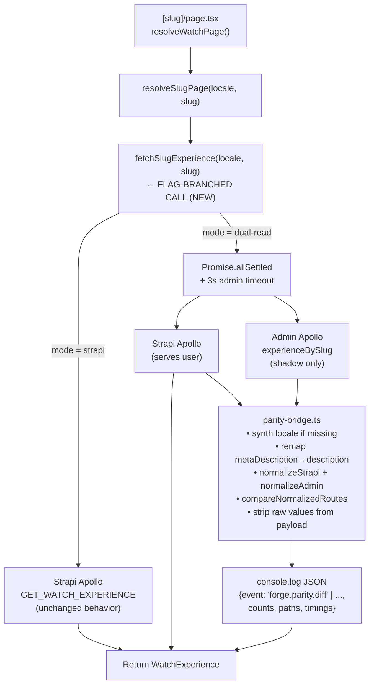

# feat(web): admin-core consumer migration — web canary (Unit 5)

## Summary

Stand up the **dual-read parity canary** for the admin-core consumer migration: wire one web data-access function (the slug-page Experience branch in `apps/web/src/lib/content.ts`) to fan out to admin's `experienceBySlug` GraphQL query _in parallel with Strapi_, in `dual-read` mode only. The user always sees Strapi; admin runs alongside for parity-signal collection via the U4 harness, emitting a structured log line per request. U5 ships only two modes: `strapi` (default — byte-identical to current `main`) and `dual-read` (canary). The two `admin`-rendering modes from origin R7 (`admin-with-fallback` and pure `admin`) are explicitly deferred to a follow-up unit (U5b) because they require a load-bearing admin→`WatchExperience` shape adapter, a rate-limit identity decision, R18a numeric thresholds, and R17 rollback mechanism — none of which are needed for parity-signal collection. Out of scope for U5: homepage, `/watch/[collection]/[video]/[locale]`, video-template fallback, sibling carousel — those depend on `videos` / `watchSetting` queries still gated on `read:videos` and migrate later.

---

## Problem Frame

Admin's `experienceBySlug` query has been PUBLIC since Unit 2 and the U4 parity harness landed in `packages/graphql/src/parity/` on commit `2447f093` — the harness produces a structured diff between Strapi and admin normalized responses, but no consumer route reads from it yet. Without a canary that exercises both sources against real production traffic on a single route, parity threshold rules in the brief (R18a) have no observable signal to advance against, mobile and TV (Unit 6) can't inherit a proven block-adapter pattern, and admin's PUBLIC widening for the remaining queries can't be sequenced by need. (See origin: `docs/brainstorms/2026-05-05-consumer-migration-implementer-brief-requirements.md`.)

---

## Requirements

- **R1.** A reversible env flag `FORGE_CONTENT_API` with **two** accepted values controls source for the migrated function in U5: `strapi` (default) and `dual-read`. Origin R7 names two additional values (`admin-with-fallback`, `admin`) which **U5 does not implement** — those modes ship in U5b and U5b adds them to the enum at that time.
- **R2.** Default behavior with the flag unset, empty, malformed, or `strapi` is byte-identical to current `main` for the targeted function. (Origin R6, R8.)
- **R3.** `dual-read` mode serves Strapi to the user and never lets an admin failure surface to the user-facing render. Admin runs in parallel via parity comparison; failures emit a structured log entry classified as `harness_error` and the request completes on Strapi alone. (Origin R8.)
- **R4.** _(Deferred to U5b — admin-mode rendering, including admin-with-fallback semantics, ships in the follow-up unit.)_
- **R5.** The migrated function is a new internal helper `fetchSlugExperience(locale, slug)` in `apps/web/src/lib/content.ts`, called from `resolveSlugPage`'s slug-equality branch (currently `getExperienceByFilters(locale, { slug: { eq: slug } })` at `content.ts:376`). `getExperienceByFilters` is **not modified** — it remains the homepage path's fetcher. The new helper isolates the canary surface from the homepage and video-template paths. (Origin R5.)
- **R6.** ISR / Full Route Cache and `unstable_cache(["watch-page"], { revalidate: 60 })` semantics are preserved across both modes. The flag is read at module scope from `process.env`; nothing in the migrated path uses `headers()` or `cookies()` for flag resolution. (Origin R11.)
- **R7.** `generateMetadata` and the migrated render-path produce equivalent `<title>`, `<meta name="description">`, OG/Twitter tags, and `not-found` semantics across modes for the canary route. In `dual-read`, this is verified via fixture parity in tests (the user-facing source is always Strapi; admin's metadata-relevant fields are normalized and diffed). (Origin R8, canonical plan U5 test scenarios.)
- **R8.** _(Deferred to U5b — `error.tsx` boundary at `apps/web/src/app/[slug]/error.tsx` ships only when admin-mode rendering ships, since the dual-read parity bridge already catches harness throws and never re-throws to the route.)_
- **R9.** `dual-read` parity diff output is structured, JSON-serializable, and emitted via `console.log` with a stable `event: "forge.parity.diff"` discriminator so Vercel/Railway log search can filter it. Includes route slug, locale, mode, diff counts per channel, **diff paths** (RFC6901 JSON Pointers), and Strapi+admin response times. (Origin R14, R15.)
- **R10.** The admin call in `dual-read` has its own per-call timeout (recommended 3000ms) strictly shorter than the route's existing 10s Strapi budget. A timed-out admin call is logged as `admin_timeout` and parity is skipped for that request. The admin Apollo singleton's `AbortSignal.timeout` is constructed inside the fetch override (per-call), never at module scope (per-process — would share one signal across all calls). (Origin R12, learning: outbound-timeout-shorter-than-caller-budget.)
- **R11.** Test coverage for the migrated function spans every `ContentApiMode` branch with a typed mock (Apollo error shapes, not `new Error("admin failed")`) and a regression snapshot proving default behavior unchanged. (Origin R13, learning: mocked-shape-vs-real-contract-discipline.)
- **R12.** All new code authored under U5 is enumerated in a deletion checklist co-located with the changes, listing every file, env var, log event, and consumer line that retires when admin becomes the sole source. The checklist references the harness's own checklist at `packages/graphql/src/parity/index.ts:1-34` so all three lists stay in sync. (Origin R20, learning: throwaway-operator-harness-deletion-contract.)
- **R13.** The structured `forge.parity.diff` log payload contains **only** counts per channel and JSON-Pointer paths. It MUST NOT carry raw `ValueDiff.strapi`, `ValueDiff.admin`, `SemanticDiff.strapi`, or `SemanticDiff.admin` field values from `compareNormalizedRoutes`'s `DiffReport`. Strapi-side title/description/OG/URL strings reaching log aggregation would bypass CMS access control. The full `DiffReport` (with values) is available in dev under a `FORGE_PARITY_DEBUG=1` opt-in only; production logs strip values unconditionally.

**Origin actors:** A1 (web canary operator — Urim, ships and watches diff signals), A2 (web end user — sees Strapi-served pages unchanged in dual-read), A3 (admin GraphQL surface — must keep `experienceBySlug` PUBLIC stable for the canary's lifetime).
**Origin flows:** F-web-canary-shadow (slug page → resolver → strapi/dual-read branch → render Strapi; admin runs shadow), F-parity-emit (admin response → normalize → compare → structured log).
**Origin acceptance examples:** AE1 (`FORGE_CONTENT_API` unset → byte-identical to main), AE2 (`dual-read` + admin error → user sees Strapi page + harness_error log entry), AE3 (`dual-read` + parity-clean response → user sees Strapi + zero-count diff log).

---

## Scope Boundaries

- Out of scope: homepage resolution path (`resolveHomepage`) — depends on `watchSetting` query not yet PUBLIC on admin.
- Out of scope: video-template fallback inside `resolveSlugPage` — depends on `videos` query not yet PUBLIC on admin.
- Out of scope: `/watch/[collection]/[video]/[locale]` route and its dedicated `resolveWatchVideo` resolver — separate flag surface, separate query (`getWatchVideoOperation`), part of U6.
- Out of scope: `resolveWatchVideoBySlug` (the 2-segment URL fallback) — same query coupling.
- Out of scope: `admin` and `admin-with-fallback` modes — both deferred to U5b. See "Follow-Up Unit (U5b) Outline" below.
- Out of scope: `error.tsx` boundary at `apps/web/src/app/[slug]/error.tsx` — ships in U5b alongside admin-mode rendering. The `parity-bridge.ts` already catches all harness throws (`AdminBlocksValidationError`, `StrapiNormalizationError`, `AdminNormalizationError`), so dual-read does not introduce a new escaping throw source.
- Out of scope: per-route or per-slug flag granularity (origin R7 / R17 question) — a single process-wide env var is the U5 mechanism. Per-route override mechanisms are deferred.
- Out of scope: rate-limit identity for web SSR calls (origin "must be addressed before consumer traffic reaches production" — applies to `admin` modes only; `dual-read` mode's admin call is already idempotent and shadow-traffic, but the identity question lands with U5b before users are flipped to admin).
- Out of scope: R18a numeric thresholds (parity diff rate, admin error rate, missing-content rate, fallback-save rate) — these gate `admin`-mode flips and ship with U5b.
- Out of scope: any change to `apps/cms/` (Strapi side). New helpers live exclusively under `apps/web/src/lib/`.
- Out of scope: mobile or TV adapters (U6).
- Out of scope: parity-diff CI gate (U7 surface — operator manually reviews stdout-emitted diffs for now).
- Out of scope: Apollo persisted-cache invalidation (mobile-only concern, deferred per origin R16).

### Deferred for later

- _(carried from origin)_ Per-route flag override — the brief's R17 "no redeploy rollback" claim depends on per-route or per-slug flag resolution, which neither U5 nor U5b's process-wide env var provides. R17's mechanism lands in U7. U5's rollback is **redeploy with `FORGE_CONTENT_API=strapi`**; mean-time-to-rollback is bounded by Railway's web-service deploy cycle.
- _(carried from origin)_ Apollo persisted-cache invalidation strategy for mobile (R16) — gated on cache-key versioning experiment outside U5.
- _(carried from origin)_ Strapi decommission — entirely separate plan after web + mobile + TV all reach parity-clean windows in `admin` mode.

### Deferred to Follow-Up Work

- **U5b — admin-mode rendering with shape adapter + threshold gates.** The follow-up unit ships the admin→`WatchExperience` shape adapter (load-bearing migration work, sketched below), `admin-with-fallback` and `admin` enum values, R18a numeric thresholds, R17-style rollback, web-SSR rate-limit identity, and the `error.tsx` boundary at `[slug]/`.
- Admin PUBLIC widening for `videoBySlug` / `video(id)` / `videos` / `watchSetting` — required before homepage and video-template branches can join the canary. Tracked under U6 admin-side prereqs.
- Parity-diff CI job — wired in U7. The canary writes structured logs only; no automated gate yet.
- Strapi nested-relation `pagination: { limit: -1 }` audit on `watchExperienceFragment` — separate hardening pass; if any nested relation truncates at Strapi's silent 10-row cap, parity diffs will surface false positives. Document the audit task in the U5 PR description so the canary's first-week diff review can spot it.

---

## Follow-Up Unit (U5b) Outline

This is a sketch, not a plan — recorded here so reviewers can see what U5 explicitly defers and why deferring is safe.

**Goal:** Enable user-facing admin-mode rendering (`admin-with-fallback` and pure `admin`) once the parity signal from U5's canary justifies it.

**Major work:**

1. **Admin → `WatchExperience` shape adapter.** Write a direct admin-`ExperienceLocale` → `WatchExperience` mapping (NOT through the harness's normalizers — those are designed for parity comparison, not rendering, and round-tripping is lossy). The adapter must:
   - Reverse-map admin's `kind` discriminator to Strapi's `__typename` (`mediaCollection` → `ComponentSectionsMediaCollection`, etc.) using `packages/graphql/src/parity/discriminator-map.ts` as reference
   - Reconstruct Strapi's `slots[].content[]` two-level container shape from admin's flat blocks list with `containerSlot` markers
   - Fabricate `ogImage.{width,height,alternativeText}` (admin emits only `ogImageUrl: String`, not the Strapi nested object) — likely as `null` until admin's image model widens
   - Round-trip every block kind through a per-block-type fixture test before flipping any user traffic
2. **Add `admin-with-fallback` and `admin` enum values** to `FORGE_CONTENT_API`. Origin R7's stage progression is `strapi → dual-read → admin-with-fallback → admin`. U5b ships values 3 and 4 plus the runbook stage names.
3. **R18a numeric thresholds.** Define parity-diff rate, admin-error rate, missing-content rate, and fallback-save rate with concrete numbers and observation duration in the runbook. Origin: "the requirement to define them before any route advances is hard."
4. **Web-SSR rate-limit identity.** Add `WEB_ADMIN_API_KEY` Bearer or capacity-test admin's anonymous bucket to confirm Railway egress doesn't starve real users. Without this, ISR revalidation bursts can return 429s.
5. **R17 rollback mechanism.** Per-route or per-slug flag resolution that doesn't require redeploy. Likely a config-store read with short TTL.
6. **`error.tsx` at `apps/web/src/app/[slug]/`.** Mirrors `[slug]/[locale]/error.tsx` shape. Catches any throw the parity bridge can't (e.g., admin-mode rendering's adapter failures).

**Why deferring is safe for U5:** the canary's value is the parity-signal pipeline (`dual-read`), not the user-facing flip. U5 collects diff data; U5b acts on it. Operators can run U5 indefinitely without ever flipping users to admin — that decision is what U5b enables.

---

## Context & Research

### Relevant Code and Patterns

- `apps/web/src/lib/content.ts:235-252` — `getExperienceByFilters(locale, filters)` is the existing shared fetcher (homepage + slug). U5 does NOT modify this function; instead it introduces a new sibling `fetchSlugExperience(locale, slug)` used only by the slug branch.
- `apps/web/src/lib/content.ts:371-408` — `resolveSlugPage` is the only caller of the slug-branch fetcher. Its existing `if (explicitExperience) return …` shape stays unchanged; the inner fetch is what U5 routes through the new helper.
- `apps/web/src/lib/client.ts` — Apollo singleton pattern for Strapi: `HttpLink` with `fetchPolicy: "no-cache"`, 10s `AbortSignal.timeout` constructed _inside_ the fetch override (per-call), server-only Bearer auth. The admin client mirrors this with deltas: anonymous PUBLIC (no Bearer), 3000ms timeout (R10).
- `apps/web/src/lib/fragments/watch-experience.ts` — `WatchExperience` fragment selecting 15 block types via inline `... on Component…`. **The fragment must select `locale`** (Strapi normalizer requires it; current fragment does NOT select `locale` — verify and add as part of U3 if missing).
- `apps/web/src/env.ts` — `createEnv()` from `@t3-oss/env-nextjs`. `NEXT_PUBLIC_CANONICAL_ORIGIN` (lines 44-78) has a `.refine()` host allowlist — U5's `ADMIN_GRAPHQL_URL` mirrors that pattern to prevent SSRF/misconfiguration.
- `apps/web/src/lib/content.test.ts` — existing pattern: `vi.hoisted` queryMock + `await import("./content")` after setup. Same shape extends to a parallel `adminQueryMock` for U5's mocking needs.
- `packages/graphql/src/parity/index.ts` — public surface: `compareNormalizedRoutes`, `normalizeStrapi`, `normalizeAdmin`, plus typed errors (`AdminBlocksValidationError`, `StrapiNormalizationError`, `AdminNormalizationError`). Imported via `@forge/graphql/parity`.
- `packages/graphql/src/parity/normalize-strapi.ts:158-163` — `if (!input.locale) throw new StrapiNormalizationError(…)`. The parity bridge MUST ensure `locale` is on the Strapi response before invoking the normalizer — either by selecting it in the fragment or by synthesizing `{ ...response, locale: urlLocale }` at the bridge boundary.
- `packages/graphql/src/parity/normalize-admin.ts:52-65` — `AdminExperienceLocaleInput` consumes a field named `description`, NOT `metaDescription`. The admin schema (`apps/admin/schema.graphql:130-150`) emits `metaDescription` and `ogDescription`, no plain `description`. The parity bridge MUST remap `metaDescription → description` before calling `normalizeAdmin`.
- `packages/graphql/src/parity/compare.ts` — `ValueDiff.strapi` and `ValueDiff.admin` (and `SemanticDiff.{strapi,admin}`) carry verbatim raw field values. R13 forbids these from reaching the production log payload.
- `apps/admin/schema.graphql:523` — `experienceBySlug(locale: String!, slug: String!): ExperienceLocale`. PUBLIC.
- `packages/graphql/src/admin.ts` — `adminGraphql()` factory exported from `@forge/graphql`. The U5 admin query uses this factory, not `graphql()`.

### Institutional Learnings

- **`docs/solutions/architecture-patterns/dual-client-gql-tada-multi-schema-codegen-pattern-20260507.md`** — defines the `graphql()` vs `adminGraphql()` factory split U5 calls. Trap 1 (`document.toString()` returns `[object Object]`) and Trap 2 (untyped `res.json()` defeats typed wrapper) bite at the HTTP boundary; mitigated by routing the admin call through Apollo + the `adminGraphql()` factory rather than raw fetch.
- **`docs/solutions/best-practices/throwaway-operator-harness-deletion-contract-20260430.md`** — applied verbatim to U5's flag, dual-read branch, log event, and env vars. Deletion checklist co-located in `apps/web/src/lib/content-api-mode.ts`, cross-referenced from `apps/web/src/lib/parity-bridge.ts` and `packages/graphql/src/parity/index.ts`.
- **`docs/solutions/best-practices/mocked-shape-vs-real-contract-discipline-20260506.md`** — the `dual-read` admin-error test must throw a typed Apollo error (`networkError` / `graphQLErrors` shape), not a plain `Error`. Mutation-test the dual-read Strapi-fall-through branch by deleting it locally and confirming a test fails.
- **`docs/solutions/best-practices/outbound-timeout-shorter-than-caller-budget-20260506.md`** — admin Apollo call in `dual-read` wraps with `AbortSignal.timeout` constructed per-fetch (NOT at module scope). Strapi budget is 10s (existing); admin budget is 3s (R10).
- **`docs/solutions/web/nextjs-headers-defeats-route-cache.md`** — read `FORGE_CONTENT_API` at module scope only. NEVER reach for `headers()` or `cookies()` to make the flag per-request inside the page route — that path silently disables the Full Route Cache and breaks `/api/revalidate`.
- **`docs/solutions/web/nextjs16-cachecomponents-isr.md`** — both Strapi and admin Apollo calls use `fetchPolicy: "no-cache"`. The Next.js Full Route Cache (`unstable_cache` + `revalidatePath`) is what gives U5's caching; Apollo is intentionally stateless across server requests.
- **`docs/solutions/design-patterns/branched-orchestrator-opt-in-mode-pattern-20260429.md`** — the migrated function has one signature; mode-branching happens once at the smallest divergence point (the inner fetch) and rejoins at the response boundary. Unknown env values warn and fall back to `"strapi"`; never throw.
- **`docs/solutions/best-practices/test-first-regression-snapshot-byte-identical-default-20260429.md`** — the _first_ commit on the U5 PR is a JSON-equality regression snapshot of `fetchSlugExperience`'s output across `mode ∈ {undefined, null, "", "strapi", "garbage"}`, paired with `expect(adminFetch).not.toHaveBeenCalled()` for default-mode aliases.
- **`docs/solutions/logic-errors/strapi-graphql-pagination-cap-wrong-language-watch-page-20260504.md`** + **`docs/solutions/performance-issues/strapi-nested-relation-truncation-and-n-plus-one-manager-20260328.md`** — Strapi v5 GraphQL silently caps nested relations at 10 rows when `pagination` is omitted. Audit `watchExperienceFragment` for missing `pagination: { limit: -1 }` BEFORE U5 lands; otherwise admin's complete response will look like a parity diff when Strapi is the truncated side.
- **`docs/solutions/integration-issues/mobile-relative-image-url-no-base-origin-20260408.md`** — applies to the differ's `baseOrigin` parameter. Pass `NEXT_PUBLIC_CANONICAL_ORIGIN` (already exists in `apps/web/src/env.ts:44-78`) so harness URL canonicalization treats Strapi's relative paths and admin's absolute paths as equivalent.
- **`docs/solutions/integration-issues/strapi-v5-graphql-error-extensions-stripping-20260413.md`** — when the harness encounters error responses, classify on `message` content / errors-array presence, not `extensions.code`. The default `DEFAULT_ALLOW_LIST` may already cover this; verify before declaring a diff.
- **`docs/solutions/auth/spike-auth-header-must-be-env-gated.md`** — applies if any per-request override is added (it is NOT in U5's scope; this learning reinforces the "env-only, module-scope" decision).

### External References

- Next.js 16 App Router caching contract: `unstable_cache` + `revalidate` + `revalidatePath` + Full Route Cache. Already in use in `content.ts`; no new dependency.

---

## Key Technical Decisions

- **U5 ships only `strapi` (default) + `dual-read`. Admin-mode rendering defers to U5b.** Origin R7 names four flag values. U5's value is the parity-signal pipeline, which `dual-read` provides. Shipping `admin-with-fallback` and `admin` modes through the harness's normalizers conflates parity-comparison (lossy by design) with rendering (must be lossless). The admin→`WatchExperience` shape adapter is the migration's load-bearing work; deferring it to U5b protects the canary from blocking on adapter design and gives R18a thresholds + rate-limit identity their natural home.
- **Branch at the function level, not the route level.** A new internal helper `fetchSlugExperience(locale, slug)` is the one inner call that gets the dual-source treatment. `getExperienceByFilters` is left untouched because it's also used by `resolveHomepage` (out of U5 scope). Rationale: the canary's narrow surface lines up exactly with what's PUBLIC on admin today.
- **Process-wide env flag, read at module scope.** `FORGE_CONTENT_API` is read once via `apps/web/src/env.ts` at module import. No `headers()`, `cookies()`, or per-request override. Rationale: per-request reads silently kill ISR (learning: nextjs-headers-defeats-route-cache); per-route granularity is deferred to U7.
- **`dual-read` runs admin in parallel, inline, with a hard 3s timeout.** Admin parity comparison is awaited inline against `Promise.race` so the diff log emits before the response completes. Diff signal lands in the same trace as the request. `after()`-style fire-and-forget was considered (see Alternatives) but rejected because the canary is low-traffic and we want the diff observably bound to its triggering request.
- **`AbortSignal.timeout` is constructed inside the fetch override, not at module scope.** This is a foot-gun call-out: capturing the signal at module scope means all admin requests share one signal that aborts 3s after process start. The existing `client.ts:20-21` pattern is the verbatim reference.
- **Admin client mirrors Strapi's Apollo singleton shape.** New `apps/web/src/lib/admin-client.ts` mirrors `apps/web/src/lib/client.ts` — Apollo with `HttpLink`, `InMemoryCache`, `AbortSignal.timeout(3000)` per-call, no Bearer (admin's PUBLIC scope is anonymous). Future `admin`-mode work in U5b reuses this client.
- **`ADMIN_GRAPHQL_URL` carries a host allowlist `.refine()`.** Mirrors `NEXT_PUBLIC_CANONICAL_ORIGIN`'s allowlist shape (`.jesusfilm.org`, `.railway.app`, `localhost`, `127.0.0.1`). Warn-only — does not throw on misconfiguration but emits a visible boot warning. Rationale: defense against Railway env-var paste-error pointing prod web at staging admin (or worse, an internal Railway service).
- **Use the U4 normalizers + `compareNormalizedRoutes` directly; do NOT call `runLiveComparison`.** `runLiveComparison` is operator-only (gated on `FORGE_PARITY_LIVE`) and does its own fetching. U5 already has both responses in hand; the cleaner integration is to feed them through the normalizers directly.
- **Normalizer-input adaptation happens at the bridge boundary, not by changing the harness.** The bridge synthesizes `{ ...strapiResponse, locale: urlLocale }` if the fragment doesn't already select `locale`, and remaps `{ metaDescription: x }` → `{ description: x }` before calling `normalizeAdmin`. Rationale: U5 changes consumers, not harness internals.
- **Structured log line strips raw values; emits counts + paths only.** R13. The full `DiffReport` (with `ValueDiff.strapi`/`admin` raw fields) is available in dev under `FORGE_PARITY_DEBUG=1`; production logs ship paths and counts only. Rationale: log aggregation (Vercel/Railway) indexes content; raw draft titles must not bypass CMS access control.
- **Add a fifth log event `forge.parity.strapi_failed_admin_succeeded` for the asymmetric-success case.** When Strapi throws but admin succeeds in `dual-read`, the user sees the Strapi error (since Strapi is the served source) but the operator gets the cleanest "admin is ready" signal — admin handled traffic Strapi couldn't. This is the gating evidence for advancing the canary; silently dropping it (as the prior plan version did) skews diff-rate during outages.
- **Allow-list passed through unchanged from harness defaults for U5 launch.** `DEFAULT_ALLOW_LIST` from `@forge/graphql/parity` is used as-is. If the canary's first-week diffs surface noise we know is non-actionable, extend the allow-list inline in U5's bridge file with citations to the relevant learnings.

---

## Open Questions

### Resolved During Planning

- **Q: Which canary route?** _Resolved:_ the function `fetchSlugExperience` for the slug-page Experience branch, which the `[slug]/page.tsx` and `[slug]/[locale]/page.tsx` routes both transit. Branching at the function level keeps the surface narrow and dependent only on `experienceBySlug` PUBLIC.
- **Q: Inline parallel admin call vs `after()` fire-and-forget?** _Resolved:_ inline parallel with 3s timeout. Diff signal lands in the same trace as the request; the timeout already protects user-facing budget.
- **Q: Admin client — Apollo singleton or raw fetch?** _Resolved:_ Apollo singleton mirroring `client.ts` shape. Future migrations of additional queries reuse the same client without introducing a new transport.
- **Q: Should U5 ship admin-mode rendering?** _Resolved (post-review):_ No. Admin-mode rendering defers to U5b because the admin→`WatchExperience` shape adapter is load-bearing migration work that should not block the canary. U5's value is the parity-signal pipeline (dual-read only).
- **Q: How does the flag interact with `generateMetadata` and ISR?** _Resolved:_ the same `unstable_cache(["watch-page"], { revalidate: 60 })` wraps every mode. Cache key stays the same — different content sources (`dual-read` vs `strapi`) don't get separate cache entries because user-facing source in `dual-read` IS Strapi.
- **Q: Where do diffs land in dev vs staging vs prod?** _Resolved:_ stdout via `console.log(JSON.stringify(...))`. The `event: "forge.parity.diff"` discriminator works in every log surface (Vercel, Railway, local). Raw values stripped from production payload (R13).
- **Q: `FORGE_CONTENT_API` typing?** _Resolved:_ `z.enum(["strapi", "dual-read"]).default("strapi")` in `apps/web/src/env.ts` for U5. U5b adds `"admin-with-fallback"` and `"admin"`.
- **Q: How do we ensure `normalizeStrapi` doesn't throw on missing `locale`?** _Resolved:_ the bridge ensures `locale` is present before invoking the normalizer — either by adding `locale` to `watchExperienceFragment` (preferred) or by synthesizing `{ ...response, locale: urlLocale }` at the bridge boundary.
- **Q: How do we feed admin's `metaDescription` into `normalizeAdmin`'s `description` slot?** _Resolved:_ bridge-side remap `{ metaDescription: x } → { description: x }` before invoking `normalizeAdmin`. Documented in U2/U4. Renaming the harness's input field is also valid but out of U5 scope.
- **Q: Should the parity log carry diff values?** _Resolved (post-review):_ No — log aggregation indexes content; raw titles/descriptions/URLs would bypass CMS access control. Production payload carries paths + counts only; values available via `FORGE_PARITY_DEBUG=1` opt-in for dev.
- **Q: What about asymmetric-success cases (Strapi fails, admin OK)?** _Resolved (post-review):_ emit `forge.parity.strapi_failed_admin_succeeded` log event. Strapi error still propagates to user (Strapi is the served source); the log captures the gating evidence operators need.

### Deferred to Implementation

- **Allow-list extensions for known non-actionable diffs.** First-week canary surfaces the candidates; do not pre-emptively extend the allow-list — let real diff data drive the decision.
- **Whether to extend dual-read sampling under high traffic.** If diff-log volume becomes a Vercel/Railway log-cost concern, sample (e.g., 10%) instead of every request. Defer until canary's first week confirms whether volume is real.

---

## High-Level Technical Design

> _This illustrates the intended approach and is directional guidance for review, not implementation specification. The implementing agent should treat it as context, not code to reproduce._

The flag value is normalized at one boundary (the env-read site). Both modes return the same `WatchExperience` shape so `resolveSlugPage` and downstream renderers don't know which source served. In `dual-read`, the admin call is comparison-only — its return is fed to the differ but never used as the rendered value. **U5 has no `admin` branch; that's U5b.**

---

## Implementation Units

### U1. Add `FORGE_CONTENT_API` env flag + mode normalization helper + admin URL with allowlist

**Goal:** Wire the env vars, add a typed `ContentApiMode` enum, write a defensive normalizer, and add a host allowlist on `ADMIN_GRAPHQL_URL`. Co-locate the deletion checklist.

**Requirements:** R1, R2, R6, R12

**Dependencies:** None

**Files:**

- Modify: `apps/web/src/env.ts` (add `FORGE_CONTENT_API: z.enum(["strapi", "dual-read"]).default("strapi")` + `ADMIN_GRAPHQL_URL: z.url().refine(...)` to `server` + `runtimeEnv` blocks)
- Create: `apps/web/src/lib/content-api-mode.ts` (exports `ContentApiMode`, `getContentApiMode()`, `normalizeContentApiMode(raw: unknown)`, plus the deletion checklist as a top-of-file docstring matching `packages/graphql/src/parity/index.ts`'s shape and cross-referencing it)
- Test: `apps/web/src/lib/content-api-mode.test.ts`

**Approach:**

- `getContentApiMode()` reads `env.FORGE_CONTENT_API` once at module scope and returns a closed `ContentApiMode = "strapi" | "dual-read"` union. Module-scope read protects ISR.
- `normalizeContentApiMode(raw)` accepts `unknown`, returns the union, and `console.warn`s on unrecognized values before falling back to `"strapi"`.
- `ADMIN_GRAPHQL_URL` `.refine()` mirrors `NEXT_PUBLIC_CANONICAL_ORIGIN`'s allowlist (`apps/web/src/env.ts:44-78`): accept hosts in `.jesusfilm.org`, `.railway.app`, `localhost`, `127.0.0.1`. Warn-only; does not throw on misconfiguration.
- Top-of-file docstring lists every artifact the U5 PR introduces (env vars, deletion targets, related branches in `content.ts`, log event names, `admin-client.ts`, `parity-bridge.ts`, the new test files). Cross-references `packages/graphql/src/parity/index.ts:1-34` so all three checklists stay in sync.

**Patterns to follow:**

- `apps/web/src/env.ts:44-78` — `.refine()` allowlist with warn-only behavior.
- `packages/graphql/src/parity/index.ts:1-34` — deletion-checklist docstring shape.

**Test scenarios:**

- Happy path: `FORGE_CONTENT_API="strapi"` → `getContentApiMode() === "strapi"`.
- Happy path: `FORGE_CONTENT_API="dual-read"` → returns `"dual-read"`.
- Edge case: env unset → returns `"strapi"` via `z.enum.default`.
- Edge case: `normalizeContentApiMode(undefined)` returns `"strapi"` without warning.
- Edge case: `normalizeContentApiMode("DUAL-READ")` (wrong case) returns `"strapi"` and emits a `console.warn`.
- Edge case: `normalizeContentApiMode("admin")` (U5b value, not yet in U5 enum) returns `"strapi"` and warns. (Catches early flag misuse during U5b's transition.)
- Edge case: `normalizeContentApiMode(42)` (wrong type) returns `"strapi"` with warn.
- Boot path: `ADMIN_GRAPHQL_URL` set to `https://admin.jesusfilm.org/api/graphql` boots clean.
- Boot path: `ADMIN_GRAPHQL_URL` set to a non-allowlisted host (e.g., `https://attacker.example/graphql`) boots with a `console.warn`. (Warn-only — does not throw.)

**Verification:**

- `pnpm --filter @forge/web typecheck` clean.
- New test file passes.
- `apps/web/src/env.ts` schema validates a startup boot under each accepted value.

---

### U2. Admin GraphQL client + `experienceBySlug` operation

**Goal:** Stand up a server-side Apollo singleton pointed at admin's GraphQL URL and define the `experienceBySlug` operation using `adminGraphql()`.

**Requirements:** R3, R10

**Dependencies:** U1 (needs `env.ADMIN_GRAPHQL_URL`)

**Files:**

- Create: `apps/web/src/lib/admin-client.ts` (Apollo singleton — `HttpLink` + `InMemoryCache` + per-call `AbortSignal.timeout(3000)`, anonymous, no Bearer)
- Create: `apps/web/src/lib/fragments/admin-experience.ts` (exports `adminExperienceBySlugOperation` — `adminGraphql()`-built query selecting `id`, `slug`, `locale`, `title`, `metaDescription`, `ogImageUrl`, `ogTitle`, `ogDescription`, `pathSegment`, `blocks`)
- Modify: `apps/web/src/lib/fragments/index.ts` (re-export)
- Test: `apps/web/src/lib/admin-client.test.ts` (covers per-call timeout shape; full integration covered in U3 tests)

**Approach:**

- `admin-client.ts` mirrors `client.ts` byte-for-byte except: (a) URL from `env.ADMIN_GRAPHQL_URL`, (b) no auth headers, (c) 3000ms timeout, (d) module-scope singleton.
- **`AbortSignal.timeout(3000)` MUST be created inside the fetch override (per-call), NOT at module scope.** Module-scope construction shares a single signal across all admin requests that fires 3s after process start. The verbatim pattern is `apps/web/src/lib/client.ts:20-21`.
- `adminExperienceBySlugOperation` uses `adminGraphql()` factory imported from `@forge/graphql`. Selection set selects every field the admin schema exposes that the parity bridge will need; `metaDescription` is the field name (NOT `description` — that mismatch is handled at the bridge in U4).
- The operation is named `GetAdminExperienceBySlug` for log-trace correlation.

**Patterns to follow:**

- `apps/web/src/lib/client.ts:20-21` — per-call `AbortSignal.timeout` inside the fetch override.
- `apps/web/src/lib/fragments/watch-experience.ts` — `graphql(`...`)` operation export shape, but using `adminGraphql()` instead of `graphql()`.

**Test scenarios:**

- Happy path: client instance is constructed once and reused across calls (singleton check via referential equality).
- Edge case: client respects per-call 3000ms timeout. Asserted by mocking `fetch` to delay 5000ms and confirming `AbortError` surfaces under 3500ms on the **second** call too (catches the module-scope foot-gun where the second call would already have an exhausted signal).
- Type contract: `ResultOf<typeof adminExperienceBySlugOperation>` includes the 10 selected fields and types match what the admin schema declares (gql.tada compile-time check).

**Verification:**

- `pnpm --filter @forge/graphql generate` regenerates `admin-graphql-env.d.ts` cleanly.
- `pnpm --filter @forge/web typecheck` clean.
- Per-call timeout asserted via the second-call mock pattern.

---

### U3. Branch `fetchSlugExperience` for `dual-read` + audit Strapi `locale` fragment

**Goal:** Introduce `fetchSlugExperience(locale, slug)` as a new internal helper in `content.ts`, branch on `getContentApiMode()`, fan out to admin in `dual-read` mode, ensure the Strapi response carries `locale` for the harness, and emit five distinct log events including the asymmetric-success case.

**Requirements:** R3, R5, R6, R10

**Dependencies:** U1, U2

**Files:**

- Modify: `apps/web/src/lib/content.ts` (introduce `fetchSlugExperience(locale, slug)`; `resolveSlugPage` calls this instead of `getExperienceByFilters` for the slug-equality case at line 376; `resolveHomepage` and the legacy-homepage call at line 362 keep calling `getExperienceByFilters` directly with the homepage filter)
- Modify: `apps/web/src/lib/fragments/watch-experience.ts` (audit: confirm `locale` is selected; if absent, add it. The Strapi normalizer requires `locale` on its input shape and will throw `StrapiNormalizationError` if missing)
- Modify: `apps/web/src/lib/content.test.ts` (existing tests use `getExperienceByFilters`; verify they don't drift)

**Approach:**

- `fetchSlugExperience(locale, slug)` reads the mode at call time (`getContentApiMode()` is module-cached, so it's a function-call's worth of overhead).
- `strapi` branch: calls `getExperienceByFilters(locale, { slug: { eq: slug } })` — identical to current behavior. **Returns the Strapi response unchanged to the caller.**
- `dual-read` branch: serves Strapi as primary; awaits `Promise.allSettled([strapiCall, adminCallWithTimeout])`. After Strapi resolves (success or failure), it returns to the caller; the admin response is handed to `parity-bridge.ts` (U4) for diff emission. Admin failure or timeout never affects user-facing render.
- **`locale` audit before merge:** verify `watchExperienceFragment` selects `locale`. If not, add it as part of this unit's PR. Alternative: have `parity-bridge.ts` synthesize `{ ...strapiResponse, locale: urlLocale }` before invoking `normalizeStrapi` (the plan recommends adding to the fragment so the data-shape is honest at the GraphQL boundary).
- **Five log events** in `dual-read` mode:
  - `forge.parity.diff` — both sides resolved; harness emitted a diff (counts may be all-zero or non-zero)
  - `forge.parity.admin_timeout` — admin call exceeded 3000ms
  - `forge.parity.harness_error` — `AdminBlocksValidationError` / `StrapiNormalizationError` / `AdminNormalizationError` (with `subkind` field naming the specific class)
  - `forge.parity.strapi_failed_admin_succeeded` — Strapi threw, admin returned a payload (the cleanest "admin is ready" signal — gating evidence for U5b's flag advance)
  - `forge.parity.both_failed` — both sides threw (rare; Strapi error propagates to user)

**Patterns to follow:**

- `apps/web/src/lib/content.ts:235-252` — the existing `getExperienceByFilters` body.
- `docs/solutions/design-patterns/branched-orchestrator-opt-in-mode-pattern-20260429.md` — branched-orchestrator pattern: one signature, branch once at smallest divergence point, share everything downstream.

**Test scenarios:**

- _(Covers AE1.)_ Happy path: `mode === "strapi"` → calls `client.query` with `GET_WATCH_EXPERIENCE`, never calls `adminClient.query`. Assert `expect(adminQueryMock).not.toHaveBeenCalled()`.
- Happy path: `mode === "dual-read"` → serves Strapi (assert returned value matches Strapi mock); also calls admin in parallel; emits one `console.log` with `event: "forge.parity.diff"`.
- _(Covers AE2.)_ Error path: `mode === "dual-read"` + admin throws `ApolloError` (typed shape: `Object.assign(new Error("network"), { name: "ApolloError", networkError: ... })`) → user gets Strapi value; one log entry with `event: "forge.parity.harness_error"`. **No** `forge.parity.diff` entry. Mutation-test by deleting the catch and confirming the test fails with an unhandled rejection.
- Error path: `mode === "dual-read"` + admin times out (`fetch` delays 5000ms) → user gets Strapi value; log entry has `event: "forge.parity.admin_timeout"` and includes the timeout duration.
- Error path: `mode === "dual-read"` + Strapi throws + admin succeeds → Strapi error propagates (the user-facing source is still Strapi); admin response is observed; log entry `event: "forge.parity.strapi_failed_admin_succeeded"` with no `diffCounts` (no Strapi side to compare against). **This is the canary's gating signal for advancing.**
- Error path: `mode === "dual-read"` + both throw → Strapi error propagates; log entry `event: "forge.parity.both_failed"`.
- Edge case: `mode === "dual-read"` + Strapi response missing `locale` → bridge logs `forge.parity.harness_error` subkind `strapi_normalization` (verifies the audit catches missed fragment additions). After fragment audit, this case becomes unreachable.
- Integration: `resolveSlugPage` callsite continues to return the same `ResolvedWatchPage` shape across both modes for the same input slug.

**Verification:**

- All `apps/web/src/lib/content.test.ts` cases pass under each mode.
- Mode transitions don't change `WatchExperience`'s observable shape from `resolveSlugPage`'s perspective.
- `watchExperienceFragment` selects `locale` (verified manually at PR time).
- `pnpm --filter @forge/web typecheck`, `test`, `lint`, `build` all clean.

---

### U4. Wire harness comparator + structured parity log + regression snapshot

**Goal:** Build the `parity-bridge.ts` adapter that takes Strapi and admin responses (already in hand from U3), feeds them to the U4 harness normalizers + comparator with input-shape adaptation, and emits a single structured log line whose payload contains counts and paths only — never raw values. Land the byte-identical regression snapshot as the first commit.

**Requirements:** R3, R7, R9, R10, R11, R12, R13

**Dependencies:** U2 (admin response shape), U3 (provides both responses)

**Files:**

- Create: `apps/web/src/lib/parity-bridge.ts` (exports `runDualReadComparison(strapi, admin, { slug, locale, mode, urlLocale })`; logs internally via `console.log`. Also exports the typed log event names as a closed union for testing)
- Create: `apps/web/src/lib/parity-bridge.test.ts`
- Create: `apps/web/src/lib/__tests__/content-mode-regression.test.ts` (byte-identical regression snapshot — see Execution note)
- Modify: `apps/web/src/lib/content.test.ts` (add the canonical scenarios from `docs/plans/2026-04-22-001-feat-admin-core-consumer-migration-plan.md:295-301`, adapted to U5's two-mode scope)

**Execution note:** Land the regression snapshot as the **first commit** of U5's PR (before any code under U1-U3). It captures `fetchSlugExperience` (slug case) output across `mode ∈ {undefined, null, "", "strapi", "garbage"}` against `main`'s behavior. After U1-U3 land, this test must continue to pass — proving "default unchanged" is structurally enforced. Each non-default mode also asserts `expect(adminQueryMock).not.toHaveBeenCalled()` to catch the "future refactor dispatches admin unconditionally" trap (learning: test-first-regression-snapshot-byte-identical-default).

**Approach:**

- `runDualReadComparison(strapi, admin, { slug, locale, mode, urlLocale })`:
  1. **Input adaptation at the bridge boundary:**
     - If `strapi.locale` is missing (fallback for fragment audit gap), synthesize `{ ...strapi, locale: urlLocale }`.
     - Remap admin response `{ metaDescription, ... }` → `{ description: metaDescription, ... }` before invoking `normalizeAdmin` (admin schema has no `description` field; harness's input shape consumes `description`).
  2. Call `normalizeStrapi(adapted, { urlLocale, baseOrigin })` and `normalizeAdmin(adapted, { urlLocale, baseOrigin })`.
  3. Call `compareNormalizedRoutes(strapi, admin, { urlLocale, allowList: DEFAULT_ALLOW_LIST })`.
  4. **Strip raw values from the payload before logging** — emit only `{ event, route, slug, locale, mode, timings, diffCounts, diffPaths, allowListedHits }`. `diffPaths` is an array of RFC6901 JSON Pointers from each `DiffReport.{structural,value,order,semantic,potentiallyTruncated}[*].path`. The `strapi`/`admin` raw fields on `ValueDiff`/`SemanticDiff` are NEVER serialized to the log line. (R13.)
  5. `console.log(JSON.stringify(payload))` with `event: "forge.parity.diff"`.
- `baseOrigin` for both normalizers comes from `env.NEXT_PUBLIC_CANONICAL_ORIGIN` (already exists in `apps/web/src/env.ts:44-78`) so relative-vs-absolute image URLs canonicalize equivalently.
- Catches three error shapes from the harness: `AdminBlocksValidationError`, `StrapiNormalizationError`, `AdminNormalizationError`. Each maps to `event: "forge.parity.harness_error"` with a `subkind` field. **No re-throw** — the bridge isolates harness failures from the main render path. (This is why R8's `error.tsx` is deferred to U5b: the bridge already catches every harness throw.)
- **Dev-only debug payload:** when `process.env.FORGE_PARITY_DEBUG === "1"`, the log payload additionally includes `diffSamples: { strapi: <raw>, admin: <raw> }[]` for the first 3 diffs. Production (`FORGE_PARITY_DEBUG` unset) NEVER includes these.
- The deletion checklist in `parity-bridge.ts`'s top-of-file docstring lists: this file, every log event name, the `@forge/graphql/parity` dependency, the `FORGE_PARITY_DEBUG` env var. Cross-references `apps/web/src/lib/content-api-mode.ts` (U1's checklist) and `packages/graphql/src/parity/index.ts:1-34` (harness's checklist) so all three lists stay in sync.

**Patterns to follow:**

- `packages/graphql/src/parity/live.ts` — the harness's own bridge shape. U5's bridge is the consumer-side mirror: takes responses in instead of fetching them, adapts inputs, emits logs instead of returning structured payloads.
- `docs/solutions/best-practices/throwaway-operator-harness-deletion-contract-20260430.md` — co-locate every retire-time artifact in this one file.

**Test scenarios:**

- _(Covers AE1.)_ Regression: `mode` value in `{undefined, null, "", "strapi", "garbage"}` → `fetchSlugExperience` returns Strapi-equivalent value byte-for-byte. Each case asserts `adminQueryMock` not called.
- Happy path: Strapi response with `locale` + admin response with `metaDescription` → bridge adapts both inputs and runs comparison successfully → log has all `diffCounts` zero, `event: "forge.parity.diff"`.
- Edge case: Strapi response **missing `locale`** + bridge synthesizes `{...strapi, locale: urlLocale}` → `normalizeStrapi` does not throw → comparison runs.
- Edge case: admin response with `metaDescription: "x"` → after bridge remap, `normalizeAdmin` consumes `{description: "x"}` → `NormalizedExperienceRoute.meta.description === "x"`. (Verifies the metaDescription→description bridge step.)
- Happy path: known structural diff (admin missing a block) → log has `diffCounts.structural >= 1` AND `diffPaths` includes the JSON Pointer for the missing block.
- Happy path: image URL canonicalization difference (Strapi relative `/uploads/foo.png`, admin absolute `https://canonical-origin/uploads/foo.png`) → after `normalizeStrapi`/`normalizeAdmin`, the differ reports zero `value` diffs.
- _(R13 enforcement.)_ Edge case: known `ValueDiff` (admin title differs from Strapi title) → log payload `diffCounts.value === 1`, `diffPaths` includes the path, payload **does NOT** contain the raw title strings. JSON.parse the log line and assert no key path leads to either Strapi's or admin's title text.
- Dev opt-in: with `FORGE_PARITY_DEBUG=1`, the same scenario above DOES include `diffSamples` with raw values (verifies the dev path works without leaking by default).
- Error path: admin response causes `AdminBlocksValidationError` → log `event: "forge.parity.harness_error"`, `subkind: "admin_blocks_validation"`. No re-throw.
- Error path: strapi response is malformed → `StrapiNormalizationError` caught → log `event: "forge.parity.harness_error"`, `subkind: "strapi_normalization"`. No re-throw.
- Edge case: log payload is JSON-parseable. Round-trip via `JSON.parse` and assert top-level shape.
- Integration: log event-name union exported from the module covers exactly the five events used in the codebase. Delete one event-name from the union locally and confirm a `tsc` error.
- Integration: `generateMetadata` on a known canary slug produces identical `<title>`, `<meta description>`, `<og:title>`, `<og:image>` tags in `dual-read` and `strapi` modes for the same slug (driven by `getWatchPageMetadata` which already consumes `WatchExperience`-shaped data — and the user-facing source in `dual-read` is still Strapi).

**Verification:**

- `pnpm --filter @forge/web typecheck | test | lint | build` all clean.
- Regression snapshot passes against `main`'s captured baseline.
- Manual smoke under both modes against a local Strapi + admin (`FORGE_CONTENT_API=dual-read pnpm --filter @forge/web dev` + curl the canary slug + grep stdout for `forge.parity.diff`).
- R13 enforcement test asserts no raw content values in production payload.

---

## System-Wide Impact

- **Interaction graph:** `[slug]/page.tsx` and `[slug]/[locale]/page.tsx` both transit `resolveWatchPage` → `resolveSlugPage` → `fetchSlugExperience`. The flag affects the inner fetch only; route-level revalidation, `generateMetadata`, and the rendering pipeline are unchanged. `apps/web/src/components/sections/SectionRenderer.tsx` consumes the same `WatchExperience.blocks` shape regardless of mode. **No new throw source escapes to the route segment**, because `parity-bridge.ts` catches every harness error.
- **Error propagation:** Three harness error classes (`AdminBlocksValidationError`, `StrapiNormalizationError`, `AdminNormalizationError`) are caught by `parity-bridge.ts` and converted to log events; never propagate to render. Strapi errors propagate as today (existing `graphqlError` path).
- **State lifecycle risks:** `unstable_cache` keying is unchanged — both modes share the same cache tag `["watch-page"]`. Switching modes via redeploy implicitly invalidates because the deploy itself flushes the build-time cache.
- **API surface parity:** `WatchExperience` and `ResolvedWatchPage` exported types are unchanged. No consumer outside `content.ts` learns about the modes. `apps/web/src/components/*` and `apps/web/src/app/[slug]/*` are untouched at the type level.
- **Integration coverage:** The five log events plus regression snapshot exercise the cross-layer (resolver → fetch → harness → log) path. Manual smoke required for the live admin endpoint integration in dev.
- **Unchanged invariants:** ISR `revalidate: 60`. `unstable_cache` tag. Strapi Bearer-auth path for non-canary queries (`getWatchSettings`, `getVideoBySlug`, `getWatchVideoOperation`, etc.). `generateMetadata` shape and inputs. `ExperienceEmpty` and `ExperienceError` component contracts. The 1-segment `[slug]` route's existing inline error rendering (no `error.tsx`).

---

## Risks & Dependencies

| Risk                                                                                                                                                       | Mitigation                                                                                                                                                                                                                                                                         |
| ---------------------------------------------------------------------------------------------------------------------------------------------------------- | ---------------------------------------------------------------------------------------------------------------------------------------------------------------------------------------------------------------------------------------------------------------------------------- |
| Strapi nested-relation 10-row silent cap surfaces as parity diffs in canary's first week (false positives).                                                | Audit `watchExperienceFragment` for missing `pagination: { limit: -1 }` BEFORE U5 lands. Fix in a separate PR. Document remaining suspect relations in U5's PR description so the first-week diff review can spot them.                                                            |
| `BlocksSchema.parse` in `normalizeAdmin` throws on production admin data because admin's domain Zod is stricter than admin's JSON output.                  | Catch `AdminBlocksValidationError` inside `parity-bridge.ts`, log `event: "forge.parity.harness_error" subkind: "admin_blocks_validation"`. Never crashes user-facing render. After-the-fact fix: extend `BlocksSchema` or the admin write-side validator.                         |
| `watchExperienceFragment` does NOT select `locale` (verify before merge); `normalizeStrapi` will throw if absent.                                          | U3 audits the fragment. Bridge synthesizes `{...strapi, locale: urlLocale}` as defense-in-depth. Test scenario explicitly covers the missing-locale path.                                                                                                                          |
| Admin's `metaDescription` field name conflicts with harness's `AdminExperienceLocaleInput.description` consumer.                                           | Bridge remaps at the boundary. Documented in U2/U4. Test scenario covers the remap.                                                                                                                                                                                                |
| Admin GraphQL endpoint reachable from web in dev/preview but not yet in prod due to network/CORS/origin gaps.                                              | Pre-flight check: hit admin's `__typename` query from each environment before flipping `FORGE_CONTENT_API` to `dual-read`. Document the curl in U5's PR.                                                                                                                           |
| Apollo singleton constructed at module import fails boot when `ADMIN_GRAPHQL_URL` is missing.                                                              | `env.ts` schema has `ADMIN_GRAPHQL_URL: z.url().refine(allowlist)` (required, not optional) — boot fails fast with a clear message rather than later at request time. Boot smoke test in U1's verification.                                                                        |
| `ADMIN_GRAPHQL_URL` host misconfiguration (Railway env-var paste error pointing prod web at staging admin or an internal Railway service).                 | Host allowlist `.refine()` matches `NEXT_PUBLIC_CANONICAL_ORIGIN`'s shape; warns visibly on misconfigured hosts. Operator notices in deploy logs. Not a hard failure (warn-only) so legitimate-but-unknown topologies don't brick boot.                                            |
| `AbortSignal.timeout` accidentally captured at module scope in `admin-client.ts` — all admin requests share one signal that aborts 3s after process start. | Explicit foot-gun call-out in U2 approach. Test asserts per-call timeout on the SECOND call (catches the module-scope failure mode).                                                                                                                                               |
| Admin call timeout fires aggressively on slow networks (3000ms is borderline).                                                                             | Start at 3000ms based on origin R12. Adjust upward (e.g., 5000ms) if first-week canary shows >1% timeout rate. Tracked in U5's PR description as a follow-up tuning knob.                                                                                                          |
| Diff log volume blows up Vercel/Railway logs in dual-read.                                                                                                 | Canary route is low-traffic. Each request emits exactly one log line with NO raw values (R13). If volume becomes a concern, add structured-log sampling.                                                                                                                           |
| Diff log payload leaks raw experience content (titles, descriptions, URLs) into log aggregation, bypassing CMS access control.                             | R13: production payload strips all `ValueDiff.{strapi,admin}` and `SemanticDiff.{strapi,admin}` fields; only counts + JSON-Pointer paths are emitted. Raw values available in dev under `FORGE_PARITY_DEBUG=1` opt-in. Test asserts no raw content reaches the production payload. |
| Three deletion checklists (harness's, content-api-mode.ts's, parity-bridge.ts's) drift apart over time.                                                    | U1 cross-references `packages/graphql/src/parity/index.ts:1-34`; U4 cross-references both. PR review checks all three include each other's references.                                                                                                                             |
| Easter PR (#167) lands first and depends on a `getWatchExperience` function that doesn't exist; rebase against U5 may surface fragmentation.               | Coordinate with the Easter PR author at U5 review time. The PR likely needs to use `resolveWatchPage` (the canonical public API), not the internal helpers U5 introduces.                                                                                                          |
| `feat/watch-download-proxy-hardening` (local branch, no PR) touches `content.ts` and `fragments/watch-video.ts`. Rebase conflicts likely.                  | Surface the U5 plan to that branch's author in advance. The download-proxy work is unrelated to data-source migration; conflicts will be mechanical.                                                                                                                               |

---

## Documentation / Operational Notes

- **Deletion checklist co-location and cross-references:** `apps/web/src/lib/content-api-mode.ts` (U1), `apps/web/src/lib/parity-bridge.ts` (U4), and `packages/graphql/src/parity/index.ts:1-34` (existing harness checklist) each carry a top-of-file deletion checklist. Each list cross-references the other two so any one going stale is caught at PR review. PR review checks this.
- **Env var rollout order:** `ADMIN_GRAPHQL_URL` deploys to all environments (dev/preview/staging/prod) BEFORE the U5 PR merges so Apollo singleton construction doesn't fail at boot. `FORGE_CONTENT_API` defaults to `strapi` so deploy-then-flip is the safe path.
- **U5 rollback (process-wide, redeploy-bounded):** Set `FORGE_CONTENT_API=strapi` in the affected environment + redeploy. No code revert needed. **R17's "no redeploy rollback" promise applies starting U7** (per-route flag resolution). U5's mean-time-to-rollback is bounded by Railway's web-service deploy cycle — flag the canary slug accordingly when triaging incidents. If a canary incident demands sub-deploy rollback, take the canary slug entirely off `dual-read` (set the flag back to `strapi`) and redeploy; if even that's unacceptable, the canary should not be enabled until U7's mechanism lands.
- **Canary advance protocol:** Origin R18a defines thresholds for advancing through `dual-read → admin-with-fallback → admin`. **U5 does not enable any advance** — it only emits the structured logs that R18a operates on. The actual threshold definition + advance mechanism land with U5b, before any user traffic is flipped to admin.
- **Inventory update required:** `docs/admin-core-migration/query-inventory.md` (Unit 1 inventory) must be updated with U5's new `graphql(` and `adminGraphql(` callsites. Failure to update is a known foot-gun (origin R20 lint candidate).
- **Roadmap:** Update `docs/roadmap/platform/feat-104-admin-core-consumer-migration-plan.md` `status` to `in-progress` when U5 starts; `complete` when U5 ships and the dual-read canary holds for one full week without P1 diff signals (no `forge.parity.harness_error` or `forge.parity.both_failed` events; <1% `forge.parity.admin_timeout` rate). Numeric thresholds for the eventual _advance to admin mode_ land with U5b.

---

## Sources & References

- **Origin document:** `docs/brainstorms/2026-05-05-consumer-migration-implementer-brief-requirements.md`
- **Canonical plan:** `docs/plans/2026-04-22-001-feat-admin-core-consumer-migration-plan.md` (U5 spec at lines 272-308)
- **U4 plan (just merged):** `docs/plans/2026-05-07-002-feat-consumer-migration-parity-harness-unit-4-plan.md`
- **Roadmap ticket:** `docs/roadmap/platform/feat-104-admin-core-consumer-migration-plan.md`
- **Parity harness:** `packages/graphql/src/parity/index.ts`, `packages/graphql/src/parity/compare.ts`, `packages/graphql/src/parity/normalize-strapi.ts`, `packages/graphql/src/parity/normalize-admin.ts`, `packages/graphql/src/parity/live.ts`
- **Dual-client gql.tada pattern:** `docs/solutions/architecture-patterns/dual-client-gql-tada-multi-schema-codegen-pattern-20260507.md`
- **Throwaway harness deletion contract:** `docs/solutions/best-practices/throwaway-operator-harness-deletion-contract-20260430.md`
- **Mocked-shape vs real-contract:** `docs/solutions/best-practices/mocked-shape-vs-real-contract-discipline-20260506.md`
- **Outbound timeout:** `docs/solutions/best-practices/outbound-timeout-shorter-than-caller-budget-20260506.md`
- **Branched orchestrator:** `docs/solutions/design-patterns/branched-orchestrator-opt-in-mode-pattern-20260429.md`
- **Test-first regression snapshot:** `docs/solutions/best-practices/test-first-regression-snapshot-byte-identical-default-20260429.md`
- **Strapi pagination cap:** `docs/solutions/logic-errors/strapi-graphql-pagination-cap-wrong-language-watch-page-20260504.md`, `docs/solutions/performance-issues/strapi-nested-relation-truncation-and-n-plus-one-manager-20260328.md`
- **Image URL canonicalization:** `docs/solutions/integration-issues/mobile-relative-image-url-no-base-origin-20260408.md`
- **Strapi error extensions stripping:** `docs/solutions/integration-issues/strapi-v5-graphql-error-extensions-stripping-20260413.md`
- **headers() defeats Full Route Cache:** `docs/solutions/web/nextjs-headers-defeats-route-cache.md`
- **Next.js 16 + Apollo ISR:** `docs/solutions/web/nextjs16-cachecomponents-isr.md`
- **Spike auth header env-gating:** `docs/solutions/auth/spike-auth-header-must-be-env-gated.md`
- **Related branches at planning time:** `feat/164-watch-easter` (PR #167), `feat/watch-download-proxy-hardening` (local), `feat/watch-page-sticky-hero`, `feat/watch-page-gutters-and-column-gap`
