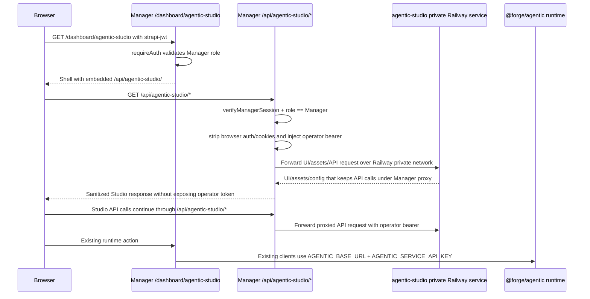

# feat: Manager-Gated Agentic Studio Access

## Summary

Add Mastra Studio as a Manager-gated operator screen without making the Studio Railway service publicly reachable. Manager becomes the browser-facing gate, validates an interactive Manager session on every Studio proxy request, and injects the Agentic operator bearer token server-side while keeping existing Manager-to-Agentic runtime calls on `AGENTIC_BASE_URL`.

---

## Problem Frame

`apps/agentic` already owns the Mastra runtime, Studio boundary, and operator/service bearer separation. The remaining gap is the user-facing access path: Studio needs to be available to authenticated Manager users, but not as a standalone public Railway URL or a browser-visible operator-token surface.

The origin brainstorm already chose a first-class Agentic app boundary and explicitly required Studio to be internal/operator-only (see origin: `docs/brainstorms/2026-05-01-agentic-runtime-app-requirements.md`). This plan narrows that into the Manager-gated proxy and Railway service setup needed for Studio access.

Terminology: **Agentic Studio** means Manager-gated access to Mastra Studio for the Agentic runtime. `agentic-studio` means the private Railway service that serves the Studio SPA.

---

## Assumptions

_This plan was authored without a synchronous scope-confirmation round. The items below are agent inferences that should be reviewed before implementation proceeds._

- `AGENTIC_OPERATOR_API_KEY` is intentionally present in both the Agentic runtime service and Manager service configuration, but the browser must never receive it.
- Studio should be embedded in Manager through an iframe or equivalent full-viewport shell that points at the Manager proxy, not by sending the browser to Railway private DNS.
- Production Manager should reject clearly public or untrusted `AGENTIC_STUDIO_ORIGIN` values in the primary path. Cloudflare Access fallback remains out of scope until a separate follow-up deliberately permits a public Studio origin.
- `MANAGER_API_KEY` and Agentic service bearer tokens should not grant Studio access; the Studio proxy is for interactive Manager sessions only.

---

## Requirements

- R1. Add `/dashboard/agentic-studio` as a Manager dashboard screen protected by the existing Manager login and role guard.
- R2. Allow every authenticated user whose Strapi role name is exactly `Manager` to access the Studio screen.
- R3. Add a Manager server-side proxy for Studio UI, assets, and required Mastra API calls under `/api/agentic-studio/[...path]`.
- R4. Validate the existing `strapi-jwt` Manager session with `verifyManagerSession` for every Studio proxy request and return `403` when the session is missing, invalid, or not a Manager role.
- R5. Forward Studio traffic only to configured `AGENTIC_STUDIO_ORIGIN`; fail closed with `503` when the origin or operator key is missing.
- R6. Use an outbound header allowlist for proxied Studio requests; never forward user-supplied `authorization`, cookies, forwarded/origin context, or hop-by-hop headers, then inject `Authorization: Bearer ${AGENTIC_OPERATOR_API_KEY}` server-side.
- R7. Keep `AGENTIC_OPERATOR_API_KEY` out of HTML, JavaScript, browser-visible request headers, logs, and client props.
- R8. Keep existing Manager-to-Agentic runtime clients on `AGENTIC_BASE_URL` and `AGENTIC_SERVICE_API_KEY`; do not route automation dry-run or subtitle enrichment through the Studio service.
- R9. Deploy a separate private Railway service named `agentic-studio` for Studio, with no public domain attached; Manager reaches it through Railway private networking.
- R10. Require Red/Green TDD for feature-bearing implementation units before implementation changes are accepted.
- R11. Require a browser user smoke test proving logged-out redirect, logged-in Studio visibility, no browser-visible operator token, proxy-only Studio traffic, and unchanged `AGENTIC_BASE_URL` runtime behavior.
- R12. Require same-origin protection for mutating proxy requests because the Manager cookie is converted into operator-level Studio authority.
- R13. Isolate the embedded Studio surface from non-Studio Manager APIs so proxied Studio JavaScript cannot freely act as the Manager origin outside the `/api/agentic-studio` path.

**Origin requirement mapping:**

- In scope for this plan: origin R2 internal/operator-only Studio access, origin R3 Manager as first consumer, the private-Studio-service subset of origin R6 deployment/docs/env conventions, and origin R7 source-of-truth boundaries.
- Preserved as inherited constraints from completed Agentic runtime work: origin R1 `apps/agentic` boundary, origin R4 explicit API/contracts and no cross-imports, and origin R5 approval-aware/constrained side-effect posture.
- Not reimplemented by this plan: already-scaffolded Agentic app health checks, package setup, and broader CI conventions from origin R6.

---

## Scope Boundaries

- Do not move Mastra Studio implementation into `apps/manager`; Studio remains part of the Agentic runtime boundary.
- Do not expose `agentic-studio` through a public Railway domain in the primary path.
- Do not add new live Agentic capabilities or Manager approval semantics; this is an access/proxy/deployment slice.
- Do not relax existing Agentic service/operator bearer separation.
- Do not use browser-side private Railway URLs; Railway private networking is server-to-server only.
- Do not rely on Manager middleware as the API security boundary; `/api/*` routes must enforce real session validation inside the route/helper.

### Deferred to Follow-Up Work

- Cloudflare Access fallback: only if Railway private networking cannot support the Studio service in the target environment.
- Mastra native SSO/RBAC: valuable defense in depth later, but this plan gates access through Manager's existing Strapi role.
- WebSocket-specific proxy support: defer unless the smoke test proves Studio requires WebSockets for core V1 usability.

---

## Context & Research

### Relevant Code and Patterns

- `apps/manager/src/app/dashboard/layout.tsx` and `apps/manager/src/lib/require-auth.ts` protect dashboard pages by validating `strapi-jwt` and role name `Manager`.
- `apps/manager/src/lib/auth.ts` exposes `verifyManagerSession`; avoid `authenticateRequest` for Studio proxy auth because it also accepts `MANAGER_API_KEY`.
- `apps/manager/src/middleware.ts` is a cookie-presence redirect helper only; it intentionally excludes `/api/*`.
- `apps/manager/src/features/shell/manager-shell.tsx` is the active dashboard shell/nav surface.
- `apps/manager/src/lib/admin-embed-route.ts` and `apps/manager/src/lib/agentic-automation-dry-run.ts` show Manager-side proxy/client patterns: typed failures, config-missing behavior, Zod validation, and bounded fetch timeouts.
- `apps/agentic/src/mastra/index.ts` and `apps/agentic/src/mastra/index.test.ts` already enforce operator bearer access to Studio/built-in APIs and service bearer access only to `/forge/*` routes.
- `apps/agentic/AGENTS.md` documents the current Agentic boundary and token separation.

### Institutional Learnings

- `docs/solutions/platform/adding-new-apps.md` and `docs/solutions/platform/new-app-ci-and-deployment-patterns.md`: per-service Railway config must be real deployment truth, env validation belongs in app config, and auth must be validated server-side.
- `docs/solutions/deployment/railway-dashboard-override-shadows-railway-toml-20260429.md`: per-service `railway.toml` is ignored unless Railway Config-as-code Path is explicitly configured; dashboard overrides can shadow repo config.
- `docs/solutions/platform/railway-mcp-staged-config-never-commits-20260420.md`: Railway config/env edits made through MCP must be flushed through the correct accept/deploy path before runtime proof is meaningful.
- `docs/solutions/security-issues/ssrf-defense-streaming-proxy-and-codeql-fp-20260504.md`: a proxy that carries privileged credentials needs a fixed upstream origin, strict header handling, redirect discipline, and timeout/error boundaries.
- `docs/solutions/best-practices/verify-infra-writes-via-independent-read-path-20260420.md`: deployment proof should read runtime behavior independently, not trust intended config.

### External References

- Mastra Studio deployment docs: `mastra studio` serves a standalone SPA that connects to a running Mastra server, and Studio must be secured in production because it has broad access to agents, workflows, and tools: https://mastra.ai/docs/studio/deployment
- Mastra Studio auth docs: `server.auth` protects both Studio UI and built-in/custom API routes; without auth, Studio and API routes are public: https://mastra.ai/docs/studio/auth
- Mastra CLI docs: `mastra studio` supports `--port`, `--server-host`, `--server-port`, `--server-protocol`, and `--server-api-prefix`: https://mastra.ai/reference/cli/mastra
- Railway private networking docs: private DNS is scoped to the same project/environment, uses `railway.internal`, and is not browser-accessible: https://docs.railway.com/private-networking
- Next.js Route Handler docs: App Router route handlers support standard Web Request/Response APIs, catch-all params, and all HTTP methods needed for a proxy: https://nextjs.org/docs/app/api-reference/file-conventions/route
- Next.js Proxy docs: Proxy can do optimistic routing, but is not a full session-management or authorization boundary: https://nextjs.org/docs/app/getting-started/proxy

---

## Key Technical Decisions

- Use a Manager server-side reverse proxy, not direct browser access to Studio: Railway private DNS and operator tokens are server-only concerns.
- Use `AGENTIC_STUDIO_ORIGIN` for Studio proxy traffic and keep `AGENTIC_BASE_URL` for existing Manager-to-Agentic runtime calls.
- Use session-cookie-only Manager role validation for Studio access. `MANAGER_API_KEY`, `AGENTIC_SERVICE_API_KEY`, and `MANAGER_AGENTIC_API_KEY` must not grant Studio access.
- Treat `AGENTIC_OPERATOR_API_KEY` as a server-side upstream credential. Manager injects it while proxying and strips all user-supplied credentials.
- Implement the proxy as an App Router catch-all route, likely optional catch-all internally so `/api/agentic-studio/` can serve the Studio root while preserving the requested `/api/agentic-studio/[...path]` public contract.
- Treat same-origin Studio routing as a contract, not a nice-to-have: Studio HTML/assets and browser-visible Studio API calls must stay under Manager's `/api/agentic-studio` path. Prefer `MASTRA_STUDIO_BASE_PATH=/api/agentic-studio` plus CLI server flags that produce same-origin API config; if Mastra cannot emit that shape, Manager must rewrite the Studio config/HTML before shipping.
- Treat embedded Studio JavaScript as untrusted third-party application code for Manager-origin purposes. The page should prefer a sandboxed iframe with the minimum capabilities Studio needs, restrictive CSP/framing policy, and/or a path-level API firewall that blocks Studio-origin requests from calling non-Studio Manager APIs; if any relaxation is required for Studio to work, it must be documented and smoke-tested.
- Treat Railway private-network binding as a required deploy proof: `agentic-studio` must listen on the private network, and the implementation must prove the chosen Studio command/env binds correctly before relying on `AGENTIC_STUDIO_ORIGIN`.
- Require Red/Green TDD for each feature-bearing unit and a user smoke test before PR readiness.

---

## Open Questions

### Resolved During Planning

- Should this move Mastra Studio into Manager? No. Studio remains Agentic-owned; Manager only gates and proxies access.
- Should all Manager-role users have access? Yes, per user request.
- Should browser users ever receive `AGENTIC_OPERATOR_API_KEY`? No. Manager injects it server-side only.
- Should existing Agentic runtime calls use the Studio service? No. Runtime calls stay on `AGENTIC_BASE_URL`.
- How should Studio avoid browser bypass? The fixed contract is same-origin Manager proxying under `/api/agentic-studio`; implementation may use Mastra base-path/CLI configuration or a tested Manager-side rewrite, but browser network proof must show no public Agentic runtime bypass.
- How should the private Studio service be created? Implementation must perform and verify the Railway service action path: create/configure `agentic-studio`, set the source of truth for build/start/env, remove any public domain, deploy, and read back the private/internal target.

### Deferred to Implementation

- Exact transport needs: verify whether Studio V1 core behavior works over HTTP/streaming route handlers or needs WebSocket support.
- Exact upstream status mapping: pass through normal Studio asset/API statuses after sanitization, but map config/network/auth boundary failures to controlled `403` or `503`.

---

## High-Level Technical Design

> _This illustrates the intended approach and is directional guidance for review, not implementation specification. The implementing agent should treat it as context, not code to reproduce._

---

## Implementation Units

### U1. Red Tests And Contract Lock

**Goal:** Establish failing tests for the Agentic Studio proxy, route page, env validation, runtime-origin separation, and Agentic operator/service auth boundary before implementation.

**Requirements:** R1, R2, R3, R4, R5, R6, R7, R8, R10, R11, R12

**Dependencies:** None

**Files:**

- Create: `apps/manager/src/app/api/agentic-studio/[[...path]]/route.test.ts`
- Create: `apps/manager/src/app/dashboard/agentic-studio/page.test.ts`
- Create: `apps/manager/src/lib/agentic-studio-proxy.test.ts`
- Modify: `apps/manager/src/config/env.test.ts`
- Modify: `apps/manager/src/lib/agentic-automation-dry-run.test.ts`
- Modify: `apps/manager/src/lib/agentic-subtitle-enrichment.test.ts`
- Modify: `apps/agentic/src/mastra/index.test.ts`

**Approach:**

- Write route tests first for missing cookie, invalid session, non-Manager session, valid Manager session, missing config, upstream failure, path/query/body forwarding, and header stripping.
- Write page tests proving `/dashboard/agentic-studio` renders the Manager shell route and points only at the Manager proxy.
- Add runtime-origin regression tests where `AGENTIC_STUDIO_ORIGIN` and `AGENTIC_BASE_URL` differ, proving existing runtime clients still call `AGENTIC_BASE_URL`.
- Keep Agentic auth tests green for operator/service bearer separation.

**Execution note:** Red/Green TDD is required. Start this unit by committing or at least demonstrating failing tests that describe the desired behavior before implementing U3-U5.

**Patterns to follow:**

- `apps/manager/src/app/api/automations/[id]/agentic-dry-run/route.test.ts`
- `apps/manager/src/app/dashboard/agents/page.test.ts`
- `apps/agentic/src/mastra/index.test.ts`

**Test scenarios:**

- Happy path: valid Manager cookie requests `/api/agentic-studio/api/agents?x=1` -> upstream receives `${AGENTIC_STUDIO_ORIGIN}/api/agents?x=1`.
- Happy path: valid Manager cookie GETs Studio root -> response body is proxied with sanitized headers.
- Error path: missing cookie -> `403` and no upstream fetch.
- Error path: invalid `verifyManagerSession` result -> `403`.
- Error path: role name other than `Manager` -> `403`.
- Error path: missing `AGENTIC_STUDIO_ORIGIN` or `AGENTIC_OPERATOR_API_KEY` -> `503`.
- Error path: upstream fetch throws -> controlled `503` without leaking secrets.
- Integration: incoming `Authorization: Bearer browser-token`, `Cookie`, `Forwarded`, `X-Forwarded-*`, `Origin`, and `Referer` headers are not forwarded; upstream receives only the allowed headers and `Authorization: Bearer ${AGENTIC_OPERATOR_API_KEY}`.
- Integration: upstream `Set-Cookie` is dropped and cross-origin redirects are rejected or mapped safely.
- Integration: runtime clients still fetch `AGENTIC_BASE_URL` when `AGENTIC_STUDIO_ORIGIN` is different.

**Verification:**

- The initial test run fails for the new expectations before implementation, then passes after U2-U5.
- Tests explicitly cover both access control and operator-token non-exposure.

### U2. Studio Base-Path And Private Bind Proof

**Goal:** Lock the executable Studio serving contract before proxy code depends on it.

**Requirements:** R3, R5, R6, R7, R9, R10, R11

**Dependencies:** U1

**Files:**

- Modify: `apps/agentic/CLAUDE.md`
- Modify: `apps/agentic/AGENTS.md`
- Modify: `apps/agentic/.env.example`
- Modify: `apps/manager/CLAUDE.md`
- Test: `apps/manager/src/lib/agentic-studio-proxy.test.ts`
- Test: `apps/manager/src/app/api/agentic-studio/[[...path]]/route.test.ts`

**Approach:**

- Treat `/api/agentic-studio` as the only browser-visible Studio base path for this slice.
- Start with failing tests or a documented proof fixture showing that returned Studio HTML/config does not point browser API calls at the public Agentic runtime.
- Prefer `MASTRA_STUDIO_BASE_PATH=/api/agentic-studio` and Mastra CLI flags that emit same-origin API config. If Mastra cannot emit that shape, define the exact Manager-side rewrite that U4 must implement and test.
- Prove the private Studio service can listen where Railway private networking can reach it. If `mastra studio --port $PORT` does not bind correctly in Railway, specify the service env or wrapper command required before U6 creates the service.
- Block PR readiness unless browser smoke later confirms every Studio network request remains under the Manager origin.

**Execution note:** Red/Green TDD is required for any proxy rewrite or config-normalization behavior introduced by this unit.

**Patterns to follow:**

- `apps/agentic/CLAUDE.md`
- `apps/agentic/railway.toml`
- `apps/manager/src/lib/admin-embed-route.ts`
- Mastra Studio deployment and CLI docs for base path and server target flags.
- Railway private networking docs for service-to-service reachability.

**Test scenarios:**

- Happy path: Studio root/config returned through the Manager proxy contains same-origin `/api/agentic-studio` API targets.
- Error path: Studio HTML/config containing `forgeagentic-stage.up.railway.app` or another public runtime origin fails the proxy/config test.
- Error path: missing or unproven private bind command keeps deployment verification incomplete.
- Integration: Manager can reach the private `agentic-studio` origin over Railway internal networking before public access is considered unavailable.

**Verification:**

- The plan-to-implementation contract names the exact base-path strategy and listener/bind proof needed before the secure proxy can be considered shippable.

### U3. Manager Env And Session-Only Studio Auth

**Goal:** Add Manager configuration and a reusable session-only Studio auth helper that validates `strapi-jwt` with `verifyManagerSession` and role name `Manager`.

**Requirements:** R2, R4, R5, R6, R7, R10

**Dependencies:** U1

**Files:**

- Modify: `apps/manager/src/config/env.ts`
- Modify: `apps/manager/src/config/env.test.ts`
- Modify: `apps/manager/.env.example`
- Modify: `apps/manager/.env.ci`
- Modify: `apps/manager/CLAUDE.md`
- Create: `apps/manager/src/lib/agentic-studio-auth.ts`
- Test: `apps/manager/src/lib/agentic-studio-proxy.test.ts`

**Approach:**

- Add optional-at-boot Manager env vars `AGENTIC_STUDIO_ORIGIN` and `AGENTIC_OPERATOR_API_KEY`; route/helper behavior fails closed when invoked without them.
- Validate distinct configured secrets so `AGENTIC_OPERATOR_API_KEY` is not reused as `MANAGER_API_KEY`, `AGENTIC_SERVICE_API_KEY`, or `MANAGER_AGENTIC_API_KEY`.
- Add production origin validation that allows localhost/dev values outside production but requires a Railway private/internal origin in production. Do not add a Cloudflare Access/public-origin allowlist in this slice.
- Implement a cookie-session-only helper that reads `strapi-jwt`, calls `verifyManagerSession`, requires `user.role.name === "Manager"`, and returns `403` failures. Do not reuse `authenticateRequest` because it permits `MANAGER_API_KEY`.

**Execution note:** Red/Green TDD is required. Keep the env/auth tests red until the schema and helper enforce the intended fail-closed behavior.

**Patterns to follow:**

- `apps/manager/src/config/env.ts`
- `apps/manager/src/config/env.test.ts`
- `apps/manager/src/lib/require-auth.ts`
- `apps/manager/src/lib/auth.ts`

**Test scenarios:**

- Happy path: cookie contains a JWT whose verified user has role `Manager` -> helper authorizes.
- Error path: no `strapi-jwt` cookie -> helper returns `403`.
- Error path: `verifyManagerSession` returns null -> helper returns `403`.
- Error path: verified role is not `Manager` -> helper returns `403`.
- Error path: `MANAGER_API_KEY` bearer without session cookie -> helper returns `403`.
- Error path: reused `AGENTIC_OPERATOR_API_KEY` and `AGENTIC_SERVICE_API_KEY` -> env import fails.
- Error path: production `AGENTIC_STUDIO_ORIGIN=https://public.example.com` -> env/helper rejects before proxying.

**Verification:**

- Manager config documents the new env vars, keeps CI green with safe placeholders, and never requires Studio env for unrelated Manager boot paths.

### U4. Secure Studio Reverse Proxy

**Goal:** Implement the Manager proxy route and helper that forwards Studio UI/assets/API requests to `AGENTIC_STUDIO_ORIGIN` while enforcing Manager session auth and server-side operator-token injection.

**Requirements:** R3, R4, R5, R6, R7, R10, R12, R13

**Dependencies:** U1, U2, U3

**Files:**

- Create: `apps/manager/src/lib/agentic-studio-proxy.ts`
- Test: `apps/manager/src/lib/agentic-studio-proxy.test.ts`
- Create: `apps/manager/src/app/api/agentic-studio/[[...path]]/route.ts`
- Test: `apps/manager/src/app/api/agentic-studio/[[...path]]/route.test.ts`

**Approach:**

- Use an App Router route handler with Node runtime for all supported HTTP methods needed by Studio.
- Resolve the upstream URL from fixed `AGENTIC_STUDIO_ORIGIN` plus normalized path/query only; never accept a user-provided origin or protocol.
- Build upstream request headers from an allowlist instead of forwarding browser headers wholesale. Forward only the content headers Studio actually needs, regenerate safe proxy headers server-side when required, and never pass browser-supplied `authorization`, `cookie`, `host`, `forwarded`, `x-forwarded-*`, `origin`, `referer`, `connection`, `transfer-encoding`, `upgrade`, or other hop-by-hop/auth/context headers upstream.
- Inject `Authorization: Bearer ${AGENTIC_OPERATOR_API_KEY}` on upstream requests.
- Use bounded timeouts and `redirect: "manual"`; rewrite same-origin relative redirects through the Manager proxy and reject cross-origin redirects.
- Drop upstream `set-cookie` and any header that would leak upstream authority or conflict with Manager's framing/security policy.
- Add fail-closed same-origin CSRF checks for mutating methods because this route converts a Manager cookie into operator-level Studio authority. Mutating methods must require exact Manager-origin evidence, such as a trusted `Origin` match or trusted same-origin `Referer`; missing, conflicting, or cross-site browser-origin signals are rejected before the operator bearer is injected.
- Own the HTML/config rewrite fail-closed behavior defined by U2: if Mastra cannot emit Manager-proxy URLs, U4 rewrites the known config surface and fails closed when unknown public runtime/private-origin references remain.
- Preserve streaming response bodies where route handlers support them so Studio APIs and traces are not unnecessarily buffered.

**Execution note:** Red/Green TDD is required. Do not implement header forwarding or redirect handling without failing tests that prove browser credentials are stripped and operator auth is injected exactly once.

**Patterns to follow:**

- `apps/manager/src/lib/admin-embed-route.ts`
- `apps/manager/src/lib/agentic-automation-dry-run.ts`
- `apps/web/src/app/api/download/route.ts`
- `apps/web/src/app/api/download/route.test.ts`
- Next.js route handler docs for async params and catch-all routes.

**Test scenarios:**

- Happy path: GET with valid Manager session and query string -> fetches the expected upstream URL and returns sanitized body/status.
- Happy path: POST with JSON body -> forwards method, content type, and body to upstream.
- Edge case: empty/root path -> serves `${AGENTIC_STUDIO_ORIGIN}/` so the iframe can load Studio root.
- Edge case: encoded path segments cannot escape the configured upstream origin.
- Error path: invalid Manager session -> `403`.
- Error path: missing proxy config -> `503`.
- Error path: upstream network timeout -> `503` with no secret values.
- Error path: mutating request with cross-site `Origin`/`Sec-Fetch-Site` -> rejected.
- Error path: mutating request with missing, mismatched, or ambiguous origin/referrer signals -> rejected before upstream fetch.
- Integration: browser `Authorization` and cookies are stripped; upstream receives only the Manager-injected operator bearer.
- Integration: browser-supplied `Forwarded`, `X-Forwarded-*`, `Origin`, and `Referer` are not forwarded upstream.
- Integration: public runtime/private-origin references in Studio HTML/config are rewritten to Manager proxy URLs or cause a fail-closed `503`.
- Integration: upstream `Set-Cookie` is dropped and cross-origin redirects do not leak the operator key.

**Verification:**

- The proxy can serve HTML/assets and forward Mastra `/api/*` calls through Manager without exposing `AGENTIC_OPERATOR_API_KEY` to browser-visible surfaces.

### U5. Manager Agentic Studio Screen And Shell Integration

**Goal:** Add the authenticated Manager dashboard page that renders the proxied Studio experience and integrates with the existing Manager shell.

**Requirements:** R1, R2, R3, R7, R10, R11, R13

**Dependencies:** U1, U4

**Files:**

- Create: `apps/manager/src/app/dashboard/agentic-studio/page.tsx`
- Test: `apps/manager/src/app/dashboard/agentic-studio/page.test.ts`
- Modify: `apps/manager/src/features/shell/manager-shell.tsx`
- Modify: `apps/manager/src/app/globals.css`

**Approach:**

- Add a dashboard page under the existing `DashboardLayout`; `requireAuth` in the layout remains the page-level login/role guard.
- Render Studio through an iframe or equivalent embedded shell whose `src` is the Manager proxy root, not Railway private DNS or the runtime public URL.
- Prefer a sandboxed iframe with the minimum permissions Studio needs. If Studio requires `allow-same-origin` or other broad iframe capabilities, document why and add compensating controls such as restrictive CSP and a Manager API path firewall that prevents the Studio surface from calling non-Studio Manager APIs with the user's cookie.
- Add a shell nav item and breadcrumbs only in the active `ManagerDashboardShell` implementation.
- Add minimal unavailable/loading states that do not reveal env var names or secrets to the browser.
- Keep styling constrained to the existing Manager shell and `studio-page` patterns.

**Execution note:** Red/Green TDD is required for page rendering and nav state before adding UI markup.

**Patterns to follow:**

- `apps/manager/src/app/dashboard/agents/page.tsx`
- `apps/manager/src/app/dashboard/agents/page.test.ts`
- `apps/manager/src/features/shell/manager-shell.tsx`
- `apps/manager/src/app/globals.css`

**Test scenarios:**

- Happy path: server component renders `studio-page studio-page--agentic-studio` and an embedded proxy URL under `/api/agentic-studio`.
- Happy path: shell nav marks Agentic Studio active when pathname starts with `/dashboard/agentic-studio`.
- Edge case: page does not pass any operator key or upstream origin as props.
- Edge case: embedded Studio frame uses the planned sandbox/CSP/API-isolation controls, or the test documents the reviewed relaxation and compensating control.
- Integration: logged-out browser requesting `/dashboard/agentic-studio` is redirected to `/login` by the existing dashboard guard.

**Verification:**

- The page is discoverable in Manager and only loads Studio through the Manager proxy.

### U6. Private Railway Studio Service And Deployment Actions

**Goal:** Configure, document, and verify the private `agentic-studio` Railway service so Manager can reach Studio over the private network while the public internet cannot.

**Requirements:** R5, R8, R9, R10, R11

**Dependencies:** U2, U3, U4

**Files:**

- Modify: `apps/agentic/CLAUDE.md`
- Modify: `apps/agentic/AGENTS.md`
- Modify: `apps/agentic/.env.example`
- Modify: `apps/manager/CLAUDE.md`
- Modify: `apps/manager/.env.example`
- Modify: `docs/roadmap/platform/feat-115-agentic-runtime-app.md` or create a follow-up roadmap ticket if implementation requires roadmap status separation

**Approach:**

- Create or configure a separate Railway service named `agentic-studio` in the same project/environment as Manager and the Agentic runtime.
- Set the service source to branch `stage`, root `/`, build command `pnpm --filter @forge/agentic build`, and the Studio start command proven in U2. The command may start from `pnpm --filter @forge/agentic exec mastra studio --port $PORT`, but it must include the base-path/server-target and private-bind behavior proven by U2 before deploy.
- Set Studio service vars `PNPM_CONFIG_PROD=false`, `HUSKY=0`, `NODE_ENV=production`, plus the proven Studio base-path/listener variables from U2.
- Set Manager service vars `AGENTIC_STUDIO_ORIGIN=http://agentic-studio.railway.internal:<port>` or the Railway reference-variable equivalent, and `AGENTIC_OPERATOR_API_KEY=<same operator token used by Agentic server>`.
- Remove or disable every public domain on `agentic-studio` before smoke testing. If private networking cannot be used, stop and create a Cloudflare Access fallback follow-up before attaching any public Studio domain.
- Read back Railway service config after changes: service name, source branch/root, build/start command, env presence, domain list, private/internal origin, and deployment status. Do not treat dashboard edits or staged config as applied until the readback confirms them.
- Document that browser-visible Studio API calls must stay under Manager's proxy path. The proposed `--server-host forgeagentic-stage.up.railway.app --server-port 443 --server-protocol https --server-api-prefix /api` start command is not sufficient if it makes the browser call Agentic directly instead of Manager; implementation must use the U2-proven command/config instead.
- Keep current `@forge/agentic` runtime backend unchanged and continue using `AGENTIC_BASE_URL` for Manager runtime clients.
- Record whether Railway Config-as-code Path or dashboard settings are the source of truth for this service so future deploys do not silently revert the Studio command.

**Execution note:** Red/Green TDD applies to docs-backed config helpers where code is changed. Deployment proof is required during smoke, not inferred from docs alone.

**Patterns to follow:**

- `apps/agentic/CLAUDE.md`
- `apps/agentic/railway.toml`
- `apps/manager/CLAUDE.md`
- `docs/solutions/platform/new-app-ci-and-deployment-patterns.md`
- `docs/solutions/deployment/railway-dashboard-override-shadows-railway-toml-20260429.md`

**Test scenarios:**

- Manual verification: Railway readback shows `agentic-studio` exists in the intended project/environment with branch `stage`, root `/`, expected build/start commands, and required env vars present.
- Manual verification: Railway readback shows no public domain attached to `agentic-studio`.
- Manual verification: unauthenticated outside-Railway probes for every known/readback `agentic-studio` public domain or historical domain do not serve Studio.
- Manual verification: Manager can reach `AGENTIC_STUDIO_ORIGIN` over Railway private networking from the Manager service context.
- Error path: if private networking cannot be used, stop before attaching a public domain and create a Cloudflare Access fallback follow-up.

**Verification:**

- `agentic-studio` has no public Railway domain, Manager uses an internal origin, and the existing `agentic` runtime backend remains the target for Manager runtime API calls.

### U7. Validation, User Smoke, And Regression Proof

**Goal:** Prove the full behavior across tests, Manager UI, proxy security, Railway privacy, and unchanged runtime clients.

**Requirements:** R8, R10, R11, R12

**Dependencies:** U1, U2, U3, U4, U5, U6

**Files:**

- Modify: `apps/manager/CLAUDE.md`
- Modify: `apps/agentic/CLAUDE.md`
- Test: `apps/manager/src/app/api/agentic-studio/[[...path]]/route.test.ts`
- Test: `apps/manager/src/app/dashboard/agentic-studio/page.test.ts`
- Test: `apps/agentic/src/mastra/index.test.ts`

**Approach:**

- Run targeted Manager and Agentic tests after Red/Green implementation.
- Run Manager lint/typecheck and Agentic auth tests because this change touches both access and runtime boundaries.
- Run a browser smoke with a logged-out user and a logged-in Manager user.
- Inspect browser network requests to confirm Studio traffic stays on Manager origin under `/api/agentic-studio` and no request contains `AGENTIC_OPERATOR_API_KEY`.
- Verify direct public access to `agentic-studio` is impossible because no public domain is attached.
- Trigger or inspect an existing Manager-to-Agentic runtime path and verify it still uses `AGENTIC_BASE_URL`.

**Execution note:** This user smoke is required before PR readiness. Do not mark the plan complete based only on unit tests.

**Patterns to follow:**

- `docs/plans/2026-05-05-fix-agentic-subtitle-review-findings-plan.md`
- `docs/solutions/best-practices/verify-infra-writes-via-independent-read-path-20260420.md`

**Test scenarios:**

- User smoke: logged-out browser opens `/dashboard/agentic-studio` -> redirected to `/login`.
- User smoke: logged-in Manager opens `/dashboard/agentic-studio` -> Studio is visible.
- User smoke: direct no-cookie request to `/api/agentic-studio/` -> `403`.
- User smoke: browser Network panel contains no operator bearer token and all Studio requests stay under Manager origin.
- User smoke: browser Network panel contains no direct requests to `forgeagentic-stage.up.railway.app`, `railway.internal`, or the private Studio origin.
- User smoke: direct public `agentic-studio` URL is unavailable because no public domain exists.
- User smoke: outside-Railway unauthenticated probe of any known/readback `agentic-studio` public domain does not serve Studio.
- User smoke: embedded Studio cannot successfully call a non-Studio Manager API path from within the Studio frame context.
- Integration: mutating cross-site request to `/api/agentic-studio/` is rejected before the operator bearer can be used upstream.
- Integration: Manager automation dry-run or subtitle enrichment client still uses `AGENTIC_BASE_URL`, not `AGENTIC_STUDIO_ORIGIN`.

**Verification:**

- Test suite and browser smoke jointly prove auth, proxy behavior, token secrecy, private deployment, and runtime-origin separation.

---

## System-Wide Impact

- **Interaction graph:** Browser -> Manager dashboard -> Agentic Studio proxy -> private `agentic-studio` service -> Agentic runtime API. Existing Manager runtime clients continue Browser/Manager -> `AGENTIC_BASE_URL`.
- **Error propagation:** Auth failures return `403`; missing Agentic Studio config or private-network failure returns `503`; normal upstream Studio statuses pass through only after header sanitization.
- **State lifecycle risks:** No new canonical state. Studio access may trigger Agentic runtime actions, so every request must be reauthorized and existing Agentic side-effect constraints remain important.
- **API surface parity:** The Studio proxy must support the methods and request bodies Studio needs; existing `/forge/*` Agentic service APIs must remain unchanged.
- **Integration coverage:** Unit tests cannot prove Studio asset/API pathing alone; browser network smoke is required.
- **Unchanged invariants:** Canonical content remains in Strapi/CMS; Manager owns operator-visible job truth; Agentic service bearer remains limited to service routes; `AGENTIC_BASE_URL` remains the runtime origin.

---

## Risks & Dependencies

| Risk                                                                           | Likelihood | Impact | Mitigation                                                                                                                |
| ------------------------------------------------------------------------------ | ---------- | ------ | ------------------------------------------------------------------------------------------------------------------------- |
| Studio emits absolute `/api/*` requests that bypass Manager proxy              | Medium     | High   | Set/verify Studio base path and server API prefix; rewrite config only if needed; browser-smoke every request path        |
| Operator token leaks to browser via HTML, JS, headers, or logs                 | Medium     | High   | Server-only injection, explicit strip/drop tests, no client props containing env values                                   |
| `MANAGER_API_KEY` accidentally grants Studio access                            | Medium     | High   | Use a session-cookie-only helper instead of `authenticateRequest`                                                         |
| Proxied Studio JavaScript can call non-Studio Manager APIs as same-origin code | Medium     | High   | Prefer sandboxed iframe and restrictive CSP/API firewall; smoke-test that Studio cannot call non-Studio Manager API paths |
| Public runtime URL in Studio config bypasses Manager auth                      | Medium     | High   | Prove browser API calls stay under Manager; adjust start command/config/rewrite if they do not                            |
| Railway private networking works differently in legacy environment             | Medium     | Medium | Bind service correctly, use internal host plus port, and smoke from Manager service context                               |
| Proxy breaks Studio streaming/SSE/WebSocket behavior                           | Medium     | Medium | Support streaming route responses; discover WebSocket need during smoke and defer with explicit limitation if non-core    |
| Per-service Railway config looks committed but is ignored                      | Medium     | High   | Verify Config-as-code Path or dashboard config and deployment record, not only repo files                                 |

---

## Documentation / Operational Notes

- Manager env additions:
  - `AGENTIC_STUDIO_ORIGIN=http://agentic-studio.railway.internal:<port>`
  - `AGENTIC_OPERATOR_API_KEY=<same operator token used by Agentic server>`
- Existing Manager env remains:
  - `AGENTIC_BASE_URL=<Agentic runtime origin>`
  - `AGENTIC_SERVICE_API_KEY=<Manager-to-Agentic service token>`
- Studio service vars:
  - `PNPM_CONFIG_PROD=false`
  - `HUSKY=0`
  - `NODE_ENV=production`
- Studio service command must be validated against browser-visible request behavior. A command that points the browser at the public Agentic runtime directly does not satisfy the Manager-injected auth requirement unless Manager rewrites the effective Studio API config.
- Deployment proof must include removal/absence of any public `agentic-studio` domain and a private-network Manager request path.

---

## Alternative Approaches Considered

- **Expose `agentic-studio` publicly with Mastra auth only:** rejected for the primary path because the request asks Manager to be the gatekeeper and no standalone public Railway URL should exist.
- **Embed Studio directly in `apps/agentic` runtime service:** not chosen for this follow-up because the request specifically wants a separate `agentic-studio` service and private Manager access.
- **Use `next.config` rewrites only:** rejected because rewrites cannot perform per-request Manager session validation and safe operator-token injection.
- **Allow `MANAGER_API_KEY` to access Studio proxy:** rejected because the requested actor is authenticated Manager users, and service API keys would create a broader operator surface.

---

## Success Metrics

- Authenticated Manager users can open Studio from Manager without a second public URL.
- Unauthenticated and non-Manager users cannot access the page or proxy.
- No browser-visible request or response contains `AGENTIC_OPERATOR_API_KEY`.
- Existing Agentic runtime flows continue to use `AGENTIC_BASE_URL`.
- Railway has no public domain attached to `agentic-studio`.
- Required Red/Green tests and user smoke proof are present in the PR.

---

## Sources & References

- **Origin document:** [docs/brainstorms/2026-05-01-agentic-runtime-app-requirements.md](../brainstorms/2026-05-01-agentic-runtime-app-requirements.md)
- Related plan: [docs/plans/2026-05-01-feat-agentic-runtime-app-plan.md](2026-05-01-feat-agentic-runtime-app-plan.md)
- Roadmap: [docs/roadmap/platform/feat-115-agentic-runtime-app.md](../roadmap/platform/feat-115-agentic-runtime-app.md)
- Manager auth: `apps/manager/src/lib/require-auth.ts`, `apps/manager/src/lib/auth.ts`, `apps/manager/src/middleware.ts`
- Manager shell: `apps/manager/src/features/shell/manager-shell.tsx`
- Manager Agentic clients: `apps/manager/src/lib/agentic-automation-dry-run.ts`, `apps/manager/src/lib/agentic-subtitle-enrichment.ts`
- Agentic auth boundary: `apps/agentic/src/mastra/index.ts`, `apps/agentic/src/mastra/index.test.ts`
- Railway deployment learnings: `docs/solutions/platform/new-app-ci-and-deployment-patterns.md`, `docs/solutions/deployment/railway-dashboard-override-shadows-railway-toml-20260429.md`
- Mastra Studio deployment: https://mastra.ai/docs/studio/deployment
- Mastra Studio auth: https://mastra.ai/docs/studio/auth
- Mastra CLI: https://mastra.ai/reference/cli/mastra
- Railway private networking: https://docs.railway.com/private-networking
- Next.js route handlers: https://nextjs.org/docs/app/api-reference/file-conventions/route
- Next.js Proxy guidance: https://nextjs.org/docs/app/getting-started/proxy
