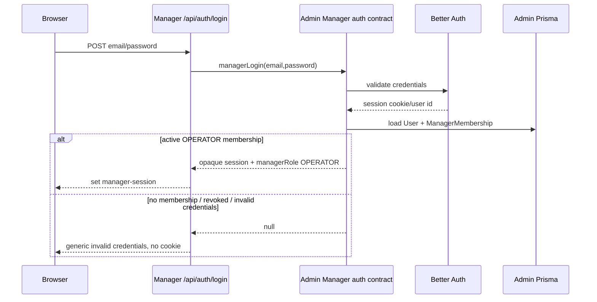
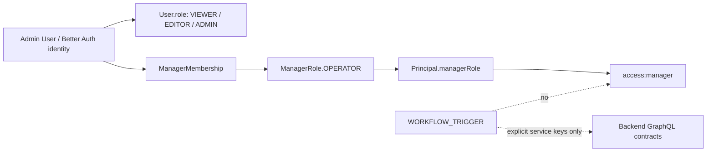

# feat: Require Manager membership for Admin-backed Manager auth

## Summary

Migrate Manager panel authentication to Admin Better Auth while separating identity from Manager authorization. Admin continues to own user identity and sessions; Manager access is granted only by a Manager-specific membership with `ManagerRole.OPERATOR`, not by Admin's editorial `VIEWER` / `EDITOR` / `ADMIN` role ladder.

---

## Problem Frame

The broader Manager-to-Admin backend migration introduced Admin-backed Manager auth contracts, but the current authorization model is too broad: `access:manager` is satisfied by Admin `VIEWER+`, `WORKFLOW_TRIGGER` currently includes that permission in its service allowlist, and Manager-side guards accept Admin role names as Manager access. That means any registered Admin user can currently satisfy Manager access, which conflicts with the desired panel boundary.

---

## Assumptions

_This plan was authored from a detailed user-provided scope plus repo and subagent research, without a separate confirmation checkpoint. The items below are planning inferences that should be reviewed before implementation proceeds._

- `ManagerMembership` should be a one-to-one membership for v1 because the only v1 Manager role is `OPERATOR`; future multi-role or multi-app membership can evolve from this table without changing the current panel contract.
- `ManagerMembership` should include an explicit active/revoked state or timestamp so membership removal takes effect on the next session validation without deleting audit evidence.
- The implementation should prefer Admin-owned session validation that receives a forwarded cookie/header or a narrow validation route over a long-term GraphQL argument carrying an opaque session token.
- Existing Admin Manager GraphQL source files that are not imported by `apps/admin/src/graphql/schema.ts` should be wired as part of this PR only where needed for the auth/session contract.

---

## Requirements

- R1. Manager login keeps the existing UX and route contract: Manager still posts to `POST /api/auth/login`, returns the existing Manager user envelope, and sets `manager-session` only after Admin validates identity and Manager membership.
- R2. Admin Better Auth is the shared human identity source; signing up or existing as an Admin user does not create Manager panel access.
- R3. Manager panel authorization is represented by `ManagerMembership` linked to Admin `User`, with `ManagerRole.OPERATOR` as the only v1 role.
- R4. `OPERATOR` grants all current Manager panel actions in v1; future granular roles are deferred.
- R5. Admin editorial roles `VIEWER`, `EDITOR`, and `ADMIN` do not satisfy Manager panel access unless the same user also has active Manager membership.
- R6. `WORKFLOW_TRIGGER` and other service identities cannot create Manager panel sessions and cannot satisfy human `access:manager`; service access remains allowlisted only for explicit backend GraphQL contracts.
- R7. Manager `hasManagerAccess` no longer infers access from Strapi role names or Admin editorial role names; Manager trusts only Admin-verified Manager membership.
- R8. Legacy Strapi cookie/session support is removed from the Manager panel auth path; `strapi-jwt` must not grant Manager panel access in this PR.
- R9. Red/Green TDD is required for each behavior-bearing implementation unit: failing tests must first capture the current overbroad access behavior, then pass through the membership-backed implementation.
- R10. A user-facing smoke test is required before merge: stage must prove a designated Admin user with `ManagerRole.OPERATOR` can open Manager while a registered Admin user without membership is denied.

---

## Scope Boundaries

- In scope: Admin Prisma membership model, Admin principal/session authorization changes, Manager auth adapter changes, GraphQL/schema wiring needed for Manager auth, generated Admin GraphQL artifacts, docs, and stage smoke proof.
- In scope: an auditable stage membership assignment script for a designated Admin user as `ManagerRole.OPERATOR`.
- In scope: removing or rejecting legacy `strapi-jwt` / Strapi session access for Manager panel routes.
- Out of scope: a Manager role-management UI.
- Out of scope: granular Manager roles beyond `OPERATOR`.
- Out of scope: full Strapi data retirement and non-auth Manager backend migration units from `docs/plans/2026-05-06-001-feat-manager-admin-backend-migration-plan.md`.
- Out of scope: changing Manager's visible login page or dashboard route structure except for behavior needed to preserve the existing flow.

### Deferred to Follow-Up Work

- Manager role management UI: separate Admin/Manager product decision after v1 membership is proven.
- `CONTRIBUTOR`, `VIEWER`, or other Manager role semantics: future authorization plan once v1 `OPERATOR` is live.
- Strapi data/backend retirement outside Manager panel auth: separate migration work remains in the broader Manager Admin backend plan.

---

## Context & Research

### Relevant Code and Patterns

- `docs/plans/2026-05-06-001-feat-manager-admin-backend-migration-plan.md` established the broader Manager-to-Admin backend migration but currently maps `access:manager` to Admin roles.
- `apps/admin/prisma/schema.prisma` has Better Auth `User`, `Session`, `Account`, and `Verification` models plus `UserRole`; it has no `ManagerMembership` or `ManagerRole` yet.
- `apps/admin/src/auth/principal.ts` defines the request principal shape and the distinct `WORKFLOW_TRIGGER` service principal.
- `apps/admin/src/auth/permissions.ts` currently defines `access:manager` as `VIEWER` minimum tier and includes service allowlist logic for `WORKFLOW_TRIGGER`.
- `apps/admin/src/auth/session.ts` validates Better Auth sessions and re-reads the user row before returning a principal.
- `apps/admin/src/graphql/types/managerSession.ts` already has `managerLogin`, `managerSession`, and `managerViewer` source code that calls Better Auth and `access:manager`, but current schema assembly does not import Manager type modules.
- `apps/admin/src/graphql/schema.ts` imports GraphQL type modules for side effects and must be updated when Manager auth types are active.
- `apps/manager/src/cms/gateway.ts` is the Manager backend mode boundary and already delegates Admin mode auth to `apps/manager/src/backend/admin-client.ts`.
- `apps/manager/src/backend/admin-client.ts` normalizes Admin Manager session payloads for Manager.
- `apps/manager/src/lib/auth.ts` currently accepts Strapi `Manager` plus Admin `ADMIN`, `EDITOR`, and `VIEWER` role names.
- `apps/manager/src/lib/require-auth.ts` protects dashboard routes with `manager-session` and still has legacy cookie-reader behavior; this PR should remove legacy cookie acceptance from the panel auth path.
- `apps/manager/src/lib/agentic-studio-proxy.ts` still checks only the legacy `strapi-jwt` cookie and Strapi `Manager` role, so it must be moved to the new Manager membership boundary.

### Institutional Learnings

- `docs/solutions/auth/better-auth-firebase-migration-must-block-public-signup.md`: keep auth migration paths server-internal and block accidental public access expansion.
- `docs/solutions/auth/spike-auth-header-must-be-env-gated.md`: never let HTTP input mint privileged service principals without explicit env-gated controls.
- `docs/solutions/auth/better-auth-secret-must-not-fallback-to-hardcoded-value.md`: Better Auth session security must fail closed in production.
- `docs/solutions/platform/videoforge-manager-integration.md`: Manager's legacy Strapi auth was a role + httpOnly cookie bridge; the migration should replace it explicitly for panel access.
- `docs/solutions/platform/admin-manager-enrichment-trigger-endpoint-20260506.md`: cross-app service calls should use narrow bearer allowlists rather than human panel permissions.
- `docs/solutions/graphql/pothos-relation-abac-filter-required-for-nested-types.md`: root-level auth is not enough; service boundaries must re-check authorization.
- `docs/solutions/best-practices/test-first-regression-snapshot-byte-identical-default-20260429.md`: use test-first regression coverage to pin current behavior before changing migrations.
- `docs/solutions/best-practices/mocked-shape-vs-real-contract-discipline-20260506.md`: mocked tests need at least one real-shape or stage smoke proof for cross-app contract changes.
- `docs/solutions/security-issues/origin-header-soft-gate-not-security-boundary-20260429.md`: headers and origins are not authorization boundaries.

### External References

- Better Auth server API, session, Prisma adapter, and database extension docs confirm that server-side `auth.api` calls and explicit Prisma-owned schema changes are the right direction.
- Prisma relation and migration docs confirm the membership should be modeled as a real relation/migration with production deploy handled by Prisma migrations.
- Pothos scope-auth and GraphQL Yoga docs align with the repo's existing coarse GraphQL scope plus service-layer authorization pattern.

---

## Key Technical Decisions

- Add a Manager-specific membership table instead of extending `UserRole`: Admin `User.role` remains editorial authorization; Manager panel access is app-specific authorization.
- Put `managerRole` on `Principal` as optional derived context: this keeps `hasPermission(user, "access:manager")` synchronous and prevents hidden Prisma reads inside tier helpers.
- Make `access:manager` membership-backed and human-only: `VIEWER`, `EDITOR`, `ADMIN`, `SYSTEM`, and `WORKFLOW_TRIGGER` do not satisfy it unless the human principal carries `managerRole`.
- Remove `access:manager` from the `WORKFLOW_TRIGGER` allowlist: service callers should use explicit service permission keys for Manager backend contracts, not human panel access.
- Add explicit service permission keys for Manager backend contracts, such as `read:manager-read-models` and `write:manager-jobs`, so `ADMIN_MANAGER_API_KEY` can keep powering Manager's Admin backend adapter without granting panel access.
- Keep Manager's browser-facing route and cookie contract stable: the implementation changes upstream validation, not the login UX.
- Treat Admin denial as final: a valid Admin user without membership must not fall back to Strapi and accidentally regain Manager access.
- Require Red/Green TDD for auth boundary changes: overbroad access must first be captured as failing tests before implementation makes the tests pass.
- Require stage/user smoke before merge because this is auth-sensitive and user-facing.

---

## Session Artifact Contract

- **Admin Better Auth session:** The identity source of truth. Admin creates and validates it with Better Auth, then re-reads `User` and `ManagerMembership` before returning any Manager-facing user shape.
- **Manager `manager-session`:** An opaque httpOnly Manager cookie that stores the Admin-issued session artifact needed for later validation. It must expire no later than the corresponding Admin Better Auth session and must not encode authorization claims Manager trusts locally.
- **Manager session validation:** Every Manager protected route validates `manager-session` through Admin-owned session logic and re-checks current `ManagerMembership`; membership revocation takes effect on the next request.
- **Legacy `strapi-jwt`:** Not accepted for Manager panel access in this plan. Existing `strapi-jwt` readers should be removed or changed to reject the cookie for panel/session routes.
- **Service bearer:** `ADMIN_MANAGER_API_KEY` / workflow bearer traffic is service-to-service authorization for explicit backend contracts only. It must never mint a `manager-session` or satisfy human `access:manager`.

---

## Open Questions

### Resolved During Planning

- Should Admin `ADMIN` automatically imply Manager `OPERATOR`? No. The user explicitly wants Admin `ADMIN` without Manager membership denied by default.
- Should Manager authorization live in Manager only? No. Admin must verify Manager membership before returning Manager session/user shape; Manager can then trust Admin-verified `managerRole`.
- Should `WORKFLOW_TRIGGER` keep `access:manager`? No. It should keep only explicitly allowlisted service contracts and no panel access.
- Should a v1 role-management UI be built? No. A tested membership assignment script is acceptable for v1 stage operations.
- Should this be a separate PR? Yes. It is a focused auth-boundary correction on top of the broader Manager Admin backend migration.

### Deferred to Implementation

- Exact migration sequence number depends on the branch state when implementation starts.
- Exact stage assignment script name and invocation shape depend on implementation, but the PR should include a tested script rather than relying on manual DB edits.
- Exact Admin session validation transport can be GraphQL with forwarded cookie/header or a narrow REST route; implementation should avoid long-lived session tokens as GraphQL variables where practical.
- Whether Admin logout can revoke the upstream Better Auth session from Manager's logout route may depend on the final validation transport; if not implemented, orphan-session behavior must be documented and tested.

---

## High-Level Technical Design

> _This illustrates the intended approach and is directional guidance for review, not implementation specification. The implementing agent should treat it as context, not code to reproduce._

---

## Implementation Units

### U1. Add Manager Membership Data Model

**Goal:** Add Admin-owned persistence for Manager panel membership and the v1 `OPERATOR` role.

**Requirements:** R2, R3, R4, R5, R9

**Dependencies:** None

**Files:**

- Modify: `apps/admin/prisma/schema.prisma`
- Create: `apps/admin/prisma/migrations/<next>_manager_membership/migration.sql`

**Approach:**

- Add `ManagerRole` enum with v1 value `OPERATOR`.
- Add `ManagerMembership` linked to `User`, with a unique `userId`, `role`, timestamps, and an explicit active/revoked representation.
- Add a reverse optional relation from `User` to `ManagerMembership`.
- Keep the model small and Manager-specific; do not introduce a generic app-membership abstraction in this PR.

**Execution note:** Schema-first setup. The Red/Green authorization assertions begin in U2, after `Principal.managerRole` exists. U1's proof is Prisma generation and migration validation for the new model.

**Patterns to follow:**

- Existing Better Auth models in `apps/admin/prisma/schema.prisma`.
- Existing forward-only migration style in `apps/admin/prisma/migrations/0013_manager_backend_contracts/migration.sql`.
- Prisma relation guidance for one-to-one relations with a unique foreign key.

**Test scenarios:**

- Test expectation: none -- this unit only introduces the schema and migration. Behavior-bearing access tests are owned by U2 and later units.

**Verification:**

- Prisma schema and migration represent membership without changing Admin editorial role semantics.
- Prisma generation succeeds against the new `ManagerMembership` / `ManagerRole` model.
- The migration applies cleanly in a local or stage-equivalent database before stage smoke.

---

### U2. Extend Admin Principal and Retarget access:manager

**Goal:** Make Admin authorization load Manager membership into the request principal and use it for `access:manager`.

**Requirements:** R3, R5, R6, R9

**Dependencies:** U1

**Files:**

- Modify: `apps/admin/src/auth/principal.ts`
- Modify: `apps/admin/src/auth/session.ts`
- Modify: `apps/admin/src/auth/permissions.ts`
- Test: `apps/admin/src/auth/permissions.test.ts`
- Test: `apps/admin/src/graphql/context.test.ts`

**Approach:**

- Extend `Principal` with optional `managerRole`.
- Update Admin session resolution to re-read `ManagerMembership` alongside `User`.
- Retarget `hasPermission(user, "access:manager")` so it returns true only when `user.managerRole` exists and is active.
- Remove `access:manager` from `WORKFLOW_TRIGGER_PERMISSIONS`.
- Add and use explicit service permission keys for Manager backend contracts, such as `read:manager-read-models` and `write:manager-jobs`, so `WORKFLOW_TRIGGER` can power Manager's Admin adapter without passing human panel access.
- Keep `WORKFLOW_TRIGGER` able to satisfy only explicitly named service permissions, such as embedding, Manager read-model, Manager job, or Manager-enrichment trigger contracts that are intentionally bearer-accessible.

**Execution note:** Red/Green TDD required. Add failing tests that show `WORKFLOW_TRIGGER` and Admin editorial roles no longer pass `access:manager` before changing the matrix.

**Patterns to follow:**

- `apps/admin/src/graphql/context.ts` session-first precedence over bearer principal.
- `apps/admin/src/auth/permissions.ts` allowlist comments for service-account blast radius.
- `docs/solutions/auth/spike-auth-header-must-be-env-gated.md`.

**Test scenarios:**

- Happy path: `Principal` with `managerRole: "OPERATOR"` satisfies `access:manager`.
- Error path: `WORKFLOW_TRIGGER` does not satisfy `access:manager`.
- Happy path: `WORKFLOW_TRIGGER` satisfies only the explicit Manager backend service permissions needed by `ADMIN_MANAGER_API_KEY`.
- Error path: `SYSTEM` does not satisfy `access:manager`.
- Error path: Admin `ADMIN`, `EDITOR`, and `VIEWER` without `managerRole` all fail `access:manager`.
- Integration: GraphQL context keeps Better Auth session precedence over bearer headers and includes membership for human sessions.
- Integration: bearer-only requests continue to mint `WORKFLOW_TRIGGER` for service allowlisted contracts, without Manager panel access.

**Verification:**

- `access:manager` is no longer tier-based.
- No service bearer path can become a Manager panel principal.

---

### U3. Harden Admin Manager Auth Contracts

**Goal:** Update Admin `managerLogin`, `managerSession`, and `managerViewer` to return Manager user shape only for active `OPERATOR` membership.

**Requirements:** R1, R2, R3, R5, R6, R9

**Dependencies:** U1, U2

**Files:**

- Modify: `apps/admin/src/graphql/types/managerSession.ts`
- Modify: `apps/admin/src/graphql/schema.ts`
- Modify: `apps/admin/src/graphql/types/managerSession.test.ts`
- Modify: `apps/admin/src/graphql/schema.test.ts`
- Create or modify: `apps/admin/src/auth/manager-session.test.ts`
- Test: `apps/admin/src/auth/rate-limit.test.ts`

**Approach:**

- Update Manager auth payloads to include `managerRole: OPERATOR` in addition to the stable user fields Manager already expects.
- Ensure `managerLogin(email,password)` signs in with Better Auth, then re-loads `User + ManagerMembership`; return null for invalid credentials and for valid Admin users without membership.
- Add rate limiting or reuse an existing Admin rate-limit primitive so GraphQL `managerLogin` does not become an unprotected password-check endpoint.
- Re-read membership on `managerSession` validation so membership revocation takes effect on the next Manager request.
- Wire Manager GraphQL type modules into `apps/admin/src/graphql/schema.ts`: `@/graphql/types/managerSession`, `@/graphql/types/managerReadModels`, and `@/graphql/types/managerJob`.
- Prefer a validation shape that does not pass opaque session tokens as regular GraphQL variables long-term; if GraphQL remains the migration path, document why the current token transport is acceptable for the temporary bridge.

**Execution note:** Red/Green TDD required. First assert that a valid Admin user without membership gets null and no session payload, then implement membership loading.

**Patterns to follow:**

- `apps/admin/src/auth/session.ts` for server-side Better Auth session validation plus Prisma user re-read.
- `apps/admin/src/graphql/types/managerSession.ts` objectRef contract shape.
- Better Auth server API docs for `auth.api.signInEmail` and `auth.api.getSession`.
- `docs/solutions/auth/better-auth-secret-must-not-fallback-to-hardcoded-value.md`.

**Test scenarios:**

- Happy path: valid Better Auth credentials plus active `ManagerMembership.OPERATOR` return the Manager session artifact and user with `managerRole: "OPERATOR"`.
- Error path: invalid password returns null.
- Error path: valid Admin `VIEWER` without membership returns null.
- Error path: valid Admin `EDITOR` without membership returns null.
- Error path: valid Admin `ADMIN` without membership returns null.
- Error path: revoked/inactive membership returns null for both login and session validation.
- Error path: rate-limited login attempts stop before Better Auth credential validation.
- Integration: `managerViewer` returns null for `WORKFLOW_TRIGGER` and non-member Admin users.
- Integration: emitted schema includes the Manager auth fields after schema assembly.

**Verification:**

- Admin Manager auth contracts expose only membership-backed Manager identities.
- Non-member Admin identities get the same user-facing failure as invalid credentials.

---

### U4. Update Manager Admin Adapter and Login Guard

**Goal:** Make Manager trust Admin-verified `managerRole` instead of inferring access from Admin editorial or Strapi role names in Admin mode.

**Requirements:** R1, R5, R7, R8, R9

**Dependencies:** U3

**Files:**

- Modify: `apps/manager/src/backend/admin-client.ts`
- Modify: `apps/manager/src/backend/admin-client.test.ts`
- Modify: `apps/manager/src/cms/mock-seed.ts`
- Modify: `apps/manager/src/cms/gateway.ts`
- Modify: `apps/manager/src/cms/gateway.test.ts`
- Modify: `apps/manager/src/lib/auth.ts`
- Modify: `apps/manager/src/lib/auth.test.ts`
- Modify: `apps/manager/src/lib/session-cookie.ts`
- Modify: `apps/manager/src/lib/session-cookie.test.ts`
- Modify: `apps/manager/src/app/api/auth/login/route.test.ts`
- Test: `apps/manager/src/lib/require-auth.test.ts`

**Approach:**

- Add Manager-specific `managerRole` to Manager's Admin-backed user/session normalization.
- Remove the Admin client fallback that defaults missing role data to Strapi `Manager`.
- Add a source-aware Manager user/session shape so Admin-backed users require `managerRole: "OPERATOR"` and Strapi-shaped users are not accepted for panel access.
- Change `hasManagerAccess` so Admin mode accepts only Admin-verified `managerRole: "OPERATOR"`.
- Remove `strapi-jwt` fallback reads from Manager panel session handling.
- Ensure Admin no-membership responses do not fall through to any Strapi login/session fallback.
- Keep `POST /api/auth/login`, response body, and `manager-session` cookie behavior stable for successful operators.

**Execution note:** Red/Green TDD required. First make existing tests prove Admin `VIEWER` role names are no longer enough, then update adapter behavior.

**Patterns to follow:**

- `apps/manager/src/cms/gateway.ts` backend-mode boundary.
- `apps/manager/src/lib/session-cookie.ts` neutral Manager cookie handling.
- `apps/manager/src/app/api/auth/login/route.ts` stable login route.

**Test scenarios:**

- Happy path: Admin-backed `OPERATOR` login returns 200, sets `manager-session`, and preserves the current Manager login response shape.
- Error path: Admin-backed `VIEWER`, `EDITOR`, and `ADMIN` users without `managerRole` fail login and do not set cookies.
- Error path: Admin payloads missing `managerRole` or missing role data fail access rather than defaulting to Strapi `Manager`.
- Error path: Admin `managerLogin` returning null does not trigger Strapi fallback in Admin mode.
- Error path: malformed or expired Admin-backed `manager-session` is rejected by API and dashboard guards.
- Edge case: legacy `strapi-jwt` with Strapi `Manager` role is rejected for Manager panel access.
- Edge case: a request containing both `manager-session` and `strapi-jwt` uses only the Admin-backed `manager-session` path.
- Integration: `requireAuth` redirects when membership is revoked and Admin session validation returns null.

**Verification:**

- Manager admin mode no longer grants panel access based on Admin editorial role names.
- Legacy Strapi cookie/session support is not accepted for panel access.
- Manager login UX remains stable for true `OPERATOR` users.

---

### U5. Close Panel and Service Boundary Gaps

**Goal:** Ensure every Manager panel surface, including Agentic Studio, requires an interactive `OPERATOR` session while service calls remain explicitly allowlisted.

**Requirements:** R6, R7, R8, R9

**Dependencies:** U2, U4

**Files:**

- Modify: `apps/manager/src/lib/agentic-studio-proxy.ts`
- Modify: `apps/manager/src/lib/agentic-studio-proxy.test.ts`
- Modify: `apps/manager/src/app/api/agentic-studio/[[...path]]/route.test.ts`
- Modify: `apps/manager/src/lib/admin-trigger-auth.ts`
- Modify: `apps/manager/src/lib/admin-trigger-auth.test.ts`
- Test: `apps/admin/src/auth/permissions.test.ts`
- Test: `apps/admin/src/graphql/types/managerSession.test.ts`
- Test: `apps/admin/src/graphql/types/managerReadModels.test.ts`
- Test: `apps/admin/src/graphql/types/managerJob.test.ts`

**Approach:**

- Update Agentic Studio proxy authorization to use the same verified Manager session path as dashboard routes.
- Reject service bearer keys and `WORKFLOW_TRIGGER` principals for panel/session routes.
- Reject legacy `strapi-jwt` cookies for Agentic Studio and other Manager panel routes.
- Keep explicit service bearer paths for backend callbacks and enrichment triggers, with tests proving those paths do not imply panel access.
- Retarget Manager read-model/job GraphQL fields and service assertions away from human `access:manager` and onto the explicit Manager backend service permission keys where bearer access is required.
- Re-check human panel fields, including `managerViewer`, against `access:manager` after membership changes.

**Execution note:** Red/Green TDD required. Add failing tests for `WORKFLOW_TRIGGER` against panel and Manager-viewer fields before changing allowlists.

**Patterns to follow:**

- `apps/manager/src/lib/admin-trigger-auth.ts` for service bearer handling.
- `docs/solutions/platform/admin-manager-enrichment-trigger-endpoint-20260506.md` for narrow service allowlists.
- `docs/solutions/graphql/pothos-relation-abac-filter-required-for-nested-types.md` for service-layer re-checks.

**Test scenarios:**

- Happy path: `OPERATOR` session can access Agentic Studio proxy.
- Error path: missing session cannot access Agentic Studio proxy.
- Error path: legacy `strapi-jwt` cannot access Agentic Studio proxy.
- Error path: `WORKFLOW_TRIGGER` bearer cannot access Manager panel routes or `managerViewer`.
- Error path: Manager service bearer cannot create or validate a panel session.
- Integration: Manager backend read-model and job contracts still work with `ADMIN_MANAGER_API_KEY` after `access:manager` is removed from service allowlists.
- Integration: Manager read models and jobs reject non-member Admin users even if they are `ADMIN`.

**Verification:**

- Human panel access and service-to-service access are separate and tested.
- Agentic Studio no longer depends on legacy-only cookie or role checks.

---

### U6. Regenerate Admin GraphQL Contracts

**Goal:** Keep generated Admin GraphQL schema artifacts aligned after Manager auth contract changes.

**Requirements:** R1, R3, R9

**Dependencies:** U3, U5

**Files:**

- Modify: `apps/admin/src/graphql/schema.ts`
- Modify: `apps/admin/schema.graphql`
- Modify: `packages/graphql/src/admin-graphql-env.d.ts`
- Test: `packages/graphql/src/__tests__/dual-client.types.ts`
- Test: `apps/admin/src/graphql/schema.security.test.ts`
- Test: `apps/admin/src/graphql/schema.test.ts`

**Approach:**

- Run the repo-required Admin schema print and GraphQL generation after Pothos Manager auth changes.
- Ensure `apps/admin/src/graphql/schema.ts` imports `@/graphql/types/managerSession`, `@/graphql/types/managerReadModels`, and `@/graphql/types/managerJob` before printing SDL.
- Ensure generated contracts include `managerRole` or the chosen Manager-role field and do not expose service-only access as panel access.
- Do not hand-edit generated files.

**Execution note:** Red/Green TDD required where contract tests exist: add schema/type expectations before regenerating so drift is visible.

**Patterns to follow:**

- `apps/admin/AGENTS.md` SDL emission workflow.
- `packages/graphql/AGENTS.md` generated Admin GraphQL env rules.

**Test scenarios:**

- Happy path: Admin schema includes Manager auth fields required by Manager's Admin client.
- Error path: schema tests fail if `managerRole` disappears from Manager user payloads.
- Integration: generated Admin GraphQL env types compile for Manager auth queries.

**Verification:**

- Admin schema and generated GraphQL env artifacts match the implemented Pothos source.
- No generated file is manually edited.

---

### U7. Document Operations and Prove Stage Smoke

**Goal:** Document the new source of Manager panel access and prove the end-to-end user flow on stage.

**Requirements:** R1, R2, R3, R5, R6, R8, R9, R10

**Dependencies:** U1, U2, U3, U4, U5, U6

**Files:**

- Modify: `apps/admin/CLAUDE.md`
- Modify: `apps/manager/CLAUDE.md`
- Modify: `docs/roadmap/platform/feat-120-manager-admin-backend-migration.md`
- Create or modify: `apps/admin/src/scripts/<manager-membership-script>.ts`
- Test: `apps/admin/src/scripts/<manager-membership-script>.test.ts`

**Approach:**

- Document `ManagerMembership` as the source of Manager panel access.
- Replace wording that implies Admin `VIEWER+` or Strapi `Manager` role grants Admin-backed Manager access.
- Add a minimal auditable membership assignment path for stage operations, targeting a designated Admin user with `ManagerRole.OPERATOR`.
- Document that legacy Strapi cookie/session support is removed from Manager panel auth and must not override Admin no-membership denial.
- Document the deployment order as Admin-first: apply the Prisma migration, deploy Admin schema/session contracts, grant `ManagerMembership.OPERATOR`, verify Admin GraphQL, then deploy Manager in Admin backend mode.
- Capture stage smoke evidence before merge.

**Execution note:** Red/Green TDD required for any script behavior. User smoke proof is required after implementation and before PR merge.

**Patterns to follow:**

- Existing Admin local-dev scripts listed in `apps/admin/AGENTS.md`.
- Existing roadmap feature format in `docs/roadmap/platform/feat-120-manager-admin-backend-migration.md`.
- `docs/solutions/best-practices/mocked-shape-vs-real-contract-discipline-20260506.md`.

**Test scenarios:**

- Happy path: membership assignment script creates or updates a designated Admin user to active `OPERATOR`.
- Edge case: repeated assignment is idempotent and does not duplicate membership rows.
- Error path: script fails clearly when the user email does not exist.
- Stage smoke: designated `OPERATOR` logs into Manager stage with Admin credentials and reaches `/dashboard`.
- Stage smoke: registered Admin user without Manager membership is denied Manager login and receives no `manager-session`.
- Stage smoke: legacy `strapi-jwt` does not grant Manager panel access.
- Stage smoke: `WORKFLOW_TRIGGER` or service bearer can call only explicitly allowlisted service contract and cannot open panel routes.
- Stage smoke: Manager runs in Admin backend mode without Strapi login/session traffic.
- Rollout: Manager is not deployed with `managerRole` queries before Admin exposes the regenerated schema.

**Verification:**

- Docs name `ManagerMembership` as the source of Manager panel access.
- Stage smoke evidence exists for both positive and negative users.
- Roadmap status and PR notes distinguish this auth membership PR from broader Strapi retirement work.

---

## System-Wide Impact

- **Interaction graph:** Manager login, dashboard `requireAuth`, Agentic Studio proxy, Admin GraphQL context, Admin Pothos auth scopes, Admin Prisma membership, and generated Admin GraphQL contracts all participate in the access decision.
- **Error propagation:** Invalid credentials, valid Admin credentials without membership, and revoked membership should all map to generic login denial with no cookie. Admin infrastructure failures should remain distinguishable in logs and API status without leaking sensitive details to the user.
- **State lifecycle risks:** Membership revocation must take effect on the next Manager request, not only after session expiry. Legacy Strapi cookies must not grant panel access.
- **API surface parity:** Manager's browser-facing login route, dashboard guard, and session cookie name stay stable; Admin's internal Manager auth payload gains Manager-specific role information.
- **Integration coverage:** Unit tests alone are insufficient. The PR needs stage smoke proving one operator can log in and one registered non-member Admin user is denied.
- **Unchanged invariants:** Admin editorial role behavior remains unchanged for Admin UI. Manager service bearer contracts remain service-only and do not become panel access.

---

## Risks & Dependencies

| Risk                                                                                    | Mitigation                                                                                                                                        |
| --------------------------------------------------------------------------------------- | ------------------------------------------------------------------------------------------------------------------------------------------------- |
| Admin `ADMIN` users lose implicit Manager access and stage operators are locked out     | Add/verify stage `ManagerMembership.OPERATOR` for a designated Admin user before switching stage Manager auth                                     |
| GraphQL `managerLogin` becomes a password-check endpoint without auth-route rate limits | Add explicit rate limiting or reuse the existing Admin rate-limit primitive before Better Auth credential validation                              |
| Session token appears in GraphQL variables or logs                                      | Prefer cookie/header-forwarded validation or a narrow Admin validation route; document any temporary GraphQL-token bridge and keep it short-lived |
| Service bearer access breaks when `access:manager` becomes human-only                   | Add explicit service permissions for Manager read models/jobs and retarget bearer-accessible fields to those keys                                 |
| Service bearer access accidentally grants panel access                                  | Remove `access:manager` from `WORKFLOW_TRIGGER`, add tests for panel denial, and keep service permissions explicit                                |
| Legacy Strapi fallback reopens revoked Admin users                                      | Remove legacy Strapi cookie/session support from Manager panel auth and test that `strapi-jwt` is rejected                                        |
| Generated Admin GraphQL artifacts drift from Pothos source                              | Regenerate `apps/admin/schema.graphql` and `packages/graphql/src/admin-graphql-env.d.ts` in the same PR                                           |

---

## Documentation / Operational Notes

- Start from `origin/stage` on `feat/manager-admin-auth-membership`, and target stage first.
- Deploy stage Admin before stage Manager for this PR: migration -> Admin app/schema -> membership assignment -> Admin GraphQL smoke -> Manager app.
- After stage proof, promote to `main` through the normal production-bound merge or cherry-pick path if needed.
- Before merge, PR validation must include Admin Prisma generation, migration deploy/status proof, Admin tests/typecheck, Manager tests/typecheck, Admin schema print, GraphQL generation, and the stage user smoke proof.
- The PR description should call out that this intentionally changes `access:manager` from Admin `VIEWER+` to explicit Manager membership.
- The PR should document how the designated stage operator receives `ManagerRole.OPERATOR` and how to revoke it.

---

## Sources & References

- Origin roadmap: `docs/roadmap/platform/feat-120-manager-admin-backend-migration.md`
- Related broader plan: `docs/plans/2026-05-06-001-feat-manager-admin-backend-migration-plan.md`
- Admin guide: `apps/admin/AGENTS.md`
- Manager guide: `apps/manager/AGENTS.md`
- Admin auth principal: `apps/admin/src/auth/principal.ts`
- Admin permissions: `apps/admin/src/auth/permissions.ts`
- Admin session resolution: `apps/admin/src/auth/session.ts`
- Admin Manager auth contract: `apps/admin/src/graphql/types/managerSession.ts`
- Admin schema assembly: `apps/admin/src/graphql/schema.ts`
- Admin Prisma schema: `apps/admin/prisma/schema.prisma`
- Manager gateway: `apps/manager/src/cms/gateway.ts`
- Manager Admin client: `apps/manager/src/backend/admin-client.ts`
- Manager auth guard: `apps/manager/src/lib/auth.ts`
- Manager dashboard auth: `apps/manager/src/lib/require-auth.ts`
- Manager Agentic Studio proxy: `apps/manager/src/lib/agentic-studio-proxy.ts`
- Better Auth server API: `https://better-auth.com/docs/concepts/api`
- Better Auth Prisma adapter: `https://better-auth.com/docs/adapters/prisma`
- Better Auth session management: `https://better-auth.com/docs/concepts/session-management`
- Prisma relations: `https://www.prisma.io/docs/orm/prisma-schema/data-model/relations`
- Prisma migrate commands: `https://docs.prisma.io/docs/cli/migrate`
