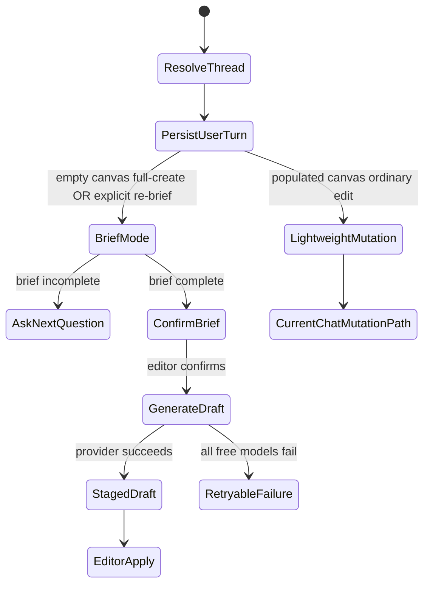

# feat: Admin AI Chat Quality-First Generation

## Summary

Extend the existing Admin Experience AI Chat with a zero-state quality workflow:
empty-canvas create requests become a guided editorial brief first, confirmed
briefs generate staged Experience drafts through an OpenRouter free-model
provider loop, and research/reference evidence stays in chat metadata for admin
review instead of becoming public page content.

---

## Problem Frame

AI Chat already gives editors a conversational surface for Experience changes,
but zero-state draft quality is still limited by thin prompts. Christian content
needs a deliberate brief, Scripture-first grounding, ecumenical guardrails,
natural Thai/English voice, and review evidence before it feels usable for real
editorial work. See origin:
`docs/brainstorms/2026-05-11-admin-ai-chat-quality-first-generation-requirements.md`.

---

## Requirements

- R1. Empty-canvas create/generate/build/start requests enter guided brainstorm
  mode instead of generating immediately (origin R1).
- R2. Guided brainstorm asks one adaptive question at a time and preserves
  fields already supplied by the editor (origin R2, origin R3, origin R6).
- R3. AI Chat summarizes the editorial brief and waits for explicit editor
  confirmation before draft generation (origin R4, origin R7).
- R4. The minimum confirmed brief covers topic or passage, language, audience,
  desired outcome, tone, page type, Scripture emphasis, and CTA or next step
  (origin R5).
- R5. Full-create generation uses the content creator kit for Scripture-first
  workflow, ecumenical theology, Thai/English editorial voice, page structure,
  reference tracking, theology review, and final polish (origin R8, origin R10,
  origin R11, origin R12).
- R6. The staged draft applied to the canvas contains public page content only;
  research notes and reference ledger remain available in admin/chat review
  metadata (origin R9).
- R7. Full-create generation uses OpenRouter free-tier models, with a pinned
  free-model list before `openrouter/free`; Codex is not used for this
  generation path (origin R13, origin R14, origin R15, origin R16).
- R8. If all provider attempts fail, the failure is visible and retryable, and
  the confirmed brief is preserved (origin R16).
- R9. Populated-canvas edit/refine turns remain lightweight by default; an
  editor may explicitly request a re-brief or full regeneration (origin R17,
  origin R18).
- R10. Existing AI Chat authority rules remain in force: no slug changes, and
  cross-locale mutations require explicit confirmation (origin R19).

**Origin actors:** A1 Editor, A2 AI Chat assistant, A3 Reviewer

**Origin flows:** F1 Full-create from an empty canvas, F2 Draft generation after
brief confirmation, F3 Fast refinement on an existing canvas

**Origin acceptance examples:** AE1-AE3 guided brief behavior, AE4 content +
reference separation, AE5 OpenRouter free fallback/failure, AE6 hybrid
refinement/re-brief behavior

---

## Scope Boundaries

- No new standalone AI generation workflow outside the existing Admin AI Chat
  panel.
- No public reference or citation section is inserted into generated Experience
  pages by default.
- No paid OpenRouter/OpenAI/Codex provider path for v1 full-create generation.
- No heavy research workflow on ordinary small populated-canvas refinements.
- No Prisma migration unless implementation discovers existing chat message JSON
  metadata cannot support durable brief/reference storage.
- No GraphQL schema work is expected; if implementation touches Pothos schema,
  the admin SDL and `packages/graphql` generated env types must be regenerated
  in the same PR.
- No live web browsing/source discovery in v1 unless a separate verified source
  retrieval surface is added. The reference ledger must not contain invented
  URLs from a plain chat model.

### Deferred to Follow-Up Work

- Provider replacement for every populated-canvas chat mutation turn: this plan
  only guarantees OpenRouter free-tier for full-create/re-brief draft generation.
- Public citation UI, reviewer assignment workflow, and multi-user collaborative
  brainstorm sessions.
- Production quality scoring from real model outputs beyond deterministic
  validation gates and manual spot checks.

---

## Context & Research

### Relevant Code and Patterns

- `apps/admin/src/services/experience-ai/experience-ai-chat.service.ts` is the
  current streaming chat orchestration point. It resolves thread/locale,
  enforces ABAC, persists user messages, routes empty-canvas first drafts through
  `generateExperienceAiDraft`, and routes normal mutation turns through Codex.
- `apps/admin/src/services/experience-ai/experience-ai-chat-prompts.ts` owns the
  current chat mutation prompt, block schema reference, history trimming, and
  "generate a complete first draft" instruction that must be removed from the
  normal chat prompt.
- `apps/admin/src/services/experience-ai/experience-ai.service.ts` contains the
  existing structured draft generator, candidate retrieval, normalization, and
  OpenRouter/OpenAI/Codex provider selection. Its retrieval and normalization
  patterns are reusable, but its provider policy is too broad for this feature.
- `apps/admin/src/services/image-text-generation.service.ts` already implements
  an OpenRouter free-model list, env overrides, request headers, retry-on-model
  loop, and validation/fallback behavior. This is the closest local pattern for
  the new provider path.
- `apps/admin/src/app/dashboard/experiences/experience-editor/experience-chat-panel.tsx`
  already supports SSE events, staged draft preview/apply, retry, stop, and
  cross-locale confirmation. The guided brief and reference ledger should extend
  this panel instead of creating another UI surface.
- `apps/admin/src/app/api/experience-chat/stream/route.ts` is the SSE boundary.
  It should remain the single streaming endpoint, with request/event shape
  extended only where needed for brief confirmation.
- `apps/admin/src/app/dashboard/experiences/experience-chat-actions.ts` exposes
  persisted message `mutationsApplied` JSON to the panel. Use this for v1 brief,
  provider-attempt, research-note, and reference-ledger metadata.
- `apps/admin/AGENTS.md` requires services to own mutations/ABAC, no direct
  `process.env` reads outside `apps/admin/src/config/env.ts`, and SDL
  regeneration only when Pothos GraphQL schema changes.
- `docs/plans/2026-05-08-001-feat-admin-experience-ai-chat-panel-plan.md`
  established AI Chat as the only visible generation surface and the staged
  draft preview/apply pattern.

### Institutional Learnings

- `docs/solutions/best-practices/nextjs-server-action-llm-structured-output-pattern-2026-04-21.md`:
  LLM output that renders into UI needs typed errors, provider timeouts, strict
  JSON schema, Zod re-validation, runtime allowlists, and sanitized public error
  messages.
- `docs/solutions/best-practices/openai-strict-anyof-lenient-per-section-parse-20260422.md`:
  strict JSON-schema enforcement can still fail on union-like structures, so the
  final parser should preserve valid blocks/sections where safe and fail only
  when no usable public content remains.
- `docs/solutions/best-practices/outbound-timeout-shorter-than-caller-budget-20260506.md`:
  every outbound provider call needs an explicit timeout below the caller's
  route/request budget.
- `docs/solutions/best-practices/mocked-shape-vs-real-contract-discipline-20260506.md`
  is relevant for tests: mocks should match real SSE events, OpenRouter response
  envelopes, and chat message metadata rather than convenient partial shapes.

### Content Creator Kit

- `content-creator-agent-kit.tgz` contains the prompt modules that define the
  feature's content quality bar. For runtime use, import/codify the relevant
  guidance as application prompt modules rather than reading the tarball.
- `AGENTS.md` in the kit provides ecumenical Christian boundaries,
  Scripture-first research workflow, anti-hallucination rules, citation
  discipline, and Thai/English voice guidance.
- `agents/orchestrator.md` defines the staged workflow: clarify missing passage,
  audience, language, and content type; use Standard Research by default; run
  Scripture research, web/reference research, writer, theology review, reference
  check, and final edit.
- `agents/content-page-structure.md` provides the Jesus Film-style web page
  journey: hero, topic navigation, intro, video teaching modules, Scripture
  quote blocks, related questions, and discipleship CTA.

### External References

- OpenRouter Free Variant docs:
  `https://openrouter.ai/docs/guides/routing/model-variants/free`
- OpenRouter Free Models Router docs:
  `https://openrouter.ai/docs/guides/routing/routers/free-models-router`
- OpenRouter Models API docs:
  `https://openrouter.ai/docs/guides/overview/models`
- OpenRouter Structured Outputs docs:
  `https://openrouter.ai/docs/guides/features/structured-outputs`
- OpenRouter Model Fallbacks docs:
  `https://openrouter.ai/docs/guides/routing/model-fallbacks`
- OpenRouter free models collection:
  `https://openrouter.ai/collections/free-models`

---

## Key Technical Decisions

- **Persist brief/reference state in chat message JSON for v1.** The existing
  `ExperienceChatMessage.mutationsApplied` JSON is already durable and returned
  to the panel. Use stable metadata discriminators for editorial brief,
  confirmed brief, provider attempts, research notes, and reference ledger
  rather than adding tables before the workflow proves it needs queryable
  reporting.
- **Model the full-create workflow as a chat state machine.** Route
  empty-canvas full-create and explicit populated-canvas re-brief requests into
  brief collection; route confirmed briefs into generation; keep ordinary
  populated-canvas refinements on the existing lightweight mutation branch.
- **Use an application-owned OpenRouter model loop, not only OpenRouter's
  `models` fallback array.** OpenRouter can fail over on upstream errors, but
  this app also needs to retry on invalid JSON, schema mismatch, missing public
  content, hallucinated video IDs, and failed reference validation.
- **Pin free models that advertise structured output support and keep env
  overrides.** A current planning-time candidate list is
  `nvidia/nemotron-3-super-120b-a12b:free`,
  `qwen/qwen3-next-80b-a3b-instruct:free`,
  `google/gemma-4-31b-it:free`, `google/gemma-4-26b-a4b-it:free`,
  `nvidia/nemotron-nano-9b-v2:free`, then `openrouter/free`. Implementation
  should validate this list against the Models API immediately before coding,
  because free availability changes.
- **Codify the content creator kit into focused prompt modules.** Keep the
  original kit bundle as source material, but runtime code should import typed
  prompt strings for brief extraction, Scripture-first generation, page
  structure, theology review, reference ledger, and final editor guidance.
- **Generate one structured package, then split public content from review
  evidence.** The provider response should include public draft fields plus
  admin-only research/reference metadata. Only title, metadata, blocks, and
  optional image direction/selection flow into the staged canvas preview.
- **Do not let free-model generation fabricate external sources.** Because this
  plan does not add a browser/search tool, the ledger may cite Scripture
  references, provided source material, selected video candidate metadata, and
  explicit "needs verification" notes. Any external URL must come from trusted
  input or a future verified retrieval layer, not model memory.
- **Keep staged draft apply semantics.** The generation branch should yield a
  proposal and let the editor apply it, preserving the prior AI Chat rule that
  empty-canvas drafts do not mutate the canvas without editor action.

---

## Open Questions

### Resolved During Planning

- **Where should research notes/reference ledger live?** Store them in
  assistant message metadata (`mutationsApplied`) and render them in the chat
  panel/admin review card. Do not insert them into public blocks by default.
- **Which provider strategy should be used?** OpenRouter free-tier only for
  full-create generation, with a pinned list before `openrouter/free` and no
  Codex fallback on that branch.
- **What validation gates decide retry vs. failure?** Retry the next model on
  transport errors, timeout, 404/429/5xx, "no endpoints/rate-limited" OpenRouter
  bodies, missing text content, invalid JSON, Zod schema mismatch, no usable
  public blocks, unsupported/hallucinated video IDs, missing required brief
  fields, or missing reference ledger. Preserve the confirmed brief when the
  final attempt fails.
- **What routing rule distinguishes full-create, refinement, and re-brief?**
  Empty canvas plus full-create intent enters guided brief. Populated canvas
  defaults to lightweight refinement. Explicit "re-brief", "start over",
  "regenerate from scratch", or equivalent phrasing enters guided brief with the
  current canvas summarized as context.

### Deferred to Implementation

- **Exact UI wording for brief cards and reference ledger.** Implement within
  the existing admin design language and test for state clarity; copy can be
  adjusted during UI implementation.
- **Final model list ordering after live smoke tests.** The candidate list above
  is planning-time guidance; the implementation should confirm current model
  support and adjust ordering if a model fails structured-output or language
  quality checks.
- **Whether to keep the old one-shot `generateExperienceAiDraft` path.** This
  plan does not remove it; implementation should avoid using it for confirmed
  quality-first full-create generation.

---

## Output Structure

```text
apps/admin/src/services/experience-ai/
  experience-ai-chat-brief.ts
  experience-ai-chat-brief.test.ts
  experience-ai-content-kit.ts
  experience-ai-quality-draft.schemas.ts
  experience-ai-quality-draft.ts
  experience-ai-quality-draft.test.ts
  experience-ai-openrouter-free.ts
  experience-ai-openrouter-free.test.ts
```

This structure is expected, not mandatory. If implementation can keep one of
these units simpler by folding it into an existing module without muddying
ownership, that is acceptable.

---

## High-Level Technical Design

> This illustrates the intended approach and is directional guidance for review,
> not implementation specification.



The chat thread is the durable workflow container. A guided brief turn may
produce a normal assistant message, a brief proposal event, or both. A confirmed
brief generation turn uses the saved brief and writes a staged draft assistant
message with public draft content plus admin-only review metadata.

---

## Implementation Units

### U1. Guided Brief State and Routing

**Goal:** Add the server-side classifier and brief state model that routes
zero-state full-create requests into guided brainstorm mode instead of immediate
draft generation.

**Requirements:** R1, R2, R3, R4, R9, R10

**Dependencies:** None

**Files:**

- Create: `apps/admin/src/services/experience-ai/experience-ai-chat-brief.ts`
- Create: `apps/admin/src/services/experience-ai/experience-ai-chat-brief.test.ts`
- Modify: `apps/admin/src/services/experience-ai/experience-ai-chat.service.ts`
- Modify: `apps/admin/src/services/experience-ai/experience-ai-chat-prompts.ts`
- Modify: `apps/admin/src/services/experience-ai/experience-ai-chat-prompts.test.ts`

**Approach:**

- Define a provider-independent editorial brief domain with the eight required
  fields from the origin document and visible assumptions for uncertain fields.
- Replace the current "empty canvas means most prompts are first draft" behavior
  with a routing classifier:
  - empty canvas + create/generate/build/start/compose/design intent -> brief
    mode;
  - empty canvas discovery/search prompt -> existing non-mutating chat behavior
    if available;
  - populated canvas + ordinary edit prompt -> existing lightweight mutation;
  - populated canvas + explicit re-brief/regenerate-from-scratch prompt -> brief
    mode.
- Use recent thread messages and saved brief metadata to avoid re-asking fields
  the editor already answered.
- Persist brief progress as assistant/system message metadata so the flow
  survives refresh, retry, and provider failure.
- Remove first-draft generation instructions from the normal Codex mutation
  prompt; first-draft content should only come from the confirmed quality
  workflow.

**Execution note:** Characterization-first. Pin current routing behavior in
tests before changing it, because AI Chat files are already broad and active.

**Patterns to follow:**

- `apps/admin/src/services/experience-ai/experience-ai-chat.service.ts`
  service-owned routing and ABAC.
- `apps/admin/src/app/dashboard/experiences/experience-chat-actions.ts`
  metadata DTO shape.

**Test scenarios:**

- Happy path: empty canvas + "Create a Thai page about Matthew 11:28-30 for
  young adults" records supplied fields and asks only for missing brief fields;
  no draft proposal or canvas mutation is emitted.
- Happy path: brief already has all required fields -> service emits a
  confirmation summary instead of another question.
- Edge case: empty canvas + "show me candidate videos about forgiveness" does
  not enter full-create generation.
- Edge case: user answers "not sure" for CTA -> brief stores a visible
  assumption and includes it in confirmation.
- Integration: populated canvas + "make the hero warmer" still enters the
  lightweight mutation path.
- Integration: populated canvas + "re-brief this page from scratch" enters
  brief mode.
- Error path: unknown/malformed saved brief metadata is ignored safely and the
  service resumes by asking for missing required fields.

**Verification:**

- Empty-canvas full-create turns never call `generateExperienceAiDraft` or Codex
  before brief confirmation.
- The brief confirmation contains every required field and any assumptions.

---

### U2. OpenRouter Free-Model Provider Loop

**Goal:** Add a full-create provider helper that uses OpenRouter free models
only, with env-configurable pinned models, `openrouter/free` fallback, timeouts,
typed failure reasons, and provider-attempt metadata.

**Requirements:** R7, R8

**Dependencies:** U1

**Files:**

- Create: `apps/admin/src/services/experience-ai/experience-ai-openrouter-free.ts`
- Create: `apps/admin/src/services/experience-ai/experience-ai-openrouter-free.test.ts`
- Modify: `apps/admin/src/config/env.ts`
- Modify: `apps/admin/.env.example`

**Approach:**

- Add env vars such as `OPENROUTER_EXPERIENCE_CHAT_MODELS` and
  `OPENROUTER_EXPERIENCE_CHAT_MODEL`, following the existing
  `OPENROUTER_IMAGE_TEXT_MODELS` / singular override pattern.
- Default to a current free structured-output-capable model list, ending with
  `openrouter/free`.
- Use the same OpenRouter endpoint and app attribution header pattern as
  `image-text-generation.service.ts`.
- Use an application-owned loop so validation failures can trigger the next
  model, not just HTTP/provider failures.
- Map retryable provider conditions consistently: 404, 429, 5xx, "temporarily
  rate-limited", "no endpoints available", "no allowed providers", empty text,
  invalid JSON, schema mismatch, truncation, and validation failure.
- Return provider-attempt metadata that the generation service can persist for
  admin review without exposing raw provider errors to the editor.
- Do not call OpenAI or Codex from this helper.

**Patterns to follow:**

- `apps/admin/src/services/image-text-generation.service.ts`
- `docs/solutions/best-practices/outbound-timeout-shorter-than-caller-budget-20260506.md`
- `docs/solutions/best-practices/nextjs-server-action-llm-structured-output-pattern-2026-04-21.md`

**Test scenarios:**

- Happy path: first configured free model returns valid content -> helper
  returns parsed payload and records model used.
- Happy path: singular env var overrides default list; plural env var takes
  precedence over singular.
- Edge case: configured list trims quotes/spaces and drops empty entries.
- Error path: first model 429s -> next model is tried and succeeds.
- Error path: first model returns invalid JSON -> next model is tried and
  succeeds.
- Error path: all models rate-limit -> typed failure identifies provider
  rate-limit and includes sanitized attempt summaries.
- Error path: missing `OPENROUTER_API_KEY` returns a configured, visible
  provider-not-configured result.
- Error path: request timeout is mapped to a typed upstream timeout, and timers
  are cleared.
- Regression: helper never spawns Codex and never reads `process.env` directly.

**Verification:**

- Full-create generation can be tested entirely through OpenRouter mocks.
- `apps/admin/src/config/env.ts` remains the only env access surface.

---

### U3. Content Creator Kit Prompt Modules and Quality Draft Schema

**Goal:** Convert the content creator kit guidance into application prompt
modules and a structured response schema that separates public draft content
from admin-only research/reference evidence.

**Requirements:** R5, R6, R7, R8

**Dependencies:** U1, U2

**Files:**

- Create: `apps/admin/src/services/experience-ai/experience-ai-content-kit.ts`
- Create: `apps/admin/src/services/experience-ai/experience-ai-quality-draft.schemas.ts`
- Create: `apps/admin/src/services/experience-ai/experience-ai-quality-draft.ts`
- Create: `apps/admin/src/services/experience-ai/experience-ai-quality-draft.test.ts`
- Modify: `apps/admin/src/services/experience-ai/experience-ai-normalize.ts`
- Modify: `apps/admin/src/services/experience-ai/experience-ai-normalize.test.ts`

**Approach:**

- Encode the relevant kit guidance as prompt modules: ecumenical boundaries,
  Scripture-first workflow, anti-hallucination/citation discipline, Thai/English
  voice, page structure, theology review, reference ledger, and final editing.
- Treat the kit's web-research guidance as source-discipline guidance for v1,
  not as permission for the model to invent web sources. External URLs are
  allowed only when they come from verified input data.
- Build the request from confirmed brief fields, current locale, existing canvas
  summary when re-briefing, retrieved video candidates, and block schema
  constraints.
- Use structured output for a "quality draft package" that includes:
  - public draft content: title, meta description, blocks, optional image
    direction/selection;
  - admin review content: Scripture notes, research notes, theology review
    flags, reference ledger, provider/model metadata.
- Validate public blocks with the existing editor block schema/normalization
  path, then filter any hallucinated video references against candidate
  `videoId`s.
- Prefer a graceful partial keep/drop strategy for malformed optional sections
  only when enough coherent public content remains. Fail and retry the next
  model when no usable draft remains or required review metadata is missing.
- Avoid long verbatim Scripture quotations in generated blocks unless the source
  text has been explicitly verified. Prefer references and short excerpts or
  summaries when uncertain.
- Validate reference ledger entries by source kind. Scripture references,
  provided sources, video candidates, and verification-needed notes are allowed;
  unknown external URLs are rejected or converted into verification-needed notes.

**Patterns to follow:**

- `apps/admin/src/services/experience-ai/experience-ai.schemas.ts`
- `apps/admin/src/services/experience-ai/experience-ai-normalize.ts`
- `docs/solutions/best-practices/openai-strict-anyof-lenient-per-section-parse-20260422.md`

**Test scenarios:**

- Happy path: confirmed Thai brief creates a package with Thai public copy,
  review metadata, references, and valid blocks.
- Happy path: English brief keeps English voice and the same public/review
  split.
- Edge case: response includes a public "References" block -> validator drops
  or rejects it according to the public-content-only rule.
- Edge case: response references a video not in candidates -> invalid reference
  is removed; if no valid media remains where required, retry/fail.
- Error path: missing reference ledger -> current model attempt is rejected.
- Error path: ledger includes an external URL not present in trusted input ->
  current model attempt is rejected or the entry is downgraded to needs
  verification.
- Error path: theology review flags unresolved unsupported claims -> current
  model attempt is rejected or surfaced as a review warning without auto-apply.
- Error path: structured output has malformed optional module among valid
  modules -> valid modules survive if the draft remains coherent.
- Regression: no public draft block stores research notes or provider-attempt
  internals.

**Verification:**

- The structured schema and Zod parser agree on required fields and array
  bounds.
- Generated metadata is suitable for admin review but excluded from public
  canvas mutations.

---

### U4. Stream Service Integration and Persistence

**Goal:** Wire guided brief and quality draft generation into the existing SSE
chat turn service while preserving staged draft apply, retry, error, and
authority behavior.

**Requirements:** R1-R10

**Dependencies:** U1, U2, U3

**Files:**

- Modify: `apps/admin/src/services/experience-ai/experience-ai-chat.service.ts`
- Modify: `apps/admin/src/services/experience-ai/experience-ai-chat.service.test.ts`
- Modify: `apps/admin/src/app/api/experience-chat/stream/route.ts`
- Modify: `apps/admin/src/app/api/experience-chat/stream/route.test.ts`
- Modify: `apps/admin/src/app/dashboard/experiences/experience-editor/experience-chat-stream-client.ts`
- Modify: `apps/admin/src/app/dashboard/experiences/experience-editor/experience-chat-stream-client.test.ts`
- Modify: `apps/admin/src/app/dashboard/experiences/experience-editor/experience-chat-errors.ts`
- Modify: `apps/admin/src/app/dashboard/experiences/experience-editor/experience-chat-errors.test.ts`

**Approach:**

- Extend `ChatStreamEvent` with brief-specific and review-metadata events only
  where the UI cannot infer state from the assistant message.
- Extend the stream request body minimally for explicit brief confirmation, or
  encode confirmation through a saved pending brief plus a normal chat prompt if
  that keeps the client simpler.
- On brief-mode turns, persist the user message and an assistant message for the
  next question or confirmation summary; update thread `lastMessageAt`.
- On confirmed generation turns, load the saved brief, retrieve candidates,
  call the quality draft generator, compute a diff against the current canvas,
  persist an assistant message with staged mutation metadata plus admin review
  metadata, then yield `mutation_proposal`.
- Preserve the existing `ExperienceService.applyChatMutation` authority path for
  actual canvas apply. Generation remains staged until the editor applies it.
- Keep slug and cross-locale guards unchanged for mutation turns; the quality
  draft branch should not generate slug changes at all.
- Map provider failures to provider-neutral chat error codes such as
  configuration missing, provider unavailable/rate-limited, validation failed,
  and timeout. Keep any existing Codex-specific codes for the existing mutation
  branch until that branch is separately migrated.

**Patterns to follow:**

- Existing `mutation_proposal` branch in
  `apps/admin/src/services/experience-ai/experience-ai-chat.service.ts`.
- `apps/admin/src/app/api/experience-chat/stream/route.ts` SSE frame encoding.
- `apps/admin/src/app/dashboard/experiences/experience-editor/experience-chat-errors.ts`
  closed public error-message mapping.

**Test scenarios:**

- Happy path: empty-canvas create turn yields a brief question/summary and
  persists metadata; no draft proposal is emitted.
- Happy path: confirmed brief turn yields a staged draft proposal with public
  draft fields and review metadata.
- Happy path: staged draft apply still writes only after editor action.
- Integration: provider-attempt metadata includes the selected OpenRouter model
  for successful `openrouter/free` router responses when available.
- Error path: all free models fail -> service emits a typed retryable error and
  keeps the confirmed brief available in thread metadata.
- Error path: missing OpenRouter key -> visible configuration error, no Codex
  fallback on full-create generation.
- Error path: brief confirmation is requested without a saved complete brief ->
  service asks for missing fields instead of generating.
- Regression: populated-canvas focused edit still exercises the prior mutation
  path and all existing slug/cross-locale tests continue to pass.

**Verification:**

- SSE event parsing remains backward-compatible for existing event types.
- No full-create generation branch calls Codex or the paid/OpenAI provider path.

---

### U5. Chat Panel Guided Brief and Review UI

**Goal:** Add UI states for guided brief collection, confirmation, generation
retry, and admin-only reference ledger review inside the existing chat panel.

**Requirements:** R1, R2, R3, R4, R6, R8, R9

**Dependencies:** U4

**Files:**

- Modify: `apps/admin/src/app/dashboard/experiences/experience-editor/experience-chat-panel.tsx`
- Modify: `apps/admin/src/app/dashboard/experiences/experience-editor/experience-chat-panel.test.tsx`
- Modify: `apps/admin/src/app/dashboard/experiences/experience-editor/experience-chat-suggested-prompts.ts`
- Modify: `apps/admin/src/app/dashboard/experiences/experience-editor/experience-chat-suggested-prompts.test.ts`
- Modify: `apps/admin/src/app/dashboard/experiences/experience-editor/experience-chat-errors.ts`
- Modify: `apps/admin/src/app/dashboard/experiences/experience-editor/experience-chat-errors.test.ts`

**Approach:**

- Render brief progress and confirmation as part of the chat thread, not as a
  separate modal-first workflow. The user should still experience it as AI Chat.
- Provide a clear "generate from this brief" action after the brief is complete.
  The action should send an explicit confirmation signal rather than relying on
  ambiguous prose.
- Keep one-question-at-a-time behavior in the assistant message stream. The UI
  should not show a long required-field form unless a compact brief summary is
  being confirmed.
- Extend the staged draft card or add a sibling review card for admin-only
  research notes and reference ledger. It should be inspectable but visually
  separate from the editable public blocks JSON.
- Preserve existing retry and stop affordances. Provider failures should retry
  from the saved brief without making the editor re-answer questions.
- Adjust zero-state suggested prompts so they lead into brainstorm-quality
  generation rather than promising immediate blocks.

**Patterns to follow:**

- Existing staged draft card/apply behavior in
  `apps/admin/src/app/dashboard/experiences/experience-editor/experience-chat-panel.tsx`.
- Existing typed error presentation in
  `apps/admin/src/app/dashboard/experiences/experience-editor/experience-chat-errors.ts`.

**Test scenarios:**

- Happy path: receiving a brief proposal renders a compact summary with all
  required fields and a confirmation action.
- Happy path: clicking confirm triggers a generation stream request and clears
  no prior brief data.
- Happy path: receiving a quality draft proposal renders staged public content
  plus a separate reference/review surface.
- Edge case: generated draft contains no references -> panel does not show an
  empty reference card, while the server-side validator should normally reject
  this before UI.
- Error path: provider failure shows retry from saved brief, not "start over".
- Regression: existing mutation-applied, undo, stop, retry, and cross-locale
  modal tests still pass.
- Accessibility: the confirmation action is keyboard reachable, labeled, and
  does not rely on color alone.

**Verification:**

- The editor can complete F1 -> F2 entirely within AI Chat.
- Public block editing remains in the existing staged draft preview.

---

### U6. End-to-End Regression Coverage and Documentation Touches

**Goal:** Update tests, docs, and roadmap state so the new workflow is
verifiable and future agents do not regress back to immediate empty-canvas
generation.

**Requirements:** R1-R10

**Dependencies:** U1-U5

**Files:**

- Modify: `apps/admin/src/services/experience-ai/experience-ai-chat.service.test.ts`
- Modify: `apps/admin/src/services/experience-ai/experience-ai-chat-prompts.test.ts`
- Modify: `apps/admin/src/app/api/experience-chat/stream/route.test.ts`
- Modify: `apps/admin/src/app/dashboard/experiences/experience-editor/experience-chat-panel.test.tsx`
- Modify: `apps/admin/.env.example`
- Modify: `docs/roadmap/platform/feat-125-admin-ai-chat-quality-first-generation.md`
- Modify: `docs/roadmap/README.md`

**Approach:**

- Update prior "empty canvas generates first draft immediately" assertions to
  the new brief-first contract.
- Add route/client contract tests for any new SSE events or request fields.
- Add provider tests using realistic OpenRouter response envelopes, including
  `model` returned by `openrouter/free`.
- Keep docs concise and English-only. Document env vars and the v1 provider
  boundary, especially that full-create generation is OpenRouter free-only.
- Move roadmap status to `complete` only after implementation and verification
  pass. Planning may mark it `in-progress`.

**Test scenarios:**

- Integration: F1 -> F2 happy path with mocks produces a staged draft after
  explicit confirmation only.
- Integration: AE5 free-model fallback path retries and preserves confirmed
  brief after failure.
- Regression: no public reference block appears after draft apply.
- Regression: normal populated-canvas chat edit remains fast and does not invoke
  the quality draft provider.
- Regression: route rate limit/auth/body validation remains unchanged.

**Verification:**

- `pnpm --filter @forge/admin test -- src/services/experience-ai/experience-ai-chat.service.test.ts src/services/experience-ai/experience-ai-chat-prompts.test.ts`
- `pnpm --filter @forge/admin test -- src/services/experience-ai/experience-ai-openrouter-free.test.ts src/services/experience-ai/experience-ai-quality-draft.test.ts`
- `pnpm --filter @forge/admin test -- src/app/api/experience-chat/stream/route.test.ts`
- `pnpm --filter @forge/admin test -- src/app/dashboard/experiences/experience-editor/experience-chat-panel.test.tsx src/app/dashboard/experiences/experience-editor/experience-chat-stream-client.test.ts`
- `pnpm --filter @forge/admin typecheck`

---

## System-Wide Impact

- **Interaction graph:** The main entry point remains
  `POST /api/experience-chat/stream` -> `streamChatTurn` -> chat panel SSE
  events. Actual canvas writes still flow through editor apply and
  `ExperienceService.applyChatMutation`.
- **Error propagation:** Provider errors collapse to typed chat error codes at
  the service boundary; raw provider bodies stay server-side/sanitized in
  metadata. UI maps codes to editor-safe copy.
- **State lifecycle risks:** Partial brief progress and confirmed briefs must be
  durable before any provider call. Provider failure must not lose the brief or
  leave an in-flight staged draft.
- **API surface parity:** No public GraphQL surface changes are planned. The
  SSE request/event contract changes only for AI Chat.
- **Integration coverage:** Unit tests prove classifier/provider/schema pieces;
  service + route + panel tests prove F1/F2/F3 cross-layer behavior.
- **Unchanged invariants:** Slug remains immutable from chat, cross-locale
  mutation requires explicit confirmation, and generated empty-canvas drafts are
  staged until editor apply.

---

## Risks & Dependencies

| Risk                                                                   | Mitigation                                                                                                                         |
| ---------------------------------------------------------------------- | ---------------------------------------------------------------------------------------------------------------------------------- |
| Free OpenRouter models change availability or quality                  | Env-configurable model list, implementation-time Models API check, pinned defaults before `openrouter/free`, visible retry/failure |
| Free models ignore structured output or produce weak Thai/English copy | Strict schema + Zod validation, retry on validation failure, manual smoke tests for Thai and English representative briefs         |
| Model fabricates source URLs while trying to satisfy references        | Restrict ledger sources to Scripture refs, provided sources, selected video metadata, or needs-verification notes                  |
| Prompt modules become too large for lower-context free models          | Keep prompt modules focused, summarize history, retrieve only relevant candidates, rely on current high-context free defaults      |
| Research/reference metadata leaks into public page blocks              | Schema split between public draft and review metadata, validator rejects public reference/research blocks                          |
| Existing AI Chat refinements become slow                               | Classifier defaults populated-canvas turns to existing lightweight mutation path                                                   |
| Metadata stored in JSON becomes hard to query later                    | Accept for v1 durability/inspectability; add first-class tables later if reporting/reviewer workflow needs queryability            |
| Route/event contract grows confusing                                   | Keep new events minimal and test the stream client with realistic SSE frames                                                       |

---

## Verification Plan

- Run focused service/provider/schema tests for brief routing, provider fallback,
  quality draft validation, and metadata persistence.
- Run route and stream-client tests for any new event/request contract.
- Run chat panel tests for guided brief confirmation, staged draft, reference
  ledger, retry, and existing mutation behavior.
- Run `pnpm --filter @forge/admin typecheck`.
- Run `pnpm --filter @forge/admin test -- <focused files>` before broadening to
  the package test suite if time allows.
- Manually smoke-test one Thai brief and one English brief with mocked/staged
  provider output before testing against a real OpenRouter key.

---

## Sources & References

- Origin requirements:
  `docs/brainstorms/2026-05-11-admin-ai-chat-quality-first-generation-requirements.md`
- Prior AI Chat requirements:
  `docs/brainstorms/2026-05-08-admin-experience-ai-chat-panel-requirements.md`
- Prior AI Chat plan:
  `docs/plans/2026-05-08-001-feat-admin-experience-ai-chat-panel-plan.md`
- Roadmap ticket:
  `docs/roadmap/platform/feat-125-admin-ai-chat-quality-first-generation.md`
- Package guidance: `apps/admin/AGENTS.md`, `apps/admin/CLAUDE.md`
- Content creator source bundle: `content-creator-agent-kit.tgz`
- OpenRouter Free Variant:
  `https://openrouter.ai/docs/guides/routing/model-variants/free`
- OpenRouter Free Models Router:
  `https://openrouter.ai/docs/guides/routing/routers/free-models-router`
- OpenRouter Models API:
  `https://openrouter.ai/docs/guides/overview/models`
- OpenRouter Structured Outputs:
  `https://openrouter.ai/docs/guides/features/structured-outputs`
- OpenRouter Model Fallbacks:
  `https://openrouter.ai/docs/guides/routing/model-fallbacks`
