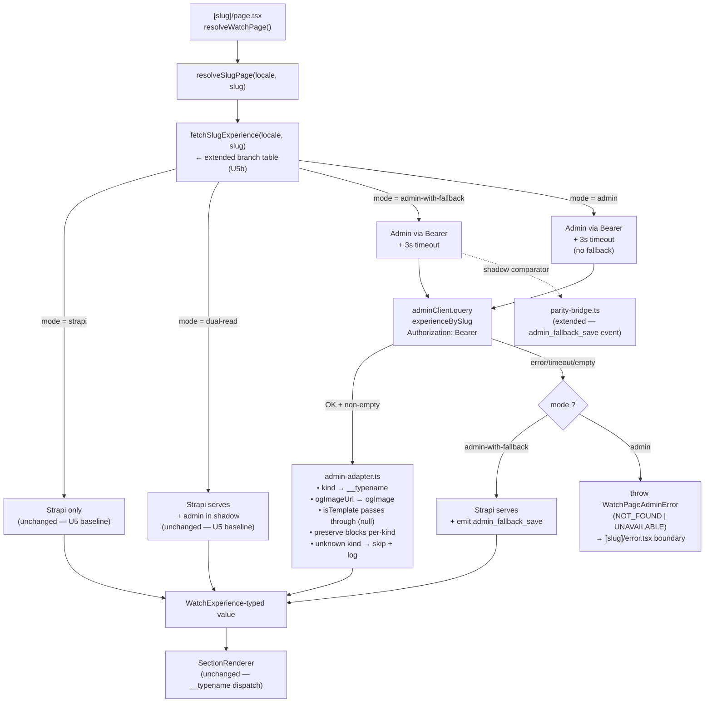

> **SUPERSEDED 2026-05-12.** This plan's phased-ramp architecture (dual-read → admin-with-fallback → admin) was designed for a multi-month Strapi sunset with 21-day observation windows. The Strapi-removal timeline compressed to ~1-2 weeks, so the cutover architecture pivoted to direct cutover with comprehensive pre-cutover batch verification. See `docs/plans/2026-05-11-003-feat-web-admin-direct-cutover-plan.md` for the current plan and `docs/brainstorms/2026-05-11-consumer-migration-u5b-strapi-sunset-strategy-requirements.md` for the brainstorm that drove the pivot. Durable parts of this plan (admin prereqs — CONSUMER_BEARER, `experienceBySlug` template filter) are reimplemented in plan-003 in the spike-validated shape.

# feat(web): admin-core consumer migration — web admin-mode rendering (Unit 5b)

## Summary

Extend U5's dual-read canary to user-facing admin rendering. Add two new `FORGE_CONTENT_API` values — `admin-with-fallback` (admin renders user-facing; Strapi catches failures) and `admin` (admin renders; no fallback) — for the `/watch/[slug]` slug-page Experience branch only. Land a lossless admin → `WatchExperience` shape adapter that takes admin's `ExperienceLocale` + JSON `blocks` and produces the Strapi-shaped `WatchExperience` the existing renderer dispatch consumes (R6, R2 of PR #921 residual). Wire a `WEB_ADMIN_API_KEYS` Bearer identity on the SSR admin client so production traffic gets its own rate-limit bucket instead of starving on admin's shared anonymous-IP ceiling (R12). Define R18a numeric thresholds anchored against U5's actual dual-read parity baseline — PR #915 has been emitting `forge.parity.diff` since 2026-05-11, so the migration's first threshold numbers come from observed signal, not "felt middling." Ship the `apps/web/src/app/[slug]/error.tsx` boundary so admin-mode throws surface as the same not-found UX a Strapi failure does — but **mode-aware**: it catches only `WatchPageAdminError` (a typed admin-mode error); every other error path keeps the existing inline-error contract in `[slug]/page.tsx` (R8).

**Shipped as two PRs, not one.** PR-A (admin-side): `CONSUMER_BEARER` principal + `WEB_ADMIN_API_KEYS` env + `experienceBySlug` template filter — lands and deploys to admin production FIRST, mirroring PR #921's discipline and the cross-app receiver-first rotation rule (`docs/solutions/platform/admin-manager-enrichment-trigger-endpoint-20260506.md`). PR-B (web-side): `ContentApiMode` extension + adapter + branch table + error boundary + runbook stub — opens against a known-live admin surface.

Rollback for U5b is process-wide env flip + redeploy — the no-redeploy R17 rollback lands in U7. Mean-time-to-rollback must be **measured before PR-B opens** (two test flips on forge-web with timing recorded) so the number in the runbook is observed, not aspirational.

Out of scope: homepage path (`resolveHomepage`) — depends on `watchSetting` consumer-side adoption (a separate U5c sub-unit); `/watch/[collection]/[video]/[locale]` (U6 video flow); Pothos `defaultStrategy` hardening (R1 from PR #921, owned by U7); admin-side video draft leakage (R5/R6 from PR #921, separate small admin PR); the R17 no-redeploy rollback mechanism (U7); mobile/TV adapters (U6).

---

## Problem Frame

U5 (PR #915) shipped the dual-read parity canary: admin's `experienceBySlug` runs in shadow alongside Strapi, the parity bridge emits structured diff logs, and the user always sees Strapi. PR #921 then widened admin's PUBLIC surface (`videoBySlug`, `videos`, `languages`, `countries`, `keywords`, field-strip on `Experience`/`ExperienceLocale`, new `watchSetting(locale)` query) so every consumer-facing read the migration needs is now reachable anonymously from admin.

The canary's value is the parity signal it generates. U5b is the unit that **acts on that signal** — flipping the same `/watch/[slug]` route from "Strapi serves users, admin runs in shadow" to "admin serves users, Strapi catches failures" to "admin serves users alone." Without U5b, the canary is observable but never actionable; the migration cannot advance past dual-read. The brief sequences mobile and TV behind a stable web cutover (R15), so every week U5b doesn't ship is a week mobile/TV also stay blocked.

The work has four load-bearing parts the canary intentionally deferred: a lossless admin → `WatchExperience` adapter (R6 of brief), per-app SSR rate-limit identity (R12), R18a numeric thresholds before any user traffic flips to admin, and a route-level error boundary (R8) so adapter failures match Strapi's not-found UX. (See origin: `docs/brainstorms/2026-05-05-consumer-migration-implementer-brief-requirements.md`.)

---

## Requirements

- **R1.** `FORGE_CONTENT_API` accepts four values: `strapi` (default — unchanged), `dual-read` (unchanged — Strapi serves, admin runs in shadow), `admin-with-fallback` (admin renders user-facing; on admin failure or empty response, Strapi serves), `admin` (admin renders; admin failure surfaces as a route-level error matching Strapi's not-found UX). Unknown values warn-and-fall-back to `strapi`. _(Origin R7.)_
- **R2.** A lossless adapter at `apps/web/src/lib/admin-adapter.ts` takes admin's `ExperienceLocale` + JSON `blocks` and produces a value typed as `WatchExperience` (the existing Strapi-shape consumer type). Renderer dispatch (`apps/web/src/components/sections/SectionRenderer.tsx`) is not modified — every block the renderer handles today, the adapter produces with the matching `__typename`. _(Origin R6; PR #921 R2 residual.)_
- **R3.** The adapter has a defined unknown-block contract: when admin emits a block whose `kind` discriminator the adapter does not map (e.g., admin-only `videoRecommendations`), the adapter logs a structured warning, skips that block from the output (does NOT throw), and emits a `forge.adapter.unknown_kind` log event. _(Origin R6a — adapted from R6a's discriminator-skip contract.)_
- **R4.** The SSR admin Apollo client sends `Authorization: Bearer ${FIRST_KEY}` on every request where `FIRST_KEY` is the first comma-separated value of `WEB_ADMIN_API_KEYS` (singular CSV env var name on BOTH web and admin sides — symmetric naming prevents the `KEY` vs `KEYS` copy-paste class of operator errors flagged in review). Admin recognizes a new bearer principal type (`CONSUMER_BEARER`) that grants no permissions beyond PUBLIC but buckets rate-limit by the bearer key value, distinct from the shared anonymous-IP bucket. Comparison uses `timingSafeEqual` from `node:crypto` (mirrors `apps/admin/src/auth/workflow-bearer.ts:63-65`) to prevent timing side-channels that could reveal valid-key prefixes to an attacker probing the endpoint. _(Origin R12 / PR #921 R12.)_
- **R5.** In `admin-with-fallback` mode, an admin failure (HTTP error, timeout, adapter throw, empty response for a slug that exists in Strapi) falls through to Strapi for the same request. The fallback emits a `forge.parity.admin_fallback_save` log event so the U5b → U6 advance gate can count fallback saves over the verification window. _(Origin R17a, F2.)_
- **R6.** In `admin` mode, admin failures do NOT fall through. They surface as a typed `WatchPageAdminError` with discriminator `kind: "NOT_FOUND" | "UNAVAILABLE"` (collapsed from a wider 4-code design after review — `NOT_FOUND` corresponds to admin returning null for a slug; `UNAVAILABLE` covers admin HTTP errors, timeouts, and adapter throws, all of which render the same generic error UX). The error is re-thrown from `[slug]/page.tsx` so Next.js's `apps/web/src/app/[slug]/error.tsx` boundary catches it; **all other errors (Strapi sentinel errors, non-typed throws) continue to render via the existing inline `<ExperienceEmpty>`/`<ExperienceError>` path in `page.tsx:35-39`** — the boundary is mode-aware and additive, NOT a replacement for the existing inline error UX. The `error.tsx` boundary file is a Client Component (`"use client"`) — Next.js App Router error boundaries cannot be Server Components. The `kind: "NOT_FOUND"` branch renders the same UX as a Strapi `NO_EXPERIENCE_FOUND_MESSAGE` failure; the `kind: "UNAVAILABLE"` branch renders the same UX as a Strapi `<ExperienceError>` failure. _(Origin R8.)_
- **R7.** R18a numeric thresholds are defined in the runbook section of this plan and referenced from `docs/admin-core-migration/cutover-runbook.md` (new file). Four metrics: parity diff rate, admin error rate, missing-content rate, fallback-save rate — each with a numeric threshold and observation window. The runbook is the source of truth; advancing the slug route between modes requires the named threshold to hold for the named window. _(Origin R18a, R19.)_
- **R8.** The admin Apollo client respects a per-call timeout strictly shorter than the route's existing 10s Strapi budget. In `admin` and `admin-with-fallback` modes the timeout MUST account for the additional fallback round-trip; budget = `ADMIN_REQUEST_TIMEOUT_MS` (3000ms inherited from U5) with a route-level wrapper budget of 8000ms to leave 2s headroom on Vercel/Railway request limits. _(Origin R12; learning `outbound-timeout-shorter-than-caller-budget-20260506.md`.)_
- **R9.** The adapter is fixture-tested with one fixture per block kind shared between Strapi and admin (16 kinds per `STRAPI_TO_ADMIN_KIND` map in `packages/graphql/src/parity/discriminator-map.ts:25-42`), PLUS one fixture for the unknown-kind path (covering an `ADMIN_ONLY_KINDS` entry such as `videoRecommendations`). The 16 shared fixtures assert lossless adaptation; the unknown-kind fixture asserts the skip+log contract from R3. The 16-kind set notes: `ComponentSectionsCard` exists in the discriminator map but is NOT dispatched at the renderer's top level (Card lives inside container slots — see `apps/web/src/components/sections/index.tsx`); its fixture asserts correct nesting inside a Container, not top-level dispatch. Each fixture asserts the adapter output passes the existing `WatchExperience`-consumer type-check at compile time and renders identically to the Strapi-shape input through the renderer dispatch at runtime. _(Origin R6, R12a.)_
- **R10.** Regression: U5's regression snapshot at `apps/web/src/lib/__tests__/content-mode-regression.test.ts` (R12 of U5) is extended to cover the two new mode values. With `mode ∈ {undefined, null, "", "strapi", "dual-read", "garbage"}`, `fetchSlugExperience` behavior is byte-identical to U5's contract. With `mode === "admin-with-fallback"` or `"admin"`, the regression snapshot captures the new branch's expected shape (admin response → adapter → `WatchExperience`-typed value) against a fixture admin response. _(Origin R8 — extends U5 R12.)_
- **R11.** Deletion checklist co-located at the top of `admin-adapter.ts` and `error.tsx`, cross-referenced from the three existing deletion checklists (`content-api-mode.ts:1-39`, `parity-bridge.ts:1-28`, `packages/graphql/src/parity/index.ts:1-34`). All five lists stay in sync. _(Origin R20; learning `throwaway-operator-harness-deletion-contract-20260430.md`.)_
- **R12.** PR #921's field-level `authScopes` strip on `Experience.isTemplate` (admin's `Experience` type) and U5b's new server-side `where: { experience: { isTemplate: false } }` filter on `experienceBySlug` are **complementary, not redundant** — field-strip governs FIELD VISIBILITY when the row IS returned (PUBLIC sees `isTemplate: null` on Experience parent reads, which is what U5c will eventually consume through `Video.parents` or similar nested paths); the server filter governs QUERY VISIBILITY (the query never returns a template row at all to PUBLIC/CONSUMER*BEARER callers, so the consumer's `asNonTemplateExperience` check at `apps/web/src/lib/content.ts:228-233` never sees a template result it would misclassify as non-template). The adapter does NOT synthesize `isTemplate` — it propagates whatever admin returned (null after PR #921's field-strip). The consumer-side check `experience.isTemplate === true` correctly evaluates `null === true` as false, which is the right answer when the server has already guaranteed no template rows reach this query. *(Origin R10 — leverages PR #921's field-strip and adds a complementary server-side query filter; adapter stays pass-through to avoid the dual-source-of-truth ambiguity flagged in review.)\_
- **R13.** All new code authored under U5b is enumerated in the deletion checklist at `apps/web/src/lib/admin-adapter.ts`. When admin becomes the sole source AND the canary scaffolding retires (per U5's checklist), the entire `apps/web/src/lib/content-api-mode.ts` enum collapses back to a single hardcoded `"admin"` and the adapter + parity bridge + error boundary become legacy debt. _(Origin R20.)_

**Origin actors:** A1 (Urim — sole owner of consumer + admin sides), A2 (web end users — must see no behavior change in `admin-with-fallback`; must see same not-found UX in `admin` on admin failure), A3 (parity comparator from U4 — still runs in `dual-read` and now in `admin-with-fallback` for the fallback-save metric).

**Origin flows:** F1 (per-route dual-read — unchanged), F2 (per-route migration progression — U5b implements the `dual-read → admin-with-fallback → admin` transitions), F3 (rollback — U5b's rollback is process-wide env flip + redeploy; the no-redeploy variant is U7).

**Origin acceptance examples:** AE2 (covers R8 — admin failure does not break Strapi-mode rendering); AE3 (covers R7, R17 — flag flip restores Strapi reads); AE5 (covers R6, R6a, R12, R12a — adapter normalizes admin's blocks and the parity comparator confirms zero structural/value/order/semantic diff).

---

## Scope Boundaries

- Homepage route (`resolveHomepage`) — depends on `getWatchSettings` adoption + `WatchSetting`-shape adapter (not just `experienceBySlug`). Separate sub-unit U5c.
- `/watch/[collection]/[video]/[locale]` route and its dedicated `resolveWatchVideo` resolver — separate flag surface, separate query (`getWatchVideoOperation`), part of U6.
- Video-template fallback inside `resolveSlugPage` — depends on `videos` query and `WatchSetting` consumer-side adoption. U5c.
- Mobile and TV adapters — U6, gated on web admin-mode holding a stable window in production AND on the R16 Apollo persisted-cache invalidation experiment.
- Pothos `defaultStrategy` hardening (PR #921 R1 — new admin resolver without `authScopes` is effectively PUBLIC) — owned by U7.
- Admin-side video draft leakage (PR #921 R5 / R6 — `Video.dubs` + `VideoService.list/getById/getBySlug` filter only on `deletedAt: null`) — separate small admin-side PR, not blocking U5b. Documented in U5b's PR description as a known residual.
- Per-route or per-slug flag granularity — U5b ships process-wide env-var, same as U5. R17's true no-redeploy rollback is U7.
- Parity-diff CI gate — U7 surface. U5b's structured logs feed an operator-reviewed dashboard, not an automated merge gate.
- Apollo persisted-cache invalidation strategy — mobile-only concern, deferred per origin R16.
- Strapi nested-relation `pagination: { limit: -1 }` audit on `watchExperienceFragment` — separate hardening pass. U5b's adapter test surface should surface this if a parity diff appears.
- GraphQL Armor cost-limit recalibration for the now-PUBLIC video scene graph (PR #921 R11) — owned by U7 runbook work.

### Deferred for later

- _(carried from origin)_ Per-route flag override — R17 no-redeploy rollback. U5b documents that "rollback for U5b is redeploy with `FORGE_CONTENT_API` flipped"; the true mechanism lands in U7.
- _(carried from origin)_ Apollo persisted-cache invalidation strategy for mobile (R16) — gated on cache-key versioning experiment outside U5b.
- _(carried from origin)_ Strapi decommission — entirely separate plan after web + mobile + TV all reach parity-clean windows in `admin` mode.

### Deferred to Follow-Up Work

- **U5c — admin-mode rendering for homepage + video-template paths.** Adds a `getWatchSettings` admin shadow + `WatchSetting`-shape adapter so `resolveHomepage` and `resolveSlugPage`'s video-template fallback can join the canary. Sequenced after U5b proves the adapter pattern. U5c is where the adapter signature widens from `slot: "experienceBySlug"` to include `"homepage" | "defaultTemplate"`.
- **Per-block-kind adapter coverage extension.** The 16 kinds from `STRAPI_TO_ADMIN_KIND` are the U5b baseline. Admin-only `videoRecommendations` ships as `forge.adapter.unknown_kind` until U5c gives it a renderer.
- **R17 no-redeploy rollback mechanism.** U7. Likely a config-store read with short TTL.
- **Parity-diff CI gate.** U7.
- **GraphQL Armor cost-limit recalibration.** U7.
- **Emergency bearer-key revocation procedure.** Distinct from planned key rotation. Planned rotation is additive (stage new key first, then deploy caller, then remove old key — old + new both valid during the overlap). Emergency revocation (a key is known exfiltrated) requires REMOVING all current keys from `WEB_ADMIN_API_KEYS` on admin and deploying admin BEFORE the caller updates, accepting a brief degradation to `dual-read` fallback during the gap. Documented in the runbook; the actual operator-facing playbook is owned by U7's runbook completion.

---

## Context & Research

### Relevant Code and Patterns

- `apps/web/src/lib/content.ts:370-436` — `fetchSlugExperience` is the existing branch site. U5b extends the branch table from two cases (`strapi`, `dual-read`) to four (`strapi`, `dual-read`, `admin-with-fallback`, `admin`). The two new branches share the admin fetch path with `dual-read`'s `fetchAdminSlugExperience` (lines 339-368) — reuse the function, don't duplicate.
- `apps/web/src/lib/content-api-mode.ts:51` — `ContentApiMode` is currently `"strapi" | "dual-read"`. The deletion checklist at lines 1-39 already names the four-value envelope (line 96-101 comment) — extending the union to four is the minimum change. `normalizeContentApiMode` already warns on unknown values and falls back to `"strapi"`, so the parity-bridge debug guard (`apps/web/src/lib/parity-bridge.ts:336-337`) doesn't need to change.
- `apps/web/src/lib/admin-client.ts:22-36` — Apollo singleton with per-call `AbortSignal.timeout(3000)`. U5b adds `Authorization: Bearer` to the `HttpLink` headers via a request middleware, deriving the bearer value from `env.WEB_ADMIN_API_KEYS.split(",")[0]`. Module-scope construction of the bearer header is safe (the key doesn't rotate per-request); module-scope construction of the `AbortSignal` is a foot-gun that U5 already documented and avoided. U5b also configures `HttpLink`'s `responseHandler` to suppress Authorization header echoing in error logs.
- `apps/web/src/lib/fragments/admin-experience.ts:21-36` — `adminExperienceBySlugOperation` already selects the 10 fields the adapter needs (`id, slug, locale, title, metaDescription, ogImageUrl, ogTitle, ogDescription, pathSegment, blocks`). No fragment changes required for U5b's slug-page surface. U5c will need a new operation for `watchSetting`.
- `apps/web/src/lib/fragments/watch-experience.ts:18-103` — `watchExperienceFragment` is `on Experience` with inline `... on Component…` selections for 15 block types. The fragment is NOT rewritten in U5b — the adapter produces a value that matches this fragment's result type. (Rewriting the fragment to `on ExperienceLocale` would require both Strapi and admin sides to satisfy it; admin doesn't have `Component…` types, so this is structurally infeasible without a stub schema. Adapter is the cleaner shape.)
- `apps/web/src/lib/parity-bridge.ts:49-66` — 7 existing parity log events. U5b adds two: `forge.parity.admin_fallback_save` (admin-with-fallback fell through to Strapi) and `forge.adapter.unknown_kind` (adapter skipped an unmapped block kind). Update the deletion checklist at lines 1-28.
- `apps/web/src/lib/parity-bridge.ts:381-421` — `adaptStrapi` and `adaptAdmin` are LOSSY normalizer-input adapters (for parity comparison). They are NOT reusable for U5b's render adapter. The render adapter must reverse-map admin's `kind` → Strapi's `__typename`, reconstruct `ogImage` from `ogImageUrl`, and produce the typed-block dynamic-zone shape. New file `apps/web/src/lib/admin-adapter.ts`.
- `packages/graphql/src/parity/discriminator-map.ts:25-42` — `STRAPI_TO_ADMIN_KIND` and the reverse `ADMIN_KIND_TO_STRAPI` are the canonical bidirectional map. The adapter consumes the reverse map. `ADMIN_ONLY_KINDS` (`videoRecommendations`) is the unknown-kind list.
- `packages/graphql/src/parity/normalize-admin.ts` — admin's block normalization via `BlocksSchema` from `@forge/admin/domain/blocks`. The render adapter does NOT need full normalization (it just needs the wire shape preserved + the discriminator mapped); reuse `BlocksSchema.parse` for unknown-kind detection only.
- `apps/admin/schema.graphql:128-148` — `ExperienceLocale` has `blocks: JSON`, `metaDescription`, `ogImageUrl`, `ogTitle`, `ogDescription`, `pathSegment`, `title`, `slug`, `locale`, `id`. No `isTemplate` field. No nested `ogImage` object — just a flat `ogImageUrl: String`.
- `apps/admin/schema.graphql:521` — `experienceBySlug(locale: String!, slug: String!): ExperienceLocale`. PUBLIC since U2 (already-PUBLIC, predates PR #921).
- `apps/admin/schema.graphql:577, 812-825` — `watchSetting(locale: String!): WatchSetting` returns `{ documentId: ID, homepageExperience: ExperienceLocale, defaultTemplateExperience: ExperienceLocale }`. PUBLIC as of PR #921.
- `apps/admin/src/graphql/types/experience.ts:149` — `experienceBySlug` resolver. U5b's admin-side commit adds `where.experience.isTemplate = false` for PUBLIC callers so `asNonTemplateExperience`'s assumption survives. Verified the resolver structure permits this; the existing `getBySlug` service at `apps/admin/src/services/experience.service.ts:195-216` already filters `archivedAt = null` for anonymous so the pattern is established.
- `apps/admin/src/auth/workflow-bearer.ts` + `apps/admin/src/auth/permissions.ts:158-180` — `WORKFLOW_TRIGGER` principal precedent. U5b mints a new `CONSUMER_BEARER` principal with no permissions beyond PUBLIC, but the principal exists so the rate-limit plugin can bucket-by-bearer-key instead of by anonymous IP.
- `apps/admin/src/graphql/plugins/rate-limit.ts:29-33` — `public:${cf-connecting-ip}` is the current anonymous bucket key. U5b extends to `consumer:${bearerKey}` when the bearer matches `WEB_ADMIN_API_KEYS` (CSV).
- `apps/web/src/app/[slug]/[locale]/error.tsx` — existing error boundary at the 2-segment route. The new `[slug]/error.tsx` at U5b mirrors its shape (server-side message classification + client-side render). The current `[slug]/page.tsx` route handles errors inline; U5b moves the not-found rendering into the boundary so admin adapter throws have a consistent UX.
- `apps/web/src/lib/__tests__/content-mode-regression.test.ts` — existing U5 regression snapshot. U5b extends it.

### Institutional Learnings

- **`docs/solutions/architecture-patterns/dual-client-gql-tada-multi-schema-codegen-pattern-20260507.md`** — defines `graphql()` vs `adminGraphql()` factory split U5b queries against. The adapter sits ONE LAYER ABOVE these factories — it converts admin's typed `AdminResultOf` into Strapi's typed `ResultOf` shape via runtime construction.
- **`docs/solutions/best-practices/throwaway-operator-harness-deletion-contract-20260430.md`** — applied verbatim to `admin-adapter.ts`'s top-of-file checklist. Cross-references the four existing deletion lists.
- **`docs/solutions/best-practices/mocked-shape-vs-real-contract-discipline-20260506.md`** — the admin-mode error tests MUST throw typed Apollo errors (`networkError` / `graphQLErrors`), not `new Error("admin failed")`. Mutation-test the fallback branch by deleting it locally and confirming a test fails.
- **`docs/solutions/best-practices/outbound-timeout-shorter-than-caller-budget-20260506.md`** — admin Apollo call's 3000ms per-call timeout is shorter than the route's 10s Strapi budget AND shorter than the route-level 8000ms wrapper budget. Fallback in `admin-with-fallback` has 5000ms headroom after admin times out at 3s.
- **`docs/solutions/best-practices/test-first-regression-snapshot-byte-identical-default-20260429.md`** — the first commit on U5b's PR is the regression snapshot extension. After U5b's later commits land, the extended test must continue to pass for the unchanged modes (`undefined`, `null`, `""`, `"strapi"`, `"dual-read"`, `"garbage"`) and capture the new shapes for the two new modes.
- **`docs/solutions/design-patterns/branched-orchestrator-opt-in-mode-pattern-20260429.md`** — `fetchSlugExperience` already follows this pattern. U5b extends the branch table; the function signature and downstream return type stay unchanged.
- **`docs/solutions/web/nextjs-headers-defeats-route-cache.md`** — `FORGE_CONTENT_API` continues to read at module scope. The new modes do NOT use `headers()` or `cookies()` to make the flag per-request.
- **`docs/solutions/runtime-errors/aws-s3-nosuchkey-classification-pattern-20260506.md`** — error classification by `error.name` first, NOT by message-substring. U5b's adapter throws are classified the same way for the error boundary's UX mapping.
- **`docs/solutions/best-practices/in-memory-slot-reservation-fire-and-forget-20260506.md`** — applies if admin-with-fallback uses any background reservation. U5b's fallback is synchronous (in-band Promise.race-like fall-through), so this doesn't bite here, but the discipline informs the parity bridge's existing extension.
- **`docs/solutions/integration-issues/mobile-relative-image-url-no-base-origin-20260408.md`** — adapter must canonicalize image URLs the same way the parity normalizer does. Reuse `env.NEXT_PUBLIC_CANONICAL_ORIGIN` (already used at `apps/web/src/lib/parity-bridge.ts:313`).
- **`docs/solutions/runtime-errors/required-env-var-without-default-broke-railway-deploy-20260511.md`** — `WEB_ADMIN_API_KEYS` MUST be `.optional()` in `apps/web/src/env.ts`. Setting it as required would brick web's Railway boot before the operator stages the key on the admin side, recreating the exact failure mode this learning records. Runtime branching: if `mode in {"admin-with-fallback", "admin"}` AND `WEB_ADMIN_API_KEYS` is unset, log a structured warning and fall back to `dual-read` mode for that request (defense in depth — the deploy-order discipline is in the runbook but the schema must be safe regardless).
- **`docs/solutions/workflow-issues/ce-code-review-tier-2-mandatory-before-push-20260511.md`** — U5b touches auth (new bearer principal), data routing (mode switching for user-facing render), and external API contracts (new env var). Mandatory Tier-2 `/ce-code-review` before push. Bias toward Apply for any P2+ at 75+ confidence per the learning's routing rule.

### External References

- Next.js 16 App Router caching contract: `unstable_cache` + `revalidate` + `revalidatePath` + Full Route Cache. Already in use in `content.ts`; no new dependency.
- Apollo Client v4 transport-error surface via `error.networkError` — already correctly handled in `fetchAdminSlugExperience` (lines 322-332 of `content.ts`). U5b inherits the existing classification.
- Pothos scope-auth `principal` types — admin uses `PUBLIC | VIEWER | EDITOR | ADMIN | WORKFLOW_TRIGGER` today (per `apps/admin/src/auth/permissions.ts`). U5b adds `CONSUMER_BEARER` to the union via the same builder-config pattern Unit 6 established.

---

## Key Technical Decisions

- **Two PRs, not one — PR-A (admin) ships and deploys to production BEFORE PR-B (web) opens.** PR-A: `CONSUMER_BEARER` principal, `WEB_ADMIN_API_KEYS` env var, `experienceBySlug` `isTemplate=false` filter. PR-B: `ContentApiMode` extension, adapter, branch table, error boundary, runbook stub. Rationale: PR #921 deliberately kept admin changes in their own focused PR for review hygiene AND for the cross-app receiver-first rotation rule (`docs/solutions/platform/admin-manager-enrichment-trigger-endpoint-20260506.md`) — admin's new bearer-recognition path must be live in production before web starts sending the bearer header. The earlier "single PR with 5 commits" design (called out in headless doc review) triggers concurrent admin+web Railway redeploys on merge with no deterministic ordering; the runtime fallback to dual-read masks the race but creates a silent dual-read window even after the operator believes admin-mode is live. The two-PR shape eliminates the race and matches the established pattern.

- **Render-side adapter, not fragment rewrite.** The `WatchExperience` fragment stays `on Experience` and selects Strapi's typed-block dynamic-zone (`... on ComponentSectionsMediaCollection`, etc.). The adapter constructs an object that satisfies this Strapi-typed shape at runtime from admin's `ExperienceLocale` + JSON `blocks`. Rationale: rewriting the fragment to `on ExperienceLocale` would require either typing admin's `blocks: JSON` as a typed discriminated union (a synthetic-admin-schema codegen extension that's possible but materially bigger work — zod-to-graphql-union codegen is solved but unproven in this repo) OR writing the fragment to satisfy both sources structurally (defeats type isolation, fails the AE1 cross-schema-assignment compile-time check). Adapter is the lowest-blast-radius option for U5b and lets renderer dispatch (which switches on `__typename`) stay unchanged. The synthetic-schema alternative is a credible follow-up if maintenance of the 16 transformers becomes a burden — recorded as a future consideration, not pursued now. The adapter's job: reverse-map `kind` → `__typename` via `ADMIN_KIND_TO_STRAPI`, reconstruct `ogImage: { url, width, height, alternativeText }` from `ogImageUrl: String | null`, **pass through `isTemplate` as null** (admin field-strips it for PUBLIC, server filter from PR-A guarantees no template rows reach the query, consumer's `=== true` check correctly evaluates `null === true` as false), preserve every other field 1:1.

- **`isTemplate` server filter is the ONLY guard — adapter does NOT synthesize.** Reviewer flagged the original dual-mechanism design (server filter + adapter synthesis) as a dual-source-of-truth ambiguity. Single mechanism: PR-A adds `where: { experience: { isTemplate: false } }` to `experienceBySlug` for PUBLIC + CONSUMER_BEARER callers. The query never returns a template to the consumer. The adapter receives admin's response and passes `isTemplate` through as-is (null, post-PR #921 field-strip). The consumer's `experience.isTemplate === true` check at `apps/web/src/lib/content.ts:228-233` evaluates `null === true` as false — correctly classifying the experience as non-template, which IS the right answer because the server already guaranteed no template rows are returned. If a future maintainer weakens the server filter, the adapter no longer masks the regression — `isTemplate` passes through with whatever admin returns, and template detection works correctly via the same `=== true` check.

- **`WEB_ADMIN_API_KEYS` is the env var name on BOTH web and admin sides (plural CSV).** Symmetric naming eliminates the `KEY` vs `KEYS` copy-paste class of operator errors flagged in review. Web reads the env var, picks the FIRST comma-separated entry as its outbound bearer key. Admin parses the full CSV and recognizes any entry as a valid `CONSUMER_BEARER` principal. Rotation procedure: stage new key as a second CSV entry on admin (old + new both valid), deploy admin, then update web's env var to put the new key first, deploy web, then remove the old key from admin. Web's `WEB_ADMIN_API_KEYS` is `.optional()` in `apps/web/src/env.ts` per the recent Railway deploy-blocked learning (`docs/solutions/runtime-errors/required-env-var-without-default-broke-railway-deploy-20260511.md`); runtime fallback emits `forge.parity.consumer_bearer_missing` and falls back to dual-read for the request if unset.

- **`CONSUMER_BEARER` admin principal — empty permission set, CI-enforced.** Mirrors the `WORKFLOW_TRIGGER` precedent (`apps/admin/src/auth/workflow-bearer.ts`) but with `CONSUMER_BEARER_PERMISSIONS = new Set()`. To prevent the "future contributor adds a permission to the set" failure mode flagged in review, U5b PR-A adds a CI test asserting `hasPermission(CONSUMER_BEARER_PRINCIPAL, key) === false` for EVERY `PermissionKey` enumerated in the permission matrix. Adding any key to `CONSUMER_BEARER_PERMISSIONS` fails the test — the invariant is machine-enforced, not merely conventional. Bearer comparison uses `timingSafeEqual` from `node:crypto` (the same primitive `apps/admin/src/auth/workflow-bearer.ts:63-65` uses) to prevent timing side-channels.

- **R18a thresholds anchored against U5's actual parity baseline.** Before PR-B's runbook commits numeric values, pull `forge.parity.diff` log data from PR #915's deploy window (2026-05-11 through PR-B's open date — at minimum 7 days of dual-read signal). Compute observed: parity diff rate, admin error rate (HTTP failures + harness errors), `forge.parity.admin_missing` rate. These observed values are the starting thresholds. Tighten by 1.5x or loosen by 1.5x with rationale recorded in the runbook commit message. If observed parity is noisier than expected, identify allow-list extensions (per U5's plan) before publishing thresholds — chasing a 1% target against a 5% observed baseline guarantees stall. The placeholder numbers (parity ≤1% / 7d, admin error ≤0.5% / 7d, missing-content ≤0.1% / 7d, fallback-save ≤0.1% / 14d) used in earlier drafts are abandoned in favor of measurement-derived anchors.

- **`error.tsx` is mode-aware and a Client Component.** `apps/web/src/app/[slug]/error.tsx` is a Client Component (`"use client"`) — Next.js App Router error boundaries cannot be Server Components. The boundary catches ONLY `WatchPageAdminError` (the typed admin-mode error). Strapi-mode sentinel errors and non-typed throws continue to render via the existing inline `<ExperienceEmpty>` / `<ExperienceError>` path in `[slug]/page.tsx:35-39` — the boundary is additive for the admin-mode throw class, NOT a replacement for the existing error-rendering contract. This addresses the reviewer concern that adding `error.tsx` would silently change Strapi-mode error UX for the 1-segment route. The classification check inside the boundary is `error instanceof WatchPageAdminError && error.kind === "NOT_FOUND"` → not-found UX (same shape as Strapi's `<ExperienceEmpty>`); `error instanceof WatchPageAdminError && error.kind === "UNAVAILABLE"` → generic error UX (same shape as Strapi's `<ExperienceError>`); anything else → re-throw to Next.js's segment-default error UX (which today never fires because the inline path catches it first).

- **`WatchPageAdminError` has 2 codes, not 4.** Reviewer flagged the original 4-code design (`ADMIN_NULL | ADMIN_ERROR | ADMIN_TIMEOUT | ADAPTER_ERROR`) as over-abstracted — 3 of 4 codes produced identical UX. Collapsed to: `NOT_FOUND` (admin returned null for a slug) and `UNAVAILABLE` (admin HTTP error, timeout, or adapter throw). Differentiation needed for log diagnostics happens BEFORE the throw: the `fetchSlugExperience` branch logs the specific subtype (`forge.parity.admin_null`, `admin_timeout`, `admin_fetch_error`, `adapter_error`) via the existing parity-bridge events, then throws the simpler `WatchPageAdminError`. Logs differentiate; renderer doesn't need to.

- **`unstable_cache` wrapper re-throws `WatchPageAdminError`, does not memoize as sentinel.** Reviewer flagged the P0 issue that `fetchResolvedWatchPage` at `apps/web/src/lib/content.ts:595-623` already converts ALL thrown errors into a `{ data: null, error }` sentinel — so the plan's original "error.tsx catches admin throws" contract did not work in this codebase. Fix: inside the `unstable_cache` callback's catch block, detect `error instanceof WatchPageAdminError` and re-throw. `unstable_cache` re-throws errors from its inner function to its caller AND does NOT cache them. The sentinel pattern continues to work for Strapi sentinel errors (which are not throws — they're returned values). `WatchPageAdminError` bubbles to `resolveWatchPage`'s caller (`page.tsx`), which lets it propagate up to Next's segment error boundary — `error.tsx` catches it. The 60-second cache stale-state for failures only applies to Strapi sentinel-returned errors, NOT to admin-mode throws — which is correct, because admin transient failures should retry on next request, not be cached for 60s.

- **Bearer header is set unconditionally on admin client construction (also in `dual-read` shadow traffic).** Reviewer noted that dual-read shadow traffic will burn the per-bearer rate-limit bucket. This is intentional: dual-read shadow load against the bearer bucket IS the de-facto capacity test for the admin-mode bucket that the Risks table calls for. Document this explicitly so operators don't conflate dual-read shadow load with admin-mode user-facing load when reading rate-limit dashboards; the bucket's load is a function of all admin reads, not just user-facing ones.

- **`CONSUMER_BEARER` as a typed principal vs a flag on the request.** Reviewer asked whether a typed principal is necessary or if rate-limit bucketing could be done directly from the Authorization header presence. Decision: keep the typed principal. Justification: matches the `WORKFLOW_TRIGGER` precedent (consistency with existing pattern lowers cognitive load); makes the empty-permission-set invariant testable at the type level (`hasPermission(CONSUMER_BEARER_PRINCIPAL, key) === false` is grep-able and lintable); creates a clear audit surface for the new auth path (one principal type to reason about, not bearer-header-special-cases scattered through rate-limit + context). The header-only alternative would save ~30 LOC in `permissions.ts` but lose the CI-assertable invariant.

- **Mean-time-to-rollback MUST be measured before PR-B opens.** Reviewer flagged the "~2-5 min" claim as aspirational. PR-A's runbook stub records the measurement methodology; PR-B's runbook completion records the observed numbers. Methodology: run two test flips of `FORGE_CONTENT_API` between `strapi` and `dual-read` in the production forge-web service, time the env-flip-to-traffic-serving cycle (Railway env-var save → deploy trigger → container build → health-check → DNS/traffic shift), record P50 + worst-case. Replace "~2-5 min" in the runbook with the measured numbers and an honest worst-case ceiling. If worst-case exceeds 10 minutes, materially reconsider whether admin mode should ship before U7's no-redeploy mechanism lands.

- **Adapter fixture coverage: 16 shared + 1 unknown = 17 fixtures.** 16 fixtures cover the shared `STRAPI_TO_ADMIN_KIND` map. 1 fixture covers the unknown-kind path (`videoRecommendations` from `ADMIN_ONLY_KINDS`). The unknown-kind fixture asserts the adapter SKIPS the block and emits a `forge.adapter.unknown_kind` log entry — does NOT throw. `ComponentSectionsCard` is in the discriminator map but NOT in the renderer's top-level dispatch (Card lives inside container slots); its fixture asserts correct nesting inside a Container, not top-level dispatch. Container and Section transformers are the heaviest — both reconstruct nested `slots[].content[]` shape from admin's flat `content[]` array partitioned by `containerSlot` markers. Plan-side estimate: Container transformer ~150 LOC, Section transformer ~100 LOC, other 14 transformers ~30-50 LOC each. Total adapter file size projection: ~800-1000 LOC. A shared `partitionContainerContent()` helper extracts the flat-to-nested logic so Section can reuse it.

- **Adapter signature is narrow to `slot: "experienceBySlug"` for U5b.** Reviewer flagged the original `slot: "experienceBySlug" | "homepage" | "defaultTemplate"` signature as over-committing to U5c's surface before U5c exists. U5b's signature: `adaptAdminExperienceLocale(input, ctx: { urlLocale: string }): WatchExperience` — no `slot` argument. U5c widens the signature when `homepage` + `defaultTemplate` slots actually have a consumer. This also simplifies U5b's test surface — fewer combinatoric scenarios to cover for code paths that don't yet exist.

- **`admin-with-fallback` emits a shadow parity comparator entry; `admin` mode does not.** Even when admin serves user-facing in `admin-with-fallback`, the comparator runs in shadow on a Strapi response for the same request — feeds the fallback-removal metric (R17a). New parity-bridge log event: `forge.parity.admin_fallback_save`. Once `mode === "admin"`, the comparator is no longer needed for go/no-go gating; U5c or U7 deprecates the dual-fetch in `admin` mode. The route-level budget (8000ms wrapper) is sized for admin + shadow Strapi + adapter in `admin-with-fallback` mode; if profiling shows the shadow compare adds non-trivial latency to the user-facing path, gate it behind a sampling flag.

---

## Open Questions

### Resolved During Planning

- **Q: Fragment rewrite vs adapter vs synthetic admin schema?** _Resolved:_ adapter. Fragment rewrite to `on ExperienceLocale` would require either a synthetic-admin-schema codegen extension (zod-to-graphql-union — possible but unproven in this repo and materially bigger work) or breaking type isolation. Adapter is the lowest-blast-radius option for U5b. Synthetic schema is recorded as a credible follow-up if maintenance of the 16 transformers becomes a burden.
- **Q: How does the consumer's `isTemplate` check survive admin's field-strip?** _Resolved:_ server-side filter `where.experience.isTemplate = false` on `experienceBySlug` for PUBLIC + CONSUMER*BEARER callers in PR-A. Adapter passes `isTemplate` through as-is (null, post-PR #921 field-strip); consumer's `=== true` check evaluates `null === true` as false, which is the right answer because the server guarantees no template rows reach the query. Single mechanism, no dual-source ambiguity. *(Updated from earlier "adapter synthesizes" design after review.)\_
- **Q: Per-app rate-limit identity — bearer / Redis prefix / accept anonymous?** _Resolved:_ per-app bearer (`WEB_ADMIN_API_KEYS` + `CONSUMER_BEARER` admin principal). Origin R12 says the issue "must be addressed before consumer traffic reaches production"; accepting anonymous is not acceptable for `admin` mode. Bearer pattern mirrors admin's existing `WORKFLOW_TRIGGER` precedent. Symmetric env var name (plural CSV on both sides) prevents the `KEY` vs `KEYS` copy-paste error class.
- **Q: Typed `CONSUMER_BEARER` principal vs header-only special case in rate-limit plugin?** _Resolved:_ typed principal. Justification: consistency with `WORKFLOW_TRIGGER` precedent (lower cognitive load), the empty-permission-set invariant becomes CI-testable, and the new auth path has a clear audit surface.
- **Q: Required or optional env var for `WEB_ADMIN_API_KEYS`?** _Resolved:_ `.optional()` with runtime fallback. Per the recent learning at `docs/solutions/runtime-errors/required-env-var-without-default-broke-railway-deploy-20260511.md`.
- **Q: R18a numeric thresholds — aggressive (24h) or conservative (30d) or middling (7d)?** _Resolved:_ measurement-derived, not picked from the abstract trade-off. Pull U5's actual `forge.parity.diff` data (PR #915 has been emitting since 2026-05-11) and use observed values as the starting thresholds. The "middling" placeholder numbers from earlier drafts (1% / 0.5% / 0.1% / 7d-14d) are abandoned in favor of empirical anchors.
- **Q: `WatchPageAdminError` code count?** _Resolved:_ 2 codes (`NOT_FOUND`, `UNAVAILABLE`), not 4. Log differentiation happens before the throw via existing parity-bridge events; renderer dispatch only needs 2 UX branches. _(Collapsed from `ADMIN_NULL | ADMIN_ERROR | ADMIN_TIMEOUT | ADAPTER_ERROR` after review.)_
- **Q: One PR with admin+web commits, or two PRs (admin first)?** _Resolved:_ two PRs. PR-A admin-side deploys to production BEFORE PR-B (web) opens. Matches PR #921's precedent and the cross-app receiver-first rotation rule.
- **Q: Adapter signature for U5b — narrow or wide?** _Resolved:_ narrow. `adaptAdminExperienceLocale(input, ctx: { urlLocale: string }): WatchExperience` — no `slot` argument until U5c needs it.
- **Q: Where do the new log events emit?** _Resolved:_ same stdout `console.log(JSON.stringify(...))` shape U5 uses. Two new events: `forge.parity.admin_fallback_save` (extends parity-bridge.ts's union) and `forge.adapter.unknown_kind` (new namespace from `admin-adapter.ts`).
- **Q: Should `dual-read` mode still emit parity diffs when `mode === "admin-with-fallback"` or `"admin"`?** _Resolved:_ `admin-with-fallback` runs the comparator in shadow (for fallback-removal go/no-go); `admin` does not. The branching lives in `fetchSlugExperience`, not in `parity-bridge.ts`.
- **Q: How do admin-mode throws actually reach `error.tsx` given that `unstable_cache` swallows throws today?** _Resolved (P0 from review):_ inside the `unstable_cache` callback's catch block, detect `error instanceof WatchPageAdminError` and re-throw. `unstable_cache` re-throws errors from its inner function and does NOT cache them — the sentinel pattern only applies to Strapi sentinel-returned errors. `WatchPageAdminError` bubbles to `page.tsx`, which lets it propagate to Next's segment error boundary.

### Deferred to Implementation

- **Specific copy / layout for `[slug]/error.tsx`.** Mirrors `[slug]/[locale]/error.tsx` shape; copy choice ships during PR-B final-commit review.
- **Exact byte length / character set for `WEB_ADMIN_API_KEYS` CSV values.** Mirror `WORKFLOW_API_KEYS`' convention (32-byte hex). Document in the runbook.
- **Cache-busting strategy when admin-side data shape changes during canary.** `unstable_cache(["watch-page"], { revalidate: 60 })` keys by tag; both modes share the same cache key for non-throwing results. If admin and Strapi shapes diverge during the canary, the cache may serve stale entries from the previous mode for up to 60s after a mode flip. Document the 60s expectation; revisit if the per-route mode flip mechanism U7 ships warrants finer-grained invalidation.
- **Whether to gate the shadow parity comparator in `admin-with-fallback` mode behind a sampling flag.** If profiling shows the shadow compare adds non-trivial latency to the user-facing path, gate it. Default: run on every request, since the canary route is low-traffic and the diff signal is the gating evidence for advancing to pure `admin` mode.

---

## High-Level Technical Design

> _This illustrates the intended approach and is directional guidance for review, not implementation specification. The implementing agent should treat it as context, not code to reproduce._

The branch table is the only structural change to `fetchSlugExperience`. The adapter is the new layer between admin's wire response and the renderer's expected shape. Both new modes share the same admin Apollo client (with Bearer) and the same adapter. The parity bridge gains one new event; the admin-adapter introduces one new event. The renderer is untouched.

---

## Implementation Units

**U5b ships as two PRs:**

- **PR-A (admin-side, U1):** lands and deploys to production FIRST. Sets up admin's bearer-recognition path so web has a known-live surface to target. Single implementation unit.
- **PR-B (web-side, U2-U5):** opens AFTER PR-A is deployed. Four implementation units (U2 env + regression, U3 adapter, U4 branch table, U5 error boundary + runbook).

### U1. PR-A — Admin-side: `CONSUMER_BEARER` principal + `WEB_ADMIN_API_KEYS` env + `experienceBySlug` template filter

**Goal:** Land the admin-side changes U5b depends on: (a) a new `CONSUMER_BEARER` principal that buckets rate-limit by bearer key without granting any permissions beyond PUBLIC; (b) `WEB_ADMIN_API_KEYS` CSV env var on `forge-admin` Doppler; (c) server-side `where: { experience: { isTemplate: false } }` filter on `experienceBySlug` for PUBLIC + CONSUMER_BEARER callers; (d) CI assertion that `CONSUMER_BEARER_PERMISSIONS` stays empty.

**Requirements:** R4, R12.

**Dependencies:** None. Lands as the sole commit on PR-A. Must be deployed to production (forge-admin Railway service) BEFORE PR-B is opened.

**Files:**

- Create: `apps/admin/src/auth/consumer-bearer.ts` (mirrors `apps/admin/src/auth/workflow-bearer.ts` shape — `isValidConsumerBearer(headerValue: string | null): { valid: boolean; bucketKey: string | null }`)
- Modify: `apps/admin/src/auth/permissions.ts` (add `CONSUMER_BEARER` to the role union; define `CONSUMER_BEARER_PERMISSIONS: ReadonlySet<PermissionKey> = new Set()`; update `hasPermission` to return `false` for CONSUMER_BEARER on any key — PUBLIC scope still applies via the `public: true` authScope path)
- Modify: `apps/admin/src/auth/principal.ts` (add `CONSUMER_BEARER_PRINCIPAL` factory mirroring `WORKFLOW_TRIGGER_PRINCIPAL`)
- Modify: `apps/admin/src/graphql/context.ts` (mint `CONSUMER_BEARER` principal when `Authorization: Bearer <key>` matches `WEB_ADMIN_API_KEYS`)
- Modify: `apps/admin/src/graphql/plugins/rate-limit.ts:29-33` (extend bucket-key logic — if principal is `CONSUMER_BEARER`, key by `consumer:${bearerKey}`)
- Modify: `apps/admin/src/config/env.ts` (add `WEB_ADMIN_API_KEYS: z.string().optional()` — CSV-parsed; matches `WORKFLOW_API_KEYS` convention)
- Modify: `apps/admin/src/graphql/types/experience.ts` (extend `experienceBySlug` resolver: for PUBLIC and CONSUMER_BEARER callers, add `where: { experience: { isTemplate: false } }` to the Prisma query)
- Test (new): `apps/admin/src/auth/consumer-bearer.test.ts`
- Test (extend): `apps/admin/src/graphql/plugins/rate-limit.test.ts` (cover the `consumer:${bearerKey}` bucket)
- Test (extend): `apps/admin/src/graphql/types/experience.test.ts` (cover `experienceBySlug` returns null for `isTemplate=true` Experience to PUBLIC AND CONSUMER_BEARER; returns the Experience for EDITOR/ADMIN)
- Modify: `apps/admin/schema.graphql` (regenerated — no SDL diff expected since `authScopes` is stripped and the resolver's WHERE filter is internal; `admin-schema-drift` CI confirms)
- Modify: `packages/graphql/src/admin-graphql-env.d.ts` (regenerated — should also be a no-op, but run codegen as part of the commit per the project's drift-discipline)

**Approach:**

- `consumer-bearer.ts` exports `isValidConsumerBearer(headerValue): { valid: boolean; bucketKey: string | null }`. The function trims `"Bearer "` prefix, splits `env.WEB_ADMIN_API_KEYS` on commas, and confirms the supplied key matches an entry. **Use `timingSafeEqual` from `node:crypto`** for the comparison (matches `apps/admin/src/auth/workflow-bearer.ts:63-65`) to prevent timing oracles that could reveal valid key prefixes. Returns `bucketKey: <the matched key>` (the actual matched CSV entry, not the user-supplied input) so the rate-limit plugin can bucket by key (not by IP).
- **Principal-resolution ordering:** Session (Better Auth cookie) check runs FIRST. Workflow-bearer check runs SECOND. Consumer-bearer check runs THIRD. An editor with a valid session who ALSO presents a consumer bearer is resolved by their session (gets EDITOR role), NOT by the bearer (CONSUMER_BEARER would have no permissions). This prevents accidental privilege downgrade.
- `permissions.ts` adds the `CONSUMER_BEARER` role to the role-string literal union. `hasPermission(user, key)` returns `false` for any key when `role === "CONSUMER_BEARER"`; PUBLIC scope is satisfied via the `public: true` authScope path that already exists. No permission-matrix entry is required; CONSUMER_BEARER is intentionally narrower than VIEWER.
- **`CONSUMER_BEARER_PERMISSIONS = new Set()` is CI-enforced empty.** New test in `permissions.test.ts` iterates every `PermissionKey` declared in the permission matrix and asserts `hasPermission(CONSUMER_BEARER_PRINCIPAL("any-key"), perm) === false`. Adding any key to `CONSUMER_BEARER_PERMISSIONS` fails this test — the empty-set invariant becomes machine-enforced, not merely conventional.
- `principal.ts` exports a factory `CONSUMER_BEARER_PRINCIPAL(bucketKey: string): Principal` for use by `context.ts`. Principal shape: `{ id: null, role: "CONSUMER_BEARER", rateLimitBucketKey: bucketKey }`. The new `rateLimitBucketKey` field is read by the rate-limit plugin's `identifyFn`; `id: null` matches `WORKFLOW_TRIGGER_PRINCIPAL`'s convention so existing `ctx.user?.id` checks behave correctly.
- `context.ts` extends the principal-resolution chain (after the session and workflow-bearer checks): check `isValidConsumerBearer(request.headers.get("authorization"))`. If valid, the request's principal is `CONSUMER_BEARER_PRINCIPAL(matchedKey)`.
- `rate-limit.ts`'s `identifyFn` (lines 29-33) switches: if `ctx.user?.role === "CONSUMER_BEARER"`, return `consumer:${ctx.user.rateLimitBucketKey}`. Otherwise, current behavior (`ctx.user?.id` if present, else `public:${cf-connecting-ip}`).
- `experience.ts`'s `experienceBySlug` resolver extends its existing Prisma `where` clause with a conditional `experience: { isTemplate: false }` when `ctx.user?.role` is `null` (PUBLIC) or `"CONSUMER_BEARER"`. EDITOR/ADMIN see all (matches the existing `getBySlug` pattern at `apps/admin/src/services/experience.service.ts:195-216`).
- **Per-bearer rate-limit ceiling:** verify in implementation that the existing query/mutation limits (60/min Query, 30/min Mutation in `rate-limit.ts:35-38`) apply to the `consumer:` bucket. If web SSR fanout during cold-cache windows is likely to exceed 60/min for a single bearer, raise the per-bearer ceiling explicitly. Plan-time recommendation: 2x the expected SSR peak, recorded in the runbook.

**Patterns to follow:**

- `apps/admin/src/auth/workflow-bearer.ts` — mirrored for the `timingSafeEqual` comparison shape; the new return-bucketKey semantics deviate from `WORKFLOW_TRIGGER`'s id-null pattern.
- `apps/admin/src/auth/permissions.ts:158-180` — `WORKFLOW_TRIGGER_PERMISSIONS` set + `hasPermission` early-return shape.
- `apps/admin/src/services/experience.service.ts:195-216` — `getBySlug`'s principal-aware `where` filter for `archivedAt`.

**Test scenarios:**

- _(Covers R4.)_ Happy path: `isValidConsumerBearer("Bearer key-aaa")` with `WEB_ADMIN_API_KEYS="key-aaa,key-bbb"` returns `{ valid: true, bucketKey: "key-aaa" }`.
- Edge case: `isValidConsumerBearer(null)` returns `{ valid: false, bucketKey: null }`.
- Edge case: `isValidConsumerBearer("Bearer not-in-list")` returns `{ valid: false, bucketKey: null }`.
- Edge case: `isValidConsumerBearer("Bearer key-aaa")` with `WEB_ADMIN_API_KEYS` unset returns `{ valid: false, bucketKey: null }`.
- Edge case: bearer prefix missing — `isValidConsumerBearer("key-aaa")` returns `{ valid: false, bucketKey: null }`.
- _(Covers R4.)_ **Timing-safe assertion:** verify the comparison uses `timingSafeEqual`. A unit test plus a property: `isValidConsumerBearer("Bearer wrong-of-equal-length")` and `isValidConsumerBearer("Bearer key-aaa")` should take statistically indistinguishable time when sampled (loose 5%-of-mean tolerance — exact CI tuning per environment).
- _(Covers R4.)_ Rate-limit: an anonymous request with a valid bearer is bucketed `consumer:key-aaa`. Distinct from another anonymous request without a bearer (`public:1.2.3.4`).
- Privilege gate: `hasPermission(CONSUMER_BEARER_PRINCIPAL("any-key"), "read:experiences")` returns `false`. `hasPermission(CONSUMER_BEARER_PRINCIPAL("any-key"), "write:scene-embeddings")` returns `false`. No key grants permission.
- **CI-enforced invariant:** `for (const perm of ALL_PERMISSION_KEYS) { assert hasPermission(CONSUMER_BEARER_PRINCIPAL("any-key"), perm) === false }`. Adding any permission to `CONSUMER_BEARER_PERMISSIONS` fails this test.
- **Principal-resolution ordering:** an editor with a valid Better Auth session AND a valid `Authorization: Bearer` header is resolved as EDITOR (session wins). The bearer header is ignored when a session is present.
- _(Covers R12.)_ Filter: PUBLIC calls `experienceBySlug(locale: "en", slug: "homepage-template")` against an Experience with `isTemplate: true` → returns `null`. EDITOR calls same → returns the ExperienceLocale.
- _(Covers R12.)_ Filter: CONSUMER_BEARER (valid bearer) calls `experienceBySlug` against a template → returns `null` (same as PUBLIC).
- Regression: PUBLIC and CONSUMER_BEARER calling `experienceBySlug` against a non-template Experience returns the ExperienceLocale identically.
- **Log scrubbing:** no log emission in `consumer-bearer.ts`, `context.ts`, or `rate-limit.ts` echoes the raw `Authorization` header value. Test: spy on the structured logger, exercise the principal-resolution chain with a fake bearer, assert no log payload contains the bearer string.

**Verification:**

- `pnpm --filter @forge/admin test` passes including new test cases.
- `pnpm --filter @forge/admin typecheck` clean.
- `admin-schema-drift` CI job is clean (no SDL change expected from the WHERE-clause extension since the `authScopes` directive is stripped at print time).
- Manually issuing a `curl -X POST .../api/graphql -H "Authorization: Bearer key-aaa" -d '{"query":"{ experienceBySlug(locale:\"en\", slug:\"homepage-template\") { id } }"}'` against a seeded DB with `isTemplate=true` returns `null`.

---

### U2. Web env + `ContentApiMode` extension + regression snapshot

**Goal:** Extend `ContentApiMode` from two values to four. Add `WEB_ADMIN_API_KEYS` (plural, symmetric with admin-side name) to web's env schema as `.optional()`. Extend the U5 regression snapshot to cover the two new modes.

**Requirements:** R1, R8, R10.

**Dependencies:** None within PR-B (lands as the first PR-B commit). U1 (PR-A) is a deploy prerequisite for the live admin-mode flip but is not a code dependency for this commit — `WEB_ADMIN_API_KEYS` is optional and runtime branching catches the missing-key case.

**Files:**

- Modify: `apps/web/src/env.ts` (add `WEB_ADMIN_API_KEYS: z.string().optional()` to server schema + runtimeEnv — **plural CSV, matches the admin-side env var name**; extend `FORGE_CONTENT_API`'s `z.enum` from two to four values: `["strapi", "dual-read", "admin-with-fallback", "admin"]`)
- Modify: `apps/web/src/lib/content-api-mode.ts:51` (extend `ContentApiMode` from `"strapi" | "dual-read"` to `"strapi" | "dual-read" | "admin-with-fallback" | "admin"`; update `RECOGNIZED_MODES` array; update top-of-file deletion checklist + comment at line 96-101 reflecting the four values are now live)
- Modify: `apps/web/src/lib/content-api-mode.test.ts` (cover the two new mode values)
- Modify: `apps/web/src/lib/__tests__/content-mode-regression.test.ts` (extend `mode ∈` matrix to include `"admin-with-fallback"` and `"admin"` against mocked admin response; assert the new branches return adapter output, not Strapi output)

**Approach:**

- The four-value `z.enum` becomes the canonical accepted set. `normalizeContentApiMode` already handles unknown values defensively; no logic change needed there.
- The regression snapshot test currently asserts byte-identical behavior for five mode values; extend the matrix to seven. For `"admin-with-fallback"` and `"admin"`, the mocked admin response feeds through the adapter (lands in U3); for those two modes the test asserts `expect(strapiQueryMock).not.toHaveBeenCalled()` when admin succeeds — distinct from `"strapi"` and `"dual-read"` where Strapi IS called.
- `WEB_ADMIN_API_KEYS` lives alongside `ADMIN_GRAPHQL_URL` in the schema. Both `.optional()` so default-mode boot stays clean. Symmetric naming with admin's env var is load-bearing — see Key Technical Decisions.
- Top-of-file deletion checklist in `content-api-mode.ts` already describes the four-value envelope (the file was forward-prepared during U5). Update the prose to reflect "U5b ships values 3 and 4" → "U5b SHIPPED values 3 and 4."

**Patterns to follow:**

- `apps/web/src/lib/content-api-mode.ts:96-101` — the docstring already names the four-value envelope; update from forward-looking to current-state.
- `apps/web/src/lib/__tests__/content-mode-regression.test.ts` — extend the existing matrix per the test-first regression discipline.

**Test scenarios:**

- _(Covers R1, R10.)_ Regression: `FORGE_CONTENT_API="strapi"` → `fetchSlugExperience` returns Strapi-equivalent value byte-for-byte. `expect(adminQueryMock).not.toHaveBeenCalled()`.
- _(Covers R1, R10.)_ Regression: `FORGE_CONTENT_API="dual-read"` → Strapi serves, admin runs in shadow. `expect(adminQueryMock).toHaveBeenCalled()`.
- _(Covers R1, R10.)_ Regression: `FORGE_CONTENT_API="admin-with-fallback"` → admin's response (via the adapter, mocked here as identity for the test setup) is returned. `expect(strapiQueryMock).not.toHaveBeenCalled()` when admin succeeds.
- _(Covers R1, R10.)_ Regression: `FORGE_CONTENT_API="admin"` → same as above.
- Edge case: `FORGE_CONTENT_API="garbage"` → normalized to `"strapi"`. `expect(adminQueryMock).not.toHaveBeenCalled()`.
- Edge case: `FORGE_CONTENT_API="ADMIN"` (wrong case) → normalized to `"strapi"` with warn.
- Edge case: `normalizeContentApiMode("admin-with-fallback")` returns `"admin-with-fallback"` (no warn).
- Boot path: `WEB_ADMIN_API_KEYS` unset → boots clean. Runtime fallback (in U4) handles the missing-key case.

**Verification:**

- `pnpm --filter @forge/web typecheck` clean.
- New + extended test files pass.
- The seven-mode regression matrix passes.

---

### U3. Admin → `WatchExperience` render adapter

**Goal:** Build the lossless adapter that takes admin's `ExperienceLocale` + JSON `blocks` and produces a `WatchExperience`-typed value the renderer dispatch consumes unchanged. Fixture-test every block kind.

**Requirements:** R2, R3, R9, R11, R13.

**Dependencies:** U2 (needs `ContentApiMode` accepting the new modes for the test setup).

**Files:**

- Create: `apps/web/src/lib/admin-adapter.ts` (exports `adaptAdminExperienceLocale(input: AdminExperienceLocaleResult, ctx: { urlLocale: string }): NonNullable<WatchExperience>` plus the `forge.adapter.unknown_kind` log event. **Narrow signature — no `slot` arg.** U5c widens.)
- Create: `apps/web/src/lib/admin-adapter-helpers.ts` (extracts the shared `partitionContainerContent()` helper so Container and Section transformers can reuse it; keeps `admin-adapter.ts` focused on the per-kind transformer table)
- Create: `apps/web/src/lib/admin-adapter.test.ts` (16 block-kind fixture tests + 1 unknown-kind test + integration test against the renderer dispatch)
- Create: `apps/web/src/lib/__tests__/fixtures/admin-blocks/` (17 fixture files: 16 shared kinds + 1 unknown-kind, each pairing an admin-shape input with the expected Strapi-shape output)
- Modify: `apps/web/src/lib/parity-bridge.ts` (extend `PARITY_LOG_EVENTS` with `forge.parity.admin_fallback_save`; extend the deletion checklist top-of-file with cross-reference to `admin-adapter.ts`)

**Approach:**

- `adaptAdminExperienceLocale(input, ctx)` builds the output by:
  1. Reverse-mapping `kind` → `__typename` via `ADMIN_KIND_TO_STRAPI` from `packages/graphql/src/parity/discriminator-map.ts`. For each block, look up the Strapi typename; if the kind is in `ADMIN_ONLY_KINDS` (e.g., `videoRecommendations`), skip it and emit a `forge.adapter.unknown_kind` log line (single emit per request batched with all unknown kinds, not per block — to avoid log volume).
  2. Reconstructing `ogImage: { url, width, height, alternativeText }` from `ogImageUrl: String | null`. Width/height/alternativeText default to `null` (admin doesn't carry them today; future widening can populate). When `ogImageUrl` is null, `ogImage: null`.
  3. **Passing `isTemplate` through as-is** (post-PR #921 field-strip, this is `null` for PUBLIC/CONSUMER_BEARER callers). No synthesis. PR-A's server-side filter guarantees no template rows reach this query; consumer's `=== true` check at `content.ts:228-233` correctly evaluates `null === true` as false. Single source of truth: the server filter.
  4. Preserving every other field 1:1: `documentId ← id`, `slug`, `locale`, `title`, `metaDescription` (Strapi's `metaDescription` matches admin's name), `ogTitle`, `ogDescription`, `pathSegment`.
  5. For each block, calling a per-kind transformer that takes the admin block payload (Zod-validated by admin's `BlocksSchema`) and produces the Strapi-shape (the inverse of `normalize-admin.ts`'s flattening). 14 of the 16 transformers are simple field copies (~30-50 LOC each). **Container and Section transformers are heavier (~150 LOC and ~100 LOC respectively)** because admin stores container content as a FLAT `content[]` array with synthetic `containerSlot` markers acting as slot dividers, while Strapi's shape is nested `slots[].content[]` with per-slot `id`/`gridSpan`/`spans`. The shared `partitionContainerContent()` helper in `admin-adapter-helpers.ts` does the flat→nested reconstruction once; Container and Section both call it.
- **Total adapter file size projection: ~800-1000 LOC** across `admin-adapter.ts` + `admin-adapter-helpers.ts`. If this proves unwieldy at implementation, split the transformer table into per-kind files inside `apps/web/src/lib/admin-adapter/` — keep the public surface `adaptAdminExperienceLocale` stable.
- The `WatchExperience` type comes from the existing `apps/web/src/lib/content.ts:106` derivation (`type WatchExperience = WatchData["experiences"][number]`). Adapter returns `NonNullable<WatchExperience>` — null is an invalid output (caller handles the "admin returned null" case before invoking the adapter).
- URL canonicalization uses `env.NEXT_PUBLIC_CANONICAL_ORIGIN`, matching `apps/web/src/lib/parity-bridge.ts:313`. Strapi serves relative `/uploads/foo.png`; admin serves absolute `https://canonical-origin/uploads/foo.png`. The adapter normalizes to absolute, matching admin's emission, so the renderer (which already handles both via `validateUrl.ts`) doesn't see a behavior change. **Pre-condition:** verify `env.NEXT_PUBLIC_CANONICAL_ORIGIN` on web matches admin's emitted base. If they diverge (e.g., admin is configured for a different CDN), parity diffs in shadow look like adapter bugs but are configuration drift — document in U4's PR description.

**Patterns to follow:**

- `packages/graphql/src/parity/normalize-admin.ts` — admin block shape consumers, but in REVERSE (the parity normalizer flattens admin blocks to a comparable shape; the adapter produces the Strapi shape directly).
- `packages/graphql/src/parity/discriminator-map.ts:25-42` — the bidirectional discriminator map; `ADMIN_KIND_TO_STRAPI` is the lookup; `ADMIN_ONLY_KINDS` is the skip list.
- `apps/web/src/lib/parity-bridge.ts:381-421` — `adaptAdmin` is the lossy-comparator adapter; the render adapter is structurally similar but lossless.

**Test scenarios:**

- _(Covers R2, R9, AE5.)_ Happy path: per-kind fixture (16 total) where admin's block payload + the adapter's transform produces a Strapi-shape block whose `__typename` matches the kind. Each fixture asserts the adapter output passes the existing `WatchExperience` consumer type-check at compile time (via a `satisfies` clause in the test) and renders identically through the renderer dispatch at runtime (via a snapshot of `SectionRenderer`'s output).
- _(Covers R3.)_ Edge case: admin emits `kind: "videoRecommendations"` → adapter skips the block, emits one `forge.adapter.unknown_kind` log entry, does NOT throw. The rest of the experience renders normally.
- _(Covers R3.)_ Edge case: admin emits `kind: "completely-fictional-kind"` → adapter skips the block, emits one `forge.adapter.unknown_kind` log entry, does NOT throw. (Defense against future admin schema changes.)
- Edge case: admin response with `ogImageUrl: null` → adapter produces `ogImage: null`. Renderer (which already handles null ogImage) is unchanged.
- Edge case: admin response with `ogImageUrl: "https://canonical-origin/uploads/x.jpg"` + Strapi-shape with `ogImage: { url: "/uploads/x.jpg" }` → both URLs canonicalize to the same value under `validateUrl`; renderer treats them as equivalent.
- _(Covers R12.)_ Edge case: admin returns `isTemplate: null` (post-field-strip) → adapter passes `isTemplate: null` through. Consumer's `experience.isTemplate === true` evaluates to false, classifying the experience as non-template — which IS correct because PR-A's server filter guarantees no template rows reach this query.
- Edge case: empty `blocks` array → adapter produces `blocks: []`.
- Container fixture: admin's flat `[block1, containerSlot{gridSpan:6, spans:{...}}, block2, block3, containerSlot{gridSpan:6, spans:{...}}, block4]` → adapter produces Strapi nested `slots: [{id, gridSpan:6, spans, content:[block1]}, {id, gridSpan:6, spans, content:[block2, block3]}, …]`. Verify slot dividers correctly partition content.
- Section fixture: nested Container inside Section, both reconstruction patterns trigger; assert the rendered DOM matches Strapi-shape output node-for-node.
- Integration: `mergeWatchExperience({ video, variant, canonicalParent: null, experience: adapter_output })` (from `content.ts:1273`) produces the same `MergedWatchBlock[]` as `mergeWatchExperience({ ..., experience: strapi_shape_input })` for the same logical experience.
- Type contract: `adaptAdminExperienceLocale(...)` return value `satisfies NonNullable<WatchExperience>` — compile-time check that the adapter's output is structurally a valid Strapi WatchExperience.
- Log shape: when the unknown-kind path triggers, `forge.adapter.unknown_kind` payload contains the unmapped kind value + the slug + the locale, no raw block content (R13 defense-in-depth applies to adapter logs too).

**Verification:**

- `pnpm --filter @forge/web typecheck` clean.
- All 16 + 2 fixture tests pass.
- Integration test confirms the renderer dispatch produces identical output between Strapi-shape and admin-shape inputs for every shared kind.

---

### U4. Branch `fetchSlugExperience` for `admin-with-fallback` + `admin` modes + `unstable_cache` re-throw

**Goal:** Extend `fetchSlugExperience`'s branch table from two cases to four. Wire the Bearer header on the admin client (with Apollo error-log scrubbing). Implement the fallback semantics for `admin-with-fallback`. Implement the throw-to-error-boundary semantics for `admin` — including the `unstable_cache` re-throw fix that makes `error.tsx` actually fire.

**Requirements:** R1, R4, R5, R6, R8, R12.

**Dependencies:** U2 (env + mode union extended), U3 (adapter). PR-A (U1) must be deployed to production before this code is enabled in any environment (runtime fallback to `dual-read` catches mistakes but is not a substitute for deploy ordering).

**Files:**

- Modify: `apps/web/src/lib/admin-client.ts` (extend the Apollo singleton with a Bearer header derived from `env.WEB_ADMIN_API_KEYS` first CSV entry; configure `HttpLink` to suppress Authorization header echoing in error responses)
- Modify: `apps/web/src/lib/content.ts:370-436` (extend `fetchSlugExperience`'s branch table; introduce `fetchAdminSlugExperienceStrict` helper for `admin` mode; preserve `dual-read` branch semantics exactly)
- Modify: `apps/web/src/lib/content.ts:595-623` — **`fetchResolvedWatchPage`'s `unstable_cache` callback's catch block.** Add `if (error instanceof WatchPageAdminError) throw error;` BEFORE the sentinel conversion. `unstable_cache` re-throws errors from its inner function (and does NOT cache them), so `WatchPageAdminError` bubbles to `resolveWatchPage`'s caller, propagates through `[slug]/page.tsx`, and reaches the new `error.tsx` boundary. Strapi sentinel errors continue to be returned as `{ data: null, error }` — the existing inline-error path keeps working unchanged.
- Modify: `apps/web/src/app/[slug]/page.tsx` — currently calls `resolveWatchPage()` and handles `result.error` inline. After the U4 change, the cache propagates `WatchPageAdminError` as a thrown exception rather than a returned sentinel; add a re-throw line so it reaches the segment boundary: `if (result.error && result.error instanceof WatchPageAdminError) throw result.error;`. Wait — `unstable_cache` re-throws automatically, so `result` is never assigned in that branch; the try/catch reshape happens inside the cache callback. Verify the surface during implementation: the goal is "`WatchPageAdminError` reaches `error.tsx`; everything else keeps existing inline behavior."
- Add: `WatchPageAdminError` class export from `apps/web/src/lib/content.ts` (near `WatchVideoError`).
- Modify: `apps/web/src/lib/content.test.ts` (cover the new branches)

**Approach:**

- `admin-client.ts` extends the `HttpLink` with a custom fetch that injects `Authorization: Bearer ${env.WEB_ADMIN_API_KEYS.split(",")[0]}` when the key is set. Key is module-scope (no per-request override); fetch is the existing `timeoutFetch` closure plus header injection. **Apollo error logging:** configure `HttpLink` and the surrounding Apollo Client error-handling to NEVER echo the `Authorization` header in `networkError.message`, `networkError.response`, or any serialized error path. Apollo v4's default error formatting may include request details — explicitly scrub via the `responseHandler` in `HttpLink` config.
- When `env.WEB_ADMIN_API_KEYS` is unset, the header is omitted entirely — admin treats the request as anonymous, rate-limit bucketing falls back to the shared IP bucket. This is the deploy-order graceful-degradation path.
- `WatchPageAdminError extends Error` with `kind: "NOT_FOUND" | "UNAVAILABLE"`. The 2-code design (down from the original 4-code design after review): `NOT_FOUND` = admin returned null for a slug; `UNAVAILABLE` = admin HTTP error, timeout, or adapter throw. Differentiation for log diagnostics happens BEFORE the throw via existing parity-bridge events (`forge.parity.admin_null`, `admin_timeout`, `admin_fetch_error`, plus a new `forge.adapter.error` for adapter throws).
- `fetchSlugExperience` branch table:
  - `"strapi"`: unchanged (`getExperienceByFilters` directly).
  - `"dual-read"`: unchanged (existing parallel Strapi + admin + parity log).
  - `"admin-with-fallback"`: Fetch admin via `fetchAdminSlugExperience`. On admin OK + non-null response, run the adapter and return the result. On admin error/timeout, fetch Strapi via `getExperienceByFilters` and return that; emit `forge.parity.admin_fallback_save` log entry. On admin OK + null response (the slug doesn't exist on admin yet — backfill gap), fall through to Strapi same as the error case. ALSO emit a shadow `forge.parity.diff` from the parity bridge using both responses (for fallback-removal gating).
  - `"admin"`: Fetch admin only. On admin OK + non-null, run the adapter and return. On admin null, log `forge.parity.admin_null` then `throw new WatchPageAdminError("NOT_FOUND")`. On admin error/timeout, log the matching subtype event then `throw new WatchPageAdminError("UNAVAILABLE")`. On adapter throw, log `forge.adapter.error` then `throw new WatchPageAdminError("UNAVAILABLE")`.
- Runtime safety: at the top of the `admin*` branches, check `env.WEB_ADMIN_API_KEYS`. If unset, log `forge.parity.consumer_bearer_missing` and fall back to `dual-read` semantics for the request.
- **Bearer header set unconditionally** on admin client construction. Documented as intentional in Key Decisions: dual-read shadow traffic ALSO carries the bearer, so the per-bearer bucket sees both shadow and user-facing load — the bucket's observed rate IS the de-facto admin-mode capacity test.

**Patterns to follow:**

- `apps/web/src/lib/content.ts:339-368` — `fetchAdminSlugExperience` is the existing admin fetch helper; reuse for the non-throwing path. Add `fetchAdminSlugExperienceStrict` that throws `WatchPageAdminError` directly.
- `apps/web/src/lib/content.ts:662-691` — `WatchVideoError` typed error precedent for `WatchPageAdminError`.
- `docs/solutions/design-patterns/branched-orchestrator-opt-in-mode-pattern-20260429.md` — the branched-orchestrator pattern; one signature, branch once at the smallest divergence point, share everything downstream.

**Test scenarios:**

- _(Covers R5, AE2.)_ Happy path: `mode === "admin-with-fallback"` + admin returns a valid response → adapter runs, value returned, `strapiQueryMock` NOT called.
- _(Covers R5.)_ Fallback: `mode === "admin-with-fallback"` + admin throws ApolloError → Strapi mock called, Strapi value returned, one `forge.parity.admin_fallback_save` log entry.
- Fallback: `mode === "admin-with-fallback"` + admin times out (3s) → Strapi mock called, Strapi value returned, `forge.parity.admin_fallback_save` AND `forge.parity.admin_timeout` log lines emitted.
- Fallback: `mode === "admin-with-fallback"` + admin returns null → Strapi mock called, Strapi value returned, log entry `forge.parity.admin_fallback_save` with `reason: "admin_null"`.
- _(Covers R6.)_ Error: `mode === "admin"` + admin throws ApolloError → `WatchPageAdminError("UNAVAILABLE")` thrown. `expect(strapiQueryMock).not.toHaveBeenCalled()`. Mutation-test: delete the throw locally and confirm a test fails.
- Error: `mode === "admin"` + admin times out → `WatchPageAdminError("UNAVAILABLE")` thrown, plus `forge.parity.admin_timeout` log.
- Error: `mode === "admin"` + admin returns null → `WatchPageAdminError("NOT_FOUND")` thrown.
- Error: `mode === "admin"` + adapter throws → `WatchPageAdminError("UNAVAILABLE")` thrown plus `forge.adapter.error` log.
- Edge case: `mode === "admin-with-fallback"` + `env.WEB_ADMIN_API_KEYS` unset → log `forge.parity.consumer_bearer_missing`, fall back to `dual-read` semantics for this request, Strapi serves, admin still runs in shadow.
- Edge case: `mode === "admin"` + `env.WEB_ADMIN_API_KEYS` unset → log `forge.parity.consumer_bearer_missing`, fall back to `dual-read` semantics for this request, Strapi serves.
- **`unstable_cache` re-throw assertion:** seed the cache callback with a `WatchPageAdminError` throw → assert the outer `fetchResolvedWatchPage` re-throws (not returns sentinel). Seed with a generic `Error` throw → assert the existing sentinel return continues (defends the Strapi error path).
- **Apollo error scrub assertion:** spy on Apollo's error formatting, mock the network to return a 500 with the request echoed in the response body, assert no log payload or Error.message contains the bearer key string. Mutation-test: remove the scrubbing config locally, confirm the assertion fails.
- _(Covers R8.)_ Timeout discipline: admin per-call timeout fires at 3000ms in both `admin*` modes. Asserted via `fetch` mock that delays 5000ms and confirms the call rejects under 3500ms.
- Integration: `resolveSlugPage` callsite continues to return the same `ResolvedWatchPage` shape across all four modes for the same input slug (when admin doesn't throw) — only the underlying source differs. In `admin` mode with admin failure, `resolveSlugPage` does NOT return; it propagates the throw to `error.tsx`.

**Verification:**

- `pnpm --filter @forge/web typecheck | test | lint | build` all clean.
- The branch table is exhaustive (TypeScript narrows on all four modes).
- Manual smoke: `FORGE_CONTENT_API=admin-with-fallback WEB_ADMIN_API_KEYS=<key> pnpm --filter @forge/web dev` + curl a known canary slug + grep stdout for `forge.parity.admin_fallback_save` (or absence, when admin succeeds).
- Manual smoke: `FORGE_CONTENT_API=admin` + point `ADMIN_GRAPHQL_URL` at an unreachable host + curl → verify `error.tsx` renders the UNAVAILABLE UX, NOT the existing inline `<ExperienceError>`.

---

### U5. Mode-aware `[slug]/error.tsx` boundary + cutover runbook stub + rollback measurement

**Goal:** Land the route-level error boundary that catches admin-mode `WatchPageAdminError` and renders Strapi-equivalent UX. Mode-aware: the boundary is additive for the new admin-mode throw class; the existing Strapi-mode inline-error path in `page.tsx` is unchanged. Write the cutover runbook as an explicit STUB with R18a measurement methodology, measured rollback time, monitoring queries, and `TODO(U7)` markers for the sections U7 will complete.

**Requirements:** R6, R7, R8, R11.

**Dependencies:** U4 (admin-mode throw site + `WatchPageAdminError` class exist).

**Files:**

- Create: `apps/web/src/app/[slug]/error.tsx` — **Client Component** (`"use client"` directive at line 1; Next.js App Router error boundaries cannot be Server Components). Mirrors the structural shape of `apps/web/src/app/[slug]/[locale]/error.tsx`. Renders mode-aware branches by classifying `error instanceof WatchPageAdminError`.
- Create: `docs/admin-core-migration/cutover-runbook.md` (new runbook — STUB with sections U5b completes + `TODO(U7)` markers for U7's deferred work)
- Modify: `apps/web/src/lib/admin-adapter.ts` (deletion-checklist top-of-file references the runbook)

**Approach:**

- `error.tsx` is a Client Component (`"use client"` directive — Next.js App Router error boundaries require client-side execution for the `reset` callback). The component receives `{ error: Error; reset: () => void }` props from Next.

  Classification logic (mode-aware):
  - `error instanceof WatchPageAdminError && error.kind === "NOT_FOUND"` → render the same UX as Strapi's `<ExperienceEmpty>` (not-found path). User sees no behavior change vs Strapi's not-found.
  - `error instanceof WatchPageAdminError && error.kind === "UNAVAILABLE"` → render the same UX as Strapi's `<ExperienceError>` (generic error path) with a `reset` button.
  - Anything else (a non-typed error escapes the cache wrapper for an unexpected reason) → re-throw to Next's segment-default boundary. Strapi-mode errors do NOT reach here; they're returned as sentinels from `unstable_cache` and rendered inline by `page.tsx` (unchanged behavior).

  **`error.message` is NEVER rendered** as visible text in either UX branch. The classification uses `error.kind`, not the message. This prevents the unclassified-path information disclosure risk flagged in review.

- Cutover runbook structure:
  - **Pre-canary checklist:** confirm PR-A deployed to forge-admin production AND `WEB_ADMIN_API_KEYS` is set on `forge-admin` Doppler. Confirm web's `WEB_ADMIN_API_KEYS` matches at least one entry (symmetric naming — same env var name on both sides). Confirm `CORS_ALLOWED_ORIGINS` + `AUTH_TRUSTED_ORIGINS` cover the web app's origin. Confirm `ADMIN_GRAPHQL_URL` resolves to a healthy admin endpoint.
  - **Mean-time-to-rollback measurement (TODO before runbook publishes):** run two test flips of `FORGE_CONTENT_API` between `strapi` and `dual-read` on the production forge-web service. Record P50 + worst-case end-to-end (env-var-save → deploy-trigger → container-build → health-check → traffic-shift). Replace the "~2-5 min" placeholder in this runbook with the observed numbers. If worst-case > 10 minutes, escalate before proceeding to admin-mode flips.
  - **Per-mode go/no-go thresholds (R18a) — DERIVED FROM U5 BASELINE, NOT PICKED:**
    - **Methodology:** before publishing thresholds, pull `forge.parity.diff` log data from PR #915's deploy through PR-B's open date (at minimum 7 days of dual-read signal). Compute observed: parity diff rate, admin error rate (HTTP failures + harness errors), `forge.parity.admin_missing` rate. These observed values become the starting thresholds (tighten 1.5x or loosen 1.5x with rationale in PR-B commit message).
    - **Placeholder (overwrite with measured values):** `strapi → dual-read` no threshold; `dual-read → admin-with-fallback` measured parity + admin error + missing-content over 7-day window; `admin-with-fallback → admin` measured fallback-save rate ≤ 0.5x admin-error baseline over 14-day window AND continued parity-clean signal.
    - **If observed parity is noisier than expected:** identify allow-list extensions (per U5's plan) BEFORE publishing thresholds. Chasing a tight target against a noisy baseline guarantees stall.
  - **Per-mode rollback procedure (redeploy-bounded for U5b):** flip `FORGE_CONTENT_API` to the previous value in Doppler, redeploy `forge-web` (Railway dashboard re-deploy or `git push origin main` with no-op commit). Mean-time-to-rollback: **MEASURED VALUE TO INSERT HERE per the measurement step above**. R17's true no-redeploy rollback is owned by U7.
  - **Monitoring queries (Vercel/Railway log search):**
    - `event:"forge.parity.diff" diffCounts.structural>0` — structural diffs (blocking).
    - `event:"forge.parity.admin_timeout"` — admin timeout rate.
    - `event:"forge.parity.admin_fallback_save"` — fallback rate (gates `admin-with-fallback → admin`).
    - `event:"forge.parity.consumer_bearer_missing"` — staging error (env var missing).
    - `event:"forge.adapter.unknown_kind"` — adapter coverage gap.
    - `event:"forge.adapter.error"` — adapter throw in admin mode (manifests as `WatchPageAdminError("UNAVAILABLE")`).
  - **Mode-flip protocol:** never flip mode without a recorded go/no-go decision against thresholds. Threshold tuning requires explicit Urim sign-off.
  - **Emergency bearer-key revocation (NEW operator path — distinct from planned rotation):** If a `WEB_ADMIN_API_KEYS` entry is exfiltrated: (1) REMOVE the exfiltrated key from `forge-admin` Doppler `WEB_ADMIN_API_KEYS` (do NOT add a new key first — that leaves the exfiltrated key valid). (2) Deploy admin. (3) Accept brief degradation to runtime fallback (`dual-read`) on web during the gap. (4) Update web's `WEB_ADMIN_API_KEYS` to a fresh key. (5) Deploy web. Total degradation window ≈ 2 × redeploy-cycle. This is intentionally NOT the additive-rotation procedure — exfiltration requires immediate revocation, not graceful transition.

**Stub-vs-final scope:**

PR-B ships `cutover-runbook.md` as an explicit STUB. The sections U5b owns AND completes: pre-canary checklist, R18a methodology, R18a measured thresholds, per-mode rollback procedure with measured rollback time, monitoring queries, mode-flip protocol, emergency bearer-key revocation. The sections U7 OWNS and completes later: no-redeploy rollback mechanism (currently has a placeholder "U7 owns this"), parity-diff CI gate definition, GraphQL Armor cost-limit recalibration. The stub MUST contain `TODO(U7)` markers in those sections so U7's PR can grep for its work surface.

**Patterns to follow:**

- `apps/web/src/app/[slug]/[locale]/error.tsx` — existing Client Component error boundary at the 2-segment route; structurally mirrored. Note `"use client"` directive at line 1.
- Existing `docs/admin-core-migration/query-inventory.md` — match the directory's documentation pattern (file-level metadata header, plain markdown, kebab-case filenames).

**Test scenarios:**

- _(Covers R6, AE2.)_ Happy path: `mode === "admin"` + `WatchPageAdminError("NOT_FOUND")` thrown → `error.tsx` renders the not-found UX. Snapshot matches `<ExperienceEmpty>`'s output (same UX shape as Strapi's not-found path).
- _(Covers R6.)_ Happy path: `mode === "admin"` + `WatchPageAdminError("UNAVAILABLE")` thrown → `error.tsx` renders generic error UX with `reset` button. Snapshot matches `<ExperienceError>`'s output.
- **Mode-aware behavior assertion:** `mode === "strapi"` + Strapi sentinel returns `{ data: null, error: Error("NO_EXPERIENCE_FOUND_MESSAGE") }` → existing inline `<ExperienceEmpty>` renders. `error.tsx` does NOT fire (the error never throws — it's returned as a sentinel).
- **Mode-aware behavior assertion:** `mode === "dual-read"` + Strapi sentinel returns `{ data: null, error: ... }` → existing inline `<ExperienceError>` renders. `error.tsx` does NOT fire.
- Edge case: `error.tsx` receives a non-`WatchPageAdminError` (defense — unexpected error class) → re-throws to Next.js's segment-default boundary, OR renders a minimal generic error. Decision deferred to commit-time implementation; both options are safe.
- **Information disclosure assertion:** `error.tsx` does NOT render `error.message` for any error path. Snapshot the rendered DOM for both `kind: "NOT_FOUND"` and `kind: "UNAVAILABLE"` and assert the error message string from the throw site does NOT appear in any text node. Mutation test: add `
{error.message}
` locally, confirm assertion fails.
- Documentation: runbook reads cleanly as a stand-alone document; an on-call engineer who has not worked on U5b can execute a rollback from the runbook alone. `TODO(U7)` markers are visible and unambiguous.

**Verification:**

- Manual: at `FORGE_CONTENT_API=admin`, force an admin failure (point `ADMIN_GRAPHQL_URL` at an unreachable host) → verify the 1-segment slug route renders the UNAVAILABLE UX via `error.tsx`, NOT the existing inline `<ExperienceError>`.
- Manual: at `FORGE_CONTENT_API=strapi`, force a Strapi failure → verify the existing inline `<ExperienceError>` renders, NOT `error.tsx`. Confirms mode-aware behavior.
- Mean-time-to-rollback measurement complete; numbers recorded in the runbook. No `~2-5 min` placeholder remaining.
- The runbook contains exact env-var names, log-search queries, rollback steps, and `TODO(U7)` markers. No untracked placeholders.

---

## System-Wide Impact

- **Interaction graph:** `[slug]/page.tsx` and `[slug]/[locale]/page.tsx` both transit `resolveWatchPage` → `resolveSlugPage` → `fetchSlugExperience`. The branch table extends from 2 to 4 cases inside `fetchSlugExperience`; nothing above that boundary changes. `apps/web/src/components/sections/SectionRenderer.tsx` consumes the same `WatchExperience.blocks` shape regardless of mode (the adapter's job is to preserve this contract).
- **Error propagation (changed):** New typed `WatchPageAdminError` propagates from `fetchSlugExperience` through `resolveSlugPage` through `unstable_cache`'s callback re-throw (NEW — U4 modifies the wrapper to re-throw `WatchPageAdminError` instances) to `error.tsx`. Generic errors and Strapi sentinel errors keep their current path: cache catches and returns `{ data: null, error }` sentinel, `[slug]/page.tsx` renders inline `<ExperienceEmpty>` / `<ExperienceError>`. Mode-aware: only admin-mode throws reach the new boundary; Strapi-mode behavior is unchanged.
- **State lifecycle risks:** `unstable_cache` keying is unchanged — all four modes share the cache tag `["watch-page"]`. Non-throwing results from any mode share the cache; admin-mode throws bypass caching entirely (re-thrown by the wrapper). A mode flip via redeploy implicitly invalidates because the deploy flushes the build-time cache. Brief cache-thrash window (60s) is documented.
- **API surface parity:** `WatchExperience` and `ResolvedWatchPage` exported types are unchanged. The adapter's output satisfies the existing `WatchExperience` type. No consumer outside `content.ts` learns about the modes.
- **Auth surface:** A new `CONSUMER_BEARER` admin principal is introduced. Defense-in-depth posture: `CONSUMER_BEARER_PERMISSIONS` is empty (`new Set()`) AND CI-asserted empty via a new test in `permissions.test.ts` that enumerates every `PermissionKey` and asserts `hasPermission(CONSUMER_BEARER_PRINCIPAL("any"), key) === false`. Adding any permission to the set fails CI. Principal-resolution ordering: session > workflow-bearer > consumer-bearer, so an editor with a session + bearer header keeps their EDITOR role.
- **Rate-limit surface:** A new `consumer:${bearerKey}` bucket on admin's Redis-backed limiter. Existing `public:${ip}` bucket continues to receive unbearered traffic; the new bucket is additive. The bucket sees BOTH user-facing admin-mode traffic AND dual-read shadow traffic (intentional — de-facto load test).
- **Operational surface:** Three new log events (`forge.parity.admin_fallback_save`, `forge.adapter.unknown_kind`, `forge.adapter.error`) plus the deploy-order safety net (`forge.parity.consumer_bearer_missing`). Operators add four new queries to their monitoring playbook. The runbook is shipped as an explicit stub with `TODO(U7)` markers for the sections U7 will complete.
- **Unchanged invariants:** ISR `revalidate: 60`. `unstable_cache` tag. Strapi Bearer-auth path for non-canary queries (`getWatchSettings`, `getVideoBySlug`, `getWatchVideoOperation`). `generateMetadata` shape and inputs. `ExperienceEmpty` and `ExperienceError` component contracts. Existing inline error rendering in `[slug]/page.tsx` for Strapi-mode sentinel errors.

---

## Risks & Dependencies

| Risk                                                                                                                                                        | Mitigation                                                                                                                                                                                                                                                                                                                                                                                                                                   |
| ----------------------------------------------------------------------------------------------------------------------------------------------------------- | -------------------------------------------------------------------------------------------------------------------------------------------------------------------------------------------------------------------------------------------------------------------------------------------------------------------------------------------------------------------------------------------------------------------------------------------- |
| `unstable_cache` wrapper swallows admin-mode throws — `error.tsx` never fires. (P0 from doc review.)                                                        | U4 adds `if (error instanceof WatchPageAdminError) throw error;` inside the cache wrapper's catch block. `unstable_cache` re-throws errors from its inner function (and does NOT cache them); the sentinel pattern continues to apply only to Strapi sentinel errors. Test asserts: `WatchPageAdminError` propagates past the cache; generic Error continues to be cached as sentinel.                                                       |
| `error.tsx` authored as a Server Component → build failure. (P1 from review.)                                                                               | U5 specifies `"use client"` directive at line 1 of `error.tsx`. Verified against existing `[slug]/[locale]/error.tsx` precedent. Mirror that file's structural shape.                                                                                                                                                                                                                                                                        |
| `WEB_ADMIN_API_KEYS` deploy-order mistake — web flips to `admin-with-fallback` before admin recognizes the key.                                             | PR-A deploys to forge-admin production BEFORE PR-B opens. Schema `.optional()` + runtime fallback to `dual-read` for the request is the safety net. `forge.parity.consumer_bearer_missing` log event surfaces the gap immediately. Per `docs/solutions/runtime-errors/required-env-var-without-default-broke-railway-deploy-20260511.md`.                                                                                                    |
| Adapter coverage gap — admin emits a kind the renderer can't dispatch.                                                                                      | `ADMIN_KIND_TO_STRAPI` is the canonical bidirectional map; 16-kind fixture coverage proves every shared kind round-trips. `ADMIN_ONLY_KINDS` (currently `videoRecommendations`) is the documented skip list. Monthly audit per origin R6a confirms admin's `BlocksSchema` hasn't grown new kinds without adapter coverage.                                                                                                                   |
| Container/Section transformer complexity exceeds budget. (P1 from review.)                                                                                  | U3 explicitly acknowledges Container ~150 LOC + Section ~100 LOC due to flat-to-nested slot reconstruction. Shared `partitionContainerContent()` helper extracted to `admin-adapter-helpers.ts`. Total adapter file size projection: ~800-1000 LOC; if unwieldy at implementation, split into per-kind files inside `apps/web/src/lib/admin-adapter/`.                                                                                       |
| `isTemplate` check at `apps/web/src/lib/content.ts:228-233` misclassifies a template as a non-template because admin's field-strip nulls the value.         | PR-A's server-side filter (`where: { experience: { isTemplate: false } }`) on `experienceBySlug` for PUBLIC + CONSUMER_BEARER guarantees the query never returns a template. Adapter does NOT synthesize — passes the field through (null). Consumer's `=== true` check evaluates `null === true` as false, which is the right answer. Single source of truth: the server filter. (Updated from earlier dual-mechanism design after review.) |
| `CONSUMER_BEARER` permission set silently extended by a future contributor (security regression). (P1 from review.)                                         | U1 adds CI test asserting `hasPermission(CONSUMER_BEARER_PRINCIPAL("any"), key) === false` for EVERY `PermissionKey` in the matrix. Adding any key to `CONSUMER_BEARER_PERMISSIONS` fails the test. Invariant is machine-enforced, not merely conventional.                                                                                                                                                                                  |
| Bearer key recovered via timing oracle on `consumer-bearer.ts`. (P1 from review.)                                                                           | `isValidConsumerBearer` uses `timingSafeEqual` from `node:crypto` — same primitive as `apps/admin/src/auth/workflow-bearer.ts:63-65`. U1 test scenarios explicitly assert timing-safe comparison; mutation test on the comparator.                                                                                                                                                                                                           |
| Bearer key leaks via Apollo network-error logs or Authorization header echo. (P1 from review.)                                                              | U4 configures `HttpLink`'s `responseHandler` to suppress Authorization header echoing. Test scenario asserts no log payload contains the bearer string after a network failure. Mutation test: remove the scrubbing, confirm the assertion fails.                                                                                                                                                                                            |
| Per-bearer DoS — attacker who learns key exhausts the SSR bucket. (P1 from review.)                                                                         | Emergency revocation procedure in the runbook is distinct from planned additive rotation. Per-bearer ceiling is set to 2x expected SSR peak (recorded in runbook); operator can rotate immediately if exfiltration suspected. Logs from rate-limit hits surface unusual bucket-exhaustion patterns.                                                                                                                                          |
| `WEB_ADMIN_API_KEYS` rotation — old key disabled before new key deployed.                                                                                   | Symmetric rotation procedure per `docs/solutions/platform/admin-manager-enrichment-trigger-endpoint-20260506.md`: stage new key on receiver (admin) FIRST as CSV addition (old + new both valid), THEN deploy on caller (web) with new key, THEN remove old key from admin. No service-account dead minute.                                                                                                                                  |
| `admin-with-fallback` fallback masks real admin issues.                                                                                                     | The fallback-save rate metric is the explicit go/no-go gate for advancing to `admin` mode. Runbook threshold: measured against U5 baseline (NOT a picked number). Per origin R17a.                                                                                                                                                                                                                                                           |
| Adapter throws on production admin data (block payload mismatch with `BlocksSchema`).                                                                       | `WatchPageAdminError("UNAVAILABLE")` thrown; caught by `error.tsx` in `admin` mode, by the fallback in `admin-with-fallback` mode. Adapter test surface (16 + 1 fixtures) reduces the surface; production telemetry on `forge.adapter.unknown_kind` and `forge.adapter.error` is the fast-detection mechanism.                                                                                                                               |
| Admin per-call timeout (3000ms) fires aggressively on slow admin → causes excess fallback.                                                                  | Inherit U5's tuning knob: adjust upward if first-week fallback-save rate is dominated by timeouts. Tracked in PR-B's description.                                                                                                                                                                                                                                                                                                            |
| Rate-limit bucket starvation despite per-app bearer — admin's per-bearer ceiling collapses under SSR fanout.                                                | Capacity-test admin's `consumer:${bearerKey}` bucket with synthetic web SSR load BEFORE the canary advances to `admin-with-fallback`. Per-bearer ceiling explicitly set to 2x expected SSR peak in the runbook. Note: dual-read shadow traffic ALSO occupies this bucket (intentional — de-facto load test).                                                                                                                                 |
| `[slug]/error.tsx` boundary catches a non-`WatchPageAdminError` and changes existing UX.                                                                    | error.tsx classifies on `error instanceof WatchPageAdminError`; unknown errors re-throw to Next's segment-default boundary OR render a minimal generic UX (commit-time decision). Strapi-mode sentinel errors do NOT reach error.tsx — they're returned values, not throws. Mode-aware behavior is asserted with a snapshot test for the strapi+sentinel path.                                                                               |
| `error.tsx` leaks internal admin error message via `error.message`. (P2 from review.)                                                                       | Classification uses `error.kind`, never `error.message`. Test snapshots the rendered DOM and asserts neither branch's text nodes contain the message string. Mutation test enforces.                                                                                                                                                                                                                                                         |
| Mode flip via redeploy invalidates `unstable_cache(["watch-page"])` partway through a deploy; rolling deploy can briefly serve two shapes for the same URL. | Documented in runbook as expected 60s cache-thrash window. Parity bridge surfaces during the window as `forge.parity.diff` — operators should expect noise during planned flips and ignore for a defined cooldown after the flip timestamp.                                                                                                                                                                                                  |
| Strapi nested-relation 10-row cap surfaces as parity diffs (Strapi truncated, admin complete).                                                              | Audit `watchExperienceFragment` for missing `pagination: { limit: -1 }` BEFORE U5b's `admin-with-fallback` is enabled. Per the existing U5 plan's risk.                                                                                                                                                                                                                                                                                      |
| Tier-2 review residuals from PR #921 (R5, R6 — video draft leakage) surface during U5b canary.                                                              | Separate admin PR addresses R5/R6 per scope boundary. U5b's canary doesn't depend on it for the slug-page route. If video routes join the canary (U5c/U6), the residual becomes blocking.                                                                                                                                                                                                                                                    |
| Adapter's runtime construction adds latency vs Strapi's typed selection.                                                                                    | Adapter is a pure function over a parsed JSON payload — sub-millisecond overhead. Negligible compared to the network call. If profiling later flags it, memoize per-slug for the route's cache window.                                                                                                                                                                                                                                       |
| `env.NEXT_PUBLIC_CANONICAL_ORIGIN` divergence between web and admin emits parity diffs that look like adapter bugs.                                         | U4's PR description includes a pre-canary verification: confirm web and admin agree on canonical origin. Mismatch is configuration drift, not an adapter bug.                                                                                                                                                                                                                                                                                |

---

## Documentation / Operational Notes

- **Two-PR shape:** PR-A (admin-side) lands and deploys to production FIRST. PR-B (web-side) opens only AFTER PR-A is live. Matches PR #921 precedent and the cross-app receiver-first rotation rule.
- **Deletion checklist co-location and cross-references:** six checklists now stay in sync — `apps/web/src/lib/content-api-mode.ts` (U5 U1), `apps/web/src/lib/parity-bridge.ts` (U5 U4), `apps/web/src/lib/admin-adapter.ts` (U5b U3 — new), `apps/web/src/lib/admin-adapter-helpers.ts` (U5b U3 — new), `apps/web/src/app/[slug]/error.tsx` (U5b U5 — new), `packages/graphql/src/parity/index.ts:1-34` (harness). Each list cross-references the others so any one going stale is caught at PR review.
- **Env var rollout order (symmetric naming):** `WEB_ADMIN_API_KEYS` deploys to admin Doppler FIRST (CSV with at least one key) as part of PR-A. AFTER PR-A is live, `WEB_ADMIN_API_KEYS` (same env var name) deploys to web Doppler with a value matching one of admin's CSV entries. After deploy completes, flip `FORGE_CONTENT_API` to the next mode.
- **U5b rollback (process-wide, redeploy-bounded):** flip `FORGE_CONTENT_API` to the previous value in Doppler + redeploy `forge-web`. No code revert needed. **R17's "no redeploy rollback" promise applies starting U7** (per-route flag resolution). U5b's mean-time-to-rollback is **measured before PR-B opens** (two test flips on forge-web with timing recorded; the runbook records the observed P50 + worst-case; the "~2-5 min" placeholder from earlier drafts is abandoned). If measured worst-case exceeds 10 minutes, escalate before admin-mode flips happen.
- **Canary advance protocol (empirical anchoring):** R18a thresholds in `cutover-runbook.md` are DERIVED from U5's actual `forge.parity.diff` baseline (PR #915's logs over a ≥7-day window before PR-B opens), NOT picked from the abstract aggressive-vs-conservative trade-off. The runbook records the measurement methodology + observed values + tightening/loosening rationale. Never flip mode without a recorded go/no-go decision.
- **Emergency bearer-key revocation:** distinct from planned additive rotation. Documented in the runbook under "Emergency operator path." Remove exfiltrated key from admin FIRST, deploy admin, accept brief degradation, deploy web with new key.
- **Bearer header set unconditionally:** dual-read shadow traffic also carries the bearer header — this is intentional. The per-bearer rate-limit bucket sees both shadow and user-facing load. Operators should NOT interpret bucket utilization as user-facing-only.
- **Inventory update required:** `docs/admin-core-migration/query-inventory.md` (U1 inventory) must be updated with U5b's status change — `adminExperienceBySlugOperation` now serves user-facing traffic in admin and admin-with-fallback modes, not just shadow parity.
- **Roadmap:** Update `docs/roadmap/platform/feat-104-admin-core-consumer-migration-plan.md` `status` to remain `in-progress` when U5b ships. The roadmap's `complete` flip happens after web + mobile + TV all reach parity-clean windows in `admin` mode (`Success Criteria` of the origin brief).
- **Tier-2 code review before push:** mandatory per `docs/solutions/workflow-issues/ce-code-review-tier-2-mandatory-before-push-20260511.md`. U5b touches auth (CONSUMER_BEARER), data routing (mode switching for user-facing render), and external API contracts (WEB_ADMIN_API_KEYS). Bias toward Apply for any P2+ at 75+ confidence per the learning's routing rule.
- **Doc-review provenance:** this plan went through one round of `ce-doc-review` headless mode on 2026-05-11. Five reviewers (coherence, feasibility, security-lens, scope-guardian, adversarial) surfaced 1 P0, 12 P1, 13 P2 actionable findings + 11 FYI. P0 (unstable_cache wrapper swallows throws), all P1s, and the high-leverage P2s are applied. Run artifact preserved in the session transcript; key applied changes: two-PR split, `WatchPageAdminError` 2-code collapse, symmetric `WEB_ADMIN_API_KEYS` naming, R18a empirical anchoring, mode-aware error.tsx, server-filter-only `isTemplate` mechanism, CI-enforced empty CONSUMER_BEARER permission set, timing-safe bearer comparison spec, Apollo error-log scrub, measured mean-time-to-rollback requirement.

---

## Sources & References

- **Origin document:** `docs/brainstorms/2026-05-05-consumer-migration-implementer-brief-requirements.md`
- **Canonical plan:** `docs/plans/2026-04-22-001-feat-admin-core-consumer-migration-plan.md` (U5 spec at lines 272-308; U6 spec at lines 310-345)
- **U5 plan (just merged PR #915):** `docs/plans/2026-05-08-001-feat-consumer-migration-web-canary-unit-5-plan.md`
- **U2 admin widening plan (just merged PR #921):** `docs/plans/2026-05-11-001-feat-consumer-migration-unit-2-admin-public-widening-plan.md`
- **Roadmap ticket:** `docs/roadmap/platform/feat-104-admin-core-consumer-migration-plan.md`
- **Parity harness:** `packages/graphql/src/parity/index.ts`, `packages/graphql/src/parity/compare.ts`, `packages/graphql/src/parity/normalize-admin.ts`, `packages/graphql/src/parity/discriminator-map.ts`
- **Dual-client gql.tada pattern:** `docs/solutions/architecture-patterns/dual-client-gql-tada-multi-schema-codegen-pattern-20260507.md`
- **Throwaway harness deletion contract:** `docs/solutions/best-practices/throwaway-operator-harness-deletion-contract-20260430.md`
- **Mocked-shape vs real-contract:** `docs/solutions/best-practices/mocked-shape-vs-real-contract-discipline-20260506.md`
- **Outbound timeout discipline:** `docs/solutions/best-practices/outbound-timeout-shorter-than-caller-budget-20260506.md`
- **Branched orchestrator:** `docs/solutions/design-patterns/branched-orchestrator-opt-in-mode-pattern-20260429.md`
- **Test-first regression snapshot:** `docs/solutions/best-practices/test-first-regression-snapshot-byte-identical-default-20260429.md`
- **AWS NoSuchKey classification (error-name discipline):** `docs/solutions/runtime-errors/aws-s3-nosuchkey-classification-pattern-20260506.md`
- **Image URL canonicalization:** `docs/solutions/integration-issues/mobile-relative-image-url-no-base-origin-20260408.md`
- **headers() defeats Full Route Cache:** `docs/solutions/web/nextjs-headers-defeats-route-cache.md`
- **Next.js 16 + Apollo ISR:** `docs/solutions/web/nextjs16-cachecomponents-isr.md`
- **Cross-app bearer + CSV rotation:** `docs/solutions/platform/admin-manager-enrichment-trigger-endpoint-20260506.md`
- **Required-env-without-default broke Railway:** `docs/solutions/runtime-errors/required-env-var-without-default-broke-railway-deploy-20260511.md`
- **Tier-2 review mandatory before push:** `docs/solutions/workflow-issues/ce-code-review-tier-2-mandatory-before-push-20260511.md`
