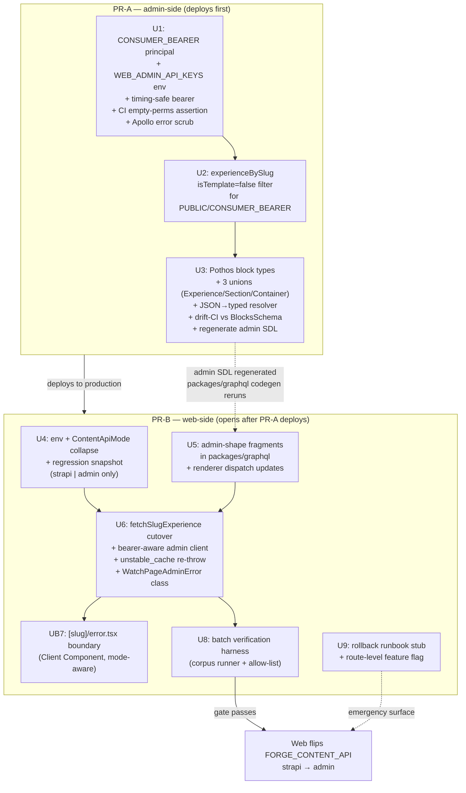

# feat(web): admin-core consumer migration — direct cutover for web slug-page

## Summary

Ship apps/web's slug-page route reading admin via a direct cutover. PR-A lands first: admin gains a `CONSUMER_BEARER` principal for per-app rate-limit bucketing, an `experienceBySlug` template filter, and Pothos union types so `ExperienceLocale.blocks` is typed end-to-end instead of `JSON`. PR-B opens against a known-live admin: collapses `FORGE_CONTENT_API` to `strapi | admin`, ships admin-shape fragments in `packages/graphql`, rewrites `fetchSlugExperience` for direct cutover, lands the `[slug]/error.tsx` boundary, and adds a batch verification harness that gates the cutover on a corpus-wide parity diff being empty or explicitly allow-listed. Web cuts over once the gate passes; mobile and TV inherit the admin-shape fragments in their own future brainstorms. Supersedes the prior phased-ramp plan at `docs/plans/2026-05-11-002-feat-consumer-migration-unit-5b-web-admin-rendering-plan.md`.

---

## Problem Frame

The prior U5b plan was architected for a multi-month Strapi sunset with a phased ramp and observation windows. Strapi is now scheduled for removal within ~1-2 weeks (working assumption — see origin: `docs/brainstorms/2026-05-11-consumer-migration-u5b-strapi-sunset-strategy-requirements.md` Key Decisions). The phased ramp cannot complete in that window, so the architecture shifts from "gradual ramp with Strapi safety net" to "direct cutover with comprehensive pre-cutover batch verification." Web is the first and only platform in this plan's scope. Mobile and TV migrate via their own future brainstorms/plans once web admin-mode is stable in production.

The 2026-05-11 synthetic-schema spike (artifacts under `.tmp/spike-synthetic-schema/`) confirmed gql.tada's parser handles a 17-member nested discriminated union over admin's Zod `BlocksSchema`. The spike validated the architectural mechanism R1 commits to; this plan implements it as Pothos types matching admin's existing pattern.

---

## Requirements

**Carried from origin (`docs/brainstorms/2026-05-11-consumer-migration-u5b-strapi-sunset-strategy-requirements.md`):**

- **R1.** Admin's GraphQL SDL types `ExperienceLocale.blocks` as `[ExperienceBlock!]!` where `ExperienceBlock` is a discriminated union of all 17 top-level block kinds from admin's Zod `BlockSchema` (`apps/admin/src/domain/blocks.ts`). Two nested unions accompany: `SectionContentBlock` (13 members), `ContainerContentBlock` (10 members). Types defined as Pothos in admin matching existing pattern.
- **R2.** Consumer-side admin-shape fragments live in `packages/graphql` (shared exports) authored against `ExperienceLocale`. No per-app adapter ships in `apps/web`. Mobile/TV inherit the same fragments in their own plans.
- **R3.** `FORGE_CONTENT_API` env var collapses to `strapi | admin` only — `dual-read` and `admin-with-fallback` modes are dropped. Once admin mode is active and the bearer is recognized, there is no per-request fallback to Strapi for admin failures (admin errors propagate as `WatchPageAdminError`). A separate one-shot deployment-error safety net (`WEB_ADMIN_API_KEYS` unset → log + serve `strapi` semantics for that request) exists during the cutover window only and retires when Strapi shuts down (see Key Technical Decisions: "Safety-net lifecycle").
- **R4.** Batch verification harness runs offline against the full published-slug corpus before web flips to `admin` mode. Output is a structured per-slug diff report covering all four diff classes from PR #912 (structural, value, order, semantic).
- **R5.** Cutover gate: empty diff set OR every remaining diff is allow-listed with documented rationale. The allow-list mechanism reuses PR #912's existing `DEFAULT_ALLOW_LIST` extension pattern.
- **R6.** Verification approach is iterative: fix actionable diffs, re-run, repeat until gate passes. Convergence is the primary gate, but a deadline-aware threshold rule applies: if remaining diff classes have not converged to empty-or-allow-listed by T-7 days before Strapi's scheduled removal, escalate to the operator with the current diff classes. Contingencies from the brainstorm (Strapi extension request, partial cutover with extended allow-list, deferred cutover) are documented in U9's runbook.
- **R7.** Admin gains a `CONSUMER_BEARER` principal — bearer-authenticated identity granted no permissions beyond PUBLIC. Sole purpose: bucket consumer SSR rate-limit traffic separately from anonymous-IP.
- **R8.** Web only sends an API-key bearer (`WEB_ADMIN_API_KEYS`); mobile/TV do not. Bearer comparison on admin side uses `timingSafeEqual` from `node:crypto`.
- **R8a.** Bearer key lifecycle. `WEB_ADMIN_API_KEYS` is rotated on a 90-day calendar cadence and immediately on trigger events (team-member offboarding, suspected exfiltration, security audit finding). The key value MUST NEVER appear in committed files, PR descriptions, or CI logs — admin-side (`consumer-bearer.ts`, `context.ts`, `rate-limit.ts`) and web-side (`admin-client.ts`, Apollo `HttpLink.responseHandler`) structured logging assert this at unit-test time via log-scrub spy. Emergency revocation procedure is documented in U9's runbook (receiver-first ordering).
- **R9.** Admin's `experienceBySlug` applies server-side `where: { experience: { isTemplate: false } }` filter for PUBLIC and `CONSUMER_BEARER` callers, so consumer's `asNonTemplateExperience` check remains sound.
- **R10.** `CONSUMER_BEARER_PERMISSIONS` is CI-asserted empty across BOTH editorial-permission keys AND workflow-trigger allowlists (e.g., `WORKFLOW_TRIGGER_PERMISSIONS`-style sets). Adding any permission to either surface fails CI.
- **R11.** PR-A admin-side changes deploy to production BEFORE PR-B opens (cross-app receiver-first rotation rule per `docs/solutions/platform/admin-manager-enrichment-trigger-endpoint-20260506.md`). Apollo error-log scrubbing prevents Authorization header leakage in error responses.
- **R12.** `apps/web/src/lib/content.ts`'s `unstable_cache` wrapper re-throws `WatchPageAdminError` so the segment error boundary actually fires; Strapi sentinel-returned errors keep their current path through `[slug]/page.tsx`'s inline rendering.
- **R13.** `apps/web/src/app/[slug]/error.tsx` is a Client Component (`"use client"`) and catches only `WatchPageAdminError` — Strapi-mode errors keep inline behavior; the boundary is additive for admin-mode throws.
- **R14.** Mobile and TV cutover is OUT OF SCOPE for this plan. The synthetic admin schema (R1), admin-shape fragments in `packages/graphql` (R2), admin prerequisites (R7–R11), and the verification approach (R4–R6) ship as a foundation that mobile and TV inherit in their own future brainstorms. _(Carried as a non-goal Requirement from the origin; cross-reference Scope Boundaries for details.)_
- **R16.** Process-wide CSV-of-routes feature flag (`FORGE_DISABLE_WATCH_ROUTES`) exists for emergency rollback at the route granularity. Primary fast rollback (seconds-to-minutes); code-revert + redeploy is secondary (5-15 min). No Strapi-service backstop in rollback story. _Note: this plan does NOT ship a per-slug or per-route no-redeploy mechanism — that lives in the canonical 7-unit plan's U7 (`docs/plans/2026-04-22-001-feat-admin-core-consumer-migration-plan.md`)._

**Origin actors carried forward:** A1 (Urim — sole owner), A2 (web end users — observe no behavior change in admin mode unless admin breaks), A3 (batch verification harness, repurposed from PR #912's runtime canary), A4 (admin service — absorbs production-rate read traffic). A5 (Strapi service during transition) remains a live actor per the brainstorm's Dependencies/Assumptions but is out of scope for this plan's active management — Strapi-removal ownership is external.

**Origin acceptance examples carried forward:** AE1-AE5 from the brainstorm. AE6 (mobile/TV) is out of scope per the brainstorm's web-only carve-out.

**AE coverage by implementation unit:** AE1 (batch verification → R4/R5/R6) covered by U3 (Pothos types support AE1's typed projection) + U5 (admin-shape fragments) + U8 (batch runner). AE2 (admin failure → error boundary) and AE3 (Strapi-mode unchanged behavior) covered by U6 (`fetchSlugExperience` branch + `WatchPageAdminError`) + UB7 (`error.tsx` boundary). AE4 (admin-side prereqs missing → deployment-error safety net) covered by U1 (CONSUMER_BEARER recognition) + U6 (one-shot safety net with lifecycle bound to Strapi liveness — see Key Technical Decisions: "Bearer-missing safety net is a deployment-error path"). AE5 (rollback) covered by U9 (runbook + feature flag).

---

## Scope Boundaries

- **Homepage migration.** Out of scope. Web's slug-page route is the cutover surface. Homepage uses `watchSetting` (which is PUBLIC on admin since PR #921) but consumer adoption is a separate scope decision and was not committed at brainstorm time. If homepage migration is added later, it gets a small extension plan inheriting this plan's PR-A foundation.
- **Mobile cutover.** Out of scope per brainstorm. Mobile gets its own brainstorm AFTER web admin-mode is stable in production. The synthetic admin schema (R1) + admin-shape fragments (R2) ship in this plan and become a dependency mobile's brainstorm inherits.
- **TV cutover.** Out of scope per brainstorm. Same foundation-inheritance as mobile.
- **Strapi removal itself.** Explicit user exclusion. This plan treats Strapi removal as a fixed external constraint (assumed within ~1-2 weeks per the brainstorm's working assumption) and plans around it.
- **Pothos `defaultStrategy` hardening** (PR #921 R1 residual). U7 owns; not blocking cutover.
- **Admin video draft-field leakage fix** (PR #921 R5/R6 residuals). Separate small admin PR.
- **GraphQL Armor cost-limit recalibration.** U7 owns.
- **Per-route or per-slug flag granularity** (origin R17 no-redeploy rollback). U7 owns the per-route mechanism; this plan uses process-wide env vars + redeploy.
- **The prior U5b plan** (`docs/plans/2026-05-11-002-feat-consumer-migration-unit-5b-web-admin-rendering-plan.md`). Superseded by this plan. Status flips to `superseded` as part of PR-B; durable parts of the prior plan (admin prereqs) are reimplemented here in the spike-validated shape.

### Deferred to Follow-Up Work

- **U5 deletion PR.** Web's runtime canary infrastructure (`apps/web/src/lib/parity-bridge.ts`, the `dual-read` mode machinery in `content-api-mode.ts`, the U5-shipped admin operation at `apps/web/src/lib/fragments/admin-experience.ts`, the 7 runtime parity log events) becomes deletion-eligible the moment direct cutover lands. Tracked but not bundled into this plan — sequenced as a fast-follow cleanup PR after PR-B merges so the deletion can use the actually-shipped cutover surface as deletion-discovery baseline. Enumerated deletion list lives in the brainstorm's Scope Boundaries.
- **Homepage migration** (uses `watchSetting`). Extension plan if scope expands.
- **`packages/graphql` collapse** — once Strapi is removed, `graphql()` (Strapi-bound) factory + `apps/cms/schema.graphql` + `packages/graphql/src/graphql-env.d.ts` retire in one PR. Owned by whoever drives Strapi sunset.
- **Cutover-runbook completion** (R17 no-redeploy rollback, parity-diff CI gate, GraphQL Armor recalibration). U7 owns; this plan ships the stub.
- **Mobile/TV cutover brainstorms — rate-limit identity.** Mobile and TV will continue to hit admin as anonymous after web cuts over, staying in the `public:${ip}` bucket. CGNAT and mobile carrier NAT collapse many real users onto one IP, which the bucket treats as one identity. This plan's cutover materially increases admin's read traffic (web SSR fanout was previously hitting Strapi) and makes the CGNAT problem worse. Mobile and TV cutover brainstorms must address rate-limit identity before going to admin — either via their own bearer principal or a device-ID-derived bucket. Tracked here so the requirement surfaces at planning time for those platforms.

---

## Context & Research

### Relevant Code and Patterns

- `apps/admin/src/domain/blocks.ts` — source-of-truth Zod `BlockSchema` (17 top-level kinds), `SectionContentBlockSchema` (13 members), `ContainerContentBlockSchema` (10 members), 7 leaf types. Discriminator field is `t`.
- `apps/admin/src/auth/workflow-bearer.ts` — bearer-validation pattern using `timingSafeEqual`. `CONSUMER_BEARER` mirrors this byte-for-byte except for env var name + bucket-prefix.
- `apps/admin/src/auth/permissions.ts` (around line 174) — `WORKFLOW_TRIGGER_PERMISSIONS` set + `hasPermission` early-return shape. `CONSUMER_BEARER_PERMISSIONS` follows the same structure with an empty set.
- `apps/admin/src/auth/principal.ts` — `WORKFLOW_TRIGGER_PRINCIPAL` factory; `CONSUMER_BEARER_PRINCIPAL` mirrors with an added `rateLimitBucketKey` field.
- `apps/admin/src/graphql/context.ts` — principal-resolution chain. Order: session → workflow-bearer → consumer-bearer.
- `apps/admin/src/graphql/plugins/rate-limit.ts` (lines 29-33) — current anonymous bucket key is `public:${cf-connecting-ip}`. Extension: `consumer:${bucketKey}` when principal is `CONSUMER_BEARER`.
- `apps/admin/src/graphql/types/experience.ts` (line 149) — `experienceBySlug` resolver. Extension: conditional `where: { experience: { isTemplate: false } }` for PUBLIC + CONSUMER_BEARER.
- `apps/admin/src/services/experience.service.ts` (around lines 191-212) — `getBySlug` pattern for principal-aware Prisma `where` filters. Model template-filter on this.
- `apps/admin/src/graphql/types/` directory — every existing admin type follows the Pothos `builder.objectType(...)` + `builder.unionType(...)` + side-effect-import-in-schema.ts pattern. New `blocks.ts` joins this directory.
- `apps/admin/src/scripts/print-schema.ts` — emits `apps/admin/schema.graphql` via `printSchema(lexicographicSortSchema(...))`. Strips Pothos directives (e.g., `@authScopes`) via AST round-trip because gql.tada's parser is strict about non-standard SDL. New block types regenerate cleanly through this pipeline.
- `apps/admin/schema.graphql` — committed SDL artifact, regenerates as part of PR-A.
- `packages/graphql/src/admin.ts` — `adminGraphql()` factory (PR #902). Consumer apps use this for admin queries.
- `packages/graphql/src/parity/` — parity harness from PR #912. Repurposed from runtime canary (per-request logging) to one-shot batch verification (corpus iteration with structured diff output). Primitives reused: `compareNormalizedRoutes`, `normalizeAdmin`, `normalizeStrapi`, `discriminator-map.ts`, `DEFAULT_ALLOW_LIST`.
- `apps/web/src/env.ts` (lines 44-78) — `NEXT_PUBLIC_CANONICAL_ORIGIN` host-allowlist `.refine()` pattern. `WEB_ADMIN_API_KEYS` and `ADMIN_GRAPHQL_URL` mirror this allowlist shape.
- `apps/web/src/lib/content-api-mode.ts` (lines 51, 96-101) — `ContentApiMode` union + deletion checklist. Collapses to `"strapi" | "admin"` in this plan; deletion checklist updates to reflect the simplified mode set.
- `apps/web/src/lib/admin-client.ts` (lines 22-36) — Apollo singleton with per-call `AbortSignal.timeout(3000)`. Bearer wiring added via `HttpLink` request middleware; error-log scrubbing via `responseHandler` config.
- `apps/web/src/lib/content.ts:370-436` — `fetchSlugExperience` branch site. Branch table collapses from U5's two cases (`strapi`, `dual-read`) to this plan's two cases (`strapi`, `admin`). `unstable_cache` re-throw mechanism for `WatchPageAdminError` lives in `fetchResolvedWatchPage` (lines 595-623).
- `apps/web/src/lib/fragments/watch-experience.ts` — current Strapi fragment. Replaced by admin-shape fragment in `packages/graphql` during PR-B.
- `apps/web/src/components/sections/` directory — renderer dispatch. Currently switches on Strapi `__typename` (`ComponentSectionsMediaCollection`, etc.). Updates to switch on admin `__typename` (`MediaCollectionBlock`, etc.) — mapping is mechanical via `packages/graphql/src/parity/discriminator-map.ts`.
- `apps/web/src/app/[slug]/[locale]/error.tsx` — existing Client Component error boundary at the 2-segment route. New `[slug]/error.tsx` mirrors structural shape.

### Institutional Learnings

- `docs/solutions/architecture-patterns/dual-client-gql-tada-multi-schema-codegen-pattern-20260507.md` — defines `graphql()` vs `adminGraphql()` factory split; `adminGraphql()` is the forward-going factory.
- `docs/solutions/best-practices/throwaway-operator-harness-deletion-contract-20260430.md` — co-located deletion checklists. Applies to U5's retiring infrastructure (deferred deletion PR).
- `docs/solutions/best-practices/mocked-shape-vs-real-contract-discipline-20260506.md` — admin-mode error tests throw typed Apollo errors (`networkError` / `graphQLErrors` shape), not generic `new Error("admin failed")`.
- `docs/solutions/best-practices/outbound-timeout-shorter-than-caller-budget-20260506.md` — admin per-call timeout (3000ms) strictly shorter than caller route budget.
- `docs/solutions/best-practices/test-first-regression-snapshot-byte-identical-default-20260429.md` — regression snapshot is the first commit of PR-B; captures `fetchSlugExperience` output across `mode ∈ {undefined, null, "", "strapi", "admin", "garbage"}`.
- `docs/solutions/design-patterns/branched-orchestrator-opt-in-mode-pattern-20260429.md` — `fetchSlugExperience`'s branch table follows this; one signature, branch once at smallest divergence point.
- `docs/solutions/web/nextjs-headers-defeats-route-cache.md` — `FORGE_CONTENT_API` read at module scope, never via `headers()` or `cookies()`.
- `docs/solutions/runtime-errors/aws-s3-nosuchkey-classification-pattern-20260506.md` — typed-error classification by `error.name`, not message substring. Applies to `WatchPageAdminError` classification + adapter throws.
- `docs/solutions/runtime-errors/required-env-var-without-default-broke-railway-deploy-20260511.md` — `WEB_ADMIN_API_KEYS` is `.optional()` in web's env schema with runtime fallback to `dual-read` (or `strapi` after `dual-read` retires) when unset.
- `docs/solutions/platform/admin-manager-enrichment-trigger-endpoint-20260506.md` — cross-app receiver-first rotation rule. PR-A deploys to production BEFORE PR-B opens.
- `docs/solutions/workflow-issues/ce-code-review-tier-2-mandatory-before-push-20260511.md` — Tier-2 `/ce-code-review` mandatory before push. Touches auth (CONSUMER_BEARER), data routing (mode switching for user-facing render), external API contracts (WEB_ADMIN_API_KEYS), and PR #912 + PR #915 + PR #921 follow-ons.

### Spike Artifacts (2026-05-11)

Reference outputs from the synthetic-schema feasibility spike under `.tmp/spike-synthetic-schema/`:

- `synthetic-overlay.graphql` — representative 5-kind SDL slice covering all structural patterns (simple, enum, nested-array, two nested unions, shared union member across unions)
- `spike-env.d.ts` — gql.tada-generated 48-line introspection types
- `spike-query.ts` — typechecked sample queries with union narrowing across all three unions
- `tsconfig.json` — gql.tada multi-schema plugin config for the spike

These are scratch outputs, not production code, and live under a gitignored directory. They serve as reference for the implementer building U3 — the production Pothos shape will be structurally identical, just complete (17 kinds + all nested unions + all leaves + all enums) and built in Pothos instead of raw SDL.

---

## Key Technical Decisions

- **Two PRs, PR-A deploys first.** PR-A: admin auth + isTemplate filter + Pothos block types. PR-B: web env + fragments + branch table + error boundary + batch verification + runbook. Rationale: cross-app receiver-first rotation rule — admin's CONSUMER_BEARER recognition and admin's typed-blocks SDL must be live in production before web ships code that depends on them. The runtime fallback in PR-B's bearer-missing handling is the safety net; receiver-first is the discipline.

- **Pothos union types in admin, not SDL overlay.** Spike (2026-05-11) validated that admin's `BlocksSchema` projects cleanly into a 17-member GraphQL discriminated union plus 2 nested unions. Defining the types as Pothos `builder.objectType(...)` + `builder.unionType(...)` matches every other admin type's pattern; admin's existing `print-schema.ts` emits the SDL gql.tada consumes. Drift-CI tests align Pothos union members with Zod `BlockSchema.options`. No separate `.graphql` overlay file.

- **Discriminator field is `t`, expose alongside `__typename`.** Admin's Zod schema uses `t: z.literal("...")` (e.g., `t: "adventCountdown"`). Pothos types declare `t: String!` matching the Zod field; GraphQL's `__typename` is auto-injected by Pothos's union `resolveType` callback dispatching on `t`. Consumer renderer dispatch keys on `__typename` (the GraphQL-idiomatic choice); `t` is also available for non-`__typename` consumers.

- **Direct cutover, no `admin-with-fallback`.** With no Strapi service running once admin proves stable, an intermediate "admin renders + Strapi catches failures" mode has no fallback target and adds runtime branching cost for no safety benefit. The compressed-timeline brainstorm decision (origin: `2026-05-11-consumer-migration-u5b-strapi-sunset-strategy-requirements.md` Key Decisions) commits to this trade-off.

- **Batch verification replaces R18a observation windows.** Pre-cutover batch differ runs against the full published-slug corpus, produces a structured per-slug diff report, and the cutover gate is "empty diff set OR every diff allow-listed with documented rationale." Replaces the prior plan's 7-14 day runtime observation thresholds (which depended on Strapi being live as the parity baseline).

- **`unstable_cache` re-throw for admin-mode errors.** The existing wrapper at `apps/web/src/lib/content.ts:595-623` swallows all throws and converts to `{ data: null, error }` sentinel — the prior plan's reviewer flagged this as a P0 blocker on the original `error.tsx` design. Fix: inside the cache callback's catch block, detect `error instanceof WatchPageAdminError` and re-throw. `unstable_cache` re-throws errors from its inner function (does NOT cache them). Strapi sentinel-returned errors keep their current path through `[slug]/page.tsx`'s inline rendering.

- **`error.tsx` is a Client Component AND mode-aware.** `[slug]/error.tsx` declares `"use client"` at line 1 (Next.js App Router error boundaries require client-side execution). Classifier checks `error instanceof WatchPageAdminError`; non-typed errors fall through to Next's segment-default boundary. Strapi-mode errors reach the inline path in `page.tsx`, not the boundary. This addresses the prior plan's reviewer concern that adding `error.tsx` would silently change Strapi-mode UX for the 1-segment route.

- **`WatchPageAdminError` has 2 codes.** `NOT_FOUND` (admin returned null) and `UNAVAILABLE` (admin HTTP error, timeout, or adapter throw). Log differentiation happens BEFORE the throw via existing parity-bridge log events (`forge.parity.admin_null`, `admin_timeout`, etc.) — renderer dispatch needs only 2 UX branches. Collapsed from a prior 4-code design after the U5b doc-review.

- **CONSUMER_BEARER permission set CI-asserted empty across two surfaces.** Test enumerates every `PermissionKey` and asserts `hasPermission(CONSUMER_BEARER_PRINCIPAL("any"), key) === false`. Separately, asserts CONSUMER_BEARER's key value is NOT present in any workflow-trigger allowlist (`WORKFLOW_API_KEYS`-style sets) and CONSUMER_BEARER's principal type is not granted workflow-trigger capability. Both surfaces machine-enforced.

- **Symmetric env var name on both sides.** `WEB_ADMIN_API_KEYS` (plural CSV) on both admin and web. Eliminates the `KEY` vs `KEYS` copy-paste error class. Web reads the first CSV entry as its outbound bearer; admin recognizes any entry as valid `CONSUMER_BEARER`.

- **No Strapi-service backstop in rollback story.** Rollback is two layers: (1) route-level feature flag → maintenance page (seconds); (2) code-revert + redeploy (5-15 min). Brainstorm explicitly accepted this trade-off.

- **U5 deletion deferred to follow-up PR, not bundled.** Bundling U5's runtime canary deletion into PR-B mixes "land the new architecture" with "retire the old infrastructure" — distinct concerns with distinct review surfaces. Deferred PR uses PR-B's actually-shipped surface as deletion-discovery baseline; reviewer can focus on the deletion's blast radius separately from the cutover.

- **Renderer dispatch updates from Strapi to admin typenames.** Current renderer switches on Strapi `__typename` (`ComponentSectionsMediaCollection`, etc.). Post-cutover: switches on admin `__typename` (`MediaCollectionBlock`, etc.). Mapping is mechanical from `packages/graphql/src/parity/discriminator-map.ts` (`STRAPI_TO_ADMIN_KIND`). All Strapi `__typename` checks update in a single pass in PR-B; the type contract through the renderer stays the same (each branch handles the same per-kind props, just keyed on the admin name).

- **Bearer-missing safety net is a deployment-error path, not an admin-mode failure fallback.** Resolving the AE4/R3 doc-review contradiction: R3's "no Strapi-backed runtime fallback during admin mode" governs the steady-state — once a valid bearer is presented and admin returns a typed error, that error propagates as `WatchPageAdminError` to the boundary. The bearer-missing case (`WEB_ADMIN_API_KEYS` unset on web, e.g., env-deploy lag) is a separate one-shot safety net: log `forge.parity.consumer_bearer_missing`, serve `strapi` semantics for that request, alert. The two paths are distinct because their root causes differ — admin failure means admin is unhealthy; bearer-missing means deploy ordering went wrong.

- **`T_TO_TYPENAME` is a first-class typed artifact in `apps/admin/src/graphql/types/blocks.ts`, asserted bijectively by drift-CI.** The `resolveType` callback dispatches on `value.t` to set GraphQL `__typename`; the mapping lives in an exported `T_TO_TYPENAME: Record<BlockKind, BlockTypename>` constant alongside its inverse `TYPENAME_TO_T`. Drift-CI runs three assertions: (1) Zod `t` literal set ↔ Pothos union member set per union; (2) `T_TO_TYPENAME` keys ↔ Zod `t` literals; (3) `T_TO_TYPENAME` values ↔ Pothos type names. Catches the typo class (e.g., `MediaCollectionBlok`) that pure set-equality misses.

- **Safety-net `strapi` fallback has a lifecycle tied to Strapi service liveness.** During the cutover window (Strapi live), the bearer-missing safety net falls back to `strapi` semantics for that request. After Strapi shuts down, `getExperienceByFilters` against the dead endpoint would fail synchronously — so the safety net switches to throwing `WatchPageAdminError("UNAVAILABLE")` instead. Trigger for the switch: as part of the U5-deletion follow-up PR (which retires `dual-read` machinery), the safety-net branch is updated to throw `UNAVAILABLE` rather than fall back. Documented in U9 runbook + U6 inline comment.

- **No degraded hybrid mode — partial admin regression escalates to route-disable.** Because `FORGE_CONTENT_API` collapses to `strapi | admin`, there is no per-request "try admin, fall back to Strapi" mode at runtime. If admin partially regresses on a subset of slugs during burn-in, the operator's only response is `FORGE_DISABLE_WATCH_ROUTES` (route-disable → maintenance page) or full revert to `strapi` mode (if Strapi is still live). This is the intentional cost of compressed-timeline architecture. Reversible: a future plan could re-introduce `admin-with-fallback` if needed, but it requires a re-plan + redeploy.

- **`blocks` field is input/output asymmetric — mutations keep `JSON` arg, only query output becomes typed.** Surfaced by the cross-app impact audit (2026-05-12): `createExperience` and `updateExperienceLocale` mutations on admin keep `blocks: t.arg({ type: "JSON" })` as their input argument. Writers (admin dashboard, editorial flows, future imports) keep passing opaque JSON which is then Zod-validated server-side. Only the QUERY output side of `ExperienceLocale.blocks` changes from `JSON` scalar to `[ExperienceBlock!]!` typed union. This asymmetry is intentional — clients editing blocks don't need 17 typed mutation shapes; one JSON-in + server-side Zod validation is simpler — but it means PR-A is NOT a write-side breaking change. Admin's mutation surface stays compatible with existing writers.

---

## High-Level Technical Design

> _This illustrates the intended approach and is directional guidance for review, not implementation specification. The implementing agent should treat it as context, not code to reproduce._



The plan's two-PR shape is the load-bearing sequencing decision. Within each PR, units are dependency-ordered but the PR-B units are largely independent (U4, U5, U6 land in sequence; UB7 and U8 can land in parallel after U6 if needed; U9 can land before or after U8). The batch verification harness (U8) IS the cutover gate — the runbook (U9) records the gate's outcome and ramps the env flip. _Note: "UB7" is this PR-B plan's internal seventh unit (error boundary); the canonical 7-unit plan's U7 — referenced in Scope Boundaries as owner of `defaultStrategy` hardening, GraphQL Armor, and the per-route flag — is a separate work item._

---

## Implementation Units

### U1. PR-A: `CONSUMER_BEARER` admin principal + `WEB_ADMIN_API_KEYS` env + bearer security hardening

**Goal:** Add admin's bearer-recognized principal type that buckets rate-limit by key without granting permissions beyond PUBLIC. Wire timing-safe comparison, Apollo error-log scrubbing, and CI assertion on empty permission set across both editorial + workflow-trigger surfaces.

**Requirements:** R7, R8, R10, R11.

**Dependencies:** None — first unit of PR-A.

**Files:**

- Create: `apps/admin/src/auth/consumer-bearer.ts` (mirrors `apps/admin/src/auth/workflow-bearer.ts` shape; exports `isValidConsumerBearer(header): { valid; bucketKey | null }`)
- Create: `apps/admin/src/auth/consumer-bearer.test.ts`
- Modify: `apps/admin/src/auth/permissions.ts` (add `CONSUMER_BEARER` to role union; `CONSUMER_BEARER_PERMISSIONS = new Set()`; `hasPermission` early-return for CONSUMER_BEARER)
- Modify: `apps/admin/src/auth/permissions.test.ts` (add CI assertion enumerating every PermissionKey + every workflow-trigger allowlist)
- Modify: `apps/admin/src/auth/principal.ts` (add `CONSUMER_BEARER_PRINCIPAL(bucketKey)` factory mirroring `WORKFLOW_TRIGGER_PRINCIPAL`)
- Modify: `apps/admin/src/graphql/context.ts` (principal-resolution chain: session → workflow-bearer → consumer-bearer)
- Modify: `apps/admin/src/graphql/plugins/rate-limit.ts` (identifyFn: if `ctx.user?.role === "CONSUMER_BEARER"`, return `consumer:${rateLimitBucketKey}`)
- Modify: `apps/admin/src/graphql/plugins/rate-limit.test.ts`
- Modify: `apps/admin/src/config/env.ts` (add `WEB_ADMIN_API_KEYS: z.string().optional()` — CSV-parsed; matches `WORKFLOW_API_KEYS` convention)

**Approach:**

- `isValidConsumerBearer(header)` uses `timingSafeEqual` from `node:crypto` (matches `workflow-bearer.ts:63-65`) to compare against `env.WEB_ADMIN_API_KEYS` entries. Returns matched key as `bucketKey`. No regex, no naive string equality.
- `CONSUMER_BEARER_PRINCIPAL({ rateLimitBucketKey: string })` carries the bucketKey on the principal so `identifyFn` reads it without re-inspecting headers. `id: null` (matches WORKFLOW_TRIGGER convention).
- Principal-resolution ordering: session check FIRST (so a logged-in editor with a session cookie keeps their editorial role even if a bearer is also present), then workflow-bearer, then consumer-bearer. Prevents accidental privilege downgrade.
- CI assertion has TWO parts: (a) enumerate every `PermissionKey` declared in the permission matrix and assert `hasPermission(CONSUMER_BEARER_PRINCIPAL("any"), key) === false`; (b) assert CONSUMER_BEARER's key value is not present in `WORKFLOW_API_KEYS` (and any future workflow-trigger allowlist) AND `CONSUMER_BEARER` role is not in the `WORKFLOW_TRIGGER_PERMISSIONS`-style enumeration.
- Apollo error-log scrubbing: configure `HttpLink` (used by web in U6) to suppress Authorization header echoing — but the admin-side surface here is structured logging in `consumer-bearer.ts`, `context.ts`, and `rate-limit.ts`. None of these should ever log the raw `Authorization` header value or the bearer key.

**Patterns to follow:**

- `apps/admin/src/auth/workflow-bearer.ts` — bearer-validation shape with timing-safe comparison
- `apps/admin/src/auth/permissions.ts:158-180` — `WORKFLOW_TRIGGER_PERMISSIONS` set + `hasPermission` early-return
- `apps/admin/src/graphql/context.ts` — existing principal-resolution chain

**Test scenarios:**

- Happy path: `isValidConsumerBearer("Bearer key-aaa")` with `WEB_ADMIN_API_KEYS="key-aaa,key-bbb"` returns `{ valid: true, bucketKey: "key-aaa" }`.
- Edge case: null/empty header → `{ valid: false, bucketKey: null }`.
- Edge case: bearer prefix missing → `{ valid: false, bucketKey: null }`.
- Edge case: key not in CSV → `{ valid: false, bucketKey: null }`.
- Edge case: env var unset → `{ valid: false, bucketKey: null }`.
- Timing-safe assertion: comparison uses `timingSafeEqual`, not `===`. Sample two equal-length wrong keys vs a valid key; assert response-time distribution is indistinguishable within tolerance.
- _(Covers R10.)_ CI assertion: for every PermissionKey K, `hasPermission(CONSUMER_BEARER_PRINCIPAL("any"), K) === false`. Adding a permission to `CONSUMER_BEARER_PERMISSIONS` fails the test.
- _(Covers R10.)_ Workflow-trigger isolation: `WORKFLOW_API_KEYS` is not equal to `WEB_ADMIN_API_KEYS`; `CONSUMER_BEARER` role is not in any workflow-trigger permission set.
- Principal-resolution ordering: a request with both a Better Auth session cookie AND a valid `Authorization: Bearer` is resolved as the session's role (e.g., EDITOR), not as CONSUMER_BEARER.
- Rate-limit bucket: a request with a valid bearer is bucketed `consumer:key-aaa`; the same request without a bearer is bucketed `public:<ip>`. Verified by spying on identifyFn return values.
- Log scrubbing: spy on the structured logger; exercise the principal-resolution chain with a known bearer; assert no log payload across consumer-bearer.ts / context.ts / rate-limit.ts contains the bearer string.

**Verification:**

- `pnpm --filter @forge/admin typecheck` clean.
- `pnpm --filter @forge/admin test` passes new and existing cases.
- Manual smoke: `curl -X POST http://localhost:3003/api/graphql -H "Authorization: Bearer <test-key>" -d '{"query":"{ __typename }"}'` returns 200, request is bucketed under `consumer:<test-key>` (verified via rate-limit dashboard or log).
- `WEB_ADMIN_API_KEYS` unset on local dev boot succeeds without errors (env optional, runtime fallback works).

---

### U2. PR-A: `experienceBySlug` template filter for PUBLIC + CONSUMER_BEARER

**Goal:** Admin's `experienceBySlug` resolver returns null when called with PUBLIC or CONSUMER_BEARER principal for an Experience whose `isTemplate` is true. EDITOR/ADMIN/Owner principals see templates unchanged.

**Requirements:** R9.

**Dependencies:** U1 (CONSUMER_BEARER principal must exist for the conditional filter to dispatch on).

**Files:**

- Modify: `apps/admin/src/graphql/types/experience.ts` (line 149 — `experienceBySlug` resolver: conditional `where: { experience: { isTemplate: false } }` for PUBLIC + CONSUMER_BEARER)
- Modify: `apps/admin/src/graphql/types/experience.test.ts` (per-principal scenarios)

**Approach:**

- Service-layer pattern lives at `apps/admin/src/services/experience.service.ts:195-216` — `getBySlug`'s existing principal-aware `where` filter for `archivedAt`. Template filter follows the same shape.
- Service-method signature stays principal-aware; resolver dispatches on `ctx.user?.role` to decide whether to append the filter to the Prisma `where` clause.
- This is a service-layer + resolver change, not a Pothos `authScopes` change — `authScopes` was the surface PR #921 used for field-level visibility; this filter is at the query level (whole row not returned).

**Patterns to follow:**

- `apps/admin/src/services/experience.service.ts:195-216` — `getBySlug` `archivedAt` filter principal pattern.
- `apps/admin/src/graphql/types/experience.ts:149` — current resolver shape.

**Test scenarios:**

- Happy path PUBLIC: caller with no session, no bearer → `experienceBySlug(locale, slug)` against an `isTemplate=true` Experience returns null. Against `isTemplate=false`, returns the locale row as expected.
- Happy path CONSUMER_BEARER: caller with valid bearer → same as PUBLIC (template returns null, non-template returns row).
- Happy path EDITOR: caller with EDITOR session → template returns row (filter does NOT apply). Non-template returns row.
- Happy path ADMIN: same as EDITOR.
- _(Covers R9.)_ Boundary: an Experience marked `isTemplate=true` that has its own ExperienceLocale rows is still excluded for PUBLIC/CONSUMER_BEARER even when those locale rows exist and would otherwise match the slug.
- Regression: existing `experienceBySlug` tests for non-template Experiences continue to pass for all principal types.

**Verification:**

- `pnpm --filter @forge/admin typecheck` clean.
- `pnpm --filter @forge/admin test` passes new and existing cases.
- Manual smoke: seed a template Experience with a known slug; `curl` from PUBLIC, CONSUMER_BEARER, EDITOR; verify the per-principal expected behaviors.

---

### U3. PR-A: Pothos block types + 3 unions + JSON-to-typed resolver + drift-CI

**Goal:** Land the synthetic admin schema as Pothos types. Admin's `ExperienceLocale.blocks` returns `[ExperienceBlock!]!` instead of `JSON`. Three unions (`ExperienceBlock`, `SectionContentBlock`, `ContainerContentBlock`) expose every kind from admin's Zod `BlockSchema`. JSON-to-typed resolver projects stored blocks into the typed shape on read. Drift-CI test asserts Pothos union members match Zod schema options.

**Requirements:** R1.

**Dependencies:** No direct code dependency on U1/U2 (Pothos types don't reference the principal types), but MUST ship in the same PR-A commit/deployment so admin's context-aware principal resolution is complete when the resolver runs. The PR-A diagram in High-Level Technical Design shows U1 → U2 → U3 because PR-A's deploy is the unit boundary, not because U3 imports from U1/U2.

**Files:**

- Create: `apps/admin/src/graphql/types/blocks.ts` (Pothos object types for all 19 block kinds + 7 leaf object types + ~10 enums + 3 union types with `resolveType` callbacks)
- Create: `apps/admin/src/graphql/types/blocks.test.ts` (per-kind round-trip tests; JSON-to-typed resolver dispatch tests)
- Create: `apps/admin/src/graphql/types/blocks.drift.test.ts` (drift-CI test asserting Pothos union members align with Zod `BlockSchema.options`, `SectionContentBlockSchema.options`, `ContainerContentBlockSchema.options`)
- Modify: `apps/admin/src/graphql/types/experience-locale.ts` (the `blocks` field returns `[ExperienceBlock!]!` instead of `JSON`; resolver projects stored JSON via the new block types)
- Modify: `apps/admin/src/graphql/schema.ts` (side-effect import of `./types/blocks` so Pothos registers the types — admin's existing convention per `apps/admin/CLAUDE.md`)
- Modify: `apps/admin/src/graphql/schema.test.ts` (line 267 — assertion `expect(fields.blocks.type.toString()).toMatch(/JSON/)` MUST update to match the new typed union — e.g., `toMatch(/ExperienceBlock/)`). Surfaced by 2026-05-12 cross-app impact audit. Without this fix, admin's test suite breaks the moment PR-A merges.
- Verify (no change expected, audit only): `apps/admin/src/graphql/mutations/experience.ts` lines 19 and 49 — `createExperience` and `updateExperienceLocale` mutations accept `blocks: t.arg({ type: "JSON" })`. These stay JSON-typed (see Key Technical Decisions: "blocks field is input/output asymmetric"). The audit confirms admin write flows do NOT break under PR-A.
- Modify: `apps/admin/schema.graphql` (regenerated by `pnpm --filter @forge/admin schema:print`)
- Modify: `packages/graphql/src/admin-graphql-env.d.ts` (regenerated by `pnpm --filter @forge/graphql generate`)

**Approach:**

- Each of the 19 block kinds becomes a Pothos `builder.objectType("MediaCollectionBlock", { fields: { ... } })`. Field types map from Zod: `z.string().min(1)` → `String!`, `z.string().optional()` → `String`, `z.number().int().min(1)` → `Int!`, `z.boolean()` → `Boolean`, `z.enum([...])` → custom Pothos enum, `z.array(LeafSchema)` → `[LeafObject!]!`.
- 7 leaf object types (BibleQuoteItem, InfoBlockItem, MediaCollectionItem, NavigationCarouselItem, RelatedQuestionItem, VideoCarouselItem, ContainerSlotSpans) become Pothos object types in the same file.
- ~10 enums (CardVariant, MediaCollectionVariant, MediaCollectionItemsSource, CtaVariant, TextVariant, VideoTitleSource, VideoSubtitleSource, VideoCarouselItemsSource, VideoHeroHeadingSource, VideoHeroSubheadingSource) become Pothos enums. Where multiple fields share an option set (e.g., `manual | videoTitle` appears on `Video.titleSource` and elsewhere), consider collapsing to one shared enum — implementer's call.
- 3 unions (`ExperienceBlock`, `SectionContentBlock`, `ContainerContentBlock`) use `builder.unionType("ExperienceBlock", { types: [...], resolveType: (value) => T_TO_TYPENAME[value.t] })`. The `resolveType` callback maps the `t` field value (e.g., `"mediaCollection"`) to the Pothos type name (e.g., `"MediaCollectionBlock"`). The mapping lives as an exported `T_TO_TYPENAME: Record<BlockKind, BlockTypename>` constant in `apps/admin/src/graphql/types/blocks.ts` alongside its inverse `TYPENAME_TO_T`. Initial entries derive from `packages/graphql/src/parity/discriminator-map.ts`'s `ADMIN_KIND_TO_STRAPI` keys (admin `t` values) plus the typename naming convention (PascalCase + `Block` suffix). The table is a first-class typed artifact, not implicit; drift-CI asserts bijection.
- `ExperienceLocale.blocks` field's resolver reads the stored JSON array and returns it directly — Pothos's union dispatch fires the `resolveType` callback on each element to assign GraphQL `__typename`. The JSON storage stays untouched; this is a read-time projection only. Union members are `builder.objectRef<Block>(name)` shapes (not `builder.prismaObject`) since the underlying value is a POJO from a JSON column, not a Prisma model — using the wrong primitive (`t.prismaField` / `builder.prismaObject`) fails at schema-build time when the Pothos prisma plugin tries to validate against Prisma model expectations.
- **Pre-U3 Zod construct audit (load-bearing):** before authoring the Pothos types, `grep -n -E '\.regex\(|\.transform\(|\.refine\(|z\.custom|\.url\(|\.email\(|z\.union\(' apps/admin/src/domain/blocks.ts` and document a GraphQL projection rule per construct found. The mapping table below (Field types map from Zod...) covers `z.string`, `z.number`, `z.boolean`, `z.enum`, `z.array` — it does NOT cover constrained scalars, transforms, refinements, branded types, or non-discriminated unions. If a construct has no clean projection (e.g., `.regex()` on a URL field with no clear GraphQL scalar equivalent), escalate before building all 19 types on a contract that doesn't hold for every kind.
- Drift-CI test uses Zod 4 public API: `BlockSchema.options`, `SectionContentBlockSchema.options`, `ContainerContentBlockSchema.options` (NOT private `_def.options` — admin runs Zod ^4.3.6 per `apps/admin/package.json`). Each option's `t` literal is accessed via `o.shape.t.value`. Imports the Pothos union member sets AND the `T_TO_TYPENAME` mapping from `apps/admin/src/graphql/types/blocks.ts`. Three-way bijection assertion: (1) Zod `t` literals ↔ Pothos union members per union; (2) Zod `t` literals ↔ `T_TO_TYPENAME` keys; (3) `T_TO_TYPENAME` values ↔ Pothos type names. Vacuous-pass guard: assert `BlockSchema.options.length > 0` so a future Zod major upgrade that changes the introspection shape fails loudly instead of silently passing with empty sets.
- The existing `apps/admin/src/scripts/print-schema.ts` emits the SDL through its existing `printSchema(lexicographicSortSchema(...))` + Pothos-directive-strip pipeline. New unions and types regenerate cleanly without printer changes.
- `packages/graphql/src/admin-graphql-env.d.ts` regenerates via `pnpm --filter @forge/graphql generate`, picking up the new types from `apps/admin/schema.graphql`.

**Technical design:**

> _Directional guidance only — implementing agent should treat as context, not code to reproduce._

The Pothos type definitions roughly look like (illustrative, not normative):

```
builder.objectType("MediaCollectionBlock", {
  fields: t => ({
    t: t.exposeString("t"),
    sectionKey: t.exposeString("sectionKey", { nullable: true }),
    variant: t.expose("variant", { type: MediaCollectionVariantEnum }),
    items: t.expose("items", { type: [MediaCollectionItem] }),
    // ... rest of fields
  }),
})

builder.unionType("ExperienceBlock", {
  types: [MediaCollectionBlock, PromoBannerBlock, /* ...17 total */],
  resolveType: (value) => {
    // value.t maps to typename. Either dispatch via a lookup table or
    // by PascalCase + "Block" suffix convention.
    return T_TO_TYPENAME[value.t]
  },
})
```

The full file is ~300-400 LOC. JSON-to-typed resolver pattern lives at `ExperienceLocale.blocks` — defined as a field inside the existing `builder.prismaObject("ExperienceLocale", ...)` modification:

```
// Inside experience-locale.ts, where ExperienceLocale's prismaObject fields are declared:
t.field({
  name: "blocks",
  type: [ExperienceBlock],
  nullable: false,
  resolve: (parent) => parent.blocks as Block[],
})
// NOTE: t.field — not t.prismaField — because ExperienceBlock is a union over POJOs
// projected from a JSON column, not a Prisma model relation.
```

Drift-CI test extracts (Zod 4 public API, NOT the private `_def` shape from Zod 3):

```
// Zod 4 — public access for discriminated-union options + shape access via .shape getter.
// Asserted version-pinned: this introspection relies on Zod 4.x public API.
import { BlockSchema, SectionContentBlockSchema, ContainerContentBlockSchema } from "../../domain/blocks"
import { T_TO_TYPENAME, ExperienceBlockUnion, SectionContentBlockUnion, ContainerContentBlockUnion } from "./blocks"

const zodKinds = new Set(BlockSchema.options.map(o => o.shape.t.value))
const pothosKinds = new Set(ExperienceBlockUnion.types.map(typename => TYPENAME_TO_T[typename.name]))
const mappingKeys = new Set(Object.keys(T_TO_TYPENAME))
const mappingValues = new Set(Object.values(T_TO_TYPENAME))
const pothosTypeNames = new Set(ExperienceBlockUnion.types.map(t => t.name))

// Three-way bijection — catches typos that pure set-equality misses
assert(setsEqual(zodKinds, pothosKinds), "Zod kinds vs Pothos union members drift")
assert(setsEqual(zodKinds, mappingKeys), "T_TO_TYPENAME keys vs Zod kinds drift")
assert(setsEqual(mappingValues, pothosTypeNames), "T_TO_TYPENAME values vs Pothos typenames drift")

// Vacuous-pass guard: fail loudly if introspection returns empty (e.g., Zod major upgrade)
assert(zodKinds.size > 0, "BlockSchema.options is empty or undefined — Zod API shape changed")
```

**Patterns to follow:**

- `apps/admin/src/graphql/types/experience.ts` — existing `builder.objectType` + `t.expose` patterns + how to wire enums + relations.
- `apps/admin/src/graphql/types/video.ts` — additional Pothos type examples.
- `apps/admin/src/graphql/types/reference.ts` — shared JSON scalar and enum patterns; this file must be imported first per `apps/admin/CLAUDE.md`.
- `apps/admin/src/domain/blocks.ts` — Zod schema as source of truth for type derivation.
- Spike artifact at `.tmp/spike-synthetic-schema/synthetic-overlay.graphql` — reference shape for 5 representative kinds, validated against gql.tada.

**Test scenarios:**

- _(Covers R1, AE5.)_ Per-kind round-trip: for each of the 19 kinds, construct a fixture JSON block matching the Zod schema; pass through the JSON-to-typed resolver; assert the resulting object has the correct `__typename` (e.g., `MediaCollectionBlock`), the correct `t` field value, and every field maps to the right typed value.
- Union dispatch happy path: a JSON array with mixed block kinds (one Card, one MediaCollection, one Section containing a Container with nested content) resolves correctly through `ExperienceBlock`'s `resolveType` callback. Each element's `__typename` matches its `t` value via the mapping.
- Nested union happy path: `SectionBlock.content` returns `[SectionContentBlock!]!` and each element correctly dispatches into one of the 13 union members. `ContainerBlock.content` similarly dispatches into `ContainerContentBlock` members.
- Edge case: empty `blocks` array → resolver returns `[]`; renderer sees no blocks; no errors.
- Edge case: a stored block with an unknown `t` value (data drift / migration error) → resolver throws `UnknownBlockKindError` with the unknown `t` value; the parent query surfaces this as a GraphQL error rather than silently dropping the block. This is the inverse of the renderer-side unknown-kind contract — at the resolver, an unknown kind is a data integrity issue worth surfacing, not silently skipping.
- _(Covers R1 drift-CI.)_ Adding a new kind to Zod `BlockSchema` without adding a matching Pothos type fails the drift test with a clear "Zod has kind X; Pothos union missing X" error.
- _(Covers R1 drift-CI.)_ Removing a Pothos type without removing the matching Zod option fails the drift test similarly.
- _(Covers R1 drift-CI.)_ Per-union scope drift: a kind appearing in `SectionContentBlockSchema` but not in `SectionContentBlock` Pothos union (or vice versa) fails the drift test. Same for the container scope.
- _(Covers R1 drift-CI.)_ `T_TO_TYPENAME` bijection drift: introduce a typo into the lookup table (e.g., `T_TO_TYPENAME["mediaCollection"] = "MediaCollectionBlok"`) → drift test fails with a clear "mapping value not a registered Pothos type" error. Pure set-equality on kinds vs union members would silently pass this; the bijection assertion catches it.
- _(Covers R1 drift-CI — vacuous-pass guard.)_ Mutate the Zod-introspection import to return an empty options array (simulating a future Zod major upgrade where `BlockSchema.options` becomes undefined) → drift test fails on the `zodKinds.size > 0` guard, NOT silently passes with two empty sets.
- _(Covers R1, AE1 — real-DB integration.)_ Real-DB end-to-end: seed an ExperienceLocale row with a JSON `blocks` array containing at least 3 distinct kinds (one each from the simple, nested-union, and shared-member categories — e.g., `card`, `section` containing a `container`, and `mediaCollection`). Query via `adminGraphql()` against the running admin GraphQL server (not a mocked schema) selecting `blocks { __typename t ... on CardBlock { title } ... on SectionBlock { content { __typename } } ... on MediaCollectionBlock { variant } }`. Assert each element's `__typename` matches its `t` value through the resolver chain, and one nested field per kind has the expected typed value. This test exercises the Pothos union dispatch on real Prisma JSON, not fixtures — without it, only the schema-builder validates `resolveType`, and the JSON→typed projection at the Prisma seam goes untested until production traffic hits it.
- Enum projection: a CardBlock with `variant: "featured"` resolves to GraphQL enum value `featured`. Invalid values fail Zod parse at write time (so don't appear in stored JSON).
- SDL regeneration: running `pnpm --filter @forge/admin schema:print` after U3's changes produces `apps/admin/schema.graphql` that includes `union ExperienceBlock = ...`, the 19 object types, and `ExperienceLocale.blocks: [ExperienceBlock!]!`. No `JSON` scalar on the blocks field.
- gql.tada regeneration: running `pnpm --filter @forge/graphql generate` after the SDL update produces `packages/graphql/src/admin-graphql-env.d.ts` with the new union types and possibleTypes lists.

**Verification:**

- `pnpm --filter @forge/admin typecheck` clean.
- `pnpm --filter @forge/admin test` passes new and existing cases including the drift-CI test.
- `pnpm --filter @forge/admin schema:print` regenerates `apps/admin/schema.graphql` cleanly. The `admin-schema-drift` CI job stays green after the regen.
- `pnpm --filter @forge/graphql generate` regenerates `packages/graphql/src/admin-graphql-env.d.ts` cleanly. The `graphql-generate` CI job stays green.
- Manual smoke: `curl` an `experienceBySlug` query selecting `blocks { __typename ... on MediaCollectionBlock { t variant items { videoId } } }`; verify the response has the typed block shape (not a raw JSON blob).

---

### U4. PR-B: env extension + ContentApiMode collapse + regression snapshot

**Goal:** Web's env schema accepts `WEB_ADMIN_API_KEYS` (mirroring admin's plural CSV); `FORGE_CONTENT_API` collapses from U5's `strapi | dual-read` to this plan's `strapi | admin`. Regression snapshot test asserts default-mode behavior unchanged across the mode set.

**Requirements:** R3, R8.

**Dependencies:** None within PR-B (lands as the first PR-B commit). PR-A must be deployed to production before this commit is enabled in production via the env flip.

**Files:**

- Modify: `apps/web/src/env.ts` (add `WEB_ADMIN_API_KEYS: z.string().optional()` to server schema + runtimeEnv; collapse `FORGE_CONTENT_API` enum from `["strapi", "dual-read", "admin-with-fallback", "admin"]` to `["strapi", "admin"]`)
- Modify: `apps/web/src/lib/content-api-mode.ts` (line 51 — `ContentApiMode = "strapi" | "admin"`; update `RECOGNIZED_MODES` array; update deletion-checklist docstring at line 96-101 to reflect collapse + cross-reference U5's retirement)
- Modify: `apps/web/src/lib/content-api-mode.test.ts` (cover the collapsed enum)
- Modify: `apps/web/src/lib/__tests__/content-mode-regression.test.ts` (collapse 5-mode matrix to 2 modes; assert `mode === "strapi"` behavior is byte-identical to current main; capture `mode === "admin"` behavior as the new contract)

**Approach:**

- `WEB_ADMIN_API_KEYS` lives alongside `ADMIN_GRAPHQL_URL` in the server schema. Both `.optional()` (per `docs/solutions/runtime-errors/required-env-var-without-default-broke-railway-deploy-20260511.md` — required-without-default broke a recent Railway deploy).
- Symmetric naming with admin's `WEB_ADMIN_API_KEYS` env var is load-bearing for operator copy-paste safety.
- `ContentApiMode` collapse removes `dual-read` and the forward-looking `admin-with-fallback`. The unknown-value normalizer keeps current behavior: anything not in the enum warns and falls back to `"strapi"`.
- Deletion-checklist docstring (`apps/web/src/lib/content-api-mode.ts:1-39`) updates to: (a) reflect collapse to 2 values, (b) cross-reference the deferred U5 deletion PR (since `dual-read` infrastructure becomes deletion-eligible the moment direct cutover lands).
- Regression snapshot test discipline (per `docs/solutions/best-practices/test-first-regression-snapshot-byte-identical-default-20260429.md`): first commit of PR-B is the test; ensures U4-U9 don't accidentally change `mode === "strapi"` behavior.

**Patterns to follow:**

- `apps/web/src/env.ts:44-78` — `NEXT_PUBLIC_CANONICAL_ORIGIN` host-allowlist `.refine()` pattern (mirror for `ADMIN_GRAPHQL_URL` if not already mirrored from U5).
- `apps/web/src/lib/__tests__/content-mode-regression.test.ts` — existing snapshot test from U5 that this unit extends.

**Test scenarios:**

- _(Covers R3.)_ Boot path: `WEB_ADMIN_API_KEYS` set or unset → web boots clean. Empty string treated as unset.
- _(Covers R3.)_ Mode normalization: `FORGE_CONTENT_API="strapi"` → `getContentApiMode() === "strapi"`. `FORGE_CONTENT_API="admin"` → `"admin"`. `FORGE_CONTENT_API="garbage"` → `"strapi"` with `console.warn`.
- Regression: `FORGE_CONTENT_API="dual-read"` (legacy value from U5) → normalized to `"strapi"` with `console.warn`. This is the soft-removal of `dual-read` — operators still reading old runbook values get a clean fallback.
- Regression: `FORGE_CONTENT_API="admin-with-fallback"` → normalized to `"strapi"` with `console.warn`. Same soft-removal logic.
- _(Covers R3.)_ Regression snapshot: `fetchSlugExperience` output across `mode ∈ {undefined, null, "", "strapi", "garbage", "dual-read", "admin-with-fallback"}` is byte-identical to current main's `strapi`-mode output. (`mode === "admin"` is captured as new contract, not regression.)
- Type contract: `ContentApiMode` import resolves to the 2-value union; any code that branches on the union is exhaustively narrowable in TypeScript.

**Verification:**

- `pnpm --filter @forge/web typecheck` clean.
- New + extended test files pass.
- 2-mode regression matrix passes against current main's `strapi`-mode output.
- Manual smoke: `FORGE_CONTENT_API=strapi pnpm --filter @forge/web dev` boots and serves slug-page route identically to current main.

---

### U5. PR-B: admin-shape fragments in `packages/graphql` + renderer dispatch updates

**Goal:** Author admin-shape `WatchExperience` fragment and supporting block fragments in `packages/graphql` (shared exports for future mobile/TV reuse). Update `apps/web/src/components/sections/` renderer dispatch from Strapi `__typename` to admin `__typename`.

**Requirements:** R2.

**Dependencies:** U3 (admin SDL must include the typed `blocks` field before fragments can be authored against it).

**Files:**

- Create: `packages/graphql/src/fragments/admin/watch-experience.ts` (admin-shape `WatchExperience` fragment using `adminGraphql()`)
- Create: `packages/graphql/src/fragments/admin/blocks/` directory — per-block-kind fragments paralleling current Strapi fragment layout (~17 files, one per top-level kind)
- Create: `packages/graphql/src/fragments/admin/index.ts` (re-exports)
- Modify: `packages/graphql/src/index.ts` (export the new admin fragments namespace)
- Modify: `apps/web/src/components/sections/` renderer dispatch files — every file that switches on Strapi `__typename` updates to admin `__typename` (use `STRAPI_TO_ADMIN_KIND` from `packages/graphql/src/parity/discriminator-map.ts` as the mapping reference)
- Modify: `apps/web/src/components/sections/*.test.tsx` — update fixture data to admin shape
- Delete (or leave for U5 deletion PR): `apps/web/src/lib/fragments/watch-experience.ts` (current Strapi fragment) — depending on commit-boundary discipline. Sensible default: keep in place until U6's branch table no longer references it, then mark for U5 deletion PR.
- Modify or Delete: `apps/web/src/lib/fragments/admin-experience.ts` (the U5-shipped runtime canary operation). After PR-A regenerates the admin SDL with `ExperienceLocale.blocks: [ExperienceBlock!]!` (was `JSON`), this operation's selection of `blocks` as a JSON scalar will FAIL typecheck. Must be updated to use the new union spread pattern in PR-B (this unit), or deleted in PR-B if the U5 runtime canary is being retired in this PR-B's same scope. Leaving it as-is breaks `pnpm typecheck` on main between PR-A merge and the deferred U5 deletion PR.
- Modify: `apps/web/src/lib/parity-bridge.ts` — add a single guard at the entry of each emit-side function: `if (mode !== 'dual-read') return;`. Ensures admin-mode requests emit zero `forge.parity.*` events post-cutover, so the U9 runbook's monitoring section doesn't have to disambiguate "real admin failure" from "leftover canary noise." This is a one-line guard, not the full U5 deletion — that remains deferred.
- Modify: `packages/graphql/src/parity/normalize-admin.ts` (surfaced by 2026-05-12 cross-app audit) — the hand-written `AdminExperienceLocaleInput` type at lines 52-65 declares `readonly blocks: unknown` assuming JSON input. After PR-A merges, admin's resolver returns typed `[ExperienceBlock!]!` instead of JSON. Two changes: (a) narrow `blocks` field to `readonly Block[]` matching admin's domain type; (b) the existing `BlocksSchema.safeParse()` call at lines ~128-139 becomes defensive belt-and-suspenders (the input is already typed) rather than first-line validation — keep it (cheap insurance against drift) but add a code comment explaining the lifecycle.
- Modify: `packages/graphql/src/parity/normalize-admin.test.ts` — test fixtures at lines 27, 90, 101, 173, 182, 189 mock `blocks` as opaque JSON arrays (e.g., `blocks: [{ t: "text" }]`). Rewrite each fixture to match the typed union shape admin will actually return post-PR-A (i.e., objects matching `BlockSchema.options[N]` exactly, not loose shape). Without this rewrite, fixtures keep passing under the JSON shape and would mask any real shape drift between admin's output and the normalizer's expectations.

**Approach:**

- Admin-shape `WatchExperience` fragment is `fragment WatchExperience on ExperienceLocale @_unmask { id slug locale title metaDescription ogImageUrl ogTitle ogDescription pathSegment blocks { __typename t ... on MediaCollectionBlock { ...MediaCollection } ... on CardBlock { ...Card } /* ...all 17 kinds */ } }`. Each `... on <BlockType>` spreads a per-kind fragment that selects the block's typed fields.
- Per-kind fragment files mirror current Strapi fragment layout (one file per block kind). Naming: `media-collection.ts`, `card.ts`, etc. Each exports a `mediaCollectionFragment` or similar.
- Renderer dispatch: every `switch (block.__typename) { case "ComponentSectionsMediaCollection": ... }` in `apps/web/src/components/sections/` becomes `case "MediaCollectionBlock": ...`. **Explicit per-kind checklist (NOT a single mechanical sweep):**
  - 17 admin-shape per-kind fragment files authored under `packages/graphql/src/fragments/admin/blocks/`.
  - 17 dispatch sites updated in `apps/web/src/components/sections/` (one per top-level block kind).
  - 17 per-kind renderer test fixture sets rewritten from Strapi shape to admin shape.
  - Integration tests rewritten for nested-union dispatch (Container.content, Section.content).
  - Each per-kind delta lands as its own commit (or a clear per-kind hunk) so the per-kind audit is reviewable in the PR.
- **Prop-shape audit (load-bearing — do this before declaring dispatch update "mechanical"):** `grep -rn -E '\.data\?\.|\.attributes\?\.' apps/web/src/components/sections/` to enumerate every site that destructures Strapi's `{ data: { attributes: ... } }` envelope. For each match, document the admin-shape equivalent (admin returns flat projections from Prisma joins, not wrapped envelopes — e.g., Strapi's `block.videos.data[].attributes.url` becomes admin's `block.items[].videoId` resolved via a separate fetch). If the prop contract differs per kind, each renderer needs a code change, not just a dispatch-key change. The "renderer prop contract stays the same per-kind" claim is only true AFTER this audit confirms it; TypeScript catches the static shape but `undefined` field reads on admin-shape data fail silently at runtime.
- Cross-reference: `packages/graphql/src/parity/discriminator-map.ts` (`STRAPI_TO_ADMIN_KIND`) is the canonical Strapi-to-admin **kind** mapping (not Pothos typenames — admin's `t` values). For Pothos typenames, use the `T_TO_TYPENAME` artifact U3 introduces in `apps/admin/src/graphql/types/blocks.ts`. Reference, don't duplicate.

**Patterns to follow:**

- `apps/web/src/lib/fragments/watch-experience.ts` — current Strapi fragment structure (shape to mirror, but pointing at admin's types).
- `apps/web/src/lib/fragments/media-collection.ts` (and siblings) — per-kind fragment layout.
- `apps/web/src/components/sections/index.tsx` (or wherever the dispatch lives) — current `__typename` switch.

**Test scenarios:**

- _(Covers R2.)_ Type contract: importing the new fragment from `packages/graphql` and using it in a query via `adminGraphql()` produces a TypeScript type with all 17 block kinds as union members. Each `... on <BlockType>` selection narrows correctly.
- _(Covers R2.)_ Renderer dispatch happy path: per-kind fixture (one per of the 17 kinds) — feed an admin-shape block to the renderer; assert the correct component renders (e.g., `MediaCollectionBlock` → `MediaCollectionSection`). Visual snapshot or DOM-match test.
- Edge case: unknown `__typename` (data drift / dev fixture error) — renderer skips with a console warning, doesn't throw. Same defensive contract the current Strapi-mode renderer uses.
- Integration: a full `ExperienceLocale` with a representative set of 5+ block kinds (including Container with nested ContainerContent, and Section with nested SectionContent) renders end-to-end through the dispatch + per-kind renderers. Snapshot the output.
- Regression: existing per-kind renderer tests (e.g., `MediaCollectionSection.test.tsx`) keep passing after fixture data updates from Strapi to admin shape.

**Verification:**

- `pnpm --filter @forge/web typecheck` clean.
- `pnpm --filter @forge/web test` passes existing + updated renderer tests.
- `pnpm --filter @forge/graphql typecheck` and `test` clean (new fragments package compiles + introspects against admin's regenerated SDL).
- Manual smoke: render a known canary slug's experience via local dev with `FORGE_CONTENT_API=admin` (requires PR-A deployed + `WEB_ADMIN_API_KEYS` set). Visually compare against current Strapi-mode rendering — for content that's been backfilled into admin, output should match modulo allow-listed diffs.

---

### U6. PR-B: `fetchSlugExperience` cutover branch + bearer-aware admin client + `unstable_cache` re-throw + `WatchPageAdminError`

**Goal:** Web's slug-page resolver flips from Strapi to admin reads when `FORGE_CONTENT_API === "admin"`. Admin client carries the bearer header; Apollo error logs don't leak the key. `unstable_cache` re-throws `WatchPageAdminError` so the segment error boundary fires; Strapi sentinel-returned errors keep their inline-rendered path.

**Requirements:** R3, R8, R11, R12.

**Dependencies:** U4 (env + mode collapse), U5 (admin-shape fragments).

**Files:**

- Modify: `apps/web/src/lib/admin-client.ts` (lines 22-36 — extend `HttpLink` with Authorization Bearer header derived from `env.WEB_ADMIN_API_KEYS.split(",")[0]`; configure `HttpLink.responseHandler` to suppress Authorization header echoing in error responses)
- Modify: `apps/web/src/lib/content.ts` (lines 370-436 — `fetchSlugExperience` branch table collapses: `strapi` keeps current behavior; `admin` queries via `adminGraphql()` against the new fragment; on admin error/timeout/null throws `WatchPageAdminError`. Add `WatchPageAdminError extends Error` class near `WatchVideoError` at lines 662-691.)
- Modify: `apps/web/src/lib/content.ts` (lines 595-623 — `fetchResolvedWatchPage`'s `unstable_cache` callback: in the catch block, detect `error instanceof WatchPageAdminError` and re-throw. Generic errors continue to be converted to sentinel.)
- Modify: `apps/web/src/lib/content.test.ts` (cover the new branches + the cache re-throw mechanism + Apollo scrub assertion)

**Approach:**

- `admin-client.ts` `HttpLink` extension: a custom fetch that injects `Authorization: Bearer ${env.WEB_ADMIN_API_KEYS.split(",")[0]}` when the env var is set. When unset, the header is omitted entirely — admin treats the request as anonymous (PUBLIC scope still satisfied), and the runtime safety net in `fetchSlugExperience` decides whether to proceed (admin mode) or fall back (strapi mode with a structured warning log).
- Apollo error-log scrubbing: configure `HttpLink`'s `responseHandler` (or equivalent error-formatting hook) to NEVER echo the `Authorization` header in `networkError.message`, `networkError.response`, or any serialized error path. Spy-based test asserts no log payload contains the bearer key after a forced network failure.
- `WatchPageAdminError extends Error` with `kind: "NOT_FOUND" | "UNAVAILABLE"`. Constructor: `new WatchPageAdminError("NOT_FOUND" | "UNAVAILABLE", { cause?: Error })`. Following `WatchVideoError`'s pattern (`apps/web/src/lib/content.ts:662-691`).
- `fetchSlugExperience` branch table (2-case, replacing U5's prior 2-case):
  - `"strapi"`: unchanged from current main (`getExperienceByFilters(locale, { slug: { eq: slug } })`).
  - `"admin"`: Query via `adminClient.query({ query: adminExperienceBySlugOperation, variables: { locale, slug } })`. On null response → `throw new WatchPageAdminError("NOT_FOUND")`. On `ApolloError` (network/timeout/server error) → log the specific subtype via `forge.parity.admin_*` events then `throw new WatchPageAdminError("UNAVAILABLE", { cause: err })`. Adapter throws (none expected since fragments are typed end-to-end, but defense-in-depth) similarly classify as `UNAVAILABLE`.
- Runtime safety net for `WEB_ADMIN_API_KEYS` unset: if `mode === "admin"` AND env var unset, log `forge.parity.consumer_bearer_missing` and fall back to `"strapi"` semantics for the request. Defense against deploy-order mistakes; receiver-first rotation discipline is the primary control. **Lifecycle:** this `strapi`-fallback branch is bound to Strapi service liveness. As part of the deferred U5 deletion PR (after Strapi is retired), the safety-net branch is updated to throw `WatchPageAdminError("UNAVAILABLE")` instead of attempting to query a dead Strapi endpoint — at that point bearer-missing should not happen in practice (env-deploy has long since stabilized), and a synchronous typed error reaching `error.tsx` is the correct fallback. Add an inline comment in `content.ts` referencing this lifecycle so the deletion PR can find and update the branch (`// TODO(post-strapi-removal): switch to throwing WatchPageAdminError('UNAVAILABLE'); see plan UB7 + U6 safety-net lifecycle note`).
- `unstable_cache` re-throw mechanism (per `apps/web/src/lib/content.ts:595-623`): inside the cache callback's existing catch block, before returning the sentinel, check `if (error instanceof WatchPageAdminError) throw error;`. `unstable_cache` re-throws errors from its inner function (verified at `apps/web/src/lib/content.ts:899-900` comment — "unstable_cache re-throws on error and does NOT cache failures"). The `WatchPageAdminError` bubbles past the cache to `resolveWatchPage`'s caller (`[slug]/page.tsx`), which lets it propagate up to Next's segment error boundary.
- Strapi sentinel errors keep their current path: the cache wrapper continues to convert generic `Error` thrown from Strapi-mode operations into `{ data: null, error }` sentinel; `[slug]/page.tsx:35-39` renders `<ExperienceEmpty>` or `<ExperienceError>` inline based on the sentinel. Mode-aware: the new behavior is additive only for admin-mode throws.

**Patterns to follow:**

- `apps/web/src/lib/content.ts:339-368` — existing `fetchAdminSlugExperience` from U5. Reuse for the `admin` branch fetch.
- `apps/web/src/lib/content.ts:662-691` — `WatchVideoError` typed error precedent.
- `apps/web/src/lib/content.ts:899-900` — comment confirming `unstable_cache` re-throw semantics.
- `apps/web/src/lib/parity-bridge.ts` — existing `forge.parity.*` log event shapes (reused for `admin_null` / `admin_timeout` / `admin_fetch_error` / `consumer_bearer_missing` events).

**Test scenarios:**

- _(Covers R3, AE2.)_ Happy path admin mode: `mode === "admin"` + admin returns a valid response → renderer receives admin-shape `WatchExperience`. `strapiQueryMock` NOT called.
- Happy path strapi mode: `mode === "strapi"` → behavior byte-identical to current main. `adminQueryMock` NOT called (verified by regression snapshot from U4).
- _(Covers R3.)_ Error path NOT_FOUND: `mode === "admin"` + admin returns null for a slug → `WatchPageAdminError("NOT_FOUND")` thrown.
- _(Covers R3.)_ Error path UNAVAILABLE — Apollo error: `mode === "admin"` + admin throws `ApolloError` (typed shape: `Object.assign(new Error("network"), { name: "ApolloError", networkError: ... })`) → `WatchPageAdminError("UNAVAILABLE")` thrown with the original Apollo error as `cause`.
- _(Covers R3.)_ Error path UNAVAILABLE — timeout: `mode === "admin"` + admin times out (3s) → `WatchPageAdminError("UNAVAILABLE")` thrown. Per-call `AbortSignal.timeout(3000)` asserted via fetch mock that delays 5000ms (test asserts under 3500ms).
- _(Covers R11.)_ Bearer header: admin Apollo client's outbound requests include `Authorization: Bearer ${first_key}` when `WEB_ADMIN_API_KEYS` is set. When unset, header is omitted.
- _(Covers R11.)_ Apollo error-log scrub: spy on Apollo's `console.error` calls; force a 500 response from admin with the request echoed in the response body; assert no log payload contains the bearer key string. Mutation-test: remove the scrubbing config locally and confirm the assertion fails.
- Runtime safety: `mode === "admin"` + `WEB_ADMIN_API_KEYS` unset → log `forge.parity.consumer_bearer_missing` and fall back to strapi semantics for the request. Strapi mock called; admin mock not called.
- _(Covers R12.)_ `unstable_cache` re-throw: seed the cache callback with a `WatchPageAdminError` throw → assert the outer `fetchResolvedWatchPage` re-throws (not returns sentinel). Seed with a generic `Error` throw → assert the existing sentinel return continues.
- _(Covers R12, AE2.)_ Integration: `mode === "admin"` + admin throws → `resolveWatchPage` propagates `WatchPageAdminError` to `[slug]/page.tsx`, which re-throws or otherwise lets it reach `error.tsx` (verified in UB7). Snapshot the error propagation chain through the cache wrapper.
- Mocked-shape discipline (per `docs/solutions/best-practices/mocked-shape-vs-real-contract-discipline-20260506.md`): admin-mode error tests throw typed Apollo errors (`networkError` / `graphQLErrors` shape), not generic `new Error("admin failed")`. Mutation test the error-classification path.

**Verification:**

- `pnpm --filter @forge/web typecheck` clean.
- `pnpm --filter @forge/web test` passes new and existing cases.
- Manual smoke: `FORGE_CONTENT_API=admin WEB_ADMIN_API_KEYS=<key> ADMIN_GRAPHQL_URL=<admin-url> pnpm --filter @forge/web dev` + curl a known canary slug. Verify admin is called, Strapi is not, and the response renders. Verify log stream shows no bearer key string.
- Manual smoke admin failure: point `ADMIN_GRAPHQL_URL` at an unreachable host → request results in `WatchPageAdminError("UNAVAILABLE")` thrown out of `fetchSlugExperience`.

---

### UB7. PR-B: `[slug]/error.tsx` Client Component, mode-aware

**Goal:** Next.js App Router error boundary at `apps/web/src/app/[slug]/error.tsx` catches `WatchPageAdminError` and renders the appropriate UX (not-found for `NOT_FOUND`, generic error with reset for `UNAVAILABLE`). Strapi-mode sentinel errors keep their existing inline-rendered path in `[slug]/page.tsx`.

**Requirements:** R13.

**Dependencies:** U6 (`WatchPageAdminError` class and propagation chain must exist).

**Files:**

- Create: `apps/web/src/app/[slug]/error.tsx` (`"use client"` directive at line 1; renders `<ExperienceEmpty>` shape for `NOT_FOUND`, `<ExperienceError>` shape for `UNAVAILABLE`)
- Create: `apps/web/src/app/[slug]/error.test.tsx` (snapshot the rendered UX for each branch; integration test the error propagation from `fetchSlugExperience` through to the boundary)
- Modify (if needed): `apps/web/src/app/[slug]/page.tsx` — if `unstable_cache` re-throw mechanism from U6 requires page.tsx to re-throw `WatchPageAdminError` to reach the boundary, add the explicit re-throw. Implementation-time decision; verify the cache re-throw is sufficient before adding the page.tsx change.

**Approach:**

- `error.tsx` is a Client Component (Next.js App Router error boundaries cannot be Server Components per Next.js docs and per existing precedent at `apps/web/src/app/[slug]/[locale]/error.tsx`).
- Component receives `{ error, reset }` props from Next.
- Classifier:
  - `error instanceof WatchPageAdminError && error.kind === "NOT_FOUND"` → render the same UX shape as `<ExperienceEmpty>` (mode-aware: user sees no behavior difference from a Strapi-mode not-found).
  - `error instanceof WatchPageAdminError && error.kind === "UNAVAILABLE"` → render the same UX shape as `<ExperienceError>` with `reset` button (mode-aware: matches Strapi-mode generic-error UX).
  - Anything else (non-typed Error escaping for an unexpected reason) → re-throw to Next's segment-default boundary, OR render a minimal generic error. Implementation-time decision (deferred to commit-time review of edge cases).
- **`error.message` is NEVER rendered** as visible text. The classifier dispatches on `error.kind`. Prevents information disclosure from internal Apollo / Prisma error messages that might carry internal IDs or stack fragments.
- Mode-aware behavior: Strapi-mode sentinel errors do NOT reach this boundary. They're returned as `{ data: null, error }` by the cache wrapper and rendered inline by `page.tsx:35-39`. This boundary is additive for the `WatchPageAdminError` throw class only.

**Patterns to follow:**

- `apps/web/src/app/[slug]/[locale]/error.tsx` — existing Client Component error boundary at the 2-segment route. Structurally mirrored.
- `apps/web/src/components/ExperienceEmpty.tsx` and `apps/web/src/components/ExperienceError.tsx` (or equivalent component names) — UX shapes to reuse so admin-mode and Strapi-mode users see the same not-found / error treatments.

**Test scenarios:**

- _(Covers R13, AE2.)_ Happy path NOT_FOUND: `mode === "admin"` + `WatchPageAdminError("NOT_FOUND")` thrown → `error.tsx` renders `<ExperienceEmpty>` UX. Snapshot matches the inline `<ExperienceEmpty>` rendered for Strapi's `NO_EXPERIENCE_FOUND_MESSAGE` sentinel.
- _(Covers R13.)_ Happy path UNAVAILABLE: `mode === "admin"` + `WatchPageAdminError("UNAVAILABLE")` thrown → `error.tsx` renders `<ExperienceError>` UX with `reset` button. Snapshot matches the inline `<ExperienceError>` shape.
- Mode-aware: `mode === "strapi"` + Strapi sentinel returns `{ data: null, error: Error("NO_EXPERIENCE_FOUND_MESSAGE") }` → inline `<ExperienceEmpty>` renders. `error.tsx` does NOT fire (the error never throws — it's a returned sentinel).
- Mode-aware: `mode === "strapi"` + Strapi sentinel returns `{ data: null, error: ... }` → inline `<ExperienceError>` renders. `error.tsx` does NOT fire.
- Edge case: a non-`WatchPageAdminError` reaches `error.tsx` (defense — should not happen in normal flow, but the catch-all) → either re-throws to Next's segment-default OR renders a minimal generic error. Implementation chooses; assertion is "doesn't crash, doesn't leak error.message."
- Information disclosure: snapshot the DOM for both `kind: "NOT_FOUND"` and `kind: "UNAVAILABLE"`; assert the `error.message` string from the throw site does NOT appear in any rendered text node. Mutation test: add `<p>{error.message}</p>` locally; confirm assertion fails.
- Integration: full flow from `mode === "admin"` + admin failure → `fetchSlugExperience` throws → `unstable_cache` re-throws → `page.tsx` propagates → `error.tsx` renders UNAVAILABLE UX. End-to-end snapshot.

**Verification:**

- `pnpm --filter @forge/web typecheck` clean.
- New test file passes.
- Manual smoke: `FORGE_CONTENT_API=admin` + point `ADMIN_GRAPHQL_URL` at an unreachable host + load the slug page in a browser. Verify `error.tsx` renders the UNAVAILABLE UX (not garbage, not a Next.js framework error page).
- Manual smoke: `FORGE_CONTENT_API=strapi` + force a Strapi failure (e.g., point at unreachable host) → verify the inline `<ExperienceError>` renders, NOT `error.tsx`. Confirms mode-aware behavior.

---

### U8. PR-B: batch verification harness (corpus runner + allow-list)

**Goal:** Build the offline batch verification harness that runs the parity comparator against every published slug from Strapi and admin in parallel, produces a structured per-slug diff report, and supports an allow-list of acceptable diffs with documented rationale. This harness IS the cutover gate.

**Requirements:** R4, R5, R6.

**Dependencies:** U3 (admin SDL has the typed surface to query), U5 (admin-shape fragments exist for the harness to use).

**Files:**

- Create: `scripts/run-batch-verification.ts` (executable CLI: corpus enumeration + per-slug parallel fetch + diff comparison + structured report output + report persistence). Orchestration lives in the script itself, not in a packages/graphql module — there is only one consumer (this CLI), and the parity primitives in `packages/graphql/src/parity/` are the shared surface, not the orchestration loop.
- Create: `scripts/run-batch-verification.test.ts` (unit tests for corpus iteration, allow-list application, report shape) — tests live next to the script.
- Modify: `packages/graphql/src/parity/allow-list.ts` (or wherever `DEFAULT_ALLOW_LIST` lives) — extend with the diff classes the harness encounters during first runs.
- Optional create: `docs/admin-core-migration/verification-baseline-YYYY-MM-DD.json` (the report committed to the repo as evidence of the cutover gate; format defers to implementation)

**Approach:**

- Corpus enumeration: query Strapi via the existing `experiences { isTemplate: false }` GraphQL operation for every published slug — Strapi is the canonical source during the cutover window, and this query already exists in the parity harness's prior usage. **First run is representative-sample-first:** randomly select 100 slugs (stratified by content age if possible — newest 30, oldest 30, middle 40 — to catch both legacy and recent diff classes). After the first-run sample converges, switch to full-corpus runs for the gate. The 100-slug heuristic is the operator's signal for "go full corpus" vs "still iterating on obvious diffs"; an alternate threshold is fine but document it in the PR.
- Per-slug fetch: for each slug, fetch the Strapi response and the admin response in parallel. Reuse the parity harness's existing primitives: `normalizeStrapi`, `normalizeAdmin`, `compareNormalizedRoutes`, `discriminator-map`, `DEFAULT_ALLOW_LIST`. No new comparator logic — only the orchestration shape changes (batch over corpus instead of one-at-a-time runtime).
- Report shape: per-slug structured entry with diff counts per channel (structural, value, order, semantic), diff paths (RFC6901 JSON Pointers), allow-list hits, and timing. Output formats: JSON for machine consumption (committed report or CI artifact), plus a human-readable summary for the operator (e.g., "127 slugs, 3 with structural diffs, 12 with value diffs, 9 of which are allow-listed").
- Allow-list mechanism: extend `DEFAULT_ALLOW_LIST` with per-path allow-list entries. Each entry documents why the diff is acceptable (e.g., "admin has `null` ogImageUrl for slug X; Strapi has the legacy default URL; this is intentional"). Allow-list entries are reviewed in the PR.
- Iterative discipline (per R6): operator runs the harness → reviews diffs → either fixes admin data, fixes consumer code, or extends the allow-list → re-runs. Gate passes when remaining diffs are all allow-listed. The harness emits a clear pass/fail signal at the end.
- Orchestration: the CLI entry point at `scripts/run-batch-verification.ts` reads env vars for `ADMIN_GRAPHQL_URL`, `STRAPI_GRAPHQL_URL`, and `WEB_ADMIN_API_KEYS`. The bearer is auto-read from the env var (NOT a CLI flag) — when set, the harness authenticates every admin request with `Authorization: Bearer ${WEB_ADMIN_API_KEYS.split(",")[0]}` so traffic lands in admin's `consumer:` rate-limit bucket. This is load-bearing: running the harness anonymous would consume the `public:${ip}` bucket shared with real end-user SSR traffic and could self-DoS admin during the critical pre-cutover verification window. Hard-fail with a clear error message if the env var is unset and the operator did not pass an explicit `--anonymous` opt-out flag for local-dev use.
- Rate-limit awareness: concurrency cap of **5 parallel admin fetches** (matches the canonical `p-limit` pattern; well below admin's per-bearer ceiling). Per-fetch timeout matches U6's outbound budget (3000ms). If admin returns 429 rate-limited, back off exponentially (cap 30s) and retry up to 3 times before recording the slug as "rate-limit failed" in the report.
- **Snapshot-staleness mitigation (closes the open-loop on the R5 gate):** the cutover gate is only meaningful if content state between gate-green and env-flip is stable. **Editorial freeze for the 24-48h window between gate-green and env-flip is the committed mitigation.** Operator coordination is documented in U9's pre-cutover checklist. If a freeze is operationally infeasible, the alternative is a delta-only re-run (filter to slugs `updatedAt > lastFullRunTimestamp`) immediately before env-flip — the harness supports a `--since` flag for this. Without one of these closing the loop, R5 isn't actually a gate.

**Patterns to follow:**

- `packages/graphql/src/parity/live.ts` (or wherever the existing runtime parity comparator lives) — per-slug fetch + normalize + compare shape. Batch runner orchestrates these primitives in a loop, not runtime.
- `packages/graphql/src/parity/allow-list.ts` (or equivalent location of `DEFAULT_ALLOW_LIST`) — extending the allow-list pattern.
- The synthesis between U8 and `cutover-runbook.md` (in U9) is intentional: U8 is the harness; U9 documents how to use it as a gate.

**Test scenarios:**

- _(Covers R4.)_ Happy path: harness against a 5-slug fixture corpus (all matching between Strapi and admin) → report has 5 entries, all with zero diffs across all four channels.
- _(Covers R4, R5.)_ Structural diff: one fixture slug has a block kind in Strapi but not in admin → report flags structural diff on that slug; gate fails.
- _(Covers R5.)_ Allow-list application: a fixture slug has a known acceptable diff (path `/ogImage/url`) → allow-list entry suppresses the diff; gate passes.
- _(Covers R6.)_ Iterative re-run: after fixing a diff, re-running the harness against the same corpus produces zero diffs on that slug; gate state updates.
- Edge case: a slug returns null from admin while Strapi returns content → emits a clear "admin missing" entry in the report (this is the `forge.parity.admin_missing` shape from U5's runtime canary, repurposed for batch).
- Edge case: both sides error for a slug → emits a clear "both failed" entry; harness continues without crashing.
- Rate-limit respect: harness against a high-slug-count corpus with a low-concurrency cap (e.g., 5) does not exceed N concurrent admin requests at any time. Verified by instrumenting the admin fetch with a counter.
- Report format stability: snapshot the JSON report shape; changing fields fails the snapshot (the report is a consumed artifact, not free-form).

**Verification:**

- `pnpm --filter @forge/graphql typecheck` and `test` clean.
- Harness against the test-fixture corpus produces the expected report shape.
- Manual smoke: `pnpm tsx scripts/run-batch-verification.ts` against a staging deployment of Strapi + admin produces a report file. Operator reviews the report against the cutover gate.

---

### U9. PR-B: cutover runbook stub + route-level feature flag

**Goal:** Write the cutover runbook documenting the gate, the env-flip procedure, the rollback paths (feature flag + code revert), the monitoring queries, the emergency bearer-key revocation procedure, and the deferred U7 items. Add a route-level feature flag that disables the slug-page route and serves a maintenance fallback as the primary fast rollback.

**Requirements:** R16.

**Dependencies:** U6 (admin client + branch table exists), UB7 (error boundary exists), U8 (verification harness exists — the runbook documents its gate).

**Files:**

- Create: `docs/admin-core-migration/cutover-runbook.md` (the runbook — stub form per the brainstorm's spec; documents the gate, env-flip procedure, rollback layers, monitoring, emergency revocation, U7-deferred items)
- Create or modify: `apps/web/src/env.ts` — add `FORGE_DISABLE_WATCH_ROUTES: z.string().optional()` (or similar — CSV of route paths to disable). Implementation chooses exact env var name + parsing shape.
- Create or modify: `apps/web/src/app/[slug]/page.tsx` — short-circuit to the maintenance fallback when `FORGE_DISABLE_WATCH_ROUTES` includes the route path
- Create: `apps/web/src/components/MaintenanceFallback.tsx` (or reuse an existing component) — the maintenance page UX
- Create: `apps/web/src/app/[slug]/page.test.tsx` (verify the feature-flag short-circuit)

**Approach:**

- Runbook structure:
  - **Pre-cutover checklist:** PR-A deployed; `WEB_ADMIN_API_KEYS` set on `forge-admin` Doppler; symmetric value set on `forge-web`; `ADMIN_GRAPHQL_URL` healthy; `apps/admin/schema.graphql` regenerated; `packages/graphql/src/admin-graphql-env.d.ts` regenerated; batch verification harness produces empty/allow-listed gate output; **editorial freeze coordinated for the 24-48h window between gate-green and env-flip** (or, if a freeze is infeasible, harness re-run with `--since <last-full-run-timestamp>` immediately before env-flip — see U8's snapshot-staleness mitigation).
  - **Concurrent-backend exposure note:** during this plan's cutover window, web has TWO live backends serving the same user session — admin for slug-page navigation, Strapi for homepage (`watchSetting`) and watch-video (`getVideoBySlug`, `getWatchVideoOperation`) flows. A Strapi outage during the window breaks homepage + watch-video but NOT slug-page; an admin outage breaks slug-page but NOT homepage. The runbook's rollback layers below address slug-page outages; homepage/watch-video outages route through Strapi's own incident-response. Both backends must outlast TV's burn-in completion before Strapi shuts down (origin brainstorm Dependencies/Assumptions).
  - **Mean-time-to-rollback measurement (TODO before runbook publishes):** before flipping `FORGE_CONTENT_API` to admin in prod, run two test flips between strapi and feature-flag-maintenance on forge-web. Measure end-to-end timing (env save → deploy trigger → container build → health-check → traffic shift). **Additionally measure user-visible impact during the flip window:** request 5xx-rate during the build/redeploy window (Vercel/Railway response codes), cache thrash duration (seconds of mode-mixed serves before ISR converges), and maintenance-fallback response time when `FORGE_DISABLE_WATCH_ROUTES` engages. Record P50 + worst-case for ALL metrics (deploy timing + user impact). If worst-case deploy exceeds 10 minutes OR user-impact 5xx-rate exceeds 5% during the flip, escalate before cutover — operators care about user impact, not just deploy seconds.
  - **Cutover procedure:** verify the gate is green → confirm editorial freeze in effect (or `--since` delta-run is empty) → flip `FORGE_CONTENT_API` to `admin` on `forge-web` Doppler → redeploy → monitor admin error rate + page-render success rate for the first 30 minutes.
  - **Rollback layers (in escalation order):**
    1. Flip `FORGE_DISABLE_WATCH_ROUTES` to include the affected route → serves maintenance fallback (seconds).
    2. Revert `FORGE_CONTENT_API` to `strapi` if Strapi service is still live (would fall through to U5's runtime canary code which is no longer needed but still present — works if not yet deleted).
    3. Code-revert the PR-B cutover commit on `forge-web` + redeploy (5-15 minutes).
    4. **PR-A regression — revert admin SDL.** If the regression source is PR-A (e.g., a Pothos block type causes a downstream consumer to break, or the regenerated SDL surfaces a previously-latent bug), revert layers 1-3 are not sufficient. Steps: (a) revert the PR-A commit on `forge-admin` introducing Pothos block types; (b) `pnpm --filter @forge/admin schema:print` to regenerate `apps/admin/schema.graphql`; (c) `pnpm --filter @forge/graphql generate` to regenerate `packages/graphql/src/admin-graphql-env.d.ts`; (d) redeploy admin. Note: this reverses `ExperienceLocale.blocks` from `[ExperienceBlock!]!` back to `JSON`, which will break ANY consumer (this plan's web slug-page, plus any other admin consumer querying the typed shape) — sequence layer 4 ONLY after layer 3 has reverted web back to Strapi mode so admin's blast radius is contained.
  - **No degraded hybrid mode — escalation reminder:** there is no per-request "try admin, fall back to Strapi" mode at runtime (R3 + Key Technical Decisions: "No degraded hybrid mode"). If admin partially regresses on a subset of slugs during burn-in, operators escalate to `FORGE_DISABLE_WATCH_ROUTES` (route-disable, layer 1) or full Strapi revert (layer 2). Do not improvise a hybrid mode at incident time — none exists.
  - **Monitoring queries (Vercel/Railway log search):**
    - `event:"forge.parity.admin_null"` — admin-returned-null rate (gate signal during gradual ramp; sanity check post-cutover).
    - `event:"forge.parity.admin_timeout"` — admin timeout rate.
    - `event:"forge.parity.consumer_bearer_missing"` — deploy-order staging error.
    - `event:"forge.parity.canary_failed"` — should emit ZERO events post-cutover. Per U5's parity-bridge mode guard, admin mode emits no canary events. Any non-zero rate signals the guard regressed or U5 deletion is incomplete.
    - Apollo error rate from admin client.
  - **Planned bearer-key rotation (R8a):** rotation cadence is 90-day calendar OR trigger events (team-member offboarding, security audit, suspected exfiltration). Routine rotation is ADDITIVE then remove-old (opposite of emergency revocation which is remove-first): (1) Generate fresh key. (2) Add fresh key to `forge-admin` Doppler `WEB_ADMIN_API_KEYS` CSV (admin recognizes both old and new). (3) Deploy admin. (4) Update `forge-web` `WEB_ADMIN_API_KEYS` to the fresh key. (5) Deploy web. (6) Remove old key from `forge-admin` CSV. (7) Deploy admin. Source-control prohibition: WEB_ADMIN_API_KEYS value MUST NEVER appear in committed files, PR descriptions, or CI logs.
  - **Emergency bearer-key revocation:** distinct from planned rotation. If `WEB_ADMIN_API_KEYS` is exfiltrated: (1) REMOVE the exfiltrated key from `forge-admin` Doppler `WEB_ADMIN_API_KEYS` (do NOT add a new key first — that leaves the exfiltrated key valid). (2) Deploy admin. (3) Accept brief degradation while web's runtime safety-net falls back to strapi. (4) Update web's `WEB_ADMIN_API_KEYS` to a fresh key. (5) Deploy web.
  - **Unbounded-cycles contingency (R6 + T-7 threshold):** if batch-verification cycles have not converged to empty-or-allow-listed by T-7 days before Strapi's scheduled removal, escalate to operator with the current diff classes. Contingencies (in operator-preferred order): (a) negotiate Strapi extension with the team driving Strapi sunset; (b) extend the allow-list aggressively + cut over with documented residual diff (accept some short-term content drift in exchange for hitting deadline); (c) defer cutover entirely and re-plan against a longer timeline (last resort — Strapi extension is preferred). Do NOT default to "revert to phased ramp" — that architecture is formally superseded by this plan (see "Alternative Approaches Considered") and requires re-planning.
  - **TODO(U7) — canonical-plan U7:** the runbook explicitly marks the sections the canonical 7-unit plan's U7 will complete — R17 no-redeploy rollback mechanism, parity-diff CI gate, GraphQL Armor cost-limit recalibration. Visible markers so U7's PR can grep for its work surface. (Distinct from this plan's UB7 error-boundary unit.)
- Route-level feature flag: `FORGE_DISABLE_WATCH_ROUTES` is a CSV of route paths (e.g., `"/some-slug,/another-slug"`) that should serve a maintenance page instead of the normal render. `[slug]/page.tsx` reads the env var at module scope and short-circuits when the requested slug matches. Unknown values warn-and-fall-through to normal rendering. The flag is primarily for emergency-only use; not a general traffic-shaping mechanism.

**Patterns to follow:**

- `apps/web/src/lib/content-api-mode.ts` — env-var normalization + module-scope read pattern.
- `apps/web/src/env.ts:44-78` — env schema `.refine()` + warn-only validation.
- The cross-app rotation pattern at `docs/solutions/platform/admin-manager-enrichment-trigger-endpoint-20260506.md` for the emergency-revocation playbook shape.

**Test scenarios:**

- _(Covers R16.)_ Feature-flag happy path: `FORGE_DISABLE_WATCH_ROUTES="/test-slug"` + request for `/test-slug` → renders maintenance page. Request for `/other-slug` → renders normally.
- Feature-flag edge case: `FORGE_DISABLE_WATCH_ROUTES` unset → all routes render normally.
- Feature-flag edge case: invalid CSV value → warn, fall through to normal rendering (does not crash).
- Documentation: runbook reads cleanly as a stand-alone document. An on-call engineer who has not worked on this plan can execute a rollback from the runbook alone. `TODO(U7)` markers are visible.
- Mean-time-to-rollback documentation: the runbook contains measured P50 + worst-case values, NOT placeholder values. (This is verified at PR-B-merge time, not at U9-commit time — implementation orders this measurement before runbook publishes.)

**Verification:**

- `pnpm --filter @forge/web typecheck` and `test` clean.
- Manual: read the runbook end-to-end as a fresh on-call engineer would. Verify completeness against a list of expected sections.
- Manual: at `FORGE_CONTENT_API=admin`, flip `FORGE_DISABLE_WATCH_ROUTES` to include a known slug, verify the maintenance fallback renders.
- Mean-time-to-rollback measurement complete; numbers in runbook are observed, not placeholder.

---

## System-Wide Impact

- **Interaction graph:** the slug-page route's data flow extends from `[slug]/page.tsx` → `resolveWatchPage` → `resolveSlugPage` → `fetchSlugExperience` → either Strapi or admin. The branch table in `fetchSlugExperience` is the load-bearing seam. Renderer dispatch in `apps/web/src/components/sections/` consumes the same `WatchExperience.blocks` shape regardless of source, but the per-kind typename differs (Strapi `Component...` vs admin `*Block`). Renderer dispatch updates in U5 are mechanical via `STRAPI_TO_ADMIN_KIND`.
- **Error propagation:** `WatchPageAdminError` is a new typed error class propagating from `fetchSlugExperience` through `unstable_cache` (re-thrown, not cached) through `resolveWatchPage` through `[slug]/page.tsx` to Next's segment error boundary at `[slug]/error.tsx`. Mode-aware: this propagation path only fires in `admin` mode. Strapi-mode errors continue to flow through the existing sentinel pattern + inline rendering in `page.tsx`.
- **State lifecycle risks:** `unstable_cache` keying is unchanged — both modes share the cache tag `["watch-page"]` for the non-error path. Admin-mode errors are re-thrown past the cache (NOT cached); Strapi-mode errors are returned as sentinels (cached as sentinels per current behavior). A mode flip via redeploy implicitly invalidates the build-time cache; a brief 60s ISR-cache thrash window is expected and documented in U9's runbook.
- **API surface parity:** `WatchExperience`, `ResolvedWatchPage`, and the per-block-kind renderer prop contracts are unchanged at the TypeScript level. The fragment shape moves from Strapi-typed to admin-typed but the renderer's per-kind prop contracts stay the same.
- **Auth surface:** new `CONSUMER_BEARER` admin principal. Empty permission set CI-asserted across editorial-permission + workflow-trigger surfaces. Principal-resolution ordering: session → workflow-bearer → consumer-bearer. New rate-limit bucket `consumer:${bearerKey}` on admin's Redis-backed limiter; existing `public:${ip}` bucket continues to receive unbearered traffic.
- **Operational surface:** new log events (`forge.parity.admin_null`, `forge.parity.consumer_bearer_missing`, etc., reusing U5's event namespace), new `WEB_ADMIN_API_KEYS` env var on both `forge-admin` and `forge-web` Doppler, new `FORGE_DISABLE_WATCH_ROUTES` env var on `forge-web` Doppler, new batch verification CLI at `scripts/run-batch-verification.ts`, new cutover runbook at `docs/admin-core-migration/cutover-runbook.md`.
- **Unchanged invariants:** ISR `revalidate: 60`. `unstable_cache` tag. Strapi `getWatchSettings`, `getVideoBySlug`, `getWatchVideoOperation` for non-cutover queries (homepage, watch-video paths — out of scope this plan). `generateMetadata` shape and inputs. `<ExperienceEmpty>` and `<ExperienceError>` component contracts (reused by both inline `page.tsx` path and `error.tsx`). The 2-segment `[slug]/[locale]/error.tsx` boundary.

### Cross-App Impact Audit (2026-05-12)

Seven parallel research agents scanned every app + package in the monorepo for consumers of admin's `ExperienceLocale.blocks` (the only breaking schema change) and admin's `experienceBySlug` (template-filter tightening for PUBLIC). Findings inform the per-unit scope above and confirm the plan's blast radius.

| Surface                  | Risk   | Findings                                                                                                                                                                                                                                                                                                                                                                                                                                                                                                                                                        | Mitigation                                                                                                                                |
| ------------------------ | ------ | --------------------------------------------------------------------------------------------------------------------------------------------------------------------------------------------------------------------------------------------------------------------------------------------------------------------------------------------------------------------------------------------------------------------------------------------------------------------------------------------------------------------------------------------------------------- | ----------------------------------------------------------------------------------------------------------------------------------------- |
| `apps/mobile/`           | LOW    | Exclusively on Strapi (`EXPO_PUBLIC_GRAPHQL_URL_*` → `cms.jesusfilm.org/graphql`). Zero `adminGraphql()` imports, zero admin schema references. Bearer is `EXPO_PUBLIC_STRAPI_TOKEN`.                                                                                                                                                                                                                                                                                                                                                                           | None needed — mobile cutover is a separate future brainstorm.                                                                             |
| `apps/tv/`               | LOW    | Production code (react-native-tvos, Crimson Gallery design system, 21+ block renderers) but exclusively on Strapi. All SDUI pipelines hardcoded for Strapi's `ComponentSections*` types.                                                                                                                                                                                                                                                                                                                                                                        | None needed — TV cutover is a separate future brainstorm.                                                                                 |
| `apps/roadmap/`          | LOW    | Reads from `docs/roadmap/` markdown files. Package.json: gray-matter + next + react-markdown only. Zero GraphQL dependencies.                                                                                                                                                                                                                                                                                                                                                                                                                                   | None needed.                                                                                                                              |
| `apps/manager/`          | LOW    | Consumes admin GraphQL but only for two mutations (`triggerSceneEmbeddingBackfill`, `triggerTranscriptEmbeddingBackfill`) via `src/lib/admin-embed-trigger.ts`. Never selects `ExperienceLocale.blocks` or calls `experienceBySlug`. Stateless dispatcher; ignores response shape beyond success/failure.                                                                                                                                                                                                                                                       | None needed — embed-trigger surface is unchanged by this plan.                                                                            |
| `apps/admin/` (self)     | LOW    | Next.js dashboard reads Prisma directly via `src/app/dashboard/live-data.ts`, NOT via GraphQL. Zero `... on ExperienceBlock { ... }` fragment spreads in admin's own code. The Pothos mutations on `createExperience` / `updateExperienceLocale` accept `blocks: t.arg({ type: "JSON" })` and stay JSON-typed (see Key Technical Decisions: "blocks field is input/output asymmetric"). Single failing assertion: `apps/admin/src/graphql/schema.test.ts:267` asserts blocks type matches `/JSON/`.                                                             | U3 Files now lists `schema.test.ts` for assertion update.                                                                                 |
| `apps/web/`              | MEDIUM | Two admin-touching surfaces: (1) `apps/web/src/lib/fragments/admin-experience.ts` (U5-shipped runtime canary operation — selects `blocks` as JSON scalar, breaks at codegen after PR-A merges); (2) `apps/web/src/lib/parity-bridge.ts` (treats `blocks` as opaque `unknown`, passes to normalizer — works either way). No other admin-coupling code.                                                                                                                                                                                                           | Both surfaces already pulled into U5's expanded scope: admin-experience.ts updated/deleted in PR-B; parity-bridge.ts gets the mode guard. |
| `packages/graphql/`      | MEDIUM | `src/parity/normalize-admin.ts` declares `AdminExperienceLocaleInput['blocks']: unknown` (hand-written type) and runs `BlocksSchema.safeParse()` defensively. Type narrows from `unknown` to typed-array but runtime safeParse continues working on both shapes. Test fixtures (`normalize-admin.test.ts` lines 27, 90, 101, 173, 182, 189) mock blocks as JSON arrays — need rewriting to typed-union object shape. `src/__tests__/dual-client.types.ts` has compile-time type-isolation tests that auto-pick up the new typed shape via codegen regeneration. | Type + fixture updates pulled into U5's expanded scope.                                                                                   |
| `packages/video-player/` | LOW    | Zero admin schema usage.                                                                                                                                                                                                                                                                                                                                                                                                                                                                                                                                        | None needed.                                                                                                                              |

**Audit method:** `mcp-graphql`-style search across every app + package for: `adminGraphql` imports, `ExperienceLocale` references, `experienceBySlug` calls, `ADMIN_GRAPHQL_URL` references, and Pothos block-related selections. Each app got a dedicated read-only research agent with bounded search breadth ("medium" for likely-consumers, "quick" for unlikely ones). Findings are reproducible — grep the patterns documented per row above.

**Cross-cutting conclusion:** The blast radius is narrow. Only `apps/web/` and `packages/graphql/` contain code that breaks at PR-A merge. Admin's own write surface stays compatible because mutations keep JSON input. All other apps either don't touch admin at all (mobile, TV, roadmap) or touch only non-affected surfaces (manager's embed triggers).

---

## Risks & Dependencies

| Risk                                                                                                              | Mitigation                                                                                                                                                                                                                                                                                                                                                                                                                                                                       |
| ----------------------------------------------------------------------------------------------------------------- | -------------------------------------------------------------------------------------------------------------------------------------------------------------------------------------------------------------------------------------------------------------------------------------------------------------------------------------------------------------------------------------------------------------------------------------------------------------------------------- |
| Strapi-removal timeline slips beyond cutover gate convergence                                                     | R6 sets a T-7 threshold rule: if cycles have not converged by T-7 days before Strapi's scheduled removal, escalate with current diff classes. Contingencies (in operator-preferred order): negotiate Strapi extension; extend allow-list aggressively + cut over with documented residual diff; defer cutover and re-plan. Phased ramp is NOT a contingency — that architecture is formally superseded by this plan. U9's runbook documents the escalation procedure.            |
| `unstable_cache` wrapper continues swallowing throws — `error.tsx` never fires                                    | U6's `if (error instanceof WatchPageAdminError) throw error;` inside the cache catch block is the fix. Test asserts: `WatchPageAdminError` propagates past the cache; generic Error continues to be cached as sentinel. The prior plan's reviewer flagged this as P0; the fix is preserved here.                                                                                                                                                                                 |
| `error.tsx` authored as Server Component → build failure                                                          | UB7 specifies `"use client"` directive at line 1. Verified against existing `[slug]/[locale]/error.tsx` precedent.                                                                                                                                                                                                                                                                                                                                                               |
| Renderer dispatch typename mismatch (Strapi vs admin) causes silent rendering failures                            | U5's mechanical update via `STRAPI_TO_ADMIN_KIND` covers every entry point. Type contract through `__typename` narrowing is checked at compile time by gql.tada-generated types. Regression test asserts every block kind renders correctly.                                                                                                                                                                                                                                     |
| Admin's `BlocksSchema` evolves during cutover window (new kind added)                                             | Drift-CI test in U3 catches the mismatch. Plan-acknowledged dependency: admin's content-block schema is "stable on the timescale of the cutover" — but the discipline doesn't require zero changes, only synchronized ones.                                                                                                                                                                                                                                                      |
| Synthetic schema codegen + drift-CI maintenance burden compounds                                                  | Brainstorm's Key Decision acknowledges this is the cost of the architecture. Drift-CI is the mitigation; admin's block schema is stable enough that the maintenance cost is small. PR-A's drift test is the canonical check.                                                                                                                                                                                                                                                     |
| Batch verification corpus too large for one-shot run                                                              | U8's harness paces with concurrency caps; first run can be representative-sample (e.g., 100 slugs) to find obvious diffs, then full-corpus. Iterative gate (R6) handles the volume. Concrete corpus-size estimate deferred to U8 implementation.                                                                                                                                                                                                                                 |
| Content published AFTER batch verification but BEFORE cutover surfaces unseen diffs                               | **Committed mitigation: editorial freeze for the 24-48h window between gate-green and env-flip.** Pre-cutover checklist (U9) requires confirmation that the freeze is in effect. If a freeze is operationally infeasible, the alternative is harness `--since <last-full-run-timestamp>` delta-run immediately before env-flip. Either mitigation closes the snapshot-staleness loop on the R5 gate; without one, R5 isn't actually a gate.                                      |
| Bearer key leaks via Apollo network-error logs or Authorization header echo                                       | U6 configures `HttpLink.responseHandler` to suppress Authorization header echoing. Test scenario asserts no log payload contains the bearer string after a network failure. Mutation test: remove the scrubbing config locally; confirm assertion fails.                                                                                                                                                                                                                         |
| Emergency bearer-key revocation needed mid-cutover                                                                | U9's runbook documents the emergency procedure: remove from admin FIRST (do NOT add new key first), deploy admin, web falls back via runtime safety net, then update web. Distinct from planned additive rotation.                                                                                                                                                                                                                                                               |
| Per-bearer rate-limit ceiling under web SSR fanout                                                                | U8's harness respects rate-limit; production cutover capacity needs verification. Pre-cutover smoke test from U9's runbook flags this; ceiling adjustment is admin-side configuration.                                                                                                                                                                                                                                                                                           |
| Mean-time-to-rollback "~2-5 min" estimate untested                                                                | U9 explicitly requires measurement before runbook publishes. Two test flips on forge-web between `strapi` and `disable-routes` mode, with timing recorded.                                                                                                                                                                                                                                                                                                                       |
| Cache `["watch-page"]` shared across modes during a deploy → 60s mode-mixed serves                                | Acknowledged in System-Wide Impact and U9 runbook. Cache thrashing during planned flips is a 60s window. Operators should not conflate this with admin failures during a mode flip.                                                                                                                                                                                                                                                                                              |
| Strapi nested-relation 10-row cap surfaces as parity diffs                                                        | Audit `watchExperienceFragment` for `pagination: { limit: -1 }` BEFORE running batch verification. Cited by U8's first-run review. Per the existing U5 plan's known risk.                                                                                                                                                                                                                                                                                                        |
| Tier-2 review residuals from PR #921 (R5/R6 video draft leakage) surface                                          | Separate small admin PR addresses. PR-A doesn't depend on it for the slug-page route; if mobile/TV cutover later surfaces routes that depend on those fields, residual becomes blocking for that platform's brainstorm.                                                                                                                                                                                                                                                          |
| Adapter not used — but admin block payload could have a structural drift the synthetic schema doesn't anticipate  | Drift-CI in U3 + the batch verification harness in U8 are the two safety nets. Drift-CI catches schema-level kind mismatches; batch verification catches per-instance structural diffs.                                                                                                                                                                                                                                                                                          |
| Parity normalizer's `BlocksSchema.safeParse()` masks shape drift between admin output and normalizer expectations | After PR-A, admin returns typed blocks but `normalize-admin.ts` still runs `safeParse` defensively — fine, but the existing JSON-shape test fixtures keep passing under both shapes (typed objects match Zod schema by construction). U5's scope (per 2026-05-12 cross-app audit) rewrites fixtures to the typed shape and narrows `AdminExperienceLocaleInput['blocks']` from `unknown` to `readonly Block[]` so future drift surfaces as a typecheck failure, not silent pass. |
| Cross-app consumers (manager, mobile, TV, roadmap, admin self) break under SDL change                             | 2026-05-12 cross-app impact audit (7 parallel research agents) verified: manager (only embed-trigger mutations, no `ExperienceLocale`), mobile/TV (exclusively on Strapi), roadmap (no GraphQL), admin self (dashboard reads Prisma directly, only `schema.test.ts:267` assertion needs updating). Audit findings documented in System-Wide Impact's "Cross-App Impact Audit" subsection.                                                                                        |

---

## Alternative Approaches Considered

- **Per-app adapter pattern (the prior U5b plan's approach).** Each consumer app ships a `admin-adapter.ts` that translates admin's `ExperienceLocale` + JSON `blocks` to a Strapi-shaped `WatchExperience` value. Renderer dispatch keys on Strapi `__typename`. Rejected because: (a) three apps × an adapter each = three permanent compatibility layers after Strapi removal, with no deletion trigger; (b) Container and Section transformers were ~150-200 LOC each; (c) the adapter exists only because the renderer's type contract is pinned to Strapi's typed dynamic-zone, but that pinning has no value post-cutover. Synthetic Pothos types in admin eliminate the adapter entirely.

- **Build-time codegen from Zod to Pothos.** A generator script in `apps/admin/src/scripts/` that walks the Zod `BlocksSchema` and emits Pothos type definitions. Rejected because: (a) ~300 LOC generator + ~100 LOC tests for the generator; (b) Zod has constraint types (regex, transform, refine) that don't map cleanly to GraphQL; (c) failure modes are harder to debug (generator emits wrong SDL → gql.tada either accepts silently-wrong output or rejects loudly, requires generator-internal debugging). The kind list is stable enough (~17 kinds, low churn) that hand-mapping each Zod schema to a Pothos type is a one-time ~350 LOC investment.

- **Hand-authored SDL overlay file.** A separate `.graphql` file maintained outside Pothos, spliced into admin's emitted SDL by modifying `apps/admin/src/scripts/print-schema.ts`. Rejected because: (a) diverges from admin's existing convention (every other admin type is Pothos); (b) "why does this one type live in a .graphql file when every other type is Pothos?" confusion for future contributors; (c) drift-CI applies equally well to Pothos union members as it does to hand-authored SDL union members, so the alternative gains nothing.

- **Phased ramp restored (`dual-read` → `admin-with-fallback` → `admin`).** Recovery to the original brief's R5-R10 sequencing with R18a observation thresholds. Rejected because: brainstorm's working assumption is that Strapi removal is in ~1-2 weeks, which is shorter than the 21-day observation windows the phased ramp needs. If the timeline slips materially, this plan can be revised to add `admin-with-fallback` as an intermediate stage; the brainstorm's contingency surfaces this.

- **Decouple `apps/cms` codebase removal from Strapi-service removal (run service zero-traffic as backstop).** The brainstorm explicitly rejected this: assuming no Strapi-service backstop is the safer default; if the team independently confirms a backstop, it's a free upgrade with no replan. This plan inherits the brainstorm's decision.

---

## Operational / Rollout Notes

- **Two-PR shape and deploy ordering:** PR-A (admin-side) lands and deploys to production FIRST. PR-B (web-side) opens only AFTER PR-A is live. Matches PR #921 precedent and the cross-app receiver-first rotation rule.
- **Symmetric env var name on both sides:** `WEB_ADMIN_API_KEYS` (plural CSV) on both `forge-admin` and `forge-web` Doppler. Eliminates the `KEY` vs `KEYS` copy-paste error class. Admin's value is the authoritative CSV; web's value is one entry from that CSV (typically the most-current key).
- **Cutover gate is the batch verification report:** U8's harness output (empty diff set OR every diff allow-listed with documented rationale) IS the gate. Never flip `FORGE_CONTENT_API` to `admin` in production without a recorded green gate.
- **Emergency bearer-key revocation:** distinct from planned additive rotation. Documented in U9's runbook under "Emergency operator path." Remove exfiltrated key from admin FIRST, deploy admin, accept brief degradation, then deploy web with new key.
- **Mean-time-to-rollback measured before runbook publishes:** U9 explicitly requires the measurement. No `~2-5 min` placeholder.
- **U5 deletion PR sequencing:** the runtime canary infrastructure becomes deletion-eligible the moment direct cutover lands. The deferred deletion PR uses PR-B's shipped surface as its deletion-discovery baseline. Operator owns the sequencing — this plan recommends fast-follow but doesn't bundle.
- **Tier-2 code review mandatory before push:** per `docs/solutions/workflow-issues/ce-code-review-tier-2-mandatory-before-push-20260511.md`. This plan touches auth (CONSUMER_BEARER), data routing (mode switching for user-facing render), external API contracts (WEB_ADMIN_API_KEYS), schema (admin SDL changes), and rendering (renderer dispatch updates across the entire watch surface). Bias toward Apply for any P2+ at 75+ confidence per the learning's routing rule.
- **Documentation provenance:** this plan is sourced from the 2026-05-11 brainstorm + 2026-05-11 synthetic-schema spike. The brainstorm went through one round of `ce-doc-review` in headless mode + a clarifying-questions dialogue that resolved all four originally-upstream items. The plan itself went through two rounds of `ce-doc-review` (headless + interactive); round-2 applied fixes are listed under `deepened` in frontmatter.

---

## Open Questions

These questions are deferred for stakeholder input — they don't block PR-A or PR-B opening but should be answered before PR-B merges.

- **MTTR pre-merge gate vs post-merge measurement.** U9's MTTR procedure measures rollback timing on production forge-web, which can only happen after PR-B merges. Should the runbook section block PR-B merge (i.e., MTTR numbers must be measured + recorded before PR-B's first approval), or is the current "measured before runbook publishes" wording acceptable? Trade-off: pre-merge gate is safer (operators know rollback cost before code lands) but requires staging-environment flips that may not be representative; post-merge measurement is operationally easier but lets PR-B reach `main` with placeholder timing values. Decision-owner: Urim (sole owner per A1).

- **Homepage scope decision authority and timeline.** The brainstorm listed "homepage migration scope" as `[Affects R18]... Open for planning to clarify`. This plan resolves it unilaterally at Scope Boundaries: "Homepage migration. Out of scope." Was this decision made by Urim during plan composition, or is it a deferred planning decision pending a separate review? If deferred, when does the homepage brainstorm/plan open relative to web slug-page cutover completion? Decision-owner: Urim. Cross-reference: homepage uses `watchSetting` which is PUBLIC on admin since PR #921, so the technical prereqs exist.

---

## Sources & References

- **Origin brainstorm:** `docs/brainstorms/2026-05-11-consumer-migration-u5b-strapi-sunset-strategy-requirements.md`
- **Spike artifacts:** `.tmp/spike-synthetic-schema/` (synthetic-overlay.graphql, spike-env.d.ts, spike-query.ts, tsconfig.json — gitignored)
- **Superseded prior plan:** `docs/plans/2026-05-11-002-feat-consumer-migration-unit-5b-web-admin-rendering-plan.md`
- **Canonical 7-unit plan:** `docs/plans/2026-04-22-001-feat-admin-core-consumer-migration-plan.md` (U5 spec at lines 272-308; this plan replaces U5b)
- **Prior PRs this plan builds on:**
  - PR #907 (Unit 1 — consumer query inventory): `docs/admin-core-migration/query-inventory.md`
  - PR #902 (Units 2-3 — dual-client codegen): `docs/plans/2026-05-05-001-feat-dual-client-codegen-unit-3-plan.md`
  - PR #912 (Unit 4 — parity harness): `docs/plans/2026-05-07-002-feat-consumer-migration-parity-harness-unit-4-plan.md`
  - PR #915 (Unit 5 — web canary): `docs/plans/2026-05-08-001-feat-consumer-migration-web-canary-unit-5-plan.md`
  - PR #921 (Unit 2 — admin PUBLIC widenings): `docs/plans/2026-05-11-001-feat-consumer-migration-unit-2-admin-public-widening-plan.md`
- **Parity harness:** `packages/graphql/src/parity/index.ts`, `compare.ts`, `normalize-admin.ts`, `normalize-strapi.ts`, `discriminator-map.ts`
- **Admin codebase:** `apps/admin/src/domain/blocks.ts`, `apps/admin/src/graphql/types/`, `apps/admin/src/auth/workflow-bearer.ts`, `apps/admin/src/auth/permissions.ts`, `apps/admin/src/scripts/print-schema.ts`
- **Web codebase:** `apps/web/src/lib/content.ts`, `apps/web/src/lib/content-api-mode.ts`, `apps/web/src/lib/admin-client.ts`, `apps/web/src/env.ts`, `apps/web/src/app/[slug]/[locale]/error.tsx`
- **Dual-client gql.tada pattern:** `docs/solutions/architecture-patterns/dual-client-gql-tada-multi-schema-codegen-pattern-20260507.md`
- **Throwaway harness deletion contract:** `docs/solutions/best-practices/throwaway-operator-harness-deletion-contract-20260430.md`
- **Mocked-shape vs real-contract discipline:** `docs/solutions/best-practices/mocked-shape-vs-real-contract-discipline-20260506.md`
- **Outbound timeout discipline:** `docs/solutions/best-practices/outbound-timeout-shorter-than-caller-budget-20260506.md`
- **Branched orchestrator pattern:** `docs/solutions/design-patterns/branched-orchestrator-opt-in-mode-pattern-20260429.md`
- **Test-first regression snapshot:** `docs/solutions/best-practices/test-first-regression-snapshot-byte-identical-default-20260429.md`
- **AWS NoSuchKey classification (error-name discipline):** `docs/solutions/runtime-errors/aws-s3-nosuchkey-classification-pattern-20260506.md`
- **Headers defeats Full Route Cache:** `docs/solutions/web/nextjs-headers-defeats-route-cache.md`
- **Next.js 16 + Apollo ISR:** `docs/solutions/web/nextjs16-cachecomponents-isr.md`
- **Cross-app receiver-first rotation:** `docs/solutions/platform/admin-manager-enrichment-trigger-endpoint-20260506.md`
- **Required env without default broke Railway:** `docs/solutions/runtime-errors/required-env-var-without-default-broke-railway-deploy-20260511.md`
- **Tier-2 review mandatory before push:** `docs/solutions/workflow-issues/ce-code-review-tier-2-mandatory-before-push-20260511.md`
