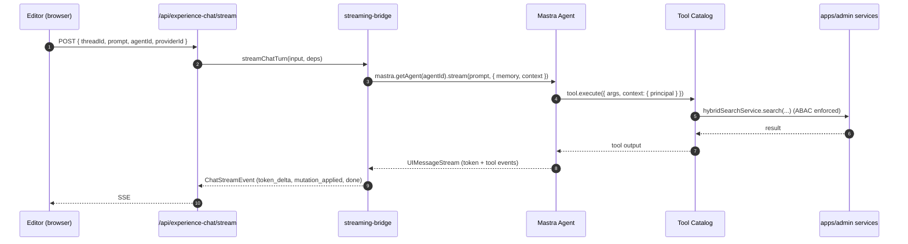

# Admin Experience-AI Chat — Big-Bang Mastra Replacement

## Summary

Rewrite the Experience-AI chat in `apps/admin` on top of Mastra. The current 4-channel custom service (`apps/admin/src/services/experience-ai/`) is replaced. Mastra owns model routing, memory, prompts, tools, and agent orchestration. All four agent shapes — tool-calling, multi-step planning, specialized-per-task, background/async — ship in the same merge per the origin doc's done definition. The Codex CLI and Claude Code CLI channels are dropped. Old chat history in `experienceChatThread` / `experienceChatMessage` is dropped (cold cutover; not preserved). The editor-side canvas / diff / mutation contract is preserved via a thin streaming-bridge adapter so no UI work is required.

---

## Problem Frame

The current chat service is intentionally narrow — it can't tool-call, plan-then-act, differ by task, or run outside the editor. The user has chosen a big-bang Mastra adoption (Approach A in the origin brainstorm) to gain all four shapes in one cut, accepting the trade-offs: long-lived branch, larger merge, loss of CLI subscription channels, loss of historical chat threads.

See origin: `docs/brainstorms/2026-05-13-admin-chat-mastra-replacement-requirements.md`.

---

## Requirements

- R1. Replace `apps/admin/src/services/experience-ai/` with a Mastra-powered chat service. _(origin G1)_
- R2. Ship a tool-calling agent that invokes `searchVideos`, `lookupBibleVerse`, and `fetchVideoImage` from inside a chat turn. _(origin G2a, S2)_
- R3. Ship a multi-step planning agent that runs plan → draft → critique → revise inside one turn with a hard step budget. _(origin G2b, S3)_
- R4. Ship three specialized agents — draft-experience, add-section, rewrite-copy — selectable via a composer agent-picker. _(origin G2c, S4)_
- R5. Ship one background agent (auto-enrich-blocks) triggered by an operator GraphQL mutation, writing back as a `ContentRevision` DRAFT. _(origin G2d, S5)_
- R6. Move all prompts out of TypeScript builders into Mastra-managed prompt definitions in `apps/admin/src/mastra/`. _(origin G3)_
- R7. Use Mastra-native memory storage. Drop `experienceChatThread` and `experienceChatMessage` tables. Old chat history is not preserved. _(origin G4, S8 — resolved as "cold cutover")_
- R8. Preserve the editor-side `ChatStreamEvent` → `canvasController.applyDiff` / `revertDiff` contract — no changes to `experience-editor.tsx`, `experience-editor-with-chat.tsx`, or `experience-chat-panel.tsx` beyond the agent-picker UI addition for R4. _(origin G5)_
- R9. Wrap the existing hybrid-search service and reference-data services as Mastra tools instead of duplicating retrieval logic. _(origin G6)_
- R10. Drop Codex CLI and Claude Code CLI channels; drop their env gates (`EXPERIENCE_AI_ALLOW_CODEX`, `EXPERIENCE_AI_ALLOW_CODEX_FALLBACK`, `EXPERIENCE_AI_ALLOW_CLAUDE_CODE`); drop adapter files. _(origin NG1, NG7)_
- R11. Surviving providers route through Mastra's AI SDK provider abstraction: OpenRouter and Ollama at merge, with OpenAI/Anthropic available via configuration. _(origin Provider Surface)_
- R12. Every agent-driven mutation flows through `canEditExperienceLocale` (and siblings) in the service layer; agent context carries the principal. ABAC is non-negotiable. _(origin C3)_
- R13. Agent-driven `ContentRevision` writes continue stamping `revisedByKind: "AI"`. _(origin C4)_
- R14. Multi-step and background agents have per-turn token / step / time budgets configured so a runaway loop can't bill unbounded API calls. _(origin C7)_
- R15. CI lint, typecheck, and `pnpm --filter @forge/admin test` pass on the new system, including agent unit tests, tool unit tests, and chat-stream integration tests. _(origin S6)_

---

## Scope Boundaries

- No changes to `apps/web`, `apps/mobile`, or any consumer of the admin GraphQL API outside the chat surface.
- No rewrite of the chat panel UI — agent-picker is the only additive UI change.
- No rewrite of the canvas / diff / applyDiff system.
- No rewrite of hybrid-search, scene-recommendations, or embedding pipelines — these are tool targets only.
- No custom Mastra AI SDK provider for Codex CLI or Claude Code CLI — dropped entirely.
- No preservation of old chat history. Threads on existing experiences become empty after cutover.
- No cron / event-driven background-agent triggers in this plan — manual mutation trigger only. Cron is follow-up work.
- No multi-tenant separation of Mastra memory beyond the existing ABAC posture.

### Deferred to Follow-Up Work

- **Cron / event-driven background-agent triggers** — separate PR after the manual-trigger background agent is proven.
- **Additional tool catalog entries beyond v1** (scene-recommendations tool, related-experience-lookup, embedding-query-by-locale) — follow-up PRs once the v1 catalog pattern is established.
- **Agent-picker auto-selection heuristics** (e.g., "empty canvas → draft-experience by default") — ship with manual selection only; auto-pick is a UX pass after editor feedback.
- **Mastra prompt evaluation / versioning workflows** (running prompts against fixtures, A/B testing prompts) — registry adoption only in this plan; eval tooling is its own track.
- **Cost dashboards and alerts** — internal logging and step caps land here; observability dashboards in `apps/roadmap` or operations are follow-up.

---

## Context & Research

### Relevant Code and Patterns

- `apps/admin/src/services/experience-ai/experience-ai-chat.service.ts` — the service being replaced; entrypoint `streamChatTurn` is the boundary contract to preserve at the route handler.
- `apps/admin/src/services/experience-ai/experience-ai-chat-provider.ts` — discriminated union being replaced by Mastra's model-routing layer.
- `apps/admin/src/services/experience-ai/experience-ai-chat-envelope.ts` + `experience-chat-diff.ts` — envelope schema and diff plumbing kept at the canvas boundary; internals re-source from Mastra output.
- `apps/admin/src/app/api/experience-chat/stream/route.ts` — SSE route handler; the streaming-bridge adapter sits behind this so the route's surface is unchanged.
- `apps/admin/src/app/dashboard/experiences/experience-editor/experience-chat-panel.tsx` — the canvas-side consumer of `ChatStreamEvent`. Lines ~320–350 show the `mutation_applied` → `canvasController.applyDiff` adapter that must stay intact.
- `apps/admin/src/workflows/sceneEmbeddingBackfill.ts` and `apps/admin/src/workflows/transcriptEmbeddingBackfill.ts` — established `useworkflow` + GraphQL trigger mutation pattern; the background agent follows this shape.
- `apps/admin/src/graphql/mutations/scene-embedding-trigger.ts` (and equivalents) — established trigger-mutation pattern for the auto-enrich GraphQL surface.
- `apps/admin/src/services/hybrid-search.service.ts` — wrapped by the `searchVideos` tool. Public method shape is already clean and ABAC-aware.
- `apps/admin/src/services/experience.service.ts` (`applyChatMutation` and `updateLocale`) — the ABAC-enforcing write seam; agent tools that write must route through here, not through Prisma directly.
- `apps/admin/src/auth/permissions.ts` — `canEditExperienceLocale` and sibling helpers; agents must invoke these.

### Institutional Learnings

- **Pothos parallel arg arrays vs input-object list** (`docs/solutions/graphql/pothos-parallel-arg-arrays-vs-input-list-20260506.md`): the new background-agent trigger mutation should default to `[InputType!]!` for any list args, not parallel arrays.
- **Outbound timeout MUST be shorter than caller budget** (`docs/solutions/best-practices/outbound-timeout-shorter-than-caller-budget-20260506.md`): any Mastra agent call wrapped by an HTTP route needs a hard timeout below the route's upstream ceiling. Apply via `AbortSignal.timeout()` or `Promise.race`.
- **Workflow dispatch test-mode divergence** (`docs/solutions/best-practices/workflow-dispatch-test-mode-divergence-20260421.md`): the background-agent's `start()` site needs a dispatch-level test.
- **Parallel-workflow error robustness** (`docs/solutions/best-practices/parallel-workflow-error-robustness-20260420.md`): background agents that iterate over targets use sequential `for…of` with per-target error isolation, not bare `Promise.all`.
- **Opt-in scaffolding env vars must be `.optional()`** (`docs/solutions/runtime-errors/required-env-var-without-default-broke-railway-deploy-20260511.md`): new Mastra env vars (per-channel model overrides, etc.) must be `.optional()` with runtime fallback so Railway doesn't break.
- **Mocked-vs-real testing discipline** (`docs/solutions/best-practices/mocked-shape-vs-real-contract-discipline-20260506.md`): tool unit tests with mocked services prove shape; the streaming-bridge integration test against a real Mastra agent proves contract.
- **CE Code Review Tier-2 mandatory before push** (`docs/solutions/workflow-issues/ce-code-review-tier-2-mandatory-before-push-20260511.md`): this plan crosses sensitive surfaces (auth/ABAC, public API mutation, dependency manifests). Tier-2 review is required before the cutover unit lands.

### External References

- Mastra Next.js getting-started guide: https://mastra.ai/guides/getting-started/next-js
- Mastra Agent + Tool definition: `@mastra/core/agent`, `@mastra/core/tools` (`createTool` with Zod schemas)
- Mastra Memory primitive: `@mastra/memory` + storage adapters (`@mastra/libsql`, `@mastra/pg`)
- Mastra Network routing for specialized agents: `agent.network(prompt)` with `agents: { ... }`
- Mastra AI SDK integration: `@mastra/ai-sdk` exports `handleChatStream`, `handleNetworkStream`, `toAISdkStream`
- Mastra-recommended Next.js route shape: `POST /api/chat/[agentId]` calling `handleChatStream({ mastra, agentId, params })`

---

## Key Technical Decisions

- **Mastra-native memory, cold cutover.** Drop `experienceChatThread` and `experienceChatMessage` Prisma tables. Use Mastra's Memory primitive with the storage adapter the fitness spike (U1) confirms as compatible with our Railway/Postgres infrastructure (likely `@mastra/pg` against admin's Postgres in a Mastra-owned schema; LibSQL only if the spike finds Postgres adapter blockers). Rationale: user explicitly chose "drop Prisma, use Mastra-native storage" over the keep-as-mirror options. Trade-off: editors lose past chat threads at cutover.
- **Streaming bridge, not panel rewrite.** Build a thin adapter that converts Mastra's AI SDK UI message stream into the existing `ChatStreamEvent` union (`token_delta` / `mutation_applied` / `mutation_proposal` / `done` / `error`). The chat panel and canvas controller see no change. Rationale: preserves origin G5 (NG3 — canvas/diff system untouched) without parallel UI work.
- **Tool catalog wraps services, not Prisma.** Each Mastra tool calls into the existing service-layer entrypoint (e.g., `hybridSearchService.search(...)`, not `prisma.video.findMany(...)`). The service layer enforces ABAC. The tool's `execute` runs with the request-bound `principal` passed through Mastra's runtime context.
- **Specialized agents via Mastra's `Agent.network()`.** The agent picker in the composer chooses a "specialization" — under the hood this is either (a) a routing agent with `agents: { draftExperience, addSection, rewriteCopy }` and `.network(prompt)`, or (b) direct invocation of the picked agent. Decided in U8 based on routing-overhead measurement in U1 spike. Default: direct invocation for simplicity unless network routing offers clear handoff value.
- **Multi-step planning as Mastra workflow, not as a single agent's prompt loop.** Multi-step is implemented as a `@mastra/core/workflows` workflow with explicit `plan → draft → critique → revise` steps, each step using the tool-calling agent under different system prompts. Hard step cap = 4 (the four named steps; no recursion). Rationale: explicit step boundaries make budgets enforceable and observable; opaque-prompt-loop alternatives can't be cap-checked.
- **Background agent via existing useworkflow + Mastra agent invocation.** New GraphQL trigger mutation enqueues a useworkflow job (same shape as `sceneEmbeddingBackfill`). Inside the workflow, instantiate the Mastra agent and call `.generate()` per target experience locale, sequentially with per-target error isolation. Output writes a `ContentRevision` DRAFT through `experience.service.ts`. Rationale: reuses the durable-job infrastructure admin already runs on Railway; no parallel infra introduced (origin C5, C6).
- **AI SDK providers only.** No custom adapter for subprocess-based CLI providers. `@ai-sdk/openai`, `@ai-sdk/anthropic`, `@ai-sdk/openrouter` (or OpenRouter via `@ai-sdk/openai-compatible`), `ollama-ai-provider`. Model selection in UI replaces the channel dropdown; agent selection is a separate orthogonal dropdown.
- **Single Next.js route, not per-agent routes.** Keep the existing `POST /api/experience-chat/stream` route as the boundary. Inside, the streaming bridge dispatches to the requested agent via `mastra.getAgent(agentId)`. Reason: preserves panel-side route URL and the existing SSE contract; avoids per-agent route proliferation. Mastra's recommended `/api/chat/[agentId]` shape is a deferred option if dynamic-route routing becomes simpler.
- **Per-agent budgets configured at agent definition.** Token cap, step cap (multi-step), time cap (background). Defaults baked into agent config files; env-overridable but not env-required. Caps applied via `AbortSignal.timeout()` for time and Mastra's built-in step ceiling for steps.

---

## Open Questions

### Resolved During Planning

- **Memory migration strategy.** Resolved: Option 2 — drop Prisma chat tables, use Mastra-native storage. Cold cutover; no history preservation.
- **CLI channels (Codex, Claude Code).** Resolved: dropped entirely. No custom provider wrap.
- **Done definition.** Resolved (in origin): all four agent shapes before merge.
- **Mutation contract.** Resolved: preserve `ChatStreamEvent` shape via streaming bridge adapter.

### Deferred to Implementation

- **Mastra storage adapter choice (Postgres vs LibSQL).** Resolved in U1 spike based on Railway compatibility and connection-pool behavior with admin's existing Prisma connection.
- **Exact tool input/output schemas.** Defined per-tool in U5 once the actual service-method signatures are pulled in; the plan names the tools and their service-layer wrappers, not Zod schemas.
- **Agent prompt content.** Carried over from the current `experience-ai-chat-prompts.ts` and `experience-ai-quality-draft*.ts` builders, restructured into Mastra prompt definitions in U4. Edits to prompt text happen during U4 and the agent units (U6–U9) as the agent's behavior is tuned. Not pre-specified in the plan.
- **Agent-picker UI exact shape** (chip vs dropdown, placement on composer). Decided in U8 implementation based on space and editor feedback.
- **Background-agent v1 use case scope** — origin suggests "auto-enrich blocks". U9 picks the minimum useful task: fill missing `imageUrl` and `videoId` references on a target experience locale's blocks. Other enrichment behaviors are follow-up.
- **Token / step / time budget numbers.** Names of caps in U11; concrete numbers set in U11 implementation based on observed call costs during U6–U9 development.
- **Streaming event types beyond the existing union.** If tool-call visibility requires a new `tool_call_started` / `tool_call_completed` event, define in U3. If it doesn't, the bridge collapses tool activity into `token_delta` text. Decided in U3.
- **Existing thread cleanup.** U10 includes a Prisma migration dropping the two tables. Whether to also delete `experienceChatMessage` rows pre-migration (vs DROP TABLE with no archive) is decided in U10 based on row counts.

---

## Output Structure

The new Mastra runtime lives under `apps/admin/src/mastra/`. Expected shape:

    apps/admin/src/mastra/
    ├── index.ts                          # Mastra instance singleton, exported for route handlers + workflows
    ├── memory.ts                         # Memory + storage configuration
    ├── providers.ts                      # AI SDK provider configuration (OpenRouter, Ollama, OpenAI, Anthropic)
    ├── agents/
    │   ├── draft-experience-agent.ts     # Specialized agent — full experience draft
    │   ├── add-section-agent.ts          # Specialized agent — single-section insert
    │   ├── rewrite-copy-agent.ts         # Specialized agent — text-only rewrites
    │   └── auto-enrich-agent.ts          # Background agent — auto-enrich blocks
    ├── tools/
    │   ├── search-videos.ts              # Wraps hybrid-search service
    │   ├── lookup-bible-verse.ts         # Wraps reference-data service
    │   └── fetch-video-image.ts          # Wraps video-image lookup
    ├── workflows/
    │   └── multi-step-draft-workflow.ts  # Plan → draft → critique → revise workflow
    ├── prompts/
    │   ├── draft-experience-prompt.ts    # System prompt + per-call templates (migrated from experience-ai-chat-prompts)
    │   ├── add-section-prompt.ts
    │   ├── rewrite-copy-prompt.ts
    │   └── auto-enrich-prompt.ts
    └── streaming-bridge.ts               # Mastra UIMessageStream → ChatStreamEvent adapter

This tree is a scope declaration. The implementer may adjust file names or sub-folder boundaries (e.g., colocating tool tests beside tools) if implementation reveals a better layout. Per-unit `**Files:**` sections are authoritative for what each unit creates.

---

## High-Level Technical Design

> _This illustrates the intended approach and is directional guidance for review, not implementation specification. The implementing agent should treat it as context, not code to reproduce._

### Request flow — chat turn



### Agent shape coverage

| Shape                   | Concrete primitive in this plan                                          | Unit    |
| ----------------------- | ------------------------------------------------------------------------ | ------- |
| G2a Tool-calling        | `Agent` with `tools: { ... }` and `searchVideos` etc.                    | U5 + U6 |
| G2b Multi-step planning | `@mastra/core/workflows` workflow with 4 named steps                     | U7      |
| G2c Specialized agents  | Multiple `Agent` instances + composer agent-picker UI                    | U8      |
| G2d Background / async  | `useworkflow` job triggers Mastra agent + writes `ContentRevision` DRAFT | U9      |

### Streaming bridge contract (preserved)

```
Mastra UIMessageStream ── adapter ──► ChatStreamEvent union
  text-delta            ──►  { type: "token_delta", text }
  tool-call             ──►  (optional) { type: "tool_call_started", name }
  tool-result           ──►  (optional) { type: "tool_call_completed", name }
  finish + structured envelope parse  ──►  { type: "mutation_applied", diff }
  error                 ──►  { type: "error", code, message }
  end                   ──►  { type: "done", messageId }
```

---

## Implementation Units

### U1. Mastra fitness spike (GO / NO-GO gate)

**Goal:** Verify origin assumptions D1–D4 against the real `apps/admin` codebase in a throwaway scratch directory before committing to the full rewrite. Produce a written GO/NO-GO recommendation.

**Requirements:** R1, R2, R6, R7, R11 (all gated on this spike's findings)

**Dependencies:** None

**Files:**

- Create: `apps/admin/src/mastra-spike/` (scratch — deleted at end of unit OR migrated into `apps/admin/src/mastra/` if applicable)
- Create: `docs/solutions/platform/admin-chat-mastra-fitness-spike-20260513.md` (spike result write-up)
- Modify: `apps/admin/package.json` (add `@mastra/core`, `@mastra/ai-sdk`, `@mastra/memory`, one storage adapter — likely `@mastra/pg`, AI SDK provider packages)

**Approach:**

- Install Mastra packages.
- Stand up one minimal agent in the scratch dir using OpenRouter and Ollama providers.
- Verify: agent can stream, agent can call one trivial tool, agent can persist a thread+message round-trip in the chosen memory storage, prompt registry loads a prompt from a file.
- Verify the streaming bridge concept works: capture one full UIMessageStream and confirm we can map each event type into a `ChatStreamEvent` shape.
- Probe ABAC: confirm Mastra's `RuntimeContext` (or equivalent) carries arbitrary objects per-call so we can thread a `principal` through to tools.
- Document findings in the solutions doc — explicit verdict on each of D1, D2, D3, D4. If any block, document the workaround or call NO-GO.

**Execution note:** Spike-style — exploratory. No tests required for the spike code itself; the deliverable is the GO/NO-GO write-up.

**Patterns to follow:**

- `docs/solutions/platform/admin-scene-embeddings-indexer-pattern.md` — example of a solutions doc that captures architectural verification findings.

**Test scenarios:**

- Test expectation: none — exploratory spike. Verification is the written findings doc.

**Verification:**

- `docs/solutions/platform/admin-chat-mastra-fitness-spike-20260513.md` exists with a clear verdict on each of origin D1, D2, D3, D4.
- The spike directory either contains a working minimal-agent demo OR documents the specific blocker preventing one.
- If verdict is NO-GO, this plan halts; if GO, U2 starts.

---

### U2. Mastra foundation — install, providers, native memory

**Goal:** Stand up the production `apps/admin/src/mastra/` runtime with model providers, memory, and the singleton `mastra` instance that the rest of the system imports. No agents yet — just the runtime.

**Requirements:** R1, R7, R11, R14 (R14 partially — provider-level budgets only)

**Dependencies:** U1 (GO verdict)

**Files:**

- Create: `apps/admin/src/mastra/index.ts`
- Create: `apps/admin/src/mastra/index.test.ts`
- Create: `apps/admin/src/mastra/memory.ts`
- Create: `apps/admin/src/mastra/memory.test.ts`
- Create: `apps/admin/src/mastra/providers.ts`
- Create: `apps/admin/src/mastra/providers.test.ts`
- Modify: `apps/admin/src/config/env.ts` (add Mastra-related env vars, all `.optional()` per institutional learning)

**Approach:**

- Configure the Mastra singleton with the storage adapter chosen in U1 (likely `@mastra/pg` against admin's Postgres, in a Mastra-owned schema or table prefix).
- Wire AI SDK providers: OpenRouter, Ollama (primary), OpenAI, Anthropic (optional via env). Per-channel model override env vars are `.optional()`.
- Bootstrap Memory primitive with reasonable defaults — thread-id keyed by `experienceLocaleId`, resource-id keyed by `principalId`.
- No agents exported yet — those land in U6–U9.

**Patterns to follow:**

- `apps/admin/src/db/client.ts` — singleton pattern for shared instances.
- `apps/admin/src/config/env.ts` — env validation with `.optional()` for non-required new vars.

**Test scenarios:**

- Happy path: the Mastra singleton loads without throwing when required env vars are set; `memory.ts` connects to storage and round-trips a thread+message.
- Edge case: when an optional model-override env var is unset, the provider uses its hardcoded default.
- Error path: when a required provider env var (e.g., `OPENROUTER_API_KEY`) is missing AND no fallback is configured, attempting to invoke that provider returns a typed error (`ProviderNotConfiguredError` or similar) rather than crashing the singleton's import.
- Integration: a no-op agent created against the singleton can call `.generate("hello")` and return a string, proving the runtime is wired end-to-end.

**Verification:**

- `pnpm --filter @forge/admin test apps/admin/src/mastra` passes.
- Importing `mastra` from `apps/admin/src/mastra` does not throw with default env.
- Mastra-managed tables exist in admin's Postgres after first run.

---

### U3. Streaming bridge — Mastra → ChatStreamEvent adapter

**Goal:** Build the adapter that converts Mastra's stream output into the existing `ChatStreamEvent` union, preserving the canvas-side contract. This is the most architecturally load-bearing unit in the plan.

**Requirements:** R8

**Dependencies:** U2

**Files:**

- Create: `apps/admin/src/mastra/streaming-bridge.ts`
- Create: `apps/admin/src/mastra/streaming-bridge.test.ts`
- Modify: `apps/admin/src/services/experience-ai/experience-ai-chat.service.ts` — first internal change. The exported `streamChatTurn` signature stays identical; its body delegates to `streamingBridge.run(...)`.

**Approach:**

- The bridge's input is a Mastra agent stream (or workflow stream); its output is an `AsyncIterable<ChatStreamEvent>` matching today's union.
- Map Mastra's `text-delta` events → `{ type: "token_delta", text }`.
- When Mastra's stream contains a structured-output completion that parses against `ChatMutationEnvelopeSchema`, emit `{ type: "mutation_applied", diff }`.
- Tool-call visibility: optional new event types `tool_call_started` and `tool_call_completed`. Decided in this unit: if the panel can display them usefully, add to the union; otherwise collapse into a `token_delta` text annotation like `"\n[searching videos...]\n"`.
- Errors: map Mastra's typed errors → `{ type: "error", code, message }` using the existing `ChatErrorCode` enum. Unrecognized errors get `code: "unknown"`.

**Execution note:** Build the bridge test-first. Start with a fixture of Mastra stream events (recorded from U1 spike or hand-crafted), assert against the expected `ChatStreamEvent` output.

**Technical design:** see "Streaming bridge contract (preserved)" in High-Level Technical Design. Directional only.

**Patterns to follow:**

- `apps/admin/src/services/experience-ai/experience-ai-chat.service.ts` — current `runChatTurnForProvider` shape and the `ChatStreamEvent` union definition.

**Test scenarios:**

- Happy path: a Mastra stream emitting 5 text deltas + 1 structured envelope → 5 `token_delta` events + 1 `mutation_applied` event + 1 `done` event in order.
- Edge case: empty Mastra stream → only `done` event.
- Edge case: Mastra stream that errors mid-flight → previously emitted `token_delta` events delivered, then `error` event, no `done`.
- Edge case: Mastra structured output that fails Zod parse against the envelope → `error` event with `code: "validation_failed"`, no `mutation_applied`.
- Integration: when wired into `streamChatTurn` against a real Mastra agent (from U2), the panel-side `mutation_applied` handler successfully applies the diff (no parallel UI test — assert against the diff payload shape).
- Tool-call: a stream containing tool-call events either (a) emits the new `tool_call_started` / `tool_call_completed` events (if the panel accepts them) or (b) emits a `token_delta` with a `"\n[<tool>...]\n"` annotation. Test whichever path is chosen.

**Verification:**

- The bridge's unit tests pass.
- Calling the existing `/api/experience-chat/stream` route with the bridge wired in produces a stream the panel renders without changes to `experience-chat-panel.tsx`.

---

### U4. Prompt registry migration

**Goal:** Move every prompt currently in TypeScript string builders into Mastra-managed prompt definitions under `apps/admin/src/mastra/prompts/`. Tests retarget to assert against the registry.

**Requirements:** R6

**Dependencies:** U2

**Files:**

- Create: `apps/admin/src/mastra/prompts/draft-experience-prompt.ts`
- Create: `apps/admin/src/mastra/prompts/add-section-prompt.ts`
- Create: `apps/admin/src/mastra/prompts/rewrite-copy-prompt.ts`
- Create: `apps/admin/src/mastra/prompts/auto-enrich-prompt.ts`
- Create: `apps/admin/src/mastra/prompts/prompts.test.ts`
- Modify: `apps/admin/src/services/experience-ai/experience-ai-chat-prompts.ts` — to be deleted in U10; preserved here as the _source_ during migration.
- Modify: `apps/admin/src/services/experience-ai/experience-ai-chat-prompts.test.ts` — updated assertions to read from the new registry.

**Approach:**

- One prompt module per specialized agent (and one shared "default chat" prompt if applicable).
- Each prompt module exports a Mastra-compatible prompt structure: a system prompt plus dynamic template fragments. Dynamic interpolation of canvas state, candidate videos, and editor prompt happens via Mastra's template mechanism (verify exact shape in U1 spike).
- Carry forward today's prompt content verbatim where it still applies (the "do NOT defer to a brief flow" instruction, the candidate-videoId hints, the strict block-schema rules).
- Tests assert against the registry's resolved prompt text for a given input, mirroring today's `buildChatPrompt`-shaped tests.

**Patterns to follow:**

- `apps/admin/src/services/experience-ai/experience-ai-chat-prompts.ts` and its test — the assertions to mirror.

**Test scenarios:**

- Happy path: rendering the draft-experience prompt for an empty canvas produces output containing the "complete blocks array" instruction and the candidate videoIds.
- Happy path: rendering the add-section prompt produces the "preserve every existing top-level block" instruction.
- Happy path: rendering the rewrite-copy prompt produces a copy-focused system prompt.
- Edge case: rendering with zero candidate videos still produces valid output (no empty-array crashes).
- Integration: the prompt registry can be loaded from the Mastra singleton (`mastra.getPrompt(...)` or equivalent — exact API confirmed in U1) and returns the expected strings.

**Verification:**

- The new prompts test suite passes.
- The old `experience-ai-chat-prompts.test.ts` still passes against its source until U10 deletes both files.

---

### U5. Tool catalog v1 — three tools wrapping existing services

**Goal:** Define `searchVideos`, `lookupBibleVerse`, and `fetchVideoImage` as Mastra tools. Each wraps an existing admin service with ABAC context propagation.

**Requirements:** R9, R12

**Dependencies:** U2

**Files:**

- Create: `apps/admin/src/mastra/tools/search-videos.ts`
- Create: `apps/admin/src/mastra/tools/search-videos.test.ts`
- Create: `apps/admin/src/mastra/tools/lookup-bible-verse.ts`
- Create: `apps/admin/src/mastra/tools/lookup-bible-verse.test.ts`
- Create: `apps/admin/src/mastra/tools/fetch-video-image.ts`
- Create: `apps/admin/src/mastra/tools/fetch-video-image.test.ts`

**Approach:**

- Each tool uses `createTool` from `@mastra/core/tools` with a Zod `inputSchema` and `outputSchema`.
- The `execute` function receives Mastra's `RuntimeContext` (confirmed in U1) which carries the request-bound `principal`. It calls into the existing service-layer entrypoint, passing the principal so the service's ABAC check runs.
- `searchVideos` wraps `hybridSearchService.search(...)` and returns the existing result shape, possibly trimmed to fields the agent actually consumes.
- `lookupBibleVerse` wraps reference-data lookup (verify exact service name in implementation — likely the existing reference-data fetcher used by the prompt builder's Bible context).
- `fetchVideoImage` wraps the video-image lookup used by the current candidate-preparation step.
- Tools never call Prisma directly. Tools never bypass ABAC.

**Patterns to follow:**

- `apps/admin/src/services/hybrid-search.service.ts` — service-layer entrypoint shape.
- `apps/admin/src/services/experience.service.ts::applyChatMutation` — ABAC-enforcing call pattern.

**Test scenarios:**

- Happy path: `searchVideos.execute({ q: "hope", locale: "en" }, ctx)` returns a result array matching `hybridSearchService.search`'s contract.
- Happy path: each tool's `inputSchema` Zod-parse accepts a valid input and rejects an invalid one (missing required field).
- Error path: calling a tool without a `principal` in context throws a typed `MissingPrincipalError`.
- Error path: when the underlying service returns a `ForbiddenError`, the tool propagates a typed error (not a swallowed empty result).
- Integration: a minimal Mastra agent with `tools: { searchVideos }` and instructions to find a video about a topic actually invokes the tool and produces a response referencing the tool's output. (Test with mocked service; integration depth gated by U1 findings.)

**Verification:**

- Tool unit tests pass.
- `mastra.getAgent(...)` configured with the v1 tools can list and invoke each.

---

### U6. Tool-calling agent — the editor-facing default

**Goal:** Ship a single Mastra `Agent` that uses the tool catalog and replaces the current chat's behavior on the surviving providers. This is the agent the chat panel hits when no specialization is picked.

**Requirements:** R2, R8 (preserves canvas contract via U3)

**Dependencies:** U3, U4, U5

**Files:**

- Create: `apps/admin/src/mastra/agents/default-chat-agent.ts`
- Create: `apps/admin/src/mastra/agents/default-chat-agent.test.ts`
- Modify: `apps/admin/src/services/experience-ai/experience-ai-chat.service.ts` — `streamChatTurn` dispatches to this agent when no `agentId` is specified or when the requested agent doesn't exist.

**Approach:**

- Agent definition: `instructions` pulled from the draft-experience prompt (or a new shared "default chat" prompt registered in U4), `tools: { searchVideos, lookupBibleVerse, fetchVideoImage }`, `memory: <U2 memory>`, `model` from the provider chosen by the editor.
- Structured-output target: the agent's final response is shaped to match `ChatMutationEnvelopeSchema` (Mastra supports structured output via Zod). The streaming-bridge parses and emits `mutation_applied`.
- The agent's instructions explicitly tell it to call tools instead of asking the editor for information when context is missing.

**Patterns to follow:**

- The current `runChatTurnForProvider` logic — for what the agent should _do_ in each turn, even though the framework changes.

**Test scenarios:**

- Happy path: editor prompt "draft an experience about forgiveness" → agent calls `searchVideos`, calls `lookupBibleVerse`, produces a structured envelope with `blocks` array, streaming bridge emits `mutation_applied`.
- Happy path: editor prompt "add a reflection section" with an existing canvas → agent produces a `mutation_applied` with the existing blocks plus exactly one new block.
- Edge case: editor sends an empty prompt → agent emits a tokenized clarification or a typed error (test whichever the design picks).
- Error path: when the agent's structured output fails the envelope schema, the streaming bridge emits an `error` event (covered by U3 test, but assert end-to-end here).
- Error path: when a tool fails (mocked rejection), the agent reports the failure in its assistant message rather than crashing the turn.
- Integration: end-to-end against a mocked OpenRouter provider, the full chat turn produces the expected stream of events the panel can consume without changes.

**Verification:**

- Agent unit tests pass.
- The existing chat panel, pointed at the new system via `streamChatTurn`, behaves equivalently to the old service for at least one happy-path scenario on OpenRouter or Ollama.

---

### U7. Multi-step planning agent — plan → draft → critique → revise workflow

**Goal:** Ship a Mastra workflow that runs four named steps inside one editor turn and returns a final result. Step count is fixed; runaway loops are impossible.

**Requirements:** R3, R14

**Dependencies:** U6

**Files:**

- Create: `apps/admin/src/mastra/workflows/multi-step-draft-workflow.ts`
- Create: `apps/admin/src/mastra/workflows/multi-step-draft-workflow.test.ts`
- Modify: `apps/admin/src/mastra/agents/default-chat-agent.ts` — gain an opt-in mode that routes through this workflow.

**Approach:**

- A `@mastra/core/workflows` workflow with four sequential steps:
  1. **plan** — the agent outlines the structure of the experience without writing blocks.
  2. **draft** — the agent produces a full envelope based on the plan.
  3. **critique** — the agent reviews its own draft against quality criteria (carried over from the existing `experience-ai-quality-draft*` review logic).
  4. **revise** — the agent applies the critique to produce a final envelope.
- The workflow streams its step events through the bridge as `token_delta` updates (e.g., `"\n[planning...]\n"`, `"\n[drafting...]\n"`) so the editor sees progress.
- Time budget: `AbortSignal.timeout(60_000)` wrapping the workflow run. Step budget: fixed at 4 (no recursion). Token budget: per-call on each step's model invocation.

**Execution note:** Implement test-first for the workflow happy path — the workflow's step sequencing is the load-bearing invariant.

**Patterns to follow:**

- `apps/admin/src/workflows/sceneEmbeddingBackfill.ts` — for shape of a workflow definition (not the embedding pipeline logic).
- `apps/admin/src/services/experience-ai/experience-ai-quality-draft*.ts` — for the critique criteria to port forward.

**Test scenarios:**

- Happy path: the workflow runs all four steps and produces a final structured envelope different from the post-draft envelope (proves critique+revise actually had effect — at minimum it changed something).
- Happy path: the workflow streams progress markers through the bridge.
- Edge case: when the plan step produces an empty plan, the workflow short-circuits with a typed error rather than running with no instructions.
- Error path: when any step throws or times out, the workflow surfaces a typed error through the bridge; partial state is not applied to the canvas.
- Integration: the workflow can be invoked from the chat service with a `mode: "thoughtful"` flag (or whatever flag the agent picker uses) and the panel sees the same `mutation_applied` event shape at the end.

**Verification:**

- Workflow unit tests pass.
- An end-to-end editor turn in "thoughtful mode" produces a final mutation with observable improvements over single-step (subjective check during testing).

---

### U8. Specialized agents — draft / add-section / rewrite-copy + agent picker

**Goal:** Ship three specialized agents addressable from the composer agent-picker. Editors select which agent runs at send-time.

**Requirements:** R4, R8 (UI addition kept additive)

**Dependencies:** U6, U7

**Files:**

- Create: `apps/admin/src/mastra/agents/draft-experience-agent.ts`
- Create: `apps/admin/src/mastra/agents/add-section-agent.ts`
- Create: `apps/admin/src/mastra/agents/rewrite-copy-agent.ts`
- Create: `apps/admin/src/mastra/agents/specialized-agents.test.ts`
- Modify: `apps/admin/src/services/experience-ai/experience-ai-chat.service.ts` — `streamChatTurn` accepts `agentId` and dispatches.
- Modify: `apps/admin/src/app/dashboard/experiences/experience-editor/experience-chat-panel.tsx` — add agent-picker UI element to the composer.
- Modify: `apps/admin/src/app/api/experience-chat/stream/route.ts` — parse and forward `agentId` from the request body.

**Approach:**

- Each specialized agent is a distinct `Agent` instance with its own prompt (from U4) and its own tool subset.
  - **Draft-experience** — full tool catalog. Multi-step workflow available.
  - **Add-section** — only `searchVideos`; instructions emphasize "preserve every existing top-level block".
  - **Rewrite-copy** — no tools; instructions emphasize "only edit the specified block's text fields".
- Agent picker UI: a small dropdown or chip group next to the composer. Default selection: persist last choice per session.
- No auto-pick heuristics in v1 — editor explicitly selects. (Auto-pick is in Deferred to Follow-Up Work.)

**Patterns to follow:**

- The existing provider dropdown in `experience-chat-panel.tsx` — for UI shape of the new agent picker.

**Test scenarios:**

- Happy path (draft-experience): full draft request → envelope with multiple blocks → `mutation_applied`.
- Happy path (add-section): existing canvas + "add a reflection section" prompt → envelope with the existing blocks plus exactly one new top-level block. Verify by length and identity of preserved blocks.
- Happy path (rewrite-copy): selected block's text changes, all other blocks identical.
- Edge case (add-section): empty canvas + add-section request → agent either falls back to draft-experience behavior OR returns a typed error asking the editor to switch agents (test whichever is designed).
- Error path: when the panel sends an unknown `agentId`, the route handler returns a typed validation error before invoking Mastra.
- Integration: the panel's agent picker correctly forwards `agentId` and the resulting stream's `mutation_applied` payload reflects the chosen agent's behavior.

**Verification:**

- All three specialized agents have passing unit tests.
- The composer agent picker is visible, functional, and persists selection per session.
- An editor can complete a full draft → add section → rewrite copy sequence on a single experience locale, each step on the correct specialized agent.

---

### U9. Background agent — auto-enrich-blocks via useworkflow + GraphQL trigger

**Goal:** Ship a background agent that runs outside an editor session, triggered by a GraphQL mutation, that auto-enriches a target experience locale's blocks (fills missing `imageUrl` and `videoId` references) and writes the result as a `ContentRevision` DRAFT.

**Requirements:** R5, R12, R13, R14

**Dependencies:** U2, U5

**Files:**

- Create: `apps/admin/src/mastra/agents/auto-enrich-agent.ts`
- Create: `apps/admin/src/mastra/agents/auto-enrich-agent.test.ts`
- Create: `apps/admin/src/workflows/autoEnrichExperience.ts`
- Create: `apps/admin/src/workflows/autoEnrichExperience.test.ts`
- Create: `apps/admin/src/graphql/mutations/auto-enrich-experience.ts`
- Create: `apps/admin/src/graphql/mutations/auto-enrich-experience.test.ts`
- Modify: `apps/admin/src/auth/permissions.ts` — add new permission key (e.g., `write:auto-enrich-experience`).

**Approach:**

- GraphQL mutation `triggerAutoEnrichExperience(experienceLocaleId: ID!): JSON!` enqueues a useworkflow job. Permission-gated to ADMIN.
- The useworkflow job loads the target experience locale, instantiates the Mastra `auto-enrich-agent`, and calls `agent.generate(...)` with the blocks as context. The agent uses `searchVideos` and `fetchVideoImage` tools to resolve missing references.
- The agent's structured output is the enriched blocks array. The workflow writes a `ContentRevision` DRAFT (NOT canonical) via `experience.service.ts::createOrUpdateDraftRevision` with `revisedByKind: "AI"`.
- Sequential per-block enrichment with per-block error isolation; a failure on one block doesn't abort the run.
- Hard time budget: `AbortSignal.timeout(120_000)`. Token budget: per-block model-call cap.

**Execution note:** Workflow dispatch test required (per institutional learning on `workflow-dispatch-test-mode-divergence`). The mutation→workflow dispatch lives in `auto-enrich-experience.test.ts`.

**Patterns to follow:**

- `apps/admin/src/workflows/sceneEmbeddingBackfill.ts` — durable workflow shape, error isolation, structured logging.
- `apps/admin/src/graphql/mutations/scene-embedding-trigger.ts` (or equivalent) — trigger mutation shape, permission gate.
- `apps/admin/src/services/experience.service.ts::createOrUpdateDraftRevision` (verify exact method name in implementation) — draft revision write seam.

**Test scenarios:**

- Happy path: mutation dispatch → workflow runs → blocks with missing `imageUrl` get filled → `ContentRevision` DRAFT created with `revisedByKind: "AI"`.
- Happy path: blocks that already have `imageUrl` are left untouched.
- Edge case: experience locale with empty blocks → workflow completes with no writes; mutation returns a "nothing to enrich" outcome.
- Edge case: an agent call fails for one block but succeeds for others → DRAFT contains the successful enrichments; failed blocks logged but not written.
- Error path: missing `principal` or insufficient permission → mutation returns a typed forbidden error before dispatching the workflow.
- Error path: workflow run exceeds time budget → returns a typed timeout outcome; partial DRAFT not committed unless cleanly partial.
- Integration: dispatch-level test asserts the mutation's `start()` call against useworkflow is invoked with the correct arguments (this is the load-bearing invariant for the trigger pattern).

**Verification:**

- All four test files pass.
- Manually invoking the mutation against a real experience locale produces a DRAFT revision visible in the editor on next page load.

---

### U10. Cutover & cleanup — delete old service, drop tables, update docs

**Goal:** Delete the old chat service, all 4 channel adapters, the CLI provider files, the env gates, and the Prisma chat tables. Update documentation. Confirm the new system handles all editor flows end-to-end.

**Requirements:** R1, R7, R10

**Dependencies:** U6, U7, U8, U9 (all four agent shapes must be working before this lands)

**Files:**

- Delete: `apps/admin/src/services/experience-ai/experience-ai-chat.service.ts`
- Delete: `apps/admin/src/services/experience-ai/experience-ai-chat.service.test.ts`
- Delete: `apps/admin/src/services/experience-ai/experience-ai-chat-provider.ts`
- Delete: `apps/admin/src/services/experience-ai/experience-ai-chat-prompts.ts`
- Delete: `apps/admin/src/services/experience-ai/experience-ai-chat-prompts.test.ts`
- Delete: `apps/admin/src/services/experience-ai/experience-ai-openrouter-free.ts`
- Delete: `apps/admin/src/services/experience-ai/experience-ai-ollama.ts`
- Delete: `apps/admin/src/services/experience-ai/experience-ai-codex.ts`
- Delete: `apps/admin/src/services/experience-ai/experience-ai-claude-code.ts`
- Delete: `apps/admin/src/services/experience-ai/experience-ai-chat-brief.ts`
- Delete: `apps/admin/src/services/experience-ai/experience-ai-chat-envelope.ts` (if no longer imported — the schema may move into `apps/admin/src/mastra/streaming-bridge.ts` or a sibling)
- Delete: `apps/admin/src/services/experience-ai/experience-ai-quality-draft*.ts` (review)
- Modify: `apps/admin/src/config/env.ts` — remove `EXPERIENCE_AI_ALLOW_CODEX`, `EXPERIENCE_AI_ALLOW_CODEX_FALLBACK`, `EXPERIENCE_AI_ALLOW_CLAUDE_CODE`, `EXPERIENCE_AI_CODEX_MODEL`, `EXPERIENCE_AI_CLAUDE_CODE_MODEL`.
- Modify: `apps/admin/src/app/api/experience-chat/stream/route.ts` — finalize to import directly from `apps/admin/src/mastra/` instead of the old service path. The handler's surface URL and method stay the same.
- Modify: `apps/admin/src/app/dashboard/experiences/experience-editor/experience-chat-panel.tsx` — finalize the agent picker, remove any old provider-dropdown affordances that no longer apply.
- Create: `apps/admin/prisma/migrations/NNNN_drop_experience_chat_tables/migration.sql` — `DROP TABLE experience_chat_message; DROP TABLE experience_chat_thread;`
- Modify: `apps/admin/prisma/schema.prisma` — remove the two models.
- Modify: `apps/admin/CLAUDE.md` — rewrite the "Experience AI Chat providers" section to describe the new Mastra architecture. Replace the channel table with an agent table.

**Approach:**

- Sequence: delete + replace imports → run typecheck → run tests → write migration → apply migration locally → re-test → land migration.
- Migration is `DROP TABLE` (not soft-delete). Data is not preserved. This is the irreversible cutover.
- Update `apps/admin/CLAUDE.md` to be the authoritative description of the new system. Future-Claude relies on this.
- The current `feat/admin-chat-multi-channel-providers` branch (with the canvas-hydration and image-URL fixes) must already be merged to main OR explicitly rebased on top of this branch before this unit lands — otherwise that branch's references to the old service path become stale.

**Execution note:** This unit is the single largest blast-radius change in the plan. Run Tier-2 `/ce-code-review` before push, per institutional learning.

**Patterns to follow:**

- `apps/admin/prisma/migrations/` — additive-only migration convention. This one's an exception (drop). Document the exception in the migration comment.

**Test scenarios:**

- Happy path: after deletion, `pnpm --filter @forge/admin lint && pnpm --filter @forge/admin typecheck && pnpm --filter @forge/admin test` all pass.
- Edge case: a stale import of the old service path in any file fails typecheck — every such import must be updated as part of this unit.
- Integration: an editor opens a chat thread on an experience locale post-cutover. The thread has no past messages (expected — tables dropped). A new chat turn proceeds normally on the new system.

**Verification:**

- Old service files no longer exist in the tree.
- The two old Prisma tables no longer exist in the database (verify via `\dt` against local DB after applying the migration).
- `apps/admin/CLAUDE.md` accurately describes the new architecture.
- CI lint, typecheck, and test pass.

---

### U11. Cost budgets & observability

**Goal:** Wire per-shape token / step / time caps into every agent and workflow. Add structured logging for tool calls, agent runs, multi-step workflow steps, and background-agent dispatches. Add cost-guardrail tests.

**Requirements:** R14, R15

**Dependencies:** U6, U7, U8, U9

**Files:**

- Modify: `apps/admin/src/mastra/agents/default-chat-agent.ts`
- Modify: `apps/admin/src/mastra/agents/draft-experience-agent.ts`
- Modify: `apps/admin/src/mastra/agents/add-section-agent.ts`
- Modify: `apps/admin/src/mastra/agents/rewrite-copy-agent.ts`
- Modify: `apps/admin/src/mastra/agents/auto-enrich-agent.ts`
- Modify: `apps/admin/src/mastra/workflows/multi-step-draft-workflow.ts`
- Modify: `apps/admin/src/workflows/autoEnrichExperience.ts`
- Create: `apps/admin/src/mastra/budgets.ts` — central budget defaults; env-overridable but `.optional()`.
- Create: `apps/admin/src/mastra/budgets.test.ts`

**Approach:**

- Token caps: per-call max-output-tokens passed to each agent's model config. Defaults reasonable for chat-turn (e.g., 4k for draft, 1k for rewrite-copy); env-overridable.
- Step caps: the multi-step workflow is already fixed-step (4). The tool-calling agent gets a `maxSteps` ceiling so it can't recurse infinitely on tool calls (e.g., 8).
- Time caps: `AbortSignal.timeout` wrappers. 30s default for chat-turn, 60s for multi-step, 120s for background.
- Structured logs: `[mastra-chat] event=agent_run agent=<id> duration_ms=<n> tokens=<n>`, `[mastra-chat] event=tool_call tool=<id> duration_ms=<n>`, `[mastra-chat] event=workflow_step step=<n>`, `[mastra-chat] event=background_run experience_locale_id=<id> outcome=<...>`.

**Patterns to follow:**

- Existing structured-log shape in `apps/admin/src/services/core-sync/phases/` — `event=…` keyword-and-value style.

**Test scenarios:**

- Happy path: an agent run logs `event=agent_run` with the expected fields.
- Happy path: a tool call inside an agent run logs `event=tool_call` with the tool name and a non-negative duration.
- Edge case: a multi-step workflow logs four `workflow_step` events in order.
- Error path: when an agent run exceeds its time cap, the `AbortError` is logged and surfaces to the caller as a typed timeout error.
- Error path: when `maxSteps` is exceeded, the agent returns a partial result with a typed `maxStepsReached` flag logged for review.
- Edge case: unset budget env vars use the hardcoded defaults; the agent run completes successfully.

**Verification:**

- Cost-guardrail unit tests pass.
- Locally running the chat with each agent emits the expected log events.
- Long-running tasks (multi-step, background) demonstrably terminate at their time caps in a test.

---

## System-Wide Impact

- **Interaction graph:** the new chat service touches the existing route handler at `apps/admin/src/app/api/experience-chat/stream/route.ts` (preserved surface, internal swap), the chat panel (additive agent-picker only), and the canvas controller (no changes — guaranteed by U3). Tool calls reach into `hybridSearchService`, the reference-data services, and `experience.service.ts`. The background agent dispatches `useworkflow` jobs and writes `ContentRevision` rows.
- **Error propagation:** Mastra typed errors → streaming bridge typed `ChatErrorCode` → SSE event → panel renders. Background agent failures log structured events and propagate as per-target outcomes in the workflow result.
- **State lifecycle risks:** the `DROP TABLE` migration in U10 is irreversible. A rollback of the deploy that lands U10 leaves a schema gap (the rollback target expects the dropped tables). Mitigation: do not roll back across this migration boundary. If a rollback is required, accept a forward-fix instead.
- **API surface parity:** the route URL and request/response surface stay intact. The new `agentId` request body field is optional with a default — old clients (if any) keep working. The new `triggerAutoEnrichExperience` GraphQL mutation is additive.
- **Integration coverage:** the streaming bridge (U3) is the single load-bearing integration seam between Mastra and the panel. Its tests must cover every event type the panel renders.
- **Unchanged invariants:** the canvas controller's `applyDiff` / `revertDiff` signatures and the panel's `ChatStreamEvent` rendering paths are not modified by this plan. `experience-editor-with-chat.tsx` (the `videoLibrary` hydration shipped on the parallel branch) is independently preserved. ABAC and `ContentRevision` posture in `experience.service.ts` are unchanged — agents go through the same write seams.

---

## Risk Analysis & Mitigation

| Risk                                                                                            | Likelihood | Impact   | Mitigation                                                                                                                                                                                                                                             |
| ----------------------------------------------------------------------------------------------- | ---------- | -------- | ------------------------------------------------------------------------------------------------------------------------------------------------------------------------------------------------------------------------------------------------------ |
| Mastra fitness fails on D1–D4 in the spike                                                      | Med        | High     | U1 is a GO/NO-GO gate. NO-GO halts the plan and triggers a back-to-brainstorm pivot (Approach C or D from origin). Cost so far: one spike, no production damage.                                                                                       |
| Long-lived branch accumulates merge conflicts against `main`                                    | High       | Med      | Rebase weekly. The parallel `feat/admin-chat-multi-channel-providers` branch ships independently to keep the editor area unblocked.                                                                                                                    |
| Streaming bridge doesn't cover all `ChatStreamEvent` shapes correctly → panel renders broken UI | Med        | High     | U3 test scenarios enumerate every event type. Bridge built test-first. Integration test against a real Mastra agent before any agent-shape unit ships.                                                                                                 |
| ABAC bypass via a tool that calls Prisma directly                                               | Low        | Critical | Tools are reviewed for "must call service, not Prisma" in U5. Tier-2 `ce-code-review` covers the cutover (U10). `apps/admin/CLAUDE.md` rule already documented.                                                                                        |
| Background agent triggers a runaway loop and bills unbounded API calls                          | Low        | High     | U11 hard time + step + token caps. `AbortSignal.timeout(120_000)`. Per-block error isolation in the workflow.                                                                                                                                          |
| Cold cutover drops chat history editors actually wanted                                         | Med        | Med      | User-confirmed decision. Brief release-note communication at cutover. If demand resurfaces, archive table is a follow-up.                                                                                                                              |
| Drop migration in U10 breaks a downstream consumer or CI                                        | Low        | High     | Verify no production consumer reads `experience_chat_thread` / `experience_chat_message` outside the admin app (grep across repo; check apps/web, apps/mobile, packages/graphql). Run the migration locally and re-run full test suite before staging. |
| New Mastra env vars brick Railway deploy                                                        | Med        | High     | All new env vars `.optional()` with runtime fallback (institutional learning). Asserted in `apps/admin/src/config/env.test.ts`.                                                                                                                        |
| Specialized agent picker confuses editors                                                       | Med        | Low      | Default selection persists per session. Each agent has a clear label and short description. UI iteration is cheap follow-up.                                                                                                                           |
| Multi-step workflow latency makes the editor wait too long                                      | Med        | Med      | "Thoughtful mode" is opt-in. Step events stream as `token_delta` so the editor sees progress. 60s cap is the worst case.                                                                                                                               |
| Tier-2 `ce-code-review` surfaces a P2+ finding late in U10                                      | Low        | Med      | Run Tier-2 review on U10 _before_ push, not after (per institutional learning). Budget half a day for review fixes.                                                                                                                                    |

---

## Phased Delivery

This plan can be reviewed as three phases. The merge is still big-bang per the origin's done definition — but the phases give natural review checkpoints during development.

### Phase 1 — Foundation (U1–U4)

The Mastra runtime is installed, memory works, the streaming bridge converts events losslessly, and prompts live in the registry. No editor-visible behavior change yet — the old service still serves chat turns. U1 is the GO/NO-GO gate; everything else in the plan depends on it.

### Phase 2 — Agent shapes (U5–U9)

All four agent shapes ship. The editor's chat panel gains an agent picker. The old chat service still exists in parallel during this phase, served from the new system only when explicitly routed (e.g., via a feature flag or `agentId` parameter). The background agent's GraphQL trigger is callable but optional.

### Phase 3 — Cutover (U10–U11)

The old service is deleted, the Prisma tables are dropped, the env gates are removed, the documentation is updated, the budgets and observability are wired in. After this phase, only the new system serves chat. This is the irreversible boundary.

---

## Documentation Plan

- **`apps/admin/CLAUDE.md`** — rewrite the "Experience AI Chat providers" section in U10. The new section names the agent shapes, the agent picker, the tool catalog, the streaming bridge, and the background-agent trigger mutation. Replace the channel table with an agent table.
- **`docs/solutions/platform/admin-chat-mastra-fitness-spike-20260513.md`** — created in U1 as the spike write-up; lives on as the origin-of-decisions doc for the Mastra adoption.
- **`docs/solutions/platform/admin-chat-mastra-foundation-pattern-<date>.md`** — created at the end of Phase 1 if there are durable architectural patterns worth recording (streaming-bridge contract, tool ABAC pattern, prompt-registry layout).
- **No editor-facing user docs** — the panel UI is near-identical and editors learn the agent picker by using it. A short internal release note at cutover communicates the loss of past chat history.

---

## Operational / Rollout Notes

- **Branch:** `feat/admin-chat-mastra-replacement` on worktree `.worktrees/admin-chat-mastra/`.
- **Parallel branch independence:** `feat/admin-chat-multi-channel-providers` (canvas-hydration + image-URL fixes) ships to production independently. This rewrite does not block its merge.
- **Migration timing:** the `DROP TABLE` migration in U10 lands with the cutover deploy. No staging pre-drop — the migration is part of the same deploy that swaps in the new code. If staging environment exists, run the full Phase 3 sequence there first.
- **Env vars to add on Railway `forge-admin` Doppler (all `.optional()`):**
  - `MASTRA_STORAGE_URL` (Postgres connection string or LibSQL URL, depending on U1's choice)
  - `MASTRA_DEFAULT_PROVIDER` (`openrouter` or `ollama`)
  - Per-agent budget overrides (`MASTRA_DRAFT_AGENT_MAX_TOKENS`, etc.) — all optional with hardcoded defaults.
- **Env vars to remove at U10:**
  - `EXPERIENCE_AI_ALLOW_CODEX`
  - `EXPERIENCE_AI_ALLOW_CODEX_FALLBACK`
  - `EXPERIENCE_AI_ALLOW_CLAUDE_CODE`
  - `EXPERIENCE_AI_CODEX_MODEL`
  - `EXPERIENCE_AI_CLAUDE_CODE_MODEL`
- **Monitoring:** the structured log events from U11 should be added to whatever log dashboard admin observability runs against (if any). Initial cost watch: tail logs for `event=agent_run` and aggregate `tokens=` for first week post-cutover.
- **Rollback posture:** Phases 1–2 are rollback-safe (additive). Phase 3 is irreversible across the migration boundary. If a rollback is required after Phase 3 deploys, forward-fix rather than revert.

---

## Sources & References

- **Origin document:** [docs/brainstorms/2026-05-13-admin-chat-mastra-replacement-requirements.md](../brainstorms/2026-05-13-admin-chat-mastra-replacement-requirements.md)
- Related code anchors: `apps/admin/src/services/experience-ai/`, `apps/admin/src/app/dashboard/experiences/experience-editor/experience-chat-panel.tsx`, `apps/admin/src/services/hybrid-search.service.ts`, `apps/admin/src/workflows/sceneEmbeddingBackfill.ts`
- Parallel branch: `feat/admin-chat-multi-channel-providers` (current working branch on `/workspace`)
- External: Mastra documentation https://mastra.ai, Mastra Next.js guide https://mastra.ai/guides/getting-started/next-js
- Institutional patterns: see Context & Research → Institutional Learnings above.
