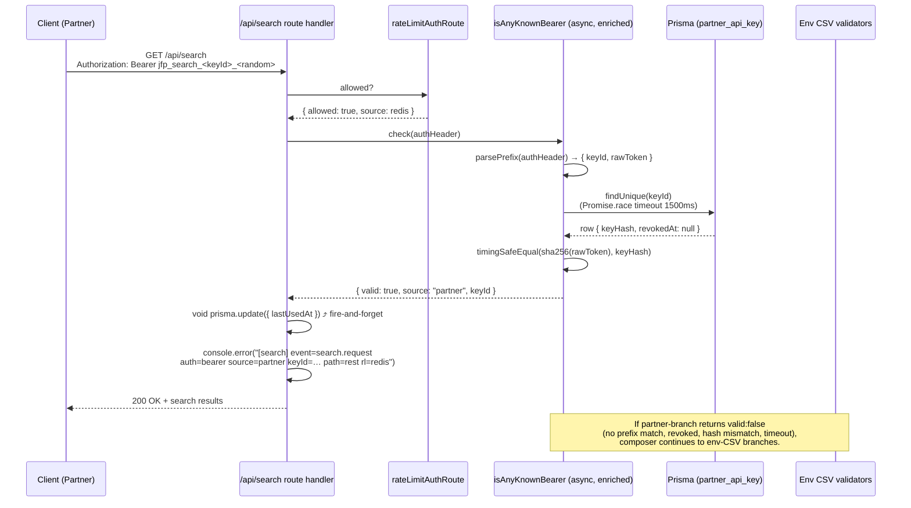

# Partner API Key Store (DB-backed) for `/api/search`

## Overview

Plan 002 shipped earlier today (PRs #966–#974) moved admin's
`/api/search` + `Query.search` from public-anyone to bearer-gated,
using the `SEARCH_API_KEYS` env-var CSV. That pattern is right for
internal M2M callers and wrong for external partners: no per-key
audit, plaintext-in-Doppler, redeploy-latency revocation, no
metadata, no scaling room.

This plan introduces a DB-backed `PartnerApiKey` table in admin's
Postgres, a fourth branch on the existing `isAnyKnownBearer`
composer that validates against it, a CLI for issue / list /
revoke / rotate, a read-only admin-dashboard view, and a
cutover that retires `SEARCH_API_KEYS` once today's single key is
migrated. Internal bearer CSVs (`WORKFLOW_API_KEYS`,
`WEB_ADMIN_API_KEYS`, `BACKUP_DOWNLOAD_API_KEYS`) stay on env-var
CSV — different threat model, different operator pattern.

## Problem Frame

External partners need credentials that internal services don't:

- **Per-key audit** in logs so partners are distinguishable and a
  single partner's traffic is gripable / triagable.
- **No plaintext credentials in Doppler.** Operator Doppler access
  must not equal "can read every partner's bearer."
- **Sub-second revocation** when a key leaks (today: ~3 min
  redeploy after editing Doppler CSV).
- **Per-key metadata** — owner, contact, created/last-used
  timestamps — so offboarding doesn't depend on operator memory.
- **Scaling headroom** beyond the ~10–20 keys where Doppler CSV
  editing degrades.

Internal M2M bearers don't share these constraints (Doppler-access
≈ impersonation-ability anyway), so they stay on CSV.

See origin: `docs/brainstorms/2026-05-18-002-partner-api-key-store-requirements.md`.

## Requirements Trace

- **R1.** `PartnerApiKey` table in admin's Prisma — identity (`keyId`),
  hashed secret, metadata (display name, owner email, note),
  lifecycle timestamps, creator/revoker FKs to `User`.
- **R2.** Token format `jfp_search_<keyId>_<random>`; `keyId` ≥8 chars
  URL-safe; `random` ≥32 bytes entropy; stored hash is
  `sha256(<fullToken>)`.
- **R3.** `isAnyKnownBearer` gains a DB-backed branch parsing the
  prefix, looking up `keyId`, and comparing hashes in constant time.
- **R4.** Per-request structured log emits `keyId=<keyId>` when a
  partner key matches (`auth=bearer source=partner keyId=…`);
  omitted for internal-bearer / invalid / anonymous traffic.
- **R5.** CLI: `partner-keys create|list|revoke|rotate` + an internal
  `import-from-env` for the one-time CSV → DB migration of today's
  key.
- **R6.** Read-only dashboard at `/dashboard/partner-keys`, ADMIN-gated
  via the existing layout + `requireAdminSession`.
- **R7.** `SEARCH_API_KEYS` removed at v1 ship; partner experiences
  zero downtime because the existing token is preserved as a hashed
  row.
- **R8.** `last_used_at` updated fire-and-forget on every successful
  partner-bearer auth.
- **R9.** Soft revocation only (`revoked_at` set, row preserved).
- **SC1.** Onboard in <5 operator minutes via `create` → Slack share
  → first request lands as `keyId=…` in logs.
- **SC2.** Revoke in <30s — `revoke` updates DB, next request 401s,
  no redeploy.
- **SC3.** "Which partners called this week?" answerable from
  Railway logs alone.
- **SC4.** "Which partners are idle?" answerable from the dashboard
  (sort by `last_used_at`).
- **SC5.** Today's `xoSP…` key migrates to a row before CSV is
  dropped; partner has zero downtime.

## Scope Boundaries

- **Only `/api/search` + `Query.search`.** No widening to other
  partner-facing surfaces (recommendations, experience reads).
- **Internal bearers stay on env-CSV.** `WORKFLOW_API_KEYS`,
  `WEB_ADMIN_API_KEYS`, `BACKUP_DOWNLOAD_API_KEYS` unchanged.
- **No per-key rate limits** beyond the existing per-IP 30/min Redis
  bucket. Bearer is identity, not budget.
- **No `expires_at`** in v1.
- **No partner self-serve portal.** Operator-mediated via Slack DM.
- **No admin-UI mutations** — CLI for create/revoke/rotate; UI is
  read-only.
- **No scopes column** — every row implicitly grants "use search."
  `jfp_search_*` namespace leaves room for `jfp_<surface>_*` later.
- **No webhooks / partner notifications** on revoke or rotate.

## Context & Research

### Relevant Code and Patterns

**Auth seam (extended here):**

- `apps/admin/src/auth/search-bearer.ts` — `isAnyKnownBearer` at
  lines 132–138 OR-composes three sync validators wrapped in
  `safeCheck`. Today returns `boolean`. The DB-backed branch is
  async, which forces a shape change on the composer AND the
  `safeCheck` wrapper (or a parallel async helper).
- `apps/admin/src/auth/consumer-bearer.ts` — `ConsumerBearerResult`
  discriminated union (lines 24–55) is the prior-art shape to mirror
  for the new validator's return type.
- `apps/admin/src/auth/workflow-bearer.ts` — narrow validator pattern
  (env-CSV only).
- `apps/admin/src/auth/rate-limit.ts` — per-IP 30/min bucket; fires
  BEFORE the auth check by design (PR1 inline comment lines 78–83).
- `apps/admin/src/config/env.ts` — `assertBearerCsvsDisjoint` at
  lines 348–428 + `BEARER_CSV_KEYS` at 362–367. `SEARCH_API_KEYS` is
  the entry that goes away in PR3.

**Auth call sites (log threading):**

- `apps/admin/src/app/api/search/route.ts` lines 84–136 — rate-limit
  → auth resolution → plain-string `[search] event=search.request
auth=… path=rest rl=…` log at 129–131 → 401 branch.
- `apps/admin/src/graphql/queries/hybrid-search.ts` lines 149–176 —
  same shape, `path=graphql`, no `rl=` field (rate-limit is at the
  Yoga layer).

**Prisma + migrations:**

- `apps/admin/prisma/schema.prisma` — universal `id String @id
@default(cuid())`, `createdAt/updatedAt` with `@map("…")`, soft-delete
  pattern `deletedAt DateTime? @map("deleted_at")` + index, `createdBy`
  relation `onDelete: SetNull` to `User` (canonical at
  `MediaAsset` lines 400–411).
- `apps/admin/prisma/migrations/` — naming `NNNN_snake_case_topic`;
  next free ordinal is **0015**.
- `apps/admin/CLAUDE.md §Migrations` — chained `startCommand`,
  forward-only, additive migrations roll back cleanly to immediately-
  prior commit.

**CLI templates:**

- `apps/admin/src/scripts/run-embeds.ts` — argv helpers (lines
  124–140), SIGINT cleanup (228–241), self-invocation guard
  (409–423), Prisma singleton import (`@/db/client`), structured
  stdout JSON events. Exit codes: 0/1/2/130.
- `apps/admin/src/scripts/trigger-enrichment.ts` — exported testable
  pure functions (argv parser, extractor) with a thin `invoke()`
  shell.

**Dashboard templates:**

- `apps/admin/src/app/dashboard/layout.tsx` — EDITOR+ gate at layout
  level via `requireSession()` + `canAccessAdminDashboard`.
- `apps/admin/src/app/dashboard/users/page.tsx` — ADMIN-only via
  per-page `requireAdminSession`, `DataTable` with inline server
  actions, `revalidatePath` after mutation. Closest 1:1 shape match
  (read + future action paths).
- `apps/admin/src/components/admin-nav.ts` — `adminNavItems` (lines
  34–101) + `isNavItemVisible` (111–117) — extend both to gate the
  new entry to ADMIN.
- UI primitives from `@/components/admin-ui`: `DashboardPageHeader`,
  `DataTable`, `PageSection`, `StatusPill`, `PrimaryButton`,
  `OperatorRail`.

### Institutional Learnings

- `docs/solutions/architecture-patterns/bearer-as-passport-multi-csv-composition-20260518.md`
  — the OR-composition pattern shipped today. This plan adds a 4th
  branch.
- `docs/solutions/architecture-patterns/consumer-bearer-rate-limit-identity-pattern-20260513.md`
  — discriminated-union return + per-source identity threading.
- `docs/solutions/architecture-patterns/parity-bearer-narrow-carveout-pattern-20260513.md`
  — N-way principal-minting checklist (role union, principal factory,
  permission allowlist, distinct rate-limit namespace, 3-layer test
  coverage). Most still applies; partner-key is identity-only, not
  permission-bearing.
- `docs/solutions/runtime-errors/railway-logsv2-silences-nextjs-stdout-runtime-20260518.md`
  — plain-string `[label] event=name key=value` via `console.error`.
  New `keyId=` field threads through this format; no `JSON.stringify`.
- `docs/solutions/runtime-errors/required-env-var-without-default-broke-railway-deploy-20260511.md`
  — the inverse here: dropping `SEARCH_API_KEYS` from the env schema
  must happen AFTER the DB store is authoritative and a deploy cycle
  proves zero CSV authentications.
- `docs/solutions/best-practices/in-memory-slot-reservation-fire-and-forget-20260506.md`
  — async `last_used_at` writes need `.catch()` observability; no
  slot reservation here so the full try/finally is not required, but
  a sync-throw test on the wrapper is.
- `docs/solutions/best-practices/outbound-timeout-shorter-than-caller-budget-20260506.md`
  — Prisma lookup on the hot path needs an explicit timeout. 1500ms
  `Promise.race` budget; on timeout fall through to other branches
  in the dual-accept window, fail closed (401) after PR3.
- `docs/solutions/best-practices/mocked-shape-vs-real-contract-discipline-20260506.md`
  — at least one DB-backed integration test where ONLY the partner
  branch can satisfy auth (token absent from any CSV but present in
  DB), and the hash compare uses a real `createHash` + `timingSafeEqual`
  round-trip.
- `docs/solutions/best-practices/waf-passthrough-verification-via-prior-art-20260518.md`
  — inherited; `Authorization` header on `/api/search` is already
  proven.
- `docs/solutions/workflow-issues/ce-code-review-tier-2-mandatory-before-push-20260511.md`
  — every PR in this plan triggers Tier-2 (auth, new schema, new
  credentials surface). Reliability/security/correctness findings at
  P2+ confidence 75+ default to Apply, not Defer.

### External References

Skipped — codebase has strong local patterns from Plan 002 (shipped
today) and abundant sibling templates. Prefix-key conventions
(Stripe `sk_*`, GitHub `ghp_*`) referenced in the brainstorm are
already informing the format decision and don't need fresh research.

## Key Technical Decisions

- **Enrich `isAnyKnownBearer` to return `{ valid: true; source:
"search"|"consumer"|"workflow"|"partner"; keyId?: string } | {
valid: false }`, and make it async.** Rationale: R4 requires `keyId`
  in every partner-matched log line; threading that through the
  existing `boolean` return forces a sibling helper and double-runs
  the OR composition. Async is non-optional once Prisma is on the
  path. Both call sites (REST + GraphQL) already `await` elsewhere
  in their auth blocks; the upgrade is trivial. The `safeCheck`
  wrapper becomes `safeCheckAsync` accepting `() => Promise<…>`.
- **No in-process cache in v1.** Prisma lookup by unique-indexed
  `keyId` is ~5–15ms on Railway internal network; per-IP 30/min cap
  bounds QPS to a comfortable per-replica load. Cache adds slot-leak
  surface, multi-replica revocation skew, and a new TTL parameter
  for ~10ms savings nobody will notice. Revisit if `pg_stat_statements`
  or a real production probe shows the lookup as a hot path.
- **DB-backed branch runs FIRST in the composer**, before the env-CSV
  branches, during the dual-accept window. Rationale: today's `xoSP…`
  key seeds into the DB so it matches the partner branch and emits
  `keyId=…`; the env-CSV branch is a fallback. Without this ordering,
  the seeded row would never be reached and the log would tag the
  partner as `source=search` until the CSV is dropped.
- **Token format `jfp_search_<keyId>_<random>`** with `keyId` as a
  12-char `nanoid` (URL-safe alphabet, no underscore so the split
  is unambiguous) and `random` as 32 bytes encoded base64url
  (43 chars). Total ~70 chars, fits inside the existing
  `MAX_BEARER_LENGTH = 1024`.
- **`sha256(rawToken)` hashing, hex storage, `timingSafeEqual` on
  decoded Buffers.** 32 bytes of entropy makes brute-force the wrong
  threat model; bcrypt/scrypt costs nothing here. Matches admin's
  existing crypto idioms (`createHash("sha256")` in `oauth-state.ts`,
  `cms/embedding/services/indexer.ts`).
- **Outbound Prisma lookup wrapped with `Promise.race` + 1500ms
  budget.** On timeout, log
  `event=partner_key.lookup_timeout` and return
  `{ valid: false }`. In the dual-accept window the env-CSV branch
  still runs (graceful degradation); after PR3 the request 401s.
  This is the right trade — a Postgres outage that disables auth
  briefly is preferable to silently bypassing it.
- **Fire-and-forget `lastUsedAt` update** via `void
prisma.partnerApiKey.update({...}).catch(err => console.warn(...))`
  on every match. No slot reservation, no `after()` wrapper, no
  request-completion dependency. Includes a sync-throw test on the
  wrapper per the in-memory-slot-reservation learning.
- **Soft revocation** (`revokedAt DateTime? @map("revoked_at")`) +
  partial unique on `(keyId)` keeps the audit trail and prevents
  keyId reuse. Aligns with the `deletedAt` convention used across
  admin's schema.
- **CLI is the only mutation surface** in v1. Dashboard is read-only.
  Bypasses the careful one-time-plaintext UX, mutation-confirmation
  modal, and i18n work for v1; revisit when a second operator joins
  who lacks shell access.
- **No `scopes` column.** `jfp_search_*` keys grant "use search."
  When `jfp_<other>_*` ships, either add a column or add a sibling
  table per surface; current naming leaves both paths open.
- **3-PR split (recommended).** PR1 ships schema + service +
  validator + log threading + CLI; PR2 ships the dashboard view;
  PR3 retires `SEARCH_API_KEYS`. Rationale below in Phased Delivery.
- **`assertBearerCsvsDisjoint` invariant unchanged through PR1.**
  The check is over ENV-var CSVs only. A DB row whose plaintext
  happens to also live in a CSV passes through both branches — the
  OR-composer short-circuits to true. PR3 drops `SEARCH_API_KEYS`
  from the disjointness array as the env var consumption is removed.

## Open Questions

### Resolved During Planning

- **Composer return shape (origin §Outstanding §R4):** enrich to
  discriminated union, make async. Both call sites updated.
- **Hash algorithm (origin §Key Decisions):** sha256 hex,
  `timingSafeEqual`.
- **Cache shape (origin §Outstanding §R3):** no cache in v1.
- **CSV → DB migration mechanism (origin §Outstanding §R1):**
  `partner-key import-from-env` CLI subcommand reads
  `SEARCH_API_KEYS`, hashes each entry, inserts a row with a
  caller-supplied `--name` / `--owner-email`. Avoids embedding hashes
  in migration files.
- **PR split (origin §Outstanding §Workflow):** 3 PRs — foundation+CLI,
  dashboard, env-CSV retirement.
- **Disjointness invariant (origin §Outstanding §R7):** stays as-is
  through PR1; entry removed from the array in PR3 alongside env-var
  consumption.

### Deferred to Implementation

- **Exact `nanoid` alphabet for `keyId`.** Default `nanoid` URL-safe
  alphabet includes `_`, which collides with the token split delimiter.
  Pick a `customAlphabet` (probably `A-Za-z0-9` minus visually-confusable
  chars `0OIl`) at implementation time and snapshot one example in a
  comment.
- **Pothos type registration.** Dashboard reads via direct Prisma
  call from a server component (matches `users/page.tsx`). No Pothos
  type needed unless a future GraphQL surface materializes — defer.
- **Rate-limit identity threading.** Today's per-IP bucket is fine.
  If a partner-keyed bucket appears later (the parity-bearer pattern's
  "distinct rate-limit namespace"), the discriminated-union return
  already carries the identity slot.
- **Dashboard column choice for "key fingerprint."** Showing the
  first 8 chars of the token prefix (`jfp_search_xxxxxxxx…`) is the
  intent; exact slice choice + storage column (`keyPrefix` redundant
  with `keyId`?) settles when wiring the UI.
- **Pagination on the dashboard.** Users page is unpaginated; workflows
  page is. Pick based on expected key count — defer to UI build.

## High-Level Technical Design

> _This illustrates the intended approach and is directional guidance
> for review, not implementation specification. The implementing
> agent should treat it as context, not code to reproduce._

**Auth flow (after PR1 lands, before PR3 retires env CSV):**



**Composer shape (directional pseudo-grammar):**

```
type BearerCheckResult =
  | { valid: true; source: "search" | "consumer" | "workflow" | "partner"; keyId?: string }
  | { valid: false }

isAnyKnownBearer(authHeader): Promise<BearerCheckResult>
  = safeCheckAsync("partner",  () => validatePartnerBearer(authHeader))
    OR-then-async
    safeCheck("consumer", () => validateConsumerBearer(authHeader))   // sync, wrapped to async
    OR-then-async
    safeCheck("workflow", () => validateWorkflowBearer(authHeader))
    OR-then-async
    safeCheck("search",   () => validateSearchBearer(authHeader))     // env-CSV; removed in PR3
```

The OR-then-async helper short-circuits on first `valid: true`. Each
`safeCheck*` already swallows throws; that contract is preserved.

**Token parsing (directional pseudo-grammar):**

```
TOKEN ::= "jfp_search_" KEY_ID "_" RANDOM
KEY_ID  ::= [A-Za-z2-9]{12}     -- no _, no 0/O/I/l
RANDOM  ::= base64url(32 bytes) -- 43 chars
```

`parsePartnerToken("jfp_search_<keyId>_<random>") → { keyId, full }`.
Mismatch on the prefix is `null` (not an error) so the composer
falls through cleanly to env-CSV branches.

## Implementation Units

### PR1 — Foundation + Cutover

- [ ] **Unit 1: Prisma model + migration 0015**

**Goal:** Create `PartnerApiKey` table with identity, hashed secret,
metadata, lifecycle timestamps, and creator/revoker FKs.

**Requirements:** R1, R9.

**Dependencies:** None.

**Files:**

- Modify: `apps/admin/prisma/schema.prisma`
- Create: `apps/admin/prisma/migrations/0015_partner_api_keys/migration.sql`

**Approach:**

- New model `PartnerApiKey`:
  - `id String @id @default(cuid())`
  - `keyId String @unique` (12-char nanoid; the operator-visible identifier from the token prefix)
  - `keyHash String @unique` (sha256 hex, 64 chars; unique guards against accidental dup-seeding)
  - `name String` (display name)
  - `ownerEmail String`
  - `note String?` (free-form operator note)
  - `createdById String? + createdBy User? @relation("PartnerApiKeyCreatedBy", …, onDelete: SetNull)`
  - `revokedAt DateTime? @map("revoked_at")`
  - `revokedById String? + revokedBy User? @relation("PartnerApiKeyRevokedBy", …, onDelete: SetNull)`
  - `lastUsedAt DateTime? @map("last_used_at")`
  - `createdAt`/`updatedAt` mapped to snake_case per convention
  - Indexes: `@@index([revokedAt])`, `@@index([lastUsedAt])`,
    `@@index([createdById])`, `@@index([revokedById])`
- Add the two `partnerApiKeysCreated` / `partnerApiKeysRevoked`
  back-relations on `User`.
- Migration is purely additive (one `CREATE TABLE`, four indexes,
  two FK constraints) — rolls back cleanly to immediately-prior
  commit per the post-0014 contract.

**Patterns to follow:**

- `MediaAsset` (lines 400–411) for the `createdBy` FK + index shape.
- `apps/admin/prisma/migrations/0010_workflow_worker_heartbeat/migration.sql`
  for the additive-table migration template.

**Test scenarios:**

- Schema introspection test (existing `db.test.ts` or equivalent)
  asserts the new model + indexes are present.
- Migration applies cleanly against a fresh local DB.
- `prisma migrate status` against the post-migration DB reports
  `0015_partner_api_keys` as `Applied`.

**Verification:**

- `pnpm --filter @forge/admin exec prisma migrate status` shows the
  new migration applied.
- `psql … \d partner_api_key` shows the expected columns + indexes.

---

- [ ] **Unit 2: Token utility + service module**

**Goal:** Pure functions for token generation, parsing, hashing, and
the service layer for `create / list / revoke / rotate / verify`.

**Requirements:** R1, R2, R5, R8, R9.

**Dependencies:** Unit 1.

**Files:**

- Create: `apps/admin/src/services/partner-api-key.service.ts`
- Create: `apps/admin/src/services/partner-api-key.service.test.ts`
- Create: `apps/admin/src/auth/partner-token.ts` (pure parsing/hash
  helpers; co-located with auth so the validator imports cleanly)
- Create: `apps/admin/src/auth/partner-token.test.ts`

**Execution note:** Implement parsing + hashing test-first — the
contract is precise and the test is the spec.

**Approach:**

- `partner-token.ts` exports:
  - `generatePartnerToken(): { keyId, rawToken, keyHash }`
    using `nanoid/non-secure` for `keyId` (12 chars,
    custom alphabet excluding `_`) and `randomBytes(32).toString("base64url")`
    for the random tail.
  - `parsePartnerToken(authHeader): { keyId; rawToken } | null` —
    strip `Bearer ` prefix, regex-match
    `/^jfp_search_([A-Za-z2-9]{12})_([A-Za-z0-9_-]{43})$/`, return
    null on any miss.
  - `hashRawToken(rawToken): string` — `createHash("sha256").update(rawToken).digest("hex")`.
  - `timingSafeEqualHex(a, b): boolean` — decode both to Buffer,
    length-equal precheck, then `timingSafeEqual`.
- `partner-api-key.service.ts` exports:
  - `createPartnerKey({ name, ownerEmail, note?, createdById })
→ { keyId, rawToken, plaintextToken, record }` — generates the
    token, hashes it, inserts the row. Returns plaintext exactly
    once; the caller (CLI) owns operator-warning display.
  - `listPartnerKeys({ includeRevoked }) → PartnerApiKeySummary[]`.
  - `revokePartnerKey({ keyId, revokedById }) → PartnerApiKey` —
    idempotent (already-revoked returns the existing row).
  - `rotatePartnerKey({ keyId, revokedById }) → { oldRecord, new:
{ keyId, rawToken, record } }` — issues a new row for the same
    `name + ownerEmail`, leaves the old row live, returns both. The
    operator coordinates partner cutover, then `revoke <oldKeyId>`.
  - `verifyPartnerToken(authHeader)` →
    `Promise<{ valid: true; keyId } | { valid: false }>`: 1. `parsePartnerToken` — null → `{ valid: false }` 2. `Promise.race` Prisma `findUnique({ where: { keyId },
select: { keyHash, revokedAt } })` against 1500ms timeout 3. Row missing OR `revokedAt != null` → `{ valid: false }` 4. `timingSafeEqualHex(hashRawToken(rawToken), row.keyHash)` →
    boolean 5. On match, fire-and-forget `void
prisma.partnerApiKey.update({ where: { keyId }, data: {
lastUsedAt: new Date() } }).catch(err => console.warn(\`[search]
    event=partner_key.last_used_at_update_failed keyId=${keyId}
error=${err.message}\`))`    6. Return`{ valid: true, keyId }`.

**Patterns to follow:**

- `apps/admin/src/auth/consumer-bearer.ts` for the discriminated-
  union result shape and constant-time compare discipline.
- `apps/admin/src/services/manager-trigger.service.ts` for
  `Promise.race` + typed timeout error.
- `apps/admin/src/db/client.ts` singleton import (no
  `new PrismaClient()`).

**Test scenarios:**

- `parsePartnerToken` returns null on: missing `Bearer `, wrong
  prefix, missing keyId, missing random, malformed keyId chars,
  malformed random length. Returns parsed payload on the exact
  shape.
- `hashRawToken` is deterministic; `timingSafeEqualHex` returns true
  only on exact match.
- `createPartnerKey` inserts a row with the right hash, returns the
  plaintext, and never logs the plaintext.
- `verifyPartnerToken` returns `valid: true` for an active row,
  `false` for revoked, `false` for missing keyId, `false` for
  hash mismatch.
- Real-Postgres integration test (per mocked-vs-real discipline):
  insert a row via service, present the plaintext, assert
  `valid: true, keyId`. Mutate `revokedAt = NOW()`, present the same
  plaintext, assert `valid: false`.
- Sync-throw test on the `lastUsedAt` fire-and-forget wrapper: stub
  Prisma to throw synchronously inside the `.update()` invocation,
  assert the verify call still resolves to `valid: true` and the
  process doesn't crash.
- DB-timeout test: stub Prisma to delay >1500ms, assert verify
  returns `valid: false` and emits `event=partner_key.lookup_timeout`.

**Verification:**

- `pnpm --filter @forge/admin test partner-api-key.service` green.
- `pnpm --filter @forge/admin test partner-token` green.

---

- [ ] **Unit 3: `isAnyKnownBearer` composer upgrade + log threading**

**Goal:** Make the composer async + enriched-return; thread `source`

- `keyId` into both REST and GraphQL log lines.

**Requirements:** R3, R4.

**Dependencies:** Unit 2.

**Files:**

- Modify: `apps/admin/src/auth/search-bearer.ts`
- Modify: `apps/admin/src/auth/search-bearer.test.ts`
- Modify: `apps/admin/src/app/api/search/route.ts`
- Modify: `apps/admin/src/app/api/search/route.test.ts`
- Modify: `apps/admin/src/graphql/queries/hybrid-search.ts`
- Modify: `apps/admin/src/graphql/queries/hybrid-search.test.ts`

**Execution note:** Lock the new log format with a test BEFORE
changing the route handlers — the format is the contract operators
grep for.

**Approach:**

- Define `BearerCheckResult` exported type. Update
  `isValidConsumerBearer` already returns a result object — keep its
  shape, wrap as `{ valid: true, source: "consumer" }`.
- New `isAnyKnownBearer(authHeader): Promise<BearerCheckResult>`:
  - First branch: `verifyPartnerToken` (async, includes timeout)
  - Fall-through: existing search / consumer / workflow validators
    (sync) wrapped in `safeCheck` to preserve catch behavior
  - Return `{ valid: true, source, keyId? }` on first success;
    `{ valid: false }` if all branches fail.
- `safeCheckAsync(name, fn): Promise<BearerCheckResult>` mirrors
  `safeCheck` but accepts async; same `console.warn` log on throw
  with `validator: name`.
- Route handler (`route.ts`): keep rate-limit BEFORE auth. Replace
  the boolean check with the enriched result; build `authTag` from
  `source` (`partner | consumer | workflow | search | invalid_bearer
| anonymous`). Append `keyId=<keyId>` to the log line only when
  present (avoid `keyId=undefined`).
- Resolver (`hybrid-search.ts`): same change inside the resolver
  body. `path=graphql` unchanged.
- The `isValidSearchBearer` env-CSV function and its parser stay
  through PR1 (removed in PR3).
- Preserve the existing 401 envelope shapes (RFC 6750 +
  GraphQLError) unchanged.

**Patterns to follow:**

- `apps/admin/src/auth/consumer-bearer.ts` result-object precedent.
- Existing `[search] event=search.request auth=… path=… rl=…` plain-
  string log shape — append, never restructure.

**Test scenarios:**

- Anonymous request (no `Authorization`) logs
  `auth=anonymous` and (when `SEARCH_AUTH_REQUIRED=true`) 401s.
- Bad bearer (`Bearer garbage`) logs `auth=invalid_bearer`, 401s
  when required.
- Workflow bearer matches → `auth=bearer source=workflow` (no
  `keyId=`).
- Consumer bearer matches → `auth=bearer source=consumer`.
- Search env-CSV bearer matches → `auth=bearer source=search`
  (the still-on-CSV branch through PR1).
- Partner bearer matches → `auth=bearer source=partner keyId=<…>`.
- Composer is async-safe: a partner branch that throws sync inside
  parsing still resolves to `valid: false` (wrapped by
  `safeCheckAsync`).
- The dual-accept invariant: with a partner row seeded AND the same
  plaintext present in `SEARCH_API_KEYS`, the partner branch wins
  (runs first), log emits `source=partner`.
- Existing `assertBearerCsvsDisjoint` boot test unchanged.

**Verification:**

- `pnpm --filter @forge/admin test search-bearer route hybrid-search`
  all green.
- Local probe: seed a row via CLI (Unit 4), curl `/api/search` with
  the partner token, tail dev logs for the new line.

---

- [ ] **Unit 4: CLI — `partner-keys` script**

**Goal:** Operator surface for issuance, list, revoke, rotate, and
the one-time `import-from-env` for migrating today's `xoSP…`.

**Requirements:** R5, SC1, SC2, SC5.

**Dependencies:** Unit 2.

**Files:**

- Create: `apps/admin/src/scripts/partner-keys.ts`
- Create: `apps/admin/src/scripts/partner-keys.test.ts`
- Modify: `apps/admin/package.json` (add
  `"partner-keys": "tsx src/scripts/partner-keys.ts"`)

**Approach:**

- Argv shape (sub-command-first, mirroring `kubectl`-style):
  - `pnpm partner-keys create --name=… --owner-email=… [--note=…]`
  - `pnpm partner-keys list [--include-revoked]`
  - `pnpm partner-keys revoke <keyId>`
  - `pnpm partner-keys rotate <keyId>`
  - `pnpm partner-keys import-from-env --name=… --owner-email=…`
    (reads `process.env.SEARCH_API_KEYS`, hashes each comma-split
    value, inserts one row per value)
- Output: structured JSON events (`event=partner-key.created`,
  `partner-key.revoked`, `partner-key.listed`,
  `partner-key.imported`, `partner-key.fatal`) one per stdout line
  matching `run-embeds.ts` shape.
- `create` and `rotate` print the plaintext token EXACTLY ONCE on
  stdout with a clear "save this now — it will not be retrievable
  later" stderr banner. Plaintext never logs to the structured event
  stream (the JSON event omits the plaintext field; only stderr
  shows it for one operator-readable block).
- `--operator-email=` flag on mutation subcommands maps to
  `createdById` / `revokedById` via a User lookup; if absent, the
  CLI falls back to a `null` FK (matches the SetNull contract).
- Exit codes: 0 success, 1 runtime failure, 2 argv/config error,
  130 SIGINT.

**Patterns to follow:**

- `apps/admin/src/scripts/run-embeds.ts` for argv helpers
  (`parseSingle`/`parseRepeated`/`parseFlag`), SIGINT handler with
  `prisma.$disconnect`, self-invocation guard, structured JSON
  events.
- `apps/admin/src/scripts/trigger-enrichment.ts` for testable pure
  functions (argv parser, payload builder, formatter) wrapped by a
  thin `main()`.

**Test scenarios:**

- `parseArgvToConfig` returns the right shape per subcommand;
  unknown subcommand → typed argv error.
- `create` round-trips: stdout JSON includes the new `keyId`; the
  plaintext appears only in the stderr banner and is at the expected
  length / matches `jfp_search_*_*` shape.
- `revoke` is idempotent (revoke twice → second call observes
  `revoked_at` already set, exits 0).
- `rotate` returns both keyIds; both rows exist; old is unrevoked
  until a follow-up `revoke`.
- `import-from-env` reads a fixture env var and inserts one row per
  CSV entry; running twice is safe (unique on `keyHash` produces a
  caught typed error → `skipped` event).

**Verification:**

- `pnpm --filter @forge/admin test partner-keys` green.
- End-to-end against a local DB: `pnpm partner-keys create
--name=test --owner-email=test@example.com` produces a row + prints
  plaintext; `curl -H "Authorization: Bearer <plaintext>"
http://localhost:3003/api/search?q=foo&locale=en` returns 200 and
  logs `auth=bearer source=partner keyId=…`.

---

- [ ] **Unit 5: Documentation + admin CLAUDE.md**

**Goal:** Capture the operational runbook so the next operator can
issue / revoke a key without reading the plan.

**Requirements:** SC1, SC2.

**Dependencies:** Units 1–4.

**Files:**

- Modify: `apps/admin/CLAUDE.md` (add §"Partner API key store"
  alongside §"Search API authentication")
- Modify: `CLAUDE.md` (one-line entry under Known Patterns linking
  to the new admin section + future solutions doc)

**Approach:**

- Document: env requirements (none beyond the existing `DATABASE_URL`),
  the 5-step onboarding flow (create → Slack DM → partner integrates
  → first request logs `keyId=…` → optional dashboard sort confirm),
  the 2-step revocation flow, the rotate-with-grace pattern, the
  one-time `import-from-env` migration step + verification.
- Cross-reference the bearer-as-passport solutions doc and the
  three Plan 002 PRs.

**Verification:**

- Documentation reads as a self-contained runbook to someone who has
  not seen this plan.

---

### PR2 — Read-only Dashboard

- [ ] **Unit 6: `/dashboard/partner-keys` page**

**Goal:** Sortable, read-only table listing partner keys with their
state.

**Requirements:** R6, SC3, SC4.

**Dependencies:** Unit 2 (service layer ships with PR1).

**Files:**

- Create: `apps/admin/src/app/dashboard/partner-keys/page.tsx`
- Create: `apps/admin/src/app/dashboard/partner-keys/page.test.tsx`
- Modify: `apps/admin/src/components/admin-nav.ts` (new entry +
  `isNavItemVisible` ADMIN gate)
- Modify: `apps/admin/src/i18n/messages.ts` + locale files (new
  `nav.items.partnerKeys` + `pages.partnerKeys.*` keys)
- Modify: `apps/admin/src/services/partner-api-key.service.ts` (add
  `listPartnerKeysForDashboard()` if the existing `list` shape
  needs trimming for the UI)

**Approach:**

- Server component fetches via the service layer (no API route).
- Page calls `requireAdminSession()` directly (defense-in-depth)
  even though the layout already gates EDITOR+.
- Columns: keyId, name, ownerEmail, createdAt, lastUsedAt,
  revokedAt, createdBy email, revokedBy email. Default sort:
  `lastUsedAt DESC NULLS LAST`. Header click cycles asc/desc.
- StatusPill renders: `Active` (revokedAt null) / `Revoked`
  (revokedAt set).
- No mutation affordances. A muted footer note documents the CLI
  command for create/revoke/rotate.

**Patterns to follow:**

- `apps/admin/src/app/dashboard/users/page.tsx` for the ADMIN-only
  - DataTable shape (minus the server-action mutation pieces).
- `apps/admin/src/components/admin-nav.ts` for the new nav entry +
  visibility gate.

**Test scenarios:**

- Non-admin (EDITOR) hitting the page → redirect (matches
  `users/page.tsx` behavior).
- ADMIN sees the table with seeded rows.
- Sort by `lastUsedAt` ascending puts the never-used rows first.
- Revoked rows render with the `Revoked` pill.
- An empty state ("No partner keys issued yet — see
  `pnpm partner-keys create`") renders for zero rows.

**Verification:**

- `pnpm --filter @forge/admin test partner-keys/page` green.
- Manual: load `/dashboard/partner-keys` against local seeded DB,
  sort columns, confirm no mutation affordances.

---

### PR3 — Env-CSV Retirement

- [ ] **Unit 7: Drop `SEARCH_API_KEYS` consumption**

**Goal:** Retire the env-CSV branch after the DB store has run a
deploy cycle in dual-accept and zero `source=search` matches show
up in Railway logs.

**Requirements:** R7, SC5.

**Dependencies:** Units 1–4 in production; one deploy cycle of
observation; the partner's row migrated via Unit 4's
`import-from-env`.

**Files:**

- Modify: `apps/admin/src/auth/search-bearer.ts` (remove
  `isValidSearchBearer`, `parseAllowlist`, and the `safeCheck("search",
…)` branch from `isAnyKnownBearer`)
- Modify: `apps/admin/src/auth/search-bearer.test.ts` (drop the
  env-CSV-match assertions; keep the disjointness-shape assertion)
- Modify: `apps/admin/src/config/env.ts` (remove
  `SEARCH_API_KEYS` from the schema + `BEARER_CSV_KEYS` array;
  `assertBearerCsvsDisjoint` drops to 3 entries)
- Modify: `apps/admin/CLAUDE.md` (update §"Search API authentication"
  to reflect the partner-store cutover; archive the now-stale
  three-CSV passport text)

**Approach:**

- Pre-merge gate (operator-driven, NOT code-enforced):
  1. Grep Railway logs since PR1 deploy for `auth=bearer
source=search` — must be zero. If non-zero, identify caller and
     migrate before merging.
  2. Confirm the partner's DB row exists and has a non-null
     `lastUsedAt`.
  3. Remove `SEARCH_API_KEYS` from `forge-admin` Doppler. Run
     `prisma migrate status` to confirm no pending migrations.
- After merge, the boot-time invariant becomes "three-CSV disjointness"
  and `SEARCH_API_KEYS` is unknown to the schema. Per the required-
  env-var-without-default learning, `SEARCH_API_KEYS` was
  `.optional()` to begin with, so removal cannot brick boot.

**Patterns to follow:**

- Plan 002's PR sequence (#966 → #974) is the local prior art for
  shipping search-auth code in small, observable increments.

**Test scenarios:**

- Boot invariant test (existing `env.test.ts`): three-CSV invariant
  still passes; no reference to `SEARCH_API_KEYS`.
- Composer test: presenting a token that USED TO match the env CSV
  but isn't in DB → `{ valid: false }`.
- Boot-import test that `env.ts` loads cleanly with `SEARCH_API_KEYS`
  unset (this protects against a regression that would have bricked
  Railway boot if anything else lazily referenced the var).

**Verification:**

- `pnpm --filter @forge/admin test search-bearer env` green.
- Post-deploy: tail Railway logs for `event=search.request` over the
  next 24h; expected mix is
  `auth=bearer source={partner|consumer|workflow} | invalid_bearer |
anonymous`. Any `source=search` is a regression.

## System-Wide Impact

- **Interaction graph:** the `/api/search` REST handler and
  `Query.search` GraphQL resolver are the only callers of
  `isAnyKnownBearer`. Both move to async + enriched-return in lock-
  step (Unit 3). No other admin surface consumes the composer today.
- **Error propagation:** the new partner branch can throw (Prisma
  connection error, race timeout) — `safeCheckAsync` swallows and
  logs the same way `safeCheck` does today. Net effect: a Postgres
  hiccup degrades the partner branch to "no match" rather than
  502ing every search.
- **State lifecycle risks:**
  - `lastUsedAt` write is fire-and-forget — a Prisma error here
    must not crash the request (covered by sync-throw test in Unit
    2).
  - In dual-accept (PR1 deployed, PR3 not), a partner whose plaintext
    appears in both the DB and the env CSV passes through the
    partner branch (DB-first ordering). After PR3, the env branch
    is gone.
  - Revocation propagation: instant. No cache (intentional v1
    decision); next request after `revoke` finds `revokedAt != null`
    and returns 401.
- **API surface parity:** request/response shape of `/api/search` is
  unchanged. New behavior is observable only in logs.
- **Integration coverage:** unit tests cover branch shape; real-
  Postgres integration test covers the only-DB-branch-can-pass case
  per mocked-vs-real discipline. WAF passthrough inherited from
  Plan 002 — no fresh probe needed.

## Risks & Dependencies

- **Today's `xoSP…` key migration.** The PR1 `import-from-env`
  subcommand must run successfully before PR3 ships. If it doesn't,
  PR3 drops the env branch out from under the live partner. Mitigation:
  Unit 4 test covers `import-from-env`; the PR3 pre-merge checklist
  (Unit 7 §Approach) gates on Railway-log evidence.
- **Async composer touches both call sites.** A regression here
  affects 100% of `/api/search` traffic. Mitigation: the regression
  guard tests in Unit 3 cover all six log states (partner / search /
  consumer / workflow / invalid / anonymous), the existing rate-limit-
  before-auth invariant is preserved, and the 401 envelope shapes are
  byte-checked.
- **Prisma timeout fail-mode.** A persistent Postgres outage (or
  connection-pool starvation under a partner-traffic spike) would,
  after PR3, 401 the partner. Mitigation: PR1's fail-through behavior
  during dual-accept gives a deploy cycle of evidence that the DB
  path is stable before PR3 removes the safety net. Long-term, this
  is the right trade — silent auth bypass is worse.
- **Multi-replica revocation propagation.** No cache means revocation
  is instant per replica. Each replica issues its own DB lookup, so
  there's no cross-replica skew. (If a cache is added later, this
  becomes a concern; flag in the cache decision at that time.)
- **Tier-2 review burden.** Every PR in this plan is Tier-2 territory
  (auth + new schema + new credentials). Plan for a fix cycle on
  reliability/security/correctness findings — default bias is Apply.

## Documentation / Operational Notes

- **Doppler:** No new env vars required for PR1 or PR2. PR3 removes
  `SEARCH_API_KEYS` from Doppler (operator action before merge).
- **CLI locally vs prod:** `pnpm partner-keys *` reads
  `DATABASE_URL` from the script's env; operators run it against
  prod Postgres the same way they run `pnpm run-embeds` or
  `pnpm refresh:core-id-mapping` — workstation `DATABASE_URL` set
  to admin's prod URL.
- **Dashboard nav:** new ADMIN-gated entry; non-ADMINs do not see
  the link or get redirected if they navigate directly.
- **Plaintext display:** CLI's `create` and `rotate` are the only
  surfaces where plaintext exists. Stderr banner; no log file.
  Operators paste into a Slack DM and that's the artifact.
- **Migration ordering (PR3 gate):** remove `SEARCH_API_KEYS` from
  Doppler BEFORE merging PR3. With Doppler value gone, the env-CSV
  branch is dead code in production for the duration of the deploy
  window between Doppler edit and Railway redeploy — safe because
  the partner is already authed via DB. Reversing this order (merge
  PR3 first, then remove Doppler value) is also safe but wastes a
  redeploy cycle.

## Phased Delivery

### Phase 1 — PR1 (foundation + CLI + cutover)

Ships: Prisma model + migration, service module, async composer,
log threading, CLI (including `import-from-env`).
Operator action after merge: run `pnpm partner-keys import-from-env
--name="<partner>" --owner-email="<contact>"` against prod
Postgres to seed today's `xoSP…` key. Verify the next partner
request lands as `auth=bearer source=partner keyId=…`. Dual-accept
window starts (DB + env CSV both work; DB wins).

### Phase 2 — PR2 (dashboard)

Ships: read-only `/dashboard/partner-keys` page + nav + i18n.
Independent of PR3 sequencing — can ship before or after.

### Phase 3 — PR3 (env-CSV retirement)

Operator pre-merge action:

1. Grep Railway logs since PR1 deploy for `auth=bearer
source=search` — zero is the merge gate.
2. Remove `SEARCH_API_KEYS` from `forge-admin` Doppler.

Merge drops the env-CSV branch + the disjointness entry. Boot
remains green because `SEARCH_API_KEYS` was already `.optional()`.

## Sources & References

- **Origin document:** [docs/brainstorms/2026-05-18-002-partner-api-key-store-requirements.md](/workspace/docs/brainstorms/2026-05-18-002-partner-api-key-store-requirements.md)
- **Plan 002 (sibling, shipped today):** [docs/plans/2026-05-17-002-feat-search-api-auth-plan.md](/workspace/docs/plans/2026-05-17-002-feat-search-api-auth-plan.md)
- **Solutions docs:**
  - `docs/solutions/architecture-patterns/bearer-as-passport-multi-csv-composition-20260518.md`
  - `docs/solutions/architecture-patterns/consumer-bearer-rate-limit-identity-pattern-20260513.md`
  - `docs/solutions/architecture-patterns/parity-bearer-narrow-carveout-pattern-20260513.md`
  - `docs/solutions/runtime-errors/railway-logsv2-silences-nextjs-stdout-runtime-20260518.md`
  - `docs/solutions/runtime-errors/required-env-var-without-default-broke-railway-deploy-20260511.md`
  - `docs/solutions/best-practices/in-memory-slot-reservation-fire-and-forget-20260506.md`
  - `docs/solutions/best-practices/outbound-timeout-shorter-than-caller-budget-20260506.md`
  - `docs/solutions/best-practices/mocked-shape-vs-real-contract-discipline-20260506.md`
  - `docs/solutions/best-practices/waf-passthrough-verification-via-prior-art-20260518.md`
  - `docs/solutions/workflow-issues/ce-code-review-tier-2-mandatory-before-push-20260511.md`
- **Related code:**
  - `apps/admin/src/auth/search-bearer.ts`
  - `apps/admin/src/config/env.ts`
  - `apps/admin/src/app/api/search/route.ts`
  - `apps/admin/src/graphql/queries/hybrid-search.ts`
  - `apps/admin/prisma/schema.prisma`
  - `apps/admin/src/app/dashboard/users/page.tsx`
  - `apps/admin/src/scripts/run-embeds.ts`
  - `apps/admin/src/scripts/trigger-enrichment.ts`
- **Recent PRs (Plan 002 shipping arc):** #966, #968, #970, #972,
  #973, #974
