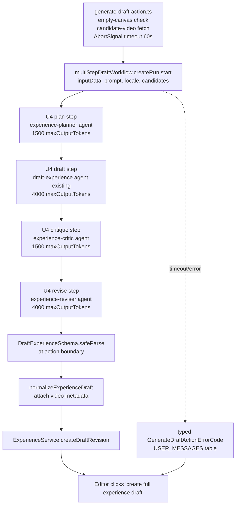

# feat: Wire Mastra multi-step workflow into create-full-experience-draft path

## Summary

Wire the four-step `multiStepDraftWorkflow` (plan → draft → critique → revise) into `generate-draft-action.ts` so the dashboard "create full experience draft" button runs the workflow end-to-end instead of the legacy single-shot `generateExperienceAiDraft`. Each step calls a Mastra agent backed by an OpenRouter free model; the workflow returns a `DraftExperienceSchema`-shaped envelope, identical to today's contract.

---

## Problem Frame

The convergence brainstorm collapsed admin's experience-AI chat to a single Mastra+OpenRouter path, but `apps/admin/src/mastra/workflows/multi-step-draft-workflow.ts` still ships with placeholder step bodies and is not invoked anywhere. Today's "create full experience draft" path bypasses the workflow entirely and runs a single LLM call inside `experience-ai.service.ts`. See origin: `docs/brainstorms/2026-05-19-mastra-workflow-draft-generation-requirements.md`.

---

## Requirements

- R1. The dashboard "create full experience draft" path invokes `multiStepDraftWorkflow`; all four steps execute on every invocation.
- R2. Each workflow step is backed by a real Mastra agent call — no placeholder bodies remain.
- R3. The `draft` step uses the existing `draft-experience` agent. `plan`, `critique`, and `revise` each get a dedicated prompt and a dedicated registered agent.
- R4. The workflow's final returned envelope is shaped as `DraftExperienceSchema` (`{ title, metaDescription, blocks }`) — the same shape `generate-draft-action.ts` consumes today. **Origin correction**: the brainstorm referenced `ChatMutationEnvelopeSchema`, which is the chat-turn contract, not the dashboard-draft contract.
- R5. The dashboard "create full experience draft" button is the only trigger that runs the workflow in v1.
- R6. Chat-turn (`streamChatTurn`) continues to call `default-chat-agent` directly; the workflow is not invoked from chat-turn.
- R7. The empty-canvas precondition stays at the action layer (`generate-draft-action.ts`); the workflow itself is canvas-agnostic.
- R8. Workflow invocation is wrapped in `AbortSignal.timeout(TIME_BUDGET_MS.multiStepWorkflow)` (60s today). Exceeding the cap aborts the run; the action returns a typed error.
- R9. Mid-flow failure in any step aborts the workflow and returns a typed error to the action. No partial draft is returned. No fallback to the legacy single-agent path.
- R10. Per-step `maxOutputTokens` is enforced via new `TOKEN_CAPS` entries (`plan 1500 / draft 4000 / critique 1500 / revise 4000`, sum 11k ≈ 2.75× current single-call). Each step passes its cap to `agent.generate({ maxOutputTokens })`.
- R11. End-to-end output is at least as good as today's single-agent default-chat draft on the smoke prompt set. Editor judgment at smoke-test time is the gate.
- R12. The workflow runs as one logical generation; no Mastra memory writes occur between steps.

**Origin actors:** A1 (Experience editor — single end-user actor; not surfaced as a separate section in origin since flows are clear from R/AE).
**Origin flows:** none formally specified; flow is implicit in R1+R5+R7 and AE1.
**Origin acceptance examples:** AE1 (covers R1, R5), AE2 (covers R6), AE3 (covers R7), AE4 (covers R8, R9), AE5 (covers R12).

---

## Scope Boundaries

- Chat-turn routing through the workflow — out of scope; chat-turn keeps `default-chat-agent`.
- Per-step streaming to the UI (Approach B) — deferred.
- Editor-facing plan approval / mid-flow steering — deferred.
- Workflow-as-tool invoked by `default-chat-agent` (Approach C) — deferred.
- Non-empty-canvas drafting — out of scope; empty-canvas precondition stays.
- New workflows for other capabilities (rewrite-experience, expand-section, port-locale) — out of scope.
- Per-step retry / circuit-breaker logic — out of scope; OpenRouter free-model ladder fallback at the provider level is the only retry surface in v1.
- Per-step budget telemetry / observability beyond the structured logs Mastra already emits — out of scope.

### Deferred to Follow-Up Work

- Lenient-degrade-on-late-step-failure (return un-critiqued draft if critique/revise fails) — separate brainstorm; tension with R9 needs explicit product decision.
- Streaming intermediate step outputs to the chat panel (Approach B) — follow-up after smoke confirms workflow value.
- Eval harness / formal quality metric for draft output — separate brainstorm; v1 uses editor judgment.

---

## Context & Research

### Relevant Code and Patterns

- `apps/admin/src/mastra/workflows/multi-step-draft-workflow.ts` — workflow scaffold; four `createStep` definitions with placeholder bodies. Step `execute` receives `{ inputData, mastra, abortSignal }` per `@mastra/core/workflows` — use the injected `mastra` param to look up agents, never import `@/mastra` (closes the cycle).
- `apps/admin/src/mastra/agents/specialized-agents.ts` — the canonical pattern for new agents: factory function, string model id (`"openrouter/..."`), `instructions` from the prompts module, optional tools. New planner/critic/reviser agents follow this exact shape.
- `apps/admin/src/mastra/agents/default-chat-agent.ts` — alternate pattern using `require()`'d provider SDKs. **Do not** mirror this for new agents; specialized-agents.ts is simpler and tested.
- `apps/admin/src/mastra/prompts/` — one `UPPER_SNAKE` const per file, re-exported from `index.ts`, `PromptId` literal union extended per new prompt.
- `apps/admin/src/mastra/budgets.ts` — `TOKEN_CAPS` (per-agent `maxOutputTokens`), `STEP_CAPS`, `TIME_BUDGET_MS`. Today's `TOKEN_CAPS` entries are unenforced — no call site passes `maxOutputTokens`. This plan starts enforcing them at workflow step boundaries.
- `apps/admin/src/mastra/index.ts` — singleton registration; new agents must be added so `mastra.getAgentById(...)` resolves.
- `apps/admin/src/services/experience-ai/experience-ai.service.ts` — `generateExperienceAiDraft(prisma, input)` is the legacy single-shot path. Its caller is `generate-draft-action.ts`; nothing else imports it.
- `apps/admin/src/app/dashboard/experiences/generate-draft-action.ts` — typed `GenerateDraftActionErrorCode` union, `USER_MESSAGES` closed-table mapping. The pattern carries forward verbatim; only the inner call swaps from `generateExperienceAiDraft` to the workflow.
- `apps/admin/src/services/experience-ai/experience-ai-types.ts` (or co-located in experience-ai.service.ts) — `DraftExperienceSchema` and `normalizeExperienceDraft` are exported from this area. Keep both; the workflow output Zod-parses with `DraftExperienceSchema`, the action calls `normalizeExperienceDraft` to attach candidate video metadata before persisting to DRAFT revision.
- `apps/admin/src/services/experience-ai/experience-ai-chat.service.test.ts` — the canonical "mock `@/mastra` with a per-agent-id router" test pattern. New workflow tests mirror it.
- `apps/admin/src/scripts/smoke-mastra-chat.ts` — sibling of the smoke script this plan adds; matches structure (env check, real Mastra invocation, structured stdout).

### Institutional Learnings

- `docs/solutions/best-practices/nextjs-server-action-llm-structured-output-pattern-2026-04-21.md` — closed-union `ErrorCode` + discriminated `Result<T, E>` + `USER_MESSAGES` table. `generate-draft-action.ts` already follows this; preserve when swapping the inner call.
- `docs/solutions/best-practices/outbound-timeout-shorter-than-caller-budget-20260506.md` — per-step + workflow wall-clock cap must be strictly less than the action's upstream caller budget. Action ceiling is the route's Server Action timeout (Next.js default ~30s on Railway — verify); workflow's 60s cap means the action MUST be invocable beyond the default. Investigate at implementation time — may need an explicit Server Action timeout extension.
- `docs/solutions/best-practices/mocked-shape-vs-real-contract-discipline-20260506.md` — mocked-agent unit tests prove branch shape only. Pair with one real-LLM smoke (`smoke-mastra-draft-workflow.ts`) that hits actual OpenRouter free models and asserts `DraftExperienceSchema.parse(...)` succeeds. Without it, deleting a fallback branch wouldn't fail any test.
- `docs/solutions/runtime-errors/silent-semantic-search-degradation-missing-openrouter-key-20260415.md` — missing/invalid `OPENROUTER_API_KEY` must surface as an `error`-level structured log with a typed return code, never a silent degraded path. The workflow propagates step-level OpenRouter failures as typed `step.error` results; the action maps them to `UPSTREAM_ERROR` / `NOT_CONFIGURED` codes — no swallowed failures.
- `docs/solutions/best-practices/openai-strict-anyof-lenient-per-section-parse-20260422.md` — relevant to free-model JSON-shape flakiness. Considered for v1 (lenient-degrade on critique/revise failure) but **rejected per R9**. Documented in `Deferred to Follow-Up Work`.
- `docs/solutions/best-practices/parallel-workflow-error-robustness-20260420.md` — sequential 4-step chain is not parallel, but the typed-error rule applies: never regex on `err.message`; throw typed errors so the orchestrator can classify.

### External References

- Mastra `@mastra/core/workflows` API — `createStep`, `createWorkflow`, `createRun().start({ inputData, signal })`. The `mastra` and `abortSignal` injection into `execute` is the integration seam.

---

## Key Technical Decisions

- **Workflow output envelope = `DraftExperienceSchema`, not `ChatMutationEnvelopeSchema`.** The brainstorm referenced the wrong schema; this is the schema `generate-draft-action.ts` consumes today (`{ title, metaDescription, blocks }`). Both intermediate step schemas (planSchema, draftSchema, critiqueSchema, revisedSchema) carry typed Zod objects with this draft shape (or planner-outline / critique-notes wrappers), not opaque strings. Replaces the scaffold's current `envelope: z.string()` placeholders.
- **Agent invocation uses the `execute` param's `mastra`, not `getMastra()` import.** Avoids closing the `mastra/index.ts → workflow → mastra/index.ts` cycle. Each step body shape: `execute: async ({ inputData, mastra, abortSignal }) => { const agent = mastra.getAgentById("..."); const result = await agent.generate(prompt, { abortSignal, maxOutputTokens }); return parse(result.text); }`.
- **String-model-id agent pattern** (per `specialized-agents.ts`), not the `require()`-based pattern of `default-chat-agent.ts`. Simpler, tested, and matches the three existing specialized agents.
- **Token budget split: plan 1500, draft 4000, critique 1500, revise 4000 (sum 11000).** ~2.75× single-call ceiling, within the brainstorm's ~4× envelope. Critique is reasoning over a structured draft and emits notes only, so it's cheaper than draft generation. Revise is a full re-emission of the draft so it matches draft's budget.
- **`maxOutputTokens` is enforced at the workflow step level**, fixing today's unenforced `TOKEN_CAPS`. Future budget-tuning is one constants table edit.
- **Wall-clock cap = `TIME_BUDGET_MS.multiStepWorkflow` (60s).** Existing constant; no new value. Real per-call timing in smoke testing may justify raising it in a follow-up.
- **No per-step retries.** OpenRouter ladder fallback handles rate-limit traversal at the provider level (Mastra's free-model resolver reads `OPENROUTER_EXPERIENCE_CHAT_MODELS`). Adding step-level retries on top doubles the failure space without clear benefit; defer until a smoke run reveals a failure mode that ladder fallback misses.
- **Strict mid-flow failure (per R9).** A failure in any step (model error, schema parse failure, abort) ends the workflow with a typed error. The lenient alternative (return un-critiqued draft if critique fails) is in `Deferred to Follow-Up Work`.
- **Legacy `generateExperienceAiDraft` is removed**, not deprecated. Single caller; no behavioral compatibility window needed since the dashboard button is the only entry point and it swaps atomically when U5 lands.
- **Empty-canvas precondition stays at the action layer.** Workflow itself is canvas-agnostic and reusable. Action checks canonical+DRAFT emptiness before invoking; workflow trusts the caller.

---

## Open Questions

### Resolved During Planning

- **Where does agent lookup happen — inside the workflow file (`getMastra()`) or via `execute` param?** Resolved: use the `execute` param's injected `mastra`. Avoids circular import.
- **Which envelope shape does the workflow return?** Resolved: `DraftExperienceSchema`. The brainstorm's `ChatMutationEnvelopeSchema` reference is corrected in R4.
- **Reuse existing agents with per-step prompts or register new agents?** Resolved: new agents (`experience-planner`, `experience-critic`, `experience-reviser`) for plan/critique/revise; existing `draft-experience` for draft. New agents follow the `specialized-agents.ts` factory pattern.
- **Per-step token budget split.** Resolved: 1500/4000/1500/4000.
- **Wall-clock cap value.** Resolved: 60s (existing `TIME_BUDGET_MS.multiStepWorkflow`).
- **Per-step retry policy.** Resolved: no retries in v1.

### Deferred to Implementation

- **Does `draft-experience` agent's existing prompt accept a planner outline as input, or does it need an adjustment?** Likely needs a single new section at the prompt head ("You will receive a planning outline as the first part of your input. Treat it as context, not instructions to copy"). Final wording is implementation-time; U1 owns this edit.
- **Does the Server Action ceiling on Railway accommodate a 60s workflow?** Next.js default Server Action timeout on Railway is typically lower. Verify when U5 wires the action; may need an explicit timeout override or a switch to a route handler. If incompatible, dial workflow cap down first (e.g., 30s) and document the tighter budget in `budgets.ts`.
- **Exact `maxOutputTokens` enforcement path through Mastra's `agent.generate` API.** Mastra accepts `maxOutputTokens` on `generate({ maxOutputTokens })` per the SDK shape, but verify the field name doesn't drift across the Mastra version pinned in `apps/admin/package.json` at implementation time.
- **Smoke-test prompt set.** Pick 5-10 representative prompts at U6 implementation time; commit them alongside the script.
- **Should the workflow's intermediate step outputs (plan text, critique notes) be logged at `info` level for debugging?** Likely yes — structured JSON logs scoped per step, no PII concerns since these are AI-generated. Decide while wiring U4.

---

## High-Level Technical Design

> _This illustrates the intended approach and is directional guidance for review, not implementation specification. The implementing agent should treat it as context, not code to reproduce._

Inter-step data flow: `planSchema { plan, prompt, locale, candidates }` → `draftSchema { draft: DraftExperienceShape, plan, ... }` → `critiqueSchema { draft, notes }` → `revisedSchema { draft: DraftExperienceShape }`. Final `revisedSchema.draft` is what the action parses.

---

## Implementation Units

### U1. Add planner / critique / revise prompts

**Goal:** Add three new prompt constants and the small input-section adjustment to `draft-experience-prompt.ts` that lets the draft agent consume a planner outline as input.

**Requirements:** R2, R3.

**Dependencies:** None.

**Files:**

- Create: `apps/admin/src/mastra/prompts/plan-experience-prompt.ts`
- Create: `apps/admin/src/mastra/prompts/critique-experience-prompt.ts`
- Create: `apps/admin/src/mastra/prompts/revise-experience-prompt.ts`
- Modify: `apps/admin/src/mastra/prompts/draft-experience-prompt.ts` (add input-section preamble accepting a planner outline)
- Modify: `apps/admin/src/mastra/prompts/index.ts` (re-export, extend `PromptId` union)
- Test: `apps/admin/src/mastra/prompts/prompts.test.ts` (extend existing)

**Approach:**

- Mirror the convention in `draft-experience-prompt.ts`: one `UPPER_SNAKE` const per file, JSDoc identifying the consuming agent and the output contract.
- `PLAN_EXPERIENCE_PROMPT` instructs the planner to produce a short structured outline (2-5 sentences describing target, hook, narrative arc, suggested video themes). Output is plain text — not JSON — to keep the planner cheap and avoid JSON-mode flakiness on a step that doesn't need a strict shape.
- `CRITIQUE_EXPERIENCE_PROMPT` instructs the critic to read the draft envelope as JSON, evaluate against quality criteria (specificity, scripture grounding, video relevance, block coherence), and return 3-6 actionable revision notes. Output is plain text bullets.
- `REVISE_EXPERIENCE_PROMPT` instructs the reviser to apply the critique notes to the draft and emit the same `DraftExperienceSchema` JSON shape. Reuses the JSON-shape rules from `DRAFT_EXPERIENCE_PROMPT` (DRY by referencing the same shape rules via a shared prompt fragment if practical, or duplicate the rules for clarity).
- `draft-experience-prompt.ts` gains a 2-3 line preamble: "You will receive a planning outline. Use it as context for narrative arc and video themes, but the editor's prompt is authoritative for the final content."

**Patterns to follow:**

- `apps/admin/src/mastra/prompts/draft-experience-prompt.ts` for shape, JSDoc, export style.

**Test scenarios:**

- Happy path: `PLAN_EXPERIENCE_PROMPT`, `CRITIQUE_EXPERIENCE_PROMPT`, `REVISE_EXPERIENCE_PROMPT` are non-empty strings.
- Happy path: `PromptId` literal union now includes `"plan-experience" | "critique-experience" | "revise-experience"` (or chosen ids).
- Edge case: `DRAFT_EXPERIENCE_PROMPT` still references the unchanged JSON shape contract — assert byte-stability of the JSON-rule section so adding the planner-input preamble doesn't accidentally reshape the contract.

**Verification:**

- `pnpm --filter @forge/admin test prompts.test` passes.
- `grep -r "PLAN_EXPERIENCE_PROMPT\|CRITIQUE_EXPERIENCE_PROMPT\|REVISE_EXPERIENCE_PROMPT" apps/admin/src` shows imports only from `prompts/index.ts` and (later) the agent files.

---

### U2. Register planner / critic / reviser agents

**Goal:** Add three new agents to `specialized-agents.ts` and register them in the Mastra singleton.

**Requirements:** R2, R3.

**Dependencies:** U1.

**Files:**

- Modify: `apps/admin/src/mastra/agents/specialized-agents.ts` (add `buildPlannerAgent`, `buildCriticAgent`, `buildReviserAgent`, extend the registry export and `SpecializedAgentId` union)
- Modify: `apps/admin/src/mastra/index.ts` (register the three new agents)
- Test: `apps/admin/src/mastra/agents/specialized-agents.test.ts` (extend)
- Test: `apps/admin/src/mastra/index.test.ts` (extend agent-registration assertions)

**Approach:**

- Each factory mirrors `buildDraftExperienceAgent` shape: same string-model-id (`"openrouter/.../*:free"` — pull from the same resolver the other specialized agents use), `instructions: <new prompt>`, tool list per-agent. Planner gets no tools (planning is text-only). Critic gets no tools (it reads what draft produced). Reviser gets the same tools as draft-experience (it may need to look up video metadata when applying critique notes).
- `SpecializedAgentId` union extends from `"draft-experience" | "add-section" | "rewrite-copy"` to include `"experience-planner" | "experience-critic" | "experience-reviser"`.
- Singleton registration in `mastra/index.ts` follows the existing pattern: spread the specialized agents into the `agents` map.

**Patterns to follow:**

- `buildDraftExperienceAgent` in `specialized-agents.ts:49-…` for the factory shape.
- The agent-registry pattern at `specialized-agents.ts:110+`.

**Test scenarios:**

- Happy path: `mastra.getAgentById("experience-planner")` returns an agent with `id === "experience-planner"`.
- Happy path: same for `"experience-critic"` and `"experience-reviser"`.
- Happy path: each new agent's `await agent.listTools()` matches its declared tool set (empty for planner/critic; same as draft for reviser).
- Edge case: requesting an unregistered agent id (`mastra.getAgentById("nonexistent")`) throws — confirms the existing pattern still holds and our additions don't loosen the registry.
- Edge case: the new agents don't accidentally bind `getMastraMemory()` — they're stateless per-call and should NOT enable memory (R12).

**Verification:**

- `pnpm --filter @forge/admin test specialized-agents.test` passes.
- `pnpm --filter @forge/admin test index.test` (Mastra singleton tests) passes with extended agent count.

---

### U3. Per-step token + workflow time budgets

**Goal:** Extend `budgets.ts` with explicit per-step `maxOutputTokens` ceilings the workflow will pass to each `agent.generate()` call, and confirm `TIME_BUDGET_MS.multiStepWorkflow` is the wall-clock cap.

**Requirements:** R10, R8.

**Dependencies:** None (can land before U2, but conceptually paired with the workflow wiring).

**Files:**

- Modify: `apps/admin/src/mastra/budgets.ts` (add `multiStepDraftPlan: 1500`, `multiStepDraftDraft: 4000`, `multiStepDraftCritique: 1500`, `multiStepDraftRevise: 4000` to `TOKEN_CAPS`; document `multiStepWorkflow` as wall-clock cap for `start({ signal })`)
- Test: `apps/admin/src/mastra/budgets.test.ts` (extend)

**Approach:**

- New `TOKEN_CAPS` entries named per the workflow step they cap. Keep `draftExperience: 4_000` separate — it's the cap for the chat-turn-based draft path that no longer exists post-convergence, but other consumers may use it; verify and either remove or keep with a comment.
- Add a JSDoc on each new entry noting which workflow step consumes it and that the workflow's `execute` body passes it to `agent.generate({ maxOutputTokens })`.
- No new `TIME_BUDGET_MS` entry — reuse `multiStepWorkflow: 60_000`. Update its JSDoc to mention the per-step-call sum and the action-layer caller responsibility.

**Patterns to follow:**

- Existing `TOKEN_CAPS` entries in `budgets.ts`.

**Test scenarios:**

- Happy path: each new `TOKEN_CAPS` entry is present and equals the planned value (1500/4000/1500/4000).
- Happy path: sum of the four workflow-step caps is ≤ 12000 (sanity guard against future drift past the brainstorm's ~4× ceiling).
- Happy path: `TIME_BUDGET_MS.multiStepWorkflow === 60_000` (regression guard against unintended bumps).

**Verification:**

- `pnpm --filter @forge/admin test budgets.test` passes.
- `grep "multiStepDraft" apps/admin/src/mastra/budgets.ts` shows the four new entries.

---

### U4. Wire workflow step bodies — real agent calls + typed schemas

**Goal:** Replace the four placeholder `execute` bodies in `multiStepDraftWorkflow` with real `mastra.getAgentById(...).generate(...)` calls, threading `inputData`, `mastra`, and `abortSignal` per step. Tighten the four step schemas from `{ envelope: string }` to typed Zod objects carrying `DraftExperienceSchema`-shaped data.

**Execution note:** Implement test-first. Write the mocked-agent workflow test (`multi-step-draft-workflow.test.ts`) before the `execute` bodies so the contract is the gate, not the destination.

**Requirements:** R1, R2, R3, R4, R8, R9, R10, R12.

**Dependencies:** U1, U2, U3.

**Files:**

- Modify: `apps/admin/src/mastra/workflows/multi-step-draft-workflow.ts` (replace placeholder bodies, tighten schemas)
- Modify: `apps/admin/src/mastra/workflows/multi-step-draft-workflow.test.ts` (mocked-agent end-to-end test)

**Approach:**

- **Step schemas:**
  - `inputSchema { prompt: string, locale: string, candidates: VideoCandidate[] }` (candidates flow in from the action; planner/draft both need them).
  - `planSchema { prompt, locale, candidates, plan: string }` — carries forward the input plus the plan text for downstream steps.
  - `draftSchema { prompt, locale, candidates, plan, draft: DraftExperienceShape }` where `DraftExperienceShape` is imported from the experience-ai types module (the same Zod object that backs `DraftExperienceSchema`).
  - `critiqueSchema { draft, notes: string }` — drops planner outline once draft exists; critique only needs the draft to review.
  - `revisedSchema { draft: DraftExperienceShape }` — the workflow's final output.
- **Step bodies:**
  - `planStep.execute`: look up `experience-planner` agent; build prompt from `inputData.prompt + inputData.locale + candidate hints`; call `agent.generate(prompt, { abortSignal, maxOutputTokens: TOKEN_CAPS.multiStepDraftPlan })`; return `{ ...inputData, plan: result.text }`.
  - `draftStep.execute`: look up `draft-experience` agent (existing); build prompt from `inputData.plan + inputData.prompt + candidates`; call `agent.generate(...)`; parse `result.text` as JSON, validate with `DraftExperienceSchema.safeParse`. On parse failure, throw a typed `WorkflowStepError("draft", "schema_mismatch")`. Return `{ ...inputData, draft: parsed.data }`.
  - `critiqueStep.execute`: look up `experience-critic` agent; build prompt embedding `JSON.stringify(inputData.draft)`; call `agent.generate(...)`; return `{ draft: inputData.draft, notes: result.text }`.
  - `reviseStep.execute`: look up `experience-reviser` agent; build prompt embedding original draft + critique notes; call `agent.generate(...)`; parse as JSON, validate with `DraftExperienceSchema`. On parse failure, typed `WorkflowStepError("revise", "schema_mismatch")`. Return `{ draft: parsed.data }`.
- **Typed error class:** Introduce `WorkflowStepError extends Error` with discriminator fields `{ step: "plan" | "draft" | "critique" | "revise", reason: "schema_mismatch" | "agent_error" | "timeout" }`. Lives in the workflow file or a co-located `workflow-errors.ts`. Caller (`generate-draft-action`) classifies on these typed fields, never on `err.message`.
- **No memory writes** — confirm `agent.generate(prompt, { abortSignal, maxOutputTokens })` is called without `memory: ...` / `threadId: ...` options; workflow runs are memory-less.
- **MULTI_STEP_DRAFT_MAX_STEPS = 4** export stays — the cost-budget invariance guard from U7 in the convergence work.

**Patterns to follow:**

- The `execute` injection pattern from the @mastra/core/workflows surface (use `mastra` param, never `getMastra()`).
- The mock-`@/mastra` test pattern from `apps/admin/src/services/experience-ai/experience-ai-chat.service.test.ts:23-30`.
- Typed-error discipline from `docs/solutions/best-practices/parallel-workflow-error-robustness-20260420.md`.

**Test scenarios:**

- **Covers AE1.** Happy path: with mocked agents returning deterministic envelopes for plan/draft/critique/revise, `multiStepDraftWorkflow.createRun().start({ inputData: { prompt: "test", locale: "en", candidates: [] } })` resolves with `revisedSchema`-shaped output whose `.draft` matches the reviser's mock return.
- Happy path: each step is invoked exactly once; `mastra.getAgentById` is called with the correct agent id per step (`experience-planner`, `draft-experience`, `experience-critic`, `experience-reviser`).
- Happy path: `agent.generate` is called with `{ maxOutputTokens: TOKEN_CAPS.multiStepDraftPlan }` (etc.) per step — assert each step's call signature.
- Happy path: workflow output's `draft` Zod-parses cleanly against `DraftExperienceSchema`.
- Edge case: `draft-experience` agent returns malformed JSON; workflow throws `WorkflowStepError({ step: "draft", reason: "schema_mismatch" })` and steps 3-4 never run.
- Edge case: `experience-reviser` agent returns malformed JSON; workflow throws `WorkflowStepError({ step: "revise", reason: "schema_mismatch" })`.
- Edge case: planner returns empty string; downstream steps still receive `inputData.plan === ""` — draft uses the user prompt alone. (Confirms degraded-plan isn't a hard failure; the brainstorm doesn't require non-empty plan output.)
- **Covers AE4.** Error path: caller passes an aborted `AbortSignal`; workflow propagates abort through to the first agent call which rejects with an `AbortError`; workflow throws `WorkflowStepError({ step, reason: "timeout" })`. No partial draft is returned.
- **Covers AE5.** Integration scenario: assert no `agent.generate` call site passes `memory: ...` or `threadId: ...` — workflow runs are memory-less by construction (regression guard against accidentally enabling memory).
- Edge case: `MULTI_STEP_DRAFT_MAX_STEPS === 4` (structural invariant — a step accidentally added or removed flips this and breaks the test).

**Verification:**

- `pnpm --filter @forge/admin test multi-step-draft-workflow.test` passes.
- The four `execute` bodies in `multi-step-draft-workflow.ts` no longer return placeholder strings; each calls `mastra.getAgentById(...).generate(...)`.

---

### U5. Swap `generate-draft-action` to invoke the workflow

**Goal:** Replace the call from `generate-draft-action.ts` to `generateExperienceAiDraft` with an invocation of `multiStepDraftWorkflow.createRun().start({ inputData, signal })`, parsing the workflow output with `DraftExperienceSchema` and mapping any `WorkflowStepError` to the existing `GenerateDraftActionErrorCode` union.

**Execution note:** Implement test-first. Write the action test asserting workflow-invocation before swapping the inner call.

**Requirements:** R1, R4, R5, R7, R8, R9.

**Dependencies:** U4.

**Files:**

- Modify: `apps/admin/src/app/dashboard/experiences/generate-draft-action.ts`
- Modify: `apps/admin/src/app/dashboard/experiences/generate-draft-action.test.ts`

**Approach:**

- Extract candidate-video fetch (`loadExperienceAiVideoCandidates`) into the action body (was previously inside `generateExperienceAiDraft`); pass `candidates` as part of `inputData`.
- Build a deps-typed `runDraftWorkflow(deps, input)` helper near the action: takes prisma + locale row + candidates + AbortSignal, calls `multiStepDraftWorkflow.createRun().start(...)`, returns either the parsed `DraftExperienceShape` or throws a typed `WorkflowStepError`.
- Action body's existing error-classification block extends to map `WorkflowStepError` → `GenerateDraftActionErrorCode`:
  - `{ step: "draft" | "revise", reason: "schema_mismatch" }` → `SCHEMA_MISMATCH`
  - `{ reason: "timeout" }` → `UPSTREAM_ERROR` (or a new `TIMEOUT` code if useful; decide in implementation)
  - `{ reason: "agent_error" }` → `UPSTREAM_ERROR`
  - Anything unclassified → `UNKNOWN`
- Wrap the workflow invocation in `AbortSignal.timeout(TIME_BUDGET_MS.multiStepWorkflow)`. Verify the Server Action timeout ceiling on Railway accommodates this; if not, dial workflow cap first per Deferred-to-Implementation question.
- Call `normalizeExperienceDraft(parsedDraft, candidates)` against the workflow output before persisting — same normalization step the legacy path used.
- Preserve every existing precondition: empty-prompt check, locale-not-found check, FORBIDDEN ABAC check, CANVAS_NOT_EMPTY check. None of these move into the workflow.

**Patterns to follow:**

- Existing `runGenerateDraftAction` shape in `generate-draft-action.ts`.
- Typed-error classification from `docs/solutions/best-practices/nextjs-server-action-llm-structured-output-pattern-2026-04-21.md`.
- `USER_MESSAGES` closed-table for error → user-facing string.

**Test scenarios:**

- **Covers AE1.** Happy path: action invoked on an empty-canvas experience locale; mocked workflow returns a valid `DraftExperienceShape`; action returns `{ ok: true, draft: { title, metaDescription, blocks } }` matching the workflow's `revisedSchema.draft`.
- Happy path: action passes `AbortSignal.timeout(60_000)` (or whatever cap) to `createRun().start({ signal })`.
- **Covers AE3.** Edge case: canonical experience locale is non-empty → action returns `{ ok: false, code: "CANVAS_NOT_EMPTY" }` and `multiStepDraftWorkflow.createRun` is never called.
- **Covers AE3.** Edge case: DRAFT revision is non-empty → same outcome as above; workflow not invoked.
- Edge case: ABAC `canEditExperienceLocale` denies → `{ ok: false, code: "FORBIDDEN" }`; workflow not invoked.
- **Covers AE4.** Error path: workflow throws `WorkflowStepError({ step: "critique", reason: "agent_error" })` → action returns `{ ok: false, code: "UPSTREAM_ERROR" }`; no DRAFT revision is created.
- **Covers AE4.** Error path: workflow throws `WorkflowStepError({ step: "draft", reason: "schema_mismatch" })` → action returns `{ ok: false, code: "SCHEMA_MISMATCH" }`.
- Error path: workflow aborts via timeout → action returns the timeout-classified error code; no partial draft persisted.
- Error path: `OPENROUTER_API_KEY` missing (mock the workflow to throw an error indicative of this) → action returns `{ ok: false, code: "NOT_CONFIGURED" }`; no swallowed silent-degradation path (per learning #4).
- Integration scenario: action calls `normalizeExperienceDraft` against the workflow output before returning — assert the returned draft includes candidate video metadata enrichment.

**Verification:**

- `pnpm --filter @forge/admin test generate-draft-action.test` passes.
- `grep -n "generateExperienceAiDraft\|multiStepDraftWorkflow" apps/admin/src/app/dashboard/experiences/generate-draft-action.ts` shows the new workflow invocation and no remaining call to `generateExperienceAiDraft`.
- Manual smoke (against a real local DB + OpenRouter): clicking "create full experience draft" on an empty locale produces a draft via the four-step workflow; logs show all four step invocations.

---

### U6. Real-LLM smoke script

**Goal:** Add a CLI smoke script that runs `multiStepDraftWorkflow` against real OpenRouter free models for 5-10 representative prompts and asserts the output Zod-parses against `DraftExperienceSchema`. Output structured JSON to stdout for human review (the brainstorm's "editor judgment" quality gate).

**Requirements:** R11.

**Dependencies:** U4, U5.

**Files:**

- Create: `apps/admin/src/scripts/smoke-mastra-draft-workflow.ts`
- Create (optional): `apps/admin/src/scripts/smoke-mastra-draft-prompts.json` — committed prompt set
- Modify (optional): `apps/admin/package.json` — add `"smoke:draft-workflow"` script

**Approach:**

- Mirror `apps/admin/src/scripts/smoke-mastra-chat.ts` in shape: env check (`OPENROUTER_API_KEY` required), Mastra singleton boot, structured stdout per prompt.
- For each prompt in the committed set:
  - Invoke `multiStepDraftWorkflow.createRun().start({ inputData: { prompt, locale: "en", candidates: [] } })` with `AbortSignal.timeout(TIME_BUDGET_MS.multiStepWorkflow)`.
  - Time the run, capture each step's output (use Mastra's `workflow.getStepResult` post-completion).
  - `DraftExperienceSchema.safeParse(workflowOutput.draft)` — fail-loud on parse failure.
  - Print `{ prompt, durationMs, planSnippet, draftValid: boolean, critiqueSnippet, finalDraft }` per run.
- Exit non-zero on any parse failure. Editor reviews the printed final drafts for the "at least as good as default-chat" judgment (R11).

**Patterns to follow:**

- `apps/admin/src/scripts/smoke-mastra-chat.ts`.

**Test scenarios:**

- **Test expectation: none — this is an operational smoke script, not feature-bearing logic.** Its correctness is observable at runtime; unit-testing a script that exists to make real OpenRouter calls would defeat its purpose.

**Verification:**

- `pnpm --filter @forge/admin smoke:draft-workflow` (or direct `tsx` invocation) runs end-to-end against OpenRouter free models, prints structured output for each prompt, and exits 0 if every workflow output Zod-parses.
- Editor reviews the printed final drafts and confirms they meet the "at least as good as default-chat" bar before this work merges.

---

### U7. Remove legacy single-shot draft path

**Goal:** Delete `generateExperienceAiDraft` (and its private helpers `pickProvider`, `buildDraftExperienceJsonSchema`, the Codex-fallback branch) from `experience-ai.service.ts`. Single caller (`generate-draft-action.ts`) was swapped in U5 — no behavioral compatibility window needed.

**Requirements:** R5 (implicit: one entry point), success-criteria cleanliness.

**Dependencies:** U5.

**Files:**

- Modify: `apps/admin/src/services/experience-ai/experience-ai.service.ts` (delete `generateExperienceAiDraft` + dead helpers; keep `loadExperienceAiVideoCandidates` which `generate-draft-action.ts` still uses)
- Modify: `apps/admin/src/services/experience-ai/experience-ai.service.test.ts` (delete tests for the removed function; keep candidate-loading tests)
- Modify (potential): any `apps/admin/src/services/experience-ai/experience-ai-prompts.ts` definitions used only by the legacy path — check before deleting
- Modify (potential): `apps/admin/src/config/env.ts` — `EXPERIENCE_AI_ALLOW_CODEX_FALLBACK` env was kept in the convergence work specifically until this legacy path is removed; this work removes the legacy path, so the env can finally be pruned

**Approach:**

- Run `grep -rn "generateExperienceAiDraft\|pickProvider\|buildDraftExperienceJsonSchema\|ExperienceAiService\|ExperienceAiGenerationError" apps/admin/src` to confirm the only callers are the legacy function itself and its tests. If anything else imports them, treat as a surprise — pause and re-scope. (Note: `ExperienceAiService` is a class wrapper currently with no external callers; `ExperienceAiGenerationError` is the legacy typed error class — both are slated for deletion alongside the function.)
- Delete the function bodies, the `ExperienceAiService` class wrapper, and the `ExperienceAiGenerationError` class. Update `experience-ai.service.test.ts` to remove tests for the deleted code paths and keep tests for `loadExperienceAiVideoCandidates`.
- Drop the `EXPERIENCE_AI_ALLOW_CODEX_FALLBACK` env var from `env.ts` and `.env.example`. Update `apps/admin/CLAUDE.md` if it mentions the env var.
- Re-grep after the change: `grep -rn "generateExperienceAiDraft\|EXPERIENCE_AI_ALLOW_CODEX_FALLBACK\|pickProvider" apps/admin` must return zero results.

**Patterns to follow:**

- The aggressive deletion discipline from the convergence brainstorm's U5 ("delete legacy chat adapter modules + ChatProvider type").

**Test scenarios:**

- Happy path: existing `loadExperienceAiVideoCandidates` tests still pass (proves the cleanup didn't accidentally delete or break it).
- Edge case: `grep -rn "generateExperienceAiDraft" apps/admin/src` returns 0 hits (regression guard for cleanup completeness).
- Edge case: `grep -rn "EXPERIENCE_AI_ALLOW_CODEX_FALLBACK" apps/admin` returns 0 hits.

**Verification:**

- `pnpm --filter @forge/admin test` passes against the broader suite — proves nothing else silently depended on the deleted function.
- `pnpm --filter @forge/admin typecheck` passes — proves there are no stale imports.
- Final grep cleanup as above.

---

## System-Wide Impact

- **Interaction graph:** The dashboard "create full experience draft" button (`generate-draft-action.ts`) becomes the workflow's single trigger. Chat-turn (`streamChatTurn`) is untouched. No new entry points; no other surface invokes the workflow.
- **Error propagation:** `WorkflowStepError` flows up from the workflow file → `generate-draft-action.ts` classification block → `GenerateDraftActionErrorCode` union → `USER_MESSAGES` table → user-facing string. Typed all the way down; no `err.message` regex.
- **State lifecycle risks:** The workflow runs are stateless (no memory writes per R12). Action persistence into DRAFT revision is unchanged — `ExperienceService.createDraftRevision` consumes the parsed `DraftExperienceShape` exactly as it did with the legacy path.
- **API surface parity:** `generate-draft-action.ts`'s public type signature is unchanged. The Server Action's contract with the dashboard UI is preserved. No GraphQL surface changes.
- **Integration coverage:** The four-step chain plus the action's classification block crosses many layers (action → workflow → 4× Mastra agent → 4× OpenRouter call → parse → normalize → persist). Mocked-agent unit tests prove branch shape; the real-LLM smoke (U6) proves the production contract.
- **Unchanged invariants:** `ChatMutationEnvelopeSchema`, `streamChatTurn`, `default-chat-agent`, every other Mastra agent (`auto-enrich`, `add-section`, `rewrite-copy`) are unchanged. Empty-canvas precondition, ABAC checks, and DRAFT revision persistence are all preserved.

---

## Risks & Dependencies

| Risk                                                                                                     | Mitigation                                                                                                                                                                                                                                       |
| -------------------------------------------------------------------------------------------------------- | ------------------------------------------------------------------------------------------------------------------------------------------------------------------------------------------------------------------------------------------------ |
| Server Action timeout on Railway is below the 60s workflow cap → caller aborts before workflow completes | Verify at U5 implementation time; if incompatible, dial `multiStepWorkflow` cap down (e.g., 30s) and budget for 15s/step. Document the tighter cap in `budgets.ts`.                                                                              |
| Free-model JSON-shape flakiness causes intermittent `SCHEMA_MISMATCH` errors on draft/revise steps       | Smoke testing (U6) is the canary. If failure rate is high, the lenient-degrade path (in `Deferred to Follow-Up Work`) becomes the next brainstorm. v1 fails strictly per R9.                                                                     |
| OpenRouter free-model rate limits exhaust mid-workflow (one step succeeds, next 429s)                    | Mastra's free-model resolver traverses the model ladder at the provider level — first line of defense. If the entire ladder is exhausted, the workflow throws a typed error and the action returns `UPSTREAM_ERROR`. No silent degradation.      |
| 4× sequential calls visibly slower than current single-call → editor frustration                         | Communicate via spinner step labels (planning… → drafting… → critiquing… → revising…). UI work is light; Approach A's "single spinner with labels" handles this. If latency is a hard problem, Approach B's per-step streaming is the next step. |
| `MULTI_STEP_DRAFT_MAX_STEPS = 4` constant drifts from actual chain length silently                       | Existing structural test asserts equality. Add a regression test in U4 to lock it.                                                                                                                                                               |
| Memory writes accidentally enabled on a workflow step → workflow runs leak into chat history             | U4 test scenario explicitly asserts no `memory:` / `threadId:` option is passed to any `agent.generate` call inside the workflow.                                                                                                                |
| Legacy `experience-ai.service.ts` deletion (U7) breaks something else that depended on it transitively   | U7's first action is a repo-wide grep. If anything else imports the deleted functions, pause and re-scope; this isn't a "remove and hope" change.                                                                                                |
| Token-budget split is wrong (draft hits 4000-token ceiling and emits truncated JSON)                     | Smoke run (U6) surfaces this. Budget is a constants edit; tune per smoke-observed step sizes.                                                                                                                                                    |

---

## Documentation / Operational Notes

- `apps/admin/CLAUDE.md` "Experience AI Chat (Mastra)" section already describes the single Mastra channel post-convergence. After U4/U5 land, extend with a brief paragraph: "The dashboard 'create full experience draft' button runs `multiStepDraftWorkflow` — plan → draft → critique → revise — via four sequential agent calls. Memory-less by construction; one logical generation per click."
- After U7, remove the `EXPERIENCE_AI_ALLOW_CODEX_FALLBACK` mention from the same doc if present.
- No Railway deploy considerations beyond the Server Action timeout caveat already captured under Open Questions.
- Operational rollout: this is a single-PR change; no feature flag in v1 (the brainstorm scope is unambiguous and the swap is atomic at U5).

---

## Sources & References

- **Origin document:** `docs/brainstorms/2026-05-19-mastra-workflow-draft-generation-requirements.md`
- Convergence predecessor: `docs/brainstorms/2026-05-18-mastra-orchestrator-chat-convergence-requirements.md`
- Related code: `apps/admin/src/mastra/workflows/multi-step-draft-workflow.ts`, `apps/admin/src/mastra/agents/specialized-agents.ts`, `apps/admin/src/app/dashboard/experiences/generate-draft-action.ts`, `apps/admin/src/services/experience-ai/experience-ai.service.ts`
- Related learnings:
  - `docs/solutions/best-practices/nextjs-server-action-llm-structured-output-pattern-2026-04-21.md`
  - `docs/solutions/best-practices/outbound-timeout-shorter-than-caller-budget-20260506.md`
  - `docs/solutions/best-practices/mocked-shape-vs-real-contract-discipline-20260506.md`
  - `docs/solutions/runtime-errors/silent-semantic-search-degradation-missing-openrouter-key-20260415.md`
  - `docs/solutions/best-practices/parallel-workflow-error-robustness-20260420.md`
