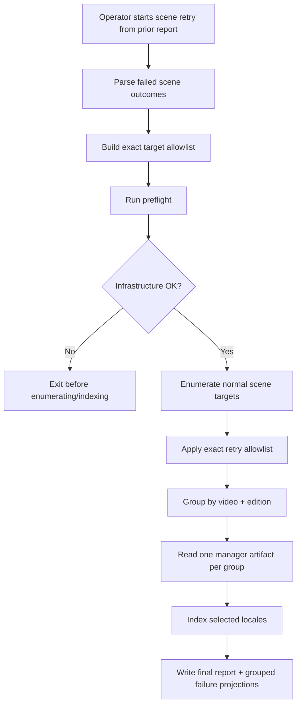

# fix: Recover failed production scene embedding backfill

## Summary

Recover the failed production scene embedding backfill without rerunning the full 202,504-target corpus blindly. The plan adds a fail-fast manager-artifact S3 preflight, exact retry selectors for failed scene targets from the prior report/log, and operator-friendly failure projections so the retry can be scoped to the ~928 failed groups instead of the whole catalog.

---

## Problem Frame

The completed production scene embedding report shows `totalTargets=202504`, `succeeded=40568`, `skipped=4139`, and `failed=157797`. Follow-up analysis found the dominant failure was not Prisma or OpenRouter: roughly 155k per-locale outcomes failed because admin could not resolve manager artifact storage at `t3.storageapi.dev` while reading `{assetId}/scene-analysis.json`.

The backfill grouped work correctly, but the final report is per target/locale. One transient artifact-read outage therefore exploded into a frightening failure count across many locales. Railway now resolves and reaches the endpoint, so the right recovery is a focused retry after preflight, not another full-catalog run.

---

## Requirements

- R1. Before any long scene embedding run, including `--pipeline=scene` and `--pipeline=both`, the admin CLI can fail fast when manager artifact storage or admin mapping storage is misconfigured, unreachable, or returning infrastructure errors.
- R2. A scene retry can be built from the previous `run-embeds.complete` report and target only failed scene outcomes.
- R3. Retry selectors can narrow to exact `(coreId, videoEditionId, locale)` targets so a retry does not reprocess unrelated editions/locales for the same core ID.
- R4. The retry preserves the existing one-artifact-read-per-`(video, edition)` grouping behavior.
- R5. Operator reports distinguish grouped artifact read failures from per-locale failures so future incidents are readable at the asset/group level.
- R6. Missing artifacts remain `skipped`/operator-enrichment work; transient DNS, timeout, auth, invalid artifact, Prisma, and provider failures remain failed/retry or fix work.
- R7. Production retry operations save report artifacts under `.tmp/prod-embeds/` and never print secrets.
- R8. Exact retry runs reconcile requested selectors against current enumeration and surface `requested`, `matched`, and `unmatched` counts so stale reports cannot silently under-run.

### Traceability to `feat-125`

- The origin ticket calls for batching, previews/status counts, retryable failure capture, and an audit trail for manager enrichment and embed-readiness operations. R1, R5, and R7 are the recovery-local version of those operator-safety requirements for the scene embed backfill.
- The origin ticket’s production-smoke criterion says prior missing/failed artifacts should become successful embeds after the right upstream state exists. R2, R3, R4, and R8 make that smoke possible without rerunning unrelated catalog rows.
- R6 preserves the origin ticket’s separation between validation failures that require upstream data fixes and retryable dispatch/runtime failures.
- This plan intentionally does not build the full admin UI from `feat-125`; it creates the CLI/workflow safety slice needed to recover the current production incident.

---

## Scope Boundaries

- Do not kill or mutate any completed prior backfill process.
- Do not automatically trigger manager enrichment from inside the embed workflow.
- Do not rerun all scene targets as the default recovery path.
- Do not expose new retry selectors through GraphQL in this pass. If implementation proves the retry must be run from a server/API context rather than the operator CLI, stop and create a follow-up plan/ticket instead of expanding this PR.
- Do not change scene embedding vector generation semantics, OpenRouter model choice, pgvector write shape, or search ranking behavior.
- Do not treat `VALIDATION_FAILED` manager enrichment items as retryable; missing mux/subtitle dispatch fields remain separate upstream data work.

### Deferred to Follow-Up Work

- Full admin UI for full-catalog manager enrichment remains owned by `feat-125`.
- A recurring Railway-hosted embed worker or durable job runner is separate from this local/operator CLI recovery.
- Automatic scene retry scheduling after manager enrichment completes should be planned separately if operators want closed-loop orchestration.

---

## Context & Research

### Relevant Code and Patterns

- `apps/admin/src/scripts/run-embeds.ts` already owns the operator CLI, `--report-out`, `--core-id`, `--locale`, structured events, SIGTERM handling, and final `run-embeds.complete` JSON.
- `apps/admin/src/scripts/trigger-enrichment.ts` provides the report-consumer pattern: `--from-report`, strict JSON parse, dedupe, stable sorting, and mutually exclusive manual/report inputs.
- `apps/admin/src/workflows/sceneEmbeddingBackfill.ts` enumerates targets, filters by core ID/locale, groups by `(videoId, videoEditionId)`, reads one scene-analysis artifact per group, and emits per-locale outcomes.
- `apps/admin/src/services/manager-artifacts.service.ts` wraps artifact storage errors into `ManagerArtifactError` with `artifact_missing`, `artifact_invalid`, or `artifact_read_failed`.
- `apps/admin/src/storage/s3.ts` cleanly separates admin storage (`RAILWAY_S3_*`) from manager artifact storage (`MANAGER_ARTIFACTS_S3_*`) and already uses bounded S3 request timeouts.
- `apps/admin/src/services/core-id-mapping.service.ts` has a useful mapping error taxonomy and key-prefix guard to mirror in preflight reporting.
- `apps/admin/src/workflows/sceneEmbeddingBackfill.test.ts` already proves grouping, artifact-missing cascade, non-missing failure cascade, synthetic failure isolation, and `missingArtifacts` projection behavior.

### Institutional Learnings

- `docs/solutions/platform/local-embed-pipeline-pattern-20260429.md` establishes local/operator embed CLI posture and the rule that manager artifacts are read live from manager S3.
- `docs/solutions/best-practices/per-parent-child-memoization-loadedartifact-pattern-20260505.md` explains why scene artifact reads are group-scoped, not locale-scoped.
- `docs/solutions/best-practices/workflow-report-operator-actionable-projection-pattern-20260506.md` supports adding operator projections that collapse noisy per-target outcomes into actionable lists.
- `docs/solutions/runtime-errors/aws-s3-nosuchkey-classification-pattern-20260506.md` is the precedent for typed storage error classification instead of message-only regex checks.
- `docs/solutions/best-practices/parallel-workflow-error-robustness-20260420.md` is the robustness pattern for bounded parallel work plus per-target isolation.

### External References

- External research skipped. The needed patterns are already local: AWS/S3 classification, Railway-safe operator CLI reports, workflow grouping, and bounded retry behavior.

---

## Key Technical Decisions

- Add preflight as an explicit CLI/workflow-adjacent service, not as ad hoc shell checks. This makes the guard testable and reusable by future full-catalog enrichment surfaces.
- Keep exact retry selectors inside the scene workflow input rather than forcing the CLI to decompose them into broad `--core-id` and `--locale` filters. Broad filters would reprocess unrelated editions.
- Parse prior `run-embeds.complete` reports first, and support log-derived retry sets only as a fallback. The report has the full target object; logs are missing `videoId` and `cmsVideoId`.
- Preserve existing group execution. Filtering happens before `groupTargetsByVideoEdition`, so a focused retry still reads each scene artifact once per failed group.
- Add new report projections rather than changing `BackfillOutcome` shape incompatibly. The per-target outcome contract is already consumed by tests and operator logs; grouped projections should be additive. If reliable categorization requires more than reason-string inspection, add an additive normalized failure category at outcome creation time.
- Treat GraphQL/API parity as follow-up work, not an implementation escape hatch. This recovery is CLI-first so it avoids schema/codegen churn and limits blast radius.

---

## Open Questions

### Resolved During Planning

- Should this become a new roadmap ticket? No. `feat-125` already owns full-catalog manager enrichment and recovery-oriented operator tooling; this plan is a focused recovery slice under that context.
- Should retry be full catalog? No. The prior report/log has enough information to retry exact failed targets/groups.
- Should manager be changed for the scene embedding retry? No for this recovery. Manager enrichment and missing mux/subtitle validation are separate from admin’s transient artifact-read failure.

### Deferred to Implementation

- Exact preflight classification names may be adjusted to match the most ergonomic test fixtures, but they should preserve the operator categories in this plan.
- Whether log-derived retry input is worth implementing in the same PR depends on report quality in `prod-scene-report.json`; report-derived retry is the required path.
- Whether preflight sample artifact miss is blocking should be controlled by mode: infrastructure failures block; a sample `artifact_missing` should warn unless the operator explicitly requires that asset to exist.

---

## High-Level Technical Design

> _This illustrates the intended approach and is directional guidance for review, not implementation specification. The implementing agent should treat it as context, not code to reproduce._

---

## Implementation Units

### U1. Manager Artifact Preflight

**Goal:** Add a reusable preflight that verifies admin can safely start a long scene embedding run before it enumerates and indexes targets.

**Requirements:** R1, R6, R7

**Dependencies:** None

**Files:**

- Create: `apps/admin/src/services/manager-artifacts-preflight.service.ts`
- Create: `apps/admin/src/services/manager-artifacts-preflight.service.test.ts`
- Modify: `apps/admin/src/storage/s3.ts`
- Modify: `apps/admin/src/scripts/run-embeds.ts`
- Test: `apps/admin/src/storage/s3.manager-artifacts-backend.test.ts`

**Approach:**

- Introduce a preflight result shape with `ok`, `checks`, `status`, `reason`, `retryable`, and sanitized `message`.
- Check manager artifact env presence and admin mapping env presence without printing values.
- Add storage-level helpers, if needed, for cheap manager/admin bucket reachability checks using existing S3 client configuration and timeout discipline.
- Call `loadCoreIdMapping(mappingS3Key)` as part of preflight so mapping key rejection, missing mapping, invalid mapping, and read failures are caught before the main run.
- Parse retry/report inputs before preflight when `--from-report` is present, so one failed report item can provide the sample `cmsVideoId`/asset ID for an optional artifact read.
- When no retry/report sample is available, run bucket/config/mapping preflight only; do not enumerate the whole target set just to find a sample.
- Optionally read one sample scene-analysis artifact through `readSceneAnalysisArtifact` when a sample target is available; classify `artifact_missing` as a warning unless strict mode is requested.
- Wire every scene-including CLI invocation (`--pipeline=scene` and `--pipeline=both`) to run preflight by default, with an explicit escape hatch only if implementation determines local tests need it.

**Execution note:** Start with classification tests for DNS/timeout/auth/bucket failures before wiring the CLI.

**Patterns to follow:**

- `apps/admin/src/services/core-id-mapping.service.ts` error taxonomy.
- `apps/admin/src/services/manager-artifacts.service.ts` typed error wrapping.
- `apps/admin/src/storage/s3.manager-artifacts-backend.test.ts` env isolation and S3 client assertions.

**Test scenarios:**

- Happy path: manager artifact env and admin mapping env are present, bucket reachability succeeds, mapping loads, and preflight returns `ok: true`.
- Error path: `getaddrinfo ENOTFOUND` from manager artifact storage returns a failed `dns_failed` check and prevents the run from continuing.
- Error path: Smithy timeout returns a retryable timeout check and prevents the run.
- Error path: `AccessDenied` returns an auth/config failure, not `artifact_missing`.
- Error path: `NoSuchBucket` returns a bucket/config failure, not `artifact_missing`.
- Error path: invalid mapping key returns `mapping_key_rejected` before indexing.
- Edge case: sample artifact returns typed `NoSuchKey`; preflight records a warning/skippable check rather than treating the whole infrastructure as broken.
- Edge case: no sample target is available; preflight still validates env, bucket reachability, and mapping without attempting an artifact read.
- Integration: `run-embeds --pipeline=scene` exits before `runSceneEmbeddingBackfill` when preflight is not ok.
- Integration: `run-embeds --pipeline=both` also runs scene preflight before entering the scene branch.

**Verification:**

- A storage outage is visible as a preflight failure before target enumeration.
- No preflight output includes S3 credentials, DB URLs, OpenRouter keys, workflow keys, or Railway tokens.

### U2. Exact Scene Retry Selectors

**Goal:** Allow the scene backfill to retry exactly the failed targets from a previous report.

**Requirements:** R2, R3, R4, R7, R8

**Dependencies:** U1

**Files:**

- Modify: `apps/admin/src/workflows/sceneEmbeddingBackfill.ts`
- Modify: `apps/admin/src/workflows/sceneEmbeddingBackfill.test.ts`
- Modify: `apps/admin/src/scripts/run-embeds.ts`
- Modify: `apps/admin/src/scripts/run-embeds.test.ts`

**Approach:**

- Extend `SceneEmbeddingBackfillInput` with an optional exact target allowlist keyed by `coreId`, `videoEditionId`, and `locale`.
- Apply the allowlist after normal `stepEnumerateTargets` and before `groupTargetsByVideoEdition`.
- Reconcile requested selectors against the enumerated target set and include `retrySelection` metadata in the report: requested count, matched count, unmatched count, and a sanitized `unmatchedRetryTargets` list.
- Fail closed by default when any retry selector is unmatched. If implementation adds an override, the override must be explicit and visible in the final report.
- Add `run-embeds --from-report=<path>` for scene retry mode, mirroring `trigger-enrichment.ts`.
- Extract only `reports.scene.outcomes[]` where `status === "failed"` by default.
- Deduplicate exact target keys and sort deterministically.
- Make `--from-report` valid only with `--pipeline=scene` for this recovery pass. `--pipeline=both --from-report` should be rejected so a scene retry report cannot accidentally drive transcript work.
- Make `--from-report` mutually exclusive with broad manual scene filters unless implementation finds a safe composition rule.
- Keep transcript and experience behavior unchanged.

**Execution note:** Add workflow filtering tests before CLI parsing so selector semantics are pinned independently of file parsing.

**Patterns to follow:**

- `apps/admin/src/scripts/trigger-enrichment.ts` report parser and config error style.
- `apps/admin/src/workflows/sceneEmbeddingBackfill.ts` existing `coreIds` and `locales` filter flow.
- `apps/admin/src/workflows/sceneEmbeddingBackfill.test.ts` grouping and artifact-read count tests.

**Test scenarios:**

- Happy path: a report with two failed scene outcomes produces two exact retry selectors.
- Happy path: multiple failed locales in the same edition are grouped into one artifact read and multiple locale index attempts.
- Edge case: a failed core ID with two editions retries only the failed `videoEditionId`, not every edition for the core ID.
- Edge case: duplicate failed outcomes in the report dedupe to one selector.
- Edge case: an empty failed set exits with a clear CLI config error rather than running the full catalog.
- Edge case: stale `videoEditionId` from an old report is reported in `unmatchedRetryTargets` and blocks the retry by default.
- Edge case: locale no longer enumerates for a previously failed edition is reported as unmatched and blocks by default.
- Edge case: mapping/core ID drift that prevents a selector from matching is reported as unmatched and blocks by default.
- Error path: malformed JSON report exits with code 2 and a sanitized message.
- Error path: report missing `reports.scene.outcomes` exits with code 2.
- Error path: `--pipeline=both --from-report=<path>` exits with code 2.
- Integration: retry allowlist preserves `Promise.allSettled` per-group isolation and synthetic failed cascade behavior.

**Verification:**

- The operator can point `run-embeds` at `prod-scene-report.json` and produce a retry report covering only failed scene targets.
- Existing `--core-id` and `--locale` behavior remains unchanged when `--from-report` is omitted.

### U3. Grouped Failure Projections

**Goal:** Make future scene reports explain infrastructure failures at the group/asset level instead of forcing operators to infer the root cause from thousands of per-locale failures.

**Requirements:** R5, R6, R7

**Dependencies:** U2

**Files:**

- Modify: `apps/admin/src/workflows/sceneEmbeddingBackfill.ts`
- Modify: `apps/admin/src/workflows/sceneEmbeddingBackfill.test.ts`

**Approach:**

- Add an additive report projection for grouped scene failures, separate from `missingArtifacts`.
- Derive the projection from failed outcomes, grouped by `cmsVideoId`/asset ID, `coreId`, `videoEditionId`, and normalized reason category.
- Prefer recording a normalized failure category at outcome creation time while typed/cause information is still available. Use conservative reason-string inspection only as a fallback for older reports or synthetic failures.
- Classify common categories such as `artifact_read_failed`, `artifact_invalid`, `dns_failed`, `timeout`, `access_denied`, `bucket_not_found`, `prisma_transaction`, `provider_validation`, and `other`.
- Keep `missingArtifacts` unchanged and fed only by skipped `artifact_missing` outcomes.
- Include counts per group and representative locales so operators can see blast radius without reading every outcome.

**Execution note:** Characterize the current report shape first; add the projection as additive JSON only.

**Patterns to follow:**

- `deriveMissingArtifacts` in `apps/admin/src/workflows/sceneEmbeddingBackfill.ts`.
- `docs/solutions/best-practices/workflow-report-operator-actionable-projection-pattern-20260506.md`.

**Test scenarios:**

- Happy path: many per-locale `artifact_read_failed` outcomes for one asset collapse into one grouped failure with the correct count.
- Happy path: Prisma `P1017` and `P2028` outcomes classify as `prisma_transaction`.
- Happy path: OpenRouter response validation failures classify as provider validation.
- Happy path: `getaddrinfo ENOTFOUND`, Smithy timeout, `AccessDenied`, and `NoSuchBucket` classify distinctly while enough typed error context is still available.
- Edge case: failed outcomes are excluded from `missingArtifacts`.
- Edge case: skipped `artifact_missing` outcomes are excluded from grouped failures.
- Error path: unknown reason text classifies as `other` without throwing.

**Verification:**

- Future reports can answer “how many assets/groups failed and why?” without a separate ad hoc log parser.

### U4. Operator Recovery Runbook

**Goal:** Document the safe production recovery path so the retry can be run repeatably and audited.

**Requirements:** R1, R2, R6, R7

**Dependencies:** U1, U2, U3

**Files:**

- Create: `docs/solutions/runtime-errors/manager-artifact-dns-outage-scene-backfill-retry-20260520.md`
- Modify: `apps/admin/CLAUDE.md`
- Modify: `docs/roadmap/content-discovery/feat-125-admin-full-catalog-manager-enrichment-trigger.md`

**Approach:**

- Document the root cause: transient manager artifact S3 DNS/transport failure during a local prod backfill, amplified by per-locale reporting.
- Record the recovery procedure: preflight, extract failed retry set, run focused retry, save report under `.tmp/prod-embeds/`, inspect grouped failures, then decide whether any manager enrichment is needed.
- Clarify that manager enrichment retry applies to missing/validation cases, not to admin artifact-read outages.
- Keep secrets guidance explicit: Railway tokens, DB URLs, S3 credentials, workflow keys, and provider keys never appear in logs or reports.
- If touching `feat-125`, update only the parts relevant to recovery/preflight; do not expand into the full UI build.

**Test scenarios:**

- Test expectation: none -- documentation-only unit.

**Verification:**

- A future operator can recover from the same failure class without relying on this chat history.

### U5. Production Retry Execution Plan

**Goal:** Define the post-merge operational sequence for the actual failed scene retry.

**Requirements:** R2, R3, R4, R5, R7, R8

**Dependencies:** U1, U2, U3, U4

**Files:**

- No code files; produces runtime artifacts under `.tmp/prod-embeds/` during execution.

**Approach:**

- Run the new preflight against production admin env and manager artifact storage.
- Generate the retry set from `.tmp/prod-embeds/prod-scene-report.json`.
- Start a focused scene retry with a new report path under `.tmp/prod-embeds/`, preserving production DB/S3/OpenRouter env handling.
- Monitor logs for grouped failure categories and OpenRouter/Prisma residuals.
- After completion, run final prod DB counts for scene, transcript, and experience embeddings.
- Retry only residual transient categories if the report shows a small count and preflight remains healthy.

**Test scenarios:**

- Test expectation: none -- this is an operational run sequence after code verification, not a unit-testable code path.

**Verification:**

- The focused retry materially reduces or clears the `artifact_read_failed`/DNS failure set.
- Any remaining failures are small, categorized, and actionable.

---

## System-Wide Impact

- **Interaction graph:** The main interaction remains operator CLI -> admin workflow -> manager artifact S3 -> OpenRouter -> admin Postgres. Manager runtime does not become part of the scene embedding execution path.
- **Error propagation:** Infrastructure failures should stop at preflight; per-target failures still flow into outcomes and additive grouped projections.
- **State lifecycle risks:** Retrying is idempotent because scene embedding writes already upsert by stable scene/locale keys. Partial retry completion remains resumable.
- **API surface parity:** CLI gets retry selectors for this recovery. GraphQL/admin UI parity is deferred to `feat-125` or a follow-up plan if a server/API path becomes necessary.
- **Integration coverage:** Unit tests cover selection and classification; the final confidence comes from a small production preflight plus focused retry report.
- **Unchanged invariants:** No automatic enrichment, no vector leakage in GraphQL schema, no direct browser-to-manager secret exposure, no changes to generated GraphQL outputs unless GraphQL scope is intentionally expanded.

---

## Risks & Dependencies

| Risk                                                                | Mitigation                                                                                                 |
| ------------------------------------------------------------------- | ---------------------------------------------------------------------------------------------------------- |
| Preflight sample artifact is missing even though storage is healthy | Treat `artifact_missing` as warning by default; hard-fail only infrastructure/config/invalid cases.        |
| Report-derived retry accidentally runs full catalog                 | Make empty/malformed retry set a config error; keep `--from-report` mutually exclusive with broad filters. |
| Exact retry selector misses targets because report shape drifts     | Validate report shape and fail closed with a clear parser error.                                           |
| DNS outage recurs mid-run after preflight passes                    | Grouped failure projection makes the recurrence obvious; retry remains resumable and scoped.               |
| OpenRouter or Prisma residual failures remain                       | Categorize them separately and retry only the small residual set after artifact-read failures are cleared. |
| Roadmap ticket is currently untracked/dirty in this workspace       | Keep this plan as the durable source; update roadmap status only when implementing in a clean scoped PR.   |

---

## Documentation / Operational Notes

- The prior final scene report is `.tmp/prod-embeds/prod-scene-report.json`.
- Save retry reports under `.tmp/prod-embeds/` with timestamped names.
- Do not print Railway tokens, S3 credentials, DB URLs, workflow keys, OpenRouter keys, or signed URLs.
- Before retrying, confirm Railway production `@forge/admin` and `@forge/manager` remain deployed on the expected merge commit and that manager artifact storage resolves from the runtime.

---

## Sources & References

- Origin ticket: `docs/roadmap/content-discovery/feat-125-admin-full-catalog-manager-enrichment-trigger.md`
- Prior classification/enrichment ticket: `docs/roadmap/content-discovery/feat-119-embed-backfill-artifact-missing-classification-and-opt-in-enrichment.md`
- Prior plan: `docs/plans/2026-05-05-001-feat-embed-backfill-classification-and-enrichment-trigger-plan.md`
- CLI producer: `apps/admin/src/scripts/run-embeds.ts`
- CLI report consumer pattern: `apps/admin/src/scripts/trigger-enrichment.ts`
- Scene workflow: `apps/admin/src/workflows/sceneEmbeddingBackfill.ts`
- Manager artifact reader: `apps/admin/src/services/manager-artifacts.service.ts`
- Storage boundary: `apps/admin/src/storage/s3.ts`
- Mapping loader: `apps/admin/src/services/core-id-mapping.service.ts`
- Local embed pattern: `docs/solutions/platform/local-embed-pipeline-pattern-20260429.md`
- Operator projection pattern: `docs/solutions/best-practices/workflow-report-operator-actionable-projection-pattern-20260506.md`
