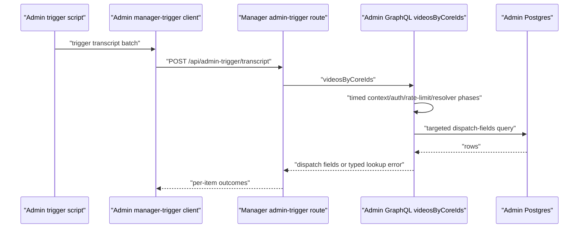

# Fix Manager Admin Lookup Tail Latency

## Summary

Instrument and fix the admin `videosByCoreIds` request path that manager depends on before enrichment dispatch. The plan preserves the existing manager/admin enrichment contract, proves where the latency lives, and resumes production retries only after a small smoke batch no longer returns manager 502s.

---

## Problem Frame

Manager enrichment retries failed with Cloudflare 502s from `POST /api/admin-trigger/transcript`. Debugging showed manager routing is healthy, the authorized path can return 200, and the exact database SQL for `videosByCoreIds` completes quickly in production. The remaining failure mode is tail latency in admin's GraphQL/Prisma/runtime path above SQL, which sometimes reaches the caller timeout envelope and turns into a remote 5xx.

---

## Requirements Trace

- R1, R2: Add production-visible, secret-safe timing breadcrumbs for admin lookup phases.
- R3, R4: Keep the manager/admin per-item outcome contract and missing-field validation behavior unchanged.
- R5: Preserve explicit nested timeout budgets so the inner lookup fails before the outer caller aborts.
- R6: Resume enrichment only after a healthy small-batch smoke.
- R7, R8: Exclude scene embedding recovery and CMS recoupling.

---

## Context & Research

### Existing Patterns

- `apps/admin/src/services/video.service.ts` already has the targeted SQL projection and slow/failure breadcrumbs, but they only measure the service method wall clock.
- `apps/admin/src/app/api/graphql/route.ts` mounts GraphQL Yoga with context creation, Armor plugins, introspection, and rate limiting.
- `apps/admin/src/graphql/context.ts` resolves session/bearer principals and creates per-request loaders/services.
- `apps/admin/src/graphql/plugins/rate-limit.ts` uses Redis-backed `@envelop/rate-limiter` in production.
- `apps/manager/src/lib/admin-video-lookup.ts` calls admin GraphQL with a 10 second inner timeout.
- `apps/admin/src/services/manager-trigger.service.ts` calls manager with a 15 second outer timeout and classifies manager non-2xx responses.

### Institutional Learnings

- `docs/solutions/best-practices/outbound-timeout-shorter-than-caller-budget-20260506.md` requires the inner downstream call budget to be shorter than the upstream caller's timeout.
- `docs/solutions/runtime-errors/railway-logsv2-silences-nextjs-stdout-runtime-20260518.md` says Next.js request-path logs should use `[label] event=name key=value`, not JSON-shaped log lines.
- `docs/solutions/platform/admin-manager-enrichment-trigger-endpoint-20260506.md` documents the existing admin -> manager trigger contract and auth rotation pattern.

### Current Production Evidence

- Unauthenticated manager trigger returns 401, proving routing and service reachability.
- Authorized single-item trigger returned 200 but took about 8.2 seconds and started one transcript job.
- Manager -> admin `videosByCoreIds` probes returned 200 but took several seconds for one to ten core IDs.
- Admin HTTP logs showed `/api/graphql` 499 near 15 seconds.
- Direct prod Postgres `EXPLAIN ANALYZE` for the exact lookup SQL took about 16ms.

---

## Key Technical Decisions

- **Instrument before bypassing GraphQL.** The SQL is already fast, but the slow phase is not proven. Add timing boundaries first so the fix targets the actual bottleneck.
- **Keep the public GraphQL contract stable initially.** Manager already consumes `videosByCoreIds`; changing that contract before evidence would widen recovery risk.
- **Use Railway-visible plain-string logs.** Timing breadcrumbs should be greppable in production and must not include bearer keys, DB URLs, or full core ID lists.
- **Treat REST bypass as a conditional follow-up.** If instrumentation proves GraphQL middleware/runtime overhead dominates and cannot be cheaply removed, add a narrow server-to-server REST lookup rather than pushing batch retries through a fragile GraphQL path.

---

## High-Level Technical Design

This illustrates the intended approach and is directional guidance for review, not implementation specification. The implementing agent should treat it as context, not code to reproduce.

---

## Implementation Units

### U1. Add Admin Lookup Timing Boundaries

**Goal:** Make the slow phase visible without changing lookup behavior.

**Requirements:** R1, R2

**Dependencies:** None

**Files:**

- Modify: `apps/admin/src/app/api/graphql/route.ts`
- Modify: `apps/admin/src/graphql/context.ts`
- Modify: `apps/admin/src/graphql/types/video.ts`
- Modify: `apps/admin/src/services/video.service.ts`
- Test: `apps/admin/src/graphql/context.test.ts`
- Test: `apps/admin/src/services/video.service.test.ts`

**Approach:**

- Add timing breadcrumbs that are emitted only for the `videosByCoreIds` operation/path.
- Capture boundaries around context creation, bearer/session resolution, resolver entry/exit, service entry/exit, transaction start/end, and SQL completion where practical.
- Keep emitted fields bounded: operation name, core ID count, phase durations, result count, status, and error class/code only.
- Use `[videosByCoreIds] event=... key=value` style logs rather than JSON strings.

**Execution note:** Characterization-first: add logger-focused tests for emitted shape and redaction before changing production log behavior.

**Patterns to follow:**

- `docs/solutions/runtime-errors/railway-logsv2-silences-nextjs-stdout-runtime-20260518.md`
- Existing `[videosByCoreIds] event=lookup.slow ...` and `event=lookup.failed ...` helpers in `apps/admin/src/services/video.service.ts`.

**Test scenarios:**

- Happy path: a successful lookup emits timing fields when duration crosses the configured diagnostic threshold.
- Edge case: empty input does not emit noisy timing logs.
- Error path: a service exception emits a failure breadcrumb with error class/code but not core IDs or secrets.
- Redaction: log output does not contain bearer tokens, DB URLs, Railway tokens, or raw authorization headers.

**Verification:**

- Local tests prove the log shape is stable and secret-safe.
- A production probe produces greppable timing logs for `videosByCoreIds`.

### U2. Identify and Fix the Dominant Slow Phase

**Goal:** Remove the phase responsible for multi-second lookup latency.

**Requirements:** R1, R5, R6

**Dependencies:** U1

**Files:**

- Modify: `apps/admin/src/app/api/graphql/route.ts` if GraphQL middleware is the slow phase.
- Modify: `apps/admin/src/graphql/plugins/rate-limit.ts` if rate limiting or Redis access is the slow phase.
- Modify: `apps/admin/src/graphql/context.ts` if auth/session/context construction is the slow phase.
- Modify: `apps/admin/src/services/video.service.ts` if Prisma connection acquisition or transaction setup is the slow phase.
- Test: the matching unit test file for whichever component is changed.

**Approach:**

- Use production timing output from U1 to choose exactly one first fix.
- If rate limiting dominates, exempt the workflow bearer `videosByCoreIds` lookup from unnecessary limiter overhead or make limiter fallback behavior bounded and observable.
- If session resolution dominates for bearer-only calls, avoid unnecessary cookie/session verification work when a valid workflow bearer is present and no session cookie is present.
- If Prisma transaction setup dominates while SQL is fast, evaluate whether `SET LOCAL statement_timeout` plus transaction overhead should be replaced with a lower-overhead query path that still preserves timeout guarantees.
- If GraphQL/Yoga overhead dominates and local fixes are insufficient, defer to U3 rather than stacking incidental patches.

**Execution note:** One change at a time. After each fix, re-run the production-safe lookup probe before choosing another change.

**Patterns to follow:**

- `docs/solutions/best-practices/outbound-timeout-shorter-than-caller-budget-20260506.md`
- `apps/admin/src/graphql/plugins/rate-limit.test.ts` for rate-limit identity behavior.
- `apps/admin/src/graphql/context.test.ts` for workflow bearer resolution behavior.

**Test scenarios:**

- Happy path: workflow bearer lookup still authenticates and returns dispatch fields.
- Error path: downstream Redis/session/Prisma failure is either bounded or classified without leaking secrets.
- Regression: public/admin-session GraphQL behavior remains unchanged outside the manager lookup path.

**Verification:**

- A manager -> admin 10-coreId lookup probe returns comfortably below the inner timeout budget.
- Admin logs show the prior dominant phase no longer dominates lookup wall time.

### U3. Add a Narrow REST Lookup Fallback if GraphQL Remains the Bottleneck

**Goal:** Provide a server-to-server lookup path that bypasses GraphQL request overhead while preserving authorization and response shape.

**Requirements:** R1, R3, R4, R5, R8

**Dependencies:** U1, U2 evidence showing GraphQL overhead remains material

**Files:**

- Create or modify: `apps/admin/src/app/api/manager/videos-by-core-ids/route.ts`
- Modify: `apps/manager/src/lib/admin-video-lookup.ts`
- Modify: `apps/admin/src/config/env.ts` only if a new URL/env is required.
- Modify: `apps/manager/src/config/env.ts` only if manager needs a new explicit endpoint env.
- Test: new admin route test near `apps/admin/src/app/api/manager/videos-by-core-ids/`
- Test: `apps/manager/src/lib/admin-video-lookup.test.ts`

**Approach:**

- Only implement this unit if U1/U2 prove GraphQL cannot meet the latency budget reliably.
- Reuse the same workflow bearer trust boundary as GraphQL; do not introduce a browser-callable or unauthenticated path.
- Reuse `VideoService.getByCoreIds` so the dispatch-field selection semantics stay in one admin service.
- Return a narrow JSON envelope that manager can classify into the same `AdminVideoLookupEnvelope` success/error cases.
- Keep the GraphQL query intact for backward compatibility while manager can prefer the REST path.

**Patterns to follow:**

- Existing app route auth and workflow bearer patterns in `apps/admin/src/app/api/workflows/[...workflow]/route.ts`.
- Existing manager envelope handling in `apps/manager/src/lib/admin-video-lookup.ts`.

**Test scenarios:**

- Happy path: valid workflow bearer returns the same rows as `videosByCoreIds`.
- Auth failure: missing or wrong bearer returns 401/403 without invoking the service.
- Validation failure: more than 100 core IDs or malformed input returns a typed client error.
- Service failure: admin route returns a typed server error manager can classify without producing Cloudflare HTML.
- Manager preference: manager uses the REST lookup when configured and preserves GraphQL fallback only if intentionally supported.

**Verification:**

- REST lookup probe returns well below the timeout budget.
- Manager trigger still reports `VALIDATION_FAILED` for missing mux/subtitle rows rather than treating them as transport failures.

### U4. Preserve Timeout Budget Semantics

**Goal:** Ensure failures surface as typed envelopes before the outer caller aborts.

**Requirements:** R5

**Dependencies:** U2 or U3

**Files:**

- Modify: `apps/manager/src/lib/admin-video-lookup.ts`
- Modify: `apps/admin/src/services/manager-trigger.service.ts` only if outer budget documentation or classification needs adjustment.
- Test: `apps/manager/src/lib/admin-video-lookup.test.ts`
- Test: `apps/admin/src/services/manager-trigger.service.test.ts` if admin classification changes.

**Approach:**

- Keep manager's admin lookup timeout comfortably below admin's outbound manager timeout.
- Ensure timeout, parse, GraphQL, auth, and network failures continue to map to discriminated reasons.
- Avoid simply raising timeouts to mask the latency; that would recreate the retry-storm risk documented in prior solutions.

**Patterns to follow:**

- `docs/solutions/best-practices/outbound-timeout-shorter-than-caller-budget-20260506.md`

**Test scenarios:**

- Timeout path: admin lookup exceeding the inner budget returns `network_error` or the established typed reason before the outer 15 second admin caller timeout.
- Remote 5xx path: admin returns a server error and manager returns a typed JSON response that admin classifies deterministically.
- Parse path: invalid JSON from admin remains retryable parse failure.

**Verification:**

- Tests prove the inner lookup failure wins the race.
- Production logs no longer show `/api/graphql` 499s from manager-triggered lookups during smoke.

### U5. Production Smoke and Retry Resume Plan

**Goal:** Prove the recovery path safely before resuming remaining transcript enrichment.

**Requirements:** R6, R7

**Dependencies:** U2 or U3, U4

**Files:**

- Modify: `docs/plans/2026-05-20-002-fix-manager-admin-lookup-tail-latency-plan.md` only if smoke findings require plan updates.
- Runtime reports under `.tmp/prod-embeds/` during execution, not committed.

**Approach:**

- Run a direct manager -> admin lookup probe for the known failed 10 core IDs.
- Run one 10-item transcript retry batch, excluding items whose latest status is already `STARTED`, `ALREADY_IN_FLIGHT`, `VALIDATION_FAILED`, or `NOT_FOUND`.
- Stop immediately on any `DISPATCH_FAILED remote_5xx`.
- If the smoke is clean, resume paced 10-item retries and write reports under `.tmp/prod-embeds/`.

**Test scenarios:**

- Test expectation: none in code. This is an operational verification unit using production-safe probes and saved reports.

**Verification:**

- First 10-item retry batch after the fix has zero `DISPATCH_FAILED remote_5xx` outcomes.
- Reports are saved under `.tmp/prod-embeds/` and summarized without secrets.

---

## System-Wide Impact

- **Admin GraphQL:** gains targeted timing visibility for a service-to-service lookup path.
- **Manager dispatch:** should stop returning Cloudflare HTML 502 for healthy small batches.
- **Operational recovery:** transcript retries remain paused until the smoke path is healthy.
- **Security:** bearer keys and DB URLs remain server-side and must not appear in logs.

---

## Scope Boundaries

- Full-catalog enrichment dashboard work from `feat-125` remains out of this recovery fix.
- Scene embedding Prisma/OpenRouter backfill failures remain separate.
- Missing mux/subtitle/primary-language data remains a validation/data-quality follow-up.

### Deferred to Follow-Up Work

- Durable admin-side audit trail for full-catalog enrichment runs.
- DB-backed manager idempotency if process-local in-flight tracking becomes insufficient.
- Full-catalog UI for dry-run/preflight/retry orchestration.

---

## Risks & Mitigations

- **Risk:** Instrumentation adds noise or leaks sensitive data.
  - **Mitigation:** Log only counts, durations, status, and error class/code; unit-test redaction.
- **Risk:** The first measured bottleneck is intermittent.
  - **Mitigation:** Use repeated small probes and Railway HTTP duration logs before selecting a code fix.
- **Risk:** A GraphQL bypass creates contract drift.
  - **Mitigation:** Reuse `VideoService.getByCoreIds` and keep tests comparing response semantics.
- **Risk:** Raising timeouts hides the issue.
  - **Mitigation:** Preserve nested timeout budget discipline and prefer reducing latency over widening budgets.

---

## Verification

- Admin unit tests for timing/redaction and whichever slow phase is fixed.
- Manager lookup tests for timeout and error-envelope behavior if manager client changes.
- Production-safe lookup probe for one and ten core IDs.
- Production-safe 10-item transcript retry smoke with zero `remote_5xx` outcomes before broader retries resume.
