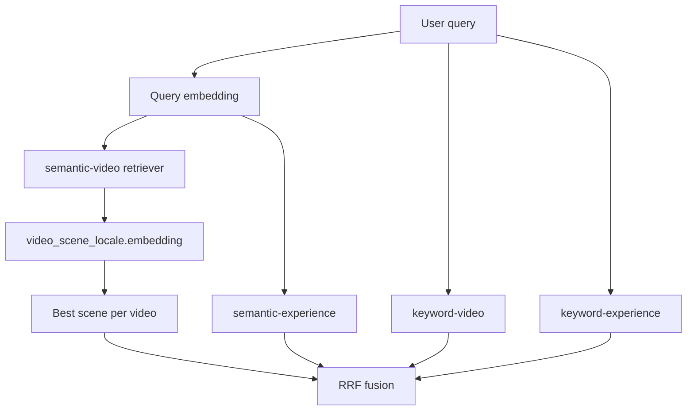
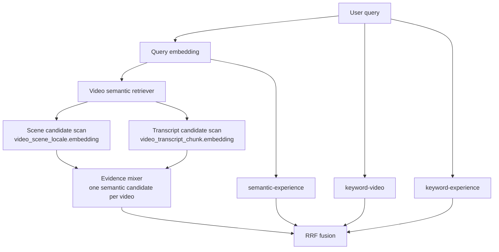

# feat: Mix scene and transcript evidence in video semantic search

## Problem Frame

Admin search currently preserves the R4 migration shape: `semantic-video`
is backed only by `video_scene_locale.embedding`, matching the old CMS
scene-embedding behavior. `video_transcript_chunk.embedding` exists and is
included in corpus fingerprints, but it is not part of live semantic search.

That was correct for migration parity, but it is no longer the product goal.
The video semantic signal should use both visual scene understanding and spoken
transcript evidence as primary sources. The important architecture constraint is
that transcript should **not** become another top-level RRF list. Scene and
transcript evidence should be mixed inside one `semantic-video` retriever, then
the existing RRF stage should continue to fuse one video semantic list with
keyword video, semantic experience, and keyword experience.

## Scope

In scope:

- Change admin's video semantic retriever so `semantic-video` internally queries
  both `video_scene_locale.embedding` and `video_transcript_chunk.embedding`.
- Collapse scene and transcript matches to one ranked semantic candidate per
  video before RRF.
- Preserve the public `/api/search` and GraphQL search response shape unless
  debug-only metadata can be added without changing the normal contract.
- Add targeted tests that prove transcript-only, scene-only, and mixed
  scene+transcript cases behave deterministically.
- Update the relevant plan/solution notes so future work does not reintroduce
  the "transcript as fifth RRF list" framing.

Out of scope:

- Running production embedding backfills or manager enrichment jobs.
- Changing transcript/scene embedding generation workflows.
- Adding personalization, cross-encoder reranking, popularity boosting, or a new
  public search-result field.
- Fixing incomplete scene or transcript coverage in production data.
- Changing apps/cms search.

## Requirements

- **R1. Single RRF input.** `semantic-video` remains one top-level list in
  `HybridSearchService`; do not add `semantic-transcript-video` as a fifth RRF
  list.
- **R2. Dual evidence sources.** The video semantic retriever considers both
  `video_scene_locale.embedding` and `video_transcript_chunk.embedding` for the
  requested locale/language.
- **R3. One row per video.** Scene and transcript candidates are mixed before
  returning from the retriever. RRF receives at most one semantic video item per
  video.
- **R4. Consumer visibility.** Preserve the existing published-only gate:
  `video.deleted_at IS NULL` plus `video_locale.status = 'published'` for the
  requested locale.
- **R5. Contract stability.** Normal search responses still return
  `SearchResult` fields: `type`, `id`, `slug`, `title`, `imageUrl`, `snippet`,
  `startSeconds`, `playbackId`, `score`.
- **R6. Degradation behavior.** Query embedding failure still produces
  `searchMode: "keyword-only"` and skips all semantic retrievers.
- **R7. Dedup compatibility.** Preserve service-internal `embeddingText` for
  video dedup. When both sources match a video, carry the winning evidence
  vector text rather than exposing or averaging vectors.
- **R8. Debug clarity.** Existing debug origin labels continue to show one
  `semantic-video` contribution. If source metadata is added, it must be
  internal/debug-only and must not encourage consumers to branch on it.

## Current Architecture

## Target Architecture

## Existing Patterns To Follow

- `apps/admin/src/services/hybrid-search-retrievers.ts` owns raw SQL retrievers
  and should remain the main implementation point.
- `apps/admin/src/services/hybrid-search.service.ts` owns orchestration and
  list labels. The `semantic-video` label should stay stable.
- `apps/admin/src/services/hybrid-search-fusion.ts` and
  `apps/admin/src/services/video-dedup.ts` already consume `embeddingText` for
  video-only dedup.
- `apps/admin/src/services/search-eval/fingerprint.ts` already fingerprints
  `video_transcript_chunk`, which becomes accurate once transcripts participate
  in search.
- `docs/solutions/platform/admin-hybrid-search-r4-pattern.md` documents the old
  migration-parity decision and should be updated after implementation.
- `docs/solutions/platform/admin-transcript-embeddings-vector-reuse-pattern.md`
  documents the transcript embedding storage/source pattern.
- `docs/solutions/platform/admin-scene-embeddings-indexer-pattern.md` documents
  the scene embedding storage/source pattern.

## Technical Decisions

### Decision 1: Mix inside `searchVideoSemantic`

Keep `searchVideoSemantic` as the public service-level retriever function and
change its internals from "best scene per video" to "best mixed evidence per
video." This preserves orchestration, debug labels, and RRF assumptions.

Rationale: the user intent is one video semantic signal. A separate transcript
list would double-count videos that match both modalities and would make RRF
the modality mixer, which is not the desired architecture.

### Decision 2: Use candidate CTEs plus a mixer

Use two bounded candidate sets:

- scene evidence from `video_scene_locale.embedding`;
- transcript evidence from `video_transcript_chunk.embedding` joined through
  `video_transcript`.

Then union or join those candidate sets into a per-video mixer that chooses one
output row per video. Keep limits bounded before and after mixing so pgvector
work does not expand unboundedly.

Rationale: this keeps each pgvector scan simple and lets tests reason about the
mixing rules independently from RRF.

### Decision 3: Start with conservative score mixing

Use the best individual evidence score as the base score. When the same video
has both scene and transcript evidence in the candidate window, apply at most a
small bounded agreement bonus. The implementation should make the bonus easy to
adjust and tests should assert ordering relationships rather than brittle exact
floating-point formulas.

Rationale: transcript and scene should reinforce each other, but a weak second
source should not overpower a clearly stronger single-source result.

### Decision 4: Snippet/timecode comes from winning evidence

The returned `snippet`, `startSeconds`, `playbackId`, and `embeddingText` should
come from the evidence source that wins the per-video mix. A transcript win uses
chunk text and chunk `startSeconds`; a scene win uses scene description and
scene `startSeconds`. If both sources contribute but scene has the stronger
score, keep the scene snippet; if transcript has the stronger score, keep the
transcript snippet.

Rationale: the result should show the user why that video matched, and
`embeddingText` must stay aligned with the snippet source for dedup.

### Decision 5: No normal response-shape change

Do not add source fields to the normal REST/GraphQL result. If source reporting
is useful for operations, keep it behind existing debug structures or service-
internal metadata.

Rationale: this is an internal ranking improvement, not a consumer contract
expansion.

## Implementation Units

### U1. Add roadmap trace and characterization tests

Files:

- `docs/roadmap/content-discovery/feat-010-semantic-search-api.md`
- `docs/roadmap/content-discovery/feat-086-experience-search-integration.md`
- new or updated roadmap ticket under `docs/roadmap/content-discovery/`
- `apps/admin/src/services/hybrid-search-retrievers.test.ts`

Work:

- Add or update a content-discovery roadmap ticket before implementation so the
  work is traceable under the repo's roadmap rules.
- Mark the ticket `status: "in-progress"` before code work.
- Add characterization coverage for current `searchVideoSemantic` result shape:
  one semantic video row, `embeddingText` present, published locale gate applied,
  and `semantic-video` still expected as the service label.

Test scenarios:

- A scene row with matching locale and published `video_locale` maps to one
  `VideoSemanticResult`.
- A scene row with non-matching locale is excluded.
- A video with `deleted_at` set or unpublished `video_locale.status` is excluded.
- The retriever still returns `embeddingText` for video dedup.

### U2. Add transcript semantic candidates

Files:

- `apps/admin/src/services/hybrid-search-retrievers.ts`
- `apps/admin/src/services/hybrid-search-retrievers.test.ts`
- `apps/admin/prisma/schema.prisma` for reference only; avoid schema changes
  unless implementation uncovers a missing index.

Work:

- Extend the video semantic SQL to read transcript chunk evidence from
  `video_transcript_chunk`.
- Join through `video_transcript` to resolve `video_id`, `video_edition_id`, and
  language.
- Apply locale/language gating consistently with admin's `Language.bcp47` and
  existing `video_locale.locale`.
- Resolve `playbackId` for transcript wins through the same video edition and
  locale-aware dub/mux chain used by scene semantic results.
- Keep transcript chunks with null playback available as semantic matches; they
  should behave like existing scene results whose mux lookup returns null.

Test scenarios:

- A transcript chunk with an embedding and matching language/locale can produce
  a semantic video result when there is no scene embedding.
- A transcript chunk in a different language is excluded.
- A transcript chunk for an unpublished locale is excluded.
- A transcript chunk with null `embedding` is excluded.
- Transcript result snippet uses chunk text and `startSeconds` uses chunk
  `startSeconds`.

### U3. Mix scene and transcript evidence per video

Files:

- `apps/admin/src/services/hybrid-search-retrievers.ts`
- `apps/admin/src/services/hybrid-search-retrievers.test.ts`

Work:

- Build scene and transcript candidate sets with source markers.
- Combine them into one per-video output using deterministic ordering:
  combined score desc, best raw source score desc, source tie-breaker, stable id
  tie-breaker.
- Return one `VideoSemanticResult` per video.
- Preserve `similarity` as the mixed score used for rank ordering. If retaining
  raw source score is useful, keep it internal unless debug plumbing needs it.

Test scenarios:

- Scene-only video returns normally.
- Transcript-only video returns normally.
- A video with both scene and transcript evidence outranks a single-source video
  when raw scores are close enough for the bounded agreement bonus to matter.
- A much stronger single-source video can still outrank a weaker dual-source
  video.
- When scene wins, result snippet/timecode/embeddingText come from the scene.
- When transcript wins, result snippet/timecode/embeddingText come from the
  transcript chunk.
- Tie-breaking is deterministic across repeated calls.

### U4. Preserve orchestration, RRF, debug, and keyword-first behavior

Files:

- `apps/admin/src/services/hybrid-search.service.ts`
- `apps/admin/src/services/hybrid-search.service.test.ts`
- `apps/admin/src/services/hybrid-search.keyword-first.test.ts`
- `apps/admin/src/services/hybrid-search.dilution-cap.test.ts`
- `apps/admin/src/services/hybrid-search.debug.test.ts`
- `apps/admin/src/graphql/types/hybrid-search-debug.ts` only if debug metadata
  changes.

Work:

- Keep `searchVideoSemantic` dispatched under the `semantic-video` label.
- Confirm keyword-first mode still shares the same video semantic retriever.
- Confirm dilution cap logic still sees one semantic-video source.
- If adding debug-only evidence metadata, ensure normal response shape does not
  change and debug descriptions warn labels/metadata are unstable.

Test scenarios:

- Hybrid search still dispatches one `semantic-video` list, not separate scene
  and transcript lists.
- Keyword-first search still calls `searchVideoSemantic` when embeddings are
  available.
- Query embedding failure still skips semantic retrievers and returns
  `searchMode: "keyword-only"`.
- Debug origins include `semantic-video` once for a mixed semantic match.
- Dilution cap behavior is unchanged for semantic-video rows.

### U5. Update search eval and durable docs

Files:

- `apps/admin/src/services/search-eval/fingerprint.ts`
- `apps/admin/src/services/search-eval/fingerprint.test.ts`
- `docs/solutions/platform/admin-hybrid-search-r4-pattern.md`
- optional new solution doc under `docs/solutions/platform/`
- roadmap ticket from U1

Work:

- Keep transcript embedding counts in the search-eval fingerprint and update any
  wording that implied transcript embeddings were unused by live search.
- Update the R4 solution doc's post-cutover note: the selected follow-up is not
  a fifth RRF list; it is mixed video semantic evidence.
- Mark the roadmap ticket `status: "complete"` after code and validation.

Test scenarios:

- Fingerprint tests still assert `video_transcript_chunk` participates in corpus
  drift detection.
- Documentation mentions one mixed `semantic-video` retriever and avoids "fifth
  list" as the recommended architecture.

## Verification Plan

Run PR-focused validation for the admin search scope:

- `pnpm --filter @forge/admin test -- hybrid-search-retrievers.test.ts`
- `pnpm --filter @forge/admin test -- hybrid-search.service.test.ts`
- `pnpm --filter @forge/admin test -- hybrid-search.keyword-first.test.ts`
- `pnpm --filter @forge/admin test -- hybrid-search.dilution-cap.test.ts`
- `pnpm --filter @forge/admin test -- hybrid-search.debug.test.ts`
- `pnpm --filter @forge/admin test -- search-eval/fingerprint.test.ts`

If implementation changes GraphQL debug types or public schema descriptions,
also regenerate and validate the admin schema according to
`apps/admin/AGENTS.md`.

Before merging, run a small search-eval comparison with canary queries that
include spoken-content phrases likely to appear in transcript chunks but not in
scene descriptions. The expected outcome is that transcript-only evidence can
surface a video without adding an extra RRF list.

## Risks And Mitigations

- **Ranking regression from over-boosting dual-source videos.** Use a bounded
  agreement bonus and tests that prove a strong single-source result can still
  win.
- **SQL performance regression from two pgvector scans.** Bound candidate
  windows, inspect existing indexes before implementation, and use EXPLAIN on a
  prod-like dataset before broad rollout.
- **Locale mismatch between transcript language and video locale.** Gate through
  admin's language model deliberately; do not invent an English fallback.
- **Public contract drift.** Keep source metadata out of normal responses.
- **Data readiness confusion.** Product code can support transcript evidence
  before production has full transcript coverage; rollout notes should separate
  code readiness from corpus completeness.

## Open Questions For Implementation

- What exact bounded agreement bonus produces the best search-eval result on
  current canaries?
- Should debug mode expose `semanticEvidenceSource` values such as `scene`,
  `transcript`, or `scene+transcript`, or is that too tempting for consumers to
  depend on?
- Are current pgvector indexes sufficient for transcript candidate scans at full
  production corpus size, or do we need a migration for partial HNSW indexes by
  language/locale?
