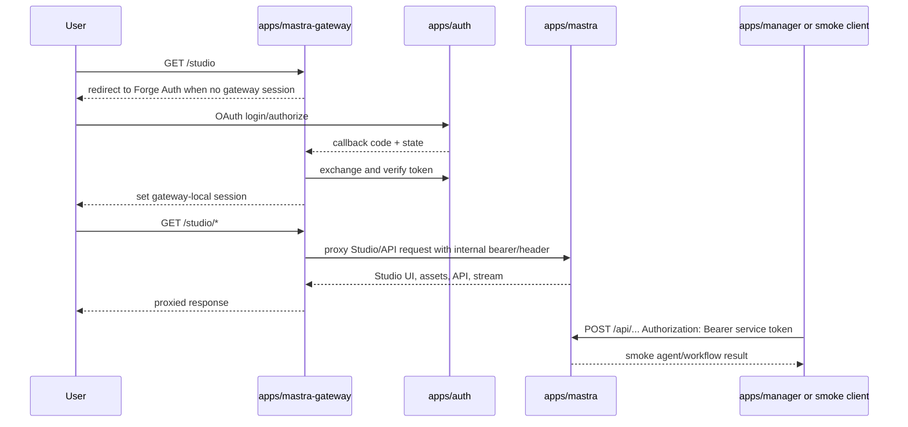

# feat: Add Mastra Railway runtime

## Overview

Add a self-hosted Mastra runtime on Railway with a Forge-authenticated Studio
entry point and a service-bearer contract for server-side app calls. The first
slice proves deployment, auth boundaries, Studio reachability, and one
smoke-test agent/workflow. It deliberately does not migrate Manager subtitle
workflows yet.

The implementation should use two deployable services:

- `apps/mastra`: internal Mastra Server runtime, built with Studio assets and
  protected at the API boundary by service-bearer middleware.
- `apps/mastra-gateway`: public Next.js auth gateway that uses Forge Auth as an
  OAuth relying client, creates a gateway-local session, and proxies authorized
  Studio/browser traffic to the internal Mastra service.

## Problem Frame

Forge needs a shared agent/workflow runtime that Manager and future apps can
call for media operations like subtitle configuration, translation, retiming,
and future agent-driven workflows. Mastra is the candidate runtime, but the
first deployment must preserve Forge-owned authentication and avoid relying on
Mastra native production SSO/RBAC, which Mastra documents as Enterprise Edition
for production third-party providers (see origin:
`docs/brainstorms/2026-05-22-mastra-railway-workflow-runtime-requirements.md`).

Mastra Studio is the observability/control UI. Mastra Server runs the agents and
workflows. Manager should eventually call Mastra Server through a stable API,
while humans use Studio only for advanced inspection, debugging, and smoke
testing.

## Requirements Trace

- R1. New Railway-deployable Mastra service runs the agent/workflow runtime.
- R2. Studio is reachable only through an authenticated internal entry point.
- R3. Human Studio auth and app-to-server auth are separate concerns.
- R4. Runtime includes one smoke-test agent or workflow.
- R5. Existing Forge Auth app is the human identity provider for Studio access.
- R6. App-to-Mastra calls use service-bearer auth in V1.
- R7. Forge Auth remains the identity/token authority; the Mastra gateway owns
  Studio-specific access records and roles.
- R8. V1 does not depend on Mastra native production SSO/RBAC.
- R8a. Gateway access is controlled by gateway-owned Mastra Studio access
  records that operators can toggle without changing Mastra-native auth.
- R8b. Gateway exposes `/admin` so gateway admins can approve/revoke access
  requests and assign admin/editor levels; editors can access Studio but cannot
  manage access.
- R9. Manager remains the product UI for subtitle/enrichment configuration.
- R10. Future Manager integration will call stable Mastra workflow/agent APIs.
- R11. Studio is the advanced surface for traces, prompts, tool calls, failures,
  and smoke tests.
- R12. Browser users cannot bypass the Forge-authenticated Studio entry point.
- R13. Logs must not expose raw tokens, cookies, secrets, model keys, or
  unnecessary PII.
- R14. Railway readiness includes health, env, build/start commands, and smoke
  verification.

## Scope Boundaries

- In scope: `apps/mastra`, `apps/mastra-gateway`, Auth first-party registration
  for the gateway, gateway-owned Studio access records, gateway `/admin`
  access-request and user-management UI,
  service-bearer validation, Railway configs, healthchecks, smoke
  agent/workflow, proxy smoke tests, and deployment docs.
- Out of scope: migrating Manager subtitle workflows into Mastra.
- Out of scope: making Mastra Studio the normal subtitle configuration UI.
- Out of scope: Mastra native production SSO/RBAC and Mastra EE licensing work.
- Out of scope: user-scoped delegated tokens for Manager-to-Mastra calls.
- Out of scope: free-form agent authoring for Manager users.

### Deferred to Separate Tasks

- Manager subtitle workflow migration: follow-up ticket after runtime and auth
  boundaries are proven.
- User-scoped Mastra tokens: future iteration after service-bearer V1.
- Fine-grained Studio RBAC inside Mastra: future licensing/product decision if
  the gateway-level admin allowlist is not enough.

## Context & Research

### Relevant Code and Patterns

- `docs/solutions/platform/adding-new-apps.md`: new apps under `apps/*` need
  no root workspace changes beyond package files; add package docs, env
  validation, Railway config, and standard scripts.
- `apps/auth/src/domain/apps.ts` and `apps/auth/src/domain/scopes.ts`: current
  first-party OAuth registration and scope seed patterns for Admin and Manager.
- `apps/admin/src/auth/oauth-client.ts` and
  `apps/manager/src/lib/oauth-client.ts`: OAuth relying-client URL building,
  token exchange, JWKS verification, and scope validation patterns.
- `apps/manager/src/app/api/auth/*` and
  `apps/manager/src/lib/manager-session-cookie.ts`: app-local session pattern
  after Forge Auth callback.
- `apps/manager/src/lib/auth.ts`,
  `apps/admin/src/auth/workflow-bearer.ts`, and
  `apps/admin/src/auth/manager-bearer.ts`: constant-time service bearer
  validation patterns.
- `apps/auth/railway.toml` and `apps/manager/railway.toml`: Railway service
  build/start/healthcheck shape. Remember that app-local `railway.toml` only
  applies when Railway Config-as-code Path is set.

### Institutional Learnings

- `docs/solutions/platform/new-app-ci-and-deployment-patterns.md`: env
  validation can break CI if required runtime secrets are validated at build
  time; runtime clients should initialize lazily.
- `docs/solutions/deployment/nextjs-pnpm-monorepo-railway-standalone.md`:
  Railway monorepo services need explicit start commands and should not rely on
  `[deploy.env]` for critical runtime env.
- `docs/solutions/deployment/railway-dashboard-override-shadows-railway-toml-20260429.md`:
  dashboard config can shadow committed Railway config; verify Config-as-code
  Path and deployment records.
- `docs/solutions/auth/admin-sso-uses-oauth-local-session-not-shared-cookies.md`:
  first-party apps should use OAuth with app-local sessions, not shared
  cross-domain cookies.

### External References

- Mastra Building docs: `https://mastra.ai/docs/deployment/building-mastra`
  describe `mastra build`, `.mastra/output/index.mjs`, and the Hono server
  output.
- Mastra Monorepo docs: `https://mastra.ai/docs/deployment/monorepo` state
  monorepos are supported with pnpm workspaces/Turborepo and one root lockfile.
- Mastra Studio deployment docs:
  `https://mastra.ai/docs/studio/deployment` describe Studio as a React SPA
  that connects to Mastra Server, and `mastra build --studio` plus
  `MASTRA_STUDIO_PATH` for serving Studio alongside the API.
- Mastra Server middleware docs:
  `https://mastra.ai/docs/server/middleware` show Hono middleware for
  authentication and path-scoped `/api/*` checks.
- Mastra Auth overview: `https://mastra.ai/docs/server/auth` says configured
  auth secures both Studio UI and API routes, and that no auth leaves routes and
  Studio publicly accessible.
- Mastra Studio Auth docs: `https://mastra.ai/docs/studio/auth` document the EE
  licensing note for production third-party provider Studio Auth.

## Key Technical Decisions

- **Use two services for V1.** A small Next.js gateway handles Forge Auth and
  browser sessions. The Mastra service focuses on runtime, Studio assets, and
  service-bearer API enforcement.
- **Serve Studio alongside Mastra Server first.** Use `mastra build --studio`
  and `MASTRA_STUDIO_PATH` inside `apps/mastra` so Studio and Server share one
  internal service. This follows Mastra docs and avoids a third static app.
- **Do not use Mastra native Better Auth SSO for V1.** The gateway authenticates
  humans through Forge Auth. Mastra's native auth/RBAC remains off or limited to
  local/simple auth until licensing is resolved.
- **Protect Mastra APIs with a receiver-side bearer allowlist.** Mirror the
  existing CSV allowlist pattern from Admin/Manager service auth. This protects
  direct API calls even if the internal service becomes reachable.
- **Proxy Studio through the gateway as a compatibility spike.** The first
  implementation must prove HTML, assets, dynamic Studio config, API prefix,
  streaming, and any websocket/upgrade paths that Studio uses.
- **Add a dedicated Auth first-party client plus gateway-owned access records.**
  Do not reuse Manager or Admin OAuth client IDs. Auth handles login/scopes;
  the Mastra gateway handles its own operator-toggleable Studio access list.
- **Use gateway roles for gateway behavior.** `admin` can access Studio and the
  `/admin` management surface; `editor` can access Studio only. These roles are
  gateway-level roles stored by `apps/mastra-gateway`, not
  Mastra-native RBAC roles.

## Open Questions

### Resolved During Planning

- Should the first implementation use service bearer for Manager/app calls?
  Yes. V1 uses service bearer, not user-scoped delegated tokens.
- Should Manager subtitle workflows move in this slice? No. The first slice is
  runtime, Studio, auth, and smoke only.
- Should Studio be the normal subtitle configuration surface? No. Manager
  remains the product UI.
- Should Mastra Studio be mounted directly inside Next.js? No documented native
  route/component mount exists. V1 uses an auth gateway proxy.
- Where should the "is this person allowed to administer Studio?" toggle live?
  In `apps/mastra-gateway`, not Auth and not `apps/admin`. Auth proves
  identity; the gateway owns its own Studio access list.
- What are the V1 gateway permission levels? `admin` and `editor`. Admins manage
  access requests and users under `/admin`; editors can use Studio.

### Deferred to Implementation

- Exact Mastra package versions and package names: choose current stable package
  names during implementation and pin them through `pnpm-lock.yaml`.
- Exact Studio proxy path behavior: prove with local/dev smoke; if subpath
  proxying fails, prefer host-root proxying on the gateway service before
  redesigning the architecture.
- Exact Railway direct-access control: choose based on available Railway private
  networking/domain controls in the target project, but keep Mastra-side bearer
  validation regardless.
- Exact smoke endpoint shape: keep it minimal and stable enough for deployment
  verification, but adjust to Mastra's current generated API surface.

## Output Structure

```text
apps/
  mastra/
    AGENTS.md
    CLAUDE.md
    package.json
    railway.toml
    tsconfig.json
    src/
      config/
      mastra/
        agents/
        workflows/
        index.ts
      server/
      test/
  mastra-gateway/
    AGENTS.md
    CLAUDE.md
    package.json
    railway.toml
    tsconfig.json
    src/
      app/
        api/
          auth/
          health/
          studio/
      config/
      lib/
```

This tree is the intended output shape, not a hard implementation constraint.
The implementer may adjust names if Mastra's current scaffolder strongly
prefers a different layout.

## High-Level Technical Design

> _This illustrates the intended approach and is directional guidance for
> review, not implementation specification. The implementing agent should treat
> it as context, not code to reproduce._



## Implementation Units

- [ ] **Unit 1: Scaffold the Mastra runtime app**

**Goal:** Create `apps/mastra` as a monorepo package that can build a Mastra
Server bundle with Studio assets and expose a health/smoke surface.

**Requirements:** R1, R2, R4, R14

**Dependencies:** None

**Files:**

- Create: `apps/mastra/package.json`
- Create: `apps/mastra/tsconfig.json`
- Create: `apps/mastra/AGENTS.md`
- Create: `apps/mastra/CLAUDE.md`
- Create: `apps/mastra/.env.example`
- Create: `apps/mastra/src/config/env.ts`
- Create: `apps/mastra/src/mastra/index.ts`
- Create: `apps/mastra/src/mastra/agents/smoke-agent.ts`
- Create: `apps/mastra/src/mastra/workflows/smoke-workflow.ts` if a workflow
  smoke gives better coverage than an agent alone.
- Create: `apps/mastra/src/server/health.ts` or equivalent custom route module
  if Mastra custom routes are used for health.
- Test: `apps/mastra/src/config/env.test.ts`
- Test: `apps/mastra/src/mastra/agents/smoke-agent.test.ts` or equivalent
  focused smoke behavior test.

**Approach:**

- Use Mastra's expected `src/mastra/index.ts` layout unless current docs or the
  scaffolder indicate a better path.
- Add package scripts for `dev`, `build`, `start`, `lint`, `typecheck`, and
  `test`.
- Configure the build to include Studio assets with `mastra build --studio` and
  start with `MASTRA_STUDIO_PATH=.mastra/output/studio node
.mastra/output/index.mjs`.
- Keep the smoke agent deterministic and cheap. It should prove request routing
  and execution without needing real Forge data or expensive model calls.
- Use env validation that skips CI-only runtime secrets but fails clearly when a
  production runtime is missing required bearer/model settings.

**Patterns to follow:**

- `docs/solutions/platform/adding-new-apps.md`
- `apps/auth/package.json`
- `apps/manager/src/config/env.ts`
- Mastra Building and Monorepo deployment docs.

**Test scenarios:**

- Happy path: env validation accepts local/test defaults needed for a no-secret
  smoke run.
- Error path: production runtime without required service bearer/model settings
  fails with a clear error outside build phase.
- Happy path: smoke agent/workflow returns a deterministic response for a known
  input.

**Verification:**

- `apps/mastra` can build the Mastra output and has a local health/smoke path an
  implementer can call during rollout.

- [ ] **Unit 2: Add Mastra service-bearer enforcement**

**Goal:** Require a valid service bearer for built-in Mastra API routes while
allowing explicitly public health checks.

**Requirements:** R3, R6, R7, R12, R13, R14

**Dependencies:** Unit 1

**Files:**

- Modify: `apps/mastra/src/config/env.ts`
- Create: `apps/mastra/src/server/service-bearer.ts`
- Modify: `apps/mastra/src/mastra/index.ts`
- Test: `apps/mastra/src/server/service-bearer.test.ts`

**Approach:**

- Add a receiver-side allowlist env such as `MASTRA_SERVICE_API_KEYS`, parsed as
  CSV.
- Validate `Authorization: Bearer <token>` with constant-time comparison across
  same-length entries.
- Apply Mastra server middleware to `/api/*` so built-in agent/workflow routes
  reject missing or wrong bearers.
- Keep `/health` or equivalent readiness route unauthenticated, narrow, and
  non-sensitive.
- Do not log presented tokens. Logs should include only outcome, route family,
  and safe request metadata.

**Patterns to follow:**

- `apps/admin/src/auth/workflow-bearer.ts`
- `apps/admin/src/auth/manager-bearer.ts`
- `apps/manager/src/lib/auth.ts`
- Mastra Server middleware docs.

**Test scenarios:**

- Happy path: correct bearer matching one allowlist entry authenticates.
- Error path: missing header rejects.
- Error path: malformed `Authorization` header rejects.
- Error path: wrong token rejects.
- Edge case: empty allowlist rejects all bearer values.
- Edge case: length-mismatched or non-ASCII allowlist entries do not throw.
- Integration: health route remains available without bearer and does not expose
  runtime secrets.

**Verification:**

- Built-in Mastra API routes require service bearer, and health remains a safe
  deployment check.

- [ ] **Unit 3: Register the Studio gateway and local access records**

**Goal:** Add a dedicated first-party Auth app/scope for the public Studio
gateway, plus gateway-owned Mastra Studio access records with `admin` and
`editor` levels.

**Requirements:** R5, R7, R8

**Dependencies:** None

**Files:**

- Modify: `apps/auth/src/domain/scopes.ts`
- Modify: `apps/auth/src/domain/apps.ts`
- Modify: `apps/auth/src/domain/apps.test.ts`
- Modify: `apps/auth/src/services/app-registry.service.test.ts` if scope or
  environment policy coverage needs updating.
- Modify: `apps/auth/src/scripts/seed-first-party-apps.ts` only if the seed
  routine needs explicit coverage for the new app.
- Create: `apps/mastra-gateway/prisma/schema.prisma`
- Create: `apps/mastra-gateway/prisma/migrations/<next>_mastra_studio_access/migration.sql`
- Create: `apps/mastra-gateway/src/db/client.ts`
- Create: `apps/mastra-gateway/src/services/studio-access.service.ts`
- Create: `apps/mastra-gateway/src/services/studio-access.service.test.ts`

**Approach:**

- Add a dedicated scope such as `mastra-studio:access`.
- Add `MASTRA_STUDIO_APP_SEED` with local, preview, staging, and production
  redirect/logout/origin values for the gateway app.
- Keep Auth's first-party app registration simple: it identifies the gateway as
  a relying client, but it should not be the product-admin allowlist.
- Add gateway-owned persistence for Studio access records. V1 states should
  support pending/requested, approved, and revoked access; V1 roles should be
  `admin` and `editor`.
- Add a gateway-local validation service that accepts the verified Auth
  subject/email/name shape and returns whether the user is allowed to access
  Studio, plus the gateway role.
- Add gateway-local management service operations for listing pending requests,
  approving/revoking users, and changing a user's gateway role. These should be
  callable only by a validated gateway admin.
- Include a bootstrap path for the first gateway admin, such as a seed script or
  env-controlled bootstrap email list, so `/admin` is not unreachable on first
  deploy.
- Do not add Mastra-native provider config here; Auth remains the Forge identity
  source, and the gateway is the OAuth relying client.

**Execution note:** Implement the scope/app-seed tests before changing the
seed data.

**Patterns to follow:**

- `apps/auth/src/domain/apps.ts`
- Existing Admin and Manager first-party app seeds.

**Test scenarios:**

- Happy path: first-party seed list includes the Studio gateway app and all
  expected environments.
- Happy path: gateway environments have exact redirect/logout URLs and allowed
  origins.
- Happy path: a gateway-owned Mastra Studio access record allows a signed-in
  Auth user through the validation contract with either `admin` or `editor`
  role.
- Error path: a signed-in Auth user without gateway-owned Studio access is denied
  by the validation contract.
- Error path: revoking the gateway-owned Studio grant prevents new gateway access.
- Happy path: gateway admin can approve a pending request as `editor`.
- Happy path: gateway admin can promote an editor to admin or demote an admin
  to editor.
- Error path: gateway editor cannot list, approve, revoke, or modify access
  records.
- Error path: unknown scope validation still fails.
- Integration: seed shape remains valid for all first-party apps.

**Verification:**

- Auth can seed/register the Studio gateway without changing Admin or Manager
  OAuth behavior.

- [ ] **Unit 4: Build the Next.js Studio gateway auth flow**

**Goal:** Create a public `apps/mastra-gateway` Next.js app that authenticates
humans through Forge Auth and issues a gateway-local session.

**Requirements:** R2, R3, R5, R8, R8a, R8b, R12, R13

**Dependencies:** Unit 3

**Files:**

- Create: `apps/mastra-gateway/package.json`
- Create: `apps/mastra-gateway/tsconfig.json`
- Create: `apps/mastra-gateway/AGENTS.md`
- Create: `apps/mastra-gateway/CLAUDE.md`
- Create: `apps/mastra-gateway/.env.example`
- Create: `apps/mastra-gateway/src/config/env.ts`
- Create: `apps/mastra-gateway/src/lib/oauth-client.ts`
- Create: `apps/mastra-gateway/src/lib/gateway-session.ts`
- Create: `apps/mastra-gateway/src/app/api/auth/login/route.ts`
- Create: `apps/mastra-gateway/src/app/api/auth/callback/route.ts`
- Create: `apps/mastra-gateway/src/app/api/auth/logout/route.ts`
- Create: `apps/mastra-gateway/src/app/api/health/route.ts`
- Test: `apps/mastra-gateway/src/lib/oauth-client.test.ts`
- Test: `apps/mastra-gateway/src/lib/gateway-session.test.ts`
- Test: `apps/mastra-gateway/src/app/api/auth/login/route.test.ts`
- Test: `apps/mastra-gateway/src/app/api/auth/callback/route.test.ts`

**Approach:**

- Mirror Manager's OAuth relying-client flow: state, PKCE, exact redirect URI,
  token exchange, JWKS verification, required gateway access scope, and
  app-local signed session cookie.
- Treat successful Forge sign-in without gateway access validation as forbidden,
  not authorized. The gateway session should only be minted after the Auth token
  is verified and gateway-local access records confirm the user has Mastra
  Studio access. Store the gateway role in the signed session so `/studio` and
  `/admin` can enforce different capabilities, then revalidate on session
  renewal or sensitive admin actions.
- Use gateway-specific env names:
  `AUTH_MASTRA_STUDIO_CLIENT_ID`, `AUTH_MASTRA_STUDIO_CLIENT_SECRET`,
  `MASTRA_GATEWAY_BASE_URL`, `MASTRA_GATEWAY_SESSION_SECRET`,
  `MASTRA_INTERNAL_BASE_URL`, and a separate internal bearer for proxying to the
  Mastra service.
- Keep the gateway health route narrow and unauthenticated.
- Make the root or `/studio` path redirect to login when no valid gateway
  session exists.

**Execution note:** Start with tests for invalid callback state and missing
gateway scope; those are the highest-value auth regressions.

**Patterns to follow:**

- `apps/manager/src/lib/oauth-client.ts`
- `apps/manager/src/app/api/auth/callback/route.ts`
- `apps/admin/src/auth/auth-session.ts`
- `docs/solutions/auth/admin-sso-uses-oauth-local-session-not-shared-cookies.md`

**Test scenarios:**

- Happy path: login route redirects to Auth authorize URL with gateway client
  id, redirect URI, gateway scope, state, and PKCE challenge.
- Error path: callback with missing/invalid state clears gateway session and
  does not proxy onward.
- Error path: valid Auth token but gateway access records deny Mastra Studio
  access.
- Error path: previously signed-in user whose gateway access was revoked cannot
  renew or create a new gateway session.
- Happy path: gateway session carries `admin` or `editor` role from gateway
  access validation.
- Error path: token exchange or JWKS verification failure redirects to login
  with a safe error.
- Happy path: valid callback sets a gateway-local session and redirects to
  `/studio`.
- Security: callback return destination cannot be a cross-origin URL.

**Verification:**

- Gateway can authenticate an authorized Forge user, deny a signed-in but
  ungranted Forge user through gateway-local access validation, and avoid
  trusting Auth-domain cookies or any Mastra-native login state.

- [ ] **Unit 4b: Build the gateway `/admin` access management UI**

**Goal:** Provide a simple gateway-local admin dashboard for approving access
requests and changing Mastra Studio gateway permission levels.

**Requirements:** R8b, R12, R13

**Dependencies:** Unit 3, Unit 4

**Files:**

- Create: `apps/mastra-gateway/src/app/admin/page.tsx`
- Create: `apps/mastra-gateway/src/app/admin/actions.ts` or route handlers for
  access-management mutations.
- Create: `apps/mastra-gateway/src/lib/admin-access-client.ts`
- Create: `apps/mastra-gateway/src/components/access-request-table.tsx` if a
  component split is useful.
- Test: `apps/mastra-gateway/src/lib/admin-access-client.test.ts`
- Test: `apps/mastra-gateway/src/app/admin/page.test.tsx` or a focused route/
  action test matching the app's test conventions.

**Approach:**

- Keep the UI intentionally small: pending requests, current users, role select
  (`admin`/`editor`), approve, revoke, and save role change.
- Gate the whole `/admin` route on a gateway session whose Admin-validated role
  is `admin`.
- Let a signed-in but unapproved user request access from the gateway denied
  state if this can be done without bloating the first slice. If not, provide a
  simple pending-request creation endpoint/page and document manual bootstrap
  for the first admin.
- All mutations should use the gateway-owned access service and database, not
  `apps/admin`.
- Avoid presenting this as Mastra RBAC. It is gateway access control only.

**Patterns to follow:**

- `apps/manager/src/features/agents/automation-list.tsx` for compact internal
  dashboard tables/actions.
- `apps/manager/src/features/shell/manager-shell.tsx` for internal-tool shell
  ergonomics if a shell is needed.
- Existing Server Action or route mutation patterns in `apps/manager/src/app`.

**Test scenarios:**

- Happy path: gateway admin sees pending requests and current users.
- Happy path: gateway admin approves a pending user as editor.
- Happy path: gateway admin changes an editor to admin.
- Error path: gateway editor receives forbidden/redirect when opening `/admin`.
- Error path: unauthenticated user cannot open `/admin`.
- Error path: failed access-management call shows a safe error without leaking
  service bearer or session details.

**Verification:**

- Gateway admin can manage Studio access from `/admin`; editor can use Studio
  but cannot manage access.

- [ ] **Unit 5: Proxy Studio and runtime calls through the gateway**

**Goal:** Route authenticated browser traffic from the gateway to the internal
Mastra service while preserving Studio assets, dynamic config, API calls, and
streaming responses.

**Requirements:** R2, R3, R11, R12, R13

**Dependencies:** Unit 2, Unit 4

**Files:**

- Create: `apps/mastra-gateway/src/lib/proxy/mastra-proxy.ts`
- Create: `apps/mastra-gateway/src/app/studio/[[...path]]/route.ts` or the
  route shape selected during implementation.
- Create: `apps/mastra-gateway/src/app/api/studio/[[...path]]/route.ts` if API
  prefix separation is needed.
- Test: `apps/mastra-gateway/src/lib/proxy/mastra-proxy.test.ts`
- Test: `apps/mastra-gateway/src/app/studio/route.test.ts` or equivalent route
  tests for the chosen catch-all paths.

**Approach:**

- Begin with root-hosted or `/studio` proxying based on the simplest path that
  keeps Mastra Studio assets working. If using a subpath, set and verify
  `MASTRA_STUDIO_BASE_PATH=/studio`.
- Forward only the request headers required by Studio/API behavior. Strip
  browser cookies before sending upstream unless a header is explicitly needed.
- Add the internal Mastra service bearer when proxying to Mastra so upstream
  `/api/*` calls satisfy Unit 2.
- Preserve response status, content type, cache headers where appropriate,
  redirects, and stream bodies.
- Treat websocket/upgrade support as an implementation-time compatibility
  check. If Studio requires it and Next route handlers cannot support it
  cleanly, document the limitation and switch to a gateway/server shape that can
  proxy upgrades.

**Patterns to follow:**

- `apps/admin/src/proxy.ts` if still present and relevant.
- Existing Next route handler tests in `apps/manager/src/app/api/**`.
- Mastra Studio deployment docs for `MASTRA_STUDIO_BASE_PATH` and dynamic
  configuration.

**Test scenarios:**

- Happy path: authenticated request for Studio HTML proxies to Mastra and
  returns upstream HTML.
- Happy path: authenticated request for a static asset proxies without adding
  user cookies upstream.
- Happy path: authenticated API request proxies with the internal service bearer.
- Error path: unauthenticated Studio request redirects or returns 401 without
  contacting Mastra.
- Error path: signed-in user with pending/no access cannot reach Studio.
- Error path: upstream 401/500 propagates safely without leaking bearer values.
- Integration: streaming response from a smoke agent endpoint is not buffered
  into an unusable response.

**Verification:**

- A locally authenticated user can load the Studio shell through the gateway and
  run or inspect the smoke target through proxied API calls.

- [ ] **Unit 6: Add scripted smoke client and future Manager integration seam**

**Goal:** Prove non-browser app-to-Mastra service-bearer access and document the
future Manager boundary without migrating Manager workflows.

**Requirements:** R6, R9, R10, R14

**Dependencies:** Unit 2

**Files:**

- Create: `apps/mastra/src/scripts/smoke-service-call.ts` or a repo-appropriate
  smoke script location.
- Create: `apps/mastra/src/client/service-client.ts` if a small internal client
  wrapper is useful for future Manager use.
- Test: `apps/mastra/src/client/service-client.test.ts` if a client wrapper is
  added.
- Modify: `apps/manager/CLAUDE.md` only to note the future integration boundary
  if the plan needs an explicit breadcrumb.
- Do not modify Manager production workflow code in this unit.

**Approach:**

- Add a script or tiny client that calls the deployed/local Mastra smoke
  endpoint with `Authorization: Bearer <token>`.
- Keep the client contract minimal: base URL, bearer, timeout, and safe error
  envelope.
- Document future Manager use as "Manager calls Mastra stable workflow API from
  server-side code"; do not wire real subtitle jobs yet.

**Patterns to follow:**

- `apps/manager/src/lib/admin-embed-trigger.ts`
- `apps/manager/src/lib/admin-trigger-auth.ts`
- `apps/admin/src/services/manager-trigger.service.ts`

**Test scenarios:**

- Happy path: client sends bearer and parses a successful smoke response.
- Error path: missing config returns a typed local configuration error.
- Error path: upstream 401 is classified as authentication failure without
  logging the bearer.
- Error path: network timeout is retryable/diagnostic according to the chosen
  wrapper shape.

**Verification:**

- A non-browser caller can run the smoke target through the service-bearer path
  without a Studio session.

- [ ] **Unit 7: Add Railway deployment config and operational docs**

**Goal:** Make both services deployable and operable on Railway with explicit
env matrices, healthchecks, and smoke verification.

**Requirements:** R1, R2, R12, R13, R14

**Dependencies:** Units 1-6

**Files:**

- Create: `apps/mastra/railway.toml`
- Create: `apps/mastra-gateway/railway.toml`
- Modify: `docs/roadmap/platform/feat-129-mastra-railway-workflow-runtime.md`
  if implementation discovers a scope correction.
- Create: `docs/operations/mastra-railway-runtime.md` or an equivalent
  deployment runbook location already used by the repo.
- Modify: `docs/roadmap/README.md` if generated/maintained manually after
  status changes.
- Test expectation: none for pure deployment docs/config, but the smoke paths
  from prior units must be runnable after deployment.

**Approach:**

- Use app-local `railway.toml` files with comments that Config-as-code Path must
  be set to the app-local file.
- For `apps/mastra`, build with root pnpm install and package-filtered Mastra
  build. Start the generated `.mastra/output/index.mjs` with
  `MASTRA_STUDIO_PATH` set.
- For `apps/mastra-gateway`, follow the existing Next standalone deployment
  pattern if self-contained. If the gateway reads no external filesystem data,
  standalone is acceptable.
- Document required env for both services and which side owns each secret:
  gateway OAuth client/session, internal Mastra base URL, gateway-to-Mastra
  bearer, Mastra accepted service keys, model keys, and health/smoke settings.
- Document direct-access controls: no public Mastra domain if possible; if a
  public Railway domain exists, Mastra-side bearer still rejects API calls and
  Studio access must be treated as protected by gateway-only routing.

**Patterns to follow:**

- `apps/auth/railway.toml`
- `apps/manager/railway.toml`
- `docs/solutions/platform/adding-new-apps.md`
- `docs/solutions/deployment/railway-dashboard-override-shadows-railway-toml-20260429.md`

**Test scenarios:**

- Test expectation: none -- this unit is deployment config and docs. Runtime
  behavior is verified through the health and smoke checks defined in Units 1,
  2, 5, and 6.

**Verification:**

- Railway service configs are documented, healthchecks exist, and the runbook
  explains how to prove authenticated Studio access plus service-bearer smoke.

## System-Wide Impact

- **Interaction graph:** Public browser traffic reaches `apps/mastra-gateway`;
  gateway redirects through `apps/auth`; authenticated Studio traffic is proxied
  to `apps/mastra`; gateway `/admin` traffic manages gateway-owned access
  records; server-side callers use bearer auth directly against `apps/mastra`.
- **Error propagation:** Gateway auth failures should redirect or return 401
  without contacting Mastra. Upstream Mastra errors should propagate with safe
  status/messages and no bearer/session leakage.
- **State lifecycle risks:** Gateway sessions are local to the gateway. Auth app
  remains the identity authority. The gateway owns Studio access requests and roles.
  Mastra V1 has no Forge user-scoped memory isolation requirement because
  app-to-server calls are service-scoped.
- **API surface parity:** Mastra API is a new service boundary. Manager is not
  changed in V1 except optional documentation/client smoke; real subtitle
  migration must define a stable workflow API later.
- **Integration coverage:** Local and deployed smoke must prove both human
  Studio access through the gateway and direct service-bearer runtime access.
- **Unchanged invariants:** Admin, Manager, web, mobile, and TV GraphQL data
  flows are unchanged. Manager remains the operator UI for enrichment work.

## Risks & Dependencies

| Risk                                                                                | Mitigation                                                                                                                   |
| ----------------------------------------------------------------------------------- | ---------------------------------------------------------------------------------------------------------------------------- |
| Mastra Studio proxying may break on assets, dynamic config, streaming, or upgrades. | Treat Unit 5 as a compatibility spike with explicit local smoke; prefer root-hosted proxying before redesign.                |
| Direct Railway access to `apps/mastra` could bypass gateway Studio auth.            | Use Railway private networking/no public domain where possible, and keep Mastra-side bearer enforcement for APIs regardless. |
| Native Mastra Studio Auth licensing changes the tradeoff.                           | Do not rely on native production SSO/RBAC in V1; document the licensing assumption and keep the gateway-owned auth boundary. |
| Build-time env validation could fail CI without runtime secrets.                    | Follow existing `skipValidation` and production-runtime guard patterns from Manager/Auth.                                    |
| Service bearer may be over-broad for future Manager workflows.                      | Keep it V1-only and document user-scoped delegated tokens as a follow-up when real workflows migrate.                        |
| Logs could leak bearer/session data through proxy diagnostics.                      | Add explicit safe logging rules and tests for error bodies where practical.                                                  |

## Documentation / Operational Notes

- Add app-local `AGENTS.md` and `CLAUDE.md` files for both new apps.
- Add or update a deployment runbook with Railway Config-as-code Path, env
  matrices, healthcheck URLs, and smoke steps.
- Keep `docs/roadmap/platform/feat-129-mastra-railway-workflow-runtime.md`
  current as implementation discovers exact service names and verification
  commands.
- After implementation and verification, run `ce:review` and then
  `ce:compound` to capture Mastra/Railway deployment learnings.

## Sources & References

- Origin document:
  `docs/brainstorms/2026-05-22-mastra-railway-workflow-runtime-requirements.md`
- Roadmap ticket: `docs/roadmap/platform/feat-129-mastra-railway-workflow-runtime.md`
- Auth platform ticket: `docs/roadmap/platform/feat-121-jesus-film-auth-platform.md`
- New app pattern: `docs/solutions/platform/adding-new-apps.md`
- Railway deployment caveat:
  `docs/solutions/deployment/nextjs-pnpm-monorepo-railway-standalone.md`
- Railway dashboard config caveat:
  `docs/solutions/deployment/railway-dashboard-override-shadows-railway-toml-20260429.md`
- Mastra Building: `https://mastra.ai/docs/deployment/building-mastra`
- Mastra Monorepo: `https://mastra.ai/docs/deployment/monorepo`
- Mastra Studio deployment: `https://mastra.ai/docs/studio/deployment`
- Mastra Server middleware: `https://mastra.ai/docs/server/middleware`
- Mastra Server auth overview: `https://mastra.ai/docs/server/auth`
- Mastra Studio auth: `https://mastra.ai/docs/studio/auth`
