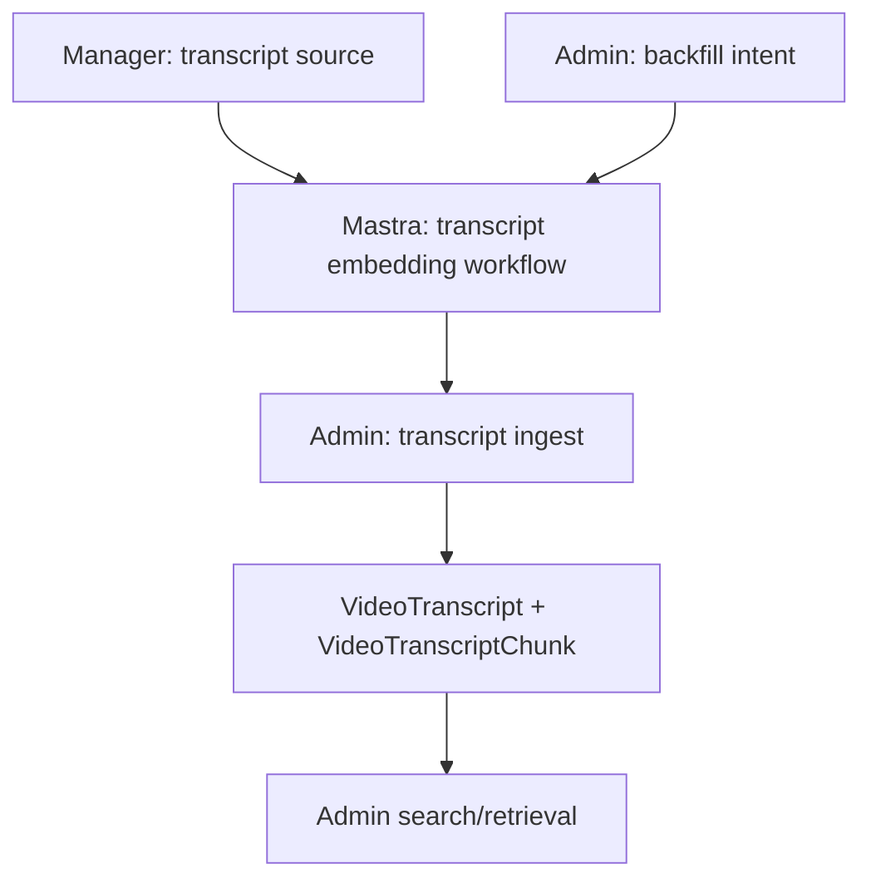
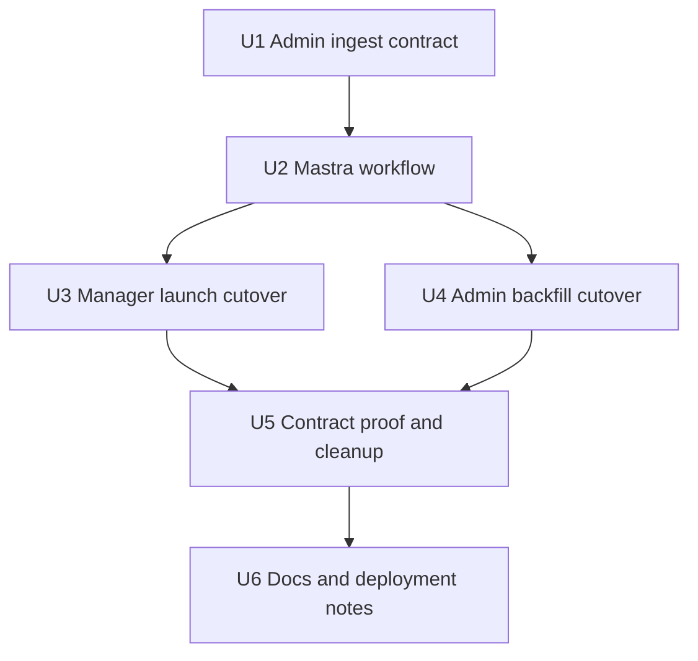

# Mastra Transcript Embedding Migration

## Summary

Move the transcript embedding slice from Manager-owned generation to a
Mastra-owned workflow. Manager will keep producing transcript source data,
Mastra will plan chunks and generate vectors, and Admin will validate and store
the vectors through a transcript-specific ingest contract.

---

## Problem Frame

The current transcript path crosses the right storage boundary but the wrong
execution boundary: Manager writes `embeddings.json`, then Admin imports those
vectors. The migration needs to prove the new workflow ownership boundary
without changing the live search contract or pulling scene, experience, and
search-eval work into the same PR-sized slice.

---

## Requirements

- R1. Mastra owns transcript chunk planning, embedding provider calls, retries,
  run diagnostics, and detailed workflow observability.
- R2. Manager owns transcript source production only; it must stop generating
  transcript vectors in transcript-only and full enrichment paths.
- R3. Admin remains the authority for transcript vector storage, pgvector
  indexing, publication/search gates, and public search response contracts.
- R4. Admin ingest is transcript-specific, authenticated, provenance-aware,
  dimension-guarded, and idempotent by default.
- R5. Admin can still initiate catalog backfills, repairs, force re-embeds, and
  model-upgrade runs, but it launches Mastra instead of importing
  manager-generated vectors.
- R6. Contract proof gates deletion: tests show Mastra-shaped output is accepted
  by Admin ingest, persisted into existing transcript tables, and read by
  existing Admin search/retrieval.
- R7. No live query embedding generation or live search orchestration moves to
  Mastra in this plan.
- R8. Scene embeddings, experience embeddings, search trace storage, and Mastra
  eval retrieval stay as follow-up work.

**Origin actors:** Manager, Admin, Mastra, Operator.
**Origin flows:** Transcript embedding migration.
**Origin acceptance examples:** Manager-launched transcript embedding,
idempotent retry, explicit force/model-upgrade overwrite, live search still
served without Mastra query-time work.

---

## Scope Boundaries

- This plan implements transcript embeddings only.
- This plan does not migrate scene or experience embedding generation, except
  for preserving currently-needed Manager scene helper code until the scene
  phase removes it.
- This plan does not add production search trace storage or Mastra eval
  sampling.
- This plan does not move public search APIs, vector storage, or publication
  gates out of Admin.
- This plan does not expose embedding vectors, vector-shaped fields, internal
  provenance, or similarity internals through normal GraphQL types.

### Deferred to Follow-Up Work

- Scene embedding migration: Mastra-generated scene vectors through a
  scene-specific Admin ingest contract.
- Experience embedding migration: Mastra-generated experience vectors through an
  experience-specific Admin ingest contract.
- Search observability and eval retrieval: Admin stores short-lived production
  traces, and Mastra samples them for eval generation and reports.
- Future strategy option: Mastra owns retrieval strategy while Admin executes
  deterministic retrieval primitives.

---

## Context & Research

### Relevant Code and Patterns

- `apps/manager/src/workflows/transcriptOnlyPipeline.ts` currently composes
  transcription and `generateEmbeddings`, then returns chunk/vector counts.
- `apps/manager/src/workflows/videoEnrichment.ts` calls `stepEmbeddings`, which
  imports `apps/manager/src/services/embeddings.ts`.
- `apps/manager/src/services/embeddings.ts` contains the deterministic
  transcript chunk planner, OpenRouter embedding calls, and
  `{assetId}/embeddings.json` writer. Its `requestEmbeddingVectors` helper is
  also used by `apps/manager/src/services/sceneEmbeddingSync.ts`, so the
  transcript cleanup must not delete scene-needed code before the scene phase.
- `apps/manager/src/services/transcription.ts` writes
  `{assetId}/transcript.json` with `text`, timed `segments`, language, provider,
  and routing report. This becomes the source artifact for transcript backfills.
- `apps/admin/src/services/transcript-embedding.service.ts` owns the existing
  bulk pgvector write pattern for `VideoTranscript` and `VideoTranscriptChunk`.
- `apps/admin/src/workflows/transcriptEmbeddingBackfill.ts` currently reads
  `embeddings.json` once per `(video, edition)` group and reuses those vectors.
- `apps/admin/src/services/hybrid-search-retrievers.ts` already mixes
  `video_transcript_chunk.embedding` into the `semantic-video` retriever, so
  search proof can reuse the existing read path.
- `apps/mastra/src/mastra/index.ts` already registers authenticated service
  routes, Postgres runtime storage, DuckDB observability storage, and prompt
  redaction.

### Institutional Learnings

- `docs/solutions/platform/admin-transcript-embeddings-vector-reuse-pattern.md`
  preserves transcript storage invariants: dimension hard guard,
  model-stamp caution, denormalized chunk language for partial HNSW, and
  Way-A `::vector(1536)` bulk insert casting.
- `docs/solutions/integration-issues/manager-embeddings-transcript-aware-optional-metadata-2026-04-08.md`
  preserves the current deterministic chunk planning and additive artifact
  lessons. The chunking behavior should move, not regress.
- `docs/solutions/database-issues/pgvector-bulk-insert-on-conflict-pattern-20260505.md`
  is the bulk write pattern to keep when Admin ingest persists Mastra output.
- `docs/solutions/architecture-patterns/bearer-as-passport-multi-csv-composition-20260518.md`
  argues against broad passport auth for write surfaces. Direct vector ingest
  should use a narrow Mastra-to-Admin capability bearer, not a general known
  caller union.
- `docs/solutions/platform/mastra-studio-gateway-auth-railway-pattern-20260522.md`
  keeps Mastra runtime execution behind service bearer contracts and leaves
  human Studio access in `apps/mastra-gateway`.

### External References

- [Mastra Workflows](https://www.mintlify.com/mastra-ai/mastra/concepts/workflows)
  documents `createWorkflow`, `createStep`, committed workflow graphs,
  workflow runs, and workflow observability spans. Use the local
  `@forge/mastra` version as the implementation authority, but keep the
  workflow shape aligned with this API.

---

## Key Technical Decisions

- Admin ingest is a dedicated internal REST endpoint, not GraphQL. Vector
  payloads are large and intentionally excluded from GraphQL's public schema
  guardrails.
- Mastra-to-Admin ingest uses a new narrow bearer allowlist. Do not reuse the
  broader `WORKFLOW_API_KEYS` trigger bearer for arbitrary vector writes.
- Transcript provenance is stored on the `VideoTranscript` parent. Chunk rows
  already carry text, timing, model, dimensions, and vectors; the parent is the
  right grain for source hash, source artifact key, Mastra run id, generation
  mode, provider/model version, and generated timestamp.
- Default ingest is idempotent. If source hash, chunking settings, model, and
  dimensions match the existing transcript, Admin returns an unchanged outcome
  instead of blindly rewriting healthy vectors. `repair`, `force`, and
  `model-upgrade` modes make overwrite intent explicit.
- Mastra receives source transcript data, not Admin database access. Admin and
  Manager launch the Mastra workflow over HTTP; `apps/mastra` must not import
  app-context code.
- Manager transcript paths wait for a Mastra result in this slice. That keeps
  product-level success/failure semantics close to the current synchronous
  `generateEmbeddings` behavior. If this proves too slow, a later plan can add
  async run polling/webhooks without changing Admin ingest.
- Existing Manager scene embedding sync remains temporarily. Removing all
  Manager embedding helpers belongs to the scene migration phase; this slice
  removes transcript generation only.

---

## Open Questions

### Resolved During Planning

- **Which slice first:** transcript embeddings only.
- **Who writes vectors:** Mastra calls Admin ingest; Admin persists.
- **Where source transcript comes from:** Manager writes `transcript.json`;
  Admin reads that source artifact for backfills.
- **Auth shape:** dedicated Mastra ingest bearer for direct vector writes.
- **Deletion gate:** contract proof, not parity/eval reports.

### Deferred to Implementation

- **Exact provenance column names:** choose compact Prisma field names during the
  schema migration, but keep the parent-grain decision and required facts from
  this plan.
- **Exact Mastra run-launch API:** use the installed `@forge/mastra` package as
  source of truth for `createWorkflow` and run execution; keep the HTTP entry
  contract stable for callers.
- **Timeout numbers:** pick route/client timeouts against local transcript
  lengths and provider latency; keep them explicit and tested.

---

## High-Level Technical Design

> This illustrates the intended approach and is directional guidance for review,
> not implementation specification. The implementing agent should treat it as
> context, not code to reproduce.

The production workflow should be deterministic: validate source, plan chunks,
batch provider calls, validate vectors, submit one transcript ingest payload,
and return a product-level outcome. Mastra owns the detailed spans and provider
diagnostics; Manager/Admin store enough outcome data for operators to know what
happened.

---

## Implementation Units

### U1. Admin Transcript Ingest Contract

**Goal:** Add the authenticated Admin write contract that Mastra will call with
final transcript chunks and vectors.

**Requirements:** R3, R4, R6.

**Dependencies:** None.

**Files:**

- Create: `apps/admin/src/auth/mastra-ingest-bearer.ts`
- Create: `apps/admin/src/auth/mastra-ingest-bearer.test.ts`
- Create: `apps/admin/src/app/api/internal/mastra/transcript-embeddings/route.ts`
- Create: `apps/admin/src/app/api/internal/mastra/transcript-embeddings/route.test.ts`
- Create or modify: `apps/admin/src/services/transcript-embedding-ingest.service.ts`
- Modify: `apps/admin/src/services/transcript-embedding.service.ts`
- Modify: `apps/admin/prisma/schema.prisma`
- Create: `apps/admin/prisma/migrations/<timestamp>_transcript_embedding_provenance/migration.sql`
- Modify: `apps/admin/src/config/env.ts`
- Test: `apps/admin/src/services/transcript-embedding.service.test.ts`

**Approach:**

- Add a CSV receiver env for Mastra ingest and a constant-time bearer validator
  following the narrow per-CSV validator pattern.
- Define a transcript ingest payload schema with target identity, chunks,
  vectors, model/dimensions, chunking metadata, provenance, and generation mode.
- Support two target identity forms: explicit Admin identifiers for
  Admin-launched backfills, and Manager-originated external identifiers such as
  `assetId`, `muxAssetId`, optional Admin-provided `adminVideoId`, and
  `language`. Admin resolves external identifiers or rejects the ingest as
  ambiguous before any vector write.
- CMS/Strapi is being deleted. Do not add or preserve CMS document-id support in
  the transcript embedding contract; do not use `videoDocumentId`.
- Reuse the existing bulk write discipline for `video_transcript_chunk`.
- Add parent-level provenance fields needed for idempotency and audits.
- Return a small outcome envelope: created, updated, unchanged, repaired,
  forced, model-upgraded, or rejected.

**Execution note:** Start with service and route tests before wiring callers.

**Patterns to follow:**

- `apps/admin/src/auth/workflow-bearer.ts`
- `apps/admin/src/app/api/manager/videos-by-core-ids/route.ts`
- `apps/admin/src/services/transcript-embedding.service.ts`
- `docs/solutions/database-issues/pgvector-bulk-insert-on-conflict-pattern-20260505.md`

**Test scenarios:**

- Happy path: valid Mastra payload writes parent provenance and chunk vectors.
- Edge case: retrying the same payload returns unchanged and does not rewrite
  healthy chunks.
- Edge case: repair mode fills missing chunks without requiring a force mode.
- Edge case: force and model-upgrade modes overwrite only when explicitly set.
- Error path: missing/wrong bearer returns unauthorized and does not call the
  service.
- Error path: dimension mismatch, empty chunk text, duplicate chunk index, or
  missing target identity fails before vector writes.
- Security: route errors and logs do not echo raw vectors, bearer tokens, or
  full transcript text.

**Verification:**

- Admin can persist a Mastra-shaped transcript payload into existing transcript
  tables and preserve current pgvector column invariants.

---

### U2. Mastra Transcript Embedding Workflow

**Goal:** Add the Mastra-owned deterministic transcript embedding workflow and
service route.

**Requirements:** R1, R4, R6, R7.

**Dependencies:** U1.

**Files:**

- Create: `apps/mastra/src/mastra/workflows/transcript-embedding.ts`
- Create: `apps/mastra/src/mastra/workflows/transcript-embedding.test.ts`
- Create: `apps/mastra/src/services/embedding-provider.ts`
- Create: `apps/mastra/src/services/embedding-provider.test.ts`
- Create: `apps/mastra/src/services/admin-transcript-ingest-client.ts`
- Create: `apps/mastra/src/services/admin-transcript-ingest-client.test.ts`
- Modify: `apps/mastra/src/mastra/index.ts`
- Modify: `apps/mastra/src/config/env.ts`
- Modify: `apps/mastra/src/config/env.test.ts`
- Modify: `apps/mastra/package.json` if the installed Mastra workflow API or
  provider implementation needs an added dependency.

**Approach:**

- Port the transcript chunk planner from Manager into Mastra with behavior
  preserved by tests.
- Add a provider client that supports the existing embedding model and validates
  response count, index alignment, finite values, and dimensions.
- Define a Mastra workflow with explicit steps for validate, plan, embed, and
  ingest. Register it with the Mastra runtime so Studio can inspect runs.
- Carry a source transcript plus target identity envelope through the workflow;
  do not assume Manager-originated runs have a `coreId`.
- Add a service-bearer protected route that launches one transcript embedding
  workflow and returns the product-level outcome plus Mastra run identity.
- Keep workflow logs/spans useful but redacted: no raw transcript bodies,
  vectors, bearer tokens, or provider keys.

**Patterns to follow:**

- `apps/mastra/src/mastra/index.ts`
- `apps/mastra/src/server/service-bearer.ts`
- `apps/admin/src/services/embeddings.service.ts`
- `apps/manager/src/services/embeddings.ts`

**Test scenarios:**

- Happy path: segment-aware source produces stable chunks and calls Admin ingest
  with vectors aligned to chunk order.
- Happy path: plain transcript text falls back to plain-text chunking.
- Error path: empty source, provider length mismatch, provider dimension drift,
  or Admin ingest failure returns a failed outcome with a safe reason.
- Observability hygiene: returned/logged payloads do not include raw vector
  arrays or bearer values.
- Auth: wrong or missing Mastra service bearer cannot launch the route.

**Verification:**

- `@forge/mastra` owns the transcript embedding run and can submit a valid
  payload to Admin ingest in tests.

---

### U3. Manager Launch Cutover

**Goal:** Replace Manager's transcript embedding generation calls with Mastra
workflow launches.

**Requirements:** R1, R2, R6, R7.

**Dependencies:** U2.

**Files:**

- Create: `apps/manager/src/services/mastra-transcript-embeddings.ts`
- Create: `apps/manager/src/services/mastra-transcript-embeddings.test.ts`
- Modify: `apps/manager/src/workflows/transcriptOnlyPipeline.ts`
- Modify: `apps/manager/src/workflows/transcriptOnlyPipeline.test.ts`
- Modify: `apps/manager/src/workflows/videoEnrichment.ts`
- Modify: `apps/manager/src/workflows/videoEnrichment.test.ts`
- Modify: `apps/manager/src/services/embeddings.ts`
- Modify: `apps/manager/src/services/embeddings.test.ts`
- Modify: `apps/manager/src/services/sceneEmbeddingSync.ts` only if needed to
  keep the scene helper isolated from the removed transcript producer.
- Modify: `apps/manager/src/config/env.ts`
- Modify: `apps/manager/CLAUDE.md`

**Approach:**

- Add a Manager client for Mastra's transcript embedding route using
  `MASTRA_BASE_URL` and a caller-side service key.
- In `runTranscriptOnlyPipeline`, call Mastra after `transcribe` or
  `transcribeSubtitleUrl` writes `transcript.json`.
- In `videoEnrichment.ts`, replace `stepEmbeddings` with a Mastra-launch step
  that forwards transcript text, segments, language, available target
  identifiers (`assetId`, `muxAssetId`, and any Admin-provided IDs when
  present), and optional product metadata needed for status reporting.
- Remove Manager's transcript artifact writer and tests that assert
  `{assetId}/embeddings.json` is produced. Keep provider helper code that scene
  sync still needs until the scene migration phase.
- Return a product-level result that Manager UI/job surfaces can display without
  storing vectors.

**Patterns to follow:**

- `apps/mastra/src/client/service-client.ts`
- `apps/manager/src/lib/admin-embed-trigger.ts`
- `apps/manager/src/workflows/transcriptOnlyPipeline.ts`
- `apps/manager/src/workflows/videoEnrichment.ts`

**Test scenarios:**

- Happy path: transcript-only pipeline writes transcript artifacts, launches
  Mastra, and reports Mastra/Admin ingest success.
- Happy path: full enrichment launches Mastra after transcription and continues
  downstream status reporting.
- Edge case: Manager launch does not require `coreId`; ambiguous or
  unresolvable target identity is surfaced as a classified failure from Admin
  ingest.
- Error path: Mastra config missing, auth failure, network timeout, or failed
  workflow returns a classified failure and does not pretend embeddings exist.
- Regression: no transcript path calls `generateEmbeddings` or writes
  `embeddings.json`.
- Regression: scene embedding sync still works until its own migration phase.

**Verification:**

- Manager no longer owns transcript embedding generation in either transcript
  path.

---

### U4. Admin Backfill Cutover

**Goal:** Replace Admin's transcript backfill import of `embeddings.json` with
Admin-launched Mastra generation from transcript source artifacts.

**Requirements:** R1, R3, R5, R6.

**Dependencies:** U2.

**Files:**

- Create: `apps/admin/src/services/mastra-transcript-embedding-client.ts`
- Create: `apps/admin/src/services/mastra-transcript-embedding-client.test.ts`
- Modify: `apps/admin/src/services/manager-artifacts.service.ts`
- Modify: `apps/admin/src/services/manager-artifacts.service.test.ts`
- Modify: `apps/admin/src/workflows/transcriptEmbeddingBackfill.ts`
- Modify: `apps/admin/src/workflows/transcriptEmbeddingBackfill.test.ts`
- Modify: `apps/admin/src/workflows/_steps/load-manager-artifact.ts`
- Modify: `apps/admin/src/graphql/mutations/transcript-embedding.ts`
- Modify: `apps/admin/src/graphql/mutations/transcript-embedding.test.ts`
- Modify: `apps/admin/src/scripts/run-embeds.ts`
- Modify: `apps/admin/src/config/env.ts`

**Approach:**

- Add a Zod schema and reader for manager's `transcript.json` source artifact.
- Keep the existing target enumeration and per-group bounded parallelism, but
  load transcript source once per group instead of loading `embeddings.json`.
- Add an Admin client for Mastra's transcript workflow route.
- Thread explicit modes through the backfill input: default idempotent, repair,
  force, and model-upgrade.
- Preserve per-target isolation and missing-artifact reporting, but reword
  operator-facing descriptions from "import embeddings artifact" to "generate
  transcript embeddings through Mastra".

**Patterns to follow:**

- `apps/admin/src/workflows/transcriptEmbeddingBackfill.ts`
- `apps/admin/src/workflows/sceneEmbeddingBackfill.ts`
- `apps/admin/src/services/manager-artifacts.service.ts`
- `apps/admin/src/services/manager-trigger.service.ts`

**Test scenarios:**

- Happy path: Admin backfill loads a transcript source artifact, launches
  Mastra, and records a succeeded target when Admin ingest succeeds.
- Edge case: missing `transcript.json` is skipped and appears in
  `missingArtifacts` as `kind: "transcript"`.
- Error path: invalid transcript source, Mastra auth failure, network failure,
  or rejected ingest becomes a failed per-target outcome without aborting
  sibling targets.
- Regression: backfill no longer calls `readEmbeddingsArtifact`.
- Regression: GraphQL mutation dispatch shape remains stable for callers.

**Verification:**

- Admin can run a transcript backfill without any manager-generated vector
  artifact.

---

### U5. Contract Proof and Producer Cleanup

**Goal:** Prove existing search reads Mastra-written transcript vectors, then
remove obsolete transcript vector producer/consumer paths.

**Requirements:** R2, R3, R6, R7, R8.

**Dependencies:** U3, U4.

**Files:**

- Modify: `apps/admin/src/services/hybrid-search-retrievers.test.ts`
- Modify: `apps/admin/src/services/hybrid-search.service.test.ts`
- Modify: `apps/admin/src/services/search-eval/fingerprint.test.ts`
- Modify: `apps/admin/src/services/manager-artifacts.service.ts`
- Modify: `apps/admin/src/services/transcript-embedding.service.test.ts`
- Modify: `apps/manager/src/services/embeddings.ts`
- Modify: `apps/manager/src/services/embeddings.test.ts`
- Delete: transcript-only tests/fixtures that exist solely for
  manager-generated `embeddings.json`, if no scene migration path still uses
  them.

**Approach:**

- Add a contract fixture shaped like Mastra's ingest payload and assert Admin
  persists it into the same tables search already reads.
- Keep search result shape tests focused on existing public fields; provenance
  can be inspected by internal service tests only.
- Remove Admin reads of manager `embeddings.json` once backfill uses
  `transcript.json`.
- Remove Manager's transcript embedding producer code while preserving any
  non-transcript helper required by `sceneEmbeddingSync`.

**Patterns to follow:**

- `docs/solutions/best-practices/mocked-shape-vs-real-contract-discipline-20260506.md`
- `apps/admin/src/services/hybrid-search-retrievers.test.ts`
- `apps/admin/src/services/search-eval/fingerprint.ts`

**Test scenarios:**

- Integration: Mastra-shaped payload -> Admin ingest -> transcript vector rows
  -> existing semantic-video retriever can read transcript evidence.
- Regression: public REST/GraphQL search result fields do not expose provenance
  or vector-shaped internals.
- Regression: `search-eval` fingerprint still counts transcript embeddings via
  `video_transcript_chunk.embedding IS NOT NULL`.
- Cleanup: no transcript path references Manager's `generateEmbeddings` or
  Admin's `readEmbeddingsArtifact`.

**Verification:**

- Contract proof passes and obsolete transcript vector production is gone.

---

### U6. Documentation and Deployment Notes

**Goal:** Update durable docs and environment runbooks for the new ownership
boundary.

**Requirements:** R1, R2, R3, R5, R7, R8.

**Dependencies:** U5.

**Files:**

- Modify: `apps/admin/CLAUDE.md`
- Modify: `apps/manager/CLAUDE.md`
- Modify: `apps/mastra/CLAUDE.md`
- Modify: `docs/roadmap/content-discovery/feat-132-mastra-transcript-embedding-migration.md`
- Create or modify: `docs/solutions/platform/mastra-transcript-embedding-workflow-pattern.md`

**Approach:**

- Replace "Manager writes embeddings.json and Admin imports it" with the new
  source-artifact -> Mastra workflow -> Admin ingest model.
- Document required env across Admin, Manager, and Mastra.
- Preserve the future migration order: scene next, experience after, search
  observability/evals as a separate track.
- Mark the roadmap ticket complete only after validation passes.

**Test scenarios:**

- Test expectation: none for prose-only docs.

**Verification:**

- Future agents can identify the new owner of transcript embedding generation
  and the still-deferred migration work without re-reading this conversation.

---

## System-Wide Impact

- **Interaction graph:** Manager and Admin both become Mastra workflow launchers;
  Mastra becomes an Admin ingest caller; Admin search remains the only live
  retrieval authority.
- **Error propagation:** Manager/Admin surfaces show product-level outcomes;
  Mastra carries detailed provider/step diagnostics; Admin ingest returns typed
  rejection reasons without leaking raw vectors or transcript bodies.
- **State lifecycle risks:** duplicate launches, replays, and retries must be
  safe. Idempotent mode is default; force/model-upgrade modes are explicit.
- **API surface parity:** public search REST and GraphQL response shapes remain
  unchanged. Internal Admin ingest is additive.
- **Integration coverage:** unit tests prove branch shape; contract tests prove
  the Mastra payload is accepted and search-readable.
- **Unchanged invariants:** pgvector columns stay in Admin; embedding vectors
  stay off GraphQL types; live query embeddings remain in Admin's search
  service, not Mastra.

---

## Risks & Dependencies

| Risk                                                        | Mitigation                                                                                                                                |
| ----------------------------------------------------------- | ----------------------------------------------------------------------------------------------------------------------------------------- |
| Direct ingest endpoint could become too broad               | Use a dedicated Mastra ingest bearer, strict payload schema, dimension guards, and no known-caller OR composition                         |
| Manager pipeline latency increases while waiting for Mastra | Keep one-transcript launch semantics for parity, add explicit timeouts, and defer async polling/webhook design if measurements require it |
| Chunking behavior drifts during the port                    | Port Manager chunking tests before deleting Manager transcript generation                                                                 |
| Existing scene sync still imports Manager embedding helpers | Split transcript-specific producer cleanup from scene helper cleanup; remove the remaining helper in the scene migration ticket           |
| Backfill reports become hard to interpret                   | Preserve the current per-target succeeded/skipped/failed report idiom and keep `missingArtifacts` operator-actionable                     |
| Search quality appears to change because content changed    | Use contract proof as the deletion gate; parity/eval reports are supporting evidence but not required for this slice                      |

---

## Validation

- `pnpm --filter @forge/mastra test`
- `pnpm --filter @forge/mastra typecheck`
- `pnpm --filter @forge/mastra lint`
- `pnpm --filter @forge/admin test -- transcript-embedding.service.test.ts transcriptEmbeddingBackfill.test.ts hybrid-search-retrievers.test.ts hybrid-search.service.test.ts search-eval/fingerprint.test.ts`
- `pnpm --filter @forge/manager test -- transcriptOnlyPipeline.test.ts videoEnrichment.test.ts`
- If Admin Prisma schema changes: run Admin migration validation and regenerate any generated artifacts required by the Admin package guide.

---

## Sources & References

- Origin requirements: `docs/brainstorms/2026-05-25-mastra-embedding-search-migration-requirements.md`
- Roadmap: `docs/roadmap/content-discovery/feat-132-mastra-transcript-embedding-migration.md`
- Mastra runtime: `docs/roadmap/platform/feat-129-mastra-railway-workflow-runtime.md`
- Mastra observability: `docs/roadmap/platform/feat-130-mastra-observability-storage.md`
- Search read-path proof target:
  `docs/roadmap/content-discovery/feat-131-mixed-scene-transcript-video-semantic-search.md`
- Mastra workflow docs:
  `https://www.mintlify.com/mastra-ai/mastra/concepts/workflows`
