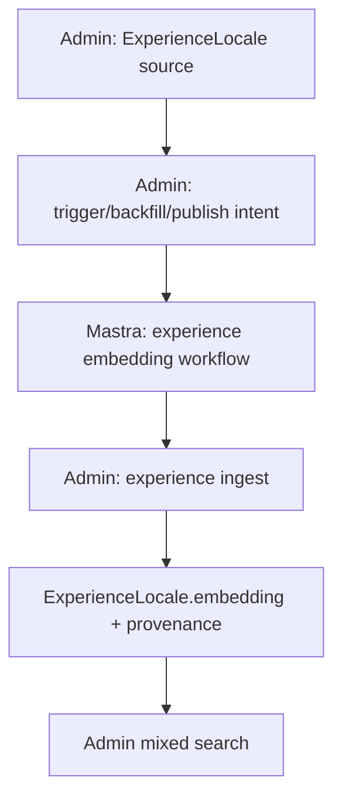

# Mastra Experience Embedding Migration

## Summary

Move experience embedding generation out of Admin's provider path into a
Mastra-owned workflow. Admin keeps `ExperienceLocale` source authority,
publication gates, vector storage, pgvector indexes, GraphQL trigger authority,
and public search retrieval.

---

## Problem Frame

Transcript and scene embeddings now follow the intended ownership boundary:
Mastra generates background vectors, while Admin validates and persists them.
Experience embeddings still call the provider from Admin, leaving one remaining
background content embedding type outside Mastra's workflow diagnostics and
Studio observability.

---

## Requirements

- R1. Mastra owns experience embedding generation, provider calls, provider
  response validation, retries, workflow diagnostics, and Studio-visible run
  behavior.
- R2. Admin exposes an experience-specific internal ingest endpoint for
  Mastra-written `ExperienceLocale` vectors; no generic vector blob endpoint.
- R3. Admin stores compact experience embedding provenance: source content
  hash, safe source summary, model/provider/version, generation mode, Mastra
  run id, and generated timestamp.
- R4. Admin remains the authority for `ExperienceLocale` source data, storage,
  publication rules, pgvector indexes, target resolution, public search
  contracts, and search retrieval.
- R5. Admin experience backfill, per-locale GraphQL trigger, and publish/update
  auto-dispatch launch Mastra instead of calling the embedding provider directly
  for production experience embedding generation.
- R6. Existing Admin mixed search reads Mastra-written `ExperienceLocale`
  vectors without REST or GraphQL response-shape changes.
- R7. Admin's direct production experience embedding provider path is removed or
  narrowed after the Mastra contract proof passes, while live query embeddings
  for search/health/debug stay Admin-owned.
- R8. Mastra step output and normal Admin/GraphQL surfaces never expose vectors,
  raw provider payloads, raw source text, or provenance internals.
- R9. CMS/Strapi support is out of scope and must not be added, preserved, or
  depended on.

**Origin actors:** Admin, Mastra, Operator.
**Origin flows:** Later embedding migrations.
**Origin acceptance examples:** Idempotent retry, explicit force/model-upgrade
overwrite, live search still served without Mastra query-time work.

---

## Scope Boundaries

- This plan implements experience embeddings only.
- This plan does not migrate live user search orchestration or live query
  embedding generation into Mastra.
- This plan does not change public search REST or GraphQL response shapes.
- This plan does not expose embedding vectors, vector-shaped fields, similarity
  internals, raw provider payloads, raw source text, or provenance internals
  through normal GraphQL or Studio step output.
- This plan does not create a generic embedding blob endpoint.
- This plan does not add CMS/Strapi identifiers, env vars, or compatibility
  paths.

### Deferred to Follow-Up Work

- Shared embedding workflow abstractions across transcript, scene, and
  experience should wait until all concrete migrations prove their contracts.
- Production search trace storage and Mastra eval retrieval remain separate
  roadmap work.
- Any performance parallelism for experience backfill should be a follow-up if
  sequential per-locale launch becomes too slow.

---

## Context & Research

### Relevant Code and Patterns

- `apps/admin/src/services/embeddings.service.ts` currently flattens
  `ExperienceLocale` text, calls OpenRouter/OpenAI, and writes
  `experience_locale.embedding`.
- `apps/admin/src/workflows/experienceEmbedding.ts` is the per-locale
  useworkflow wrapper currently used by `triggerExperienceEmbedding`.
- `apps/admin/src/workflows/experienceEmbeddingBackfill.ts` currently
  enumerates published `ExperienceLocale` rows and calls
  `embedExperienceLocale` sequentially.
- `apps/admin/src/graphql/mutations/experience.ts` exposes the per-locale
  trigger through `ExperienceService.triggerEmbedding`.
- `apps/admin/src/graphql/mutations/experience-embedding-backfill.ts` exposes
  the bulk backfill trigger and already carries `force`.
- `apps/admin/src/services/transcript-embedding-ingest.service.ts` and
  `apps/admin/src/services/scene-embedding-ingest.service.ts` are the models
  for type-specific Admin ingest, source hash validation, generation modes,
  advisory locks, and safe result envelopes.
- `apps/mastra/src/mastra/workflows/transcript-embedding.ts` and
  `apps/mastra/src/mastra/workflows/scene-embedding.ts` are the models for
  committed three-step workflows that throw typed failures and keep vectors out
  of step output.
- `apps/admin/src/services/hybrid-search-retrievers.ts` already reads
  `ExperienceLocale.embedding` through `searchExperienceSemantic`.

### Institutional Learnings

- `docs/solutions/platform/mastra-transcript-embedding-workflow-pattern.md`
  establishes the ownership line, Admin ingest proof gate, and review traps.
- `docs/solutions/platform/mastra-scene-embedding-workflow-pattern.md` is the
  closest migration sibling: Admin launches Mastra with source data, Mastra
  generates vectors, Admin ingest validates and persists.
- `docs/solutions/integration-issues/mastra-studio-api-auth-guard.md` requires
  service-bearer auth to stay scoped to explicit `/forge-*` routes so Studio's
  built-in `/api/workflows` calls keep working.
- `docs/solutions/database-issues/pgvector-bulk-insert-on-conflict-pattern-20260505.md`
  preserves the Way-A `u.embedding_text::vector(1536)` cast discipline for raw
  pgvector writes.
- `docs/solutions/best-practices/workflow-dispatch-test-mode-divergence-20260421.md`
  keeps dispatch-level tests mandatory for `start()` call sites.
- `docs/solutions/best-practices/mock-shape-vs-real-contract-discipline-20260506.md`
  reinforces contract tests that prove the producer/consumer shape, not just
  mocked branch behavior.

---

## Key Technical Decisions

- Experience ingest is a dedicated internal REST endpoint under
  `api/internal/mastra/experience-embeddings`: vector payloads stay out of
  GraphQL and remain experience-specific.
- Admin sends `ExperienceLocale` source data to Mastra; Mastra does not import
  from `apps/admin` or read Admin's database.
- Provenance lives on `ExperienceLocale` because the vector is per locale and
  the locale row is already the search grain.
- Default ingest is idempotent. Matching source hash, model, dimensions, and
  healthy vector return `unchanged`; `repair`, `force`, and `model-upgrade`
  make rewrites explicit.
- Admin keeps `generateExperienceEmbedding` only for live query embeddings used
  by search, search health, and admin/debug surfaces. Production content vector
  generation moves to the Mastra launcher.
- The old `force: Boolean` trigger/backfill flag maps to generation mode:
  omitted/false means `idempotent`, true means `force`. Additional
  `mode` support can be added to the backfill trigger without removing
  backwards compatibility.
- Mastra workflow failures must throw inside committed runs; failed provider or
  Admin ingest calls should show as failed Studio runs, not successful runs with
  hidden `{ ok: false }` payloads.

---

## Open Questions

### Resolved During Planning

- **Scope slice:** experience embeddings only.
- **Auth shape:** reuse the narrow Mastra ingest bearer pattern, adding a
  separate experience ingest allowlist.
- **Source shape:** Admin supplies source content and safe summary directly from
  `ExperienceLocale` fields and flattened blocks.
- **Deletion gate:** contract tests must prove Mastra-shaped output writes
  `experience_locale.embedding` and existing search reads it.

### Deferred to Implementation

- **Exact safe summary shape:** choose the smallest source summary that helps
  operators without exposing raw source text; keep it short and provenance-only.
- **Exact route timeout:** choose values consistent with transcript/scene
  launchers and verify via client tests.
- **Exact Prisma migration number:** use the next migration directory available
  when implementation starts.

---

## High-Level Technical Design

> This illustrates the intended approach and is directional guidance for review,
> not implementation specification. The implementing agent should treat it as
> context, not code to reproduce.

The production workflow validates the Admin-supplied locale source, builds one
embedding input, calls the provider, validates vector shape, submits one
experience ingest payload, and returns a product-level outcome. Mastra owns
detailed spans and provider diagnostics; Admin keeps only compact provenance and
operator-safe summaries.

---

## Implementation Units

### U1. Experience Provenance Schema and Storage Writer

**Goal:** Add compact provenance columns to `ExperienceLocale` and refactor the
writer so Admin can persist Mastra-supplied vectors without generating them.

**Requirements:** R2, R3, R4, R8.

**Dependencies:** None.

**Files:**

- Modify: `apps/admin/prisma/schema.prisma`
- Create: `apps/admin/prisma/migrations/<next>_experience_embedding_mastra_provenance/migration.sql`
- Modify: `apps/admin/src/services/embeddings.service.ts`
- Modify: `apps/admin/src/services/embeddings.service.test.ts`
- Test: `apps/admin/src/graphql/schema.test.ts`

**Approach:**

- Add nullable provenance fields at `ExperienceLocale` grain: source content
  hash, source summary, model, dimensions, provider, generation mode, Mastra run
  id, and generated timestamp.
- Keep `embedding Unsupported("vector(1536)")?` out of Prisma model writes and
  GraphQL types.
- Add a storage helper that accepts a validated vector plus provenance and uses
  raw SQL with a per-row `::vector(1536)` cast.
- Preserve `canWriteDerived` enforcement and SYSTEM-only workflow writes.

**Patterns to follow:**

- `apps/admin/src/services/scene-embedding.service.ts`
- `apps/admin/src/services/transcript-embedding.service.ts`
- `docs/solutions/database-issues/pgvector-bulk-insert-on-conflict-pattern-20260505.md`

**Test scenarios:**

- Happy path: valid 1536-dimensional vector writes `embedding` and provenance to
  the target `ExperienceLocale`.
- Error path: wrong dimensions are rejected before any SQL write.
- Error path: non-SYSTEM/non-ADMIN derived write user is rejected.
- Integration: GraphQL schema security tests still find no
  `embed|vector|similarit` fields.

**Verification:**

- Experience vectors and provenance persist through the new writer, while normal
  GraphQL type output remains unchanged.

### U2. Admin Experience Mastra Ingest Contract

**Goal:** Add the authenticated Admin endpoint that accepts final
Mastra-generated experience vectors and applies idempotent/rewrite behavior.

**Requirements:** R2, R3, R4, R6, R8, R9.

**Dependencies:** U1.

**Files:**

- Create: `apps/admin/src/services/experience-embedding-ingest.service.ts`
- Create: `apps/admin/src/services/experience-embedding-ingest.service.test.ts`
- Create: `apps/admin/src/services/experience-embedding-ingest.contract.test.ts`
- Create: `apps/admin/src/app/api/internal/mastra/experience-embeddings/route.ts`
- Create: `apps/admin/src/app/api/internal/mastra/experience-embeddings/route.test.ts`
- Modify: `apps/admin/src/auth/mastra-ingest-bearer.ts`
- Modify: `apps/admin/src/auth/mastra-ingest-bearer.test.ts`
- Modify: `apps/admin/src/config/env.ts`
- Modify: `apps/admin/src/config/env.test.ts`

**Approach:**

- Add `MASTRA_EXPERIENCE_INGEST_API_KEYS`, separate from workflow launch,
  transcript ingest, and scene ingest keys.
- Validate a single Admin target: `experienceId`, `experienceLocaleId`,
  `locale`, and optional slug/title assertions.
- Validate source content hash, safe source summary, model/provider/dimensions,
  generation mode, Mastra run id, generated timestamp, and vector shape.
- Resolve the target in Admin and reject unpublished locales, archived parent
  experiences, mismatched experience ids, mismatched locale, dimension drift,
  malformed source hash, and ambiguous/stale identity before writing.
- Use an advisory transaction lock per `ExperienceLocale` so concurrent retries
  cannot interleave provenance checks and vector writes.
- Return a small safe envelope: `created`, `unchanged`, `repaired`, `forced`,
  `model_upgraded`, or `rejected`.

**Patterns to follow:**

- `apps/admin/src/services/scene-embedding-ingest.service.ts`
- `apps/admin/src/services/transcript-embedding-ingest.service.ts`
- `apps/admin/src/app/api/internal/mastra/scene-embeddings/route.ts`

**Test scenarios:**

- Happy path: valid Mastra-shaped experience payload writes
  `experience_locale.embedding`.
- Edge case: idempotent rerun with matching hash/model/dimensions and healthy
  vector returns `unchanged`.
- Error path: invalid bearer, malformed JSON, unpublished locale, archived
  parent, target mismatch, source hash mismatch, and dimension drift reject with
  safe envelopes.
- Error path: idempotent rerun with differing source/model rejects rather than
  overwriting.
- Integration: `repair`, `force`, and `model-upgrade` intentionally rewrite
  only under the requested mode.

**Verification:**

- Admin ingest accepts only experience-shaped payloads and rejects invalid
  writes before touching `experience_locale.embedding`.

### U3. Mastra Experience Embedding Workflow and Route

**Goal:** Add the Mastra workflow and `/forge-experience-embeddings` route that
generate experience vectors from Admin-supplied source and call Admin ingest.

**Requirements:** R1, R2, R3, R5, R8.

**Dependencies:** U2.

**Files:**

- Create: `apps/mastra/src/mastra/workflows/experience-embedding.ts`
- Create: `apps/mastra/src/mastra/workflows/experience-embedding.test.ts`
- Create: `apps/mastra/src/services/admin-experience-ingest-client.ts`
- Create: `apps/mastra/src/services/admin-experience-ingest-client.test.ts`
- Modify: `apps/mastra/src/services/embedding-provider.ts`
- Modify: `apps/mastra/src/mastra/index.ts`
- Modify: `apps/mastra/src/config/env.ts`
- Modify: `apps/mastra/src/config/env.test.ts`
- Modify: `apps/mastra/AGENTS.md`
- Modify: `apps/mastra/CLAUDE.md`

**Approach:**

- Mirror the transcript/scene graph:
  `validate-and-plan-experience-embedding` → `embed-experience-source` →
  `ingest-experience-embedding`.
- Add experience-specific default model/provider envs only where they are useful
  for operator clarity; keep existing OpenRouter/OpenAI fallback behavior.
- Accept Admin target identifiers plus source text and safe summary; do not
  import Admin block schemas or app-context code.
- Validate provider response count, index, finite numeric values, and 1536
  dimensions before calling Admin.
- Keep route responses and committed step summaries to counts, hashes, model,
  provider, dimensions, run id, target ids, and ingest status; no vectors or raw
  source text.
- Throw typed workflow failures for provider/config/Admin failures so Studio
  shows failed runs.

**Patterns to follow:**

- `apps/mastra/src/mastra/workflows/scene-embedding.ts`
- `apps/mastra/src/services/admin-scene-ingest-client.ts`
- `docs/solutions/integration-issues/mastra-studio-api-auth-guard.md`

**Test scenarios:**

- Happy path: valid route input produces an Admin ingest payload with expected
  target, source hash, generation mode, model metadata, and vector.
- Error path: missing bearer rejects `/forge-experience-embeddings` without
  affecting Studio `/api/workflows`.
- Error path: provider auth, provider count/index/dimension errors, Admin 401,
  Admin 409 rejected, Admin 5xx, and parse errors map to typed workflow
  failures.
- Safety: no route response or step output includes raw vectors or full source
  text.

**Verification:**

- Mastra tests prove the workflow can be run from the service route and failures
  are visible as failed workflow runs.

### U4. Admin Launch Cutover for Triggers, Publish Flow, and Backfill

**Goal:** Update Admin's experience embedding entry points to launch Mastra
instead of calling the content embedding provider directly.

**Requirements:** R1, R4, R5, R7.

**Dependencies:** U3.

**Files:**

- Create: `apps/admin/src/services/mastra-experience-embedding-client.ts`
- Create: `apps/admin/src/services/mastra-experience-embedding-client.test.ts`
- Modify: `apps/admin/src/services/embeddings.service.ts`
- Modify: `apps/admin/src/workflows/experienceEmbedding.ts`
- Modify: `apps/admin/src/workflows/experienceEmbeddingBackfill.ts`
- Modify: `apps/admin/src/workflows/experienceEmbeddingBackfill.test.ts`
- Modify: `apps/admin/src/services/experience.service.ts`
- Modify: `apps/admin/src/services/experience.embedding.test.ts`
- Modify: `apps/admin/src/graphql/mutations/experience-embedding-backfill.ts`
- Modify: `apps/admin/src/graphql/mutations/experience-embedding-backfill.test.ts`
- Modify: `apps/admin/src/graphql/schema.test.ts`
- Modify: `apps/admin/src/scripts/run-embeds.ts`
- Modify: `apps/admin/src/config/env.ts`
- Modify: `apps/admin/src/config/env.test.ts`
- Modify: `apps/admin/AGENTS.md`
- Modify: `apps/admin/CLAUDE.md`

**Approach:**

- Add an Admin launcher client that posts to Mastra
  `/forge-experience-embeddings` with Admin target ids, source text, safe
  summary, and mode.
- Keep Admin's target enumeration and publication checks in Admin.
- Replace per-target `embedExperienceLocale` calls in backfill with
  `launchMastraExperienceEmbedding`.
- Update the per-locale workflow/service trigger used by
  `triggerExperienceEmbedding` and publish/update auto-dispatch to launch
  Mastra.
- Preserve existing `force` behavior while adding a mode pathway for
  `repair`, `force`, and `model-upgrade` where the trigger supports it.
- Narrow Admin's direct provider functions to query-time uses. Tests should
  prove backfill and per-locale content triggers no longer call
  `generateExperienceEmbedding`.

**Patterns to follow:**

- `apps/admin/src/services/mastra-scene-embedding-client.ts`
- `apps/admin/src/workflows/sceneEmbeddingBackfill.ts`
- `apps/admin/src/services/experience.service.ts`

**Test scenarios:**

- Happy path: per-locale trigger launches Mastra with source data and returns
  a safe product-level outcome.
- Happy path: backfill launches Mastra once per eligible locale target and maps
  successful ingest statuses to succeeded outcomes.
- Edge case: `force: true` maps to `force`; omitted or false maps to
  `idempotent`.
- Error path: Mastra config missing, auth failed, network error, invalid input,
  provider failure, and Admin ingest rejection map to failed outcomes without
  leaking vectors.
- Regression: production content trigger/backfill tests fail if they call
  Admin's provider helper directly.

**Verification:**

- Admin content embedding generation entry points launch Mastra, while
  query-time `generateExperienceEmbedding` consumers remain functional.

### U5. Search Contract Proof and Public Surface Guardrails

**Goal:** Prove existing mixed Admin search can retrieve experience vectors
written through Mastra without changing response shapes.

**Requirements:** R4, R6, R8.

**Dependencies:** U2, U4.

**Files:**

- Modify: `apps/admin/src/services/hybrid-search-retrievers.test.ts`
- Modify: `apps/admin/src/services/hybrid-search.service.test.ts`
- Modify: `apps/admin/src/services/search-eval/fingerprint.test.ts`
- Modify: `apps/admin/src/graphql/schema.test.ts`
- Modify: `apps/admin/src/graphql/schema.security.test.ts`

**Approach:**

- Add a contract-style test that sends a Mastra-shaped experience payload
  through Admin ingest, persists a vector on `ExperienceLocale`, and verifies
  `searchExperienceSemantic`/mixed search still read the existing vector
  column.
- Keep public GraphQL/REST response shape tests focused on absence of
  provenance/vector internals.
- Do not change search retrieval implementation unless the proof exposes a
  storage bug.

**Patterns to follow:**

- `apps/admin/src/services/scene-embedding-ingest.contract.test.ts`
- `apps/admin/src/services/hybrid-search-retrievers.test.ts`
- `apps/admin/src/services/search-eval/fingerprint.test.ts`

**Test scenarios:**

- Integration: Mastra-shaped payload writes an experience vector and the
  existing semantic experience retriever can rank the locale.
- Regression: hybrid search response fixtures/fingerprints do not gain
  provenance, embedding, vector, or similarity fields.
- Regression: search eval fingerprinting remains stable except for intentional
  provenance-safe internals.

**Verification:**

- Existing mixed search reads Mastra-written experience vectors from
  `experience_locale.embedding` with no public response-shape drift.

### U6. Documentation and Completion

**Goal:** Update package docs, durable solution guidance, and the roadmap after
implementation and validation pass.

**Requirements:** R1, R2, R3, R4, R5, R6, R7, R8, R9.

**Dependencies:** U1, U2, U3, U4, U5.

**Files:**

- Create: `docs/solutions/platform/mastra-experience-embedding-workflow-pattern.md`
- Modify: `docs/roadmap/content-discovery/feat-134-mastra-experience-embedding-workflow-migration.md`
- Modify: `apps/admin/AGENTS.md`
- Modify: `apps/admin/CLAUDE.md`
- Modify: `apps/mastra/AGENTS.md`
- Modify: `apps/mastra/CLAUDE.md`

**Approach:**

- Capture the experience-specific ownership pattern and review traps after the
  code is verified.
- Update operational docs to say experience embeddings now require Admin
  Mastra launch env plus Mastra Admin ingest env, while provider credentials
  live in Mastra for background content generation.
- Mark `feat-134` complete only after validation, code review, and compounding.
- Create a follow-up roadmap ticket instead of expanding this PR if shared
  abstractions or performance parallelism become necessary.

**Patterns to follow:**

- `docs/solutions/platform/mastra-scene-embedding-workflow-pattern.md`
- `docs/solutions/platform/mastra-transcript-embedding-workflow-pattern.md`

**Test scenarios:**

- Test expectation: none -- documentation-only unit, validated by review and
  roadmap frontmatter checks.

**Verification:**

- Docs describe the final implemented behavior and future agents can discover
  the pattern before touching this surface.

---

## System-Wide Impact

- **Interaction graph:** Admin GraphQL triggers, publish/update auto-dispatch,
  CLI backfill, Mastra `/forge-*` service routes, Admin internal ingest, and
  Admin search all touch this path.
- **Error propagation:** Mastra provider/Admin failures throw in committed runs;
  Admin backfill maps launch failures to per-target failed outcomes.
- **State lifecycle risks:** Ingest must lock per `ExperienceLocale`, validate
  existing provenance before rewrites, and avoid partial vector/provenance
  drift.
- **API surface parity:** REST and GraphQL public search shapes remain
  unchanged; normal GraphQL types still omit embedding/provenance internals.
- **Integration coverage:** Contract tests must cross Mastra-shaped payloads,
  Admin ingest, raw pgvector write, and existing search retrieval.
- **Unchanged invariants:** Admin remains the source/storage/search authority;
  Mastra does not import app contexts or participate in live user search.

---

## Risks & Dependencies

| Risk                                                                | Mitigation                                                                                                                              |
| ------------------------------------------------------------------- | --------------------------------------------------------------------------------------------------------------------------------------- |
| Admin content triggers accidentally keep using Admin provider calls | Add tests that mock the Mastra launcher and fail if `generateExperienceEmbedding` is called from backfill/per-locale content paths.     |
| Studio route auth regresses                                         | Scope bearer checks only to `/forge-experience-embeddings` and keep tests for missing/wrong bearer on that route.                       |
| Provenance leaks through public surfaces                            | Keep provenance columns off Pothos types and extend schema security tests.                                                              |
| Idempotent mode overwrites healthy vectors                          | Compare source hash, model, dimensions, and vector health before writes; reject differing rows unless an explicit rewrite mode is used. |
| Query-time search loses embeddings                                  | Keep Admin's `generateExperienceEmbedding` helper for live query embedding consumers.                                                   |

---

## Documentation / Operational Notes

- Admin needs `MASTRA_BASE_URL`, `MASTRA_SERVICE_API_KEY`, and
  `MASTRA_EXPERIENCE_INGEST_API_KEYS` for launch and ingest validation.
- Mastra needs `ADMIN_EXPERIENCE_INGEST_URL`,
  `ADMIN_MASTRA_EXPERIENCE_INGEST_API_KEY`, provider credentials, and existing
  runtime storage env.
- Deploy receiver-side ingest keyring first, then caller-side Mastra/Admin
  launch configuration.
- Use Mastra Studio/browser validation if the workflow graph or run behavior
  needs verification.

---

## Sources & References

- Origin document:
  `docs/brainstorms/2026-05-25-mastra-embedding-search-migration-requirements.md`
- Roadmap: `docs/roadmap/content-discovery/feat-134-mastra-experience-embedding-workflow-migration.md`
- Prior scene plan:
  `docs/plans/2026-05-26-001-feat-mastra-scene-embedding-migration-plan.md`
- Prior transcript plan:
  `docs/plans/2026-05-25-001-feat-mastra-transcript-embedding-migration-plan.md`
- Pattern docs:
  `docs/solutions/platform/mastra-scene-embedding-workflow-pattern.md`,
  `docs/solutions/platform/mastra-transcript-embedding-workflow-pattern.md`,
  `docs/solutions/integration-issues/mastra-studio-api-auth-guard.md`
