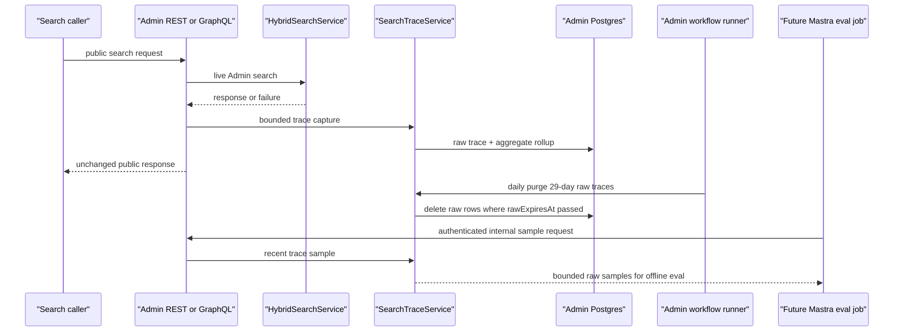

# feat: Add Admin search trace storage and retention

## Summary

Add Admin-owned production search trace storage, bounded best-effort capture from both public search entry points, 29-day raw expiry with daily purge, durable aggregate rollups, and a narrow authenticated internal sampling route for later Mastra eval work. Public REST and GraphQL search response shapes remain unchanged; Mastra stays out of the live request path.

---

## Problem Frame

Search quality work needs real viewer-intent queries, but the Mastra migration deliberately keeps live search orchestration and query embedding generation inside Admin. This plan gives Admin a short-lived raw trace store and a longer-lived aggregate trail so eval work can sample recent production behavior without retaining raw per-query data beyond 30 days (see origin: docs/brainstorms/2026-05-25-mastra-embedding-search-migration-requirements.md).

---

## Assumptions

_This plan was authored in pipeline mode without synchronous plan-confirmation. The items below are agent inferences that should be reviewed during implementation and code review._

- The feat-135 roadmap frontmatter still says `not-started`, but the user explicitly stated that feat-135 has moved the embedding ownership boundary into its hardened final shape; this plan proceeds from that newer context.
- The internal sampling contract can be a narrow Admin REST route guarded by a dedicated bearer CSV rather than a public GraphQL field.
- A daily workflow-runner purge is the right production retention mechanism only if raw rows expire before the 30-day ceiling, giving the daily run a safety margin.

---

## Requirements

- R17. Mastra must not participate in live user search handling, including live query embedding generation.
- R18. Admin must store production search query runs as the trace source of truth for no longer than 30 days.
- R19. Raw per-query traces must be deleted after 30 days; only aggregate metrics and human-approved sanitized eval queries may survive.
- R20. Admin must apply transparent first-pass query quality, sensitive-data, and abuse labels before storing or sampling production traces.

**Plan constraints:**

- C1. Search trace write and rollup failures must not fail live REST or GraphQL search responses.
- C2. Later Mastra eval work must use an authenticated Admin contract, not Admin database access or app-context imports.
- C3. Raw trace storage may keep short-lived query text only after first-pass sensitive-query handling; it must not store bearer tokens, cookies, IP addresses, full user identifiers, or unverified caller-supplied key identifiers.
- C4. When trace persistence is unavailable, Admin must emit safe loss metrics/logs so capture gaps are observable without logging raw query text.

**Origin actors:** A2 Admin, A3 Mastra, A5 Search evaluator.
**Origin flows:** F3 Search observability and eval generation.
**Origin acceptance examples:** AE4 Raw trace deletion with aggregate survival; AE5 Admin-only live search handling.

---

## Scope Boundaries

- Do not move live search orchestration or live query embedding generation into Mastra.
- Do not change public REST or GraphQL search response shapes.
- Do not expose raw traces through public REST or public GraphQL.
- Do not store bearer tokens, cookies, IP addresses, full user identifiers, or unverified caller-supplied key identifiers.
- Do not add CMS/Strapi fields, compatibility paths, or dependencies.
- Do not hand-edit generated GraphQL or Prisma outputs.

### Deferred to Follow-Up Work

- Human approval and promotion of sanitized eval queries: future search-eval work can add a durable promoted-query model or workflow after the raw trace sampling contract exists.
- Mastra-side trace sampling and LLM classification: Mastra will call the internal Admin route later; this plan only creates the Admin contract.
- Origin R21-R22 remain future eval-generation scope; feat-136 only enables Admin retention, aggregate rollups, and the internal sampling contract.

---

## Context & Research

### Relevant Code and Patterns

- `apps/admin/src/app/api/search/route.ts` and `apps/admin/src/graphql/queries/hybrid-search.ts` already share `HybridSearchService.search(...)`, bearer-as-passport auth, and plain-string request logs.
- `apps/admin/src/services/hybrid-search.service.ts` already distinguishes successful hybrid responses, embedding-provider degradation via `searchMode: "keyword-only"`, and partial retriever failures via `Promise.allSettled`.
- `apps/admin/src/auth/mastra-ingest-bearer.ts` and `apps/admin/src/app/api/internal/mastra/*/route.ts` provide the narrow internal-bearer route pattern to mirror.
- `apps/admin/src/services/video-db-backup/job.ts`, `apps/admin/src/workflows/videoDbBackup.ts`, and `apps/admin/src/instrumentation.ts` provide the existing daily scheduler and workflow-runner startup pattern.
- `apps/admin/src/services/search-eval/fingerprint.ts` demonstrates raw SQL invariant testing for search-adjacent analytical reads.

### Institutional Learnings

- Mastra workflow pattern docs keep the ownership line crisp: Mastra owns background embedding generation and Studio-visible diagnostics; Admin owns pgvector storage, public search contracts, and query-time retrieval.
- `docs/solutions/integration-issues/mastra-studio-api-auth-guard.md` warns against broad service-bearer route guards and supports narrow Forge-owned service routes.
- Search API authentication docs in `apps/admin/CLAUDE.md` require bearer logs to avoid raw secret values and preserve source tagging only after a known bearer match.
- Railway logsV2 drops JSON-stringified runtime logs in this stack; search-adjacent logging should stay in `[search] event=name key=value` format and avoid raw query text.

### External References

- None. The repo has current patterns for Next route handlers, Pothos GraphQL resolvers, Prisma migrations, internal bearers, and workflow schedulers; local ownership and privacy constraints are more specific than generic external guidance.

---

## Key Technical Decisions

- Store raw trace rows separately from aggregate rollups: raw rows may contain query text and are deleted by `rawExpiresAt`, while aggregate rows never contain query text and survive purge.
- Capture traces through shared Admin service helpers, not public response envelopes: REST and GraphQL can record route source and outcome while leaving client contracts unchanged.
- Treat trace persistence as bounded best-effort with observable loss: REST and GraphQL await trace recording only behind a short timeout budget, then swallow timeout/write failures so live search behavior stays unchanged while safe counters/logs expose capture gaps.
- Use a dedicated sampling bearer: future Mastra eval sampling should not reuse public search partner keys, consumer keys, backup download keys, or vector-ingest keys.
- Keep retrieval diagnostics internal: partial retriever failure labels and contributing retrievers may feed trace classification, but they must not become public REST or GraphQL fields.
- Use 29-day raw expiry plus the workflow runner for purge: raw trace deletion is a production lifecycle requirement, so the daily purge should start alongside other Admin worker schedulers and have one day of margin before the 30-day ceiling.
- Disable raw capture when retention is not healthy: if the retention scheduler cannot be confirmed active in production, capture aggregates and safe loss metrics only until the purge scheduler is healthy again.

---

## Open Questions

### Resolved During Planning

- Should sampling be public GraphQL or internal REST? Internal REST, because exposing raw trace data through public GraphQL would widen the public contract and trigger unnecessary SDL/codegen churn.
- Should trace rows retain caller identity details? No. The raw trace store should keep route source and execution metadata only; it should not retain bearer tokens, cookies, IPs, full user ids, or attempted key identifiers.

### Deferred to Implementation

- Exact latency bucket boundaries: choose a small stable bucket set while implementing tests around bucket classification.
- Exact aggregate grain: likely hourly or daily by locale, route, search mode, and failure/degradation class; settle the final unique key against Prisma index ergonomics during implementation.
- Final sampling filters: implement only the minimum needed for later Mastra eval work, such as locale, route, search mode, and limit.

---

## High-Level Technical Design

> _This illustrates the intended approach and is directional guidance for review, not implementation specification. The implementing agent should treat it as context, not code to reproduce._

---

## Implementation Units

### U1. Trace Schema And Configuration

**Goal:** Add Admin-owned storage for raw traces, aggregate rollups, and a dedicated sampling bearer without introducing new required boot-time env vars.

**Requirements:** R18, R19, R20, C2, C3, AE4.

**Dependencies:** None.

**Files:**

- Modify: `apps/admin/prisma/schema.prisma`
- Create: `apps/admin/prisma/migrations/0021_admin_search_trace_storage_retention/migration.sql`
- Modify: `apps/admin/src/config/env.ts`
- Test: `apps/admin/src/config/env.test.ts`

**Approach:**

- Add a raw trace model keyed by created/expires timestamps, route source, locale, pipeline mode, response search mode, result count, latency bucket, failure/degradation class, query quality label, sensitive-data label, abuse label, and sample eligibility.
- Add an aggregate model keyed by time bucket and non-query dimensions only; do not store raw query text in the aggregate table.
- Add an optional `SEARCH_TRACE_SAMPLING_API_KEYS` CSV and include it in the bearer disjointness invariant.
- Add a raw retention config only if implementation needs operator control; default raw row expiry to 29 days and validate any override as `1..29` so the daily purge can physically delete rows before the 30-day ceiling.
- Keep all new env vars optional or defaulted so preview/local deployments do not brick before operators provision keys.

**Execution note:** Start with schema/env tests that lock the no-secret/no-required-env and 30-day retention constraints before wiring callers.

**Patterns to follow:**

- `apps/admin/prisma/schema.prisma` mapped field/index style.
- `apps/admin/src/config/env.ts` bearer CSV disjointness invariant and optional-env pattern.
- `docs/solutions/runtime-errors/required-env-var-without-default-broke-railway-deploy-20260511.md`.

**Test scenarios:**

- Happy path: schema contains indexed expiration and aggregate bucket columns that support purge and rollup reads.
- Edge case: missing sampling bearer env still lets env validation pass.
- Edge case: retention config cannot exceed 29 days when purge runs daily.
- Error path: duplicate sampling bearer value across existing bearer CSVs fails the disjointness check with values redacted.
- Privacy: raw trace model has no token, cookie, IP, or user-id columns.
- Privacy: raw trace model has explicit quality/sensitive/abuse label fields and sample eligibility so sensitive rows are not sampled by default.

**Verification:**

- Prisma generation succeeds after the migration and schema update.
- Env tests prove the new sampling key is optional and disjoint from other bearer CSVs.

---

### U2. Trace Capture, Rollup, And Purge Services

**Goal:** Create service-layer APIs for best-effort trace recording, aggregate upsert, recent sampling, and raw trace purge.

**Requirements:** R18, R19, R20, C1, C2, C3, C4, AE4.

**Dependencies:** U1.

**Files:**

- Create: `apps/admin/src/services/search-trace.service.ts`
- Test: `apps/admin/src/services/search-trace.service.test.ts`
- Create: `apps/admin/src/services/search-trace-health.ts`
- Test: `apps/admin/src/services/search-trace-health.test.ts`
- Create: `apps/admin/src/services/search-trace-privacy.ts`
- Test: `apps/admin/src/services/search-trace-privacy.test.ts`
- Create: `apps/admin/src/services/search-trace-retention.service.ts`
- Test: `apps/admin/src/services/search-trace-retention.service.test.ts`
- Modify: `apps/admin/src/services/search-eval/fingerprint.ts`
- Test: `apps/admin/src/services/search-eval/fingerprint.test.ts`

**Approach:**

- Normalize trace inputs into a compact record: query text or redacted query text, locale, route source, requested pipeline mode, response search mode, result count, latency bucket, degradation/failure class, first-pass quality/sensitive/abuse labels, sampling eligibility, started/completed timestamps, and raw expiration timestamp no later than 29 days after creation.
- Add a first-pass privacy classifier for obvious emails, phone-like strings, token-like strings, credential patterns, and abuse categories. Sensitive matches should store a redacted query plus non-sampleable label rather than exportable raw text.
- Upsert aggregate counters by non-query dimensions and time bucket in the same best-effort path, so aggregate survival does not depend on raw trace retention.
- Add a purge service that deletes rows whose raw expiration has passed and reports counts only.
- Add process-local trace health counters for successful writes, timed-out writes, failed writes, and raw-capture-disabled events; logs must use plain key/value format and omit raw query text.
- Add a companion trace aggregate fingerprint helper without changing the existing `Fingerprint` baseline schema, so eval tools can opt into trace-store drift checks without invalidating schemaVersion 1 baselines.

**Execution note:** Implement service behavior test-first because it owns the privacy and retention invariants.

**Patterns to follow:**

- `apps/admin/src/services/hybrid-search.service.ts` best-effort degradation posture.
- `apps/admin/src/services/search-eval/fingerprint.ts` single-query analytical reads and SQL invariant tests.
- `docs/solutions/best-practices/prisma-raw-sql-invariant-assertions-20260423.md`.

**Test scenarios:**

- Covers AE4. Happy path: recording a successful hybrid REST trace stores allowed query text with an expiration at or before 29 days and increments an aggregate row without query text.
- Error path: obvious sensitive or credential-like query text is redacted, marked non-sampleable, and excluded from default sampling.
- Happy path: recording a keyword-only response classifies embedding degradation and increments the matching aggregate dimension.
- Error path: a Prisma create/upsert failure is caught, logged without query text, and resolves without throwing to the caller.
- Error path: timed-out or failed trace writes increment safe loss counters and log no query text.
- Error path: purge deletes only expired raw traces and does not delete aggregate rows.
- Privacy: sampling output excludes tokens, cookies, IPs, full user identifiers, and unverified caller-supplied key identifiers.
- Integration: aggregate counters remain readable after all matching raw traces are purged.
- Integration: companion trace fingerprint output can describe aggregate trace state without exposing query text or changing existing baseline schemas.

**Verification:**

- Service tests show raw trace capture, rollup survival, and purge behavior are separated and privacy-safe.

---

### U3. REST And GraphQL Search Instrumentation

**Goal:** Instrument successful, degraded, and failed search attempts from both public search entry points without changing public response shapes.

**Requirements:** R17, R18, R20, C1, C4, AE5.

**Dependencies:** U2.

**Files:**

- Modify: `apps/admin/src/app/api/search/route.ts`
- Test: `apps/admin/src/app/api/search/route.test.ts`
- Modify: `apps/admin/src/graphql/queries/hybrid-search.ts`
- Test: `apps/admin/src/graphql/queries/hybrid-search.test.ts`
- Modify: `apps/admin/src/services/hybrid-search.service.ts`
- Test: `apps/admin/src/services/hybrid-search.service.test.ts`

**Approach:**

- Time each valid live search attempt and record traces after the service returns or throws.
- Use `routeSource` values that distinguish REST from GraphQL; classify success, keyword-only degradation, retrieval partial failure where available, and service failure.
- Keep invalid-argument and unauthenticated requests out of raw production query tracing unless implementation discovers a strong reason to trace rejected input; the roadmap asks for production search query runs, not request-probing logs.
- Surface internal non-response metadata such as retriever failure class, failed retriever labels, and contributing retrievers through an internal execution summary used by the route/resolver, not through REST JSON or GraphQL fields.
- Await trace recording behind a strict short timeout budget; on timeout or write failure, increment safe loss counters, log safely, and return or throw the original search outcome unchanged. Do not add an outbox or queue in this PR.
- Ensure trace failures are logged in plain key/value format without raw query text and never change the live response/throw behavior.

**Execution note:** Add characterization assertions around existing response bodies before adding trace side effects.

**Patterns to follow:**

- Existing `event=search.request` logging in REST and GraphQL search.
- Existing `query_embedding_failure` degradation path in `HybridSearchService`.
- `docs/solutions/runtime-errors/railway-logsv2-silences-nextjs-stdout-runtime-20260518.md`.

**Test scenarios:**

- Covers AE5. Happy path: REST `200` search response body remains byte-shape equivalent while the trace recorder receives query, locale, route source, result count, latency bucket, and search mode.
- Covers AE5. Happy path: GraphQL resolver return value remains the existing `HybridSearchResponse` while the trace recorder receives the same metadata with route source `graphql`.
- Error path: service throws; REST still returns the existing `503` body and records a failed trace best-effort.
- Error path: GraphQL service throw propagates as before and records a failed trace best-effort.
- Error path: trace recorder throws; REST and GraphQL outcomes remain unchanged and logs do not contain the raw query.
- Error path: trace recorder exceeds its timeout budget; REST and GraphQL outcomes remain unchanged and timeout logging omits raw query text.
- Edge case: keyword-only degradation records a degradation class while still returning the existing degraded response.
- Edge case: partial retriever failure records failed retriever labels distinctly from a legitimate zero-result search.

**Verification:**

- REST and GraphQL tests prove response shapes are unchanged and trace side effects are best-effort.

---

### U4. Internal Sampling Contract

**Goal:** Add a narrow authenticated Admin route that lets future Mastra eval jobs sample recent raw traces without database access.

**Requirements:** R19, R20, C2, C3.

**Dependencies:** U1, U2.

**Files:**

- Create: `apps/admin/src/auth/search-trace-bearer.ts`
- Test: `apps/admin/src/auth/search-trace-bearer.test.ts`
- Create: `apps/admin/src/app/api/internal/search-traces/sample/route.ts`
- Test: `apps/admin/src/app/api/internal/search-traces/sample/route.test.ts`

**Approach:**

- Rate-limit the sampling route before auth/body parsing, then validate a dedicated `SEARCH_TRACE_SAMPLING_API_KEYS` bearer before parsing filters.
- Return a bounded sample of recent, unexpired, sample-eligible raw traces with minimal fields needed for offline eval generation: query text, locale, route source, search mode, result count, latency bucket, degradation/failure class, quality/sensitive/abuse labels, and timestamp.
- Support simple filters such as locale, route source, mode, since, until, and limit; clamp limits and maximum time windows server-side. Default maximum sampling window should be small, such as 24 hours, with broader windows requiring an explicit server-side allowlist or follow-up.
- Reject any bearer not in `SEARCH_TRACE_SAMPLING_API_KEYS`; env validation must reject a sampling key that duplicates any public search, backup download, Mastra ingest, or workflow launch bearer.
- Emit structured audit logs with auth outcome, filter dimensions, result count, and no query text.

**Patterns to follow:**

- `apps/admin/src/auth/mastra-ingest-bearer.ts` narrow capability bearer.
- `apps/admin/src/app/api/internal/mastra/experience-embeddings/route.ts` auth-before-body route shape.
- `docs/solutions/architecture-patterns/parity-bearer-narrow-carveout-pattern-20260513.md`.

**Test scenarios:**

- Happy path: valid sampling bearer returns bounded recent samples and omits aggregate-only rows.
- Error path: missing or wrong bearer returns unauthorized before reading the request body.
- Error path: rate-limited requests return before auth/body parsing.
- Edge case: over-large limit and time window are clamped and do not return expired or non-sampleable rows.
- Privacy: response contains no bearer token, cookie, IP, full user id, vector, or debug scoring payload.
- Privacy: sensitive-query rows are excluded by default even while their redacted raw trace rows remain unexpired.
- Integration: service sampling call receives parsed filters and never exposes raw traces publicly through GraphQL.

**Verification:**

- Internal route tests prove authentication, filtering, response minimization, and no-public-contract changes.

---

### U5. Scheduled Retention Workflow

**Goal:** Run raw trace purge automatically from the Admin workflow runner so raw per-query trace data does not survive beyond the retention window.

**Requirements:** R19, C1, C4, AE4.

**Dependencies:** U2.

**Files:**

- Create: `apps/admin/src/workflows/searchTraceRetention.ts`
- Test: `apps/admin/src/workflows/searchTraceRetention.test.ts`
- Create: `apps/admin/src/services/search-trace-retention/job.ts`
- Test: `apps/admin/src/services/search-trace-retention/job.test.ts`
- Modify: `apps/admin/src/app/api/search/health/route.ts`
- Test: `apps/admin/src/app/api/search/health/route.test.ts`
- Modify: `apps/admin/src/instrumentation.ts`
- Test: `apps/admin/src/instrumentation.test.ts`

**Approach:**

- Add a daily scheduler workflow that invokes the purge service and records only counts/timestamps in the workflow ledger. Because raw rows expire at or before 29 days, the next daily purge deletes them before the 30-day physical retention ceiling during normal worker operation.
- Guard scheduler startup with the same duplicate-run protection used by the video DB backup scheduler.
- Add a retention health check that can confirm an active retention scheduler or recent purge heartbeat. In production, raw trace capture should be disabled and counted/logged when retention health is absent, while aggregate-only counters may continue.
- Keep purge failures out of the live search path; failures should appear in workflow logs/ledger and retry on the next schedule.
- Use aggregate rows as the long-lived analytical record; do not copy raw query text into workflow details.

**Patterns to follow:**

- `apps/admin/src/services/video-db-backup/job.ts`
- `apps/admin/src/workflows/videoDbBackup.ts`
- `apps/admin/src/instrumentation.ts`

**Test scenarios:**

- Covers AE4. Happy path: scheduler dispatches one purge workflow and records a ledger summary with purged count only.
- Edge case: a trace created just after one daily purge expires at day 29 and is deleted by the next daily run before age 30 days.
- Error path: when the worker scheduler is disabled or unhealthy, raw capture is disabled, aggregate/loss counters remain safe, and `/api/search/health` reports the retention degradation.
- Edge case: existing active scheduler prevents duplicate startup.
- Error path: purge failure marks the ledger failed without exposing raw query text.
- Integration: instrumentation starts the search trace retention scheduler only when the workflow runner is enabled.

**Verification:**

- Workflow tests prove daily purge startup, duplicate prevention, and safe ledger details.

---

### U6. Documentation And Roadmap Closeout

**Goal:** Document the final Admin/Mastra search trace ownership and retention model, then complete the roadmap ticket when validation passes.

**Requirements:** R17, R18, R19, R20, C2, C3.

**Dependencies:** U1, U2, U3, U4, U5.

**Files:**

- Modify: `apps/admin/AGENTS.md`
- Modify: `apps/admin/CLAUDE.md`
- Modify: `docs/roadmap/content-discovery/feat-136-admin-search-trace-storage-retention.md`
- Create or modify: `docs/solutions/platform/admin-search-trace-retention-pattern.md`

**Approach:**

- Add package-guide notes explaining Admin-owned live search traces, raw 30-day retention, aggregate survival, and narrow internal sampling.
- Add a durable solution note that explicitly says Mastra samples through Admin HTTP contracts and never imports Admin code or reads Admin DB directly.
- Mark the roadmap ticket complete only after focused validation passes; create a follow-up ticket for sanitized eval promotion if implementation reveals concrete scope.

**Patterns to follow:**

- Existing Mastra workflow pattern docs in `docs/solutions/platform/`.
- Root roadmap status rules in `AGENTS.md` and `CLAUDE.md`.

**Test scenarios:**

- Test expectation: none -- documentation-only unit, validated by review and roadmap consistency.

**Verification:**

- Docs capture the final ownership/retention model and the roadmap ticket status reflects the implementation outcome.

---

## System-Wide Impact

- **Interaction graph:** REST search, GraphQL search, `HybridSearchService`, new trace services, Prisma persistence, internal sampling route, and workflow instrumentation are affected.
- **Error propagation:** search and trace failures are intentionally separated; trace writes and rollups log safely and do not alter REST/GraphQL responses.
- **State lifecycle risks:** raw query text has a hard expiration and scheduled purge; aggregates survive without query text.
- **API surface parity:** public REST and GraphQL search shapes remain unchanged; the only new API is internal and bearer-gated.
- **Integration coverage:** tests must cover successful, degraded, and failed search attempts across both public entry points plus purge and sampling boundaries.
- **Unchanged invariants:** Admin remains the live search authority; Mastra remains a later offline sampler/evaluator through authenticated Admin HTTP.

---

## Risks & Dependencies

| Risk                                                        | Mitigation                                                                                                                                                       |
| ----------------------------------------------------------- | ---------------------------------------------------------------------------------------------------------------------------------------------------------------- |
| Raw query text accidentally retained longer than 30 days    | Set raw expiry no later than 29 days, filter sampling to unexpired rows, and run a daily purge workflow with tests proving physical deletion before age 30 days. |
| Trace failures impact search availability                   | Make trace writes best-effort and assert failure swallowing at REST, GraphQL, and service levels.                                                                |
| Internal sampling route becomes a public data leak          | Use a dedicated disjoint bearer, auth before body parse, no public GraphQL field, and minimal response fields.                                                   |
| A valid sampling bearer exports sensitive pasted query text | First-pass classify and redact obvious PII, credential-like, token-like, and abuse queries; mark those rows non-sampleable by default.                           |
| Aggregates accidentally retain query text                   | Separate aggregate table/schema and test that aggregate payloads contain counters/dimensions only.                                                               |
| Public search response drift                                | Characterize current REST/GraphQL response bodies and avoid Pothos schema changes.                                                                               |

---

## Documentation / Operational Notes

- Operators must provision `SEARCH_TRACE_SAMPLING_API_KEYS` only for trusted internal eval callers after the route ships.
- The Admin worker service must keep `WORKFLOW_RUNNER_ENABLED=true` and `WORKFLOW_TARGET_WORLD=@workflow/world-postgres` for scheduled purge execution, matching the existing worker pattern.
- If a future PR promotes sanitized eval queries, it must create a separate human-approval model and never reuse raw trace rows as long-lived benchmarks.

---

## Sources & References

- **Origin document:** [docs/brainstorms/2026-05-25-mastra-embedding-search-migration-requirements.md](../brainstorms/2026-05-25-mastra-embedding-search-migration-requirements.md)
- Roadmap ticket: [docs/roadmap/content-discovery/feat-136-admin-search-trace-storage-retention.md](../roadmap/content-discovery/feat-136-admin-search-trace-storage-retention.md)
- Admin guide: [apps/admin/CLAUDE.md](../../apps/admin/CLAUDE.md)
- Search REST entry: [apps/admin/src/app/api/search/route.ts](../../apps/admin/src/app/api/search/route.ts)
- Search GraphQL entry: [apps/admin/src/graphql/queries/hybrid-search.ts](../../apps/admin/src/graphql/queries/hybrid-search.ts)
- Search service: [apps/admin/src/services/hybrid-search.service.ts](../../apps/admin/src/services/hybrid-search.service.ts)
- Mastra transcript pattern: [docs/solutions/platform/mastra-transcript-embedding-workflow-pattern.md](../solutions/platform/mastra-transcript-embedding-workflow-pattern.md)
- Mastra scene pattern: [docs/solutions/platform/mastra-scene-embedding-workflow-pattern.md](../solutions/platform/mastra-scene-embedding-workflow-pattern.md)
- Mastra experience pattern: [docs/solutions/platform/mastra-experience-embedding-workflow-pattern.md](../solutions/platform/mastra-experience-embedding-workflow-pattern.md)
- Studio auth guard learning: [docs/solutions/integration-issues/mastra-studio-api-auth-guard.md](../solutions/integration-issues/mastra-studio-api-auth-guard.md)
