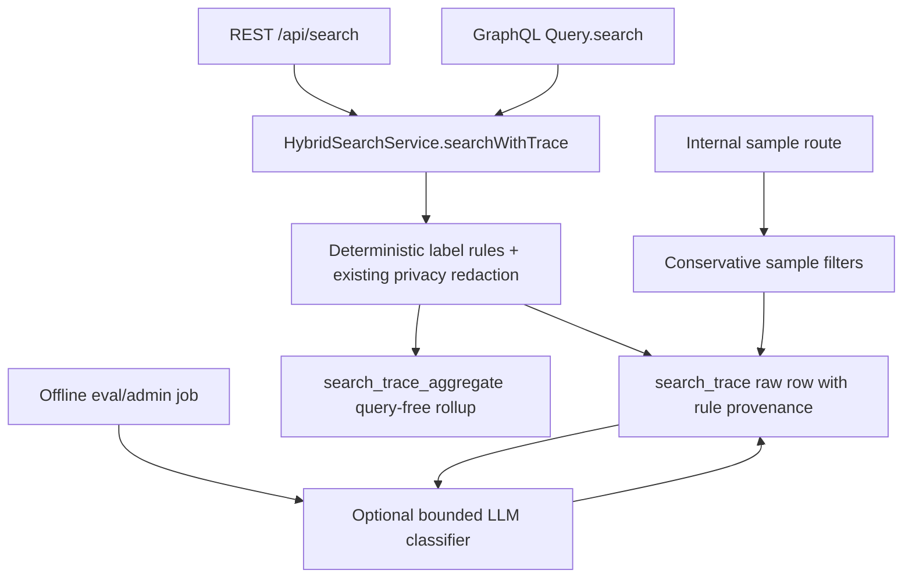

# feat: Search query quality and abuse labeling

## Summary

Add the feat-137 labeling contract on top of the feat-136 Admin search trace storage: deterministic query usefulness and abuse labels, auditable provenance, conservative sampling filters, and a bounded optional LLM classifier that only runs outside the live search request path.

---

## Problem Frame

Feat-136 made Admin the source of truth for short-lived production search traces and gave those rows first-pass `queryQualityLabel`, `sensitiveQueryLabel`, `abuseLabel`, and `sampleEligible` fields. Feat-137 needs to turn those placeholders into a stable contract Mastra can trust later: transparent rules first, privacy labeling kept separate, optional LLM classification only for ambiguous or high-impact samples, and sampling defaults that do not promote low-signal or abusive traces into eval generation.

This plan carries forward R17-R20 from `docs/brainstorms/2026-05-25-mastra-embedding-search-migration-requirements.md`, especially the ownership line that Admin serves live search while Mastra samples traces later through authenticated Admin HTTP.

---

## Requirements

**Rules and provenance**

- R1. Production trace writes classify the normalized query through deterministic rules before persistence, using stable labels for valid viewer intent, empty or too-short input, navigational intent, catalog lookup, malformed input, repeated spam, abusive content, prompt-injection-like content, and unknown or ambiguous input.
- R2. Privacy and sensitivity redaction stays separate from usefulness/intent labeling. Sensitive text is still redacted before raw trace storage and remains excluded from default sampling.
- R3. Raw trace rows store label provenance: rule label source, rule label version, rule label timestamp, plus a separate optional LLM label source/version/timestamp/result when offline classification runs.
- R4. Aggregate rows stay query-free while preserving enough label dimensions to avoid mixing incompatible rule versions in long-lived rollups.

**Sampling and optional LLM classification**

- R5. Internal trace sampling defaults to valid viewer-intent candidates only and excludes sensitive, abusive, prompt-injection-like, repeated-spam, malformed, and other low-signal queries unless the caller explicitly requests broader classes.
- R6. The optional LLM classifier is bounded, schema-validated, prompt-sanitized, result-sanitized, and callable only from offline/admin eval code. It must not run from REST or GraphQL live search request handling.
- R7. LLM classification never stores tokens, cookies, IP addresses, full user identifiers, caller bearer key ids, raw sensitive data, or provider token counts in trace rows.

**Existing contracts**

- R8. REST and GraphQL search response shapes remain unchanged, and labels are not used to censor, rerank, or otherwise alter live search results in this ticket.
- R9. Trace write, deterministic labeling, and optional classifier persistence failures do not fail live search responses.
- R10. Raw per-query trace rows still expire before the 30-day ceiling; aggregate rows remain query-free and may survive raw purge.
- R11. CMS/Strapi support is not added, preserved, or depended on. Admin/Core-owned traces and content references remain the only surface.
- R12. Package guides, roadmap status, and durable solution notes document the final labeling model.

---

## High-Level Technical Design

The live path only executes deterministic rules and existing redaction before the best-effort trace write. The optional LLM classifier is a separate offline service path that can update LLM-specific provenance fields for traces selected after sampling.

---

## Key Technical Decisions

- KTD1. Keep privacy redaction as its own concern: `apps/admin/src/services/search-trace-privacy.ts` should continue to own secret/user-data redaction and sensitivity labels, while the fuller query usefulness and abuse contract can be implemented beside it or as a dedicated helper consumed by it. This preserves the feat-136 safety behavior while replacing the placeholder quality labels.
- KTD2. Use string label columns rather than Prisma enums for the new label contract. The existing trace fields are strings, and versioned provenance makes future rule evolution auditable without requiring enum migrations for every label wording change.
- KTD3. Version deterministic labels at write time. Old rows keep their historical rule version and timestamp; no backfill is included unless a future ticket deliberately adds one.
- KTD4. Keep optional LLM labels separate from rule labels. Rule labels remain the default source for sampling and aggregates; LLM output is additional evidence for ambiguous or high-impact samples, not a replacement for the deterministic contract.
- KTD5. Default sampling is conservative. `sampleEligible` should mean "valid viewer-intent, non-sensitive, non-abusive, non-low-signal, unexpired raw trace"; broader classes require explicit filters.
- KTD6. Do not expand the public search contract. REST/GraphQL instrumentation may write richer traces internally, but public response envelopes and schema remain stable.

---

## Implementation Units

### U1. Schema and Migration for Label Provenance

**Goal:** Add auditable label provenance and optional LLM label fields to `SearchTrace`, and keep aggregates query-free while version-aware.

**Requirements:** R3, R4, R7, R10

**Dependencies:** None

**Files:**

- `apps/admin/prisma/schema.prisma`
- `apps/admin/prisma/migrations/0022_search_trace_query_label_provenance/migration.sql`
- `apps/admin/src/services/search-trace.service.test.ts`

**Approach:** Add rule provenance columns such as rule source/version/timestamp to raw traces and aggregate dimensions. Add nullable LLM-specific label/provenance fields only to raw traces so offline classification can annotate a trace without changing the query-free aggregate contract. Keep all fields compact `varchar` or `DateTime`; do not add token, prompt, cookie, IP, user id, bearer, vector, or scoring columns.

**Patterns to follow:** Feat-136 `SearchTrace` and `SearchTraceAggregate` models, migration `0021_admin_search_trace_storage_retention`, and the schema privacy guard in `search-trace.service.test.ts`.

**Test scenarios:**

- New raw trace create data includes deterministic label source, version, and timestamp.
- Aggregate upsert dimensions include rule label version/source but not query text or any banned sensitive/debug fields.
- Schema regression still rejects bearer/cookie/IP/user/vector/scoring columns on raw trace.

**Verification:** Prisma validate/generate succeeds and trace service tests assert the new storage contract.

### U2. Deterministic Rules-First Query Labeler

**Goal:** Replace placeholder quality labels with the feat-137 deterministic usefulness and abuse rules while preserving privacy redaction.

**Requirements:** R1, R2, R5, R8, R9

**Dependencies:** U1

**Files:**

- `apps/admin/src/services/search-trace-privacy.ts`
- `apps/admin/src/services/search-trace-privacy.test.ts`
- `apps/admin/src/services/search-trace.service.ts`
- `apps/admin/src/services/search-trace.service.test.ts`

**Approach:** Normalize whitespace once, run sensitivity redaction first, then classify the redacted/normalized query into stable rule labels. Recommended contract: `queryQualityLabel` covers `valid_viewer_intent`, `empty_too_short`, `navigational`, `catalog_lookup`, `malformed`, and `unknown_ambiguous`; `abuseLabel` covers `none`, `repeated_spam`, `abusive`, and `prompt_injection_like`. `sampleEligible` is true only for rule-labeled valid viewer intent with no sensitivity or abuse labels.

**Patterns to follow:** Existing regex reset helper, bounded retained query text length, and tests proving raw sensitive values are redacted.

**Test scenarios:**

- Valid viewer query like "Jesus film for kids" stores `valid_viewer_intent`, no abuse, and is sample-eligible.
- Empty, one-character, punctuation-only, URL-only, route-like, and search-engine syntax inputs are low-signal or malformed and not sample-eligible.
- Catalog lookup inputs such as exact titles, scripture references, or known content lookup phrases are labeled `catalog_lookup` and only sampled when explicitly requested later.
- Repeated spam, abusive terms, and prompt-injection-like strings receive abuse labels and remain non-sampleable.
- Sensitive values are redacted before storage and sensitivity remains independent from query usefulness.

**Verification:** Privacy and trace service tests lock the rules-first behavior without any LLM call.

### U3. Conservative Sampling Filters

**Goal:** Let future Mastra eval generation request valid candidate traces by default while allowing explicit, bounded broader sampling for analysis.

**Requirements:** R5, R7, R10, R11

**Dependencies:** U1, U2

**Files:**

- `apps/admin/src/services/search-trace.service.ts`
- `apps/admin/src/services/search-trace.service.test.ts`
- `apps/admin/src/app/api/internal/search-traces/sample/route.ts`
- `apps/admin/src/app/api/internal/search-traces/sample/route.test.ts`

**Approach:** Extend `SearchTraceSampleFilters` and the internal route parser with allowlisted arrays or explicit boolean switches for query quality labels, abuse labels, sensitivity labels, and LLM-classification candidate selection. The default service `where` clause should remain valid-viewer-intent, non-sensitive, non-abusive, sample-eligible, unexpired rows. Keep the JSON body bounded and reject malformed filter values rather than silently broadening.

**Patterns to follow:** Current sampling route body cap, auth-before-body-read ordering, log sanitization, and `sampleWindow` one-day clamp.

**Test scenarios:**

- Empty filter body samples only valid, non-sensitive, non-abusive, unexpired rows.
- Explicit quality label filters can include catalog lookup or unknown/ambiguous rows without including sensitive or abusive rows unless separately requested.
- Explicit abuse/sensitive filters are validated against known label values and never accept arbitrary strings.
- Route rejects malformed arrays, booleans, dates, and limits without calling `sampleSearchTraces`.
- Response still omits bearer, cookie, IP, full user id, vector, score, and raw sensitive data.

**Verification:** Internal sampling route tests and trace service tests cover the default and broadening cases.

### U4. Optional Offline LLM Query Classifier

**Goal:** Add a bounded classifier for ambiguous or high-impact samples that uses the existing OpenRouter eval style but cannot run in live search handling.

**Requirements:** R6, R7, R8, R9

**Dependencies:** U1, U2

**Files:**

- `apps/admin/src/services/search-eval/query-classifier.ts`
- `apps/admin/src/services/search-eval/query-classifier.test.ts`
- `apps/admin/src/services/search-eval/openrouter-helpers.ts`
- `apps/admin/src/services/search-trace.service.ts`
- `apps/admin/src/services/search-trace.service.test.ts`
- `apps/admin/src/services/search-eval/query-generator.test.ts`

**Approach:** Create an eval-only classifier factory with injected `fetch`, API key, model, timeout, max token budget, and strict JSON schema output. It accepts already-redacted query text plus non-sensitive trace facts, rejects obviously sensitive/abusive inputs unless the caller explicitly allows review, and returns compact labels/reason codes. A service helper can persist the LLM-specific fields for a trace after checking it is ambiguous or high-impact; REST and GraphQL search routes must not import or call this classifier.

**Patterns to follow:** `query-generator.ts` factory shape, `openrouter-helpers.ts` response extraction, schema validation via Zod, and bounded body/error handling.

**Test scenarios:**

- Classifier builds prompts from redacted query text only and omits bearer/cookie/IP/user id/token/count fields.
- Non-2xx, invalid JSON, schema mismatch, and timeout paths throw typed classifier errors without exposing raw query text.
- Classifier refuses non-ambiguous/non-high-impact traces by default.
- Persistence helper writes only LLM label/provenance fields and does not alter deterministic rule labels.
- REST and GraphQL route tests continue to prove trace writes happen without any classifier import/call.

**Verification:** New classifier tests plus existing route tests demonstrate the LLM path is offline-only.

### U5. Public Search Contract Regression

**Goal:** Ensure richer internal labeling does not alter public REST or GraphQL search behavior.

**Requirements:** R8, R9

**Dependencies:** U2

**Files:**

- `apps/admin/src/app/api/search/route.test.ts`
- `apps/admin/src/graphql/queries/hybrid-search.test.ts`
- `apps/admin/src/services/hybrid-search.service.test.ts`

**Approach:** Keep live endpoints passing the raw query to the hybrid search service exactly as before; only the trace write receives richer labels. Update assertions around `recordSearchTraceSafely` if needed, but do not add label fields to public response fixtures.

**Patterns to follow:** Existing tests that mock trace write failures and assert responses still succeed.

**Test scenarios:**

- Successful REST and GraphQL searches still return the same envelope fields.
- Trace write failures still do not fail live search.
- Invalid boundary inputs still return/throw the same public errors and do not write traces before query/locale validation.

**Verification:** Focused REST, GraphQL, and hybrid-search tests pass with no schema output change.

### U6. Documentation and Roadmap Completion

**Goal:** Document the final label model and mark feat-137 complete only after validation passes.

**Requirements:** R12

**Dependencies:** U1, U2, U3, U4, U5

**Files:**

- `apps/admin/AGENTS.md`
- `apps/admin/CLAUDE.md`
- `docs/roadmap/content-discovery/feat-137-search-query-quality-abuse-labeling.md`
- `docs/solutions/platform/admin-search-trace-retention-pattern.md`
- `docs/solutions/platform/admin-search-query-labeling-pattern.md`

**Approach:** Update admin package guidance with the rule-label contract, sampling defaults, and LLM offline-only boundary. Extend the existing retention solution note and add a focused durable solution note if the final implementation introduces reusable labeling patterns. Flip the roadmap ticket from `in-progress` to `complete` after implementation and validation.

**Patterns to follow:** Existing admin search trace retention package guide section and solution-note frontmatter.

**Test scenarios:** Test expectation: none -- documentation-only changes are verified by review and roadmap frontmatter.

**Verification:** Docs describe the final implementation accurately and do not mention CMS/Strapi dependencies as live support.

---

## System-Wide Impact

This work affects Admin's trace schema, trace write service, internal sampling contract, and search-eval service code. Public REST and GraphQL search contracts are intentionally unaffected. Mastra remains outside the live search request path and future sampling continues through Admin HTTP only.

---

## Risks & Dependencies

- Prisma migration risk: Adding aggregate dimensions changes the aggregate uniqueness key. The migration must preserve existing rows by adding defaults and replacing the unique index deliberately.
- Label drift risk: Future rule changes can make historical labels confusing unless the rule version is stored and included in aggregate dimensions.
- LLM safety risk: Prompt and result logging must stay sanitized; tests should inspect serialized prompts/results for banned fields.
- Sampling risk: Broad filters could accidentally include sensitive or abusive rows. The default must remain conservative and broader classes must be opt-in and allowlisted.

---

## Acceptance Examples

- AE1. Given a valid viewer-intent query is searched through REST or GraphQL, when trace persistence succeeds, the raw trace stores redacted query text, deterministic rule labels, provenance, and a sample-eligible flag without changing the public response.
- AE2. Given a query contains credentials, cookies, IPs, or full user identifiers, when trace persistence runs, sensitive values are redacted and the row is excluded from default sampling regardless of usefulness label.
- AE3. Given Mastra later calls the internal sampling route with no broadening filters, when eligible rows exist, the response includes only valid viewer-intent, non-sensitive, non-abusive, unexpired traces.
- AE4. Given an ambiguous high-impact trace is classified offline, when the optional LLM classifier succeeds, only LLM-specific label/provenance fields are updated and deterministic rule labels remain intact.
- AE5. Given trace labeling or write persistence fails, when live search completes, REST/GraphQL still return the same success or failure response they would have returned before feat-137.

---

## Sources / Research

- `docs/roadmap/content-discovery/feat-137-search-query-quality-abuse-labeling.md`
- `docs/roadmap/content-discovery/feat-136-admin-search-trace-storage-retention.md`
- `docs/brainstorms/2026-05-25-mastra-embedding-search-migration-requirements.md`
- `docs/solutions/platform/admin-search-trace-retention-pattern.md`
- `apps/admin/src/services/search-trace-privacy.ts`
- `apps/admin/src/services/search-trace.service.ts`
- `apps/admin/src/app/api/internal/search-traces/sample/route.ts`
- `apps/admin/src/services/search-eval/query-generator.ts`
- `apps/admin/src/services/search-eval/openrouter-helpers.ts`
