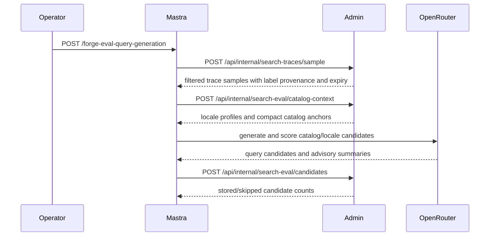
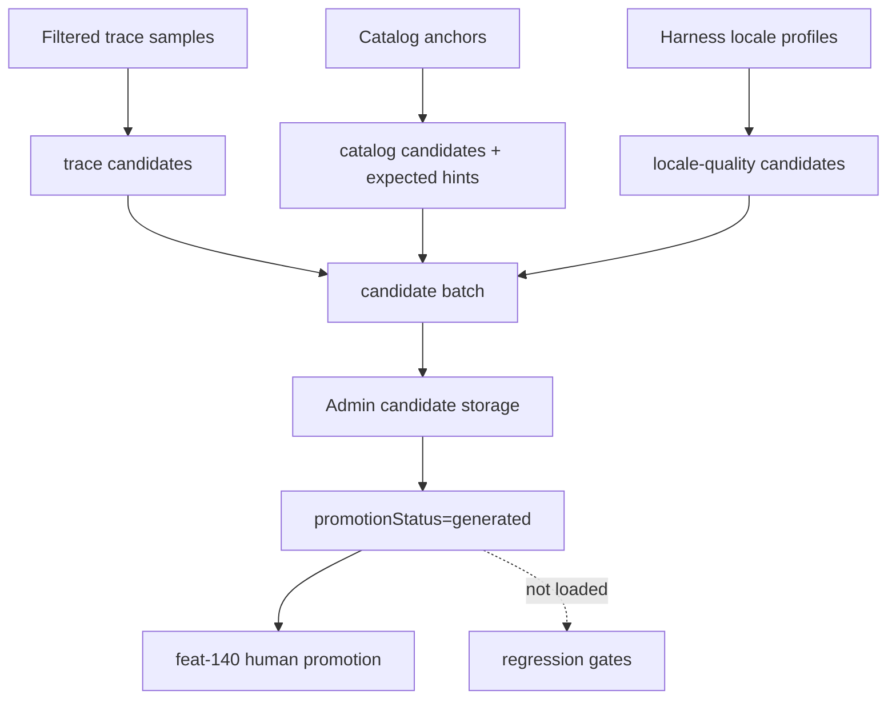

# feat: Add Mastra eval query generation

## Summary

Add a Mastra-owned eval query generation workflow that builds candidate search evals from catalog anchors, locale-quality gaps, and filtered Admin search traces, then stores those candidates through authenticated Admin HTTP contracts. Admin remains the live search and trace authority; generated candidates stay outside permanent regression gates unless later sanitized and human-promoted.

---

## Problem Frame

The search eval harness already supports synthetic queries, regressions, judge comparison, and committed baselines, but feat-138 needs the next offline loop: Mastra should generate candidate eval queries from the content and trace signals created by the embedding migration while Admin keeps ownership of raw traces, catalog data, vector storage, live query embeddings, and public search.

This plan covers the full eval-generation slice of the brainstorm's search observability flow. It deliberately does not start legacy index cleanup, does not introduce CMS/Strapi compatibility, and does not place Mastra on any live search request path.

---

## Requirements

**Candidate Sources**

- R1. Mastra generates eval candidates from three sources: catalog-derived context, locale-quality needs, and real viewer-intent traces sampled from Admin.
- R2. Catalog-derived candidates include source anchors and expected-result hints when the source item makes the expected result obvious.
- R3. Locale-quality candidates use the existing harness locale posture and do not data-derive a drifting runtime locale set.
- R4. Trace-derived candidates default to valid viewer intent, non-sensitive, non-abusive, sample-eligible, unexpired traces only.

**Admin Contracts And Storage**

- R5. Mastra reads trace and catalog context only through authenticated Admin HTTP contracts and never imports Admin code or connects to Admin Postgres.
- R6. Admin returns only the compact catalog/trace context needed for eval generation; responses exclude vectors, bearer data, cookies, IPs, user ids, raw scoring payloads, and unrelated catalog fields.
- R7. Generated candidates are stored with source, locale, label provenance, generation model, source anchors, expected-result hints, judge summary, Mastra run identity, and promotion status.
- R8. Trace-sourced candidate rows do not retain raw trace-derived query text beyond the source trace retention window unless a later human-promotion workflow takes ownership.

**Truth Model And Boundaries**

- R9. Judge scoring remains advisory candidate metadata and is separate from human-promoted regression truth.
- R10. Generated candidates are not loaded into committed baselines, synthetic query files, or regression gates in this feature.
- R11. Live Admin search orchestration and live query embedding generation remain Admin-owned.
- R12. Documentation describes the final Admin-to-Mastra-to-Admin eval generation flow and the operator boundaries around promotion.

---

## Assumptions

- The existing `SEARCH_TRACE_SAMPLING_API_KEYS` bearer remains the narrow Admin credential for search-eval sampling/read/write contracts in this slice. It already grants raw trace sampling access, so candidate write access does not require a broader key.
- Candidate storage belongs in Admin, not Mastra runtime storage, because promotion, retention, trace provenance, and future regression truth are Admin/search-eval concerns.
- Trace-derived generated candidates should be purgeable with raw trace retention until feat-140 adds a human sanitization/promotion path.

---

## Key Technical Decisions

- **Admin owns candidate persistence:** Store generated eval candidates in Admin Postgres with explicit `promotionStatus`, `source`, provenance, anchors, and retention metadata. Mastra submits generated batches over HTTP rather than writing storage directly.
- **HTTP contract split by data class:** Keep trace sampling on the existing internal sampling route, add a compact catalog context route for source anchors and locale profiles, and add a candidate write route for generated output. This keeps raw trace sampling, catalog reads, and writes testable as separate contracts.
- **Trace candidate retention is explicit:** Trace-derived candidates carry a retention expiration copied from the sampled trace so the existing retention job can delete unpromoted generated rows before raw trace data outlives policy.
- **Source-anchored hints are structured metadata:** Expected results are stored as hints such as candidate source type, Admin id, slug, locale, and title rather than as judge truth. The eval runner can inspect them later without confusing them with human-approved regressions.
- **Mastra duplicates only wire schemas:** Mastra defines local Zod schemas for Admin HTTP payloads and responses. It does not import `apps/admin` modules, Prisma types, or harness TypeScript.
- **Existing harness gates stay unchanged:** `apps/admin/eval/synthetic-queries`, `regressions.json`, and baselines remain the only committed regression inputs during feat-138.

---

## High-Level Technical Design

---

## Implementation Units

### U1. Admin Candidate Storage And Retention

**Goal:** Add durable generated-candidate storage in Admin without making generated rows regression truth.

**Requirements:** R7, R8, R9, R10

**Dependencies:** None

**Files:**

- `apps/admin/prisma/schema.prisma`
- `apps/admin/prisma/migrations/*_search_eval_candidates/migration.sql`
- `apps/admin/src/services/search-eval/candidates.ts`
- `apps/admin/src/services/search-eval/candidates.test.ts`
- `apps/admin/src/services/search-trace-retention.service.ts`
- `apps/admin/src/services/search-trace-retention.service.test.ts`

**Approach:** Add a `SearchEvalCandidate` model with source, locale, query text, generation model, source anchors, expected-result hints, label provenance, judge summary, promotion status, Mastra run id, dedupe key, and optional retention expiry. Candidate writes should upsert or skip duplicates by a deterministic dedupe key. Extend trace retention purge to delete unpromoted generated trace candidates whose retention expiry has passed.

**Patterns To Follow:** `SearchTrace` retention indexes in `apps/admin/prisma/schema.prisma`; service-owned Prisma writes in `apps/admin/src/services/search-trace.service.ts`; JSON metadata handling in existing workflow run details.

**Test Scenarios:**

- Creating catalog, locale-quality, and trace candidates stores source, locale, anchors, judge summary, generation model, Mastra run id, and `promotionStatus=generated`.
- Duplicate candidate submission with the same normalized source/locale/query/anchor identity does not create duplicate rows.
- Trace candidates require a retention expiry and are rejected or skipped when expiry is missing or already expired.
- Retention purge deletes expired unpromoted trace candidates while preserving catalog/locale candidates and any future non-generated promotion status.
- Candidate storage tests assert the schema does not include vectors, bearer tokens, cookies, IP addresses, user ids, or raw scoring payload columns.

**Verification:** Admin tests prove candidate metadata is stored separately from regression truth and trace-derived candidate retention follows the raw trace policy.

### U2. Admin Catalog Context Read Contract

**Goal:** Expose a bounded internal Admin route that gives Mastra only the catalog and locale context required to generate candidates.

**Requirements:** R1, R2, R3, R5, R6

**Dependencies:** U1

**Files:**

- `apps/admin/src/app/api/internal/search-eval/catalog-context/route.ts`
- `apps/admin/src/app/api/internal/search-eval/catalog-context/route.test.ts`
- `apps/admin/src/services/search-eval/catalog-context.ts`
- `apps/admin/src/services/search-eval/catalog-context.test.ts`
- `apps/admin/src/services/search-eval/locales.ts`
- `apps/admin/src/services/search-eval/locales.test.ts`

**Approach:** Add a JSON-only, bearer-gated, rate-limited route that returns a bounded set of locale profiles and compact source anchors for published video and experience locales. Anchors should include enough information for query generation and expected-result hints, such as source type, id, locale, title, slug, short snippet/description, label, and lightweight keyword/theme facts when available. The route should reject broad or malformed requests, clamp limits, and avoid vectors, blocks, raw transcripts, trace text, or private operational metadata.

**Patterns To Follow:** Auth/body/rate-limit shape from `apps/admin/src/app/api/internal/search-traces/sample/route.ts`; hard-coded harness locale discipline in `apps/admin/src/services/search-eval/locales.ts`; safe response contract tests from the existing trace sample route.

**Test Scenarios:**

- Valid bearer and bounded JSON request returns locale profiles and catalog anchors for requested locales.
- Missing bearer, rate-limit denial, wrong content type, invalid JSON, oversized body, unsupported locale value, and excessive limit fail before any Prisma read when applicable.
- Response serialization excludes vectors, raw transcript text, blocks, bearer/cookie/IP/user identifiers, and scoring payload fields.
- Locale profiles preserve the existing harness locale/tier behavior without runtime data derivation.

**Verification:** Focused route and service tests lock the Admin read contract Mastra consumes.

### U3. Trace Sampling Contract Extension

**Goal:** Ensure trace sampling gives Mastra the provenance and expiry it needs for trace-derived candidates while preserving conservative defaults.

**Requirements:** R1, R4, R5, R6, R8

**Dependencies:** U1

**Files:**

- `apps/admin/src/app/api/internal/search-traces/sample/route.ts`
- `apps/admin/src/app/api/internal/search-traces/sample/route.test.ts`
- `apps/admin/src/services/search-trace.service.ts`
- `apps/admin/src/services/search-trace.service.test.ts`

**Approach:** Extend sampled trace responses with the raw retention expiry needed for candidate retention and keep default sampling unchanged: valid viewer intent, sensitivity `none`, abuse `none`, `sampleEligible=true`, unexpired rows, bounded recent window, and bounded limit. Broadened filters remain explicit and redacted.

**Patterns To Follow:** Existing `sampleSearchTraces` label filtering and redaction behavior; admin search trace retention solution note.

**Test Scenarios:**

- Default sampling still applies valid viewer intent, sensitivity `none`, abuse `none`, sample eligibility, raw expiry, recent-window clamp, and max limit.
- Returned samples include raw expiry metadata for candidate retention.
- Broadened sampling still redacts query text for sensitive or abusive rows.
- Route response still excludes bearer/cookie/IP/user ids/vectors/scoring data.

**Verification:** Existing sample route tests plus service tests prove the contract stays conservative while adding expiry provenance.

### U4. Admin Candidate Write Contract

**Goal:** Let Mastra submit generated candidates back to Admin through a bounded authenticated HTTP route.

**Requirements:** R5, R6, R7, R8, R9, R10

**Dependencies:** U1, U2, U3

**Files:**

- `apps/admin/src/app/api/internal/search-eval/candidates/route.ts`
- `apps/admin/src/app/api/internal/search-eval/candidates/route.test.ts`
- `apps/admin/src/services/search-eval/candidates.ts`
- `apps/admin/src/services/search-eval/candidates.test.ts`

**Approach:** Add a JSON-only, bearer-gated route that accepts a bounded batch of generated candidates. The route sets or enforces `promotionStatus=generated`, validates source-specific requirements, validates trace-candidate expiry, stores advisory judge summaries separately from source anchors and label provenance, and returns counts plus stable stored ids.

**Patterns To Follow:** Bounded internal route parsing from trace sampling; service-level validation with Zod schemas from `apps/admin/src/services/search-eval/schemas.ts`; plain-string safe logs from Admin request routes.

**Test Scenarios:**

- Valid candidate batch stores generated candidates and returns stored/skipped counts.
- Attempts to submit promoted candidates, missing trace retention expiry, expired trace candidates, oversized bodies, too many candidates, malformed anchors, or unsupported source values are rejected.
- Write route never exposes or logs raw authorization values.
- Stored generated candidates are not read by baseline, synthetic-query, or regression loaders.

**Verification:** Contract tests cover auth, validation, retention, and regression-gate separation.

### U5. Mastra Eval Query Generation Workflow

**Goal:** Add a Mastra workflow and service route that orchestrates Admin sampling/context reads, candidate generation, advisory scoring, and Admin candidate persistence.

**Requirements:** R1, R2, R3, R4, R5, R7, R9, R11

**Dependencies:** U2, U3, U4

**Files:**

- `apps/mastra/src/mastra/workflows/eval-query-generation.ts`
- `apps/mastra/src/mastra/workflows/eval-query-generation.test.ts`
- `apps/mastra/src/services/admin-search-eval-client.ts`
- `apps/mastra/src/services/admin-search-eval-client.test.ts`
- `apps/mastra/src/services/eval-query-generator.ts`
- `apps/mastra/src/services/eval-query-generator.test.ts`
- `apps/mastra/src/config/env.ts`
- `apps/mastra/src/config/env.test.ts`
- `apps/mastra/src/mastra/index.ts`

**Approach:** Register a `/forge-eval-query-generation` service route and a workflow that validates input, reads trace samples and catalog context from Admin, generates catalog and locale-quality candidates with source-aware prompts, converts trace samples into trace candidates, stores source-anchored expected-result hints for catalog items, attaches advisory judge summaries, and submits the final bounded batch back to Admin. The workflow should keep prompt bodies redacted by the existing Mastra observability processor and should return product-level counts and failure reasons.

**Patterns To Follow:** Existing transcript/scene/experience workflow route handlers; `apps/mastra/src/services/admin-*-ingest-client.ts` HTTP client result pattern; local Zod wire schemas; `service-bearer.ts` route auth.

**Test Scenarios:**

- Valid workflow input calls Admin trace sampling, catalog context, generation, and candidate write clients with the configured bearer.
- Missing Admin URL/bearer or OpenRouter credentials returns a typed config failure without starting live search or embedding workflows.
- Catalog candidates include source anchors and expected-result hints; trace candidates include trace label provenance and retention expiry; locale-quality candidates include locale/tier provenance.
- Workflow route rejects missing service bearer and invalid JSON before launching.
- Tests assert the Mastra app does not import from `apps/admin`, `apps/manager`, or `apps/auth`.

**Verification:** Mastra tests and typecheck prove the workflow is offline, HTTP-contract based, and registered without disturbing existing embedding workflows.

### U6. Harness And Documentation Integration

**Goal:** Update docs and harness types so generated candidates are visible as staged artifacts without entering permanent regression gates.

**Requirements:** R9, R10, R12

**Dependencies:** U1, U4, U5

**Files:**

- `apps/admin/src/services/search-eval/types.ts`
- `apps/admin/src/services/search-eval/baseline.ts`
- `apps/admin/src/services/search-eval/regressions.ts`
- `apps/admin/eval/README.md`
- `apps/admin/CLAUDE.md`
- `apps/mastra/CLAUDE.md`
- `apps/mastra/AGENTS.md`
- `docs/roadmap/content-discovery/feat-138-mastra-eval-query-generation.md`

**Approach:** Extend eval type documentation to acknowledge staged generated candidates without adding them to query loaders. Update Admin and Mastra package guides with the final flow, env expectations, retention rule for trace-derived candidates, and the promotion boundary deferred to feat-140. Mark the roadmap feature complete only after validation and review finish.

**Patterns To Follow:** Existing semantic search eval harness docs; roadmap status update rules in `AGENTS.md`; Mastra package guide style for workflow routes and env vars.

**Test Scenarios:**

- Baseline/regression loader tests continue to accept only synthetic and regression sources.
- Type-level or source-grep test confirms generated candidates are not loaded into permanent eval gates.
- Docs identify the Admin HTTP contracts, Mastra workflow route, generated-candidate storage model, retention boundary, and feat-140 promotion boundary.

**Verification:** Docs and tests make the staged-candidate lifecycle discoverable without changing current regression behavior.

---

## Scope Boundaries

- Do not add Mastra to live REST or GraphQL search handling.
- Do not move live query embedding generation out of Admin.
- Do not sample sensitive, abusive, prompt-injection-like, spam, or low-signal traces by default.
- Do not preserve raw trace-derived generated candidates beyond the trace retention window unless a future human-promotion workflow changes ownership.
- Do not load generated candidates into committed regression gates, baselines, or synthetic query files in this feature.
- Do not add, preserve, or depend on CMS/Strapi support.
- Do not start feat-143 or legacy index cleanup.

### Deferred To Follow-Up Work

- Human review and promotion of generated candidates into durable regression truth remains feat-140.
- Legacy index cleanup remains deferred until old Admin instances are drained.
- Production Mastra smoke that depends on live `MASTRA_BASE_URL` and service bearer discovery remains separate from this implementation.

---

## System-Wide Impact

Admin gains a new internal search-eval storage and contract surface, but public search response shapes, GraphQL schema, live retrieval, and live query embedding generation do not change. Mastra gains a new offline workflow route alongside existing embedding workflows and continues to use service bearer authentication for explicit `/forge-*` routes only.

Trace privacy posture is preserved by keeping raw trace sampling in Admin, copying retention expiry onto trace-derived generated candidates, and deleting unpromoted trace candidates with retention. Judge summaries remain advisory metadata and cannot promote a candidate into a permanent gate.

---

## Risks & Dependencies

- **Retention drift:** Candidate rows sourced from traces could accidentally outlive raw trace policy. Mitigate with required retention expiry for trace candidates and retention service tests.
- **Truth confusion:** Judge scores could be mistaken for human-approved regressions. Mitigate with explicit `promotionStatus=generated`, docs, and no integration with baseline/regression loaders.
- **Contract overexposure:** Catalog context could return too much content. Mitigate with compact anchor schemas, bounded response sizes, and serialization tests that exclude vectors, raw transcripts, blocks, auth data, and scoring payloads.
- **Env discoverability:** Production Mastra URL/key discovery was previously blocked. This feature should add env docs and local contract tests but should not depend on production smoke being green.
- **Cross-app import regressions:** Mastra must keep local schemas rather than importing Admin code. Add a source-level regression test for that boundary.

---

## Documentation / Operational Notes

The operator path after this feature is: launch the Mastra eval query generation route with service bearer auth; Mastra reads Admin trace/catalog context through bearer-gated Admin routes; Mastra generates and scores candidates offline; Admin stores staged generated candidates; later feat-140 handles sanitization and human promotion into durable regression truth.

Production `/api/search/health` degradation from the embedding provider probe returning 403 is separate from trace labeling and candidate generation. Do not use that health state as evidence that feat-138 sampling or labeling is broken unless trace retention/capture health is also failing.

---

## Sources & Research

- `docs/brainstorms/2026-05-25-mastra-embedding-search-migration-requirements.md`
- `docs/roadmap/content-discovery/feat-136-admin-search-trace-storage-retention.md`
- `docs/roadmap/content-discovery/feat-137-search-query-quality-abuse-labeling.md`
- `docs/roadmap/content-discovery/feat-138-mastra-eval-query-generation.md`
- `docs/solutions/platform/admin-search-trace-retention-pattern.md`
- `apps/admin/AGENTS.md`
- `apps/admin/CLAUDE.md`
- `apps/admin/src/app/api/internal/search-traces/sample/route.ts`
- `apps/admin/src/services/search-trace.service.ts`
- `apps/admin/src/services/search-eval/query-generator.ts`
- `apps/admin/src/services/search-eval/locales.ts`
- `apps/mastra/AGENTS.md`
- `apps/mastra/CLAUDE.md`
- `apps/mastra/src/mastra/index.ts`
- `apps/mastra/src/mastra/workflows/experience-embedding.ts`
