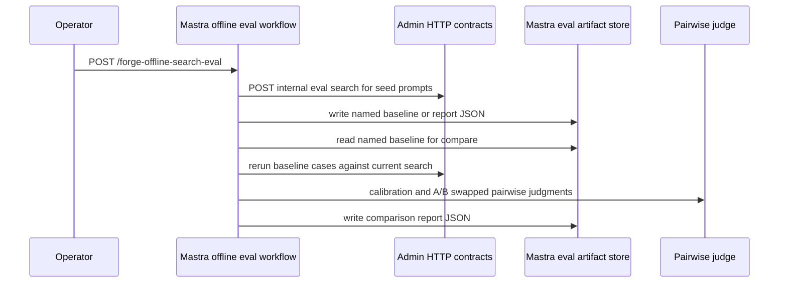

# feat: Add Mastra offline search eval runner and reports

## Summary

Add a Mastra-owned offline search-eval workflow that captures the first named baseline from a committed seed prompt set, compares later Admin search behavior against that seed-only baseline, and writes report artifacts with clear quality, source-mix, calibration, cost, and failure metadata. Admin remains the production search authority; Mastra calls Admin over authenticated HTTP only.

---

## Problem Frame

The roadmap needs Mastra to own search-quality orchestration without entering the live search path. Feat-138 created staged generated candidates and Admin trace/catalog contracts, but those candidates are not durable regression truth. Feat-139 establishes the first Mastra-side eval system: seed prompts, baseline capture, comparison runs, judge orchestration, and reports that can inform feat-140 review and promotion.

---

## Requirements

These are feat-139 plan-local requirements. They trace mainly to origin requirements R17-R22, which define the search-eval ownership and promotion boundary.

**Eval ownership and boundaries**

- F139-R1. Mastra must own prompt-set definitions, seed-only baseline capture, offline eval comparisons, judge orchestration, and report artifacts for this feature.
- F139-R2. Admin must remain the owner of live search orchestration, query embeddings, vector storage, trace retention, candidate persistence, and search APIs.
- F139-R3. Mastra must not import Admin, Manager, or Auth app code, and must not read Admin Postgres directly.
- F139-R4. Eval runner failures must stay offline and must not affect public search availability or response shapes.

**Prompt sets and inputs**

- F139-R5. Mastra must include a seed prompt set with ministry, audience, and locale-intent examples such as Bible Project, Jesus, Who is Jesus?, videos for teens, resources for parents, new believer, small group Bible study, and church leader training.
- F139-R6. Feat-138 staged generated candidates must stay out of the Studio-facing offline eval workflow for this ticket. Any candidate read/report seams remain future exploratory material only and must be excluded from named baseline capture, baseline reloads, comparison denominators, and future regression truth until feat-140 promotion exists.
- F139-R7. Trace-derived generated candidates must remain subject to retention/promotion boundaries, must be excluded from external judge prompts in feat-139, and must not expose raw sensitive trace payloads in any durable artifact.

**Baseline, comparison, and reports**

- F139-R8. Baseline capture must run seed prompt cases through Admin search and store a named Mastra artifact with enough metadata to compare later runs.
- F139-R9. Comparison runs must load a named seed-only baseline, rerun the same baseline cases against current Admin search, judge baseline versus current results outside the live path, and write a report artifact.
- F139-R10. Reports must separate wins, losses, ties, both-irrelevant cases, judge disagreements, search failures, locale mix, prompt-source mix, generated-candidate behavior, trace-derived behavior, judge calibration status, and practical cost/timing metadata.
- F139-R11. Reports and artifacts must carry search endpoint/version-ish metadata, query-set version, prompt-set source, judge model, run id, and timestamps so feat-140 can review and promote later.
- F139-R12. Offline search fan-out must respect Admin rate limits with bounded case counts, a low default concurrency/cadence, and explicit retry behavior for 429 `Retry-After` responses.

---

## High-Level Technical Design

The artifact store is Mastra-owned filesystem storage under the runtime storage directory by default, with test seams for temporary directories. Admin HTTP remains the only execution primitive for search and candidate reads.

---

## Key Technical Decisions

- KTD1. **Mastra-local eval domain:** Define search eval prompt, baseline, report, result, judge, and artifact types inside `apps/mastra`; do not share Admin harness types at runtime. This preserves the no-cross-import boundary while allowing useful shape parity with the old Admin harness.
- KTD2. **Admin search via authenticated internal REST:** Add an Admin internal eval-search route that reuses Admin's production search service but accepts JSON POST, marks traffic as eval/no-trace, and never changes public `/api/search` response shapes. Mastra calls this route with a dedicated eval bearer so offline searches do not create production traces or expose query text in URLs.
- KTD3. **Bounded candidate read contract:** Add an authenticated Admin read path for staged generated candidates. Return only the fields Mastra needs for offline eval input and source-mix reporting, exclude expired trace candidates at read time, and leave promotion, editing, and regression loading to feat-140.
- KTD4. **Artifacts, not gates:** Store seed-only baselines and reports as Mastra eval artifacts with schema versions and exploratory flags. The Studio-facing workflow stays seed-only; no generated or trace-derived candidate is stored in a named baseline or permanent regression truth in this ticket.
- KTD5. **Judge swap and calibration:** Port the old harness's pairwise A/B-swap collapse and calibration concepts into Mastra-owned services. Calibration status is report metadata; a failed judge does not touch live search.
- KTD6. **Artifact and provider redaction boundary:** Durable artifact serializers must redact trace-derived generated query text and avoid raw trace payloads, bearer tokens, vectors, provider prompts, and debug scoring blobs. Trace-derived generated candidates are never sent to Admin eval search or the external judge in feat-139; reports preserve only IDs, hashes, source family, retention metadata, and counts for those cases.

---

## Credential Matrix

| Surface                            | Admin route                                     | Mastra env                                                      | Admin accepted bearer source                   | Notes                                                                         |
| ---------------------------------- | ----------------------------------------------- | --------------------------------------------------------------- | ---------------------------------------------- | ----------------------------------------------------------------------------- |
| Eval search execution              | `POST /api/internal/search-eval/search`         | `ADMIN_SEARCH_EVAL_SEARCH_URL`, `ADMIN_SEARCH_EVAL_API_KEY`     | `SEARCH_TRACE_SAMPLING_API_KEYS` in this slice | Internal no-trace eval route; does not use public `/api/search` URLs.         |
| Generated candidate read/write     | `GET/POST /api/internal/search-eval/candidates` | `ADMIN_SEARCH_EVAL_CANDIDATES_URL`, `ADMIN_SEARCH_EVAL_API_KEY` | `SEARCH_TRACE_SAMPLING_API_KEYS`               | Read path is generated-only by default and excludes expired trace candidates. |
| Trace/catalog context for feat-138 | Existing trace/catalog routes                   | Existing feat-138 env vars                                      | `SEARCH_TRACE_SAMPLING_API_KEYS`               | Reused only where needed; not a public search credential.                     |

---

## Implementation Units

### U1. Mastra Eval Prompt Sets and Artifact Store

**Goal:** Add Mastra-owned seed prompt definitions, eval domain types, and baseline/report artifact persistence.

**Requirements:** F139-R1, F139-R5, F139-R8, F139-R11

**Dependencies:** None

**Files:** `apps/mastra/src/services/offline-search-eval/types.ts`, `apps/mastra/src/services/offline-search-eval/seed-prompt-set.ts`, `apps/mastra/src/services/offline-search-eval/artifacts.ts`, `apps/mastra/src/services/offline-search-eval/artifacts.test.ts`, `apps/mastra/src/services/offline-search-eval/seed-prompt-set.test.ts`, `apps/mastra/src/config/env.ts`, `apps/mastra/CLAUDE.md`

**Approach:** Define versioned prompt cases with stable IDs, locale, source, audience/ministry tags, and optional non-gating operator notes. Store artifacts under `MASTRA_SEARCH_EVAL_ARTIFACT_DIR` when set, otherwise under `getMastraStorageDir()/search-eval`. Validate names as safe slugs and write JSON with schema versions.

**Patterns to follow:** `apps/mastra/src/config/env.ts` for optional env parsing; old Admin `apps/admin/src/services/search-eval/reporter.ts` for report-file discipline without importing it.

**Test scenarios:** Seed prompt tests assert required examples exist, prompt IDs are unique, locales are safe strings, and prompt-source metadata distinguishes seed cases from generated candidates. Artifact tests assert safe names are accepted, path traversal is rejected, baseline/report JSON round-trips, and missing baseline reads return a typed failure.

**Verification:** A developer can inspect a committed seed prompt set and a test-created artifact directory containing schema-versioned baseline and report JSON.

### U2. Admin Generated Candidate Read Contract

**Goal:** Let Mastra read bounded staged generated candidates over authenticated Admin HTTP for exploratory eval input.

**Requirements:** F139-R2, F139-R3, F139-R6, F139-R7

**Dependencies:** None

**Files:** `apps/admin/src/services/search-eval/candidates.ts`, `apps/admin/src/services/search-eval/candidates.test.ts`, `apps/admin/src/app/api/internal/search-eval/candidates/route.ts`, `apps/admin/src/app/api/internal/search-eval/candidates/route.test.ts`

**Approach:** Extend the candidate service with a list/read function that defaults to `GENERATED` rows, supports bounded filters such as source, locale, Mastra run id, and limit, excludes trace candidates whose `retentionExpiresAt <= now` even before the purge job runs, and returns only sanitized eval-input fields. Extend the existing internal candidates route with an authenticated GET read path while keeping POST storage behavior intact and GET unauthenticated requests rejected.

**Patterns to follow:** Existing candidate storage validation, trace sampling bearer auth, bounded route body/query parsing, and `[search] event=... key=value` log redaction.

**Test scenarios:** Service tests cover default generated-only reads, source/locale/run filters, max limit enforcement, exclusion of non-generated rows by default, and omission of expired trace candidates through a `now` test seam. Route tests cover 401 without bearer, successful bounded reads with bearer, invalid query params returning 400, and no exposure of server-owned promotion mutation behavior.

**Verification:** Mastra can fetch staged generated candidates without Admin DB access, and unauthenticated candidate reads remain closed.

### U3. Mastra Admin Search and Candidate Clients

**Goal:** Add Mastra HTTP clients for Admin eval-search execution and generated-candidate reads.

**Requirements:** F139-R2, F139-R3, F139-R4, F139-R6, F139-R8, F139-R9, F139-R12

**Dependencies:** U2

**Files:** `apps/admin/src/app/api/internal/search-eval/search/route.ts`, `apps/admin/src/app/api/internal/search-eval/search/route.test.ts`, `apps/mastra/src/services/admin-search-eval-client.ts`, `apps/mastra/src/services/admin-search-eval-client.test.ts`, `apps/mastra/src/config/env.ts`, `apps/mastra/CLAUDE.md`

**Approach:** Add an Admin internal eval-search route that calls `HybridSearchService.searchWithTrace` but does not call `recordSearchTraceSafely`. Extend the existing Mastra eval client with `callAdminEvalSearch` and `callAdminCandidateList` helpers. Search uses a configured URL, attaches `ADMIN_SEARCH_EVAL_API_KEY` as bearer, validates the response shape locally, truncates snippets for judge prompts, honors 429 `Retry-After`, and maps auth, rejection, rate-limit, network, timeout, and parse failures into typed offline failures.

**Patterns to follow:** Existing `postJson` typed-result pattern in `admin-search-eval-client.ts`; old Admin `search-client.ts` retry, timeout, and snippet-truncation behavior.

**Test scenarios:** Admin route tests assert auth is required, JSON body validation is bounded, successful search returns the public search response shape, and eval search does not call trace recording. Client tests assert bearer headers are attached, JSON payloads carry query/locale/limit/mode, valid search responses parse, snippets truncate by codepoint, candidate-list responses parse, missing config/auth/rejection/network/parse failures are typed, and 429 `Retry-After` is honored without converting rate-limit failures into empty results.

**Verification:** Mastra tests prove Admin search and candidate reads are HTTP-only, typed, bounded, and usable without importing Admin code.

### U4. Mastra Offline Eval Runner, Judge, Calibration, and Reports

**Goal:** Implement baseline capture, baseline comparison, pairwise judging, calibration, report aggregation, and safe report serialization.

**Requirements:** F139-R1, F139-R4, F139-R7, F139-R8, F139-R9, F139-R10, F139-R11, F139-R12

**Dependencies:** U1, U3

**Files:** `apps/mastra/src/services/offline-search-eval/judge.ts`, `apps/mastra/src/services/offline-search-eval/judge.test.ts`, `apps/mastra/src/services/offline-search-eval/runner.ts`, `apps/mastra/src/services/offline-search-eval/runner.test.ts`, `apps/mastra/src/services/offline-search-eval/report.ts`, `apps/mastra/src/services/offline-search-eval/report.test.ts`

**Approach:** Capture mode loads seed prompts only, searches Admin, and writes a named seed-only baseline artifact plus baseline report. Compare mode loads a named baseline, searches current Admin for the same seed cases, runs judge calibration, performs A/B and swapped judgments, collapses verdicts into report categories, records search failures separately, and writes a comparison report. Keep generated-candidate report seams separate and non-gating for future feat-140 review, but do not expose them in the Studio-facing workflow. Trace-derived generated candidates are skipped from Admin eval search and external judge prompts, and appear only as redacted exploratory metadata/counts if a future path includes them. Generated cases are excluded from baseline reloads and comparison denominators. All durable artifacts redact trace-derived generated query text while preserving IDs, hashes, source families, retention metadata, and counts.

**Patterns to follow:** Old Admin `judge.ts` structured OpenRouter response, `runner.ts` A/B-swap collapse and cost math, and `reporter.ts` category naming. Keep implementation Mastra-local.

**Test scenarios:** Runner tests cover seed-only baseline capture, comparison wins/losses/ties/both-irrelevant/judge-disagreement collapse, search failures bypassing judge calls, generated candidates marked exploratory and excluded from denominator math, trace-derived candidates excluded from judge provider payloads, trace-derived artifact redaction, locale/source mix aggregation, rate-limit retries/failures, calibration pass/fail metadata, and cost/timing accumulation. Judge tests cover missing credentials, valid structured output, invalid model output, and token extraction.

**Verification:** A test fixture can capture a baseline and compare a later result set without live Admin or provider calls, proving the report categories and safety boundaries.

### U5. Mastra Workflow and Protected Service Route

**Goal:** Register a Mastra workflow and service-bearer route for offline search eval runs.

**Requirements:** F139-R1, F139-R3, F139-R4, F139-R8, F139-R9, F139-R10, F139-R12

**Dependencies:** U4

**Files:** `apps/mastra/src/mastra/workflows/offline-search-eval.ts`, `apps/mastra/src/mastra/workflows/offline-search-eval.test.ts`, `apps/mastra/src/mastra/index.ts`

**Approach:** Add workflow id `offline-search-eval` and route `POST /forge-offline-search-eval`. Input must use the same strict, structured Zod object schema on `createWorkflow({ inputSchema })` and the first step `inputSchema`, not `z.unknown()`, so Mastra Studio renders usable operator fields. The Studio-safe defaults are `mode: "capture-baseline"`, `baselineName: "seed-baseline"`, all seeded locales, `searchLimit: 20`, `searchMode: "hybrid"`, and `contentType: "all"`; use explicit enum values such as `all` for no-filter states rather than nullable defaults that render as `OR` controls. Do not expose staged generated candidates in the Studio-facing workflow until the human promotion flow is designed. Capture mode writes the named baseline; compare mode loads the named baseline and fails clearly when it is missing. Defaults keep seed case counts under Admin rate-limit pressure. Route auth mirrors `/forge-eval-query-generation`; Studio `/api/workflows` remains unguarded by service-bearer middleware because human Studio access is owned by `apps/mastra-gateway` and `@forge/mastra` remains internal.

**Patterns to follow:** `apps/mastra/src/mastra/workflows/eval-query-generation.ts` for input parsing, service-route outcomes, and launch behavior; `apps/mastra/src/mastra/index.ts` for route registration.

**Test scenarios:** Workflow tests cover Studio/API default input parsing, workflow and first-step schema registration, plain string/invalid object rejection, missing config, baseline capture success, comparison success, missing baseline failure, typed route statuses, service bearer rejection before launch, and import-boundary checks against Admin/Manager/Auth.

**Verification:** The workflow appears in Mastra registration with object-shaped input metadata and can be launched through both the built-in Studio workflow path and the protected `/forge-*` route without changing Studio API auth shape.

### U6. Documentation, Roadmap, and Validation Coverage

**Goal:** Document the operator/dev contract and keep roadmap state accurate.

**Requirements:** F139-R1, F139-R4, F139-R6, F139-R7, F139-R11

**Dependencies:** U1, U2, U3, U4, U5

**Files:** `apps/mastra/CLAUDE.md`, `apps/admin/AGENTS.md`, `docs/roadmap/content-discovery/feat-139-mastra-offline-search-eval-runner-reports.md`, `docs/solutions/architecture-patterns/mastra-offline-search-eval-orchestration-boundary-pattern.md`, `docs/solutions/integration-issues/mastra-eval-workflow-local-dev-contracts.md`

**Approach:** Update Mastra env docs for `ADMIN_SEARCH_EVAL_SEARCH_URL`, `ADMIN_SEARCH_EVAL_CANDIDATES_URL`, shared `ADMIN_SEARCH_EVAL_API_KEY`, Studio-facing structured workflow input defaults, and the artifact directory. Note the generated-candidate exploratory boundary, the trace-derived skip/redaction rule, and the gateway-owned Studio auth boundary. Finish the roadmap status when validation and review pass. Add or refresh the durable solution note during `ce:compound`.

**Patterns to follow:** Existing Mastra eval query generation docs and `docs/solutions/integration-issues/mastra-eval-workflow-local-dev-contracts.md`.

**Test scenarios:** Test expectation: none -- documentation and roadmap updates are reviewed by diff and backed by the implementation tests in U1-U5.

**Verification:** The final diff tells operators which env vars are needed, how artifacts are owned, and what remains for feat-140.

---

## Scope Boundaries

- Do not put Mastra in live search request handling or live query embedding generation.
- Do not change Admin public search response shapes.
- Do not promote generated, trace-derived, or user-submitted candidates into durable regression gates.
- Do not build the feat-140 human promotion UI, review workflow, candidate editing, or regression loading.
- Do not import Admin code into Mastra or connect Mastra to Admin Postgres.
- Do not add, preserve, or depend on CMS/Strapi support.

### Deferred to Follow-Up Work

- Feat-140 should add operator review, candidate editing, promotion/rejection states, durable regression loading, and user-generated prompt submissions.
- A later hardening pass can add CI-sensitive gates once promoted regression truth exists.

---

## System-Wide Impact

This adds an offline operator/developer eval path and narrow internal Admin read/search contracts. It does not alter public search behavior, public GraphQL, Admin vector storage, live trace retention, or Mastra Studio gateway authentication. Production env must add `ADMIN_SEARCH_EVAL_SEARCH_URL`, `ADMIN_SEARCH_EVAL_CANDIDATES_URL`, the shared `ADMIN_SEARCH_EVAL_API_KEY`, and optionally a Mastra search-eval artifact directory; missing eval config should fail only the offline workflow.

---

## Risks & Dependencies

- Judge output can drift; calibration metadata must be visible and comparison results should be treated cautiously when calibration fails.
- Artifact storage on Railway depends on a persistent volume-backed directory for durable baseline/report history.
- Search fan-out can hit Admin rate limits; the runner must default to conservative counts and honor 429 retry behavior rather than turning rate limits into empty results.
- Trace-derived generated candidates are sensitive by provenance even when sampled safely; baselines exclude them, reports must redact query detail, and the judge must not receive raw trace-derived query text in feat-139.
- Studio operator usability depends on the workflow schema, not only the service route parser. Keep Studio-facing workflows on structured object schemas with defaults and smoke the built-in workflow path when changing eval inputs.
- Eval credentials are shared in feat-139 to match the existing Admin internal bearer pattern. A later hardening pass should split eval-search, candidate-read, and candidate-write keys by capability before these contracts become broader automation surfaces.

---

## Sources & Research

- `docs/roadmap/content-discovery/feat-139-mastra-offline-search-eval-runner-reports.md`
- `docs/roadmap/content-discovery/feat-138-mastra-eval-query-generation.md`
- `docs/roadmap/content-discovery/feat-140-search-eval-human-promotion-regression-gates.md`
- `docs/brainstorms/2026-05-25-mastra-embedding-search-migration-requirements.md`
- `apps/mastra/src/mastra/workflows/eval-query-generation.ts`
- `apps/mastra/src/services/admin-search-eval-client.ts`
- `apps/admin/src/services/search-eval/runner.ts`
- `apps/admin/src/services/search-eval/search-client.ts`
- `apps/admin/src/services/search-eval/judge.ts`
- `apps/admin/src/services/search-eval/reporter.ts`
- `docs/solutions/integration-issues/mastra-eval-workflow-local-dev-contracts.md`
- `docs/solutions/integration-issues/offline-workflow-batches-must-respect-consumer-write-limits.md`
