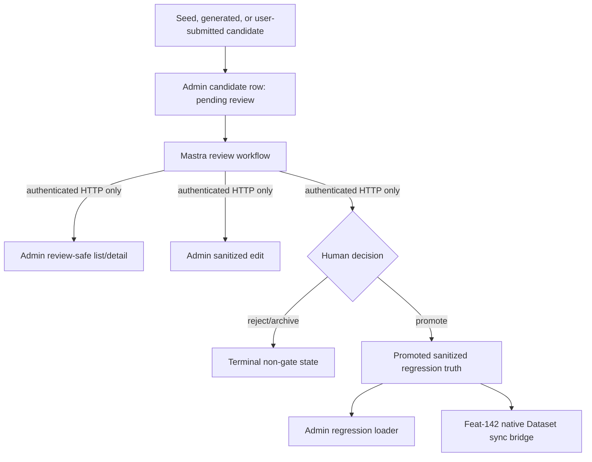

# feat: Search eval human promotion and regression gates

## Summary

Build the Admin-owned review and promotion contracts that turn seed, generated, and user-submitted search eval candidates into sanitized durable regression truth, with a Mastra operator workflow that uses only authenticated Admin HTTP.

---

## Problem Frame

Feat-139 made Mastra the owner of offline search eval runs and custom reports while keeping native Mastra Evaluation writes deferred. Generated candidates are still staged in Admin and are intentionally not regression gates. Feat-140 needs the human promotion path: operators should review safe candidate projections, edit sanitized truth fields, reject/archive poor candidates, and promote approved cases without a DB console or raw trace leakage.

---

## Requirements

- R1. Admin exposes authenticated review-safe list/detail, sanitized-field edit, reject/archive, and promote contracts for search eval candidates.
- R2. Promotion records reviewer identity, review timestamp, sanitization status, source anchors, expected-result notes, and Admin/Mastra run context.
- R3. Generated, seed, and user-submitted candidates remain pending until a human promotes them.
- R4. Promoted cases load as durable regression truth while existing hand-edited `apps/admin/eval/regressions.json` entries still load.
- R5. Mastra review behavior uses Admin HTTP only and does not import Admin code or connect to Admin Postgres.
- R6. Raw trace text, unsanitized trace payloads, vectors, bearer tokens, provider secrets, and source payloads stay out of review responses and artifacts.
- R7. Feat-142 has a documented native Dataset item bridge without this ticket claiming native Dataset, Scorer, or Experiment records.

---

## Key Technical Decisions

- **Use `search_eval_candidate` as the promoted truth ledger:** Add review/promotion fields to the existing Admin-owned table so provenance, status, and promoted sanitized truth stay atomically tied to the staged candidate.
- **Keep pending status backward compatible:** Existing `generated` status remains the pending-review state for generated, seed, and user-submitted sources, avoiding a disruptive data migration while responses document it as pending.
- **Expose sanitized projections, not raw rows:** Detail/list responses switch to sanitized fields after promotion and continue to suppress trace raw query text before promotion.
- **Load promoted DB truth beside hand-edited JSON:** `loadRegressions` keeps the file-first operator flow and accepts an optional Prisma client to append promoted rows as `source: "promoted"`.
- **Make Mastra a thin operator workflow:** Mastra owns the Studio/workflow action surface, but every read/write delegates to Admin HTTP clients with bearer auth and typed response parsing.
- **Defer native Evaluation writes:** Document the Dataset item shape now; keep native IDs null and creation work in feat-142.

---

## High-Level Technical Design

---

## Implementation Units

### U1. Admin Candidate Review Model

**Goal:** Extend candidate storage to represent seed/user-submitted sources, review state, sanitization fields, and promotion audit metadata.

**Requirements:** R1, R2, R3, R6

**Dependencies:** none

**Files:** `apps/admin/prisma/schema.prisma`, `apps/admin/prisma/migrations/0024_search_eval_human_promotion/migration.sql`, `apps/admin/src/services/search-eval/candidates.ts`, `apps/admin/src/services/search-eval/candidates.test.ts`

**Approach:** Add `seed` and `user_submitted` candidate sources, an `archived` terminal status, sanitized query/notes/anchors fields, reviewer/review timestamp fields, promotion timestamp, review notes, and safe run context JSON. Keep raw candidate fields present for existing generation writes, but require promoted reads to use sanitized fields.

**Patterns to follow:** Existing `SearchEvalCandidate` validation and trace redaction in `apps/admin/src/services/search-eval/candidates.ts`; retention rules in `apps/admin/src/services/search-trace-retention.service.ts`.

**Test scenarios:** Store seed and user-submitted candidates as pending; reject attempts to overwrite promoted/rejected/archived rows; promote only with sanitized query text and reviewer identity; archive and reject terminal states never enter promoted loaders; trace rows never expose raw query/source payloads in review responses.

**Verification:** Service tests prove state transitions, response redaction, and schema guardrails.

### U2. Admin HTTP Review Contracts

**Goal:** Add bearer-gated Admin routes for review-safe list/detail, sanitized edit, reject/archive, and promote.

**Requirements:** R1, R2, R3, R6

**Dependencies:** U1

**Files:** `apps/admin/src/app/api/internal/search-eval/candidates/route.ts`, `apps/admin/src/app/api/internal/search-eval/candidates/[id]/route.ts`, `apps/admin/src/app/api/internal/search-eval/candidates/[id]/reject/route.ts`, `apps/admin/src/app/api/internal/search-eval/candidates/[id]/archive/route.ts`, `apps/admin/src/app/api/internal/search-eval/candidates/[id]/promote/route.ts`, `apps/admin/src/app/api/internal/search-eval/candidates/route.test.ts`

**Approach:** Reuse the existing dedicated search-eval bearer, JSON body caps, rate limiting, and sanitized error responses. Keep list bounded and add status/source filtering. Add narrow action routes so Mastra does not need DB access or Admin imports.

**Patterns to follow:** Existing candidate and no-trace search internal routes.

**Test scenarios:** Unauthorized requests fail; invalid IDs and malformed action payloads return 400/404; edit updates sanitized fields only; reject/archive/promote call service functions with reviewer/run context; trace detail is redacted.

**Verification:** Route tests cover auth, validation, status mapping, and redaction.

### U3. Durable Regression Loading

**Goal:** Preserve committed `regressions.json` while appending promoted DB cases to regression truth.

**Requirements:** R4, R6

**Dependencies:** U1

**Files:** `apps/admin/src/services/search-eval/regressions.ts`, `apps/admin/src/services/search-eval/regressions.test.ts`, `apps/admin/src/services/search-eval/types.ts`, `apps/admin/src/scripts/eval-search.ts`, `apps/admin/eval/README.md`

**Approach:** Extend `loadRegressions` with an optional Prisma client and append promoted rows using sanitized query text, expected-result notes, source anchors, reviewer, and promotion metadata. Keep the no-Prisma path returning the existing file entries only.

**Patterns to follow:** Existing hand-edited JSON validation and rebaseline composition in `apps/admin/src/scripts/eval-search.ts`.

**Test scenarios:** File entries still load alone; promoted rows append when Prisma is supplied; archived/rejected/pending rows are excluded; promoted trace rows use sanitized query text only.

**Verification:** Regression loader tests and the rebaseline script compile against the extended contract.

### U4. Mastra HTTP-Boundary Review Workflow

**Goal:** Provide an operator workflow for listing/detailing, editing, rejecting/archiving, promoting, and submitting seed/user candidates via Admin HTTP only.

**Requirements:** R1, R3, R5, R6

**Dependencies:** U2

**Files:** `apps/mastra/src/services/admin-search-eval-client.ts`, `apps/mastra/src/mastra/workflows/search-eval-candidate-review.ts`, `apps/mastra/src/mastra/index.ts`, `apps/mastra/src/services/admin-search-eval-client.test.ts`, `apps/mastra/src/mastra/workflows/search-eval-candidate-review.test.ts`

**Approach:** Add Admin HTTP client helpers and a Studio-friendly workflow with action inputs. Seed submission packages the committed Mastra seed prompt set into Admin candidates; user submissions enter the same pending-review flow; all state changes call Admin action endpoints.

**Patterns to follow:** `eval-query-generation` and `offline-search-eval` workflow route/auth patterns, plus current retrying Admin client behavior.

**Test scenarios:** Workflow list/detail/edit/promote/reject/archive calls only HTTP client seams; missing Admin config fails typed and retry-safe; seed submission posts seed cases as pending candidates; no test imports Admin modules.

**Verification:** Mastra tests prove action routing and HTTP-only behavior.

### U5. Documentation And Native Dataset Bridge

**Goal:** Document review standards, regression loading, and the native Dataset item shape for feat-142.

**Requirements:** R7

**Dependencies:** U1, U3, U4

**Files:** `apps/admin/eval/README.md`, `docs/roadmap/content-discovery/feat-140-search-eval-human-promotion-regression-gates.md`, `docs/roadmap/content-discovery/feat-142-mastra-search-eval-suite-operator-workflow.md`

**Approach:** Update operator docs with review rules for seed, generated, user-submitted, trace-derived, and audience-intent cases. Document the future native Dataset item shape with query, locale, source, sanitized provenance, expected-result notes/anchors, and safe metadata only.

**Patterns to follow:** Existing feat-139 completion notes and native Evaluation bridge solution note.

**Test scenarios:** Test expectation: none -- documentation-only unit.

**Verification:** Docs name the deferred native writes clearly and do not claim native records are populated.

---

## Scope Boundaries

### Deferred to Follow-Up Work

- Native Mastra Dataset, Scorer, and Experiment writes stay in feat-142.
- A custom rich review UI is deferred unless native Mastra Evaluation cannot support the operator flow later.
- Public search REST and GraphQL shapes remain unchanged.

### Out of Scope

- Mastra in the live search path.
- Mastra database access to Admin Postgres.
- CMS/Strapi support.

---

## Risks & Dependencies

- **Prisma enum changes need generated client refresh:** The implementation should run Admin Prisma generate before typecheck.
- **Trace candidates need strict projection discipline:** Tests should prove trace raw fields are not read or serialized in review-safe responses.
- **Reviewer identity is contract-provided:** Mastra is not the human identity authority, so Admin stores reviewer identity supplied by the authenticated operator workflow instead of joining to Admin session users.

---

## Sources / Research

- Roadmap source: `docs/roadmap/content-discovery/feat-140-search-eval-human-promotion-regression-gates.md`
- Feat-139 boundary: `docs/roadmap/content-discovery/feat-139-mastra-offline-search-eval-runner-reports.md`
- Native bridge: `docs/roadmap/content-discovery/feat-142-mastra-search-eval-suite-operator-workflow.md`
- Existing Admin candidate contract: `apps/admin/src/services/search-eval/candidates.ts`
- Existing Mastra HTTP client and workflows: `apps/mastra/src/services/admin-search-eval-client.ts`, `apps/mastra/src/mastra/workflows/eval-query-generation.ts`, `apps/mastra/src/mastra/workflows/offline-search-eval.ts`
- Prior pattern: `docs/solutions/architecture-patterns/mastra-offline-search-eval-orchestration-boundary-pattern.md`
