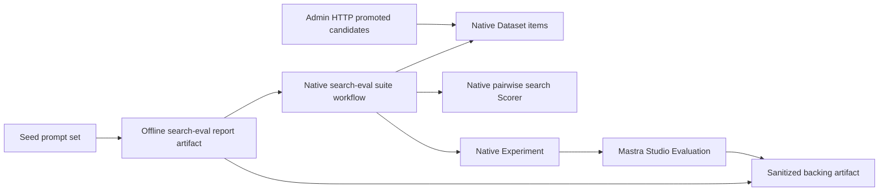

# Mastra Native Evaluation Search Eval Suite Plan

## Problem

Feat-142 should make Mastra Studio's native Evaluation area the canonical
operator surface for search evals. The current system can stage candidate
prompts, capture baselines, write comparison reports, and review/promote safe
truth, but native Datasets, Scorers, and Experiments are still not created.
Operators therefore have to reason through workflow cards and JSON artifacts
instead of Studio's Evaluation pages.

The implementation should transform the existing safe search-eval artifacts and
promoted truth into native Mastra Evaluation records. Custom artifacts remain
the audit/full-fidelity backing layer; native Evaluation becomes the first stop
for operators.

## Source Requirements

This plan carries forward the requirements from
`docs/brainstorms/2026-05-28-mastra-native-evaluation-search-eval-suite-requirements.md`
and the roadmap contract in
`docs/roadmap/content-discovery/feat-142-mastra-search-eval-suite-operator-workflow.md`.

- Native Evaluation is the primary operator surface for search evals.
- Seed prompt sets and sanitized human-promoted regression prompts become
  native Dataset items.
- Generated, pending, rejected, archived, unsanitized, or trace-raw candidates
  stay out of durable native Datasets.
- Pairwise search quality outcomes become native Scorer results without losing
  win, loss, tie, both-irrelevant, judge-disagreement, judge-failure, and
  search-failure meaning.
- Offline search eval runs create native Experiments with safe metadata for
  baseline identity, prompt source, locale mix, search configuration, report
  linkage, cost, timing, and failure categories.
- Local, staging, and production use the same code path with config-only
  differences for Admin URLs, bearer keys, Mastra storage, artifact roots, and
  environment labels.
- Rerunning sync reuses or updates stable native records instead of duplicating
  Datasets, Scorers, Experiments, or items.
- Mastra remains outside the live search request path and uses authenticated
  Admin HTTP contracts rather than Admin database access.

## Investigation Findings

- `apps/mastra/src/mastra/index.ts` already registers Studio-facing workflows
  and bearer-protected service routes. New search-eval native sync should
  follow the same workflow plus service-route pattern.
- `apps/mastra/src/services/offline-search-eval/report.ts` already computes
  totals, locale mix, prompt-source mix, generated-candidate behavior, timing,
  cost, and a `mastraEvaluation` projection with null native IDs.
- `apps/mastra/src/services/offline-search-eval/artifacts.ts` validates and
  writes baseline/report artifacts, but it does not yet read reports by id for
  a downstream native sync.
- `apps/mastra/src/services/admin-search-eval-client.ts` exposes promoted
  candidate listing through authenticated Admin HTTP. Mastra does not need
  direct Admin database access.
- `apps/mastra/node_modules/@mastra/core` exposes `mastra.datasets`,
  `Dataset.addItems`, `Dataset.updateItem`, `Dataset.listItems`,
  `Dataset.startExperiment`, `createScorer`, `mastra.addScorer`, and
  `mastra.listScorers`.
- Studio/API route metadata includes native Evaluation routes for datasets,
  experiments, and scorers.
- Local Studio should be reached through `http://localhost:4111`, with
  devcontainer forwarding configured for port `4111`. Avoid container-private
  `172.x` addresses.

## Technical Decisions

1. **Artifact producer, native projector.** Keep `offline-search-eval` as the
   producer of safe comparison artifacts, then add a native sync workflow that
   projects a report into native Dataset, Scorer, and Experiment records. This
   preserves the existing audit layer while making Evaluation native.
2. **Stable keys over generated names.** Native records should use
   environment-aware names plus stable metadata keys derived from environment,
   baseline, prompt-set/report id, scorer id, and source item keys. Sync finds
   existing records by those keys before creating anything.
3. **Function scorer with explicit category semantics.** The first scorer maps
   pairwise categories into numeric scores for native Evaluation while keeping
   the detailed category and explanation in the scorer reason/output metadata.
   Native scores are a Studio signal, not a replacement for the full report.
4. **Promoted truth via Admin HTTP only.** Promoted candidate sync reads
   sanitized promoted rows from Admin's internal HTTP contracts. It never reads
   Admin's database and never imports Admin modules.
5. **Dev smoke without production data.** Add an explicit sample-data smoke
   action for local Studio verification so a developer can prove artifact to
   native Evaluation wiring without a Railway token or production database. The
   action must be rejected outside local/development environments, clearly mark
   data as sample/local, and never create promoted production truth.
6. **Optional in-memory Mastra storage only for local smoke.** Add a local-only
   storage backend option so native Evaluation records can be exercised when a
   Postgres service is unavailable in the devcontainer. Production still
   requires configured durable storage.

## High-Level Design

## Implementation Units

### U1: Native Search Eval Domain Service

Files:

- `apps/mastra/src/services/offline-search-eval/native-evaluation.ts`
- `apps/mastra/src/services/offline-search-eval/native-evaluation.test.ts`
- `apps/mastra/src/services/offline-search-eval/types.ts`
- `apps/mastra/src/services/offline-search-eval/artifacts.ts`

Approach:
Create a service that accepts a validated search-eval report plus a Mastra
runtime handle and sync options. It should register the pairwise scorer, find or
create the target Dataset by stable metadata key, upsert Dataset items by
`metadata.sourceKey`, and create or reuse the native Experiment for the report.
Add report reading by report id so a workflow can transform an existing artifact
into native records.

Test scenarios:

- Registers or reuses the `search-result-pairwise-judge` scorer without
  duplicate scorer entries.
- Creates a Dataset with stable name, target type, target id, scorer ids, and
  environment metadata.
- Rerunning sync updates existing Dataset items by `sourceKey` instead of adding
  duplicates.
- Reuses an existing Experiment when the same report id/native key has already
  been synced.
- Rejects or redacts unsafe native item metadata that would expose raw trace
  text, bearer tokens, vectors, or provider payloads.
- Reads a report artifact by id and validates malformed artifacts before sync.

### U2: Report Projection Upgrade

Files:

- `apps/mastra/src/services/offline-search-eval/report.ts`
- `apps/mastra/src/services/offline-search-eval/types.ts`
- `apps/mastra/src/services/offline-search-eval/artifacts.ts`
- `apps/mastra/src/services/offline-search-eval/report.test.ts`
- `apps/mastra/src/services/offline-search-eval/artifacts.test.ts`

Approach:
Extend the `mastraEvaluation` projection to support both artifact-only and
native-synced states. Artifact generation should continue to emit
`custom_artifact_only`; native sync can return or persist native ids and statuses
only after real records exist.

Test scenarios:

- Existing report finalization still emits `custom_artifact_only` with null
  native ids before sync.
- Native sync projection includes non-null Dataset, Scorer, and Experiment ids
  only after native records are created or reused.
- Artifact schema accepts valid artifact-only and native-synced projections and
  rejects mixed states such as `native_synced` with null Dataset id.

### U3: Studio Workflow And Service Route

Files:

- `apps/mastra/src/mastra/workflows/search-eval-native-suite.ts`
- `apps/mastra/src/mastra/workflows/search-eval-native-suite.test.ts`
- `apps/mastra/src/mastra/index.ts`

Approach:
Add a Studio-facing workflow with a concrete Zod object schema and
operator-friendly defaults. It should support syncing an existing report
artifact by report id/path and a local sample smoke action that writes a
realistic sample report artifact before syncing it. Register a matching
bearer-protected service route for scriptable smoke and automation.

Test scenarios:

- Workflow input schema rejects unknown or unsafe actions with useful errors.
- Sample action writes a sample report artifact and creates native records from
  that artifact.
- Sample action is rejected outside local/development environments.
- Sync-report action loads a real report artifact and returns native Dataset,
  Scorer, Experiment, and report references.
- Service route enforces bearer auth, bounded JSON parsing, and the same input
  validation as the workflow.
- Existing `eval-query-generation`, `offline-search-eval`, and
  `search-eval-candidate-review` workflows remain registered.

### U4: Promoted Dataset Sync

Files:

- `apps/mastra/src/services/offline-search-eval/native-evaluation.ts`
- `apps/mastra/src/services/admin-search-eval-client.ts`
- `apps/mastra/src/services/admin-search-eval-client.test.ts`
- `apps/mastra/src/mastra/workflows/search-eval-native-suite.ts`

Approach:
Use Admin HTTP candidate listing to sync sanitized promoted candidates into a
separate promoted-regression Dataset. Keep this optional in local smoke so
developers are not blocked on a production token. Never sync generated,
pending, rejected, archived, unsanitized, or trace-raw rows. If Admin's list
contract cannot filter by sanitization status directly, request promoted rows
through the existing status filter and apply the `sanitizationStatus ===
"sanitized"` check inside Mastra before constructing native Dataset items.

Test scenarios:

- Calls Admin candidate list with promoted status filtering and applies a
  Mastra-side sanitized-status check when Admin does not expose that query
  filter.
- Maps feat-140 native Dataset item shape into native Dataset `input`,
  `groundTruth`, and safe metadata.
- Skips unsafe or incomplete promoted rows and returns a skipped-count summary.
- Does not call Admin when the workflow is run in sample-report-only mode.

### U5: Local Runtime And Documentation

Files:

- `apps/mastra/src/config/env.ts`
- `apps/mastra/src/mastra/index.ts`
- `apps/mastra/CLAUDE.md`
- `docs/solutions/integration-issues/mastra-eval-workflow-local-dev-contracts.md`
- `docs/roadmap/content-discovery/feat-142-mastra-search-eval-suite-operator-workflow.md`

Approach:
Add a local-only Mastra storage backend setting for smoke tests when local
Postgres is unavailable, while keeping durable Postgres as the normal and
production path. Update local docs with the `localhost:4111` Studio URL,
forwarded-port expectation, sample native suite smoke path, and idempotency
check.

Test scenarios:

- Production environment rejects in-memory storage.
- Local environment can start with in-memory storage and create native
  Evaluation records.
- Docs describe the host-reachable Studio URL, required env vars, sample smoke
  payload, and idempotency verification.

## Sequencing

1. Build U1 and U2 first so native sync has a tested service boundary and the
   report projection can represent real native ids.
2. Build U3 on top of the service boundary and register the workflow/route.
3. Add U4 promoted Dataset sync after the report-to-native path is working.
4. Add U5 local runtime/docs so the implementation can be verified through
   Studio without production data.
5. Run focused tests, typecheck, lint where feasible, then perform a browser
   regression smoke through Mastra Studio.

## Validation Plan

- `pnpm --filter @forge/mastra test -- offline-search-eval`
- `pnpm --filter @forge/mastra test -- search-eval-native-suite`
- `pnpm --filter @forge/mastra typecheck`
- `pnpm --filter @forge/mastra lint`
- Start Mastra Studio locally at `http://localhost:4111` with local/sample
  storage configuration.
- In Studio, run the search-eval native suite sample action, verify it writes a
  report artifact, and verify native Datasets, Scorers, and Experiments appear.
- Run the same sample action twice and confirm native Datasets/items and the
  report Experiment are reused or updated rather than duplicated.
- Inspect the generated native records for quality: names are clear,
  search-quality categories are not misleading, report linkage is present, and
  sample/local data is clearly labeled.

## Risks

- Native Mastra experiment APIs may create a new Experiment for every run
  without first-class upsert. Mitigation: detect existing report-native keys
  through listed Dataset experiments before starting a duplicate experiment.
- Native scorers require numeric scores, while search evals need categorical
  outcomes. Mitigation: keep category and reason explicit in output metadata and
  use numeric score only as a roll-up signal.
- Studio behavior may differ from the lower-level API types. Mitigation: verify
  through the browser, not only unit tests or curl.
- Local Postgres may be unavailable in the devcontainer. Mitigation: local-only
  in-memory storage smoke mode, with production guardrails and clear docs.

## Out Of Scope

- No custom artifact browser unless native Evaluation cannot represent a
  required concept.
- No live search REST or GraphQL response shape changes.
- No direct Admin database access from Mastra.
- No automatic promotion of generated or user-submitted candidates.
- No production data access for local smoke unless a scoped token is explicitly
  provided.
