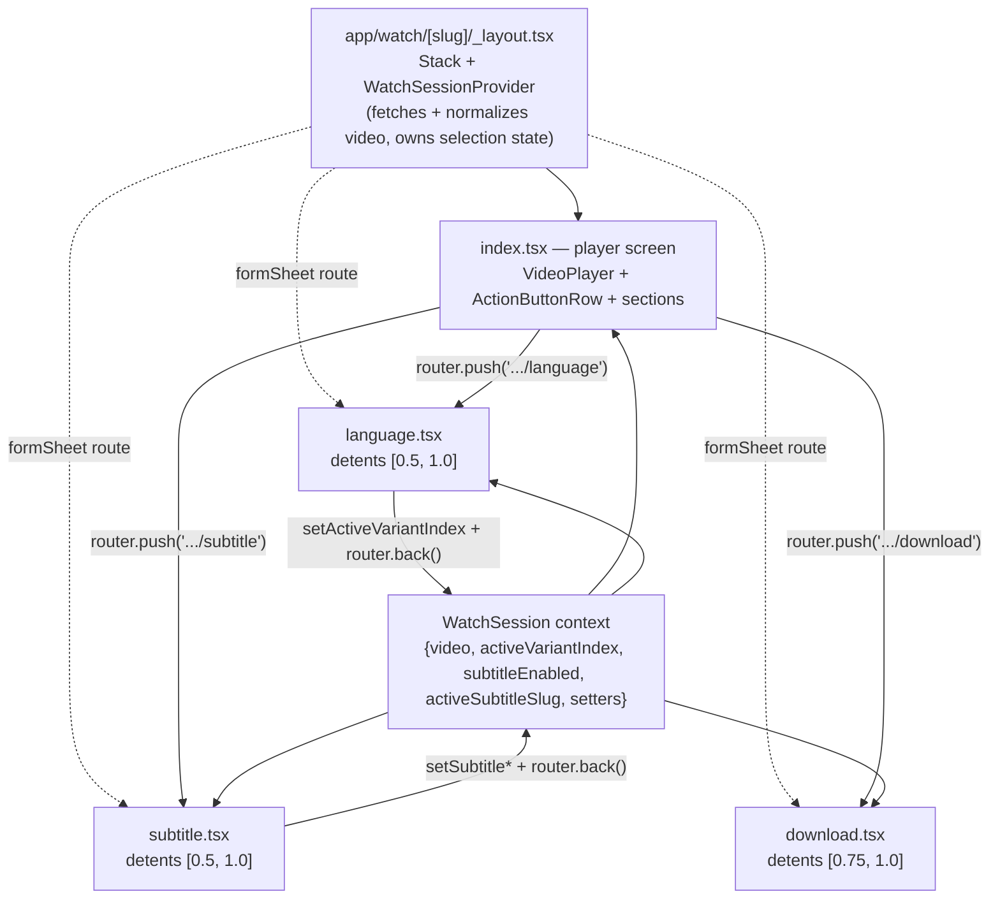

# refactor: Migrate watch-page sheets to native formSheet routes

## Summary

Replace `@gorhom/bottom-sheet` on the mobile watch page with React Navigation / `react-native-screens` **native `formSheet` presentation** (exposed through expo-router `Stack.Screen` options). This lets us delete four native-coupled dependencies — `@gorhom/bottom-sheet`, `react-native-reanimated`, `react-native-worklets`, `react-native-gesture-handler` — and remove the root `GestureHandlerRootView` wrapper, eliminating the entire class of Expo Go native-vs-JS version-mismatch crashes (the `Exception in HostFunction` failure that this plan's predecessor commit `31e2f060` only worked around by version-pinning).

The three watch sheets (Language, Subtitle, Download) become **modal sheet routes** under the watch screen. Native detents preserve the original 50% (Language/Subtitle) and 75% (Download) heights on **both iOS and Android** — something the rejected core-`<Modal pageSheet>` alternative could not do. Because route-based sheets cannot receive callback props, the watch screen's selection state (`activeVariantIndex`, `subtitleEnabled`, `activeSubtitleSlug`) lifts into a shared context over the watch subtree.

Sheet _content and behavior_ (search, virtualized list, subtitle toggle, default-language resolution, VTT overlay, `player.replace` language switch, download flow) is preserved — only the sheet _container mechanism_ and _trigger model_ change.

---

## Problem Frame

`@gorhom/bottom-sheet` (added 2026-05-27 in #1035) pulls in `react-native-reanimated` + `react-native-worklets`, whose JSI bindings must exactly match Expo Go's prebuilt native versions. Any drift throws `Exception in HostFunction: <unknown>` at module load, which cascades into "missing default export" → Unmatched Route on the watch page. Commit `31e2f060` fixed the immediate drift by pinning `reanimated@4.1.1` / `worklets@0.5.1`, but that pin is fragile in this pnpm monorepo (shared lockfile + `react-native-tvos` peer set actively re-drift transitive `worklets`), so every dependency bump risks reintroducing the crash.

Research confirmed these libs have **zero direct source consumers** other than `@gorhom/bottom-sheet`:

- `react-native-reanimated` / `react-native-worklets`: no source imports at all (the `Animated` API used in `app/watch/[slug].tsx` is RN-core `Animated`, not Reanimated).
- `react-native-gesture-handler`: imported only in `app/_layout.tsx` as the `GestureHandlerRootView` root wrapper, which exists solely to host `@gorhom`. `expo-router@6.0.23` declares it `optional: true` in `peerDependenciesMeta`; native-stack uses platform-native swipe-back, not gesture-handler.

So removing `@gorhom` unlocks removing all four libs and the root wrapper — collapsing the most version-fragile native surface in the app to zero.

---

## Requirements

- **R1.** The three watch action sheets (Language, Subtitle, Download) render as native sheets with detents preserving today's heights: Language/Subtitle ~50% (expandable to full), Download ~75%.
- **R2.** Sheets work on **both iOS and Android** (no platform regression vs. `@gorhom`).
- **R3.** All existing sheet behavior is preserved: language search + virtualized list over 2,200+ variants, immediate selection, subtitle on/off toggle, default-language resolution (`resolveDefaultSlug`), subtitle-selection memory, the VTT `SubtitleOverlay`, the `player.replace`/`replaceAsync` language switch, the Download quality picker + Terms-of-Use gate + file download + completion snackbar.
- **R4.** Selecting an item in a sheet updates the watch screen's player/subtitle state and dismisses the sheet.
- **R5.** `@gorhom/bottom-sheet`, `react-native-reanimated`, `react-native-worklets`, and `react-native-gesture-handler` are removed from `apps/mobile/package.json`; the `react-native-worklets` pnpm override is removed from root `package.json`; the `GestureHandlerRootView` wrapper is removed from `app/_layout.tsx`.
- **R6.** Jest `transformIgnorePatterns` and any reanimated/worklets babel config entries are cleaned up so the test + build pipeline matches the reduced dependency set.
- **R7.** The app launches in **Expo Go** with no `HostFunction` error and the watch page + all three sheets function end-to-end (verified on the birth-of-jesus segment per the project's mobile-verification convention).

---

## Key Technical Decisions

**KTD1 — Native `formSheet` via `react-native-screens`, not core `<Modal>`.** `react-native-screens@4.16.0` is already installed and core-bundled in Expo Go, needs neither gesture-handler nor reanimated, and is the only no-reanimated path that preserves multi-detent (50%/75%) sheets on both platforms. Core RN `<Modal presentationStyle="pageSheet">` was rejected: it has no `detents` prop (single fixed iOS height) and `presentationStyle` is iOS-only (Android falls back to full-screen). (see research: React Navigation v7 native-stack docs, react-native-screens 4.0 release notes.)

**KTD2 — Sheets become routes under a watch route directory.** Convert the leaf route `app/watch/[slug].tsx` into a directory: `app/watch/[slug]/_layout.tsx` (a native-stack `Stack` declaring the player screen + three formSheet screens), `app/watch/[slug]/index.tsx` (the player screen, today's `[slug].tsx` body), and `language.tsx` / `subtitle.tsx` / `download.tsx` (the sheet routes). Sheets open via `router.push`, dismiss via `router.back()` or native swipe-down.

**KTD3 — Lift selection state into a `WatchSession` context.** Route-based sheets can't take callback props, so a context provided by `app/watch/[slug]/_layout.tsx` owns the normalized video record + `{activeVariantIndex, subtitleEnabled, activeSubtitleSlug}` and their setters. The player screen and all three sheet routes consume it. The video query runs once in the layout/context (Apollo cache also dedupes by slug), so sheet routes don't refetch. This mirrors the existing `ExperienceSelectionProvider` context pattern.

**KTD4 — Drop `@gorhom` sub-components for core equivalents.** `BottomSheetFlatList`→`FlatList`, `BottomSheetScrollView`→`ScrollView`, `BottomSheetTextInput`→`TextInput`, `BottomSheetBackdrop`→native sheet dim. The virtualization tuning (`initialNumToRender`/`maxToRenderPerBatch`/`windowSize`) carries over verbatim onto the plain `FlatList`.

**KTD5 — Removal supersedes the version-pin commit.** Since reanimated/worklets/gesture-handler are fully removed, the pins from `31e2f060` (`reanimated@4.1.1`, `worklets@0.5.1` direct dep, root worklets override) are deleted outright rather than reverted to ranges. Safe because `apps/mobile` no longer references them and `apps/tv` does not use worklets at runtime.

**KTD6 — Android hardening from known `react-native-screens` v4 bugs.** Use explicit fractional detents `[0.5, 1.0]` / `[0.75, 1.0]` (never `fitToContents`, which mis-sizes for the keyboard on Android — screens #2664/#3181), use `flexGrow: 1` (not `flex: 1`) on the list container (screens #2560 empty-sheet bug), add a `SafeAreaProvider` inside each sheet route (root provider doesn't reach modal routes), and add a manual `KeyboardAvoidingView` around the search input on Android.

---

## High-Level Technical Design

Route + state-flow shape after migration:



Directional only; the implementer owns exact context shape and file boundaries.

---

## Output Structure

```
app/watch/[slug]/
├── _layout.tsx       # native-stack Stack; declares player + 3 formSheet screens; hosts WatchSessionProvider
├── index.tsx         # player screen (today's [slug].tsx body, minus sheet mounting)
├── language.tsx      # formSheet route — LanguageSheet content
├── subtitle.tsx      # formSheet route — SubtitleSheet content
└── download.tsx      # formSheet route — DownloadSheet content

src/contexts/WatchSessionProvider.tsx   # new: shared selection + video state
src/components/watch/LanguageSheet.tsx   # gorhom → core FlatList/TextInput; reads context
src/components/watch/SubtitleSheet.tsx   # gorhom → core FlatList/TextInput; reads context
src/components/watch/DownloadSheet.tsx   # gorhom → core ScrollView; reads context
src/components/ui/BottomSheet.tsx        # DELETED (gorhom wrapper)
```

The per-unit **Files** lists below are authoritative; the implementer may adjust layout if a cleaner shape emerges.

---

## Implementation Units

### U1. Watch route directory + WatchSession context + native-stack layout

**Goal:** Convert the leaf watch route into a directory with a native-stack layout that declares the player screen and three (initially empty) formSheet sheet routes, and a `WatchSession` context that owns the video record + selection state.

**Requirements:** R1, R2, R4 (foundation), R3 (state preservation).

**Dependencies:** none.

**Files:**

- `app/watch/[slug]/_layout.tsx` (new) — `Stack` with `index` + `language`/`subtitle`/`download` screens; the three sheet screens carry `presentation: "formSheet"` + detents (KTD6); wraps children in `WatchSessionProvider`.
- `app/watch/[slug]/index.tsx` (new; from current `app/watch/[slug].tsx`) — player screen body; reads selection from context instead of local `useState`; `ActionButtonRow` handlers call `router.push('/watch/<slug>/language|subtitle|download')`.
- `app/watch/[slug].tsx` (delete after move).
- `src/contexts/WatchSessionProvider.tsx` (new) — fetches via `GET_VIDEO_BY_SLUG`, normalizes, exposes `{video, loading, error, activeVariantIndex, setActiveVariantIndex, subtitleEnabled, setSubtitleEnabled, activeSubtitleSlug, setActiveSubtitleSlug}`; retains the two `resolveDefaultSlug` effects.
- `src/contexts/__tests__/WatchSessionProvider.test.tsx` (new).

**Approach:** Move the `useQuery`/`normalizeVideo`/default-resolution effects out of the screen into the provider. The player screen and sheets become context consumers. Keep RN-core `Animated` usage (scroll-to-top FAB, nav title) in the index screen untouched. Expo-router auto-discovers the new directory; the explicit `<Stack.Screen name="watch/[slug]">` in the root `app/_layout.tsx` becomes `name="watch/[slug]"` pointing at the directory's layout — verify the root layout's header options still apply (back button, tint).

**Patterns to follow:** `src/contexts/ExperienceSelectionProvider.tsx` (context shape), existing `app/_layout.tsx` `Stack.Screen` option blocks.

**Test scenarios:**

- Provider exposes the normalized video for a valid slug; `loading`/`error` states surface correctly.
- Default variant resolves via device locale → primary language → English → first (covers existing `resolveDefaultSlug` behavior).
- Default subtitle slug resolves when the active variant has subtitles; subtitles default disabled.
- Setting `activeVariantIndex` updates the value consumed by a test consumer.
- Edge: video with zero variants / zero subtitles does not throw.

**Verification:** Watch page renders via `app/watch/[slug]/index.tsx`; deep-link to a video still loads; header back button present.

### U2. LanguageSheet as a formSheet route

**Goal:** Render the language picker as a native formSheet route reading/writing `WatchSession` context, with core `FlatList`/`TextInput`.

**Requirements:** R1, R2, R3, R4.

**Dependencies:** U1.

**Files:**

- `app/watch/[slug]/language.tsx` (new) — route wrapper: `SafeAreaProvider` + the language UI; on select, `setActiveVariantIndex` then `router.back()`.
- `src/components/watch/LanguageSheet.tsx` (modify) — swap `BottomSheetFlatList`→`FlatList`, `BottomSheetTextInput`→`TextInput`; drop `@gorhom` imports; read variants + active slug from context; keep search filter, sort, `documentId` keys, native-name display, virtualization tuning, and the viewport-proportional bottom padding.
- `src/components/watch/__tests__/LanguageSheet.test.tsx` (update/new).

**Approach:** Keep the component's internal list/search logic; replace only the container + the two gorhom inputs. Android: `flexGrow: 1` on the list, `KeyboardAvoidingView` around the search field.

**Patterns to follow:** existing `LanguageSheet.tsx` list/search; KTD6 Android rules.

**Test scenarios:**

- Search filters by English and native names (case-insensitive).
- Selecting a language sets the active variant index and dismisses (mock `router.back`).
- Active language shown in the "Current" section with checkmark.
- Long list (2,200+ items) renders with virtualization props applied.
- Edge: empty search result shows "No languages found".

**Verification:** Opening the Language sheet shows the variant list at ~50%, expandable; selecting switches the player language and closes the sheet.

### U3. SubtitleSheet as a formSheet route

**Goal:** Render the subtitle picker as a native formSheet route reading/writing context.

**Requirements:** R1, R2, R3, R4.

**Dependencies:** U1.

**Files:**

- `app/watch/[slug]/subtitle.tsx` (new) — route wrapper as in U2.
- `src/components/watch/SubtitleSheet.tsx` (modify) — swap gorhom list/input for core; read `subtitleEnabled`/`activeSubtitleSlug` from context; preserve the on/off toggle, toggle-doesn't-dismiss behavior, switch-animates-before-close on select, subtitle-selection memory, "Current" always-shown section, viewport-proportional padding.
- `src/components/watch/__tests__/SubtitleSheet.test.tsx` (update/new).

**Approach:** Toggle writes `setSubtitleEnabled(value)` + preserves `activeSubtitleSlug`. Selecting a subtitle sets enabled+slug, animates the switch on, then `router.back()` after the ~300ms animation.

**Patterns to follow:** existing `SubtitleSheet.tsx` toggle/select handlers; U2 route wrapper.

**Test scenarios:**

- Toggling off preserves the previously selected subtitle slug (does not clear to null).
- Toggling off does not dismiss the route.
- Selecting a subtitle while toggle is off enables subtitles and dismisses after the switch animates.
- "Current" section renders whenever a subtitle is selected, regardless of toggle.
- Search filters subtitle languages; empty result shows "No subtitles found".

**Verification:** Subtitle sheet opens at ~50%; toggling and selecting drive the `SubtitleOverlay`/player; switch animates before close.

### U4. DownloadSheet as a formSheet route

**Goal:** Render the download flow as a native formSheet route at ~75%.

**Requirements:** R1, R2, R3, R4.

**Dependencies:** U1.

**Files:**

- `app/watch/[slug]/download.tsx` (new) — route wrapper; detents `[0.75, 1.0]`.
- `src/components/watch/DownloadSheet.tsx` (modify) — `BottomSheetScrollView`→`ScrollView`; drop gorhom; read variant/downloads from context; preserve quality picker, `expo-file-system/legacy` import + `cacheDirectory` null-guard, unique `documentId`-prefixed filenames, Terms-of-Use read-before-accept gate, `Sharing.shareAsync` iOS-cancel try/catch, completion snackbar trigger.
- `src/components/watch/__tests__/DownloadSheet.test.tsx` (update/new).

**Approach:** Container swap only; the download/share logic is gorhom-independent and must survive verbatim (regression risks per learnings doc). Snackbar lives on the player screen — on completion, the route signals via context or navigates back then triggers it.

**Patterns to follow:** existing `DownloadSheet.tsx`; `docs/solutions/best-practices/bottom-sheet-migration-expo-sdk54-pitfalls-20260527.md` pitfalls 4–8.

**Test scenarios:**

- Quality options render from the active variant's downloads.
- Download button disabled until Terms-of-Use accepted.
- Download writes a uniquely-named file (documentId-prefixed); `cacheDirectory` null is guarded.
- iOS share cancel is swallowed (no error surfaced).
- Completion triggers the snackbar.
- Edge: variant with no downloads shows an appropriate empty state.

**Verification:** Download sheet opens at ~75%; a download completes and shows the snackbar.

### U5. Remove the @gorhom wrapper + GestureHandlerRootView

**Goal:** Delete the shared gorhom `BottomSheet` wrapper and the root gesture-handler wrapper now that nothing uses them.

**Requirements:** R5.

**Dependencies:** U2, U3, U4 (all consumers migrated).

**Files:**

- `src/components/ui/BottomSheet.tsx` (delete).
- `app/_layout.tsx` (modify) — remove the `GestureHandlerRootView` import + the try/catch require + the `RootWrapper = GestureHandlerRootView ?? View` line; render the root subtree under a plain `View`.

**Approach:** The existing `?? View` fallback already proves the app renders without the wrapper. Confirm no remaining import of `src/components/ui/BottomSheet`.

**Patterns to follow:** current `app/_layout.tsx` structure.

**Test scenarios:** `Test expectation: none — deletion + root-wrapper removal; covered by U7 end-to-end launch verification.`

**Verification:** App still launches; navigation + sheets work without `GestureHandlerRootView`.

### U6. Drop dependencies + revert version pins + clean test/build config

**Goal:** Remove the four native libs and the version-pin artifacts, and align Jest/babel config to the reduced set.

**Requirements:** R5, R6.

**Dependencies:** U5.

**Files:**

- `apps/mobile/package.json` (modify) — remove `@gorhom/bottom-sheet`, `react-native-reanimated`, `react-native-worklets`, `react-native-gesture-handler`; remove the `react-native-reanimated`/`react-native-gesture-handler`/`react-native-worklets`/`@gorhom` entries from Jest `transformIgnorePatterns` and the `react-native-reanimated/plugin/` line.
- `package.json` (root, modify) — remove the `react-native-worklets` pnpm override.
- `babel.config.js` (verify/modify) — confirm whether the manual reanimated plugin entry exists; if present and now unused, remove it (SDK 54 wires reanimated via `babel-preset-expo`; with reanimated gone, no plugin needed).
- `pnpm-lock.yaml` (regenerated by install).

**Approach:** Edit manifests, run `pnpm install`, then a clean Metro start (`expo start --clear`) since native-module removal + babel change needs a cache wipe. This supersedes commit `31e2f060` (KTD5). Note: removing the worklets override lets `apps/tv`'s transitive worklets float back to 0.8.3 — acceptable, since tv doesn't use it at runtime (call out in the PR).

**Patterns to follow:** `docs/solutions/mobile/quiz-button-section-webview-modal-pipeline.md` (native-module + Jest `transformIgnorePatterns` coupling); `docs/solutions/mobile/metro-pnpm-symlink-react-duplicate-resolution.md` (clear Metro cache after worklets/babel change).

**Test scenarios:** `Test expectation: none — dependency + config removal; correctness proven by U7 (clean Expo Go launch) and the existing suite passing without the reanimated/gorhom transform entries.`

**Verification:** `pnpm install` clean; `pnpm --filter @forge/mobile exec tsc --noEmit` passes; Jest runs without the removed transform entries; `require.resolve` of the four libs fails from `apps/mobile`.

### U7. End-to-end Expo Go verification on birth-of-jesus

**Goal:** Prove the whole migration works in Expo Go with no HostFunction error.

**Requirements:** R7.

**Dependencies:** U6.

**Files:** none (verification unit).

**Approach:** Per the project's mobile-verification convention: clean Metro start, launch via the reachable `exp://127.0.0.1:8081`, navigate to the birth-of-jesus segment, and exercise each sheet (Language switch resumes playback in new dub; Subtitle toggle + select drives the overlay; Download completes). Confirm no red error screen and no `Exception in HostFunction` in the Metro log.

**Test scenarios:** `Test expectation: none — manual simulator verification; this unit is the acceptance gate, not automated coverage.`

**Verification:** App launches to home; birth-of-jesus watch page renders; all three sheets open at correct detents on iOS sim; language switch, subtitle overlay, and download all function; Metro log clean of HostFunction errors.

---

## Scope Boundaries

**In scope:** the three watch-page sheets, their route restructure, the shared selection context, removal of the four native libs + root wrapper + version-pin artifacts + Jest/babel cleanup, and Expo Go verification.

**Out of scope (unchanged behavior):** Share (already native `Share.share()`), the `VideoPlayer`/`PlayerControls`/`SubtitleOverlay` internals, the `resolveDefaultSlug` logic, the `normalizeVideo` normalizer, and the player language-switch resume logic (carried into the new structure as-is, not redesigned).

### Deferred to Follow-Up Work

- Capturing the reverse-migration rationale via `/ce-compound` (the team now has two opposing sheet decisions two days apart; the _why_ — Expo Go native-module fragility — is worth recording).
- Android device QA pass on the formSheet detents/keyboard (the screens v4 Android caveats are mitigated in KTD6 but warrant a real-device check).
- `apps/tv` transitive `worklets` cleanup, if ever desired (not needed; tv doesn't use it at runtime).

---

## Risks & Dependencies

- **State-lifting regressions (medium).** Moving selection state from the screen into context is the riskiest change; the player↔sheet round-trip (language switch updating `activeVariantIndex` → `VideoPlayer` `streamingUrl`) must behave identically. Mitigation: U1 lands the context with tests before any sheet migrates; verify the language-switch resume in U7.
- **Android formSheet bugs (medium).** `react-native-screens` v4 has known Android keyboard/detent issues. Mitigation: KTD6 (explicit detents, `flexGrow`, in-sheet `SafeAreaProvider`, manual `KeyboardAvoidingView`).
- **Behavior loss during container swap (medium).** Download flow + 2,200-item virtualization + subtitle memory are gorhom-independent and easy to drop accidentally. Mitigation: per-unit test scenarios re-prove pitfalls 4–10 from the migration learnings doc.
- **Native-module removal needs cache wipe / dev rebuild (low).** JS reload won't reflect dropped native modules. Mitigation: `expo start --clear` in U6; Expo Go already bundles the natives so no EAS rebuild is required for Expo Go verification.
- **Dependency:** `react-native-screens@4.16.0` (already installed); no new dependencies added.

---

## Sources & Research

- React Navigation v7 native-stack — platform-native gestures; `presentation: "formSheet"`, `sheetAllowedDetents`, `sheetGrabberVisible`: https://reactnavigation.org/docs/native-stack-navigator/
- `expo-router@6.0.23` `peerDependenciesMeta` marks `react-native-gesture-handler` / `react-native-reanimated` `optional: true` (basis for safe removal).
- react-native-screens 4.0 (formSheet on Android + custom iOS detents): https://swmansion.com/blog/introducing-react-native-screens-4-0-0-1b833ff98a55/
- Android caveats: screens #3181 (keyboard), #2664, #2560 (flex empty-sheet).
- RN 0.81 Modal (no `detents`; `presentationStyle` iOS-only) — basis for rejecting core Modal: https://reactnative.dev/docs/0.81/modal
- `docs/solutions/best-practices/bottom-sheet-migration-expo-sdk54-pitfalls-20260527.md` — the forward migration being reversed; pitfalls 4–10 are carried-forward regression risks.
- `docs/solutions/best-practices/mobile-video-detail-page-patterns-20260527.md` — watch screen + mounted-vs-visible animation idiom.
- `docs/plans/2026-05-27-001-feat-mobile-watch-bottom-sheets-plan.md` — original sheet design (snap points, behaviors) being unwound.
- Predecessor commit `31e2f060` — the version-pin workaround this migration supersedes (KTD5).
