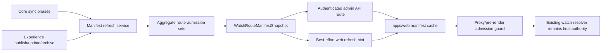

# feat: Add admin-owned watch route manifest

## Summary

Add an admin-generated watch route-admission manifest that lets `apps/web` reject impossible public `/watch` paths before App Router rendering, admin GraphQL resolution, or ISR cache entry creation. The admin slice computes, persists, refreshes, and serves compact slug/language sets from canonical admin data while leaving the web consumer for the stacked web branch.

---

## Problem Frame

The static watch-route rewrite plan bounds internal locale params, but `params.rest` remains attacker-controlled. Random-looking paths such as `/watch/anything.html/english.html` can still reach the cacheable watch renderer and issue admin lookups before returning 404, creating avoidable render/GraphQL work today and a possible ISR storage-spray surface once static route caching is active.

The data needed to decide whether a watch path could ever be valid belongs to `apps/admin`: Core sync owns videos, video locales, parent/child relations, languages, and dubs, while admin editing owns Experience publish/update/archive state. Hardcoding route admission in `apps/web` would drift from the content source of truth.

---

## Requirements

- R1. Admin computes the public watch route-admission manifest from canonical admin data: `Language`, `Video`, `VideoLocale`, `VideoRelation`, `VideoDub`, `Experience`, and `ExperienceLocale`.
- R2. The manifest stays compact: payload growth is proportional to content slugs, one-segment slugs, parent/child pairs, and audio language slugs, not content-by-language route permutations.
- R3. Manifest output is deterministic, versioned, timestamped, observable, and persisted so request-time reads do not recompute large aggregate queries.
- R4. Route-relevant Experience publish/update/archive flows and Core sync phases refresh the manifest without blocking admin publish or sync UX.
- R5. `apps/web` can fetch the latest manifest through an authenticated, documented service contract with explicit cache validators and missing-snapshot behavior.
- R6. Admin emits a best-effort web revalidation/refresh hint after a successful manifest refresh using the existing admin-to-web notification pattern unless implementation discovers a hard consumer mismatch.
- R7. Operators can refresh and inspect manifest counts locally without dumping the full payload by default or accidentally running against production.
- R8. Tests cover draft/unpublished state, deletes and soft deletes, playable-dub gating, relation visibility, Experience route semantics, large fanout, auth, refresh hooks, and deterministic output.

---

## Scope Boundaries

- Do not implement the `apps/web` proxy or pre-render manifest consumer in this branch.
- Do not change the public `/watch` URL shape.
- Do not enumerate every localized public route, `{contentSlug, audioLanguageSlug}` pair, or `{parentSlug, childSlug, audioLanguageSlug}` triple.
- Do not move audio-language aliasing, UI message-locale resolution, or `<html lang>` logic into admin.
- Do not make admin publish/update/archive UX depend on a synchronous web/cache refresh.
- Do not expose draft, archived, unpublished, internal IDs, localized titles, block content, media URLs, subtitles, search data, or other rendering payloads through the manifest.

### Deferred to Follow-Up Work

- `apps/web` route-admission consumer: implement in the stacked web branch after this admin contract lands.
- Edge-readable storage: keep Postgres as the first persisted store; push-to-edge or cache-distribution work belongs in a later slice if web needs it.
- Route-manifest LaunchDarkly or rollout wiring: add only when the web consumer requires runtime rollout control.
- Dedicated manifest revalidation endpoint on web: keep the existing `/api/revalidate` extension first unless the consumer branch proves it needs a separate endpoint.

---

## Context & Research

### Relevant Code and Patterns

- `apps/admin/prisma/schema.prisma` defines the route-relevant source tables and fields: language slugs/deletion, video slugs/deletion/locales/relations/dubs, Experience archive state, and Experience locale status/slug/path metadata.
- `apps/admin/src/services/revalidate-webhook.ts` is the existing best-effort admin-to-web notification pattern. It is bearer-authenticated, silently no-ops when config is absent, catches network and non-2xx failures, and does not block editorial flows.
- `apps/admin/src/services/experience.service.ts` already calls `emitRevalidateWebhook` after published Experience locale updates, publish, homepage/default template changes, and archive.
- `apps/admin/src/services/core-sync/orchestrator.ts`, `apps/admin/src/services/core-sync/job.ts`, and `apps/admin/src/workflows/coreSync.ts` run Core sync phases in a known order. Route-relevant phases are `languages`, `videos`, and `video-dubs`; relation-bearing video sync should be treated as route-relevant.
- `apps/admin/src/graphql/types/video.ts` exposes `childDubLanguages` as a distinct playable language set across children, explicitly avoiding the large children-by-dubs fanout. The manifest should follow that scaling philosophy.
- `apps/admin/src/auth/consumer-bearer.ts` and `docs/solutions/architecture-patterns/consumer-bearer-rate-limit-identity-pattern-20260513.md` provide the existing service-to-service bearer identity used by `apps/web` SSR without granting editorial permissions.
- `apps/web/src/proxy.ts` and `docs/plans/2026-05-29-001-perf-restore-watch-static-render-locale-rewrite-plan.md` define the web-side route shapes this manifest will admit before final rendering.

### Institutional Learnings

- The existing consumer-bearer pattern gives web a stable service identity for admin reads without widening editorial permissions; new service endpoints should reuse that style when the caller is `apps/web`.
- The web revalidation webhook is intentionally receiver-first and best-effort. Manifest refresh notifications should preserve that failure model so admin remains usable when web is unavailable.
- Prior watch-route performance work found the expensive fanout is children-by-dubs. Any route-admission contract that multiplies parents/children by languages would reintroduce the same scaling problem in a new place.

### External References

- None. Local repo contracts and existing admin/web integration patterns are sufficient for this plan.

---

## Key Technical Decisions

- Persist the latest manifest in admin Postgres first: A singleton JSONB snapshot keeps request-time reads cheap without adding a second storage system to this slice. Edge storage remains deferred until the web consumer proves it needs it.
- Shape the manifest as admission sets, not route records: Include `contentSlugs`, `oneSegmentSlugs`, `episodePairsByParent`, and `audioLanguageSlugs`, plus `version` and `generatedAt`. Do not include localized route permutations or rendering payloads.
- Use deterministic ordering and content-derived versioning: Sorted arrays make snapshots stable, simplify tests, and let web compare versions or ETags safely.
- Prefer raw SQL for aggregate generation when Prisma would over-fetch relation trees: The service boundary can still return typed domain data while avoiding large in-memory relation graphs.
- Gate `audioLanguageSlugs` to languages with at least one playable dub: This gives the web prefilter a public playable-audio set rather than a UI-message locale set or every known Core language.
- Treat the manifest as a conservative prefilter: The real web resolver still decides final rendering. False negatives are worse than false positives because they 404 valid public URLs; implementation should prefer including a candidate when current web semantics are ambiguous.
- Reuse `WEB_ADMIN_API_KEYS` / consumer-bearer auth for the read endpoint unless implementation discovers a stronger existing route-handler helper: The endpoint serves public-admission metadata to `apps/web`, so a permissionless service identity matches the existing admin GraphQL caller contract.
- Extend the existing revalidation webhook first: Add a manifest model to the established admin-to-web notification union before introducing a second web callback URL.

---

## Open Questions

### Resolved During Planning

- Should the first persisted store be Postgres or an edge-readable store? Use Postgres singleton JSONB in this slice; defer edge distribution.
- Should `audioLanguageSlugs` include every language or only playable languages? Use only non-deleted language slugs that have at least one published, HLS-backed, non-deleted dub.
- Should manifest refresh block publish or sync? No. It must log failures and preserve the existing best-effort admin UX model.
- Should the web refresh hint use the existing revalidation contract or a dedicated endpoint? Extend the existing revalidation contract first.
- Should admin include `pathSegment` Experience routes automatically? No. Include only shapes that match current public watch dispatch; unsupported multi-segment Experience paths stay out until web supports them.

### Deferred to Implementation

- Exact parent routability rule: Confirm against current web `resolveWatchPage` / series rendering semantics whether a parent needs a playable trailer, at least one routable child, or either. Preserve current behavior rather than inventing a stricter SEO rule.
- Missing snapshot behavior by environment: Decide in implementation whether local/dev can generate on demand while production returns a clear 503. The plan requires the behavior to be explicit and tested.
- Final aggregate query shape: Choose the exact SQL/Prisma mix after inspecting performance and explainability while keeping the bounded-output invariant.

---

## High-Level Technical Design

> _This illustrates the intended approach and is directional guidance for review, not implementation specification. The implementing agent should treat it as context, not code to reproduce._

Manifest field semantics:

- `version`: deterministic content hash or equivalent monotonically changing token for cache replacement and logging.
- `generatedAt`: ISO timestamp for observability.
- `contentSlugs`: valid first-segment `.html` slugs for two-segment watch paths, including public videos/series/collections and published Experience slugs currently addressable by watch routes.
- `oneSegmentSlugs`: valid one-segment collection/experience slugs such as `/watch/easter.html`; language slugs remain checked separately by web so localized-home behavior is preserved.
- `episodePairsByParent`: parent slug to child slug list for three-segment episode routes.
- `audioLanguageSlugs`: public audio-language slugs backed by at least one playable dub somewhere.

---

## Implementation Units

### U1. Manifest Service and Bounded Data Rules

**Goal:** Add the service that computes the route-admission manifest from admin data with deterministic output and bounded scaling.

**Requirements:** R1, R2, R3, R8

**Dependencies:** None

**Files:**

- Create: `apps/admin/src/services/watch-route-manifest.service.ts`
- Test: `apps/admin/src/services/watch-route-manifest.service.test.ts`

**Approach:**

- Compute the four manifest sets from `Language`, `Video`, `VideoLocale`, `VideoRelation`, `VideoDub`, `Experience`, and `ExperienceLocale`.
- Include video slugs only when the video is not soft-deleted, has a non-empty slug, and has enough public state to match current web watch rendering semantics.
- For directly playable video admission, require at least one non-deleted, published dub with HLS and a non-deleted language slug.
- Include parent/child pairs only when both sides are public candidates, the child has a playable dub, and the relation is visible under the same public/consumer-bearer rules as GraphQL children.
- Include Experience slugs only when the parent is not archived, the locale is published, the slug is non-empty, and the path shape is currently routable by watch.
- Sort arrays and child lists before versioning.
- Log counts, payload size, and generation duration without logging the full payload.

**Execution note:** Implement the service test-first around data-rule fixtures before optimizing query shape.

**Patterns to follow:**

- `apps/admin/src/graphql/types/video.ts` for `childDubLanguages` fanout avoidance.
- `apps/admin/prisma/schema.prisma` for source-of-truth visibility fields.
- Existing service tests under `apps/admin/src/services/*.test.ts`.

**Test scenarios:**

- Happy path: a published video locale with a published HLS dub and non-deleted language slug appears in `contentSlugs` and its language appears in `audioLanguageSlugs`.
- Happy path: a public parent/child relation with a playable child appears once under `episodePairsByParent[parentSlug]`.
- Happy path: a published, non-archived Experience locale with a watch-routable slug appears in the relevant slug set.
- Edge case: output ordering is stable when fixture rows are inserted in different orders.
- Edge case: a large fanout fixture with many child dubs emits one child pair per relation plus one language slug per distinct playable language, not route permutations.
- Error path: draft video locales, archived Experiences, soft-deleted videos, soft-deleted dubs, soft-deleted languages, empty slugs, unpublished dubs, and dubs without HLS are excluded.
- Integration: relation visibility uses the same public assumptions as `Video.children` / `Video.parents` rather than exposing editor-only relation state.

**Verification:**

- Service-level tests prove the manifest contains only public candidates, remains deterministic, and preserves the compact scaling invariant.
- Logs expose generation counts and duration without payload leakage.

### U2. Snapshot Persistence and Versioning

**Goal:** Persist the latest manifest snapshot so API reads and web refresh flows do not recompute aggregate queries on every request.

**Requirements:** R3, R8

**Dependencies:** U1

**Files:**

- Modify: `apps/admin/prisma/schema.prisma`
- Create: `apps/admin/prisma/migrations/<timestamp>_watch_route_manifest_snapshot/migration.sql`
- Create: `apps/admin/src/services/watch-route-manifest-store.ts`
- Test: `apps/admin/src/services/watch-route-manifest-store.test.ts`

**Approach:**

- Add a singleton-style Prisma model such as `WatchRouteManifestSnapshot` with a stable key, `version`, `generatedAt`, `payload`, `payloadSizeBytes`, `createdAt`, and `updatedAt`.
- Store the manifest payload as JSONB.
- Upsert the singleton inside a narrow transaction after generation succeeds.
- Derive `payloadSizeBytes` from the serialized payload for monitoring and tests.
- Keep historical snapshots out of this first slice unless implementation discovers an existing retention pattern that is nearly free.

**Execution note:** Start with persistence tests around upsert and stale-read behavior before wiring lifecycle hooks.

**Patterns to follow:**

- Existing Prisma model naming and migration conventions in `apps/admin/prisma/schema.prisma`.
- Service-owned persistence boundaries in `apps/admin/src/services/`.

**Test scenarios:**

- Happy path: the first refresh creates the singleton snapshot with version, timestamp, payload, and byte size.
- Happy path: a later refresh replaces the singleton payload and version without creating multiple current snapshots.
- Edge case: stale-read helper returns `null` or a typed missing result when no snapshot exists.
- Edge case: generated timestamps and payload bytes remain consistent with the stored payload.
- Error path: malformed persistence input fails before storing a partial snapshot.

**Verification:**

- The admin Prisma schema and migration introduce the snapshot table without touching generated Prisma client artifacts manually.
- Store tests prove latest-manifest reads are cheap and deterministic.

### U3. Refresh Hooks for Admin Lifecycles

**Goal:** Refresh the manifest after route-relevant admin lifecycle changes while preserving non-blocking publish and sync behavior.

**Requirements:** R4, R8

**Dependencies:** U1, U2

**Files:**

- Create: `apps/admin/src/services/watch-route-manifest-refresh.service.ts`
- Test: `apps/admin/src/services/watch-route-manifest-refresh.service.test.ts`
- Modify: `apps/admin/src/services/experience.service.ts`
- Modify: `apps/admin/src/services/experience.service.test.ts`
- Modify: `apps/admin/src/services/core-sync/orchestrator.ts`
- Modify: `apps/admin/src/services/core-sync/orchestrator.test.ts`
- Modify: `apps/admin/src/services/core-sync/job.ts`
- Modify: `apps/admin/src/services/core-sync/job.test.ts`
- Modify: `apps/admin/src/workflows/coreSync.ts`

**Approach:**

- Add a small refresh coordinator that calls the U1/U2 generation-and-store path and logs structured success/failure.
- Trigger refresh after route-relevant Experience publish/update/archive events that already emit web revalidation.
- Refresh once per Core sync run when route-relevant phases ran successfully enough to affect admission: `languages`, `videos`, `video-dubs`, and relation-bearing video sync.
- Skip refresh when only unrelated Core sync phases ran.
- Preserve the existing failure model: refresh failure logs but does not fail publish, archive, or sync jobs.

**Patterns to follow:**

- `apps/admin/src/services/revalidate-webhook.ts` no-throw contract.
- Existing Core sync phase scope and result handling in `apps/admin/src/services/core-sync/orchestrator.ts`.
- useworkflow job entry points in `apps/admin/src/workflows/coreSync.ts`.

**Test scenarios:**

- Happy path: publishing an Experience locale requests exactly one manifest refresh after the write succeeds.
- Happy path: updating a published Experience locale requests refresh; updating a draft-only locale does not refresh unless it changes a currently public route candidate.
- Happy path: archiving an Experience requests refresh after archive succeeds.
- Happy path: a Core sync run containing route-relevant phases requests one refresh after the run, not once per row or once per phase.
- Edge case: a Core sync run containing only unrelated phases skips refresh.
- Error path: refresh rejection is logged and swallowed; the publish/archive/sync method still returns its normal result.
- Integration: refresh hooks do not duplicate existing web revalidation calls or require web config to be present.

**Verification:**

- Lifecycle tests prove refresh is requested at the right boundaries and remains fire-and-forget from the caller's perspective.
- Core sync tests prove refresh frequency is once per relevant run.

### U4. Authenticated Manifest Read Endpoint

**Goal:** Expose the latest manifest to `apps/web` through an authenticated admin API route with explicit caching and missing-snapshot semantics.

**Requirements:** R5, R8

**Dependencies:** U2

**Files:**

- Create: `apps/admin/src/app/api/watch-route-manifest/route.ts`
- Test: `apps/admin/src/app/api/watch-route-manifest/route.test.ts`

**Approach:**

- Add a `GET` route that reads the latest persisted snapshot and returns the manifest JSON.
- Authenticate using the existing consumer-bearer / `WEB_ADMIN_API_KEYS` pattern unless a route-handler helper already centralizes that check.
- Return an `ETag` based on the manifest version and use an explicit service-to-service cache policy such as private revalidation rather than anonymous public caching.
- Support conditional reads if straightforward: matching `If-None-Match` returns 304 without payload.
- Define missing-snapshot behavior clearly. Prefer controlled local generation where safe and a production 503 with operator guidance when on-demand generation would be too expensive.

**Patterns to follow:**

- `apps/admin/src/auth/consumer-bearer.ts` for bearer validation.
- `apps/admin/src/app/api/search/route.ts` for route-handler auth/logging style where applicable.
- `docs/solutions/architecture-patterns/consumer-bearer-rate-limit-identity-pattern-20260513.md`.

**Test scenarios:**

- Happy path: a valid consumer bearer receives the latest manifest payload, version-derived ETag, and expected cache headers.
- Happy path: matching `If-None-Match` returns 304 with no manifest body when conditional reads are implemented.
- Edge case: missing snapshot returns the chosen explicit missing state without falling through to an unhandled exception.
- Error path: missing, malformed, or invalid bearer returns unauthorized without exposing whether a snapshot exists.
- Error path: store read failure returns a controlled server error and logs without payload leakage.
- Integration: the endpoint payload exactly matches the U1 manifest contract and does not add internal IDs or rendering data.

**Verification:**

- Endpoint tests cover auth, response headers, payload shape, missing snapshot, and conditional reads.
- The endpoint is usable by the existing `apps/web` service identity without creating a new permission-bearing principal.

### U5. Web Refresh Hint Extension

**Goal:** Notify web when the manifest changes using the existing best-effort admin-to-web revalidation contract.

**Requirements:** R4, R6, R8

**Dependencies:** U2, U3

**Files:**

- Modify: `apps/admin/src/services/revalidate-webhook.ts`
- Modify: `apps/admin/src/services/revalidate-webhook.test.ts`

**Approach:**

- Extend the revalidation model union with a manifest-specific model such as `watch-route-manifest`.
- Emit the manifest refresh hint after a manifest snapshot is successfully replaced, not before generation/persistence succeeds.
- Keep the payload small and avoid including the full manifest in the webhook body.
- Preserve the current no-throw, config-missing, non-2xx, network-error, timeout, and bearer-header behavior.
- Leave the web receiver implementation to the stacked web branch; this unit only updates the admin sender contract.

**Patterns to follow:**

- Existing `emitRevalidateWebhook` contract and tests.
- Admin CLAUDE deploy-order note for receiver-first webhook changes.

**Test scenarios:**

- Happy path: manifest refresh emits the new model with bearer auth and minimal entry payload.
- Edge case: absent slug/locale fields are omitted or null-handled consistently with existing webhook behavior.
- Error path: config missing, remote non-2xx, network failure, and timeout continue to return typed outcomes and never throw.
- Integration: Experience/video/watch-setting webhook behavior remains unchanged after extending the union.

**Verification:**

- Revalidation webhook tests prove the new manifest model is accepted without regressing existing models.
- The admin sender can be deployed before web consumes the new model because missing or unknown receiver behavior remains non-blocking.

### U6. Operator Script and Documentation

**Goal:** Provide a safe local/operator workflow to generate, inspect, and document manifest snapshots.

**Requirements:** R7, R8

**Dependencies:** U1, U2

**Files:**

- Modify: `apps/admin/package.json`
- Create: `apps/admin/src/scripts/generate-watch-route-manifest.ts`
- Test: `apps/admin/src/scripts/generate-watch-route-manifest.test.ts`
- Modify: `apps/admin/CLAUDE.md`

**Approach:**

- Add an admin script entry that refreshes the manifest snapshot and prints counts, version, generated timestamp, payload size, and generation duration.
- Default output should be summary-only. Add an explicit print mode for local debugging if useful, but avoid dumping large JSON into logs by default.
- Reuse existing production-refusal patterns from admin scripts so accidental production mutations are fail-closed unless the repo already has an explicit safe-production override convention.
- Document when operators should run the script locally, how to interpret counts, and which fields the web branch can rely on.

**Patterns to follow:**

- Safe admin script patterns listed in `apps/admin/CLAUDE.md`.
- Existing script tests under `apps/admin/src/scripts/`.

**Test scenarios:**

- Happy path: against a non-production database, the script refreshes the snapshot and prints summary counts without the full manifest payload.
- Edge case: print mode emits the manifest only when explicitly requested.
- Error path: production-like database URLs or unparseable targets are refused according to the existing admin script safety pattern.
- Error path: generation failure exits with a clear message and does not print a stale success summary.
- Integration: docs identify the manifest fields, refresh triggers, and web-consumer handoff without instructing operators to edit generated artifacts.

**Verification:**

- Script tests or service-backed script coverage prove safe defaults and production guards.
- `apps/admin/CLAUDE.md` documents the operator workflow and the admin-to-web contract at the same level as existing local-dev scripts.

---

## Consumer Contract for the Web Branch

- Web can reject a two-segment route when `contentSlug` is absent or `audioLanguageSlug` is absent.
- Web can reject a three-segment route when the parent is absent, the child is not listed under that parent, or the audio language slug is absent.
- Web can preserve one-segment localized-home behavior by checking public language slugs first and `oneSegmentSlugs` second.
- Web must still call the real resolver after manifest admission. The manifest is an admission prefilter, not the final content renderer.
- Web should treat a false negative as more severe than a false positive because a false negative 404s a valid public URL.

---

## System-Wide Impact

- **Interaction graph:** Core sync and Experience writes feed manifest refresh; manifest refresh updates the snapshot; the snapshot feeds an authenticated admin route and a best-effort web refresh hint; web later uses the contract before its existing resolver.
- **Error propagation:** Generation or webhook failures must be logged and swallowed from publish/sync callers. API read failures should become controlled HTTP responses, not unhandled route crashes.
- **State lifecycle risks:** Partial refresh writes must not leave a half-updated snapshot. Snapshot replacement should be transactional, deterministic, and versioned.
- **API surface parity:** This branch adds a new admin route-handler contract and extends the existing web revalidation sender union. It does not change admin GraphQL schema or generated `packages/admin-graphql` outputs unless implementation chooses a GraphQL surface, which this plan does not recommend.
- **Integration coverage:** Unit tests should prove data rules; route tests should prove auth and headers; lifecycle tests should prove refresh hooks. The web branch still needs browser/proxy proof that hostile paths stop before admin GraphQL.
- **Unchanged invariants:** Public watch URL shape, final web rendering semantics, admin publish UX, Core sync phase ordering, and consumer-bearer zero-editorial-permission semantics remain unchanged.

---

## Risks & Dependencies

| Risk                                                                      | Mitigation                                                                                                                      |
| ------------------------------------------------------------------------- | ------------------------------------------------------------------------------------------------------------------------------- |
| Manifest false negatives break valid public watch URLs                    | Preserve current web semantics, bias ambiguous route candidates toward inclusion, and keep the real resolver as final authority |
| Fanout accidentally grows as content x language                           | Test a large fanout fixture and assert output grows by slug sets and parent/child pairs only                                    |
| Refresh hooks make admin writes or sync brittle                           | Follow `emitRevalidateWebhook` no-throw semantics and log structured failures without blocking callers                          |
| Auth endpoint accidentally grants editorial access or leaks internal data | Reuse consumer-bearer validation and return only route-admission metadata, no drafts, IDs, content, or media data               |
| Postgres snapshot becomes stale after missed refresh                      | Provide operator refresh script, version/generation observability, and web-side version logging in the consumer branch          |
| Web receiver is not ready for the new revalidation model                  | Keep sender best-effort and deploy receiver support before relying on manifest refresh hints                                    |
| Prisma migration or JSONB model churn slows the stacked branch            | Keep persistence as a singleton model with minimal indexes and no history table in this slice                                   |

---

## Documentation / Operational Notes

- Update `apps/admin/CLAUDE.md` with the local refresh/inspection workflow, required env expectations, payload fields, and deploy ordering notes.
- If admin Pothos GraphQL schema is not changed, do not regenerate `apps/admin/schema.graphql` or `packages/admin-graphql` outputs.
- If implementation changes Prisma schema, include the migration and validate a fresh local admin database can apply it.
- Record manifest counts from a restored admin snapshot before handing the contract to the web branch: `contentSlugs`, `oneSegmentSlugs`, parent/child pair count, `audioLanguageSlugs`, payload size, and generation duration.
- Before `ce-work`, create or update a dedicated roadmap ticket if this work should be tracked separately from the completed `feat-148` web static-rendering ticket.

---

## Sources & References

- Origin plan: [docs/plans/2026-05-29-001-perf-restore-watch-static-render-locale-rewrite-plan.md](2026-05-29-001-perf-restore-watch-static-render-locale-rewrite-plan.md)
- Related roadmap: [docs/roadmap/platform/feat-148-watch-static-render-locale-rewrite.md](../roadmap/platform/feat-148-watch-static-render-locale-rewrite.md)
- Admin guide: [apps/admin/AGENTS.md](../../apps/admin/AGENTS.md)
- Admin conventions: [apps/admin/CLAUDE.md](../../apps/admin/CLAUDE.md)
- Prisma source data: `apps/admin/prisma/schema.prisma`
- Best-effort webhook pattern: `apps/admin/src/services/revalidate-webhook.ts`
- Experience refresh precedent: `apps/admin/src/services/experience.service.ts`
- Core sync orchestration: `apps/admin/src/services/core-sync/orchestrator.ts`, `apps/admin/src/services/core-sync/job.ts`, `apps/admin/src/workflows/coreSync.ts`
- Consumer bearer pattern: [docs/solutions/architecture-patterns/consumer-bearer-rate-limit-identity-pattern-20260513.md](../solutions/architecture-patterns/consumer-bearer-rate-limit-identity-pattern-20260513.md)
