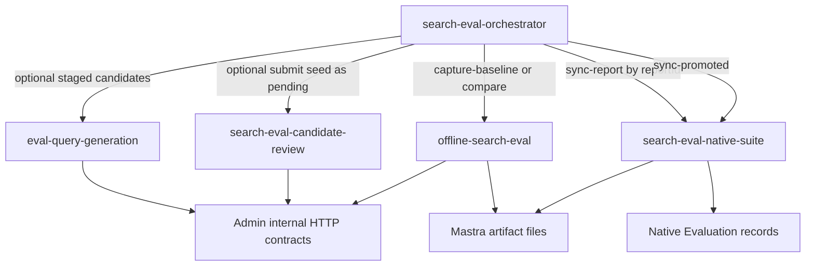

# Search Eval Artifact and Evaluation Orchestrator

## Summary

Add a thin Mastra workflow and service route that coordinates the existing
search eval leaves for baseline capture, comparison, native Evaluation sync,
and release-gate summaries without changing the live search path or bypassing
human review.

---

## Problem Frame

Search eval capability now exists in separate Mastra leaves:
`eval-query-generation`, `offline-search-eval`,
`search-eval-candidate-review`, and `search-eval-native-suite`. That separation
is the safety model, but operators need a single workflow summary that ties a
baseline/report artifact to native Evaluation ids, child run ids, counts, and
pass/fail state. The production baseline capture and local baseline seeding
follow-ups should build on this orchestrator instead of reassembling the
sequence independently.

---

## Requirements

**Orchestration**

- R1. Coordinate existing search eval leaf workflows by calling their launch
  functions with explicit child run ids.
- R2. Keep every leaf workflow independently runnable through its existing
  workflow export and service route.
- R3. Provide `full`, `compare`, and `release-gate` modes with Studio-friendly
  defaults.

**Operator Summary**

- R4. Return child workflow run ids, baseline/report ids, artifact paths, native
  Dataset/Scorer/Experiment ids, counts, and pass/fail state in one result.
- R5. Preserve report ids and paths in failure output whenever a later stage
  fails after an artifact exists.
- R6. Support `resumeReportId` so native sync can be retried without rerunning
  search/judge work.

**Safety**

- R7. Do not auto-promote generated, trace-derived, seed, or user-submitted
  candidates.
- R8. Do not add Mastra to the live public search request path.
- R9. Reuse native-suite idempotency so reruns update/reuse Dataset, Scorer,
  and Experiment records rather than duplicating them.

---

## Key Technical Decisions

- KTD1. Orchestrator as caller, not container: implement a new workflow that
  imports leaf launch functions and passes deterministic child run ids. This
  keeps leaf schemas, routes, and tests independent while giving operators one
  run summary.
- KTD2. `full` means seed-baseline capture by default: default mode captures
  the committed seed prompt baseline, then performs native report sync and
  promoted-candidate sync when enabled. Candidate generation and seed candidate
  submission remain explicit opt-ins.
- KTD3. Resume report sync through `resumeReportId`: when a report already
  exists, skip `offline-search-eval` and call `search-eval-native-suite` with
  `action=sync-report`. This is the recovery path for sync failures and a
  useful bridge for local baseline seeding.
- KTD4. Release gates are report-threshold checks: use report totals and
  calibration fields already produced by `offline-search-eval`; do not invent
  new scoring state in the orchestrator.

---

## High-Level Technical Design

The orchestrator result should carry a normalized child summary per attempted
leaf stage. `release-gate` computes pass/fail from `report.totals` and
`report.calibration` after a successful comparison.

---

## Implementation Units

### U1. Roadmap and requirements artifacts

- **Goal:** Make the requested search-eval orchestrator ticket traceable and capture the
  brainstorm requirements used by the plan.
- **Files:** `docs/roadmap/content-discovery/feat-148-search-eval-orchestrator-workflow.md`,
  `docs/brainstorms/2026-05-30-search-eval-orchestrator-requirements.md`,
  `docs/plans/2026-05-30-001-feat-search-eval-orchestrator-plan.md`.
- **Verification:** Roadmap ticket has `status: "in-progress"` and references
  production baseline capture and local baseline seeding only as follow-ups.

### U2. Orchestrator workflow

- **Goal:** Add `search-eval-orchestrator` with structured input/output,
  child-run coordination, resumable failure summaries, and release-gate state.
- **Files:** `apps/mastra/src/mastra/workflows/search-eval-orchestrator.ts`.
- **Patterns:** Mirror route handling and launch/run structure in
  `apps/mastra/src/mastra/workflows/offline-search-eval.ts` and
  `apps/mastra/src/mastra/workflows/search-eval-native-suite.ts`.
- **Test scenarios:** default full mode calls offline capture and native sync;
  `resumeReportId` skips offline execution; release gate fails on losses; native
  sync failure preserves report id/path; candidate generation does not trigger
  promotion.
- **Verification:** Focused orchestrator workflow tests pass.

### U3. Runtime registration and docs

- **Goal:** Register the workflow and protected service route, and document the
  operator mode semantics in the Mastra guide.
- **Files:** `apps/mastra/src/mastra/index.ts`, `apps/mastra/CLAUDE.md`.
- **Patterns:** Follow existing `registerApiRoute` service-bearer route
  patterns.
- **Test scenarios:** route rejects missing service bearer, parses default
  input, enforces body size, and maps failure reasons to HTTP status.
- **Verification:** Route tests and Mastra typecheck pass.

### U4. Regression coverage and validation

- **Goal:** Add focused tests for the orchestrator while preserving existing
  leaf test coverage.
- **Files:** `apps/mastra/src/mastra/workflows/search-eval-orchestrator.test.ts`.
- **Patterns:** Follow existing workflow tests colocated in
  `apps/mastra/src/mastra/workflows`.
- **Test scenarios:** cover success, resumability, gate failure, safety
  boundary, auth, and invalid input.
- **Verification:** Run the required filtered workflow tests, Mastra
  typecheck, and lint.

---

## Scope Boundaries

- Do not implement production baseline scheduling or production-data capture
  automation.
- Do not implement local production-baseline seed scripts.
- Do not change Admin public search REST or GraphQL contracts.
- Do not add candidate promotion behavior to the orchestrator.
- Do not query Admin Postgres from Mastra.

---

## Risks & Dependencies

- Native sync idempotency depends on `search-eval-native-suite` and
  `native-evaluation.ts`; orchestrator should treat those leaves as the source
  of truth rather than duplicating native record logic.
- `release-gate` can only be as strict as current report totals allow. More
  nuanced multilingual gates belong in later multilingual work.
- The requested roadmap ticket was absent on `origin/main`, and `feat-144` was
  already globally allocated in another lane, so this plan creates the next
  unique content-discovery ticket id from the provided scope.

---

## Sources

- `docs/roadmap/content-discovery/feat-138-mastra-eval-query-generation.md`
- `docs/roadmap/content-discovery/feat-139-mastra-offline-search-eval-runner-reports.md`
- `docs/roadmap/content-discovery/feat-140-search-eval-human-promotion-regression-gates.md`
- `docs/roadmap/content-discovery/feat-142-mastra-search-eval-suite-operator-workflow.md`
- `apps/mastra/src/mastra/workflows/eval-query-generation.ts`
- `apps/mastra/src/mastra/workflows/offline-search-eval.ts`
- `apps/mastra/src/mastra/workflows/search-eval-candidate-review.ts`
- `apps/mastra/src/mastra/workflows/search-eval-native-suite.ts`
- `docs/solutions/architecture-patterns/mastra-offline-search-eval-orchestration-boundary-pattern.md`
- `docs/solutions/architecture-patterns/mastra-native-evaluation-search-eval-bridge-pattern.md`
