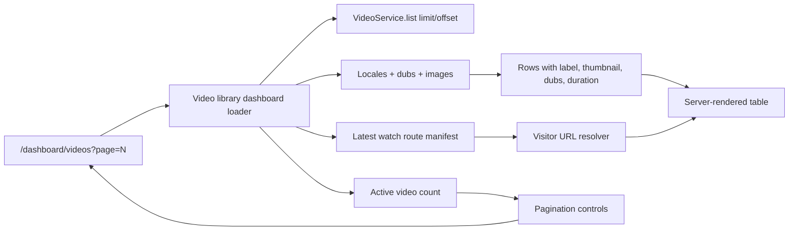

# feat: Improve admin video library browsing

## Summary

Improve `/dashboard/videos` from a fixed first-page preview into a usable
operator catalog: paginate the Core-synced video rows, show the content type
label, render the existing Core thumbnail imagery, and add a visitor-facing
open-link action when a valid public watch URL can be resolved.

---

## Problem Frame

The current admin video library reads live catalog data, but it only renders the
first 30 newest active rows with no pagination controls. It also hides the
`VideoLabel` distinction between collections, series, episodes, shorts, and
feature films, ignores the `previewImageUrl` already returned by the loader,
and offers no direct handoff to the public watch page.

---

## Assumptions

_This plan was authored without synchronous user confirmation. The items below
are agent inferences that fill gaps in the input and should be reviewed before
implementation proceeds._

- The work should stay read-oriented and inside `apps/admin`; full video editing
  remains out of scope for this slice.
- Pagination can be URL-query based so operators can refresh, share, and use
  browser navigation without client-side state management.
- Visitor-facing links should be hidden or disabled when a valid public audio
  language slug cannot be resolved, rather than emitting likely-broken links.

---

## Requirements

- R1. `/dashboard/videos` paginates beyond the current fixed first 30 rows and
  reflects the active page in the URL.
- R2. The video library displays each row's `VideoLabel` in a human-readable
  form so collections, series, episodes, shorts, films, trailers, and segments
  are distinguishable at scan time.
- R3. The table thumbnail cell renders available Core video imagery from the
  existing `previewImageUrl` priority chain, with a polished fallback when no
  image exists.
- R4. Each row exposes an icon-only action that opens the matching public watch
  page in a new tab when a valid visitor URL can be derived.
- R5. Public watch URLs use the web app's audio-language slug shape, not admin
  locale keys or BCP-47 language codes.
- R6. The changes preserve the existing read-only Core authority boundary:
  admin is browsing synced video data, not editing Core-sourced videos.
- R7. Visitor links are absolute web-origin URLs, never relative admin-origin
  paths.

---

## Scope Boundaries

- Do not add full video editing, creation, or mutation behavior.
- Do not change the admin GraphQL `videos` schema unless implementation finds a
  narrow need that cannot be met from the admin dashboard loader.
- Do not import `apps/web` internals into `apps/admin`; duplicate only the small
  public URL formatting rule needed for outbound links, and document why.
- Do not add search, filters, sort controls, or bulk actions in this slice.
- Do not change public watch route behavior in `apps/web`.

### Deferred to Follow-Up Work

- Video-detail/editor workflow for locale inspection and editorial updates
  remains part of the broader `feat-100` follow-up work.
- Search/filter controls can build on the pagination data shape later.
- Public-link handling for three-segment episode routes can be added once the
  admin list intentionally distinguishes parent/episode navigation targets.

---

## Context & Research

### Relevant Code and Patterns

- `docs/roadmap/platform/feat-100-admin-video-and-media-editorial-workflows.md`
  marks video/media workflows as the next admin CMS parity area while preserving
  Core-sourced video authority.
- `apps/admin/docs/v1-operational-surfaces.md` states that `/dashboard/videos`
  already reads real video catalog rows and dub coverage.
- `apps/admin/docs/cms-operational-vs-deferred.md` classifies
  `/dashboard/videos` as operational but still read-heavy.
- `apps/admin/src/app/dashboard/videos/page.tsx` renders the table directly
  from `loadVideoRows`.
- `apps/admin/src/app/dashboard/live-data.ts` currently calls
  `services.video.list({ input: { limit: 30, offset: 0 } })`, enriches rows
  with locales, dubs, images, and returns `labelLabel`, `previewImageUrl`, and
  playback metadata that the page only partially uses.
- `apps/admin/src/services/video.service.ts` already supports `limit` and
  `offset`, orders active videos by most recent update, and caps list size.
- `apps/admin/prisma/schema.prisma` defines `VideoLabel` and the
  `VideoRelation` parent/child model used for collections and series.
- `apps/admin/src/services/watch-route-manifest.service.ts` and
  `apps/admin/src/services/watch-route-manifest-store.ts` provide the current
  admin-owned source for valid public watch slugs and audio-language indexes.
- `apps/web/AGENTS.md` requires visible `/watch` links to use public audio
  language slugs such as `english.html`, not internal locale keys like
  `en.html`.
- `apps/web/src/lib/routes.ts` documents the public two-segment video URL shape
  as `/{slug}.html/{lang}.html` under the `/watch` base path.
- `apps/web/src/env.ts` and `apps/web/.env.example` identify
  `NEXT_PUBLIC_CANONICAL_ORIGIN` as web's canonical watch origin; production
  web URLs should use `https://www.jesusfilm.org`.
- `apps/admin/src/config/env.ts` currently has admin/self and revalidation URL
  config, but no dedicated public web origin value.

### Institutional Learnings

- Prior watch-route work made the admin route manifest the contract for public
  route admission. Admin-side visitor links should prefer that existing
  validity source over inventing separate routability rules.
- Watch-route performance learnings emphasize lazy, bounded image loading for
  non-hero thumbnails. The admin library should render thumbnails without
  introducing eager preloads or extra public-watch bundle work.

### External References

- None. Existing admin/web contracts and local docs are sufficient.

---

## Key Technical Decisions

- Introduce a video-library-specific dashboard data shape rather than changing
  the shared picker API in place: `loadVideoRows` is also used by the experience
  editor, so pagination should not break the editor's expectation that it gets
  a simple video array.
- Use server-rendered URL pagination: page number and page size stay visible in
  the route query, and the dashboard page can render controls without adding a
  client component unless implementation discovers a UX need.
- Keep thumbnails as CSS background imagery or equivalent unoptimized rendering
  inside the admin table: this follows existing admin/editor preview patterns
  and avoids introducing Next image remote-host configuration for this small
  operational surface.
- Display labels in the video details area or a compact adjacent column, not as
  a replacement for source/dub status. Type, source, and dub coverage answer
  different operator questions.
- Resolve visitor URLs from row slug plus a public audio-language slug. Prefer a
  route-manifest-backed language when available; fall back only to a known
  playable direct dub language for the row. Do not emit `en.html`.
- Build visitor links with a dedicated admin-side public web origin value:
  introduce optional `WEB_CANONICAL_ORIGIN` in admin config, default it to
  `https://www.jesusfilm.org`, and use it only for outbound public watch URLs.
  Keep the `apps/web` `NEXT_PUBLIC_CANONICAL_ORIGIN` naming as web-owned rather
  than importing or reusing web internals from admin.
- Use an icon-only external-link button with an accessible label and
  `target="_blank"` semantics so the admin session remains in place while the
  public page opens separately.

---

## Open Questions

### Resolved During Planning

- Should pagination be client-side or URL/server-side? Use URL/server-side
  pagination to preserve refresh/share behavior and match the current server
  page shape.
- Should the public link always point at English? No. It must use a public audio
  language slug resolved from manifest or playable dub data; English can be a
  candidate only when it is actually the resolved public slug.
- Should the plan include video editing? No. This slice improves browsing and
  handoff only.

### Deferred to Implementation

- Exact page size options: start with the current 30-row page size for parity;
  choose whether to expose a page-size selector only if implementation shows a
  clean existing pattern.
- Missing route-manifest behavior: decide during implementation whether a
  missing manifest disables visitor links globally or falls back to row-level
  playable dub data.
- Exact public origin: use the existing configured admin/web environment values
  if present; otherwise choose the smallest local helper that keeps production
  links correct without importing `apps/web`.

---

## High-Level Technical Design

> _This illustrates the intended approach and is directional guidance for
> review, not implementation specification. The implementing agent should treat
> it as context, not code to reproduce._

---

## Implementation Units

### U1. Video Library Pagination Data

**Goal:** Add a dashboard-specific data loader that returns paged rows plus
page metadata without breaking the existing video picker loader.

**Requirements:** R1, R6

**Dependencies:** None

**Files:**

- Modify: `apps/admin/src/app/dashboard/live-data.ts`
- Modify: `apps/admin/src/app/dashboard/videos/page.tsx`
- Test: `apps/admin/src/app/dashboard/dashboard-ui.test.tsx`
- Test: new focused test file if implementation extracts loader helpers from
  `live-data.ts`

**Approach:**

- Keep `loadVideoRows(principal)` array-compatible for existing experience
  editor call sites.
- Add a video-library-oriented loader or wrapper that accepts page parameters,
  calculates `limit`/`offset`, fetches the current row slice, and returns
  `total`, `currentPage`, `pageSize`, `pageCount`, `hasPrevious`, and `hasNext`.
- Parse `searchParams` in `apps/admin/src/app/dashboard/videos/page.tsx` with
  defensive handling for missing, non-numeric, negative, or too-large page
  values.
- Count only active videos using the same `deletedAt: null` boundary as
  `VideoService.list`.
- Preserve the current 30-row page size unless implementation finds a stronger
  existing admin convention.

**Execution note:** Start with characterization coverage for the current
first-page behavior, then add page-boundary scenarios.

**Patterns to follow:**

- `apps/admin/src/services/video.service.ts` for `limit`/`offset` and active
  video ordering.
- Existing dashboard route tests in
  `apps/admin/src/app/dashboard/dashboard-ui.test.tsx`.

**Test scenarios:**

- Happy path: no query params renders page 1 and calls the loader with the
  first-page offset.
- Happy path: `?page=2` renders the second page metadata and next/previous
  controls reflect the second-page state.
- Edge case: `?page=0`, `?page=-1`, `?page=abc`, and page values beyond the
  final page clamp or normalize to a safe page without throwing.
- Edge case: zero active videos renders an empty table state and no broken
  pagination controls.
- Integration: existing experience editor video picker call sites still receive
  an array from `loadVideoRows`.

**Verification:**

- The video dashboard can navigate between at least the first two pages of a
  local or production-like catalog.
- The experience editor still opens its video picker with available videos.

### U2. Labels and Thumbnail Rendering

**Goal:** Make each row visually communicate video type and render real Core
thumbnail imagery when available.

**Requirements:** R2, R3, R6

**Dependencies:** U1

**Files:**

- Modify: `apps/admin/src/app/dashboard/videos/page.tsx`
- Modify: `apps/admin/src/app/dashboard/live-data.ts`
- Test: `apps/admin/src/app/dashboard/dashboard-ui.test.tsx`
- Test: new focused test file if label/thumbnail helper extraction is useful

**Approach:**

- Use the loader's existing `labelLabel` output for human-readable labels and
  keep the raw `label` available for tests or future filtering.
- Render a compact label pill near the title or in a narrow type column so
  collections, series, episodes, shorts, films, trailers, and segments can be
  scanned without opening a row.
- Render `previewImageUrl` in the thumbnail cell using the current admin preview
  visual pattern, with a dark gradient fallback when no image exists.
- Ensure image rendering does not stretch table rows unpredictably; keep the
  aspect-ratio thumbnail box stable.
- Keep source and dub coverage visible; labels should augment, not replace,
  those columns.

**Patterns to follow:**

- Existing background-image preview patterns in
  `apps/admin/src/app/dashboard/experiences/page.tsx` and
  `apps/admin/src/app/dashboard/experiences/experience-editor.tsx`.
- `StatusPill` and dashboard table styling from
  `apps/admin/src/components/admin-ui.tsx`.

**Test scenarios:**

- Happy path: a row with `labelLabel: "Collection"` renders a visible
  collection label alongside the video title.
- Happy path: a row with `previewImageUrl` includes that URL in the rendered
  thumbnail markup.
- Edge case: a row with no label omits the label pill without leaving awkward
  empty text.
- Edge case: a row with no `previewImageUrl` renders the fallback thumbnail
  state and still displays duration if available.
- Visual: at desktop and screenshot-width viewports, thumbnail, label, title,
  source, dubs, updated time, and action column do not overlap.

**Verification:**

- Operators can distinguish collections/series/episodes/singles at a glance.
- Video thumbnails render for rows with Core image data and fall back cleanly
  when absent.

### U3. Visitor-Facing Open Link Action

**Goal:** Add an icon-only action that opens the matching public watch page in a
new tab when the admin can resolve a valid public watch URL.

**Requirements:** R4, R5, R6, R7

**Dependencies:** U1

**Files:**

- Modify: `apps/admin/src/app/dashboard/live-data.ts`
- Modify: `apps/admin/src/app/dashboard/videos/page.tsx`
- Modify: `apps/admin/src/config/env.ts`
- Modify: `apps/admin/.env.example`
- Test: `apps/admin/src/app/dashboard/dashboard-ui.test.tsx`
- Test: new focused test file if visitor URL resolution is extracted

**Approach:**

- Extend the video-library row shape with the video slug and an optional
  `visitorUrl`.
- Resolve the public language slug from the latest watch route manifest when
  possible, using row slug and manifest audio-language indexes to avoid broken
  links for collection or series-like rows.
- Fall back to a playable row-level dub language slug only when it produces the
  public audio slug shape.
- Format the public URL with the watch base path and `.html` segments matching
  `apps/web/src/lib/routes.ts`, without importing `apps/web` internals.
- Add optional `WEB_CANONICAL_ORIGIN` to admin env/config with a safe
  production default of `https://www.jesusfilm.org`, plus local example
  guidance for pointing at a local web dev server when both apps are running.
- Render an icon-only link button using a lucide external-link style icon,
  accessible label text, `target="_blank"`, and `rel="noreferrer"`.
- Disable or omit the link when no visitor URL can be safely resolved.

**Patterns to follow:**

- Public watch-link rules in `apps/web/AGENTS.md`.
- URL shape documented by `apps/web/src/lib/routes.ts`.
- Watch route manifest store/service in `apps/admin/src/services/`.
- Existing icon-button treatment in admin dashboard tables and workflow pages.

**Test scenarios:**

- Happy path: a row with a resolvable manifest language emits a link to
  `https://www.jesusfilm.org/watch/{slug}.html/{language}.html` with
  `target="_blank"` and an accessible label.
- Happy path: a direct playable video with a row-level public language slug
  emits a visitor URL when the manifest is missing or not useful.
- Happy path: overriding `WEB_CANONICAL_ORIGIN` points generated links at that
  origin without changing the `/watch/{slug}.html/{language}.html` path shape.
- Edge case: a row with only BCP-47 data such as `en` does not emit
  `/en.html`; it either resolves the public slug elsewhere or disables the
  action.
- Edge case: no visitor link renders as a disabled/omitted action rather than a
  relative `/watch/...` link on the admin origin.
- Edge case: collection or series rows without a resolvable public language
  slug do not render a broken external link.
- Integration: the external action does not replace the existing quick-actions
  affordance unless implementation intentionally removes the placeholder
  action as unused.

**Verification:**

- Clicking the external-link icon opens a public watch URL in a new tab for
  rows with valid visitor links.
- Rows without safe visitor links remain readable and do not expose broken
  anchors.

### U4. Copy, Documentation, and Visual Proof

**Goal:** Update route copy/docs and verify the final UI behaves as a usable
admin catalog surface.

**Requirements:** R1, R2, R3, R4, R5, R6

**Dependencies:** U1, U2, U3

**Files:**

- Modify: `apps/admin/src/i18n/messages.ts`
- Modify: `apps/admin/docs/v1-operational-surfaces.md`
- Modify: `apps/admin/docs/cms-operational-vs-deferred.md`
- Test: `apps/admin/src/app/dashboard/dashboard-ui.test.tsx`

**Approach:**

- Adjust video page copy only where it now promises paginated browsing,
  visible type labels, thumbnails, and visitor handoff.
- Keep docs honest that the surface is still read-heavy and not a full editor.
- Update dashboard UI tests to assert the new visible signals and link shape.
- Use Helium/in-app browser visual verification against local dev because the
  change is user-facing and layout-sensitive.

**Patterns to follow:**

- Existing admin operational-surface docs.
- Current dashboard UI route snapshot-style assertions in
  `apps/admin/src/app/dashboard/dashboard-ui.test.tsx`.
- Forge AGENTS guidance to use Helium browser for browser testing.

**Test scenarios:**

- Happy path: localized video page copy and table header/action text still
  render after adding pagination and external-link controls.
- Happy path: docs describe the improved browsing/handoff surface without
  claiming edit parity.
- Visual: local browser proof captures a paginated video library page showing
  thumbnails, labels, pagination controls, and an external-link action.

**Verification:**

- Unit/route tests cover the updated static output.
- Browser proof confirms no obvious overflow, broken thumbnail boxes, or
  unusable pagination/action controls at desktop and narrow admin-shell widths.

---

## System-Wide Impact

- **Interaction graph:** `/dashboard/videos` remains a server-rendered admin
  route. It reads via dashboard loader, `VideoService.list`, Prisma enrichment
  queries, and optionally the latest watch route manifest snapshot.
- **Error propagation:** Loader failures should preserve existing table fallback
  behavior for missing tables, while unexpected database or manifest errors
  should fail loudly enough for admin dev/prod monitoring to catch.
- **State lifecycle risks:** URL pagination must not persist server state.
  Visitor-link resolution should tolerate stale or missing route-manifest data
  by omitting links rather than emitting broken URLs.
- **API surface parity:** Admin GraphQL can remain unchanged because this is an
  internal dashboard loader enhancement.
- **Integration coverage:** Browser verification is required because the table
  now has more columns and row content, and thumbnail rendering is visual.
- **Unchanged invariants:** Core-sourced videos remain read-only at the GraphQL
  and service layer; public watch routing remains owned by `apps/web`.

---

## Risks & Dependencies

| Risk                                                                                        | Mitigation                                                                                                                                                               |
| ------------------------------------------------------------------------------------------- | ------------------------------------------------------------------------------------------------------------------------------------------------------------------------ |
| Visitor links use the wrong language segment and leak `en.html`-style internal locale keys. | Resolve from public language slugs only and add tests that reject BCP-47-only output.                                                                                    |
| Pagination changes break the experience editor video picker, which reuses `loadVideoRows`.  | Add a separate library-page loader or preserve the existing array-returning function as a compatibility wrapper.                                                         |
| Thumbnails introduce layout shift or broken remote-image behavior.                          | Use the existing stable aspect-ratio preview box and CSS-background pattern instead of a new image optimization path.                                                    |
| Visitor links accidentally point at the admin host.                                         | Generate absolute URLs from admin's optional `WEB_CANONICAL_ORIGIN`, defaulting to `https://www.jesusfilm.org`, and add a test that rejects relative `/watch/...` hrefs. |
| Route manifest is stale or absent in local/dev environments.                                | Treat manifest data as a validity aid, not a hard requirement; omit unsafe links or fall back to row-level playable language slugs when appropriate.                     |
| The table becomes too dense at the new thinner admin shell width.                           | Include narrow-width browser verification and adjust column layout before implementation is considered complete.                                                         |

---

## Documentation / Operational Notes

- Update admin docs to say `/dashboard/videos` supports paginated browsing,
  type labels, thumbnails, and visitor-page handoff, while staying read-heavy.
- PR validation should include the admin typecheck, lint, focused dashboard UI
  tests, and local browser verification with the admin dev server.
- Add `WEB_CANONICAL_ORIGIN` as optional admin config only; do not make deploys
  depend on a new required env var.
- No Prisma migration, GraphQL SDL regeneration, or `packages/admin-graphql`
  generation is expected unless implementation deliberately changes admin
  GraphQL.

---

## Sources & References

- Roadmap: `docs/roadmap/platform/feat-100-admin-video-and-media-editorial-workflows.md`
- Operational docs: `apps/admin/docs/v1-operational-surfaces.md`
- Operational boundary docs: `apps/admin/docs/cms-operational-vs-deferred.md`
- Admin route: `apps/admin/src/app/dashboard/videos/page.tsx`
- Admin dashboard data loader: `apps/admin/src/app/dashboard/live-data.ts`
- Video service: `apps/admin/src/services/video.service.ts`
- Video schema: `apps/admin/prisma/schema.prisma`
- Watch route manifest: `apps/admin/src/services/watch-route-manifest.service.ts`
- Web public URL guidance: `apps/web/AGENTS.md`
- Web route builders: `apps/web/src/lib/routes.ts`
