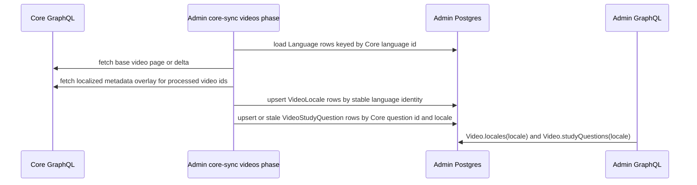

# feat: Core i18n video metadata sync

## Summary

Fix admin's Core video sync so it imports every localized video metadata value Core returns for synced videos, then expose BCP-47-addressable rows through admin GraphQL for consumer apps. This is the data-plane plan. It covers Core fetch shape, admin persistence, GraphQL study-question filtering, and the repeatable backfill needed to repair existing data.

The companion web rendering plan is `docs/plans/2026-06-01-002-feat-watch-language-rendering-plan.md`.

---

## Problem Frame

The new watch app can localize UI chrome, but admin currently lacks localized catalog metadata for most videos. For the reference route `/watch/parable-of-the-pharisee-and-tax-collector.html/russian.html`, the local reviewed admin database and production Admin GraphQL both expose only English `VideoLocale` and `VideoStudyQuestion` rows. The Russian `Language` row exists locally (`coreId = 3934`, `bcp47 = ru`, `slug = russian`), so the gap is the video metadata sync, not the language table.

Core can provide localized values. A direct Core probe with `languageId: "3934"` returned Russian title, description, and study questions, and a later probe showed `title(primary: false)` and `studyQuestions(primary: false)` enumerate many localized values for the same video. The old Admin/CMS sync did not request `title(primary: false)`, so the current English-only admin rows are an import-shape gap. The fix must cover every localized metadata language Core returns, not a Russian-only patch or a UI-locale allowlist.

---

## Assumptions

- Admin remains the authoritative runtime source for web, mobile, and TV. This plan does not add direct Core reads to consumer apps.
- V1 means "all localized metadata values Core returns for synced videos," not a blind video x 2,000+ languages probe.
- Prefer Core localized-field enumeration with `primary: false` where supported. Use `languageId` probes only as targeted fallback or verification.
- `VideoLocale` and `VideoStudyQuestion` are the intended admin homes for localized video display text and study questions.
- Some Core localized values may reference languages without `Language.bcp47`. V1 must preserve those values through stable Core/admin language identity rather than inventing fake BCP-47 tags or treating known no-BCP47 languages as unsupported.
- Core localized metadata edits advance the parent Core `video.updatedAt`, so normal incremental videos sync can keep localized metadata fresh for changed Core videos once the localized-overlay helper is wired into the videos phase.
- The first production repair must be repeatable operational code that reuses the same fetch/write path as forward sync.

---

## Requirements

- R1. Import every localized video title, description, snippet, image alt, and study question text value Core returns for each processed synced video.
- R2. Store localized display text as `VideoLocale` rows keyed by stable language identity. Use BCP-47 in `VideoLocale.locale` where present for consumer lookup, and add/persist a `languageId` relation or equivalent stable Core-language identity so known Core languages without BCP-47 are still stored and auditable. Missing local `Language` rows or Core/API failures may be reported as skipped; known languages with null BCP-47 must not be silently skipped.
- R3. Store localized study questions as `VideoStudyQuestion` rows with the Core question id, `locale`, `languageId`, `text`, `primary`, and `order`.
- R4. Preserve Core/source ownership boundaries. Core sync must not overwrite manager-owned videos or manager-authored rows outside the existing ownership contract.
- R5. Add admin GraphQL support for locale-narrowed study-question reads so consumers do not receive mixed-language questions after backfill. Omitted locale must remain backward compatible by returning only the default/primary non-deleted questions, not every localized question row, and the field must keep the existing parent `Video` visibility/access contract.
- R6. Provide a repeatable backfill entrypoint that can run against one slug/core id for first verification and then against the full synced video catalog.
- R7. Forward videos sync must reuse the same localized-overlay helper so localized metadata remains fresh after the initial backfill. Core localized-only edits are confirmed to advance parent `video.updatedAt`, so V1 does not need a separate periodic localized-overlay refresh outside the normal videos delta; implementation should keep a regression/contract check for that assumption.
- R8. Admin sync diagnostics must report processed videos, localized rows upserted, skipped/missing languages, stale display/question rows, and Core/API failures without logging full localized text values.
- R9. Backfill must be an operator-only job, not a public endpoint. It must be dry-run by default or require an explicit execute flag, require slug/core-id/limit constraints unless `--full-catalog` is explicitly set, reuse the existing sync lock/ledger, prevent overlap with normal Core sync, and avoid advancing the normal videos watermark during limited runs.
- R10. Treat Core localized metadata strings as untrusted plain text. Sync and GraphQL must not interpret Core-provided markup, and downstream rendering must rely on normal escaping unless a separate reviewed rich-text contract is added.
- R11. Produce a durable backfill readiness artifact or run summary. The companion web rendering rollout depends on either a successful full-catalog backfill or an explicitly accepted skipped-language/error report.
- R12. Include a post-backfill search smoke or monitoring check because `VideoLocale` rows are retrieval-relevant; language-specific embeddings/ranking can remain deferred, but basic search regressions must not be invisible.

---

## Scope Boundaries

- Do not change public watch URL shapes, UI message catalogs, or web route rendering in this plan. Those belong to the companion web plan.
- Do not add direct Core runtime fallback reads in `apps/web`, `apps/mobile`, or `apps/tv`.
- Do not synthesize empty metadata rows for every playable dub language when Core returns no localized text for that language.
- Do not import from legacy `apps/cms`; use legacy code only as evidence for Core field behavior.
- Do not add admin editorial UI for localized video metadata. Core remains authoritative for imported rows in this plan.
- Do not rely on manual SQL inserts for production repair.

### Deferred Follow-Up Work

- Decide whether playable languages with no localized metadata should have empty coverage rows for reporting.
- Beyond the required post-backfill search smoke/monitoring, decide whether localized `VideoLocale` and `VideoStudyQuestion` rows should feed embeddings or language-specific search ranking.
- Build admin editorial review/edit workflows for localized video metadata if product needs manager-owned localized overrides.

---

## Context & Research

### Relevant Code and Patterns

- `apps/admin/src/services/core-sync/phases/sync-videos.ts` owns Core video sync, `VideoLocale` upserts, and `VideoStudyQuestion` upserts. Its current Core query requests unargumented localized arrays and therefore only receives default primary rows for the reference video.
- `apps/admin/src/services/core-sync/transforms.ts` already converts Core localized values into BCP-47 video locale rows and per-locale study question inputs.
- `apps/admin/src/services/core-sync/schemas/video.ts` validates the Core video projection used by the sync phase.
- `apps/admin/prisma/schema.prisma` already models `VideoLocale(locale, title, description, snippet, imageAlt)` and `VideoStudyQuestion(locale, languageId, text, primary, order)`. `VideoLocale` currently has no language relation, source provenance, sync timestamp, or soft-delete field, so preserving Core-returned display text for languages without BCP-47 and staling removed Core display text requires a schema migration.
- `apps/admin/src/graphql/types/video.ts` exposes `Video.locales(locale:)` but currently exposes `Video.studyQuestions` without a locale argument.
- `apps/admin/CLAUDE.md` says localized user-facing or retrieval-relevant Core content should use first-class rows; videos use `VideoLocale` and `VideoStudyQuestion`.
- `packages/admin-graphql` consumes admin's committed SDL. If admin GraphQL changes, regenerate `apps/admin/schema.graphql` and `packages/admin-graphql/src/admin-graphql-env.d.ts` in the same implementation slice.

### Institutional Learnings

- `docs/plans/admin-core-sync-coverage-inventory.md` already classifies localized video display text as `VideoLocale` and localized study questions as per-locale `VideoStudyQuestion` rows.
- `docs/brainstorms/2026-04-28-admin-core-sync-entity-coverage-requirements.md` requires admin to preserve Core locales it intentionally syncs, use BCP-47 semantics, keep Core authoritative, and keep localized video content first-class rather than opaque JSON.
- `docs/solutions/integration-issues/admin-core-sync-flat-vs-nested-image-query-coverage-gap-20260519.md` is the nearest sync hardening precedent: Core sync query shape gaps need tests that would have failed against the old projection.

### External References

- Core GraphQL video fields `title`, `description`, `snippet`, `imageAlt`, and `studyQuestions` accept `languageId` and `primary` arguments. Planning probes confirmed `title(primary: false)` and `studyQuestions(primary: false)` enumerate localized values for the reference video; implementation must verify the same behavior for `description`, `snippet`, and `imageAlt`.
- Legacy source link: `https://github.com/JesusFilm/core/blob/main/apps/resources/pages/watch/%5Bpart1%5D/%5Bpart2%5D.tsx`
- Legacy field fragment link: `https://github.com/JesusFilm/core/blob/main/apps/resources/src/libs/videoContentFields.ts`

---

## Key Technical Decisions

- **Fix the data plane in admin:** Consumer apps should read localized metadata from admin GraphQL, not Core.
- **Use Core-returned localized values as the coverage boundary:** Import all localized metadata Core exposes for processed videos. Do not bind coverage to current web UI chrome locales.
- **Keep BCP-47 as the public content lookup, add language identity for coverage:** consumer GraphQL/web reads continue to use BCP-47 `locale` values where present; `VideoLocale` also stores a stable language relation so no-BCP47 Core values remain preserved/auditable without fake locale strings.
- **Split base video sync from localized metadata overlay:** Keep canonical video/media identity in the existing videos phase and fetch localized text as an overlay for the videos selected by that phase.
- **Prefer `primary: false` enumeration:** It avoids a video x language fan-out and matches the observed Core behavior for title and study questions.
- **Make Core coverage explicit and guard freshness:** Implementation must prove every localized metadata field can be enumerated completely, or define a bounded complete fallback. Core localized-only edits are confirmed to advance the base video watermark, so the normal videos delta is the forward freshness path; keep a regression/contract check so drift is caught early.
- **Share code between backfill and forward sync:** The localized-overlay fetch/write helper should be invoked by both the backfill command and the normal videos phase.
- **Filter study questions at GraphQL:** Once multiple languages exist, unfiltered study questions will mix prompts. Explicit locale reads return that locale; omitted locale returns the default/primary question set for backward compatibility.
- **Keep stale handling language-aware for display text and questions:** A limited verification backfill must not stale unrelated languages. Full/normal localized sync can stale only the Core-sourced localized rows for the processed video/language set it has completely observed.
- **Treat backfill as an audited operator workflow:** One-video verification is useful proof, but web rollout readiness requires a full-catalog run summary or an accepted exception list. Limited backfills must not mutate the normal videos watermark.
- **Treat Core strings as plain text:** Localized text is content, not markup or diagnostics payload. Store and expose it through normal escaped GraphQL/web paths, and log row counts/ids rather than full text.

---

## Open Questions

### Resolved During Planning

- Should v1 import only Russian? No. Russian is the reference failure, but the sync contract is all Core-returned localized metadata values.
- Should web call Core if admin lacks a row? No. Admin remains the runtime data boundary.
- Did the original admin sync already use `title(primary: false)`? No. Existing history showed unargumented localized fields, which explains English-only import behavior.

### Deferred to Implementation

- Exact Core overlay batching: verify `primary: false` for `description`, `snippet`, and `imageAlt`, then choose the smallest stable query shape. If any localized field cannot be completely enumerated this way, define and test a bounded complete fallback before declaring backfill-ready.
- Core delta freshness is resolved for V1: localized-only edits in Core advance the parent `video.updatedAt` used by incremental videos sync. Implementation should add a small contract/regression check or documented smoke so future Core behavior drift is noticed.
- Exact database index shape for `VideoLocale.languageId`: implementation should preserve fast BCP-47 lookup and add uniqueness that prevents duplicate rows for the same video/language, including no-BCP47 languages. Prefer partial unique indexes if `locale` becomes nullable.
- Exact `VideoLocale` lifecycle columns/indexes: implementation should add provenance/freshness/stale tracking equivalent to other Core-sourced child rows (`source`, `syncedAt`, `deletedAt`, or a documented equivalent) unless it explicitly proves and tests a parent-rebuild lifecycle that protects manager-owned rows.
- Whether the backfill should be a dedicated script, a `core-sync:run` scope, or a videos-phase option. It must be idempotent, limitable by slug/core id, and safe to dry-run or verify in a tiny batch.

---

## High-Level Technical Design

---

## Implementation Units

### U1. Define Core localized metadata overlay and language identity mapping

**Goal:** Establish a Core query shape that enumerates all localized metadata values for processed videos, plus a language mapping strategy that can account for every returned language.

**Requirements:** R1, R2, R3, R7, R8, R10

**Dependencies:** None

**Files:**

- Modify: `apps/admin/prisma/schema.prisma`
- Create or modify: `apps/admin/prisma/migrations/**/migration.sql`
- Modify: `apps/admin/src/services/core-sync/phases/sync-videos.ts`
- Modify: `apps/admin/src/services/core-sync/schemas/video.ts`
- Modify: `apps/admin/src/services/core-sync/transforms.ts`
- Test: `apps/admin/src/services/core-sync/transforms.test.ts`
- Test: `apps/admin/src/services/core-sync/phases/sync-videos.test.ts`

**Approach:**

- Keep the existing base video query responsible for canonical video identity, media, relations, and English/default fields.
- Add a localized metadata overlay query for the base phase's processed video ids.
- Prefer `primary: false` field enumeration for `title`, `description`, `snippet`, `imageAlt`, and `studyQuestions`. Treat this as a hard coverage gate per field: prove it enumerates the full localized set, define a bounded complete fallback, or fail backfill readiness rather than shipping partial import behavior as success.
- Rely on the confirmed Core behavior that localized-only metadata edits advance the parent `video.updatedAt` used by the incremental videos sync watermark. Add a lightweight contract/regression check or documented smoke so future Core behavior drift is visible.
- Load local `Language` rows by Core language id before transforming overlay results.
- Add stable language identity support to `VideoLocale`. Keep `locale` as the BCP-47 lookup used by GraphQL/web when present, and add a `languageId` relation or equivalent Core-language key so rows whose `Language.bcp47` is null can still be stored.
- Add `VideoLocale` provenance/freshness/stale support needed for Core-owned localized rows. Preferred shape is `source`, `syncedAt`, and `deletedAt` to match other Core-sourced child rows; if implementation chooses another lifecycle strategy, it must document how removed Core localized display text is made non-public and how manager-owned rows are protected.
- Do not invent placeholder BCP-47 tags such as `core:1234`. If `locale` must become nullable to represent no-BCP47 rows, use database-level uniqueness that keeps `(video, locale)` unique for BCP-47 rows and `(video, language)` unique for every mapped language.
- Treat missing local `Language` rows as explicit sync diagnostics. Do not coerce them to English.
- Treat returned localized strings as untrusted plain text throughout transform and persistence. Do not parse or preserve Core-provided markup as rich text in this plan.

**Test Scenarios:**

- Given Core returns English, Russian, Japanese, German, and Portuguese values in one overlay, transforms produce separate `VideoLocale` and `VideoStudyQuestion` inputs without collapsing languages.
- Given the old unargumented Core projection returns only English, tests prove it is insufficient for localized coverage.
- Given each localized field uses `primary: false`, tests or implementation probes prove title, description, snippet, image alt, and study questions are either fully enumerated or explicitly routed through the documented fallback.
- Given a localized-only Core text edit occurs, a contract/regression check proves parent `video.updatedAt` advances, preserving the normal videos watermark as the forward freshness trigger.
- Given a returned localized language has no local `Language` row, the sync reports it as missing and does not create an incorrect row.
- Given `Language.bcp47` is null but the local `Language` row exists, the sync persists the display text through `VideoLocale.languageId` or the chosen stable language identity and leaves consumer BCP-47 lookup unset rather than inventing a fake locale.
- Given Core stops returning a previously imported localized display-text row for a processed video/language during a complete localized sync, the sync marks that Core-sourced `VideoLocale` stale/non-public without touching unrelated languages.
- Given a manager-owned video or manager-owned localized display row exists, Core localized metadata sync does not overwrite or stale that row outside the documented ownership contract.
- Given localized metadata has description or image alt but no title, the transform still creates a useful localized display row.

**Verification:** The videos phase can fetch and transform all localized values Core exposes for the processed video set without changing canonical video identity behavior.

---

### U2. Persist localized rows idempotently and safely

**Goal:** Write localized `VideoLocale` and `VideoStudyQuestion` rows for every Core-returned localized value, including language-aware stale handling.

**Requirements:** R1, R2, R3, R4, R7, R8, R9, R10

**Dependencies:** U1

**Files:**

- Modify: `apps/admin/prisma/schema.prisma`
- Create or modify: `apps/admin/prisma/migrations/**/migration.sql`
- Modify: `apps/admin/src/services/core-sync/phases/sync-videos.ts`
- Create or modify: `apps/admin/src/services/core-sync/video-localized-metadata.ts`
- Modify: `apps/admin/src/services/core-sync/transforms.ts`
- Test: `apps/admin/src/services/core-sync/video-localized-metadata.test.ts`
- Test: `apps/admin/src/services/core-sync/phases/sync-videos.test.ts`
- Test: `apps/admin/src/services/core-sync/transforms.test.ts`

**Approach:**

- Extract the localized-overlay fetch/write path into a helper in the core-sync service layer. The normal videos phase must call this helper for processed videos so forward sync and backfill share identical persistence, stale-handling, and diagnostics behavior.
- Upsert `VideoLocale` rows for every returned localized display-text language using stable language identity. For languages with BCP-47, populate both `locale` and `languageId`; for known languages without BCP-47, populate `languageId` and leave the public BCP-47 lookup unset according to the U1 schema decision.
- Refresh `VideoLocale.syncedAt` or the chosen freshness marker for every Core-sourced localized display row returned by the overlay.
- Upsert `VideoStudyQuestion` rows with a key that cannot collapse localized rows: use Core question id when Core returns distinct ids per localized question, and add or switch to a composite Core-question/language identity if implementation discovers Core reuses the same id across locales. Preserve locale, language id, text, primary flag, and order.
- Keep the existing BCP-47 `locale` path for GraphQL consumers and use the new language relation for auditability/coverage.
- Scope stale cleanup for both `VideoLocale` and `VideoStudyQuestion` by processed video and processed language set. A targeted reference-video or limited verification backfill must not prune English or unrelated language rows, and an incomplete overlay batch must not stale languages it did not completely observe.
- Preserve manager-owned video boundaries. If localized display rows can become manager-owned independently of the parent `Video`, the schema/service contract must prevent Core sync from overwriting or staling those rows.
- Keep helper diagnostics safe: return counts, ids, skipped language identifiers, and error categories, not raw localized text payloads.

**Test Scenarios:**

- Given localized metadata in multiple languages, the phase upserts one display row per returned language and localized question rows per returned question language.
- Given an identical rerun, no duplicate rows are created.
- Given the normal videos phase and the backfill entrypoint call the same helper, equivalent fixtures produce equivalent localized rows, stale cleanup, and diagnostics.
- Given a returned localized display-text language has null BCP-47 but a matching local `Language`, the phase stores a `VideoLocale` row keyed by `languageId` and does not expose it through BCP-47 `locales(locale:)` lookup until a real BCP-47 tag exists.
- Given a localized display-text row disappears from Core for a processed video/language during a complete localized sync, the corresponding Core-sourced `VideoLocale` row is marked stale/non-public without touching other languages.
- Given a targeted backfill processes one video or one limited batch, stale cleanup is scoped to only the processed videos and completely observed languages.
- Given a localized question disappears from Core for a processed video/language, the corresponding Core-sourced question is soft-deleted without touching other languages.
- Given an existing localized row changes text, a rerun updates the row.
- Given a video or localized display row is manager-owned, Core localized metadata writes and stale cleanup are skipped according to the documented ownership contract.

**Verification:** Re-running the phase against the same fixture is idempotent, and localized rows are available for admin GraphQL.

---

### U3. Add locale-narrowed `Video.studyQuestions` to admin GraphQL

**Goal:** Let consumers request study questions for one locale, matching the existing `Video.locales(locale:)` behavior.

**Requirements:** R5, R10

**Dependencies:** U2

**Files:**

- Modify: `apps/admin/src/graphql/types/video.ts`
- Modify: `apps/admin/src/graphql/types/video.principal-filter.test.ts`
- Modify: `apps/admin/src/graphql/schema.test.ts`
- Modify: `apps/admin/schema.graphql`
- Modify: `packages/admin-graphql/src/admin-graphql-env.d.ts`
- Test: `apps/admin/src/graphql/types/video.principal-filter.test.ts`
- Test: `apps/admin/src/graphql/schema.test.ts`

**Approach:**

- Add a `locale` argument to `Video.studyQuestions`, or add an equivalent filtered field if schema design makes an argument unsuitable.
- Filter out soft-deleted questions and narrow to the requested locale when present.
- Preserve omitted-locale behavior for existing callers by returning only the default/primary non-deleted question set. Do not return every localized row when no locale is requested.
- Keep the same access model as the existing public `Video` read surface: no new privileged path, respect parent video visibility/soft-delete/principal filtering, and apply localized question filtering after the parent video is eligible to read.
- Return stored text through GraphQL as plain strings and rely on normal GraphQL/web escaping; do not introduce rich-text interpretation for Core-provided question text.
- Regenerate committed admin SDL and `@forge/admin-graphql` gql.tada environment after the schema change.

**Test Scenarios:**

- Given English and Russian questions for one video, `studyQuestions(locale: "ru")` returns only Russian rows in order.
- Given `locale` is omitted, existing callers receive only default/primary non-deleted questions in order.
- Given `locale` is null or empty, behavior mirrors the existing `Video.locales(locale:)` filter convention.
- Given a soft-deleted localized question exists, GraphQL omits it from public reads.
- Given viewer/editor/admin or existing principal-filter fixtures exercise video visibility, the new field follows the same parent video access behavior as the existing `Video` fields.
- Generated schema and package environment expose the new argument/field.

**Verification:** Admin GraphQL can provide locale-narrowed study questions to consumer apps.

---

### U4. Add repeatable localized metadata backfill

**Goal:** Repair existing admin data by running the same localized-overlay import used by forward sync against already-synced videos.

**Requirements:** R1, R2, R3, R6, R7, R8, R9, R11

**Dependencies:** U1, U2

**Files:**

- Modify: `apps/admin/src/services/core-sync/phases/sync-videos.ts`
- Modify: `apps/admin/src/services/core-sync/video-localized-metadata.ts`
- Create or modify: `apps/admin/src/scripts/backfill-video-localized-metadata.ts`
- Modify: `apps/admin/package.json`
- Test: `apps/admin/src/services/core-sync/video-localized-metadata.test.ts`
- Test: `apps/admin/src/scripts/backfill-video-localized-metadata.test.ts`

**Approach:**

- Add an idempotent operator-only script or sync scope that reads active Core-sourced `Video` rows in batches and calls the U2 localized-overlay helper. Do not expose this as a public HTTP endpoint.
- Default to dry-run or require an explicit execute flag before writes. Require slug, Core id, or limit constraints unless an explicit `--full-catalog` mode is supplied.
- Support slug/core-id limiters for first-run verification against `parable-of-the-pharisee-and-tax-collector`, and separate that limited proof from full-catalog readiness.
- Define batch size, maximum concurrency, Core request timeout, retry/backoff behavior, and a per-run error budget before production execution.
- Reuse the existing core-sync lock/ledger or equivalent mutual-exclusion mechanism so localized backfill and normal Core sync cannot overlap. Limited or targeted backfills must not advance the normal videos phase watermark.
- Emit a concise durable result summary: videos processed, localized display rows upserted/staled, study questions upserted/staled, skipped languages, Core/API errors, dry-run vs executed mode, and whether the run is full-catalog-ready.

**Test Scenarios:**

- Running the backfill against an existing video imports all localized rows Core returns without changing canonical `Video` fields.
- Re-running the same backfill is idempotent.
- A default/dry-run invocation reports intended writes and does not mutate localized rows.
- A write invocation without slug/core-id/limit or `--full-catalog` is rejected.
- A slug/core-id limiter processes only the requested video.
- A limited/reference-video backfill does not advance the normal videos watermark and does not stale unrelated videos/languages.
- A concurrent normal Core sync or backfill run is rejected or waits according to the existing sync lock contract.
- A returned Core language without a local `Language` row is reported as skipped/missing without failing the whole run.
- One failed Core overlay batch is reported and does not claim full backfill coverage.
- The videos phase and backfill command produce equivalent rows for the same fixture.
- A full-catalog run writes a durable summary that can be used as the companion web plan's readiness artifact.

**Verification:** Operators have a repeatable path to fill missing localized metadata before web rendering depends on it.

---

### U5. Add admin operational proof and documentation

**Goal:** Make the data-plane rollout verifiable before the web rendering change is evaluated.

**Requirements:** R5, R6, R7, R8, R10, R11, R12

**Dependencies:** U3, U4

**Files:**

- Modify: `docs/roadmap/platform/feat-153-localized-watch-content-metadata.md`
- Modify: `apps/admin/CLAUDE.md`
- Test or smoke fixture: `apps/admin/src/graphql/types/video.principal-filter.test.ts`

**Approach:**

- Document deployment order: ship admin sync/schema/backfill first, run backfill for the reference video, then broaden to full synced catalog.
- Add pre/post data checks to roadmap or admin docs: before backfill the reference video has only `en`; after backfill, Admin GraphQL returns `locales(locale: "ru")` and `studyQuestions(locale: "ru")`.
- Record that localized content parity is data-dependent. Web can be correct while production still renders English until admin rows exist.
- Document the readiness gate for the companion web rendering plan: full synced-catalog backfill has succeeded, or product/engineering has accepted a concrete skipped-language/Core-error report.
- Document the Core string safety contract: localized metadata is stored and rendered as plain text; diagnostics should identify row counts, language ids/locales, video ids/slugs, and error classes rather than logging full localized strings.
- Add a lightweight post-backfill search smoke or monitoring note because `VideoLocale` is retrieval-relevant. This does not require language-specific embeddings in this plan, but it should catch obvious search/index regressions after the backfill.
- Keep operational notes outcome-focused rather than embedding one-off shell command sequences in durable docs.

**Test Scenarios:**

- Admin GraphQL smoke for the reference video proves Russian rows exist before browser smoke is evaluated.
- A multi-language backfill smoke proves the fix is not Russian-only.
- A skipped-language report surfaces any Core localized languages that cannot be mapped to a local `Language` row or failed because of Core/API errors; known local languages with null BCP-47 should be persisted through stable language identity instead of counted as unsupported.
- A backfill run summary or coverage audit proves whether full-catalog readiness has been reached before the companion web plan is marked ready.
- A search smoke/monitoring check runs after localized `VideoLocale` backfill and does not show obvious regression for existing English search behavior.

**Verification:** A reviewer can verify that admin data and GraphQL are ready for the companion web rendering plan.

---

## System-Wide Impact

- Core GraphQL feeds admin Core sync; admin Postgres stores localized rows; admin GraphQL exposes locale-filtered rows; consumer apps read admin only.
- Core localized metadata fetch failures must use existing sync error semantics and must not silently advance a freshness marker with partial localized data.
- Stale `VideoLocale` and `VideoStudyQuestion` cleanup becomes language-aware and limited-run safe.
- Backfill and normal Core sync must share mutual-exclusion/ledger behavior so a repair run cannot race the forward sync. Limited backfills must not advance the normal videos watermark.
- Admin GraphQL schema changes require committed SDL and regenerated `packages/admin-graphql` environment.
- Core-provided localized strings are stored and exposed as plain text; diagnostics should avoid full text payloads.
- Search/index behavior may change when large numbers of `VideoLocale` rows are backfilled, so rollout needs at least a lightweight search smoke or monitoring check even while embeddings/ranking changes stay deferred.
- Public watch URLs and UI chrome localization are unchanged by this plan.

---

## Risk Analysis & Mitigation

| Risk                                                                             | Likelihood | Impact | Mitigation                                                                                                                                       |
| -------------------------------------------------------------------------------- | ---------- | ------ | ------------------------------------------------------------------------------------------------------------------------------------------------ |
| Localized metadata sync becomes an unbounded video x language job                | Medium     | High   | Use Core localized-value enumeration and video batching; avoid blind all-language probes.                                                        |
| Core `primary: false` support differs by field                                   | Medium     | Medium | Verify each field and keep targeted fallback/probe behavior explicit.                                                                            |
| Missing BCP-47 silently hides returned Core languages                            | Medium     | Medium | Add `VideoLocale` stable language identity support and treat known no-BCP47 languages as persisted/auditable rows, not skipped rows.             |
| Removed Core display text stays published forever                                | Medium     | High   | Add `VideoLocale` provenance/freshness/stale tracking or an explicitly tested equivalent lifecycle.                                              |
| Partial backfill stales unrelated languages                                      | Medium     | High   | Scope stale cleanup by processed video and completely observed language set; limited verification runs must not perform broad stale cleanup.     |
| Localized-only Core edits stop advancing the base videos watermark in the future | Low        | High   | Current Core behavior is confirmed; add a contract/regression check or documented smoke so drift is caught before localized metadata goes stale. |
| Backfill races normal sync or is accidentally run broadly                        | Medium     | High   | Use operator-only entrypoint, dry-run/execute guard, slug/core-id/limit unless `--full-catalog`, and existing sync lock/ledger.                  |
| Core localized text is accidentally treated as markup or over-logged             | Low        | Medium | Treat strings as plain text and keep diagnostics to ids/counts/error classes.                                                                    |
| Search behavior shifts after mass `VideoLocale` import                           | Medium     | Medium | Add post-backfill search smoke or monitoring; defer embeddings/ranking decisions to follow-up.                                                   |
| Admin schema changes ship without regenerated consumer types                     | Medium     | High   | Include SDL and `packages/admin-graphql` regeneration in U3 validation.                                                                          |
| Operators assume one-video backfill repaired all catalog data                    | Medium     | Medium | Emit summaries and document reference-video vs full-catalog rollout gates.                                                                       |

---

## Sources & References

- Origin document: `docs/brainstorms/2026-04-28-admin-core-sync-entity-coverage-requirements.md`
- Related inventory: `docs/plans/admin-core-sync-coverage-inventory.md`
- Roadmap ticket: `docs/roadmap/platform/feat-153-localized-watch-content-metadata.md`
- Companion web plan: `docs/plans/2026-06-01-002-feat-watch-language-rendering-plan.md`
- Admin Core sync: `apps/admin/src/services/core-sync/phases/sync-videos.ts`
- Admin transforms: `apps/admin/src/services/core-sync/transforms.ts`
- Admin GraphQL video type: `apps/admin/src/graphql/types/video.ts`
- Legacy watch route source: `https://github.com/JesusFilm/core/blob/main/apps/resources/pages/watch/%5Bpart1%5D/%5Bpart2%5D.tsx`
- Legacy video content fields: `https://github.com/JesusFilm/core/blob/main/apps/resources/src/libs/videoContentFields.ts`
