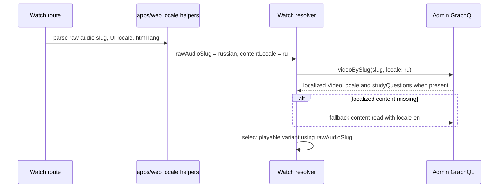

# feat: Watch language rendering from localized admin content

## Summary

Update `apps/web` watch rendering so route language, UI chrome locale, audio dub selection, and catalog content locale are handled as related but separate identities. The web resolver should request localized admin content rows with the resolved BCP-47 content locale, preserve public audio slug behavior for playable variants, pass locale into study-question reads, and fall back to English safely when localized rows are missing.

This is the web/rendering plan. It depends on admin data and GraphQL support from `docs/plans/2026-06-01-001-feat-core-i18n-video-metadata-sync-plan.md`.

---

## Problem Frame

The public watch route uses an audio-language segment such as `russian.html`. The new web app now uses that segment to select UI chrome and playable dub behavior, but the content query currently sends the raw public slug into admin localized content reads. Admin `Video.locales(locale:)` expects a BCP-47 content locale such as `ru`, not the public audio slug `russian`. Study questions are also fetched unfiltered today, which will become incorrect once admin has multiple languages of question rows.

This means web needs a rendering fix independent of the data backfill: it must convert route/audio identity into the correct content locale for admin queries, keep the audio slug available for dub selection, and preserve English fallback for any localized row gaps.

---

## Assumptions

- Admin GraphQL remains the only data source for web watch pages. Web does not call Core directly.
- Public watch URLs keep the existing audio-language slug shape, for example `/watch/{slug}.html/russian.html`.
- `[locale]` remains the internal next-intl message catalog key and `[htmlLang]` remains the static HTML language tag.
- The admin sync plan will provide localized `VideoLocale` rows and locale-narrowed `Video.studyQuestions(locale:)`.
- Web must render safely before the admin backfill is complete by falling back to English content rows.

---

## Requirements

- R1. Keep public audio language slug handling intact for watch URLs and playable dub selection.
- R2. Derive a BCP-47 content locale from the raw route/audio language identity before querying admin `Video.locales(locale:)`.
- R3. Pass the content locale into locale-narrowed study-question reads once admin GraphQL supports them.
- R4. Localize title, description, sibling/parent/child titles, and study questions from admin rows when they exist.
- R5. Fall back to English title/body/questions when localized rows are missing or empty.
- R6. Keep UI chrome localization independent from catalog content metadata localization.
- R7. Preserve existing behavior when the requested playable dub does not exist.
- R8. Add tests and browser/probe proof that distinguish UI chrome failures from catalog content localization failures.

---

## Scope Boundaries

- Do not change admin Core sync, backfill scripts, or admin persistence in this plan.
- Do not change public watch URL shape or emit BCP-47 public URLs for audio-language routes.
- Do not add UI message catalog imports or translations.
- Do not add direct Core fallback calls from `apps/web`.
- Do not change player backend selection or subtitle behavior.

### Deferred Follow-Up Work

- Hreflang/sitemap improvements that depend on richer content-locale coverage.
- Search/recommendation changes that might use localized titles after admin backfill.
- UI affordances that explain why a page is using English fallback content.

---

## Context & Research

### Relevant Code and Patterns

- `apps/web/src/app/[locale]/[htmlLang]/[...rest]/page.tsx` passes the raw route language segment into `resolveWatchVideoBySlug`.
- `apps/web/src/lib/content.ts` resolves watch video data, selects playable variants, normalizes admin video rows, and already has an English fallback branch when the requested `VideoLocale` row is missing.
- `apps/web/src/lib/fragments/watch-video.ts` passes `$locale` into `locales(locale:)` for the video, parents, and children, but currently fetches unfiltered `studyQuestions`.
- `apps/web/src/lib/locale.ts` contains route/audio language helpers such as `slugToBcp47Tag` and `resolveWatchLocaleIdentity`.
- `apps/web/CLAUDE.md` documents that public watch links must always use raw audio language slugs, while internal `[locale]` is only the next-intl message catalog key.
- `packages/admin-graphql` provides the typed admin GraphQL surface and must be regenerated by the admin sync plan before web consumes new schema arguments.

### Companion Data-Plane Dependency

- `docs/plans/2026-06-01-001-feat-core-i18n-video-metadata-sync-plan.md` owns localized admin row creation, backfill, and `Video.studyQuestions(locale:)`.
- Until that plan is deployed and backfilled, this web plan should continue to render English fallback content even when route/UI chrome is non-English.

---

## Key Technical Decisions

- **Keep four identities separate:** public audio slug, UI message locale, HTML language tag, and admin content locale are related but not interchangeable.
- **Use BCP-47 for content reads:** Admin `VideoLocale.locale` is the content lookup key. Convert `russian` to `ru` before admin content queries.
- **Preserve public slug for dub selection:** The playable variant should still match the public audio slug or its existing route identity, not the UI catalog list.
- **Use locale-filtered questions:** Once available, `studyQuestions(locale:)` prevents mixed-language question blocks.
- **Fallback per content part:** Title/description and study questions may have different coverage. Missing localized questions should fall back to English even if localized display text exists.
- **Do not couple to UI catalog availability:** Core/admin may have localized content in languages where web does not yet have full chrome messages, and chrome may exist before content rows are backfilled.

---

## Open Questions

### Resolved During Planning

- Should web keep passing `russian` into `Video.locales(locale:)`? No. It should pass the resolved content locale, `ru`.
- Should web call Core directly if admin lacks localized content? No. It should use admin English fallback.
- Should public URLs switch from language slugs to BCP-47 tags? No. Existing public watch URL shape remains.

### Deferred to Implementation

- Whether `resolveWatchVideoBySlug` should accept one raw route identity and derive content identity internally, or whether the page should pass both raw audio slug and content locale explicitly.
- Whether fallback content should be fetched through a second admin query or by querying localized and English rows together. The observable behavior is localized-first with English fallback.
- Exact browser proof harness: use the existing watch URL probe if it can distinguish visible chrome/content strings, or add an adjacent fixture.

---

## High-Level Technical Design

---

## Implementation Units

### U1. Thread separate route/audio and content language identities

**Goal:** Ensure the watch resolver can use the raw public audio slug for dub selection while using BCP-47 for admin content reads.

**Requirements:** R1, R2, R6, R7

**Dependencies:** None

**Files:**

- Modify: `apps/web/src/app/[locale]/[htmlLang]/[...rest]/page.tsx`
- Modify: `apps/web/src/lib/content.ts`
- Modify: `apps/web/src/lib/locale.ts`
- Test: `apps/web/src/app/[locale]/[htmlLang]/[...rest]/__tests__/page-routing.test.tsx`
- Test: `apps/web/src/lib/content.test.ts`

**Approach:**

- Derive `contentLocale` from the raw route language segment using existing slug-to-BCP47 helpers.
- Keep the raw public route language segment available for `selectPlayableVariant` and route redirects.
- Choose one resolver interface: either pass both identities explicitly or keep a single raw parameter and derive an internal identity object. Prefer the shape that reduces call-site drift.
- Preserve existing behavior for BCP-47-like route inputs and English.

**Test Scenarios:**

- Given `russian`, the resolver uses `ru` for admin content reads and keeps `russian` for playable variant selection.
- Given `english`, the resolver uses `en` for content reads and keeps the public URL slug stable.
- Given an unknown or unsupported public slug, existing redirect/fallback behavior is unchanged.
- Given a language with UI chrome but no content row, the resolver still reaches the English fallback path.

**Verification:** The resolver no longer treats public audio slugs as admin content locales.

---

### U2. Query localized content and study questions with English fallback

**Goal:** Fetch and normalize localized admin title, description, sibling titles, and questions, while falling back to English when localized rows are missing.

**Requirements:** R2, R3, R4, R5

**Dependencies:** Admin plan U3 must provide `Video.studyQuestions(locale:)`.

**Files:**

- Modify: `apps/web/src/lib/fragments/watch-video.ts`
- Modify: `apps/web/src/lib/content.ts`
- Test: `apps/web/src/lib/fragments/__tests__/watch-video.test.ts`
- Test: `apps/web/src/lib/content.test.ts`
- Test: `apps/web/src/lib/__tests__/content-watch-merge.test.ts`

**Approach:**

- Pass `$locale` into the new locale-narrowed study-question projection.
- Keep parent, child, and collection title localization on existing `locales(locale:)` fields.
- Extend normalization/fallback so localized display text and localized study questions can fall back independently.
- Avoid empty blocks: omit study-question content only when both localized and fallback question sets are empty.
- Compile against regenerated `packages/admin-graphql` output from the admin plan.

**Test Scenarios:**

- Given Russian `VideoLocale` and Russian questions, `resolveWatchVideoBySlug("parable-of-the-pharisee-and-tax-collector", "russian")` returns Russian title, description, sibling titles, and study-question content.
- Given Russian display text exists but Russian questions are empty, the watch body receives English fallback questions.
- Given no Russian `VideoLocale` exists, the resolver returns the same English fallback shape it returns today.
- Given admin returns mixed localized and English question rows when locale is omitted, web does not use the omitted-locale path for localized watch rendering.
- Given localized and fallback questions are both empty, the study-question block is omitted as today.

**Verification:** Web can render localized admin content without regressing English fallback behavior.

---

### U3. Add rendering probes and documentation for language-layer diagnosis

**Goal:** Make it obvious whether a failure belongs to UI chrome localization, admin localized content data, or web content-locale rendering.

**Requirements:** R6, R8

**Dependencies:** U1, U2 and admin backfill availability for full production smoke.

**Files:**

- Modify: `apps/web/src/lib/watch-url-probe.ts`
- Test: `apps/web/src/lib/watch-url-probe.test.ts`
- Modify: `apps/web/CLAUDE.md`
- Modify: `docs/roadmap/platform/feat-153-localized-watch-content-metadata.md`

**Approach:**

- Extend the existing watch URL probe, or add an adjacent fixture, so it can distinguish visible UI chrome strings from catalog content strings.
- Strip script/style/hydration payloads before checking visible text to avoid false positives.
- Document the dependency chain: UI chrome may be localized before admin content rows exist; web may be correct but production still shows English until admin backfill runs.
- Browser smoke after backfill should verify Russian visible title, body copy, questions, and sibling titles for the reference route.

**Test Scenarios:**

- Given a fixture with Russian chrome and English catalog text, the probe reports a content localization failure, not a chrome failure.
- Given a fixture with Russian catalog title/body/questions after backfill, the probe passes the content checks.
- Given serialized English in script data but Russian visible DOM, the probe does not fail on hidden payload text.
- Given admin localized rows are absent, the smoke labels the result as data fallback rather than a UI catalog regression.

**Verification:** Reviewers can diagnose whether the route is blocked by admin sync/backfill, admin GraphQL, or web rendering.

---

## System-Wide Impact

- Web keeps reading from admin through `@forge/admin-graphql`.
- Admin's content locale and the public watch audio slug stop being conflated.
- Existing public URL generation remains slug-based.
- Localized rendering becomes data-dependent: before admin backfill, non-English routes may still show English catalog content by design.
- GraphQL package regeneration is owned by the admin plan, but web must consume the regenerated package output before compiling the new fragment.

---

## Risk Analysis & Mitigation

| Risk                                                             | Likelihood | Impact | Mitigation                                                                  |
| ---------------------------------------------------------------- | ---------- | ------ | --------------------------------------------------------------------------- |
| Web breaks playable variant selection by using BCP-47 everywhere | Medium     | High   | Keep raw audio slug and content locale as separate values with tests.       |
| Study questions mix languages after backfill                     | High       | Medium | Use `studyQuestions(locale:)` and add fragment/resolver tests.              |
| Missing localized rows produce empty headings or prompts         | Medium     | High   | Preserve English fallback and add independent fallback tests for questions. |
| Browser smoke falsely fails on serialized English data           | Medium     | Medium | Strip script/style/hydration payloads before visible text checks.           |
| Web ships before admin schema is deployed                        | Medium     | Medium | Keep fallback safe and sequence rollout through the roadmap ticket.         |

---

## Sources & References

- Admin data-plane plan: `docs/plans/2026-06-01-001-feat-core-i18n-video-metadata-sync-plan.md`
- Roadmap ticket: `docs/roadmap/platform/feat-153-localized-watch-content-metadata.md`
- Web watch fragment: `apps/web/src/lib/fragments/watch-video.ts`
- Web watch resolver: `apps/web/src/lib/content.ts`
- Web locale helpers: `apps/web/src/lib/locale.ts`
- Watch route: `apps/web/src/app/[locale]/[htmlLang]/[...rest]/page.tsx`
- Web i18n guidance: `apps/web/CLAUDE.md`
