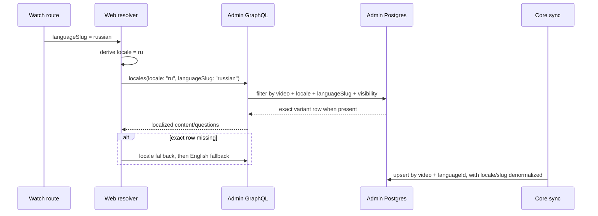
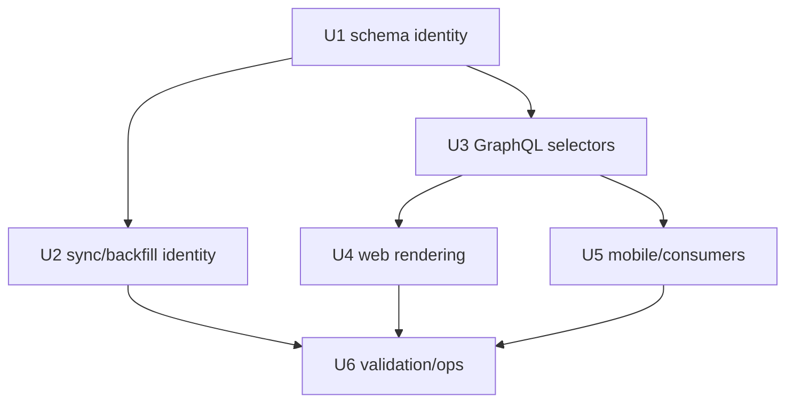
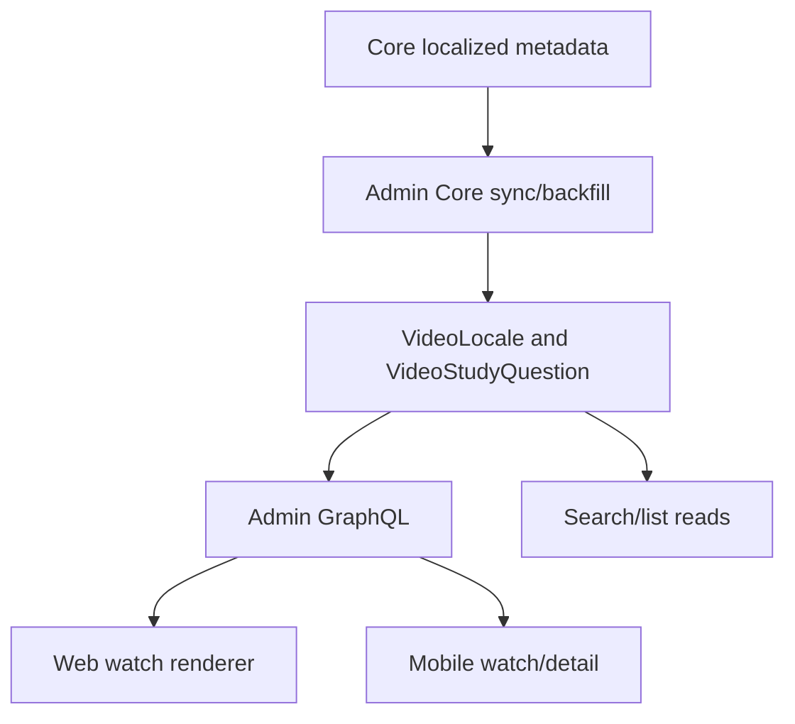

# feat: Variant-aware watch content language identity

## Summary

Implement Option C for localized watch content: keep the public watch language
slug as the exact language-variant selector, keep BCP-47 as the broad locale
grouping and fallback selector, and keep Core/Admin `Language` identity as an
internal foreign key/provenance concern.

This amends the completed admin sync and web rendering plans:

- `docs/plans/2026-06-01-001-feat-core-i18n-video-metadata-sync-plan.md`
- `docs/plans/2026-06-01-002-feat-watch-language-rendering-plan.md`

Those plans are still directionally correct, but they assume one localized
content row per BCP-47 locale. That is not safe because Core can have two or
more distinct language variants with the same BCP-47 tag. We cannot collapse
those variants. The implementation should therefore make `languageSlug`
available as the exact selector while preserving existing `locale: "ru"` style
queries as broad BCP-47 reads.

| Request shape                                           | Meaning                                          | Expected result                                                                               |
| ------------------------------------------------------- | ------------------------------------------------ | --------------------------------------------------------------------------------------------- |
| `locales(locale: "ru")`                                 | Broad BCP-47 group                               | All visible Russian BCP-47 rows for the video, potentially more than one variant              |
| `locales(languageSlug: "russian")`                      | Exact public variant                             | The row for the language whose public slug is `russian`                                       |
| `locales(locale: "ru", languageSlug: "russian")`        | Exact public variant constrained to BCP-47 group | The preferred watch query shape; returns only the `russian` row if it exists and matches `ru` |
| `studyQuestions(locale: "ru")`                          | Broad BCP-47 group                               | All visible Russian BCP-47 question rows, potentially multiple variants                       |
| `studyQuestions(locale: "ru", languageSlug: "russian")` | Exact public variant constrained to BCP-47 group | The preferred watch query shape; returns only Russian variant questions                       |

---

## Problem Frame

The current localized metadata branch fixes the Russian data gap, but it still
treats `VideoLocale.locale` as if it uniquely identifies a language row. The
database schema reinforces that with `@@unique([videoId, locale])`, and web
normalization reads `raw.locales?.[0]` after querying `locales(locale:
$locale)`.

That is not enough for Core language reality. A BCP-47 tag describes a language
or locale bucket, not necessarily a unique Jesus Film/Core language variant.
If Core exposes two distinct variants that both map to `ru`, a locale-only
write path either overwrites one row, rejects one row, or lets web choose an
arbitrary first row. We specifically cannot collapse accents/variations into
one content language.

At the same time, making Core language id the public GraphQL and route
selection identity is not desirable. Public watch URLs already use stable
language slugs such as `russian`, and the app should not require consumers to
know Core ids. The safer contract is:

- public exact selector: `Language.slug` / `languageSlug`
- broad grouping and fallback selector: `Language.bcp47` / `locale`
- internal storage/provenance selector: admin `Language.id`, backed by
  `Language.coreId`

---

## Assumptions

- Public watch URL shape remains `/watch/{video}.html/{languageSlug}.html`.
- `Language.slug` is already the user-facing audio/catalog route identity for
  dubs and language pickers.
- `Language.bcp47` remains the right value for UI message fallback, HTML
  language tags, broad search/list filtering, and "close enough" content
  fallback.
- Admin `Language.id` and `Language.coreId` remain internal implementation
  details used for foreign keys, Core sync matching, and diagnostics.
- Existing `locales(locale: "ru")` callers must continue to work, but they must
  be treated as broad queries that can return multiple rows.
- Web watch rendering can pass both the raw route language slug and the derived
  BCP-47 content locale.
- The implementation may denormalize `languageSlug` and `languageCoreId` on
  localized rows for indexed reads, but the canonical source for those values
  remains the `Language` table.

---

## Requirements

- R1. Preserve multiple distinct localized content variants for the same video
  even when they share the same BCP-47 `locale`.
- R2. Keep `VideoLocale.locale` and `VideoStudyQuestion.locale` as broad BCP-47
  grouping fields, not unique language identity fields.
- R3. Add exact public variant selection through `languageSlug` for
  `Video.locales(...)` and `Video.studyQuestions(...)`.
- R4. Keep admin `languageId` as the true relational identity for stored
  localized rows and Core freshness/staleness, without making Core ids the
  required public GraphQL selector.
- R5. Keep `locales(locale: "ru")` and `studyQuestions(locale: "ru")` working;
  callers should receive all matching published non-deleted BCP-47 rows.
- R6. Update web watch queries to pass both `locale` and `languageSlug`, select
  exact localized content first, then broad BCP-47 fallback, then English.
- R7. Update mobile or any copied watch fragment so schema changes do not break
  generated clients and omitted/broad queries keep backward-compatible
  behavior.
- R8. Make Core sync and backfill idempotent by video plus language identity,
  not by video plus BCP-47 alone.
- R9. Preserve Core/source ownership: Core sync must not overwrite or stale
  manager-owned localized rows outside the existing ownership contract.
- R10. Keep search/list reads performant for many videos in a requested
  language by indexing broad BCP-47 filters and exact `languageSlug` filters.
- R11. Regenerate `apps/admin/schema.graphql` and
  `packages/admin-graphql/src/admin-graphql-env.d.ts` when GraphQL arguments or
  exposed fields change.
- R12. Add tests that prove duplicate BCP-47 variants are stored, queried,
  normalized, and backfilled without collapse.

---

## Scope Boundaries

- Do not collapse similar accents, dialects, or Core language variants into one
  BCP-47 content row.
- Do not change public watch URL shape or require Core language ids in public
  routes.
- Do not make Core language id the primary public GraphQL selection identity.
- Do not add direct Core runtime reads to `apps/web`, `apps/mobile`, or `apps/tv`.
- Do not materialize every localized route permutation or put localized display
  payloads into the watch route manifest.
- Do not change UI chrome translation catalogs in this plan.
- Do not build admin editorial UI for localized metadata.

### Deferred Follow-Up Work

- Richer exact-variant filters for search UI, if product later wants users to
  choose between same-BCP47 variants in search results.
- Admin editorial tooling to manually review or override variant-specific Core
  metadata.
- Hreflang/sitemap expansion once variant-aware localized content has production
  coverage and product decides how duplicate BCP-47 variants should be exposed
  to crawlers.

---

## Context & Research

### Relevant Code and Patterns

- `apps/admin/prisma/schema.prisma` currently models `VideoLocale.locale`,
  `VideoLocale.languageId`, and `@@unique([videoId, locale])`. That uniqueness
  must change because BCP-47 is no longer unique for localized video content.
- `apps/admin/prisma/schema.prisma` currently models
  `VideoStudyQuestion.languageId` and `locale`, but its lookup/update path can
  still fall back to `coreId + locale`. That is unsafe for same-BCP47 variants.
- `apps/admin/src/services/core-sync/transforms.ts` already keys transform rows
  by Core language id when one exists. The persistence layer needs to preserve
  that identity all the way to upsert/stale decisions.
- `apps/admin/src/services/core-sync/video-localized-metadata.ts` currently
  tries `videoId + languageId` first for display rows, then falls back to
  `videoId + locale`. The fallback can update the wrong row when variants share
  a BCP-47 tag.
- `apps/admin/src/graphql/types/video.ts` exposes `Video.locales(locale:)` and
  `Video.studyQuestions(locale:)`. These filters need a `languageSlug` exact
  selector while keeping `locale` as a broad selector.
- `apps/web/src/lib/fragments/watch-video.ts` and
  `apps/mobile/src/lib/queries.ts` both use `locales(locale: $locale)`.
  Generated client regeneration and consumer updates must include both copies.
- `apps/web/src/lib/content.ts` normalizes the first returned locale row through
  `raw.locales?.[0]`. That needs an explicit selection strategy once a broad
  locale query can return multiple rows.
- `apps/web/src/lib/locale.ts` already has slug-to-BCP47 helpers. Web should
  keep the raw route slug for exact content/dub selection and derive BCP-47 for
  broad fallback.

### Institutional Learnings

- `docs/solutions/integration-issues/admin-jsonb-locale-map-vs-strapi-string-silent-drop-20260515.md`
  warns that locale-keyed data needs explicit fallback and shape handling. The
  same principle applies here: BCP-47 fallback is useful, but it must not erase
  the exact language identity.
- `docs/solutions/architecture-patterns/admin-owned-watch-route-manifest-20260530.md`
  keeps the route manifest compact and admission-focused. This plan should not
  push localized rendering payloads or all route permutations into that manifest.
- `docs/solutions/platform/core-graphql-unbounded-relation-fan-out-20260504.md`
  documents bounded Core video fetches through `where: { ids: [...] }` and warns
  against wide nested fan-out. The localized backfill should batch by selected
  video ids and avoid unbounded nested relation expansion.
- Existing manager coverage work already treats `languageId` as a precise
  internal language-state axis. This plan follows that precedent internally,
  while keeping public watch reads slug-based.

---

## Key Technical Decisions

- **Option C is the implementation target:** public exact selector is
  `languageSlug`, broad selector is BCP-47 `locale`, internal storage identity is
  `languageId`.
- **BCP-47 is grouping, not identity:** `locale: "ru"` remains valid and useful,
  but it can match more than one localized row.
- **`languageSlug` is the exact public selector:** it is already stable enough
  for watch URLs and language pickers, and it avoids exposing Core ids as a
  product contract.
- **Denormalize for hot paths:** store `languageSlug` and optionally
  `languageCoreId` on `VideoLocale` and `VideoStudyQuestion` to keep exact watch
  and bulk filtering indexed without forcing relation joins on every render.
  Keep the relation to `Language` as canonical.
- **Do not use locale fallback when updating rows:** Core sync can create
  diagnostics for missing language identity, but it must not update an existing
  same-BCP47 row by `locale` when the Core language id is known.
- **GraphQL array fields stay arrays:** `locales(locale:)` and
  `studyQuestions(locale:)` should continue returning lists; exact slug filters
  make them single-row/single-variant in practice for watch rendering.
- **Web fallback is deterministic:** exact slug row first, then deterministic
  broad BCP-47 fallback, then English. Never rely on "first row from the
  database" without an explicit order/selection rule.
- **Omitted study-question behavior stays compatible:** existing mobile and
  other consumers may omit `locale`. Do not change omitted queries into mixed
  all-language reads unless every consumer is explicitly migrated.

---

## Open Questions

### Resolved During Planning

- Can we collapse similar accents or variants into one BCP-47 row? No.
- Should Core language id become the public GraphQL and route identity? No.
- Should `locales(locale: "ru")` still work? Yes. It remains a broad BCP-47
  query and may return multiple rows.
- Can web send both exact and broad identity? Yes. It already has the raw route
  slug and can derive BCP-47 via locale helpers.

### Deferred to Implementation

- Exact denormalized field names: prefer `languageSlug` and `languageCoreId` on
  both localized tables if Prisma naming and migrations stay straightforward.
- Exact broad BCP-47 fallback ordering when multiple variants exist and no
  `languageSlug` is provided. Recommended default is: primary flag if available,
  then language slug stable sort, then row id stable sort.
- Whether GraphQL should expose `languageSlug` as a field on localized rows in
  addition to accepting it as an argument. Recommended yes for diagnostics and
  tests.
- Whether admin-only GraphQL should accept internal `languageId` as a debugging
  filter. It is not required for public watch rendering and should not replace
  `languageSlug`.

---

## High-Level Technical Design

## Implementation Units

### U1. Add variant-aware localized metadata identity

**Goal:** Change localized video metadata storage so one video can hold multiple
language variants that share the same BCP-47 locale.

**Requirements:** R1, R2, R4, R8, R10, R12

**Dependencies:** None

**Files:**

- Modify: `apps/admin/prisma/schema.prisma`
- Create: `apps/admin/prisma/migrations/**/migration.sql`
- Test: `apps/admin/src/services/core-sync/video-localized-metadata.test.ts`
- Test: `apps/admin/src/services/core-sync/transforms.test.ts`

**Approach:**

- Add denormalized exact identity fields to `VideoLocale` and
  `VideoStudyQuestion`, preferably `languageSlug` and `languageCoreId`, while
  keeping `languageId` as the relational key.
- Replace `VideoLocale` uniqueness on `[videoId, locale]` with indexes that
  support broad lookup but allow duplicates:
  - index `[videoId, locale]`
  - unique or partial-unique `[videoId, languageId]` for rows with a known
    language
  - index `[videoId, languageSlug]`
  - index `[locale, status, deletedAt]` or the closest existing status/deleted
    pattern for public reads
- Revisit `VideoStudyQuestion` uniqueness. If Core question ids are only unique
  inside a language or can collide across languages, use a composite identity
  such as `[videoId, languageId, coreId]` or `[coreId, languageId]` instead of
  relying on `coreId` alone.
- Add a pre-migration audit for duplicate or conflicting rows so deploy does
  not fail halfway through a production schema change.
- Backfill `languageSlug`/`languageCoreId` for existing rows by joining
  `Language` through `languageId`; leave null only when there is no language
  relation to trust.
- Keep BCP-47 values in `locale` for broad reads and existing callers.

**Test Scenarios:**

- Given two `Language` rows with different slugs and the same `bcp47`, two
  `VideoLocale` rows for one video can exist without uniqueness failure.
- Given existing English/Russian rows, migration backfills `languageSlug` and
  keeps `locale` unchanged.
- Given a localized row has `languageId` but null `locale`, exact
  `languageSlug` storage still works for diagnostics and internal matching.
- Given a missing `languageId`, the schema allows a legacy/broad row but does
  not let it overwrite a known-language row.
- Given duplicate pre-existing locale rows are present, the migration audit
  reports them before destructive constraint changes.

**Verification:** Prisma schema and migration support duplicate BCP-47 variants
without collapsing or overwriting localized metadata.

---

### U2. Make Core localized sync and backfill language-identity first

**Goal:** Ensure import, forward sync, and backfill upsert/stale localized rows
by Core/Admin language identity instead of BCP-47 alone.

**Requirements:** R1, R2, R4, R8, R9, R10, R12

**Dependencies:** U1

**Files:**

- Modify: `apps/admin/src/services/core-sync/video-localized-metadata.ts`
- Modify: `apps/admin/src/services/core-sync/transforms.ts`
- Modify: `apps/admin/src/services/core-sync/transforms.test.ts`
- Modify: `apps/admin/src/services/core-sync/video-localized-metadata.test.ts`
- Modify: `apps/admin/src/services/core-sync/phases/sync-videos.ts`
- Modify: `apps/admin/src/services/core-sync/phases/sync-videos.test.ts`
- Modify or create: `apps/admin/src/services/core-sync/backfill-video-localized-metadata.ts`

**Approach:**

- Extend localized transform outputs with `languageSlug` and `languageCoreId`
  from the resolved `Language` row.
- For rows with known Core language id, upsert display metadata by
  `videoId + languageId` only. Do not fall back to `videoId + locale`, because
  that can update the wrong same-BCP47 variant.
- For study questions, upsert by a composite language-aware identity such as
  `videoId + languageId + coreId`, with a carefully documented fallback only
  for legacy rows that genuinely lack language identity.
- Stale Core-sourced rows by the complete observed video/language set. A
  partial verification backfill must not stale unrelated languages.
- Preserve manager-owned rows by checking `source` before update/stale.
- Keep diagnostics for missing local `Language`, missing slug, null BCP-47, and
  duplicate Core language rows; do not log localized text values.
- Use bounded Core video fetches for targeted backfills, following the existing
  `where: { ids: [...] }` pattern rather than wide unbounded nested fan-out.

**Test Scenarios:**

- Given Core returns two localized values with the same BCP-47 but different
  language ids, sync creates/updates two separate rows.
- Given an existing row with the same `locale` but a different `languageId`,
  sync for a new language variant creates a new row and does not update the old
  row.
- Given Core removes one variant from a complete localized sync, only that
  Core-sourced variant is marked stale.
- Given a partial one-video or one-language backfill runs, unrelated language
  rows are not staled.
- Given a manager-owned localized row exists for the same language, Core sync
  does not overwrite it.
- Given Core returns a known language with null BCP-47, sync stores exact
  language identity and leaves broad `locale` null.

**Verification:** Backfill and forward sync preserve language variants and keep
localized metadata fresh without relying on BCP-47 uniqueness.

---

### U3. Add exact language slug selectors to admin GraphQL

**Goal:** Expose variant-aware localized content reads while preserving broad
BCP-47 query compatibility.

**Requirements:** R2, R3, R5, R7, R10, R11, R12

**Dependencies:** U1

**Files:**

- Modify: `apps/admin/src/graphql/types/video.ts`
- Modify: `apps/admin/src/graphql/types/video.principal-filter.test.ts`
- Modify: `apps/admin/src/graphql/schema.test.ts`
- Regenerate: `apps/admin/schema.graphql`
- Regenerate: `packages/admin-graphql/src/admin-graphql-env.d.ts`

**Approach:**

- Add optional `languageSlug` argument to `Video.locales(...)`.
- Add optional `languageSlug` argument to `Video.studyQuestions(...)`.
- Keep `locale` semantics broad: it filters by BCP-47 and can return multiple
  rows.
- When both `locale` and `languageSlug` are present, apply both filters. This is
  the normal watch query shape because it is exact and validates that slug and
  BCP-47 agree.
- Consider exposing `languageSlug` and `languageCoreId` on `VideoLocale` and
  `VideoStudyQuestion` for diagnostics, smoke tests, and generated-client type
  clarity.
- Preserve current visibility behavior: public/viewer/consumer bearer see
  published non-deleted locale rows; editor/admin see non-deleted rows; study
  questions omit soft-deleted rows.
- Preserve omitted `studyQuestions` behavior for compatibility. If it currently
  returns primary-only rows, keep that until all consumers have explicit locale
  or slug selection.
- Add explicit ordering for broad queries so `locales(locale: "ru")` is
  deterministic even when it returns multiple variants.

**Test Scenarios:**

- `videoLocalesFilter({ locale: "ru" })` returns a Prisma filter that does not
  require uniqueness and still applies visibility constraints.
- `videoLocalesFilter({ languageSlug: "russian" })` filters by exact language
  slug and visibility.
- `videoLocalesFilter({ locale: "ru", languageSlug: "russian" })` applies both
  selectors.
- Empty `locale` or empty `languageSlug` behaves like omitted, not like a
  zero-length database filter.
- `videoStudyQuestionsFilter({ locale: "ru", languageSlug: "russian" })`
  returns only that exact variant's non-deleted questions.
- Omitted `studyQuestions` continues to match the pre-change compatibility
  contract.
- Generated SDL includes both new arguments and any new exposed fields.

**Verification:** Admin GraphQL supports exact language-variant reads and broad
BCP-47 reads without changing existing list field shape.

---

### U4. Update web watch rendering to request exact variant content

**Goal:** Make web use the public route language slug for exact localized
content selection while retaining BCP-47 fallback and audio dub behavior.

**Requirements:** R3, R5, R6, R10, R11, R12

**Dependencies:** U3

**Files:**

- Modify: `apps/web/src/lib/fragments/watch-video.ts`
- Modify: `apps/web/src/lib/content.ts`
- Modify: `apps/web/src/lib/locale.ts`
- Modify: `apps/web/src/app/[locale]/[htmlLang]/[...rest]/page.tsx`
- Test: `apps/web/src/lib/content.test.ts`
- Test: `apps/web/src/lib/fragments/__tests__/watch-video.test.ts`
- Test: `apps/web/src/app/[locale]/[htmlLang]/[...rest]/__tests__/page-routing.test.tsx`

**Approach:**

- Thread a content identity object through watch resolution:
  - `languageSlug`: raw public route/audio slug such as `russian`
  - `locale`: derived BCP-47 tag such as `ru`
- Update the watch fragment to query
  `locales(locale: $locale, languageSlug: $languageSlug)` and
  `studyQuestions(locale: $locale, languageSlug: $languageSlug)` for the
  primary video, parents, and children where localized title rows are needed.
- Keep playable variant selection based on the public route language slug and
  existing dub language data.
- Update normalizers so they do not blindly use `raw.locales?.[0]` after a
  broad query. The exact query should usually return one row; fallback paths
  must still choose deterministically.
- Implement fallback in this order:
  1. exact `languageSlug + locale`
  2. broad `locale` if exact content is missing or incomplete
  3. English
- Keep field-level fallback where useful: localized title/description and
  localized questions may have different coverage.
- Avoid treating UI chrome locale, HTML language, content BCP-47, and playable
  audio slug as interchangeable.

**Test Scenarios:**

- For `/watch/parable-of-the-pharisee-and-tax-collector.html/russian.html`,
  web sends `locale: "ru"` and `languageSlug: "russian"` to admin content
  fields.
- Given two `ru` variants in the mocked admin response, web selects the
  `russian` row and does not render the other variant accidentally.
- Given exact `russian` content is missing but another `ru` row exists, web
  uses the deterministic broad fallback before English.
- Given no Russian content rows exist, web renders English fallback content
  while preserving Russian UI chrome and route behavior.
- Given Russian display text exists but Russian study questions do not, web
  falls back questions independently.
- Given playable Russian dub is unavailable, existing dub fallback behavior is
  unchanged.

**Verification:** Watch pages render exact localized content for the route
language variant and fall back safely when that exact variant is absent.

---

### U5. Update mobile and other generated GraphQL consumers

**Goal:** Keep copied watch fragments and generated GraphQL clients compiling
and semantically compatible after admin GraphQL changes.

**Requirements:** R5, R7, R11, R12

**Dependencies:** U3

**Files:**

- Modify: `apps/mobile/src/lib/queries.ts`
- Modify: `apps/mobile/src/lib/normalizeVideo.ts`
- Test: `apps/mobile/src/lib/normalizeVideo.test.ts`
- Regenerate: `packages/admin-graphql/src/admin-graphql-env.d.ts`

**Approach:**

- Audit every `locales(locale: $locale)` and `studyQuestions` watch/detail
  fragment in the repo after schema regeneration.
- If mobile can derive `languageSlug` from the active variant, pass it for exact
  localized title and question reads. If mobile cannot always derive it at query
  time, keep broad `locale` behavior and make normalization deterministic.
- Preserve omitted `studyQuestions` behavior for existing mobile flows until
  the mobile UI intentionally adopts explicit language-specific questions.
- Update normalizers to avoid assuming one BCP-47 row per video if broad locale
  reads can return multiple rows.

**Test Scenarios:**

- Mobile GraphQL documents compile against regenerated admin schema.
- A broad locale response with two same-BCP47 rows does not produce unstable
  rendering or runtime crashes.
- If mobile passes `languageSlug`, it selects that exact variant.
- Omitted `studyQuestions` remains compatible with the current mobile watch
  behavior.

**Verification:** Admin schema changes do not regress mobile or other generated
clients.

---

### U6. Add variant-aware backfill, smoke, and operational checks

**Goal:** Prove the production repair covers all languages, not only Russian,
and that exact/broad query semantics are observable before web rollout is
declared done.

**Requirements:** R1, R5, R8, R10, R11, R12

**Dependencies:** U2, U3, U4, U5

**Files:**

- Modify or create: `apps/admin/src/services/core-sync/backfill-video-localized-metadata.ts`
- Modify: `apps/admin/src/services/core-sync/video-localized-metadata.test.ts`
- Modify: `apps/web/src/lib/watch-url-probe.ts`
- Test: `apps/web/src/lib/watch-url-probe.test.ts`
- Modify: `docs/roadmap/platform/feat-154-watch-language-variant-identity.md`

**Approach:**

- Add or update the backfill entrypoint so it can run a targeted video first,
  then full catalog, using the same identity-first sync helper as forward sync.
- Include dry-run/execute behavior, sync lock protection, and run summaries
  consistent with the earlier admin sync plan.
- Add run summary counts for:
  - localized rows created/updated/staled
  - duplicate BCP-47 groups by video
  - rows missing BCP-47 but having exact language identity
  - skipped missing-language diagnostics
- Add GraphQL smoke coverage for broad and exact semantics:
  - `locales(locale: "ru")` returns all Russian BCP-47 rows
  - `locales(locale: "ru", languageSlug: "russian")` returns the exact Russian
    route variant
  - `studyQuestions(locale: "ru", languageSlug: "russian")` returns exact
    Russian route questions
- Update the web watch probe so it can distinguish UI chrome language, catalog
  content language, and exact variant selection.
- Keep the roadmap ticket current. If this plan supersedes wording in the
  earlier complete plans, link this plan from the roadmap rather than rewriting
  historical completed artifacts as if they had always made this distinction.

**Test Scenarios:**

- A targeted reference-video backfill creates multiple localized rows and exact
  `russian` rows for display text/questions.
- A full-catalog dry run reports duplicate BCP-47 groups without collapse.
- Broad GraphQL smoke for `locale: "ru"` returns multiple rows when fixture data
  has multiple variants.
- Exact GraphQL smoke for `locale: "ru", languageSlug: "russian"` returns one
  route variant.
- Browser/probe smoke proves the reported Russian watch URL renders Russian UI
  chrome and Russian catalog strings from admin, with English fallback only
  where admin lacks exact localized content.

**Verification:** Operators can backfill and verify all Core-returned localized
metadata with variant identity preserved end to end.

---

## System-Wide Impact

- Admin database uniqueness changes are the highest-risk piece because they
  alter assumptions that locale equals identity.
- Admin GraphQL remains list-shaped and backward-compatible for broad locale
  callers, but exact watch rendering becomes slug-aware.
- Web behavior becomes more precise for same-BCP47 variants while preserving
  existing route and dub-selection semantics.
- Mobile must be audited because it carries a watch fragment with
  `locales(locale: $locale)` and omitted `studyQuestions`.
- Search/listing can continue broad BCP-47 behavior, but indexes must reflect
  the fact that BCP-47 can match multiple variants.

---

## Risks & Mitigations

- **Risk:** Existing callers assume `locales(locale:)` returns exactly one row.
  **Mitigation:** Keep exact watch callers on `languageSlug`, update
  normalizers, and add deterministic broad-query ordering.
- **Risk:** Migration fails because existing data has duplicate or null identity
  edge cases. **Mitigation:** add pre-migration audit and use deploy-safe
  constraint changes with nullable/partial uniqueness where needed.
- **Risk:** Core sync accidentally overwrites a same-BCP47 variant by falling
  back to locale. **Mitigation:** forbid locale fallback when Core language id
  is known and cover this in sync tests.
- **Risk:** Public GraphQL grows confusing with both `locale` and
  `languageSlug`. **Mitigation:** document semantics in field descriptions and
  tests; use both for watch paths.
- **Risk:** Bulk language searches slow down after uniqueness changes.
  **Mitigation:** add explicit broad and exact indexes and keep search broad
  BCP-47 by default.
- **Risk:** Generated client drift breaks web or mobile. **Mitigation:**
  regenerate admin SDL and `packages/admin-graphql`, then compile every touched
  consumer.

---

## Verification Plan

- Admin unit tests for Prisma filter helpers, sync transforms, language-aware
  upsert/stale behavior, and duplicate BCP-47 variants.
- Admin schema tests proving `languageSlug` arguments and diagnostic fields
  exist in SDL.
- Admin GraphQL smoke for:
  - broad `locales(locale: "ru")`
  - exact `locales(locale: "ru", languageSlug: "russian")`
  - exact `studyQuestions(locale: "ru", languageSlug: "russian")`
- Web unit tests proving exact route slug selection, broad locale fallback, and
  English fallback.
- Mobile/gql client validation after generated admin GraphQL updates.
- Backfill dry-run and targeted reference-video run summary before any
  full-catalog execute.
- Browser or watch probe proof on the Russian reference route after backfill,
  plus at least one non-Russian localized route so the implementation is not
  accidentally Russian-specific.

---

## Implementation Notes For `ce-work`

- Start with U1 and U3 together in a small schema/GraphQL slice if possible;
  those define the contract the rest of the work needs.
- Prefer characterization tests around the current locale-only behavior before
  changing filters and normalizers.
- Keep all plan-era assumptions visible in test names: "locale is broad",
  "languageSlug is exact", and "same BCP47 variants do not collapse".
- Treat this as a contract correction over the previous two plans, not as a
  Russian-only bug fix.
