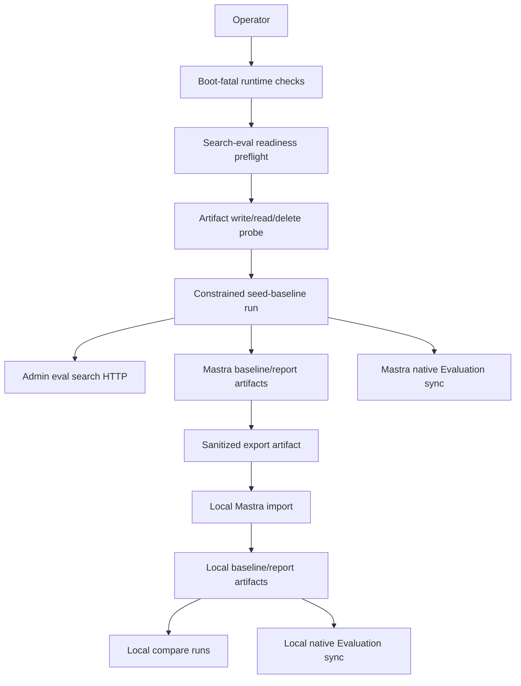
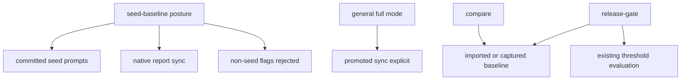

# Production Search Eval Seed Baseline Capture

## Summary

Capture the first Mastra-owned production search eval seed baseline from the committed seed prompt set, fail clearly when production wiring or storage is not ready, and add a bounded sanitized export/import path so local Mastra can use the same baseline without production access.

This plan narrows the brainstorm's broader "synthetic/native generated query" language to the roadmap ticket's committed seed prompt set. Generated candidates, trace-derived queries, user-submitted prompts, and promoted regression candidates stay out of the first production baseline through a constrained seed-baseline path, not only by convention.

---

## Problem Frame

`feat-154` blocks multilingual search work because the team needs a known production reference before `feat-120` changes retrieval behavior. The current Mastra branch already has the important foundation: seed prompts, offline baseline capture, comparison reports, native Evaluation sync, and a thin orchestrator. What is missing is the seed-baseline production posture: a run path that cannot accidentally widen into non-seed data, a preflight that tells operators when production wiring or persistence is unsafe, and a portable artifact path for local development.

The goal is not to move live search into Mastra. Admin remains the search authority, and Mastra calls Admin only through existing authenticated eval HTTP contracts.

---

## Requirements

### Seed Baseline Capture

- R1. Production seed baseline capture must use only the committed Mastra seed prompt set and must reject trace sampling, generated candidate creation, user-submitted candidate reads, seed candidate submission, and promoted candidate sync while in the seed-baseline posture.
- R2. The orchestrator must support a constrained seed-baseline run shape with baseline capture, `hybrid` search, all content types, native report sync enabled, and promoted sync unavailable for that posture. Promoted sync may remain reachable only through an explicit non-seed-baseline action.
- R3. The captured baseline and report must preserve provenance needed for later comparisons: baseline name, run ids, timestamps, prompt set version, sanitized Admin search target, search mode, content type, result lists, locale mix, source mix, counts, native Dataset/Scorer/Experiment ids, and pass/fail state.
- R4. Failed or partial runs must report child workflow ids, typed failure reasons, retryability, and any resumable report id/path without presenting an incomplete baseline as final.

### Production Readiness

- R5. Production readiness must be split between existing boot-fatal runtime checks and a callable search-eval preflight: boot-fatal checks keep production from starting with unsafe global storage/service config, while preflight reports seed-baseline-specific Admin eval config and artifact-store readiness once the runtime is up.
- R6. Readiness output must not include secrets, bearer values, database URLs, cookies, or raw request/response payloads.
- R7. Production runtime storage must remain Mastra-owned: native Evaluation and workflow metadata stay in Mastra's runtime database, while validated baseline/report payloads live in the persistent Mastra search-eval artifact store. Mastra must not query Admin's database or import Admin application code.
- R8. Callable preflight must probe the final search-eval artifact root with a non-secret write/read/delete check before a seed-baseline run is reported ready.

### Local Portability

- R9. A service-bearer-authenticated export action must produce a bounded JSON artifact containing a validated baseline plus selected report artifacts needed for local comparison/native Evaluation visibility.
- R10. Export eligibility must enforce the seed-only boundary: exported baselines/reports must match the requested baseline and prompt set, have seed-only prompt source mix, have no exploratory/generated/promoted/user/trace-derived query payloads, and have zero generated-candidate behavior.
- R11. The export artifact must be sanitized: no service tokens, production database credentials, raw trace rows, cookies, IP addresses, user identifiers, production filesystem paths, or artifact contents in logs.
- R12. A service-bearer-authenticated import action must validate the artifact, write reports before activating the baseline artifact, and be idempotent for repeated imports of the same baseline/report ids.
- R13. Import must be rejected in production by default. Any future production import requires an explicit break-glass configuration and dedicated import authorization separate from general service keys.
- R14. Imported reports must remain compatible with native Evaluation sync so local Mastra can recreate or reuse local Dataset/Scorer/Experiment records without production credentials.

### Compatibility And Operations

- R15. Existing offline eval, native suite, and orchestrator contracts must remain Studio-friendly with strict Zod schemas, bounded request bodies, and service bearer auth on `/forge-*` routes.
- R16. Portability route limits must be sized from the maximum valid artifact shape and must reject oversized imports before parsing.
- R17. Export/import results or logs must expose only non-secret audit summaries: action, environment, baseline/report ids, artifact byte size, result counts, outcome, and a non-secret service-key fingerprint when available.
- R18. The work must not change public search REST or GraphQL response shapes, live search ranking, multilingual embeddings, localized snippets, or release-gate thresholds.
- R19. Operator documentation must show the seed-only production capture payload, the export/import loop, and the local compare/native-sync workflow.

---

## Key Technical Decisions

- KTD1. Seed-only is the production default: The first baseline follows the roadmap ticket's committed seed prompt source even though the earlier brainstorm discussed broader synthetic/native generated queries. This preserves the P0 safety boundary and leaves generated/promoted/trace data for later eval layers.
- KTD2. Mastra storage authority is two-part but singularly Mastra-owned: Runtime/native metadata stays in Mastra's database, and baseline/report JSON payloads stay in the persistent Mastra search-eval artifact store. Export/import wraps those validated artifact payloads instead of creating an Admin-backed store, repo artifact source, or second comparison model.
- KTD3. Production readiness has boot-fatal and callable layers: Existing production runtime assertions should keep guarding global storage/service prerequisites at startup. The new preflight should report search-eval-specific readiness after startup and should perform a real artifact-store durability probe.
- KTD4. Seed-baseline is a constrained posture, not a default flag bundle: The production seed-baseline action should reject candidate generation, seed submission, trace/user/promoted inputs, and promoted sync even if a stale caller supplies those flags. General orchestrator modes can keep explicit promoted sync for separate operator workflows.
- KTD5. Local import restores artifacts, then reuses native sync: Import should write baseline/report artifacts locally and let the existing native suite sync imported reports into local Evaluation records. That avoids production database access while preserving Mastra-native visibility.
- KTD6. Import activation is ordered by consistency: Validate the entire artifact first, write report artifacts before the baseline artifact, and treat the baseline write as the activation marker. A failed import should not expose a baseline that points at missing reports.

---

## High-Level Technical Design

The production seed baseline remains a Mastra orchestration over Admin's eval-only search route. Export/import is a side channel over sanitized artifacts, not a live production connection from local development.

Mode behavior should stay explicit:

---

## Implementation Units

### U1. Constrained Seed-Baseline Orchestrator And Production Preflight

- **Goal:** Add a constrained seed-baseline posture for the first production baseline and expose readiness failures before the run is considered usable.
- **Files:** `apps/mastra/src/mastra/workflows/search-eval-orchestrator.ts`, `apps/mastra/src/mastra/workflows/search-eval-orchestrator.test.ts`, `apps/mastra/src/config/env.ts`, `apps/mastra/src/config/env.test.ts`
- **Patterns:** Follow existing strict input schemas, typed failure summaries, `childWorkflowRuns`, and route status mapping in `search-eval-orchestrator.ts`. Keep env checks non-secret like `assertMastraRuntimeEnv`.
- **Test Scenarios:**
  - The seed-baseline posture captures from committed seed prompts with candidate generation disabled, seed submission disabled, native report sync enabled, and promoted sync rejected.
  - The seed-baseline posture rejects stale payloads that try to set candidate generation, seed submission, trace/user/promoted inputs, or promoted sync.
  - Existing general orchestrator modes can still run promoted sync only when explicitly requested outside the seed-baseline posture.
  - Boot-fatal production checks remain process-startup guards for unsafe global storage or missing global service prerequisites.
  - Callable preflight reports missing Admin search URL, missing Admin eval bearer, and artifact-store probe failures without echoing values.
  - A failed readiness check returns typed non-retryable failure data and does not launch the offline eval child.

### U2. Portable Baseline Export/Import Artifact Service

- **Goal:** Add a Mastra-owned portability service that exports selected baseline/report artifacts and imports them into another Mastra environment.
- **Files:** `apps/mastra/src/services/offline-search-eval/types.ts`, `apps/mastra/src/services/offline-search-eval/artifacts.ts`, `apps/mastra/src/services/offline-search-eval/artifacts.test.ts`
- **Patterns:** Extend the existing safe-name validation, Zod artifact validation, max case/result bounds, atomic writes, and `SearchEvalArtifactError` failure taxonomy.
- **Test Scenarios:**
  - Export reads a named baseline plus selected report ids and returns a versioned artifact with no absolute filesystem paths or secret-like fields.
  - Export rejects otherwise shape-valid artifacts whose baseline/report prompt set, baseline name, prompt source mix, generated-candidate behavior, or exploratory/generated/promoted/user/trace-derived data violates the seed-only eligibility rules.
  - Export rejects unsafe baseline/report names and missing artifacts with typed errors.
  - Import validates schema version, kind, baseline/report payloads, artifact bounds, and byte-budget assumptions before writing anything.
  - Import writes report artifacts before the baseline artifact and treats the baseline write as the activation marker.
  - A simulated report-write failure leaves no activated imported baseline.
  - Re-importing the same artifact overwrites the same safe baseline/report artifact paths without creating ambiguous names.
  - Malformed artifacts with extra fields, wrong kinds, oversized cases/results, or invalid native projections are rejected.

### U3. Authenticated Portability Workflow And Route

- **Goal:** Expose preflight, export, and import through a Studio-friendly workflow plus a service-bearer route that can be used by production operators and local developers.
- **Files:** `apps/mastra/src/mastra/workflows/search-eval-baseline-portability.ts`, `apps/mastra/src/mastra/workflows/search-eval-baseline-portability.test.ts`, `apps/mastra/src/mastra/index.ts`
- **Patterns:** Mirror `search-eval-native-suite.ts` and `offline-search-eval.ts`: strict action schema, service bearer auth, route handler tests, and workflow failure envelopes. Size the portability body limit from the maximum valid artifact shape rather than copying the smaller existing route limits.
- **Test Scenarios:**
  - Unauthenticated route calls return service-bearer required.
  - A maximum valid export artifact imports under the configured portability byte limit.
  - Payloads one byte above the configured import/export body limit return invalid input or payload-too-large without parsing.
  - `preflight` returns readiness details and sanitized artifact root probe status.
  - `export-baseline` returns a bounded artifact for a valid baseline/report selection.
  - `import-baseline` writes local artifacts and returns imported baseline/report ids.
  - `import-baseline` is rejected in production by default, with any future break-glass path requiring explicit configuration and import-specific authorization.
  - Export/import responses include only non-secret audit summaries and never log bearer values or artifact contents.
  - Route status mapping distinguishes invalid input, missing artifacts, read/write failures, and runtime readiness failures.

### U4. Native Evaluation And Local Import Compatibility

- **Goal:** Ensure imported reports can be synced into local native Evaluation records without production credentials.
- **Files:** `apps/mastra/src/mastra/workflows/search-eval-native-suite.ts`, `apps/mastra/src/mastra/workflows/search-eval-native-suite.test.ts`, `apps/mastra/src/services/offline-search-eval/native-evaluation.ts`, `apps/mastra/src/services/offline-search-eval/native-evaluation.test.ts`
- **Patterns:** Reuse environment-labeled native keys from the native bridge pattern and keep stable idempotency keys for Dataset, Dataset items, and Experiment records.
- **Test Scenarios:**
  - A report imported from an export artifact can be synced by `sync-report` using only local Mastra runtime storage.
  - Native sync reuses existing local Dataset and Experiment records on repeated syncs.
  - Native metadata for imported reports does not include production artifact paths or service secrets.
  - Existing promoted candidate sync behavior remains available only when called explicitly.

### U5. Operator Documentation And Roadmap Completion Notes

- **Goal:** Document the exact production capture, export/import, and local compare workflow, then record ticket status and limitations.
- **Files:** `apps/mastra/CLAUDE.md`, `apps/mastra/.env.example`, `docs/roadmap/content-discovery/feat-154-production-search-eval-seed-baseline.md`, `docs/solutions/integration-issues/mastra-eval-workflow-local-dev-contracts.md`
- **Patterns:** Keep runbook snippets secret-free. Match existing Mastra docs for environment tables, route descriptions, and local smoke instructions.
- **Test Scenarios:** Documentation-only assertions are covered by the implementation tests above; verify the documented route names, action names, payload fields, and default behavior match the final code.

---

## Scope Boundaries

- Generated query candidates, trace-derived candidates, user-submitted candidates, and promoted regression candidates are excluded from the first production baseline.
- The implementation must not sample production traces, query Admin Postgres directly, import Admin code, or require local developers to receive production database credentials.
- Multilingual embeddings, localized snippets, ranking changes, public search response changes, and `feat-120` implementation remain out of scope.
- Release-gate policy changes are out of scope; imported baselines should work with existing compare and release-gate modes later.
- Deleting or migrating the legacy Admin eval harness is deferred to follow-up work.

---

## Risks And Dependencies

- Production env drift can still block the actual baseline run. The implementation can surface missing config and unsafe storage, but setting Railway/Admin secrets remains an operational dependency.
- Existing artifact storage is filesystem-backed under Mastra storage, while Mastra runtime/native metadata is Postgres-backed. The plan preserves that established Mastra-owned boundary, makes artifact durability probeable, and avoids adding a database table in this ticket.
- Export artifacts include production-derived search result metadata for synthetic seed queries. The sanitizer must continue to exclude secrets, trace rows, user identifiers, and production filesystem paths.
- Existing production startup assertions can prevent a callable preflight from reporting some global misconfiguration states. The implementation should factor readiness into reusable checks while preserving boot-fatal behavior for unsafe production runtime storage.
- Native Evaluation APIs are runtime-version sensitive. Tests should focus on the local interface already abstracted by `NativeSearchEvalMastra` and avoid depending on undocumented internal tables.

---

## Acceptance Examples

- AE1. Given production Mastra has passed boot-fatal runtime checks and has Admin eval search env plus probeable persistent artifact storage, when an operator runs the seed-baseline preflight, then it returns ready without exposing secret values.
- AE2. Given production Mastra is missing the Admin eval bearer, when an operator runs preflight or the seed-baseline run, then the response reports a typed missing-config failure before any Admin search call.
- AE3. Given the operator runs the production seed-baseline payload, when the orchestrator completes, then the summary includes the offline child run id, baseline/report identifiers, native Dataset/Scorer/Experiment identifiers, counts, and pass/fail state.
- AE4. Given a stale caller tries to run the seed-baseline posture with candidate generation, seed submission, or promoted sync enabled, when the orchestrator validates input, then it rejects the run before any Admin search call.
- AE5. Given a production baseline and report exist, when the operator exports them, then the artifact contains only seed-eligible validated baseline/report data and no service tokens, database URLs, raw trace rows, user identifiers, or production filesystem paths.
- AE6. Given a local developer imports the same export artifact twice, when local Mastra reads the baseline and report artifacts, then one stable baseline/report set exists and future compare/native-sync runs use it without production credentials.
- AE7. Given production Mastra receives an import request, when production import break-glass is not configured, then the route rejects the import without writing artifacts.
- AE8. Given a live public search request, when this feature is deployed, then Admin still serves the live search path and Mastra remains outside query-time retrieval.

---

## Origin Trace

Plan-local requirement and acceptance IDs are scoped to this plan. They intentionally narrow some origin items to the roadmap ticket's seed-only production baseline.

- Origin baseline capture requirements map to plan R1-R4, R7-R8, R18, AE1-AE5, and AE8.
- Origin local portability requirements map to plan R9-R14, R16-R17, AE5-AE7.
- Origin ownership and compatibility requirements map to plan R7, R14-R19, AE3, AE6, and AE8.
- Origin security and operations requirements map to plan R5-R6, R8, R11, R13, R16-R17, AE1-AE2, and AE7.
- Origin generated/synthetic query language is deliberately narrowed by plan R1-R2 and KTD1-KTD4 to the committed seed prompt set required by `feat-154`.

---

## Validation

- `pnpm --filter @forge/mastra test`
- `pnpm --filter @forge/mastra typecheck`
- `pnpm --filter @forge/mastra lint`

Validation completed on 2026-06-02 for the implementation branch:

- `pnpm --filter @forge/mastra test` passed: 27 files, 223 tests.
- `pnpm --filter @forge/mastra typecheck` passed.
- `pnpm --filter @forge/mastra lint` passed.

Formal code review completed with no actionable implementation findings. The
remaining work is operational: run the production seed-baseline capture,
export the sanitized artifact, import it locally, and record the production run
ids in the roadmap ticket.

Focused test files:

- `apps/mastra/src/mastra/workflows/search-eval-orchestrator.test.ts`
- `apps/mastra/src/mastra/workflows/search-eval-baseline-portability.test.ts`
- `apps/mastra/src/mastra/workflows/search-eval-native-suite.test.ts`
- `apps/mastra/src/services/offline-search-eval/artifacts.test.ts`
- `apps/mastra/src/services/offline-search-eval/native-evaluation.test.ts`
- `apps/mastra/src/config/env.test.ts`

---

## Sources / Research

- `docs/brainstorms/2026-06-01-production-search-eval-seed-baseline-requirements.md`
- `docs/roadmap/content-discovery/feat-154-production-search-eval-seed-baseline.md`
- `docs/roadmap/content-discovery/feat-139-mastra-offline-search-eval-runner-reports.md`
- `docs/roadmap/content-discovery/feat-142-mastra-search-eval-suite-operator-workflow.md`
- `docs/roadmap/content-discovery/feat-148-search-eval-orchestrator-workflow.md`
- `docs/solutions/integration-issues/mastra-eval-workflow-local-dev-contracts.md`
- `docs/solutions/architecture-patterns/mastra-native-evaluation-search-eval-bridge-pattern.md`
- `apps/mastra/src/mastra/workflows/search-eval-orchestrator.ts`
- `apps/mastra/src/mastra/workflows/offline-search-eval.ts`
- `apps/mastra/src/mastra/workflows/search-eval-native-suite.ts`
- `apps/mastra/src/services/offline-search-eval/artifacts.ts`
- `apps/mastra/src/services/offline-search-eval/seed-prompt-set.ts`
