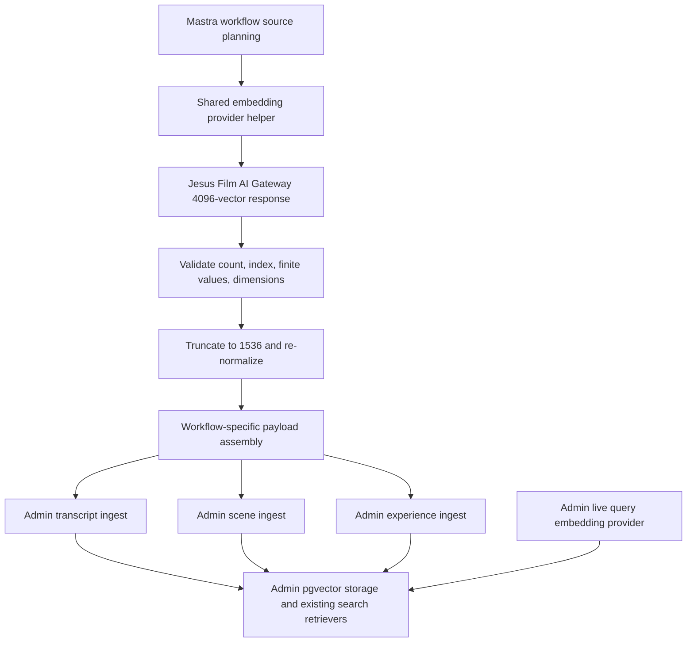
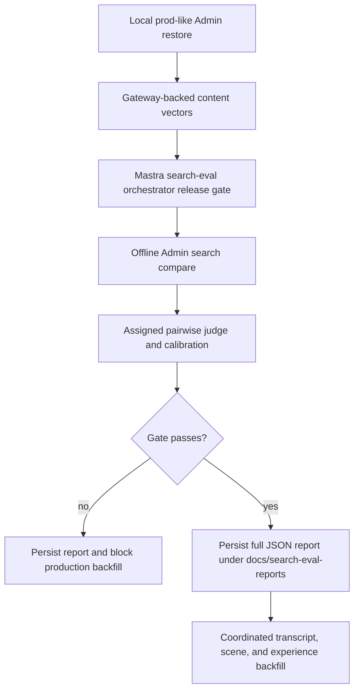

# feat: Migrate Mastra Content Embeddings to AI Gateway

## Summary

Migrate Mastra-owned transcript, scene, and experience content embedding
generation to the Jesus Film AI Gateway while preserving Admin's existing
1536-dimensional vector contract. The migration validates gateway-backed
content vectors with the Mastra local search-eval gate, stores the full JSON
evidence under `docs/search-eval-reports/`, and then enables a coordinated
all-content backfill.

---

## Problem Frame

Mastra now owns background content embedding generation, provider calls,
workflow diagnostics, and Admin ingest handoff for transcript, scene, and
experience vectors. The remaining provider posture still points through the
OpenRouter/OpenAI embedding path. The Jesus Film AI Gateway is
OpenAI-compatible and returns 4096-dimensional vectors by default, but Admin's
pgvector storage, ingest validation, search retrievers, and public contracts
remain built around 1536-dimensional vectors.

The migration must therefore transform gateway-native output into the existing
Admin vector contract, then prove search quality locally before replacing
healthy production content vectors. Admin live query embedding generation stays
on the current provider path for this slice, so validation must explicitly
account for the temporary provider split between content vectors and query
vectors.

---

## Requirements

**Provider Contract**

- R1. Mastra transcript, scene, and experience content embedding workflows use
  the Jesus Film AI Gateway embeddings endpoint for provider calls (origin R1).
- R2. Gateway configuration uses Mastra-owned embedding provider env and does
  not reuse or expose Admin live query embedding configuration or secrets
  (origin R2, R6).
- R3. Gateway requests include the OpenAI-compatible request body and required
  headers, including a non-default user agent for the gateway edge (origin R3).
- R4. Gateway-native provider vectors are truncated to 1536 dimensions and
  re-normalized before any Admin ingest payload is built (origin R4, AE1).
- R5. Mastra rejects malformed provider responses, count mismatches,
  inconsistent dimensions, non-finite values, zero-norm transformed vectors,
  and final vectors that do not match the 1536 contract (origin R5, AE1).

**Scope and Compatibility**

- R6. Admin live query embeddings remain on the current provider path in this
  migration (origin R6, AE2, AE6).
- R7. Admin pgvector column dimensions, indexes, public search response shapes,
  and GraphQL vector-exposure boundaries do not change (origin R7, AE6).
- R8. The validation gate explicitly evaluates the temporary provider split:
  gateway-backed content vectors with Admin live query embeddings still on the
  current provider path (origin R8, AE2).
- R9. Gateway-backed content vectors write auditable provider/model metadata
  without secrets, raw vectors, raw provider payloads, or raw source text in
  committed evidence or operator summaries (origin R9, AE4).
- R10. Existing transcript, scene, and experience Admin ingest endpoints remain
  type-specific. The work must not introduce a generic vector blob endpoint
  (origin F3, AE5, AE6).

**Eval Gate**

- R11. Production content-vector replacement is blocked until a full Mastra
  local search-eval run succeeds against a prod-like Admin restore (origin R10,
  F2).
- R12. The eval run must have an assigned judge; missing judge configuration or
  skipped calibration fails the migration gate rather than producing an
  unjudged pass (origin R11, AE3).
- R13. The migration gate passes only when judge calibration passes,
  net win rate is non-negative, no clear Tier-1 regression signal is present,
  and the report contains enough comparable evidence across the configured
  suite, Tier-1 prompts, locales, and content types (origin R12, AE2).
- R14. The full eval run JSON is written under `docs/search-eval-reports/` and
  excludes secrets, credentials, cookies, IP addresses, user identifiers, raw
  production trace rows, raw source/query text, raw vectors, and raw provider
  payloads (origin R13, AE4).

**Backfill**

- R15. After the eval gate passes, an operator can start one coordinated content
  backfill covering transcript, scene, and experience embeddings (origin R14,
  AE5).
- R16. The coordinated backfill preserves type-level reporting, failure
  isolation, idempotent reruns, and explicit repair, force, and model-upgrade
  modes (origin R16, AE5).
- R17. The backfill and validation path do not move live search orchestration
  or live query embedding generation into Mastra (origin R17, AE6).

---

## Key Technical Decisions

- KTD1. **Transform inside Mastra's shared provider helper:** The truncation
  and re-normalization behavior belongs in `apps/mastra/src/services/embedding-provider.ts`
  so all three content workflows share one provider-result contract. This
  follows the Mastra embedding workflow ownership pattern and avoids workflow
  drift while preserving type-specific source validation and Admin ingest.
- KTD2. **Prefer explicit gateway env over overloading OpenRouter/OpenAI env:**
  Mastra should gain gateway-specific key/base-url/user-agent configuration and
  production assertions. This makes provider provenance auditable and prevents
  OpenRouter fallback behavior from silently masking a missing gateway key.
- KTD3. **Keep the provider request OpenAI-compatible and client-side
  Matryoshka-aware:** Do not ask LiteLLM for `dimensions`. Request the normal
  embedding, transform the returned vector locally, and validate the final
  unit-normalized 1536-dimensional output before returning it to workflows.
- KTD4. **Use the existing Mastra search-eval orchestrator as the release gate:**
  Extend the current orchestrator rather than adding a one-off validation
  runner. The existing path already owns offline Admin search calls, judge
  orchestration, native Evaluation sync, and pass/fail summaries.
- KTD5. **Commit migration evidence as sanitized full JSON:** The report under
  `docs/search-eval-reports/` is a portable decision artifact, not an operator
  scratch file. It should be produced by the same artifact/schema path used by
  the Mastra eval runner or by a thin copier that preserves the runner's
  validated JSON shape and redaction rules.
- KTD6. **Extend the current backfill operator surface instead of adding three
  manual runbooks:** The existing `run-embeds` script already coordinates
  type-specific branches and report output. Adding an all-content posture there
  preserves local operator habits while keeping per-type outcomes intact.
- KTD7. **Make the gate artifact enforceable by operators:** The all-content
  production backfill must consume a passed migration gate report/run id before
  it rewrites healthy vectors. Local validation can bypass this only with an
  explicit local-only flag, so production replacement cannot happen by merely
  selecting `--pipeline=all`.

---

## High-Level Technical Design

---

## Implementation Units

### U1. Roadmap and Operator Documentation

**Goal:** Establish the migration ticket and operator-facing documentation
surface before behavior changes.

**Requirements:** R2, R11, R14, R15, R16

**Dependencies:** None

**Files:**

- Modify: `docs/roadmap/content-discovery/feat-156-mastra-ai-gateway-content-embeddings.md`
- Create: `docs/search-eval-reports/README.md`
- Test expectation: none -- documentation-only unit.

**Approach:** Keep the roadmap ticket aligned with the brainstorm and this
plan. Add a short `docs/search-eval-reports/README.md` that explains this
directory is for sanitized full JSON migration/eval evidence, not secrets,
trace rows, raw vectors, or long-term scratch artifacts.

**Patterns to follow:** Roadmap ticket style in
`docs/roadmap/content-discovery/feat-154-production-search-eval-seed-baseline.md`;
temporary artifact explanation in `docs/search-eval-baselines/temporary/README.md`.

**Test scenarios:** Test expectation: none -- no runtime behavior changes.

**Verification:** The roadmap ticket exists, the report directory has a
committed policy note, and both point to the brainstorm/plan without leaking
secrets.

### U2. Gateway Provider Configuration

**Goal:** Add Mastra-owned gateway configuration and production assertions for
content embedding provider calls.

**Requirements:** R1, R2, R3, R6, R9

**Dependencies:** U1

**Files:**

- Modify: `apps/mastra/src/config/env.ts`
- Modify: `apps/mastra/src/config/env.test.ts`
- Modify: `apps/mastra/AGENTS.md`

**Approach:** Add gateway-specific embedding env for API key, base URL, model,
provider name, user agent, allowed hosts, and content-provider mode. Provider
config resolution should prefer the gateway when present, fail closed in
production when gateway mode is selected or implied, and keep OpenAI/OpenRouter
fallback explicit for non-migrated local/test contexts. The production gateway
base URL must be HTTPS and must match the explicit allowlist before any
Authorization header can be sent. Update Mastra guidance so future embedding
work knows content vectors now use the gateway path while Admin live query
embeddings stay separate.

**Configuration contract:**

| Env var                                   | Purpose                                    | Default / rule                                                                     |
| ----------------------------------------- | ------------------------------------------ | ---------------------------------------------------------------------------------- |
| `MASTRA_CONTENT_EMBEDDINGS_PROVIDER_MODE` | Selects content embedding provider posture | `gateway` in production; `legacy` outside production unless gateway key is present |
| `AI_GATEWAY_EMBEDDINGS_API_KEY`           | Mastra-owned gateway embedding secret      | Required when mode resolves to `gateway`; never logged                             |
| `AI_GATEWAY_EMBEDDINGS_BASE_URL`          | OpenAI-compatible gateway base URL         | `https://ai-gateway.jesusfilm.org/v1`                                              |
| `AI_GATEWAY_EMBEDDINGS_ALLOWED_HOSTS`     | Production host allowlist                  | `ai-gateway.jesusfilm.org`; production rejects non-allowlisted hosts               |
| `AI_GATEWAY_EMBEDDINGS_USER_AGENT`        | Non-default edge user agent                | Stable Forge/Mastra user agent string                                              |
| `AI_GATEWAY_EMBEDDINGS_MODEL`             | Request model sent to the gateway          | `embeddings`                                                                       |
| `AI_GATEWAY_EMBEDDINGS_PROVIDER`          | Auditable provider label                   | `jesus-film-ai-gateway`                                                            |

**Patterns to follow:** Existing `getTranscriptEmbeddingProviderConfig`,
`getSceneEmbeddingProviderConfig`, and `getExperienceEmbeddingProviderConfig`
helpers in `apps/mastra/src/config/env.ts`; production env assertions in
`assertMastraRuntimeEnv`.

**Test scenarios:**

- Given gateway key/base URL/user agent env values, provider config helpers
  return gateway config for transcript, scene, and experience.
- Given no gateway env but existing OpenRouter/OpenAI test env, provider config
  resolution remains explicit and deterministic for local compatibility.
- Given production runtime with gateway migration required but no gateway key,
  `assertMastraRuntimeEnv` reports a missing gateway embedding provider secret
  without printing any secret value.
- Given production runtime with a gateway base URL using `http:` or a host
  outside `AI_GATEWAY_EMBEDDINGS_ALLOWED_HOSTS`,
  `assertMastraRuntimeEnv` fails before provider calls can send credentials.
- Given a blank gateway env value, env parsing treats it as unset.

**Verification:** Mastra config tests prove provider precedence, required
production configuration, and secret-safe failure messages.

### U3. Shared Gateway Transform and Validation

**Goal:** Make the shared embedding provider helper convert gateway-native
vectors into Admin-compatible 1536-dimensional, unit-normalized vectors.

**Requirements:** R1, R3, R4, R5, R9

**Dependencies:** U2

**Files:**

- Modify: `apps/mastra/src/services/embedding-provider.ts`
- Modify: `apps/mastra/src/services/embedding-provider.test.ts`

**Approach:** Extend request options or provider config with an optional final
dimension transform. The helper should validate the raw gateway response shape,
apply the 1536 truncation, reject zero-norm or non-finite transformed vectors,
re-normalize, and report final dimensions as 1536 to callers. Preserve
input-position stability: the transformed vector at output index `i` must
correspond to input index `i`. Add a user-agent header sourced from config and
keep request bodies OpenAI-compatible without `dimensions`. Add a gateway
contract preflight that records returned model identity, native dimensions,
transform version, and a small sample semantic/cosine sanity check before and
after truncation; fail the migration gate if the returned model or dimensions
do not match the Matryoshka-compatible target.

**Patterns to follow:** Existing response index validation in
`apps/mastra/src/services/embedding-provider.ts`; batched provider
input-position-stable contract from
`docs/solutions/best-practices/batched-provider-input-position-stable-contract-20260505.md`.

**Test scenarios:**

- Covers AE1. Given one 4096-dimensional provider vector with finite values,
  the helper returns one 1536-dimensional vector whose norm is approximately
  one.
- Given two gateway response items returned out of order, the helper returns
  transformed vectors in the original input order.
- Given a provider vector shorter than the requested final dimensions, the
  helper throws `dimension_mismatch`.
- Given a transformed vector with zero norm, the helper throws
  `invalid_response` before any workflow receives it.
- Given a malformed index, duplicate index, count mismatch, inconsistent raw
  dimensions, or non-finite value, the existing typed provider failures still
  fire.
- Given gateway config with a custom user agent, the outbound request includes
  that user agent and does not include a `dimensions` field in the JSON body.
- Given gateway preflight sample inputs, the preflight records returned model
  identity, native dimensions, final dimensions, transform version, and
  post-transform norms, and fails closed on unexpected model/dimension output.

**Verification:** Provider tests demonstrate raw 4096 input compatibility,
1536 final output, unit-normalization, position stability, and secret-free
error behavior.

### U4. Workflow Provider Metadata and Contract Preservation

**Goal:** Ensure transcript, scene, and experience workflows use the gateway
provider contract consistently and continue submitting type-specific
1536-dimensional Admin ingest payloads.

**Requirements:** R1, R4, R5, R7, R9, R10, R17

**Dependencies:** U2, U3

**Files:**

- Modify: `apps/mastra/src/mastra/workflows/transcript-embedding.ts`
- Modify: `apps/mastra/src/mastra/workflows/transcript-embedding.test.ts`
- Modify: `apps/mastra/src/mastra/workflows/scene-embedding.ts`
- Modify: `apps/mastra/src/mastra/workflows/scene-embedding.test.ts`
- Modify: `apps/mastra/src/mastra/workflows/experience-embedding.ts`
- Modify: `apps/mastra/src/mastra/workflows/experience-embedding.test.ts`
- Modify: `apps/admin/prisma/schema.prisma`
- Create: `apps/admin/prisma/migrations/<timestamp>_add_content_embedding_provider_provenance/migration.sql`
- Modify: `apps/admin/src/services/transcript-embedding.service.ts`
- Modify: `apps/admin/src/services/transcript-embedding.service.test.ts`
- Modify: `apps/admin/src/services/transcript-embedding-ingest.service.ts`
- Modify: `apps/admin/src/services/transcript-embedding-ingest.service.test.ts`
- Modify: `apps/admin/src/services/transcript-embedding-ingest.contract.test.ts`
- Modify: `apps/admin/src/services/scene-embedding.service.ts`
- Modify: `apps/admin/src/services/scene-embedding.service.test.ts`
- Modify: `apps/admin/src/services/scene-embedding-ingest.service.ts`
- Modify: `apps/admin/src/services/scene-embedding-ingest.service.test.ts`
- Modify: `apps/admin/src/services/experience-embedding-ingest.service.ts`
- Modify: `apps/admin/src/services/experience-embedding-ingest.service.test.ts`

**Approach:** Thread the gateway-aware provider config through each workflow's
existing requester path without weakening source validation or Admin ingest
schemas. Keep the workflow-visible dimensions at 1536 and include provider
metadata that makes gateway-backed runs auditable. If Admin lacks a separate
embedding-provider provenance field for a type, add an internal-only storage
path for model/provider/dimensions/transform version while keeping vectors out
of GraphQL and preserving type-specific ingest endpoints. Step outputs should
keep safe summaries only: counts, dimensions, model/provider names, transform
version, token counts, source hashes, statuses, and run ids, not raw vectors or
raw source text.

**Patterns to follow:** Workflow failure and safe-summary patterns in
`docs/solutions/platform/mastra-embedding-workflow-ownership-pattern.md`;
type-specific workflow patterns in the transcript, scene, and experience
solution notes.

**Test scenarios:**

- Covers AE1. Transcript workflow receives gateway-style transformed vectors
  and sends Admin ingest chunks with model dimensions equal to 1536 and
  internal gateway provider provenance.
- Covers AE1. Scene workflow preserves scene-to-vector position mapping after
  the shared provider helper transforms gateway vectors and records gateway
  provider provenance.
- Covers AE1. Experience workflow sends exactly one transformed 1536 vector and
  keeps source hash validation intact.
- Given provider transform failure, each workflow maps the typed provider error
  to `provider_dimension_mismatch` or provider failure without calling Admin
  ingest.
- Given successful gateway-backed runs, workflow outputs include provider/model
  metadata and dimensions but no raw vectors.

**Verification:** Focused workflow tests prove all three embedding types share
the gateway provider contract while retaining type-specific Admin ingest
behavior.

### U5. Search-Eval Migration Gate and Report Export

**Goal:** Make the Mastra search-eval orchestrator enforce the migration gate
and write the full sanitized JSON report under `docs/search-eval-reports/`.

**Requirements:** R8, R11, R12, R13, R14, R17

**Dependencies:** U1, U4

**Files:**

- Modify: `apps/mastra/src/mastra/workflows/search-eval-orchestrator.ts`
- Modify: `apps/mastra/src/mastra/workflows/search-eval-orchestrator.test.ts`
- Modify: `apps/mastra/src/services/offline-search-eval/report.ts`
- Modify: `apps/mastra/src/services/offline-search-eval/report.test.ts`
- Modify: `apps/mastra/src/services/offline-search-eval/artifacts.ts`
- Modify: `apps/mastra/src/services/offline-search-eval/artifacts.test.ts`

**Approach:** Extend release-gate evaluation with explicit migration
thresholds: assigned judge, non-skipped passing calibration, non-negative
`netWinRate`, a Tier-1 regression check derived from report outcome metadata or
a conservative loss classification, minimum comparable query counts overall and
by Tier-1/locale/content type, exact suite/baseline version, and maximum
skipped, search-failure, and judge-disagreement rates. Keep corpus provenance
auditable through Admin's transcript, scene-locale, and experience-locale
provider/transform columns and the local backfill report for the restore being
evaluated, while the release gate itself evaluates search quality and judge
readiness. Add a report export path that copies or writes the already validated
full report JSON under
`docs/search-eval-reports/` for the migration run. The report writer should
reuse existing schema/redaction protections and add a destination scanner that
fails closed if the payload includes prohibited sensitive field names, IP
literals, raw source/query text, raw trace rows, raw vectors, or raw provider
payloads.

**Patterns to follow:** Offline search-eval report strictness in
`docs/solutions/architecture-patterns/mastra-offline-search-eval-orchestration-boundary-pattern.md`;
native Evaluation bridge notes in
`docs/solutions/architecture-patterns/mastra-native-evaluation-search-eval-bridge-pattern.md`.

**Test scenarios:**

- Covers AE2 and AE3. Given release-gate mode without a judge, the orchestrator
  fails with a gate failure and does not report pass.
- Covers AE3. Given a report whose calibration is skipped or failed, migration
  gate state is failed.
- Covers AE2. Given a comparison report with negative net win rate, migration
  gate state is failed even when raw loss count is within the existing limit.
- Covers AE2. Given too few comparable outcomes, missing suite/baseline
  version, excessive skipped/search-failed rows, or excessive judge
  disagreement, migration gate state is failed.
- Covers AE2. Given Tier-1 regression evidence, migration gate state is failed
  and the summary names the regression category without exposing raw trace data.
- Covers AE2. Given Admin embedding owner rows from the local gateway backfill,
  transcript, scene, and experience provenance stores the provider,
  dimensions, and transform version needed to audit the evaluated corpus.
- Covers AE4. Given a valid migration gate report, the full JSON artifact is
  written under `docs/search-eval-reports/` and validates against the existing
  report schema.
- Covers AE4. Given a report-like object with credentials, cookies, raw trace
  rows, user identifiers, raw source/query text, IP literals, raw vectors, or
  provider payloads in disallowed fields, the export rejects it.

**Verification:** Search-eval tests prove gate thresholds, judge assignment,
net-win-rate behavior, redaction, and durable report placement.

### U6. Coordinated All-Content Backfill

**Goal:** Let an operator run transcript, scene, and experience embedding
backfills as one coordinated content action after the eval gate passes.

**Requirements:** R11, R15, R16, R17

**Dependencies:** U4, U5

**Files:**

- Modify: `apps/admin/src/scripts/run-embeds.ts`
- Modify: `apps/admin/src/scripts/run-embeds.test.ts`
- Modify: `apps/admin/AGENTS.md`

**Approach:** Extend the existing local operator script with an all-content
pipeline that runs scene, transcript, and experience branches while preserving
existing per-branch config, modes, filters, preflight checks, outcome
aggregation, report writing, and interruption behavior. Keep the legacy `both`
behavior compatible as scene plus transcript, and make the new all-content
posture explicit so operators do not accidentally include experience when they
asked for the historical mode. Production all-content backfill must require a
validated migration gate report/run id before any branch starts; only explicit
local-validation/dry-run flags may bypass this preflight. The canonical
production migration command uses model-upgrade mode for all three branches:
`--pipeline=all --gate-report=<path> --scene-mode=model-upgrade
--transcript-mode=model-upgrade --experience-mode=model-upgrade`.

**Patterns to follow:** Existing branch orchestration and structured events in
`apps/admin/src/scripts/run-embeds.ts`; producer-consumer report contract notes
in `docs/solutions/best-practices/producer-consumer-report-file-contract-pattern-20260506.md`.

**Test scenarios:**

- Covers AE5. Given `pipeline=all`, the script invokes scene, transcript, and
  experience branches and returns a final report with all three type keys.
- Covers AE5. Given `pipeline=all` without a passing gate report in production
  mode, the script aborts before running any branch.
- Covers AE5. Given the canonical model-upgrade command, scene, transcript, and
  experience branches all receive model-upgrade mode.
- Covers AE5. Given one branch failure, the final report preserves the failed
  branch's error details while still reporting the other branches' outcomes.
- Given `pipeline=both`, behavior remains scene plus transcript and experience
  is still explicitly skipped for backward compatibility.
- Given repair, force, and model-upgrade flags, each branch receives only the
  mode intended for its embedding type.
- Given `--report-out`, the final all-content report writes the same stable
  file contract shape as stdout.

**Verification:** Admin script tests prove all-content orchestration, per-type
failure isolation, backward compatibility for `both`, and stable report output.

### U7. Validation Evidence and Backfill Readiness Check

**Goal:** Capture the migration validation result and prove the implementation
is ready for production backfill without committing production secrets or raw
trace data.

**Requirements:** R8, R11, R12, R13, R14, R15, R16, R17

**Dependencies:** U5, U6

**Files:**

- Create: `docs/search-eval-reports/<migration-run-id>.json`
- Modify: `docs/roadmap/content-discovery/feat-156-mastra-ai-gateway-content-embeddings.md`

**Approach:** Run the full Mastra local eval suite against a prod-like Admin
restore after gateway-backed content vectors are generated locally. Store the
full sanitized JSON report under the committed report directory and add
roadmap completion notes summarizing run id, judge model, pass/fail state,
net win rate, comparable coverage counts, provider/backfill provenance
references, Tier-1 regression status, and backfill readiness. Every completed
migration eval run, passing or failing, writes and commits the sanitized full
JSON report; the only exception is a run that aborts before any report can
exist. Failed reports must clearly mark production backfill as blocked.

**Patterns to follow:** Production seed baseline completion note shape in
`docs/roadmap/content-discovery/feat-154-production-search-eval-seed-baseline.md`;
report artifact redaction rules from the Mastra offline eval solution notes.

**Test scenarios:**

- Covers AE2. Given a passing local migration report, the roadmap notes record
  judge model, calibration pass, non-negative net win rate, and no Tier-1
  regression status.
- Covers AE4. Given the committed JSON report, schema validation accepts it and
  redaction checks find no secrets, raw trace rows, raw source/query text, IP
  literals, raw vectors, or direct user identifiers.
- Covers AE5. Given a passing gate, the all-content backfill readiness note
  references the coordinated backfill posture and preserves type-level
  reporting expectations.

**Verification:** The repo contains a sanitized full JSON validation artifact
and roadmap notes that make production backfill readiness reviewable.

---

## Scope Boundaries

- Moving Admin live query embeddings to the Jesus Film AI Gateway is deferred
  to a separate migration.
- Moving pgvector storage, indexes, or ingest contracts from 1536 to 4096
  dimensions is out of scope.
- Production shadow vector tables, shadow columns, and production shadow
  search paths are out of scope.
- Search eval human-promotion workflows and permanent regression policy are
  out of scope beyond the judge-backed validation gate for this migration.
- Ranking retune work is deferred unless the validation report exposes a
  blocking regression that must be fixed before backfill.
- Admin public search APIs, GraphQL schema, and vector-exposure boundaries are
  unchanged in this plan.

---

## System-Wide Impact

Mastra's content embedding provider path changes for three background
workflows, so provider configuration, retryable failure classification,
Studio-visible workflow summaries, and Admin ingest provenance all need to
remain coherent. Admin storage and live search remain the stability boundary:
type-specific ingest validates final 1536-dimensional vectors, existing
pgvector indexes continue serving retrieval, and live query embeddings stay on
the current provider until a separate query-side migration exists.

Operationally, the migration adds a hard gate between local validation and
production backfill. A failed gateway provider call, missing judge, failed
calibration, negative net win rate, or Tier-1 regression blocks production
vector replacement. A passing gate creates durable evidence that can be reviewed
without replaying the full eval run.

---

## Risks & Dependencies

- **Gateway behavior drift:** The gateway may change native dimensions, response
  ordering, required headers, or auth behavior. Mitigation: validate raw
  provider response shape, include gateway user agent config, and keep final
  vector dimensions enforced before Admin ingest.
- **Provider split quality risk:** Content vectors and query vectors use
  different providers during this slice. Mitigation: run the Mastra search-eval
  comparison against the split state and require no material regression before
  backfill.
- **Backfill blast radius:** Replacing all content vectors touches persistent
  search state. Mitigation: validate locally first, preserve idempotent/repair
  modes, keep type-level outcomes, and block production replacement on a failed
  eval gate.
- **Production rollback:** A bad production backfill or post-backfill quality
  issue must have a restore path. Mitigation: require a verified database
  restore point or vector export for transcript, scene, and experience
  embeddings before `--pipeline=all`, document restore order, and run a
  post-rollback search smoke check.
- **Report sensitivity:** Full JSON evidence is useful but risky if it captures
  raw trace rows or secrets. Mitigation: reuse strict report schemas, redact
  trace-derived fields, add destination policy docs, and test disallowed fields.
- **Concurrent repo work:** This work is happening in an isolated worktree.
  Mitigation: keep changes scoped to the worktree and avoid touching the main
  checkout.

---

## Documentation and Operational Notes

- Document the gateway provider env names and ownership in `apps/mastra/AGENTS.md`.
- Add `docs/search-eval-reports/README.md` before committing any full JSON
  report.
- Keep operator-facing examples focused on local/prod-like validation and the
  all-content backfill posture, without including secrets or exact production
  credentials.
- Record final validation and production-readiness notes on
  `docs/roadmap/content-discovery/feat-156-mastra-ai-gateway-content-embeddings.md`.

---

## Sources and Research

- `docs/brainstorms/2026-06-03-mastra-ai-gateway-content-embeddings-requirements.md`
- `apps/mastra/AGENTS.md`
- `apps/admin/AGENTS.md`
- `apps/mastra/src/config/env.ts`
- `apps/mastra/src/services/embedding-provider.ts`
- `apps/mastra/src/mastra/workflows/transcript-embedding.ts`
- `apps/mastra/src/mastra/workflows/scene-embedding.ts`
- `apps/mastra/src/mastra/workflows/experience-embedding.ts`
- `apps/mastra/src/mastra/workflows/search-eval-orchestrator.ts`
- `apps/mastra/src/services/offline-search-eval/runner.ts`
- `apps/mastra/src/services/offline-search-eval/judge.ts`
- `apps/mastra/src/services/offline-search-eval/report.ts`
- `apps/mastra/src/services/offline-search-eval/artifacts.ts`
- `apps/admin/src/scripts/run-embeds.ts`
- `docs/solutions/platform/mastra-embedding-workflow-ownership-pattern.md`
- `docs/solutions/best-practices/batched-provider-input-position-stable-contract-20260505.md`
- `docs/solutions/architecture-patterns/mastra-offline-search-eval-orchestration-boundary-pattern.md`
- `docs/solutions/architecture-patterns/mastra-native-evaluation-search-eval-bridge-pattern.md`
