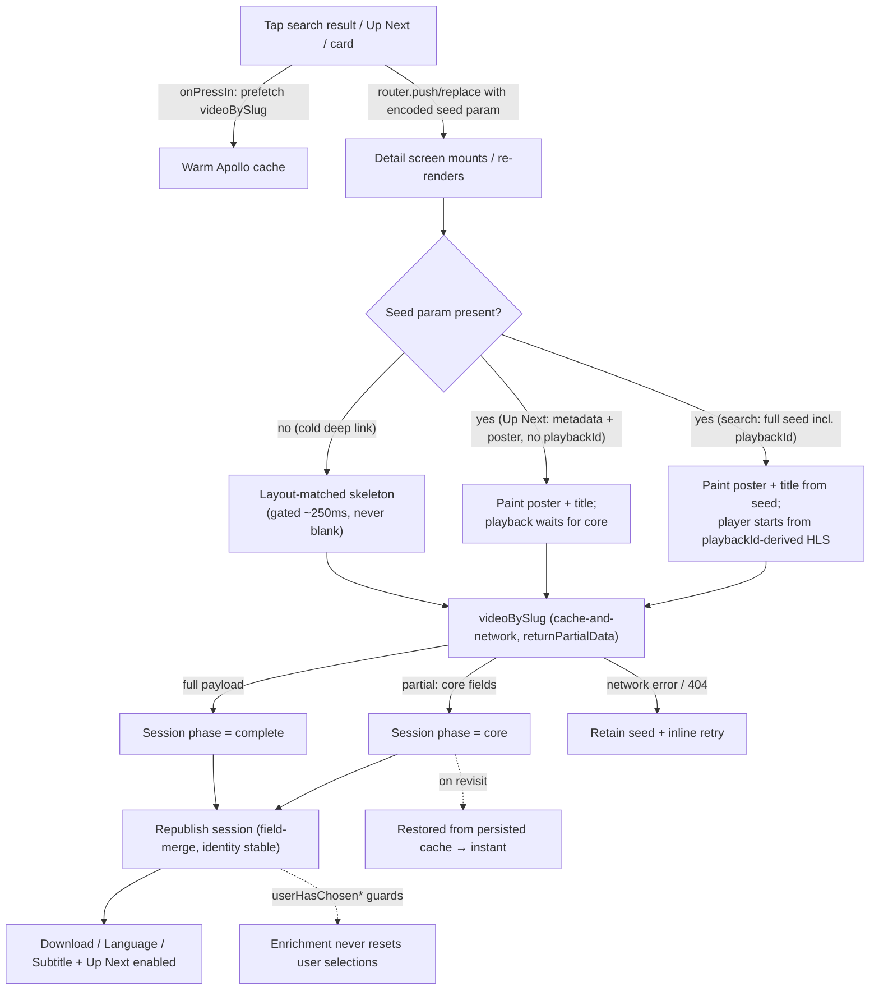
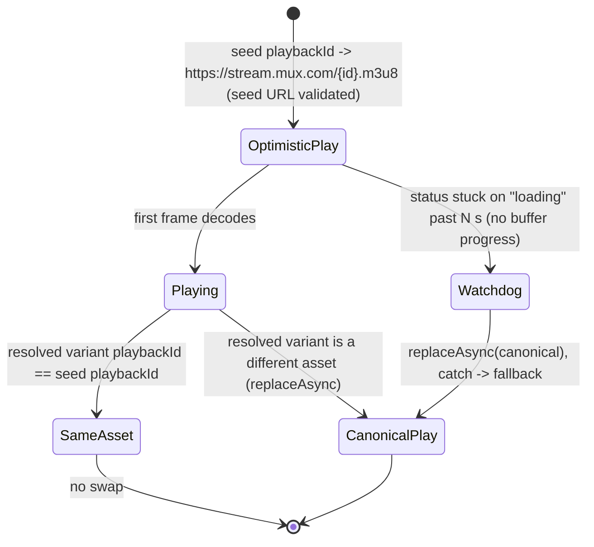

# perf: Instant mobile video detail screen

## Summary

Make the mobile video detail screen paint instantly on tap and start playback as fast as the data allows, instead of blocking ~5s behind a full-screen spinner. The load-bearing fix is rendering from seed data the caller already holds and starting playback from the seed `playbackId` — independent of any query change. On top of that: a single `videoBySlug` query with partial-data rendering so canonical fields stream in over the seed, a session-owned `seed → core → complete` state machine that never resets user selections, and device-persisted cache + press-in prefetch so repeat visits need no network. The screen **never shows a blank spinner** on any entry point; **instant playback** is delivered on seeded and warm-cache paths (a cold deep link still waits on the network for the first frame, but shows a skeleton, not a blank screen).

---

## Problem Frame

Tapping a search result navigates to `apps/mobile/app/watch/[slug].tsx`, which fires `GET_VIDEO_BY_SLUG` — the entire `WatchVideo` fragment (`apps/mobile/src/lib/queries.ts:95-212`: all image variants, every locale, parent + all sibling children, every dub with every download and subtitle track, study questions, Bible citations) — over the network to production admin GraphQL, and blocks behind `ActivityIndicator` until the whole payload returns (`[slug].tsx:154`). The premise that "content is local" is false: there is no local CMS, and the Apollo cache is in-memory only (`apps/mobile/src/lib/apolloClient.ts:40`), empty on every cold start. The search result already carries `slug`, `title`, `imageUrl`, and a playable `playbackId` (`queries.ts:58-67`), but only the slug is forwarded — so every tap is a cold fetch of a payload the screen uses ~5-10% of on first paint (see origin: `docs/brainstorms/2026-06-03-mobile-instant-video-detail-requirements.md`).

---

## Key Technical Decisions

- KTD1. **Seed data, not a faster query, solves the blank spinner.** First paint and playback come from a seed object (title/image/`playbackId`/slug) the caller already holds, passed via nav params. This is what kills the spinner and is independent of any query work — it lands in Phase 1 and on its own resolves the reported pain. Everything else (partial data, persistence, prefetch) makes the _canonical_ data arrive fast; it is secondary to the seed.

- KTD2. **One `videoBySlug` query with `returnPartialData`, never two queries on the same root field.** Running a lean and a heavy `useQuery` against the same `videoBySlug(slug)` root field makes them fight over the single root-field cache slot — the heavy write replace-merges the lean result's list fields and Apollo emits "Cache data may be lost." Instead, keep one query, enable `returnPartialData: true`, and let the seed + `cache-and-network` stream fields in: seed paints immediately, cached/prefetched fields render the instant they exist, the full payload fills the rest.

- KTD3. **The query keeps its full selection; a faster lean fetch is a deferred admin-handoff, not part of this plan.** The brainstorm assumed selecting fewer fields makes `videoBySlug` return materially faster (skipping the `parents.children` and `dubs.downloads.subtitles` relation joins). The only no-admin-change way to exploit that (two queries on one root field) is unsafe per KTD2; a genuinely separate lean network request needs a distinct root field (`videoCoreBySlug`) = an admin/server change that is out of scope. So U4 keeps the single full query unconditionally. A latency probe (full vs reduced selection against admin) is worth running as a quick spike to decide whether to _file_ an admin-side lean-root-field follow-up — but its outcome cannot change what this plan builds, so it is a note here, not a gating unit. Perceived speed is carried by seed (KTD1) + warm cache (prefetch/persistence), not by a faster fetch.

- KTD4. **`WatchSessionProvider` owns a `seed → core → complete` state machine and never clobbers user selections.** Today the provider's default-resolution effect is keyed on `[video?.documentId]` and unconditionally resets variant + subtitle whenever identity changes (`WatchSessionProvider.tsx:63-77`). Publishing seed→core→complete would re-trigger that reset and wipe a language/subtitle pick the user made mid-load. Fix: the provider becomes the single owner of completeness state, establishes a stable canonical identity once, field-merges later publishes that carry the same identity instead of replacing, and guards the defaults effect with `userHasChosenVariant`/`userHasChosenSubtitle` flags so enrichment can never reset an explicit choice.

- KTD5. **Optimistic playback via `replaceAsync`; decide swap-vs-no-swap by comparing `playbackId`, not full URL strings.** Current code calls `player.replace()` (`VideoPlayer.tsx:40`), which loads HLS synchronously on the UI thread; switch to `replaceAsync()` with a `.catch()` fallback. The optimistic source is `https://stream.mux.com/{seed.playbackId}.m3u8`. The resolved player source, however, comes from `normalizeVideo` which passes the stored `hls` field through verbatim (`normalizeVideo.ts:273`) — it does **not** rebuild the URL from a `playbackId`, so the seed URL and the resolved `hls` are **not guaranteed byte-identical** (query params, CDN host — prod media also lives on `api-media-core.jesusfilm.org`). Therefore the swap decision compares the **extracted `playbackId`** of the current source against the resolved variant's `playbackId` (regex per `muxThumbnail.ts` `MUX_STREAM_RE`), not the raw strings: same `playbackId` → no swap; different asset → one accepted `replaceAsync`. The swap is genuinely rare only for users whose device locale resolves to the same variant the seed represents; non-English-locale users may resolve a different default variant (`resolveDefaultSlug` keys on device locale, `WatchSessionProvider.tsx:62-76`) and take one swap — accepted per R5. A watchdog timer (see U3) handles the expo/expo#36673 stuck-`loading` bug.

- KTD6. **Validate only the synthesized seed URLs; pass canonical CMS URLs through unchanged.** The seed-derived stream URL and seed image URL are synthesized from untrusted nav params, so they go through host allowlists (`validateStreamingUrl` for the stream; a new image-CDN allowlist for the image) before use. The canonical `hls` resolved from `videoBySlug` continues to flow to the player **unvalidated**, exactly as today (`[slug].tsx:207`) — gating it through the Mux-only allowlist would regress any video whose production `hls` is served from `api-media-core.jesusfilm.org`. The residual risk (a poisoned canonical URL from a compromised API) is named in the Security Threat Model rather than mitigated by a host gate that breaks real media hosts.

- KTD7. **Cache persistence is hand-rolled, gated _above_ `ApolloProvider`, time-bounded on read, and excludes volatile fields.** `apollo3-cache-persist` is Apollo-v3-only and previously crashed this app on launch (`docs/solutions/mobile/mobile-v2-sdui-app-scaffold-and-review-findings.md`). Persistence uses v4's `cache.extract()`/`restore()` + AsyncStorage. The restore gate sits **above** `ApolloProvider` (the outermost provider today, `_layout.tsx:160`, client built synchronously at `_layout.tsx:155`) and `getApolloClient()` becomes async/restore-aware — gating a child provider's `isReady` does NOT work because `cache-and-network` queries (`ExperienceShell`, `useExperience`) would fire against an un-restored cache and be clobbered by a late restore. The restore read is `Promise.race`'d against a 300-500ms timeout: on timeout the app boots cold and a late-arriving restore is **discarded** (never applied, to avoid the clobber race). Persistence writes use an incrementally-maintained serialized snapshot (no synchronous full `extract()` on the AppState→background path). Signed/expiring download and HLS URLs are excluded; the blob is version-keyed + TTL'd.

- KTD8. **No app-wide cache normalization in this plan.** Entity normalization via `keyFields` (the queries alias `documentId: id`, so default keying does not normalize these types today) was considered but dropped: persistence (KTD7) persists denormalized result trees / a ref-closure rather than relying on normalized entities, so normalization buys nothing here while changing how every shared type behaves app-wide (homepage Experience, carousels). It is moved to a scoped follow-up (see Scope Boundaries), keeping this plan's blast radius on the watch flow.

---

## High-Level Technical Design

The render path is a three-state progression — `seed → core → complete` — owned by `WatchSessionProvider`, where a blank full-screen spinner is not a representable state. Seed paints immediately; one `videoBySlug` query (partial-data) streams canonical fields in; user selections are guarded against enrichment resets.



Optimistic playback swaps source on one native player; the swap decision compares extracted `playbackId`, so a different stored-URL shape for the same asset does not force a swap:



---

## Requirements

Carried from the origin requirements doc and grouped by capability. Origin R-IDs preserved.

**Instant first paint**

- R1. Callers with seed data (title/image/`playbackId`/slug) navigate with that seed and the screen renders it immediately without a full-screen spinner. (U1, U2)
- R2. The detail screen never shows a blank/full-screen spinner; before data arrives it shows seed content and/or a structured skeleton. (U2)
- R3. Sections fill in progressively rather than blocking on the complete payload. (U2, U4, U5)

**Optimistic playback**

- R4. With a usable `playbackId`, the player begins loading `https://stream.mux.com/{playbackId}.m3u8` immediately. (U3)
- R5. When the resolved variant is a different asset than the optimistic source the player swaps via `replaceAsync` as one continuous session; when the resolved variant has the same `playbackId`, no swap occurs. (U3)
- R6. With no `playbackId` (cold deep link, Up Next sibling, or a video result whose seed `playbackId` is null), the screen shows poster/skeleton and begins playback once the query resolves a playable variant. (U2, U4)

**Progressive / canonical data**

- R7. First paint depends only on seed + whatever the cache already holds; the full payload is not required for it. (U1, U4)
- R8. Heavy data (all variants, downloads, subtitles, Up Next, citations, study questions) arrives after first paint without blocking it. (U4, U5)
- R9. The Download/Language/Subtitle sheets read from the session and tolerate a brief loading/empty state until the full payload lands. (U5)

**Persistence & prefetch**

- R10. The cache persists to device storage so a previously-opened video hydrates instantly on a later visit or after restart, with a background refresh — excluding volatile signed URLs, which are always re-fetched. (U7)
- R11. Detail data is prefetched on search-result press-in so tapping reads a warm cache. (U8)

**Cross-cutting**

- R12. Every entry point (search, Up Next, home cards, cold deep links) avoids the blank spinner. Instant _playback_ is delivered on seeded/warm-cache paths; cold deep links show a skeleton and start playback when the network resolves. (U1, U2)

---

## Implementation Units

Phased to match the origin's sequencing. Phase 1 (the seed path) lands the user-visible fix alone. Phase 2 makes canonical data arrive smoothly without resetting selections. Phase 3 adds persistence + prefetch. (U6 — app-wide normalization — and U9 — the latency probe — were considered during planning and moved out of the active plan; see Scope Boundaries. The U-ID gaps are intentional and preserved.)

### Phase 1 — Instant paint

### U1. Seed param plumbing across entry points

- **Goal:** Forward seed data from the navigation sources into the detail route as one encoded nav param, parsed and validated on the screen, treating seed values as untrusted.
- **Requirements:** R1, R7, R12
- **Dependencies:** none
- **Files:**
  - `apps/mobile/app/(tabs)/watch.tsx` — `handleSelectResult` (`watch.tsx:63-73`) and the `renderItem` call site (`watch.tsx:249`): the full `SearchResult` (with `playbackId`/`imageUrl`/`title`) lives in `renderItem`'s `item`, not at the push site — thread it through
  - `apps/mobile/src/components/search/SearchResultCard.tsx` — widen `onSelect` from `(slug: string)` to pass the full result (or the seed-relevant fields)
  - `apps/mobile/src/components/watch/UpNextCarousel.tsx` — build a metadata+poster seed (no `playbackId`) at its `router.replace` site (`UpNextCarousel.tsx:55`)
  - `apps/mobile/app/watch/[slug].tsx` — read the seed param
  - `apps/mobile/src/lib/watchSeed.ts` (new) — one typed `encodeWatchSeed`/`decodeWatchSeed` pair (`satisfies WatchSeed`) + `apps/mobile/src/lib/__tests__/watchSeed.test.ts` (new)
- **Approach:** Centralize the contract in one module so both call sites and the screen share it. The push site only has `slug` in scope today (`SearchResultCard.onSelect` is typed `(slug) => void`); widen `onSelect`/`handleSelectResult` to carry the full result so `playbackId`/`imageUrl`/`title` are available when building the seed. Only the **non-EXPERIENCE** branch builds a seed — EXPERIENCE results route to `/(tabs)`, not `/watch/` (`watch.tsx:65-70`), and are unchanged. Encode as a single URL-safe query param (`encodeURIComponent(JSON.stringify(seed))`); decode defensively (try/catch, return `null` on malformed input), mirroring `parseSectionKey.ts`. Slashes in params break Expo Router (`docs/solutions/mobile/expo-router-slash-in-dynamic-route-params.md`). Validate the seed's derived stream URL via `validateStreamingUrl` (`validateUrl.ts:16`) and the seed image URL via a **new image-CDN host allowlist** (see U6-replacement note in Approach below) — `resolveImageUrl` accepts any https host today, so a crafted deep-link image URL would otherwise be fetched unrestricted. Up Next siblings (`WatchSibling`) carry poster/title but no `playbackId` (metadata-only seed); search seeds carry `playbackId`, but it is **nullable at the source** (`hybrid-search.ts:66`), so a video result with a null `playbackId` falls through to R6's no-playback path. The Up Next site uses `router.replace` (same screen instance, params change) — not a fresh push — so the screen must decode the seed on in-place param changes, not only on mount.
- **Patterns to follow:** `apps/mobile/src/lib/parseSectionKey.ts`; the image-host-allowlist shape mirrors `validateStreamingUrl` in `validateUrl.ts`.
- **Test scenarios:**
  - Valid full seed (search) round-trips through encode → decode → validate.
  - Metadata-only seed (Up Next, no `playbackId`) decodes and is accepted; screen treats playback as not-yet-available.
  - Video result with `playbackId: null` → seed decodes, playback falls through to R6 path (no crash).
  - Malformed/partial JSON param → `decodeWatchSeed` returns `null` (screen falls back to skeleton).
  - Seed stream URL on a non-Mux host, or seed image URL on a non-allowlisted host → rejected.
  - Slug/seed containing `/` survives encode/decode without an "Unmatched Route".
  - In-place param change (Up Next `router.replace`, screen instance reused) → new seed decoded from the changed param.
- **Verification:** Tapping a search result and an Up Next card both land with the appropriate seed available in `useLocalSearchParams`.

### U2. Detail-screen skeleton and render-from-seed

- **Goal:** Replace the full-screen `ActivityIndicator` with a layout-matched skeleton, render poster/title from seed immediately, never show a blank spinner, and handle the no-seed and error paths.
- **Requirements:** R1, R2, R3, R6, R12
- **Dependencies:** U1
- **Files:**
  - `apps/mobile/app/watch/[slug].tsx` — replace the `loading && !video` branch (`[slug].tsx:154-160`); render seed first; add error render
  - `apps/mobile/src/components/watch/VideoDetailSkeleton.tsx` (new) + test
- **Approach:** Drive the screen as `seed → core → complete`, plus an explicit error state. Render seed (poster, title, action row) immediately when present; show skeleton placeholders only for not-yet-loaded sections; render the full skeleton when no seed (cold deep link); for the Up Next metadata-only seed, show the poster as a static cover over the player area (no shimmer) until a playable variant resolves. Match the real layout precisely (player block at `screenWidth * 9/16`, title, action row, description, carousel rhythm) so content landing causes no layout shift — and reserve poster/title dimensions so canonical data replacing seed values does not reflow. Name a single `showSkeleton` state governing a ~250ms gate-on delay and ~300ms minimum display (render `null` in the 0–250ms cold window) so it does not strobe on warm-cache hits; reduce-motion replaces the shimmer with static placeholders rather than skipping the skeleton. Reuse the animated-opacity shimmer from `apps/mobile/src/components/search/SearchResultSkeleton.tsx`. **Error path:** when `videoBySlug` errors (network or 404), retain any seed content and surface an inline retry CTA rather than a permanent skeleton or crash.
- **Patterns to follow:** `SearchResultSkeleton.tsx` shimmer; existing `SKELETON_DELAY_MS` gating in `apps/mobile/app/(tabs)/watch.tsx:29`.
- **Test scenarios:**
  - Seed present → poster + title render, no spinner branch taken.
  - No seed → skeleton renders (not blank, not a bare spinner).
  - Up Next metadata-only seed → poster cover over player area until a variant resolves.
  - Skeleton block dimensions match the loaded layout (no shift on content arrival); seed→canonical field replacement does not reflow.
  - Skeleton suppressed when load resolves under the delay threshold; reduce-motion renders static placeholders.
  - Covers AE3. Cold deep link (slug only) → skeleton then playback once the query resolves; never a blank full-screen spinner.
  - Query error → seed retained + retry CTA shown, no crash, no permanent skeleton.
- **Verification:** In the simulator, a cold deep link, a seeded tap, and a forced query error all avoid the blank spinner and behave gracefully.

### U3. Optimistic playback with replaceAsync, playbackId-compare, and watchdog

- **Goal:** Start playback from the seed `playbackId`-derived Mux HLS URL, swap to the canonical variant only when it is a different asset, and survive a bad optimistic URL — with no visible restart when the resolved asset matches.
- **Requirements:** R4, R5
- **Dependencies:** U1
- **Files:**
  - `apps/mobile/src/components/watch/VideoPlayer.tsx` — `replace` → `replaceAsync` (`VideoPlayer.tsx:37-42`), `playbackId`-compare swap gate, buffer options, watchdog
  - `apps/mobile/src/lib/muxThumbnail.ts` or a small new helper — derive `https://stream.mux.com/{playbackId}.m3u8` and extract a `playbackId` from a stored `hls` via `MUX_STREAM_RE`
- **Approach:** Keep the stable `useRef` initial-source pattern (`VideoPlayer.tsx:31`). Validate the synthesized seed URL via `validateStreamingUrl` before use; the canonical resolved `hls` passes through unvalidated (KTD6). Decide swap-vs-no-swap by comparing the **extracted `playbackId`** of the current source against the resolved variant's `playbackId` (via `MUX_STREAM_RE`) — not full-string equality, since `normalizeVideo.streamingUrl` is the stored `hls` and may differ in shape from the seed builder output for the same asset. Same `playbackId` → skip the swap; different asset → one `player.replaceAsync(url)` with a `.catch()` fallback to the canonical URL. **Watchdog:** if `status` has not reached `readyToPlay` within ~N seconds _and_ buffered ranges show no forward progress, force the canonical `replaceAsync` (works around expo/expo#36673 where `error` never fires) — gating on buffer progress, not raw elapsed time, so a slow-but-healthy cellular load is not mistaken for a dead URL. Set `bufferOptions` for fast cellular first frame. Keep the poster latched on `hasStarted`; latch on the **canonical** first-frame (not the optimistic one) so the poster covers any swap gap and no black frame shows.
- **Patterns to follow:** `docs/solutions/best-practices/playlist-video-player-sdui-mobile-20260409.md` (useRef source + `replaceAsync` + decoder budget); `docs/solutions/best-practices/mobile-video-detail-page-patterns-20260527.md` (source-swap, don't reinitialize).
- **Test scenarios:**
  - Covers AE1. Resolved variant `playbackId` == seed `playbackId` (even if stored `hls` string differs) → no `replaceAsync` call.
  - Covers AE2. Resolved default variant is a different asset → single `replaceAsync` swap, continuous playback, no double-play.
  - Non-English-locale device resolves a different default variant than the seed → exactly one accepted swap.
  - Invalid/unreachable seed URL with no buffer progress → watchdog fires canonical fallback; slow-but-progressing load → watchdog does NOT fire.
  - Non-Mux host on the synthesized seed URL → rejected before reaching the player; canonical hls on a non-Mux JFP host still plays (not gated).
- **Verification:** On `birth-of-jesus`/`ourlovingpursuer` (and at least one non-English-locale device run), playback starts promptly and does not visibly restart when the resolved asset matches the seed.

### Phase 2 — Progressive data without resets

### U4. Partial-data rendering on the single query + partial-tolerant normalizeVideo

- **Goal:** Render canonical fields as they stream in from one `videoBySlug` query without waiting for the full payload, and make `normalizeVideo` produce a valid `WatchVideoRecord` from partial data.
- **Requirements:** R3, R6, R7, R8
- **Dependencies:** U2
- **Files:**
  - `apps/mobile/app/watch/[slug].tsx` — enable `returnPartialData: true` on the existing `useQuery` (keep `cache-and-network`)
  - `apps/mobile/src/lib/normalizeVideo.ts` (+ test) — tolerate missing `variants`/`siblings`/citations
- **Approach:** Keep ONE `videoBySlug` query with its full selection (KTD2/KTD3 — no second query, no field-trimming without an admin change). With `returnPartialData`, the screen reads whatever the cache holds immediately; on a true cold fetch partial data is empty, so the seed (U1) + skeleton (U2) carry first paint. `normalizeVideo` must yield a `WatchVideoRecord` with `streamingUrl`/`posterUrl`/`muxPlaybackId` set when derivable and `variants`/`siblings` empty when absent; keep the defensive sibling-relation filter (`normalizeVideo.ts:217-233`) and `pickLocalizedName` for the `name: JSON` locale maps.
- **Patterns to follow:** existing `adminGraphql()` op style in `queries.ts`; `pickLocalizedName` usage; `docs/solutions/architecture-patterns/mobile-admin-data-layer-cutover-pattern-20260525.md`.
- **Test scenarios:**
  - `normalizeVideo` on a partial payload (core fields only) → valid record, empty `variants`/`siblings`, no throw.
  - `streamingUrl`/`muxPlaybackId` derived when a playable variant is present; null-safe when absent.
  - Locale pick resolves title/description; missing locale → graceful fallback.
  - `returnPartialData` cold fetch (empty cache) → screen relies on seed/skeleton, no crash on partial `undefined` fields.
- **Verification:** Canonical title/description render as soon as available; no full-payload wait before first paint.

### U5. Session-owned seed→core→complete state machine with selection guards

- **Goal:** Make `WatchSessionProvider` the single owner of completeness state so seed/core/complete publishes never reset a user's variant/subtitle selection, and the sheets show defined loading/empty states.
- **Requirements:** R3, R8, R9
- **Dependencies:** U4
- **Files:**
  - `apps/mobile/src/contexts/WatchSessionProvider.tsx` — explicit phase + stable canonical identity; field-merge `setVideo` on unchanged identity (define list-field merge as replace-on-complete, not append, to avoid duplicate variants); `userHasChosenVariant`/`userHasChosenSubtitle` guards (`WatchSessionProvider.tsx:63-92`)
  - `apps/mobile/app/watch/[slug].tsx` — publish seed→core→complete into the session
  - `apps/mobile/app/watch/download.tsx`, `apps/mobile/app/watch/language.tsx`, `apps/mobile/app/watch/subtitle.tsx` — defined loading vs genuinely-empty states
- **Approach:** Establish canonical identity once from the first authoritative result; a later publish with the same identity field-merges (preserving `activeVariantIndex`/`subtitleEnabled`/`activeSubtitleSlug`) rather than replacing; a new identity (Up Next navigation) resets as today. List fields (`variants`, `siblings`) replace wholesale on the complete publish (not append) so the Language/Subtitle sheets don't show duplicates. Gate the default-variant/subtitle resolution effect so it runs on a genuine identity change only and never overrides a user selection (set `userHasChosen*` from the sheet setters). Guard the `activeVariant` index-clamp (`WatchSessionProvider.tsx:55-60`) so the seed→core→complete transition (variants `[]` → N) does not move the player off the seed source via an index change. **Sheet states (each of the three):** specify what renders while `activeVariant`/`variants` is null (a row-matched skeleton reusing the U2 shimmer) vs when the payload arrives genuinely empty (e.g. "No downloads available"); player subtitle overlay and share fall back while `activeVariant` is null.
- **Patterns to follow:** the existing `resolveDefaultSlug` machine (`WatchSessionProvider.tsx:63-92`); empty-state in `DownloadSheet.tsx:268-281`.
- **Test scenarios:**
  - seed→core→complete with the same canonical identity → defaults effect runs at most once; variant index/subtitle preserved.
  - User changes language while the complete payload is in flight → selection survives the enrichment publish.
  - seed→core (variants `[]`) → complete (N variants) → player does NOT swap off the seed source via index change; no duplicate variants in the sheet list.
  - Covers AE5. Download sheet opened before the full payload lands → row-matched loading skeleton, then populated; genuinely-empty payload → empty-state copy.
  - Subtitle sheet with no `activeVariant` yet → guard state (`subtitle.tsx:25`), not a blank.
  - New identity (Up Next tap) → defaults correctly reset for the new video.
- **Verification:** Sheets and Up Next populate shortly after the screen is interactive; a mid-load language change is never reset.

### Phase 3 — Persistence and prefetch

### U7. Hand-rolled cache persistence: gate above ApolloProvider, time-bounded read, exclude volatile fields

- **Goal:** Persist a safe subset of the cache to AsyncStorage and restore it before any query can run — without persisting expiring URLs, blocking cold start, or risking a clobber race.
- **Requirements:** R10
- **Dependencies:** none (app-wide; highest-risk; land last)
- **Files:**
  - `apps/mobile/src/lib/cachePersistence.ts` (new) + test
  - `apps/mobile/src/lib/apolloClient.ts` — make the client/cache restore-aware (the synchronous `useRef(getApolloClient())` must change)
  - `apps/mobile/app/_layout.tsx` — a hydration gate **wrapping/above** `ApolloProvider` (`_layout.tsx:155,160`), inside the defensive `require()` block (`_layout.tsx:22-42`)
- **Approach (ordering is the load-bearing part):**
  - **Gate above ApolloProvider.** Do not render `ApolloProvider` (or any query-firing child) until restore resolves; the native splash must cover this window (don't merely render null after the splash dismisses). `getApolloClient()` becomes async/restore-aware. Gating a child provider's `isReady` does NOT work — `ApolloProvider` is outermost and `cache-and-network` queries (`ExperienceShell.tsx:34-38`, `useExperience.ts:26`) would fire against an empty cache then be clobbered by a late restore. Restore is **cold-start-only**, never re-run on app-foreground. Note this stacks with `ExperienceSelectionProvider`'s own AsyncStorage gate — measure the combined cold-start latency.
  - **Time-bound the read.** `Promise.race` the restore read against a 300-500ms timeout; on timeout boot cold and **discard** a late-arriving restore (never apply it — that would clobber fresh network data). Prevents a slow/hung AsyncStorage read on a low-end device from blocking the whole app's first paint indefinitely.
  - **No synchronous extract on background.** Maintain an incrementally-updated serialized snapshot kept current on writes (debounced 300-1000ms), so the `AppState`→background handler only does a small `AsyncStorage.setItem` of an already-built string — never a synchronous `cache.extract()` + `JSON.stringify` of a multi-MB blob during the kill-prone background transition.
  - **Persist denormalized result trees / a ref-closure**, not a flat type-filtered `extract()` (a flat subset produces dangling `__ref`s on restore).
  - **Exclude volatile fields:** signed/expiring download URLs (`DownloadSheet.tsx:203` `split("?")[0]` confirms query-string tokens) and variant HLS URLs are never persisted — always re-fetched. Enumerate the excluded URL-bearing fields (`hls`, download `url`, `vttSrc`) in code comments.
  - **Version + TTL:** stamp the blob `{ version, persistedAt, data }`; on restore discard silently if `version` mismatches or `persistedAt` exceeds a short TTL (e.g. 24h); validate post-parse shape before `restore`.
  - **Write safety:** single-flight write lock; on over-cap (~1MB; Android AsyncStorage ~2MB/item) **skip the write** (never trim — trimming drops ref targets), keeping the last valid snapshot.
- **Execution note:** Guard everything best-effort (try/catch, never throw on the render path) — a prior persistence attempt crashed launch. Verify on a real low-end Android device via EAS Update.
- **Patterns to follow:** `apps/mobile/src/contexts/ExperienceSelectionProvider.tsx` (best-effort + gate — note it is async and below ApolloProvider, a shape reference only); `docs/solutions/runtime-errors/metro-env-inlining-eas-update-white-screen-20260410.md`.
- **Test scenarios:**
  - Covers AE4. extract → persist → restore round-trip rehydrates a previously-opened video; screen paints from cache then background-refreshes; download/HLS URLs are re-fetched fresh (not served from the snapshot).
  - Restore completes before any query component mounts (no clobber race); a delayed network response is not overwritten by a late restore.
  - Restore read exceeds the timeout → app boots cold, no indefinite splash; the late restore is discarded.
  - Background flush does NO full `cache.extract()` (asserts the incremental-snapshot path).
  - Version mismatch / expired TTL / corrupt / non-cache-shaped / dangling-ref blob → discarded or read-as-miss, no crash, no white screen.
  - Over-cap cache → write skipped, previous valid snapshot retained.
- **Verification:** Kill and relaunch, open a previously-viewed video → instant paint from cache, no blocking network, no stale download failure; full device matrix (airplane-mode cold start, throttled-network clobber check, slow-read timeout, unpublish/delete staleness, expired-download-URL) passes on a low-end Android device.

### U8. Prefetch detail on search-result press-in

- **Goal:** Prefetch the `videoBySlug` query when a search result is pressed (touch-down) so navigation hits a warm cache.
- **Requirements:** R11
- **Dependencies:** U4
- **Files:**
  - `apps/mobile/src/components/search/SearchResultCard.tsx` — `onPressIn` (`SearchResultCard.tsx:50-54`)
  - `apps/mobile/app/(tabs)/watch.tsx` — prefetch handler, or a small `usePrefetchVideo` hook
- **Approach:** On `onPressIn` (not `onViewable`, not `onPress`), fire `client.query` for `videoBySlug` keyed by the same slug the screen reads, deduped by slug and a no-op if already in flight or cached. Same query + vars warms the same root-field slot, so navigation reads it without a second round-trip. Prefetch only this query — never a fatter list-level payload — to avoid hammering the API. Because the search list can fire rapid press-in/press-out without navigating, dedupe by slug and cap in-flight prefetches so a fast scroll doesn't issue a burst of the heavy query against admin.
- **Patterns to follow:** Chrome touch-down prefetch guidance; Next.js prefetch payload-size cautionary tale (sources below).
- **Test scenarios:**
  - Press-in fires the prefetch exactly once per intentional press.
  - Re-pressing the same card does not refire (dedupe by slug).
  - Rapid press-in across many cards → in-flight cap holds; no burst of heavy queries.
  - After a press-in prefetch, the navigated screen reads a warm cache (no spinner, no second round-trip).
- **Verification:** Press-and-hold a result briefly, release → detail core is already present on mount.

---

## Acceptance Examples

Carried from origin; each maps to the unit that satisfies it.

- AE1. Resolved active variant has the same `playbackId` as the optimistic seed source (even if the stored `hls` string differs) → continuous playback, no source swap. (U3)
- AE2. Resolved default variant is a different asset (e.g. a non-English-locale default) → single `replaceAsync` swap, no crash/double-play. (U3)
- AE3. Cold deep link, slug only → skeleton + poster, never a blank full-screen spinner; playback begins once the query resolves (time-to-first-frame is unchanged from today for this path — only the blank spinner is fixed). (U2, U4)
- AE4. Previously-opened video re-opened after app restart → poster/title/metadata from the persisted cache instantly, background refresh runs, and download/HLS URLs are re-fetched fresh rather than served stale. (U7)
- AE5. Download sheet opened for a freshly-opened video before the full payload lands → row-matched loading skeleton, then populates (or an empty-state if genuinely empty). (U5)

---

## Security Threat Model

Three untrusted surfaces this work introduces or touches, with their mitigations:

- **Deep-link seed injection.** A crafted universal link / intent URI can supply a malicious seed JSON param (non-Mux stream host, arbitrary image host, oversized payload). Mitigation: `decodeWatchSeed` validates the seed stream URL via `validateStreamingUrl` (Mux-host allowlist) and the seed image URL via a new image-CDN host allowlist, and returns `null` on malformed/oversized input (U1).
- **Cache-poisoning persistence.** A bad/stale entity persisted during a brief API compromise (or a deleted/unpublished video) survives restarts. Mitigation: version key + short TTL eviction, volatile-URL exclusion, and `cache-and-network` revalidation on view (U7). Residual: a poisoned _canonical_ `hls` is not host-gated (KTD6, to avoid breaking real `api-media-core.jesusfilm.org` media) — admin is treated as a trust boundary; noted, not mitigated by a gate.
- **Download filename path traversal.** `DownloadSheet.tsx:203` derives a local filename from the (untrusted) download URL by splitting on `/` and `?`. Mitigation: validate the download URL via `validateActionUrl` before `downloadAsync`, and strip path separators from the derived filename (sanitize to alphanumerics + extension). This hardens pre-existing code the persistence work sits adjacent to.

---

## System-Wide Impact

- **Cache persistence (U7)** restructures app startup: the restore gate wraps `ApolloProvider` (the current outermost provider) and `getApolloClient()` becomes async, so first render is gated on a (time-bounded) AsyncStorage read — affecting cold-start time app-wide and reintroducing a capability that previously crashed launch. It is the highest-risk unit; the read timeout, native-splash coverage, incremental-snapshot writes, and best-effort guarding are the mitigations.
- Persisted entities can be stale (no mobile revalidation webhook); the version key + TTL + `cache-and-network` bound the staleness window.

Phases 1–2 and U8 are localized to the watch detail flow, the shared `WatchSessionProvider`, and the search list.

---

## Risks & Dependencies

- R-risk1. **Selection-reset race (highest correctness risk).** `WatchSessionProvider`'s `[documentId]`-keyed defaults effect resets variant/subtitle on identity change; seed→core→complete publishes would wipe a user's mid-load pick. Mitigated by U5 (session-owned state, field-merge, `userHasChosen*` guards, index-clamp guard).
- R-risk2. **Optimistic-swap assumptions.** The seed URL is not byte-identical to the resolved `hls`, and `resolveDefaultSlug` may pick a different variant by device locale — so the swap is not universally "rare." Mitigated by comparing `playbackId` (not strings) so same-asset never swaps, and accepting one swap when the asset genuinely differs (U3/KTD5).
- R-risk3. **Two queries on one root field (avoided).** Single-query + `returnPartialData` (KTD2); do not reintroduce a second `useQuery` on `videoBySlug`.
- R-risk4. **Persistence cold-start / clobber / hang.** Restore must precede `ApolloProvider`, be time-bounded, and discard late restores. Mitigated by U7's above-provider gate + `Promise.race` timeout + cold-start-only restore.
- R-risk5. **AppState-background flush crash class.** A synchronous full `extract()` on backgrounding on low-end Android is the prior-crash-class path. Mitigated by the incremental-snapshot write (U7) — background does only a small `setItem`.
- R-risk6. **Persisted expiring URLs → 404s.** Signed download/HLS URLs excluded from the snapshot (U7).
- R-risk7. **Stale/deleted persisted content** (no mobile revalidation webhook). Mitigated by `cache-and-network` + short TTL + version key (U7).
- R-risk8. **Untrusted URL surfaces.** Seed stream/image URLs and download URLs validated against host allowlists (Security Threat Model); canonical CMS URLs trusted per KTD6.
- R-risk9. **expo-video stuck-loading bug (expo/expo#36673).** Mitigated by U3's buffer-progress-gated watchdog; do not rely on the `error` event.
- R-risk10. **Android decoder-slot budget.** One live `useVideoPlayer` through the transition; release any originating-screen player (`docs/solutions/mobile/android-lazy-section-viewport-gating-oom-fix.md`).
- R-risk11. **Nullable seed `playbackId`.** A video search result may carry a null `playbackId` (`hybrid-search.ts:66`); it falls through to R6's no-playback path rather than promising instant playback.

---

## Open Questions

Deferred to implementation (execution-time verification, not planning blockers):

- Real production `videoBySlug.dubs[].hls` shape — confirm the `playbackId`-extraction compare (U3) works against actual stored URLs (query params, host variants). A quick read against admin settles it before building U3's swap gate.
- Whether to file an admin-side lean `videoCoreBySlug` follow-up — informed by a quick full-vs-reduced `videoBySlug` latency spike (KTD3). Does not gate this plan.
- Watchdog timeout `N` and the buffer-progress signal source (U3) — tune against real cellular behavior.
- Persistence subset definition, blob budget, and TTL value (U7) — measure a realistic watch-session snapshot size on a low-end Android device first.
- Device-locale distribution of the user base — informs the real optimistic-swap rate (advisory; the design is correct regardless).

---

## Sources / Research

- Origin requirements: `docs/brainstorms/2026-06-03-mobile-instant-video-detail-requirements.md`.
- `apps/mobile/src/lib/queries.ts:95-223` — `WatchVideo` fragment + `GET_VIDEO_BY_SLUG`; `SEARCH` returns `playbackId` (`:64`).
- `apps/mobile/app/watch/[slug].tsx:64-68,78-90,154-160,207,220-222` — query, publish effects, spinner block, unvalidated player source, sheet routes.
- `apps/mobile/src/contexts/WatchSessionProvider.tsx:55-92` — shared session; `[documentId]`-keyed defaults reset (R-risk1 source); device-locale variant selection.
- `apps/mobile/src/lib/apolloClient.ts:30-44` — plain `InMemoryCache`, lazy synchronous getter; `apps/mobile/app/_layout.tsx:22-42,155,160` — defensive require, synchronous client construction, outermost `ApolloProvider`.
- `apps/mobile/src/contexts/ExperienceSelectionProvider.tsx:31-48` — async `isReady` pattern (shape reference; sits below ApolloProvider); `ExperienceShell.tsx:34-38`, `useExperience.ts:26` — `cache-and-network` queries that race restore.
- `apps/mobile/src/components/watch/VideoPlayer.tsx:31-42,86-103` — `player.replace` source swap; AppState listener.
- `apps/mobile/src/lib/normalizeVideo.ts:141,217-233,273` — published-variant filter, defensive sibling filter, `streamingUrl` from stored `hls`.
- `apps/mobile/src/components/watch/DownloadSheet.tsx:203-206` — `split("?")[0]` (signed/expiring URLs) + `downloadAsync` without URL validation (path-traversal surface).
- `apps/mobile/src/components/watch/UpNextCarousel.tsx:55` — Up Next uses `router.replace` (in-place param change; sibling seed lacks `playbackId`).
- `apps/admin/src/graphql/queries/hybrid-search.ts:66` — search result carries `playbackId` (nullable).
- `apps/mobile/src/lib/{muxThumbnail,validateUrl,parseSectionKey,resolveImageUrl}.ts` — `MUX_STREAM_RE` + Mux URL pattern, streaming-host allowlist, param parse precedent, image URL resolution (no host allowlist today).
- `docs/solutions/mobile/mobile-v2-sdui-app-scaffold-and-review-findings.md` — `apollo3-cache-persist` v4 incompatibility / launch crash.
- `docs/solutions/best-practices/playlist-video-player-sdui-mobile-20260409.md`, `docs/solutions/best-practices/mobile-video-detail-page-patterns-20260527.md` — expo-video source-swap discipline.
- `docs/solutions/mobile/expo-router-slash-in-dynamic-route-params.md` — param encode/decode safety.
- Apollo v4 docs: `returnPartialData`, `@defer` (requires `incrementalHandler` + server `multipart/mixed`; Yoga needs `@graphql-yoga/plugin-defer-stream`, not enabled — hence single-query), `extract`/`restore`.
- expo-video: `replaceAsync` for HLS; `bufferOptions`; expo/expo#36673 (stuck-loading); expo/expo PR #16455 (Android ABR).
- NN/g skeleton-screen guidance (matched layout, skeleton > spinner > blank for full-screen loads).

```

```
