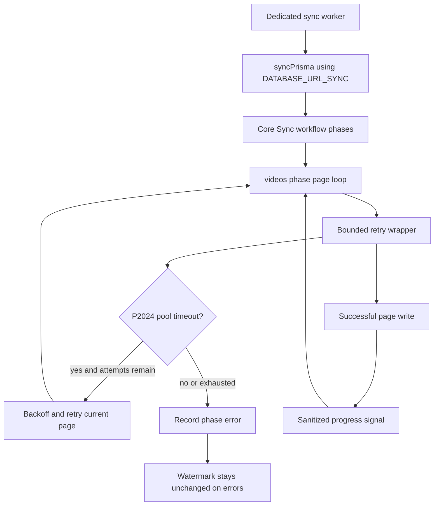
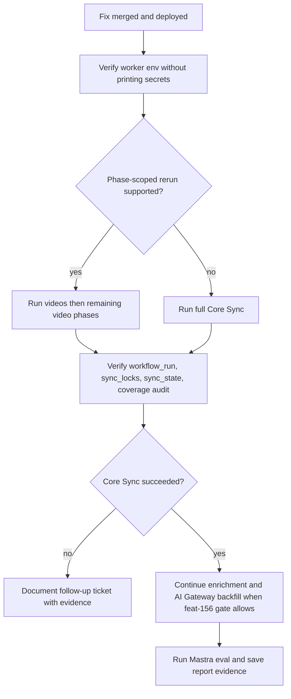

# fix: Harden Admin Core Sync Video Phase Pool Resilience

## Summary

Harden the Admin Core Sync `videos` phase so a full production sync can survive
Prisma pool pressure, expose useful long-run progress, and give operators a
clear pool configuration and rerun path before the AI Gateway content refresh
continues.

---

## Problem Frame

The 2026-06-03/2026-06-04 production Core Sync run failed in the `videos`
workflow step after several hours because Prisma could not acquire a database
connection from a sync pool configured with `connection_limit=2` and
`pool_timeout=10`. The current code already uses a dedicated `syncPrisma`
client, but the documented sync pool budget is still tiny and
`syncVideos` does a large amount of per-page work inside long interactive
transactions. A retry of the same full sync without changing pool budget,
transaction shape, retry behavior, or progress visibility is likely to fail
again under the same pressure.

---

## Assumptions

- Production env inspection, deploy, Core Sync reruns, enrichment, embedding
  backfill, and eval execution require authenticated operator access. The code
  and docs plan will prepare those actions and define their evidence, but the
  implementation phase must report any unavailable production access instead of
  marking those steps as locally verified.
- `feat-156` is still `in-progress` and blocks the downstream embedding/eval
  refresh path. This fix can still ship the Core Sync resilience work now, but
  the all-content AI Gateway backfill remains gated by the existing
  `feat-156` eval criteria.
- Admin currently uses Prisma 6.x, where `connection_limit` and `pool_timeout`
  are URL parameters. Official Prisma docs describe `P2024` as the pool acquire
  timeout emitted after a queued query waits longer than `pool_timeout`.

---

## Requirements

**Pool and Worker Posture**

- R1. The Admin worker uses a dedicated `DATABASE_URL_SYNC` pool for Core Sync
  when available, and documentation no longer recommends the failed two-slot,
  ten-second production posture.
- R2. The recommended sync pool budget is explicit, conservative, and reasoned
  from total production database capacity rather than blindly maximizing
  `connection_limit`.
- R3. Any pool diagnostics or run notes must not print raw database URLs,
  tokens, Core API credentials, Railway variables, gateway keys, or bearers.

**Videos Phase Resilience**

- R4. `syncVideos` retries only safe transient Prisma pool-acquire failures,
  including `P2024`, with bounded backoff around batch/page write boundaries.
- R5. Non-pool data errors, parse errors, missing Core references, auth
  failures, and malformed input remain visible as phase errors and are not
  converted into success.
- R6. The `videos` phase reduces avoidable long transaction work and repeated
  lookup queries while preserving Core-sourced overwrite boundaries,
  `MANAGER` row protection, watermark behavior, and full-sync soft-delete
  semantics.

**Progress and Operations**

- R7. Long `videos` runs emit sanitized progress for page/batch movement so
  operators can distinguish slow progress from a stuck step.
- R8. Focused tests cover pool-timeout classification, retry exhaustion,
  non-retryable error behavior, and video-phase progress or write-shape
  changes.
- R9. The production runbook documents the safe deployment, narrow rerun,
  coverage audit, AI Gateway backfill, and eval report sequence without
  committing secrets or raw production payloads.

---

## Key Technical Decisions

- KTD1. **Raise and document the sync pool budget instead of sharing the main
  pool:** Core Sync should keep using `DATABASE_URL_SYNC`, but production docs
  should move away from `connection_limit=2`. A modest dedicated pool with a
  longer acquire timeout gives the worker room for its transaction, lock
  heartbeat, progress writes, and post-phase maintenance without making web/API
  traffic compete for the same tiny pool.
- KTD2. **Retry at page and maintenance write boundaries:** The safe retry unit
  is the current page or idempotent maintenance write. `syncVideos` already
  uses upserts, relation replacement, and full-sync presence tracking; retrying
  a failed page write is safer and cheaper than retrying the whole workflow
  step after hours of progress.
- KTD3. **Classify Prisma pool failures by typed shape first:** Match Prisma
  client errors through `code === "P2024"` and use message matching only as a
  narrow fallback. This follows the repo's typed-error discipline and avoids
  treating arbitrary timeout-looking data errors as retryable pool pressure.
- KTD4. **Shorten transactions before adding more concurrency:** The current
  `videos` implementation is mostly sequential, so the main issue is not
  broad `Promise.all` fan-out. The safer local improvement is to move repeated
  lookup reads out of per-page transactions where possible and keep transaction
  scope focused on writes.
- KTD5. **Make progress visible with sanitized operational signals:** Progress
  should include phase, page offset or completed count, updated count, retry
  attempt, and elapsed time. It must avoid row payloads, Core tokens, DB URLs,
  and raw query values.

---

## High-Level Technical Design

---

## Implementation Units

### U1. Roadmap State and Production Pool Documentation

**Goal:** Mark the ticket as actively owned and update operator docs so the
failed production sync pool posture is no longer the recommended setup.

**Requirements:** R1, R2, R3, R9

**Dependencies:** None

**Files:**

- Modify: `docs/roadmap/platform/feat-157-admin-core-sync-video-phase-pool-resilience.md`
- Modify: `apps/admin/.env.example`
- Modify: `apps/admin/src/config/env.ts`
- Modify: `apps/admin/src/db/client.ts`
- Modify: `apps/admin/docs/core-sync-recurring-job.md`
- Test expectation: none -- documentation and comments only unless the
  implementation adds parseable pool diagnostics.

**Approach:** Keep `DATABASE_URL_SYNC` optional for local compatibility, but
make production guidance explicit: the dedicated worker should set a separate
sync URL with a larger pool and longer acquire timeout than the failed
`connection_limit=2&pool_timeout=10` posture. The exact production value must
be verified against Railway/Postgres capacity during rollout; the docs should
give a conservative starting budget and the capacity math operators need to
adjust it safely.

**Patterns to follow:** `apps/admin/docs/core-sync-recurring-job.md` required
env style; `docs/solutions/developer-experience/admin-prod-video-snapshot-local-restore-20260521.md`
for warnings about Prisma URL params versus libpq URLs.

**Test scenarios:** Test expectation: none -- no runtime behavior if docs and
comments are the only changes.

**Verification:** The roadmap ticket is `in-progress`; docs recommend a
dedicated sync pool with a longer timeout and explain how to verify parameters
without exposing full URLs or secrets.

### U2. Prisma Pool Timeout Retry Helper

**Goal:** Add a focused retry/backoff utility for safe Core Sync writes that
encounter Prisma pool-acquire timeouts.

**Requirements:** R4, R5, R8

**Dependencies:** U1

**Files:**

- Create: `apps/admin/src/services/core-sync/pool-timeout-retry.ts`
- Create: `apps/admin/src/services/core-sync/pool-timeout-retry.test.ts`

**Approach:** Introduce a small helper that detects retryable pool pressure
from Prisma's typed `P2024` error shape, retries with bounded exponential or
linear backoff, and rethrows on exhaustion. Keep the helper free of phase
knowledge so it can wrap only operations whose caller has determined the retry
is safe. Logs should be sanitized and include operation label plus attempt
count, not SQL text or connection strings.

**Patterns to follow:** Typed error classification guidance in
`docs/solutions/best-practices/mocked-shape-vs-real-contract-discipline-20260506.md`;
retry-boundary guidance in
`docs/solutions/platform/admin-manager-enrichment-trigger-endpoint-20260506.md`.

**Test scenarios:**

- A typed Prisma-shaped error with `code: "P2024"` retries until the operation
  succeeds and returns the successful value.
- Exhausted `P2024` retries rethrow the final error after the expected number
  of attempts.
- A non-`P2024` error does not retry and is rethrown immediately.
- The retry delay path can be tested without making the suite wait in real
  time.

**Verification:** Focused tests prove typed pool-timeout retry behavior and
non-retryable errors remain non-retryable.

### U3. Videos Phase Transaction and Retry Boundaries

**Goal:** Apply the retry helper to safe `syncVideos` batch boundaries and
remove avoidable per-page transaction work.

**Requirements:** R4, R5, R6, R8

**Dependencies:** U2

**Files:**

- Modify: `apps/admin/src/services/core-sync/phases/sync-videos.ts`
- Modify: `apps/admin/src/services/core-sync/phases/sync-videos.test.ts`

**Approach:** Wrap the full-sync Bible book upsert, each page transaction,
and the final full-sync soft-delete update in the pool retry helper. Keep
page processing sequential. Move repeated keyword and Bible-book lookup reads
outside the per-page transaction or collapse them to one page-level read so
the transaction holds its connection for less time. Preserve manager-owned row
skips, localized metadata writes, relation replacement, citation staling,
keyword links, child relations, and full-sync presence tracking.

**Patterns to follow:** Bulk-upsert and full-sync presence rules in
`docs/solutions/performance-issues/admin-core-sync-high-volume-root-phase-bulk-upsert-20260507.md`;
current `sync-dubs` and `sync-dub-downloads` high-volume phase posture for
page-oriented writes.

**Test scenarios:**

- A page transaction that fails once with `P2024` is retried and the final
  stats count the page as updated once.
- A page transaction whose `P2024` retries exhaust increments phase errors and
  continues to the next Core page without advancing the watermark indirectly.
- A non-pool transaction error increments errors without retrying.
- Manager-owned videos remain skipped after the lookup-shape change.
- Keyword and child relation rows still bulk insert after the lookup-shape
  change.

**Verification:** The existing nested Core video entity test still passes, and
new tests cover retry and lookup-shape behavior.

### U4. Videos Phase Progress Visibility

**Goal:** Emit useful, sanitized progress for long `videos` runs so operators
can see movement before the phase finishes.

**Requirements:** R3, R7, R8

**Dependencies:** U3

**Files:**

- Modify: `apps/admin/src/services/core-sync/orchestrator.ts`
- Modify: `apps/admin/src/services/core-sync/phases/sync-videos.ts`
- Modify: `apps/admin/src/services/core-sync/orchestrator.test.ts`
- Modify as needed: `apps/admin/src/services/workflow-run-log.service.ts`
- Modify as needed: `apps/admin/src/services/workflow-run-log.service.test.ts`

**Approach:** Persist throttled phase progress into `workflow_run.details`
when the dispatched workflow has a ledger run id, and supplement it with
sanitized progress logs. The progress path should use the normal admin Prisma
client or another non-sync-pool route so page writes never wait on progress
updates from the same saturated sync pool. Direct CLI/local runs without a
ledger id can log progress only. Progress updates must be fire-and-forget,
throttled, and safe to drop if the ledger update fails.

**Patterns to follow:** Plain-string operational logging rule in
`docs/solutions/runtime-errors/railway-logsv2-silences-nextjs-stdout-runtime-20260518.md`;
current dashboard workflow summary shape in
`apps/admin/src/app/dashboard/ops-data.ts`.

**Test scenarios:**

- The progress reporter receives increments from a successful `videos` page
  and emits a sanitized progress signal.
- Progress signaling does not throw through `syncVideos` when the progress
  sink fails.
- If `workflow_run.details` is updated, repeated progress updates merge
  current phase progress without dropping the original queued run details.

**Verification:** Focused tests cover the selected progress path; docs explain
where operators should look during a long `videos` phase.

### U5. Focused Validation and Production Handoff

**Goal:** Validate the local fix and prepare the production rerun and content
refresh evidence path.

**Requirements:** R8, R9

**Dependencies:** U1, U2, U3, U4

**Files:**

- Modify: `apps/admin/docs/core-sync-recurring-job.md`
- Modify as needed: `docs/roadmap/platform/feat-157-admin-core-sync-video-phase-pool-resilience.md`
- Create if production remains inaccessible:
  `docs/roadmap/platform/feat-NNN-admin-core-sync-production-rerun-evidence.md`

**Approach:** Run focused Admin tests and typechecking for the touched Core
Sync surface. If authenticated production access is available, verify the
deployed worker env shape without printing secrets, trigger the narrowest safe
Core Sync scope, confirm fresh video-phase watermarks and coverage audit, and
continue the ticket's enrichment/backfill/eval sequence when the `feat-156`
gate permits it. If production access is unavailable in this session, leave
the ticket in progress and document the remaining production verification as a
follow-up instead of marking completion.

**Patterns to follow:** Roadmap completion rules in `AGENTS.md`;
AI Gateway gate/report conventions in
`docs/roadmap/content-discovery/feat-156-mastra-ai-gateway-content-embeddings.md`.

**Test scenarios:** Test expectation: none -- this unit consumes the focused
test suites from U2 through U4 and handles operational evidence.

**Verification:** Focused local validation is green. Production verification
is either completed with sanitized evidence or explicitly left as remaining
operator work with a follow-up roadmap ticket.

---

## Scope Boundaries

- This plan does not change Admin pgvector dimensions, AI Gateway vector
  contracts, Mastra provider behavior, or live search query embedding ownership.
- This plan does not bypass `SyncLock`, phase watermarks, Core-sourced
  overwrite rules, `MANAGER` source protection, or the existing coverage audit.
- This plan does not introduce PgBouncer or a database infrastructure
  migration. If production capacity analysis shows an external pooler is
  required, create a separate platform ticket.
- This plan does not mark the roadmap ticket complete unless production Core
  Sync and the downstream evidence path are actually verified.

### Deferred to Follow-Up Work

- A first-class `CoreSyncPhaseProgress` table or dashboard component if
  throttled workflow-run detail updates are too risky for this fix.
- A broader rewrite of `syncVideos` into raw bulk upsert for every localized
  metadata and citation write. This fix may reduce transaction scope, but a
  full bulk rewrite should be measured and reviewed separately.
- Database pooler adoption if Railway/Postgres capacity cannot support the
  dedicated sync and web pools with headroom.

---

## Risks & Dependencies

- The production database has finite connection capacity. Raising the sync
  pool without accounting for web replicas, workflow runtime storage, and
  operator sessions can move the failure from `P2024` to database-level
  connection exhaustion.
- Retrying the wrong operation could hide real data issues. Keep retries
  limited to typed pool-acquire failures at idempotent page or maintenance
  boundaries.
- Progress persistence can itself create pool pressure if it uses the same
  two-slot sync pool during a long transaction. Prefer sanitized logs first
  and only persist progress through a non-blocking, throttled path.
- The downstream content refresh depends on `feat-156` eval gates and
  operator credentials. Code can ship before that path completes, but the
  roadmap ticket should reflect the true operational state.

---

## Sources & Research

- `docs/roadmap/platform/feat-157-admin-core-sync-video-phase-pool-resilience.md`
- `apps/admin/src/db/client.ts`
- `apps/admin/src/services/core-sync/orchestrator.ts`
- `apps/admin/src/services/core-sync/phases/sync-videos.ts`
- `apps/admin/src/services/core-sync/video-localized-metadata.ts`
- `apps/admin/src/services/core-sync/phases/sync-videos.test.ts`
- `apps/admin/docs/core-sync-recurring-job.md`
- `docs/solutions/performance-issues/admin-core-sync-high-volume-root-phase-bulk-upsert-20260507.md`
- `docs/solutions/best-practices/mocked-shape-vs-real-contract-discipline-20260506.md`
- Official Prisma connection pool docs:
  `https://www.prisma.io/docs/orm/v6/prisma-client/setup-and-configuration/databases-connections/connection-pool`
