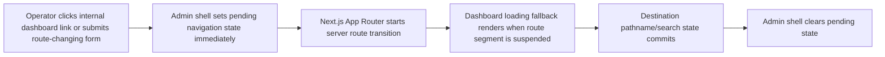

# feat: Admin loading feedback and slow route UX

## Summary

Add a shared admin navigation-pending layer, page-shaped loading fallbacks, and
targeted videos/languages route improvements so slow server-rendered dashboard
transitions feel acknowledged and intentional.

---

## Problem Frame

The origin document describes an operator trust problem: slow admin routes can
leave the old screen visually still after a click, making it unclear whether the
action registered.

---

## Requirements

- R1. Internal admin navigation shows immediate feedback after route-changing
  clicks or submissions.
- R2. Pending feedback preserves the current dashboard shell and existing
  context.
- R3. Pending feedback clears after destination pathname or query state is
  rendered.
- R4. Loading fallbacks use Forge Editorial visual grammar.
- R5. `/dashboard/videos` has a video-library-shaped loading fallback.
- R6. `/dashboard/languages` has a language-diagnostics-shaped loading
  fallback.
- R7. Priority-route performance improvements are targeted to confirmed heavy
  work and preserve existing behavior.
- R8. Loading states are accessible through status semantics or live
  announcements.
- R9. No Prisma, Pothos, GraphQL SDL, generated client, auth/session, or public
  app contract changes unless a measured bottleneck requires it.
- R10. Tests and browser proof cover visible route feedback and priority
  loading surfaces.

**Origin actors:** A1 Admin operator, A2 Implementing agent
**Origin flows:** F1 Navigation click feedback, F2 Slow page load fallback, F3
Performance follow-through
**Origin acceptance examples:** AE1, AE2, AE3, AE4

---

## Scope Boundaries

- Do not redesign the admin navigation, dashboard layout system, or token
  palette.
- Do not build new video creation, editing, language editing, or bulk action
  workflows.
- Do not add saved views, advanced search syntax, or broad dashboard
  performance rewrites.
- Do not change Prisma, Pothos, GraphQL generated outputs, auth/session
  semantics, or public app contracts.
- Do not attempt to solve every admin route's data-loading cost in this PR.

### Deferred to Follow-Up Work

- Deeper backend route decomposition or new data contracts for videos/languages
  should be filed separately if browser or profiling evidence shows the first
  slice cannot make the wait acceptable.
- Full admin performance instrumentation, route timing dashboards, and
  production RUM are outside this PR-sized UX fix.

---

## Context & Research

### Relevant Code and Patterns

- `apps/admin/src/components/admin-shell.tsx` is a client component that owns
  the persistent shell, sidebar, command palette, and content wrapper. It can
  provide cross-route navigation feedback without touching every page.
- `apps/admin/src/app/dashboard/layout.tsx` keeps the shell persistent and
  renders route children inside it after `requireSession`.
- `apps/admin/src/app/dashboard/videos/page.tsx` renders server-owned video
  library content, row links, visitor links, and pagination links.
- `apps/admin/src/app/dashboard/videos/video-library-toolbar.tsx` already uses
  local pending state for filter submissions, which this plan should preserve
  and complement rather than replace.
- `apps/admin/src/app/dashboard/languages/page.tsx` blocks on
  `loadLanguagesData()` before rendering metrics, diagnostics, and locale
  signals.
- `apps/admin/src/app/dashboard/ops-data.ts` loads a complete active language
  diagnostic dataset with relation counts/previews.
- `apps/admin/src/app/dashboard/live-data.ts` loads video library totals,
  language options, collection summaries, rows, and visitor URLs.
- `apps/admin/src/components/admin-ui.tsx` contains the shared token grammar,
  cards, tables, status pills, and button primitives to mirror in loading UI.
- `apps/admin/src/components/admin-shell.test.tsx`,
  `apps/admin/src/app/dashboard/dashboard-ui.test.tsx`, and
  `apps/admin/src/app/dashboard/languages/language-diagnostics.test.tsx`
  provide focused test surfaces for this work.

### Institutional Learnings

- `docs/roadmap/platform/feat-153-admin-interaction-affordance-polish.md`
  established the rule that admin controls must communicate clickability and
  disabled state clearly.
- `docs/plans/2026-06-01-001-fix-admin-interaction-affordances-plan.md`
  documents the prior affordance pass and the need to keep disabled or
  unavailable controls visually honest.
- `docs/plans/2026-06-02-003-feat-admin-language-diagnostics-plan.md`
  explains why the languages page intentionally hydrates the active language
  corpus for diagnostics.
- `docs/plans/2026-06-03-001-feat-admin-video-library-controls-plan.md`
  documents the existing video toolbar pending state and URL-backed filters.

### External References

- External research skipped. The repo already uses Next.js App Router,
  server-rendered dashboard pages, client shell components, and local pending
  UI patterns sufficient for this slice.

---

## Key Technical Decisions

- Put the first feedback layer in the persistent admin shell: this catches
  sidebar, command-palette, pagination, and row-link navigation without a
  route-by-route retrofit.
- Detect internal dashboard links and route-changing form submissions at the
  shell boundary, then clear pending state on pathname or search-param changes.
  This is broad enough for current admin navigation while avoiding external
  links, downloads, modified-click new tabs, and disabled controls.
- Add route-level `loading.tsx` fallbacks so the content area can switch to
  purposeful loading UI while server routes resolve.
- Keep videos' existing toolbar pending feedback in place. The shared shell
  indicator complements it for route-level navigation and links.
- Treat performance work as opportunistic and evidence-driven inside the first
  PR: apply narrow improvements that preserve existing behavior, and defer any
  deeper data-contract change.

---

## Open Questions

### Resolved During Planning

- Should the first slice prioritize feedback or speed? The user selected the
  staged option: both, with immediate feedback first and targeted performance
  follow-through.
- Should this be videos-only? No. Videos and languages are proof points, but
  the click acknowledgement belongs to the shared admin shell.
- Should this change GraphQL or Prisma contracts? No known need in the current
  plan; keep performance improvements inside existing contracts.

### Deferred to Implementation

- Exact loading skeleton component boundaries can be tuned once the route files
  are edited.
- Exact performance improvement should be selected after re-reading the current
  loader code and choosing the safest behavior-preserving change.
- Exact local browser driver depends on the available Codex/Helium surface in
  this environment.

---

## High-Level Technical Design

> _This illustrates the intended approach and is directional guidance for
> review, not implementation specification. The implementing agent should treat
> it as context, not code to reproduce._

---

## Implementation Units

### U1. Shared Admin Navigation Feedback

**Goal:** Add shell-level pending feedback for internal admin navigation and
route-changing submissions.

**Requirements:** R1, R2, R3, R8

**Dependencies:** None

**Files:**

- Modify: `apps/admin/src/components/admin-shell.tsx`
- Test: `apps/admin/src/components/admin-shell.test.tsx`

**Approach:**

- Add a compact route-pending indicator to the existing sticky header or main
  content boundary using current admin tokens.
- Detect same-origin internal dashboard anchors in a shell-level event listener
  and ignore external links, new-tab modifier clicks, downloads, disabled
  controls, and current-URL no-ops.
- Detect route-changing form submissions that target internal dashboard paths.
- Clear pending state whenever the committed pathname or search params change,
  with a defensive timeout so stale feedback cannot linger forever after a
  same-URL or interrupted transition.
- Include accessible status semantics or a live region without making the
  indicator noisy.

**Patterns to follow:**

- `apps/admin/src/components/admin-shell.tsx` for shell state and mobile nav
  interaction patterns.
- `apps/admin/src/app/dashboard/videos/video-library-toolbar.tsx` for concise
  pending status treatment.

**Test scenarios:**

- Happy path: rendering the shell includes an accessible navigation loading
  status surface that is initially inactive.
- Happy path: a sidebar or command-palette internal dashboard link can activate
  pending feedback.
- Edge case: external links or new-tab modifier clicks do not activate pending
  feedback.
- Edge case: pending feedback clears when pathname or search params change.

**Verification:**

- Shell tests prove the indicator is accessible and route-state driven without
  changing existing navigation rendering.

---

### U2. Dashboard And Route-Shaped Loading Fallbacks

**Goal:** Add App Router loading fallbacks that keep the admin shell stable and
show page-shaped skeletons for slow dashboard routes.

**Requirements:** R2, R4, R5, R6, R8

**Dependencies:** U1

**Files:**

- Create: `apps/admin/src/app/dashboard/loading.tsx`
- Create: `apps/admin/src/app/dashboard/videos/loading.tsx`
- Create: `apps/admin/src/app/dashboard/languages/loading.tsx`
- Modify as needed: `apps/admin/src/components/admin-ui.tsx`
- Test: `apps/admin/src/app/dashboard/dashboard-ui.test.tsx`

**Approach:**

- Create a general dashboard fallback for routes without bespoke loading UI.
- Create a video-library-shaped skeleton that mirrors the header, toolbar, list
  rows, coverage column, and pagination density.
- Create a language-diagnostics-shaped skeleton that mirrors metrics,
  diagnostics, insights, and operator rail structure.
- Reuse existing admin card, hairline, mono-label, and muted text styles rather
  than adding decorative loaders.

**Patterns to follow:**

- `apps/admin/src/app/dashboard/videos/page.tsx` for video page composition.
- `apps/admin/src/app/dashboard/languages/page.tsx` for language page
  composition.
- `apps/admin/src/components/admin-ui.tsx` for shared page/card grammar.

**Test scenarios:**

- Happy path: dashboard loading fallback renders a visible status and stable
  skeleton structure.
- Happy path: videos loading fallback renders video-library-shaped placeholder
  rows.
- Happy path: languages loading fallback renders language-diagnostics-shaped
  placeholder sections.
- Accessibility: loading fallbacks expose a status label that screen readers can
  announce.

**Verification:**

- Route loading components are covered by focused render tests and visually
  match the final page hierarchy closely enough for no-jump perception.

---

### U3. Targeted Videos And Languages Load Improvements

**Goal:** Apply behavior-preserving route-load improvements where the current
loaders show safe confirmed waste.

**Requirements:** R7, R9

**Dependencies:** U1, U2

**Files:**

- Modify: `apps/admin/src/app/dashboard/live-data.ts`
- Modify as needed: `apps/admin/src/app/dashboard/ops-data.ts`
- Test: `apps/admin/src/app/dashboard/dashboard-ui.test.tsx`
- Test as needed: `apps/admin/src/app/dashboard/languages/language-diagnostics.test.tsx`

**Approach:**

- Re-read the video loader and remove or defer unnecessary work when route
  state does not need it, while keeping totals, rows, language options,
  collection summaries, visitor links, and filters truthful.
- Re-read the language loader for obvious avoidable serial work or repeated
  derivations, while preserving the complete active diagnostics dataset.
- Prefer parallelization, conditional loading, bounded fallbacks, and cheap
  memoization over schema or contract changes.
- If no safe performance change is available without changing behavior, keep U3
  to characterization notes and do not invent a risky rewrite.

**Patterns to follow:**

- Existing `Promise.all` use in `loadVideoLibraryPage` and
  `loadLanguagesData`.
- Existing missing-table fallback behavior in `ops-data.ts` and
  `live-data.ts`.

**Test scenarios:**

- Regression: video page still renders totals, rows, filters, pagination, and
  visitor link states after loader changes.
- Regression: languages diagnostics still renders complete diagnostic rows and
  summary counts after loader changes.
- Edge case: missing-table fallbacks continue to produce controlled empty data
  rather than throwing.

**Verification:**

- The route data behavior remains equivalent under tests, and any performance
  change is explainable from reduced or better-sequenced loader work.

---

### U4. Validation And Browser Smoke Proof

**Goal:** Prove the implemented loading behavior with focused tests and a local
browser smoke pass.

**Requirements:** R10

**Dependencies:** U1, U2, U3

**Files:**

- Modify: `apps/admin/src/app/dashboard/dashboard-ui.test.tsx`
- Modify: `apps/admin/src/components/admin-shell.test.tsx`
- Modify as needed: `apps/admin/docs/worktree-preview-setup.md`

**Approach:**

- Extend existing render tests instead of introducing a new test harness.
- Run admin typecheck and targeted tests for shell, dashboard, videos, and
  languages.
- Start the admin local dev server using the package's worktree preview
  instructions when browser proof is needed.
- Use the available Helium/in-app browser surface to click through dashboard,
  videos, a videos query transition, and languages.

**Patterns to follow:**

- `apps/admin/docs/worktree-preview-setup.md` for local admin server setup.
- Existing `apps/admin/src/app/dashboard/dashboard-ui.test.tsx` test style.

**Test scenarios:**

- Integration: clicking a dashboard navigation link shows visible loading
  feedback during the transition in browser smoke.
- Integration: videos route can load and a filter or pagination action provides
  pending feedback.
- Integration: languages route shows the diagnostics surface and remains
  navigable from the shell.

**Verification:**

- Targeted tests, typecheck, and browser smoke all pass before commit/PR.

---

### U5. Roadmap And Handoff Closure

**Goal:** Keep the roadmap and planning artifacts aligned with the shipped
slice.

**Requirements:** R10

**Dependencies:** U1, U2, U3, U4

**Files:**

- Modify: `docs/roadmap/platform/feat-158-admin-loading-feedback-and-slow-route-ux.md`
- Modify as needed: `docs/plans/2026-06-04-002-feat-admin-loading-feedback-plan.md`

**Approach:**

- Keep the roadmap ticket `in-progress` while implementation and validation are
  underway.
- Mark the roadmap ticket complete only after code, tests, browser proof,
  commit, and PR preparation are done.
- Record any deeper route performance follow-up discovered during U3 as a
  follow-up ticket rather than expanding this PR.

**Patterns to follow:**

- Roadmap format in `CLAUDE.md`.
- Prior platform tickets such as
  `docs/roadmap/platform/feat-153-admin-interaction-affordance-polish.md`.

**Test scenarios:**

- Test expectation: none -- documentation/roadmap state only.

**Verification:**

- Roadmap status reflects the actual implementation state at handoff.

---

## System-Wide Impact

- **Interaction graph:** The persistent admin shell gains awareness of internal
  navigation events; route pages keep owning their data and page-specific
  behavior.
- **Error propagation:** Loading feedback must not swallow navigation errors;
  existing Next.js route error behavior remains unchanged.
- **State lifecycle risks:** Pending state can become stale if a same-URL or
  interrupted transition never commits; U1 includes clear-on-route-change and a
  defensive timeout.
- **API surface parity:** No API, GraphQL, Prisma, or generated client surface
  should change.
- **Integration coverage:** Browser smoke is required because route loading and
  perceived feedback are cross-component behaviors.
- **Unchanged invariants:** Admin auth, permissions, video read-only state,
  language read-only diagnostics, URL-backed video filters, and existing
  disabled-placeholder affordances remain unchanged.

---

## Risks & Dependencies

| Risk                                                                               | Mitigation                                                                                                                           |
| ---------------------------------------------------------------------------------- | ------------------------------------------------------------------------------------------------------------------------------------ |
| Shell-level event detection could show pending feedback for non-navigation clicks. | Restrict detection to same-origin dashboard links/forms and ignore external, modified, download, disabled, and current-URL events.   |
| Loading skeletons could feel like a redesign.                                      | Mirror final page hierarchy and existing admin tokens rather than introducing new decoration.                                        |
| Performance work could accidentally change data semantics.                         | Keep U3 behavior-preserving, covered by existing page/diagnostic tests, and defer deeper data-contract changes.                      |
| Browser smoke may be blocked by local auth or dev database setup.                  | Follow `apps/admin/docs/worktree-preview-setup.md`; if unavailable, report the blocker and keep automated tests as primary evidence. |

---

## Documentation / Operational Notes

- No operator runbook changes are expected.
- Any deeper route performance issue discovered during U3 should become a
  separate roadmap ticket with measured evidence.

---

## Sources & References

- **Origin document:** [docs/brainstorms/2026-06-04-admin-loading-feedback-requirements.md](../brainstorms/2026-06-04-admin-loading-feedback-requirements.md)
- **Roadmap:** [docs/roadmap/platform/feat-158-admin-loading-feedback-and-slow-route-ux.md](../roadmap/platform/feat-158-admin-loading-feedback-and-slow-route-ux.md)
- Related plan: [docs/plans/2026-06-01-001-fix-admin-interaction-affordances-plan.md](2026-06-01-001-fix-admin-interaction-affordances-plan.md)
- Related plan: [docs/plans/2026-06-02-003-feat-admin-language-diagnostics-plan.md](2026-06-02-003-feat-admin-language-diagnostics-plan.md)
- Related plan: [docs/plans/2026-06-03-001-feat-admin-video-library-controls-plan.md](2026-06-03-001-feat-admin-video-library-controls-plan.md)
