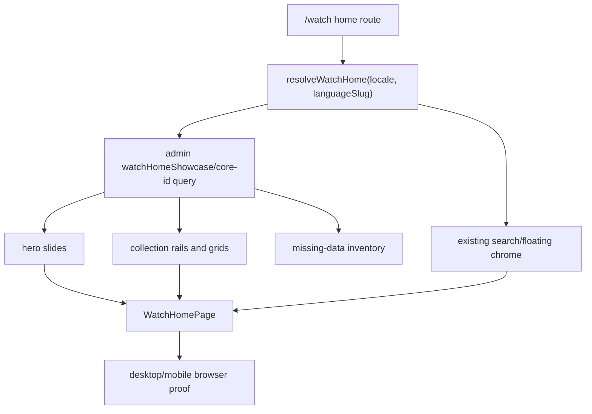

# feat: Reimplement Modern Watch Home

## Summary

Rebuild Forge's `/watch` home as a modern catalog surface that follows the
Jesus Film watch beta/source design while staying in Forge's Tailwind, routing,
and admin GraphQL system. The implementation should preserve the existing
floating search chrome, add an admin-backed home data resolver, render cinematic
hero/rail/grid/promo sections, and document the source-design assets or data
that admin cannot provide yet.

---

## Problem Frame

The current Forge watch home resolves `watchSetting(locale).homepageExperience`
and renders its blocks through `ExperienceSectionRenderer`, which makes home
look like a generic Experience page. The requested beta/reference home is a
catalog-first product surface: search is primary, the first viewport is driven
by featured video media, and the body emphasizes curated collections and mission
positioning.

---

## Assumptions

_This plan was authored in the LFG pipeline without synchronous user
confirmation. These are unvalidated bets to review during implementation and PR
review._

- The attached screenshot is the visual authority for final spacing and content
  priority; this environment did not expose the image as a readable file during
  planning.
- The named `apps/watch-modern` source URL is authoritative input, but its
  current `src/app/page.tsx` on GitHub `main` is a scaffold card rather than the
  catalog beta. The matching catalog source appears in the same `core` repo
  under `apps/watch/src/components/PageMain/**`, so implementation should use
  `watch-modern` for the named source check and `apps/watch` PageMain files for
  concrete home composition until the screenshot proves otherwise.
- A single PR can safely add the admin PUBLIC query widening needed by the home
  resolver plus the Forge web UI. If the schema widening grows beyond a small
  ordered showcase lookup, split it before implementation.
- The first implementation can use a curated static source list equivalent to
  the current Core ids from `collectionShowcaseConfig.ts`; making the list
  editor-managed in admin is follow-up work.

---

## Requirements

- R1. `/watch` renders a modern home page, not the generic configured homepage
  Experience renderer, while preserving static locale route behavior under
  `apps/web/src/app/[locale]/[htmlLang]/**`.
- R2. The home design follows the beta/reference structure: floating search,
  cinematic hero/featured carousel, horizontal and grid catalog sections,
  mission/promo section, and a responsive mobile layout.
- R3. All content data used by the Forge home comes from admin GraphQL through
  `@forge/admin-graphql`/`apps/web/src/lib/admin-client.ts`; no direct Core,
  Algolia, `apps/watch`, MUI, or Swiper runtime imports.
- R4. The source Core ids and labels from the reference design are mapped to
  admin video records when admin has them. Missing records or missing media
  fall back to existing admin data and are recorded for follow-up.
- R5. Public links emitted by hero/cards/grids use the existing language slug
  route builders in `apps/web/src/lib/routes.ts`.
- R6. Desktop and mobile visual smoke must compare the local Forge home against
  the beta/reference screenshot or live beta when the cookie is available.

---

## Scope Boundaries

- Do not migrate the dedicated watch video page, series page, language picker,
  download flow, share modal, question panel, or search overlay beyond home
  integration needs.
- Do not bring over Material UI, Swiper, react-instantsearch, Algolia, or
  `@core/shared` dependencies from the external `core` repo.
- Do not create a new editor-facing home programming model in this PR.
- Do not copy local thumbnail PNGs from `apps/watch/public/images/thumbnails`;
  use admin/Core image fields, Mux thumbnails, or current Forge fallbacks.
- Do not change public URL contracts, proxy rewrite contracts, or message
  catalog locale routing.

### Deferred to Follow-Up Work

- Admin-managed home programming: replace the static source arrays with an
  editor-owned admin model or Experience block configuration.
- Local thumbnail parity: recreate or ingest the watch-local LUMO/Gospel poster
  overrides that exist in `apps/watch/public/images/thumbnails`.
- Mux insert parity: support non-catalog hero insert slides if the beta
  screenshot/live design includes them.
- Beta cookie routing parity: document or wire the exact production beta cookie
  only if it is needed after local visual comparison.
- Analytics parity: port category/card/hero analytics tags after visual and data
  parity is stable.

---

## Context & Research

### Relevant Code and Patterns

- `apps/web/src/app/[locale]/[htmlLang]/page.tsx` currently resolves
  `resolveWatchPage(locale)`, unwraps `homepageExperience`, and maps
  `ExperienceSectionRenderer` over `blocks`.
- `apps/web/src/components/FloatingSearchProvider.tsx`,
  `apps/web/src/components/FloatingSearchBar.tsx`, and
  `apps/web/src/components/SearchOverlay.tsx` already implement the floating
  watch search interaction previously ported from the source app.
- `apps/web/src/lib/content.ts` shows the current admin client pattern,
  `unstable_cache` boundary, JSON serialization for cache-safe results, and
  admin-to-watch normalization style.
- `apps/web/src/lib/fragments/watch-video.ts` is the best local model for
  admin Video fragments that alias `id`, `dubs`, localized rows, parents,
  children, durations, downloads, and Mux playback ids.
- `apps/web/src/components/search/VideoCard.tsx` already handles admin search
  card labels, duration/count pills, Mux thumbnails, and route-builder fallback
  behavior.
- `apps/admin/src/graphql/types/video.ts` exposes public `video`,
  `videoBySlug`, `videoDub`, and broad `videos(limit, offset)` queries, but not
  an ordered Core-id showcase lookup like the source app uses.
- `packages/admin-graphql/src/fragments/watch-experience.ts` and sibling block
  fragments define how web composes generated admin GraphQL operations.

### Institutional Learnings

- `docs/solutions/integration-issues/admin-core-sync-flat-vs-nested-image-query-coverage-gap-20260519.md`
  warns that watch-modern can show richer posters by walking nested Core image
  data while admin can silently diverge. This home work needs explicit image
  fallback and missing-image documentation.
- `docs/solutions/logic-errors/gql-tada-fragment-anchor-cast-drift-same-fragment-multi-query-20260514.md`
  recommends anchoring reusable admin types on fragments instead of query result
  projections when the same shape is spread across multiple queries.
- `docs/solutions/performance-issues/web-watch-route-lighthouse-perf-campaign-lcp-bundle-fonts-20260527.md`
  documents why unused section renderers and heavy player chrome must stay out
  of watch route initial chunks.
- `docs/solutions/integration-issues/mobile-relative-image-url-no-base-origin-20260408.md`
  explains why `/watch/images/**` local paths work inside the app but fail as
  external URLs; do not rely on copied watch-local asset paths as public data.

### External References

- `https://www.jesusfilm.org/watch` - public watch page content observed during
  planning, including current catalog items and mission footer copy.
- `https://github.com/JesusFilm/core/tree/main/apps/watch-modern` - user-named
  source app. Current `main` source is scaffold-like at the root page.
- `https://github.com/JesusFilm/core/tree/main/apps/watch/src/components/PageMain`
  - source home composition matching the catalog layout: `PageMain`,
    `ContainerWithMedia`, `CollectionsRail`, `SectionVideoCarousel`,
    `SectionVideoGrid`, and `SectionPromo`.

---

## Key Technical Decisions

- Build a Forge-native home composition rather than trying to express the
  source home as admin SDUI blocks. The beta home is a product shell, not a
  generic block page, and Forge already has route-specific watch surfaces.
- Add a small admin PUBLIC showcase query instead of issuing many `videoBySlug`
  calls or reading directly from Core. This keeps web's admin-only contract and
  gives tests a single schema boundary to verify.
- Keep the curated source list in code for the first PR. The current reference
  app also hardcodes programming arrays such as `collectionShowcaseSources` and
  `newBelieverCourse`; admin-managed programming is useful but not required for
  visual parity.
- Use Forge Tailwind and existing `cn`, lucide, route, image, and Mux helpers.
  Do not import MUI/Swiper/Algolia or the external shared UI system.
- Treat missing image/data parity as a first-class output. The PR should ship a
  follow-up markdown inventory rather than hiding fallbacks in code comments.

---

## Open Questions

### Resolved During Planning

- Can the current named `watch-modern` root page be copied directly? No. It is a
  scaffold page on `main`, so implementation must use the source repo for
  verification but use `apps/watch` PageMain files as the concrete catalog prior
  art unless the provided screenshot contradicts that.
- Can Forge use current admin GraphQL without schema changes? Not cleanly.
  Admin lacks a public ordered Core-id/collection showcase lookup; adding one is
  more maintainable than hardcoding local data or making many one-off queries.
- Should the existing floating search be replaced? No. It already matches the
  watch-modern search direction and has local tests. The home should integrate
  with it rather than rebuild it.

### Deferred to Implementation

- Exact beta cookie name/value: only needed if local visual proof can access the
  live beta. Otherwise the screenshot plus source components are sufficient.
- Exact list of missing admin records/images: generate from the implemented
  source arrays against local/restored admin data and record concrete misses.
- Whether the hero uses muted video playback for every slide or poster-first
  playback only when `muxVideo.playbackId` is available: decide after inspecting
  actual admin payload size and local browser performance.

---

## High-Level Technical Design

> _This illustrates the intended approach and is directional guidance for
> review, not implementation specification. The implementing agent should treat
> it as context, not code to reproduce._

---

## Implementation Units

### U1. Roadmap and Admin Showcase Query

**Goal:** Track the work in the roadmap and add the minimal admin GraphQL
surface needed to fetch ordered home source videos by Core id.

**Requirements:** R3, R4

**Dependencies:** None

**Files:**

- Create: `docs/roadmap/platform/feat-159-watch-home-modernization.md`
- Modify: `apps/admin/src/graphql/types/video.ts`
- Modify: `apps/admin/src/services/video.service.ts`
- Modify: `apps/admin/src/graphql/schema.test.ts`
- Modify: `apps/admin/src/graphql/public-resolvers.regression.test.ts`
- Modify: `apps/admin/schema.graphql`
- Modify: `packages/admin-graphql/src/admin-graphql-env.d.ts`

**Approach:**

- Add a PUBLIC query named `watchHomeVideos(coreIds: [String!]!): [Video!]!`.
  Bound input count to 100 ids and preserve caller ordering so source arrays map
  predictably to rails and grids.
- Return admin `Video` objects so existing `Video` relations, locale narrowing,
  images, dubs, children, and duration field resolvers stay reusable.
- Omit unknown Core ids from the returned list. The web resolver compares the
  requested ids with returned `coreId` values and records missing records in the
  follow-up inventory.
- Keep manager-only `videosByCoreIds` untouched because it returns a different
  dispatch projection and has a different auth contract.
- Regenerate the admin SDL and admin GraphQL package outputs in the same PR.

**Patterns to follow:**

- `apps/admin/src/graphql/types/video.ts` public `videoBySlug` and `videos`
  resolver shape.
- `apps/admin/src/graphql/schema.test.ts` public schema assertions.
- `apps/admin/src/graphql/public-resolvers.regression.test.ts` resolver allow
  list.

**Test scenarios:**

- Happy path: a query with two known Core ids returns two `Video` records in the
  same order with public-safe fields.
- Edge case: duplicate ids preserve duplicate caller positions so section config
  behavior remains transparent.
- Edge case: more than the max allowed ids returns a typed GraphQL error rather
  than an unbounded database query.
- Error path: unknown ids are omitted from the returned `Video` list and
  surfaced by the web resolver's missing-data inventory.
- Integration: PUBLIC auth can call the new query, and the generated SDL/package
  include the new field.

**Verification:**

- Admin tests prove the query's visibility, ordering, bounds, and SDL output.

### U2. Watch Home Data Resolver

**Goal:** Add a server-side Forge web resolver that maps admin showcase data
into home hero, rail, grid, and gap-report view models.

**Requirements:** R3, R4, R5

**Dependencies:** U1

**Files:**

- Create: `apps/web/src/lib/fragments/watch-home.ts`
- Create: `apps/web/src/lib/watch-home-config.ts`
- Create: `apps/web/src/lib/watch-home.ts`
- Create: `apps/web/src/lib/__tests__/watch-home.test.ts`
- Modify: `apps/web/src/lib/fragments/index.ts`

**Approach:**

- Port source arrays from `collectionShowcaseConfig.ts` into a Forge config
  module with explicit section ids, titles, descriptions, source Core ids,
  orientation, and child limits.
- Define admin GraphQL fragments/operations in the local fragments area,
  following the `watch-video.ts` aliasing and normalization style.
- Normalize records into plain JSON view models: card title, slug, label,
  count/duration pill, poster URL, Mux playback id, route href, source id, and
  missing-data flags.
- Use `unstable_cache` with a small revalidate window consistent with
  `resolveWatchPage`; keep query variables bounded by locale/language slug and
  static source config.
- Route hrefs through `localizedHomePath`, `watchVideoPath`,
  `watchEpisodePath`, or `videosIndexPath` as appropriate.

**Patterns to follow:**

- `apps/web/src/lib/content.ts` for cache/normalization/error posture.
- `apps/web/src/lib/fragments/watch-video.ts` for admin Video projection.
- `apps/web/src/lib/routes.ts` for public URL construction.

**Test scenarios:**

- Happy path: a complete admin payload produces a hero list and all configured
  sections with stable card order.
- Happy path: a collection source with `limitChildren: 0` renders the collection
  itself, while a positive child limit renders child cards.
- Edge case: a missing admin record is excluded from visual sections and appears
  in the missing-data inventory with its source id and section id.
- Edge case: a card with no admin image uses a Mux thumbnail when playback id is
  available, otherwise uses a styled placeholder and records an image gap.
- Edge case: labels/counts choose duration for singular videos and child counts
  for series/collections.
- Integration: generated hrefs use English language slug defaults for home
  source cards and do not emit internal locale keys like `en.html`.

**Verification:**

- Web resolver tests prove section mapping, fallback behavior, and URL safety.

### U3. Forge-Native Watch Home Components

**Goal:** Render the modern hero, carousel/rail, grid, cards, and promo section
with Forge Tailwind/design primitives.

**Requirements:** R1, R2, R4, R5

**Dependencies:** U2

**Files:**

- Create: `apps/web/src/components/home/WatchHomePage.tsx`
- Create: `apps/web/src/components/home/WatchHomeHero.tsx`
- Create: `apps/web/src/components/home/WatchHomeSection.tsx`
- Create: `apps/web/src/components/home/WatchHomeCard.tsx`
- Create: `apps/web/src/components/home/WatchHomePromo.tsx`
- Create: `apps/web/src/components/home/__tests__/WatchHomePage.test.tsx`
- Modify: `apps/web/src/app/[locale]/[htmlLang]/page.tsx`
- Modify: `apps/web/src/app/[locale]/[htmlLang]/loading.tsx`

**Approach:**

- Replace the home route's generic block loop with the new `resolveWatchHome`
  result and `WatchHomePage` composition. Keep error/empty behavior for admin
  failures.
- Preserve `FloatingSearchProvider` in the layout; ensure the hero first
  viewport leaves room for the existing floating search bar and top-left logo.
- Implement mobile-first layout: poster/hero copy stacks cleanly, horizontal
  rails scroll with snap/overflow, grids collapse to one or two columns, and
  text never overlays controls illegibly.
- Use existing `Image`, `MuxVideo` subpath import only if needed, `cn`, lucide
  icons, and existing UI button/card conventions. Keep cards at or below 8px
  radius unless matching existing watch-card patterns requires otherwise.
- Add `data-testid` hooks for hero, sections, and missing-data-safe fallbacks.

**Patterns to follow:**

- `apps/web/src/components/search/VideoCard.tsx` for admin-backed video card
  pill logic and Mux thumbnail fallback.
- `apps/web/src/components/sections/VideoHero.tsx` and
  `apps/web/src/components/watch/HeroPlayer.tsx` for Mux poster/playback
  posture.
- `apps/web/src/components/ui/button.tsx` and `apps/web/src/lib/utils.ts` for
  local UI primitives.

**Test scenarios:**

- Happy path: the page renders a hero, configured sections, promo content, and
  card links from the resolver view model.
- Happy path: clicking or focusing hero/card links exposes valid hrefs and
  accessible labels.
- Edge case: empty sections are omitted without leaving large blank bands.
- Edge case: cards with placeholder art still render title, label, and href.
- Mobile: class/layout assertions or browser proof show the hero, rails, and
  grids fit a narrow viewport without text overlap.

**Verification:**

- Component tests prove structural rendering; browser proof verifies visual
  layout and interaction in real CSS.

### U4. Missing Data Inventory

**Goal:** Produce a durable follow-up list for every source-design item that
cannot be represented from admin in this PR.

**Requirements:** R4, R6

**Dependencies:** U2, U3

**Files:**

- Create: `docs/follow-ups/watch-home-modernization-missing-data.md`
- Modify: `apps/web/src/lib/watch-home.ts`
- Modify: `apps/web/src/lib/__tests__/watch-home.test.ts`

**Approach:**

- Generate the inventory from the resolver's missing-data flags where possible,
  then add manual source-analysis notes for data that is not visible in admin at
  all, such as local thumbnail overrides and Mux insert slides.
- Include source id, section id, source reference, current Forge fallback, and
  proposed owner/follow-up shape.
- Keep the inventory as a docs artifact, not a runtime banner.

**Patterns to follow:**

- `docs/solutions/integration-issues/admin-core-sync-flat-vs-nested-image-query-coverage-gap-20260519.md`
  for image-divergence framing.

**Test scenarios:**

- Happy path: resolver exposes missing records/images in a deterministic shape.
- Edge case: no missing items produces an empty inventory array and does not
  alter visible page rendering.

**Verification:**

- Follow-up doc lists concrete missing assets/data after local admin smoke.

### U5. Validation and Visual Proof

**Goal:** Verify admin schema, web behavior, and desktop/mobile visual parity
against the reference design.

**Requirements:** R1, R2, R3, R5, R6

**Dependencies:** U1, U2, U3, U4

**Files:**

- Modify: `docs/plans/2026-06-04-003-feat-watch-home-modernization-plan.md`
  only if implementation discovery requires plan clarification.
- Create screenshots under an ignored or existing proof output directory if the
  repo already has one for browser captures.

**Approach:**

- Run targeted admin and web tests first, then typecheck/lint for touched
  packages.
- Start the local web app with the repo's existing local-dev workflow and use
  Helium browser for desktop and mobile smoke. If Helium is unavailable in this
  environment, use the available in-app browser surface and state the fallback.
- Compare against the attached screenshot first. If the beta cookie name/value
  is discoverable, also open live `https://www.jesusfilm.org/watch` with that
  cookie for a second reference.
- Check key visual contracts: first viewport signal, floating search clearance,
  hero media/copy balance, rail/grid spacing, card image fallback quality,
  mobile width, and footer/promo continuity.

**Patterns to follow:**

- `docs/solutions/developer-experience/measurement-driven-layout-iteration-chrome-mcp-20260505.md`
  for screenshot-driven iteration.
- `apps/web/src/components/__tests__/FloatingSearchProvider.test.tsx` for
  existing search/header chrome assertions.

**Test scenarios:**

- Integration: local `/watch` renders with admin-backed data and no generic
  homepage empty state.
- Integration: desktop screenshot shows hero/search/sections without overlap.
- Integration: mobile screenshot shows usable hero, horizontal rails, and grid
  sections without horizontal overflow.
- Error path: temporarily missing configured source data still renders the page
  with documented fallbacks.

**Verification:**

- Targeted tests, typecheck/lint, and browser screenshots pass or any blocker is
  recorded with exact failing command and screenshot path.

---

## System-Wide Impact

- **Interaction graph:** `/watch` home route calls a new web resolver, which
  calls a new admin PUBLIC query. Floating search remains layout-mounted.
- **Error propagation:** Admin query errors should use the current home
  `ExperienceError`/fallback pattern; per-card missing data should not fail the
  whole route.
- **State lifecycle risks:** `unstable_cache` payloads must stay bounded. Avoid
  projecting every dub/child language for large collections.
- **API surface parity:** Admin SDL and `packages/admin-graphql` generated
  types must update together with the web operation.
- **Integration coverage:** Unit tests prove resolver behavior; browser smoke
  proves actual CSS, media, and responsive layout.
- **Unchanged invariants:** Watch video routes, route parsing, locale rewrite,
  search overlay, and player flows keep their existing contracts.

---

## Risks & Dependencies

| Risk                                                                             | Mitigation                                                                                                                          |
| -------------------------------------------------------------------------------- | ----------------------------------------------------------------------------------------------------------------------------------- |
| Admin does not have every Core id or image from the source design.               | Render available admin data and record concrete gaps in `docs/follow-ups/watch-home-modernization-missing-data.md`.                 |
| New admin query overfetches nested children/dubs and hurts `/watch` performance. | Keep projection narrow, bound source ids, avoid full child dub fan-out, and reuse `durationSeconds`/Mux playback fields.            |
| Visual parity drifts because `watch-modern` root source is scaffold-like.        | Use the attached screenshot and `apps/watch/src/components/PageMain/**` as concrete references; note the discrepancy in PR context. |
| Mobile rails overflow or search overlaps hero content.                           | Build responsive constraints first and use browser screenshots at narrow widths before finishing.                                   |
| Generated GraphQL outputs drift.                                                 | Regenerate admin SDL and `packages/admin-graphql` outputs in the same PR and run package checks.                                    |

---

## Documentation / Operational Notes

- Update the roadmap ticket to `complete` after implementation and validation.
- Include screenshots and the missing-data follow-up doc in the PR description.
- If the beta cookie can be discovered, document the exact cookie name/value in
  the PR body or follow-up doc rather than embedding it in app code.

---

## Sources & References

- Related roadmap: `docs/roadmap/platform/feat-159-watch-home-modernization.md`
- Current Forge home route: `apps/web/src/app/[locale]/[htmlLang]/page.tsx`
- Current Forge admin data layer: `apps/web/src/lib/content.ts`
- Current admin video schema: `apps/admin/src/graphql/types/video.ts`
- Current web video fragment: `apps/web/src/lib/fragments/watch-video.ts`
- Existing floating search requirement source:
  `docs/brainstorms/2026-04-20-web-floating-search-redesign-requirements.md`
- Admin data-layer context:
  `docs/brainstorms/2026-05-14-adapt-web-data-layer-to-admin-requirements.md`
- Public watch reference: `https://www.jesusfilm.org/watch`
- User-named source app:
  `https://github.com/JesusFilm/core/tree/main/apps/watch-modern`
- Catalog source prior art:
  `https://github.com/JesusFilm/core/tree/main/apps/watch/src/components/PageMain`
