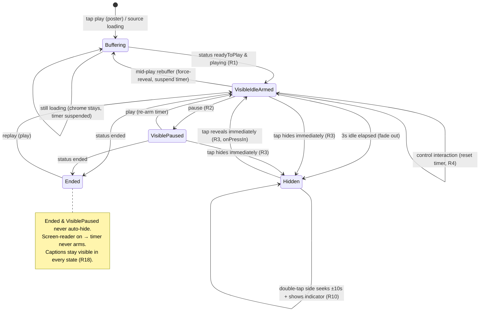
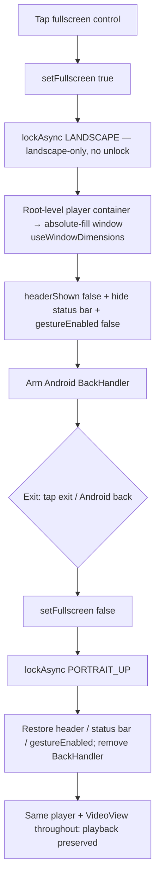

# feat: Mobile watch player — auto-hiding chrome, seek, and custom fullscreen

## Summary

Overhaul the `apps/mobile` watch player controls to behave like YouTube: an auto-hiding controls overlay ("chrome"), a draggable seek scrubber with ±10s skip buttons and double-tap-the-sides seeking, and a custom in-tree fullscreen that opens (and stays) landscape, exits cleanly, and renders subtitles. The unifying change replaces expo-video's native `enterFullscreen()` with an in-tree fullscreen that keeps the same player and `VideoView` mounted, so the custom controls and the custom `SubtitleOverlay` work identically inline and fullscreen.

---

## Problem Frame

The watch player (`apps/mobile/src/components/watch/VideoPlayer.tsx`) renders three siblings inside one 16:9 box: the expo-video `VideoView`, a custom `SubtitleOverlay`, and the always-on `PlayerControls` chrome. Today the chrome is rendered unconditionally with no visibility state and no tap target on the video, so the controls permanently cover the footage (`PlayerControls.tsx:70`).

Fullscreen is a dead end for a structural reason: `handleFullscreen` calls expo-video's native `enterFullscreen()` (`VideoPlayer.tsx:173-175`) while `nativeControls={false}`. Native fullscreen presents a layer detached from the React tree, so neither the custom chrome (where an exit control would live) nor the custom `SubtitleOverlay` (the CMS WebVTT captions) appears in fullscreen. That is why there is no exit and no captions there. Seeking is also display-only — the progress bar is a width-percent `View` driven by a 500ms poll (`PlayerControls.tsx:97-101`), not draggable.

The fix is well-scoped because the team already solved the hardest part once: `apps/tv/src/components/VideoPlayer.tsx` implements a complete auto-hide state machine (timer, fade, race-guarded animation, ref-mirroring, status/screen-reader gating) that ports almost directly, minus its TV-focus machinery.

---

## Requirements

Carried from origin (`docs/brainstorms/2026-06-05-mobile-watch-player-controls-requirements.md`). R-IDs below map to the origin's R1–R19.

### Auto-hiding chrome

- R1. Chrome is visible when playback starts, then auto-hides after ≈3s idle while playing.
- R2. While paused, chrome stays visible and does not auto-hide.
- R3. A tap on the video toggles chrome: hidden → reveal + restart idle timer; visible → hide immediately.
- R4. Interacting with any control (play/pause, mute, skip, scrubber, fullscreen) resets the idle timer rather than hiding.
- R5. Chrome fades in/out (not an instant cut).
- R6. Before first play (poster showing), the play affordance is visible.

### Seek

- R7. The progress bar is draggable and seeks to the dragged position.
- R8. During a drag, the displayed position tracks the finger (poll updates suppressed) and chrome does not auto-hide mid-drag.
- R9. −10s / +10s skip controls flank the center play/pause, clamped to `[0, duration]`.
- R10. Double-tapping the left/right half of the video seeks −10s / +10s.

### Fullscreen

- R11. The fullscreen control enters an in-tree fullscreen that fills the screen, opening in landscape.
- R12. Fullscreen is landscape-only — it opens in landscape and stays landscape; portrait fullscreen is not offered. _(Revised during implementation: iOS `unlockAsync()` snaps a portrait-held device straight back to portrait, so the planned follow-device behavior never took. Landscape-lock is the robust standard behavior — see `apps/mobile/src/lib/orientation.ts`.)_
- R13. Fullscreen exposes an exit control returning to inline layout and re-locking the app to portrait.
- R14. The Android hardware back gesture exits fullscreen rather than leaving the screen.
- R15. Entering/exiting fullscreen preserves playback state and position.
- R16. Only the fullscreen player rotates — every other screen stays portrait-locked.

### Subtitles in fullscreen

- R17. CMS WebVTT captions render in fullscreen, clear of landscape safe-area insets, above the controls.
- R18. Captions stay visible in fullscreen even while chrome is hidden.

### Verification

- R19. Each behavior is verified on the iOS simulator (and Android-spot-checked for the z-order-sensitive ones) before reporting complete.

---

## Key Technical Decisions

- KTD1. **Custom in-tree fullscreen; the player is mounted once at the route root in both modes, never relocated.** Stop calling `VideoView.enterFullscreen()`. The component that owns `useVideoPlayer` + `<VideoView>` mounts **once at the watch route root** (`app/watch/[slug].tsx`), outside the page `ScrollView`, for the screen's lifetime — because relocating it in the tree (e.g. the previously-considered "hoist on demand") remounts and releases the player per the frozen-`creationSource` invariant (`VideoPlayer.tsx:32-50`). Toggling fullscreen changes only the container's **style**, never its tree position. (Resolves the reviewer-flagged tension between "never reparent" and an in-`ScrollView` overlay: an `absolute` child of a `ScrollView` anchors to content origin, not the viewport, and sits under the native header — so the player simply never lives inside the `ScrollView`.)
  - **Inline:** the player is pinned at the top of the screen; the `ScrollView` content (episode info, Up Next, etc.) gets `paddingTop = playerHeight` and scrolls beneath it. **This changes today's behavior where the video scrolls away with content** — it now stays pinned (the standard watch-screen layout). Flagged in System-Wide Impact.
  - **Fullscreen:** the same container expands to an absolute-fill window overlay (sized from `useWindowDimensions()`, reactive to rotation) above the `ScrollView`, with the native stack header and status bar hidden.

- KTD2. **Orientation via `expo-screen-orientation` (Expo SDK module).** Global `lockAsync(PORTRAIT_UP)` so every screen is portrait by default. Enter fullscreen = `lockAsync(LANDSCAPE)` — **landscape-only** (the originally-planned follow-device `unlockAsync()` was dropped: on iOS it immediately re-applies the device's physical orientation, snapping a portrait-held phone back to portrait, so the landscape nudge never took — see R12); exit = `lockAsync(PORTRAIT_UP)`. `app.json` `orientation` flips `"portrait"` → `"default"` so standalone/production builds permit landscape at the OS level.
  - **Launch-race mitigation:** flipping `app.json` to `"default"` removes the OS-level portrait guarantee that exists today, so a cold launch held in landscape could briefly render a portrait-only screen in landscape before the async `lockAsync` resolves. Fire `lockPortrait()` as early as possible (root layout, before first paint isn't guaranteed) and add a cold-launch-in-landscape verification step (Risks).
  - **iPad:** do **not** add `ios.requireFullScreen: true` by default — it disables split-view app-wide and traces to no requirement. First validate whether `lockAsync(PORTRAIT_UP)` alone holds on an iPad simulator; only add `requireFullScreen` if it provably fails, as a separately-flagged decision.
  - **Expo Go vs dev client:** `expo-screen-orientation` is bundled in Expo Go, so runtime lock/unlock is verifiable there without a rebuild, and the `app.json` change is a no-op under Expo Go. This project also has committed `ios/`/`android/` dirs and `expo run:*` scripts — on that dev-client path, adding the module needs a `pod install`/rebuild. And the standalone Info.plist `"default"` broadening is **not** exercised by Expo Go (Expo Go always permits all orientations), so the portrait-lock-on-every-screen guarantee must be smoke-tested once in a dev-client/preview build before ship.

- KTD3. **`PanResponder` only — `react-native-gesture-handler` is forbidden** (it breaks the app under Expo Go; deliberately removed and must not return). The draggable scrubber and tap disambiguation use built-in `PanResponder` + `Pressable` timing.
  - **Scroll arbitration:** gate horizontal pans with `Math.abs(dx) > Math.abs(dy)` via `onMoveShouldSetPanResponderCapture`, and on grant set the page `ScrollView`'s `scrollEnabled={false}` (restored on release/terminate) so the scrub reliably wins against the native scroll recognizer. Use a generous thumb hit target. (Because the player is now pinned outside the `ScrollView` per KTD1, the scrubber-vs-scroll fight is largely moot for the scrubber itself, but the double-tap surface still shares space with content scroll, so keep the gate.)
  - **Reveal is never delayed:** the single-tap _reveal_ (hidden → show) fires immediately on `onPressIn` — only the _hide_ (visible → hide) and the double-tap-seek disambiguation use the timing window, so getting controls back never lags.

- KTD4. **Port the TV auto-hide state machine; honor its full correctness + gating contract.** Mirror `apps/tv/src/components/VideoPlayer.tsx`: `controlsVisible` state, `inactivityTimerRef` (3000ms), `scheduleHide` (idempotent, reads refs not render closures), `hideControls`/`revealControls` on a single `Animated.Value` (native driver, opacity only, 150ms-out `Easing.out(cubic)` / 100ms-in `Easing.in(cubic)`). Required guards (from `docs/solutions/design-patterns/rntvos-video-overlay-async-native-event-patterns-2026-04-23.md`): capture the `Animated.CompositeAnimation` handle and `.stop()` it at every force-reveal site; `if (finished)` guard on the hide-completion callback; ref-mirror every gate (`isPaused`, `status`, `isScreenReaderEnabled`) and sync it on the line _above_ the guard call; `isMountedRef`-guard every external-emitter callback (expo-video, AppState, BackHandler); snap opacity instead of animating when reduce-motion is on.
  - **Status gating (ported, not dropped):** subscribe to `statusChange`. The timer arms only once `status === 'readyToPlay'`; while `loading` (initial buffer or mid-play rebuffer) force-reveal chrome and suspend the timer; on `ended` keep chrome visible permanently and never arm. This keeps the exit control reachable during a stall in fullscreen.
  - **Screen-reader gate:** when `AccessibilityInfo.isScreenReaderEnabled()` is true, the timer never arms (chrome stays visible) — mirror the TV `isScreenReaderEnabledRef` gate. All controls carry `accessibilityLabel`s (the existing buttons already do; the new skip/scrubber/exit controls must too).
  - Drop all TV-only machinery (`TVFocusGuideView`, `useTVEventHandler`, `hasTVPreferredFocus`, the focus catcher).

- KTD5. **Hide by opacity, never `pointerEvents: none`; unmount-after-fade for touch.** The chrome layer hides by animating opacity to 0 only — toggling `pointerEvents: none` blocks interaction (and idb-driven verification taps) and is the documented anti-pattern (`docs/solutions/design-patterns/mux-player-custom-react-chrome-pattern-20260430.md`). To stop fully-hidden chrome from eating scrubber/tap touches, mirror `MiniPlayerBar.tsx`'s `mounted`-after-fade pattern: set `mounted=false` only in the fade-out completion callback. Captions are a separate layer and never fade with the chrome.

  **Note added 2026-08-15.** `MiniPlayerBar.tsx` was deleted — it never had an import site. Every `MiniPlayerBar.tsx:<line>` pointer in this plan is now dangling. The pattern is unchanged; read it from `apps/mobile/src/components/library/DeleteConfirmSheet.tsx` or from `docs/solutions/best-practices/mobile-video-detail-page-patterns-20260527.md`, section 4. Do not copy it onto a layer that holds a video surface — a fade-out there keeps a second decoder attached.

- KTD6. **Seek mechanics: 10s, double-tap ±10s with confirmation, HLS-duration-guarded.** Symmetric 10s skip (matches YouTube's double-tap). The full-bleed tap target distinguishes a single tap (toggle chrome) from a double tap (seek the tapped half) within a **~300ms** window (below ~300ms misfires double-taps as two single taps; iOS's own threshold is ~300ms). Left half −10s, right half +10s. A brief ±10s confirmation indicator renders on the tapped half **independently of chrome visibility**, so a double-tap seek while chrome is hidden gives feedback. During a drag, the in-bar time label updates live (no floating bubble for v1). **Guard every seek and all scrubber/progress math** with `if (!Number.isFinite(duration) || duration <= 0) return` and seed duration in the `useVideoPlayer` initializer — on HLS, `player.duration` is `0`/`NaN` until `sourceLoad`, so an unguarded `clamp(x, 0, duration)` snaps every early seek to 0 and renders `NaN%` width (the existing `PlayerControls.tsx:68` `duration > 0` guard exists for exactly this reason; the TV port seeds duration at `apps/tv/.../VideoPlayer.tsx:449-454`). Clamp displayed progress to ≤100%.

---

## High-Level Technical Design

### Controls visibility state machine

### Fullscreen enter / exit + orientation

Both diagrams render authoritative content; the per-unit prose is the source of truth where they differ.

---

## Implementation Units

### U1. Orientation prerequisites: dependency, config, global lock, helper

**Goal:** Make landscape possible and centralize the lock/unlock logic so fullscreen can drive it, without regressing the always-portrait guarantee on normal screens.

**Requirements:** R11, R12, R16 (enabling foundation).

**Dependencies:** none.

**Files:**

- `apps/mobile/package.json` — add `expo-screen-orientation` via `npx expo install` (resolves the SDK-54 pin, ~9.0.9).
- `apps/mobile/app.json` — `orientation: "portrait"` → `"default"`; add `ios.infoPlist.UISupportedInterfaceOrientations` (portrait + both landscapes). Do **not** add `ios.requireFullScreen` yet (see KTD2 / Risks).
- `apps/mobile/app/_layout.tsx` — call `lockPortrait()` as early as possible on mount.
- `apps/mobile/src/lib/orientation.ts` (new) — `lockPortrait()`, `enterFullscreenLandscape()`, `exitToPortrait()`.
- `apps/mobile/src/lib/__tests__/orientation.test.ts` (new).

**Approach:** A thin helper isolates the three transitions (KTD2) and is unit-testable with a mocked `ScreenOrientation`. `enterFullscreenLandscape` locks `lockAsync(LANDSCAPE)` only — the originally-planned follow-device `unlockAsync()` step was dropped (see R12/KTD2). **Lazy-require to respect the root-layout defensive pattern:** `app/_layout.tsx` deliberately lazy-`require()`s native deps inside a `try/catch` to avoid module-eval white-screens (`_layout.tsx:23-52`). Either lazy-`require` `expo-screen-orientation` inside `orientation.ts`, or add the helper to the existing require block — so a static import never pulls the native module into the eager graph. Wrap calls so a rejection never crashes navigation, and ensure a swallowed `unlockAsync` rejection cannot strand the device landscape (`exitToPortrait` must still recover).

**Patterns to follow:** lazy-require block in `apps/mobile/app/_layout.tsx:23-52`.

**Test scenarios:**

- `lockPortrait()` calls `lockAsync(PORTRAIT_UP)`.
- `enterFullscreenLandscape()` calls `lockAsync(LANDSCAPE)` and does NOT call `unlockAsync()` (landscape-only — R12).
- `exitToPortrait()` calls `lockAsync(PORTRAIT_UP)`.
- A `lockAsync` rejection in any helper is swallowed AND a subsequent `exitToPortrait()` still re-locks portrait (no stranded-landscape state — R16).
- `Test expectation:` `app.json`/dependency changes are config — no unit test; covered by manual verification.

**Verification:** App launches portrait-locked on every screen in Expo Go. Cold-launch the app **held in landscape** and confirm no landscape flash on the feed. Once before ship, smoke-test the portrait lock in a dev-client/preview build (Expo Go can't exercise the standalone Info.plist).

---

### U2. Auto-hide controls state machine + tap-to-toggle

**Goal:** Chrome appears on play, auto-hides after idle, stays up while paused/buffering/ended/screen-reader-on, and toggles on tap — with the TV correctness contract.

**Requirements:** R1, R2, R3, R4, R5, R6.

**Dependencies:** none (independent of U1).

**Files:**

- `apps/mobile/src/hooks/useControlsVisibility.ts` (new) — `controlsVisible`, `mounted`, `opacityAnim`, `reveal()`, `scheduleHide()`, `hideNow()`, `noteInteraction()`, status/screen-reader/reduce-motion wiring, unmount cleanup.
- `apps/mobile/src/hooks/__tests__/useControlsVisibility.test.ts` (new).
- `apps/mobile/src/components/watch/VideoPlayer.tsx` — full-bleed `Pressable` tap target behind the controls; wrap `PlayerControls` in an `Animated.View` bound to `opacityAnim`, mounted only while `mounted`.
- `apps/mobile/src/components/watch/PlayerControls.tsx` — call `noteInteraction()` on every control press (R4); accept the `opacityAnim`/visibility contract; ensure new controls carry `accessibilityLabel`.

**Approach:** Port `apps/tv/src/components/VideoPlayer.tsx`'s visibility core (KTD4) into a hook, dropping TV-focus pieces but **keeping** `statusChange` and screen-reader gating. Timer is `setTimeout(hideNow, 3000)`, idempotent, gated on `isPausedRef`/`statusRef`/`isScreenReaderEnabledRef`. Drive arm/clear from the existing `useEvent(player, "playingChange")` + an `isPlayingRef`, and subscribe `statusChange` for buffering/ended. Hide animates opacity→0 (native driver); `mounted` flips false only in the `if (finished)` completion callback (KTD5). `reveal()` `.stop()`s any in-flight hide before animating →1, and the single-tap reveal fires on `onPressIn` (KTD3, immediate). The tap target solves the `box-none` pass-through (`PlayerControls.tsx:71`). On AppState `active`, stop any in-flight hide and force-reveal (mirror TV `:323-335`).

**Technical design (directional):** the tap target is one `Pressable`/`PanResponder` at `absoluteFill` _below_ `PlayerControls`; U4's double-tap routing layers onto its press timing inline in `VideoPlayer.tsx` (no separate hook).

**Patterns to follow:** `apps/tv/src/components/VideoPlayer.tsx` (timer/fade/ref-mirror/status/screen-reader); `apps/mobile/src/components/watch/MiniPlayerBar.tsx:33-58` (mount-after-fade); `apps/mobile/src/hooks/useShimmerOpacity.ts` (native-driver Animated house style).

**Test scenarios:**

- Covers AE1. Timer arms on `readyToPlay` + playing; after 3s → `controlsVisible` false.
- Covers AE1. Paused → timer does not arm; chrome stays past 3s.
- Covers AE2. Tap while visible hides immediately; tap while hidden reveals (on press-in) and re-arms.
- `noteInteraction()` clears + re-arms without hiding.
- **Second-cycle:** play→hide→reveal→idle→hide→reveal leaves `controlsVisible`/`mounted` true after the second reveal (not a stale false from a prior hide callback).
- AppState `active` mid-hide-fade force-reveals and the prior hide's completion callback does not later flip `mounted=false`.
- `loading` status force-reveals and suspends the timer; `ended` keeps chrome visible and never arms.
- Screen-reader on → timer never arms.
- Reduce-motion on → opacity set, not animated.
- Unmount during fade clears timer + stops animation (no setState-after-unmount); a fresh mount starts visible.

**Verification:** Expo Go → birth-of-jesus → controls fade after ~3s, reappear instantly on tap, stay up when paused; run two full hide/reveal cycles; background→resume mid-hide and confirm controls return.

---

### U3. Draggable scrubber + ±10s skip buttons (PanResponder)

**Goal:** Seek by dragging the progress bar and by tapping ±10s skip controls, with live time feedback.

**Requirements:** R7, R8, R9.

**Dependencies:** U2 (interaction resets timer; drag holds chrome visible).

**Files:**

- `apps/mobile/src/components/watch/Scrubber.tsx` (new) — draggable track/thumb on `PanResponder`.
- `apps/mobile/src/components/watch/__tests__/scrubber-math.test.ts` (new) — pure position↔time + clamp helpers.
- `apps/mobile/src/components/watch/PlayerControls.tsx` — replace the static progress `View` (`:97-101`) with `Scrubber`; add −10s/+10s `Pressable`s flanking play/pause.

**Approach:** `PanResponder` with the horizontal-intent capture gate (KTD3); on grant, mark dragging (suppress the 500ms poll, R8), hold chrome via `noteInteraction()`, and set the page `ScrollView`'s `scrollEnabled={false}` (restore on release/terminate). On move, map `locationX`/track width → fraction → time and update a local scrub preview **and the in-bar time label** (live feedback, KTD6); on release, `player.currentTime = seekTarget`, resume polling, re-enable scroll. Skip buttons set `player.currentTime = clamp(currentTime ± 10, 0, duration)`. **Guard all seeks/math with the duration guard (KTD6)** — read live `player.currentTime`/`player.duration`, no-op when duration ≤ 0 / non-finite. Clamp displayed progress to ≤100%.

**Patterns to follow:** time formatting at `PlayerControls.tsx:15-19`; live-player-read at `PlayerControls.tsx:49-60`; duration seeding at `apps/tv/.../VideoPlayer.tsx:446-454`.

**Test scenarios:**

- Position→time maps 0→0, full-width→duration, midpoint→duration/2.
- Covers AE3. +10s near end clamps to duration; −10s near 0 clamps to 0.
- Dragging suppresses poll updates and updates the time label live; releasing applies the seek and resumes polling.
- Drag keeps chrome visible (timer reset, R8) and toggles the page `scrollEnabled` off then on.
- **Seek/drag while `duration === 0`/`NaN` is a no-op** (no jump-to-zero, no `NaN%` width).
- Progress fraction never exceeds 1.0.

**Verification:** Expo Go: drag to mid-clip → seeks; tap ±10s → clamps at both ends; the time label tracks the drag; the page doesn't scroll during a drag. Spot-check Android.

---

### U4. Double-tap-the-sides to seek (±10s) — inline in the player

**Goal:** Double-tapping the left/right half seeks −10s/+10s with on-screen confirmation; single tap still toggles chrome (reveal immediate).

**Requirements:** R10 (preserves R3).

**Dependencies:** U2 (extends the tap target), U3 (reuses the clamped seek + duration guard).

**Files:**

- `apps/mobile/src/components/watch/VideoPlayer.tsx` — disambiguation inline on the U2 tap target (single → toggle, double → seek the tapped half), plus a brief ±10s confirmation indicator.
- `apps/mobile/src/components/watch/__tests__/tap-disambiguation.test.ts` (new) — the pure timing/half-routing helper.

**Approach:** Inline rather than a separate hook — there is exactly one consumer and the TV port keeps this logic in-component; extract only the pure timing helper for testing (scope-guardian). The reveal fires immediately on `onPressIn` (KTD3); the ~300ms window (KTD6) only gates single-tap _hide_ vs double-tap _seek_. A second tap within the window cancels the pending toggle and fires a seek based on `locationX` vs half the player width. A brief ±10s indicator renders on the tapped half independent of `controlsVisible`. No gesture-handler (KTD3).

**Test scenarios:**

- One tap, no second within ~300ms → single-tap toggle fires once.
- Two taps within ~300ms → seek fires; the pending single-tap toggle is cancelled.
- A tap at 280–320ms boundary does not misfire as two single taps.
- Left-half double-tap → −10s; right-half → +10s; both clamp via U3's guard.
- A reveal (hidden→show) is not delayed by the disambiguation window.
- The ±10s indicator shows even when chrome is hidden.

**Verification:** Expo Go: double-tap left/right → ∓10s with the indicator; single tap still toggles chrome and reveal feels instant; deliberate slow double-tap still seeks.

---

### U5. Custom in-tree fullscreen: route-root mount, layout, orientation, exit, Android back

**Goal:** Replace native fullscreen with an in-tree fullscreen that opens landscape, follows the device, exits via control / Android back / nothing-left-behind, and preserves playback.

**Requirements:** R11, R12, R13, R14, R15, R16.

**Dependencies:** U1 (orientation helper), U2 (chrome renders the exit control).

**Files:**

- `apps/mobile/app/watch/[slug].tsx` — mount `VideoPlayer` at the route root, outside the `ScrollView`; add `paddingTop = playerHeight` to the scroll content (pinned inline player, KTD1); lift `isFullscreen` here; on fullscreen, set `navigation.setOptions({ headerShown: false })` and `gestureEnabled: false`, restoring on exit.
- `apps/mobile/src/components/watch/VideoPlayer.tsx` — replace `handleFullscreen`/`enterFullscreen()` (`:173-175`) with the `isFullscreen`-driven container-style toggle (inline 16:9 ↔ absolute-fill window from `useWindowDimensions()`); call the U1 helper on enter/exit; register/remove the Android `BackHandler`; hide the status bar in fullscreen; re-assert `enterFullscreenLandscape()` on AppState `active` while fullscreen.
- `apps/mobile/src/components/watch/PlayerControls.tsx` — the fullscreen icon reflects enter vs exit (`expand` ↔ `contract`).

**Approach:** KTD1 + KTD2. Same player/`VideoView` mounted at the route root throughout; only the wrapping `<View>` style changes — never relocated. Enter: `setFullscreen(true)` → `enterFullscreenLandscape()` → `headerShown:false` + hide status bar + `gestureEnabled:false` (so the iOS edge-swipe can't pop the route mid-fullscreen) → arm `BackHandler` (return `true`, R14). Exit (control or back): `setFullscreen(false)` → `exitToPortrait()` → restore header/status bar/gesture → `sub.remove()` (RN 0.81 subscription `.remove()`, not `removeEventListener`). `contentFit` stays `"contain"` (letterbox 16:9). On Android, set `surfaceType="textureView"` on `VideoView` so RN overlays/captions composite above the video; verify. Read `useSafeAreaInsets()` live for landscape insets.

**Execution note:** This unit defines the route-root mount; build U2–U4 against that mount location (they are independent of fullscreen but live in the same component).

**Patterns to follow:** `BackHandler` shape at `apps/tv/.../VideoPlayer.tsx:426-443`; the absolute-sibling-outside-ScrollView pattern already on this screen (`app/watch/[slug].tsx` scroll-top FAB, `:340-356`); `useWindowDimensions` sizing at `VideoPlayer.tsx:25,30`.

**Test scenarios:**

- Entering calls `enterFullscreenLandscape()` + sets `headerShown:false`/`gestureEnabled:false`; exiting calls `exitToPortrait()` + restores both.
- The `BackHandler` returns `true` while fullscreen and is removed (`.remove()`) on exit.
- The fullscreen icon shows the exit affordance when `isFullscreen`.
- Toggling fullscreen does not change the `useVideoPlayer` creation source and does not relocate the player in the tree (player not remounted) — guard R15.
- AppState `active` while fullscreen re-asserts the landscape lock.
- `Test expectation:` actual rotation + playback continuity is native — manual sim/device verification.

**Verification:** Expo Go: tap fullscreen → landscape, video keeps playing, **no native header bar showing**; stays landscape, no follow-to-portrait (R12); exit control + Android back → inline, app re-locks portrait (R13/R14); enter fullscreen while paused → exit control reachable; background→resume in fullscreen → orientation + layout consistent. Screenshot landscape fullscreen.

---

### U6. Subtitles in fullscreen: reposition, safe areas, track-picker handling

**Goal:** CMS captions render in fullscreen above the controls, clear of landscape insets, visible when chrome hides; and changing subtitle/language track from fullscreen behaves predictably.

**Requirements:** R17, R18.

**Dependencies:** U5 (fullscreen state + insets), U2 (chrome-visible state).

**Files:**

- `apps/mobile/src/components/watch/VideoPlayer.tsx` — compute `SubtitleOverlay`'s `bottomOffset` from `useSafeAreaInsets()` + `isFullscreen` + `controlsVisible` (instant change, no animation); exit fullscreen before presenting a track-picker sheet (see Approach).
- `apps/mobile/src/components/watch/SubtitleOverlay.tsx` — accept an optional horizontal inset for landscape notch clearance (already takes `bottomOffset`, default 16, `:9-13`).

**Approach:** Subtitles render in-tree, so in-tree fullscreen makes them appear automatically (the structural win of KTD1). Positioning: feed a `bottomOffset` so captions sit above the control bar when chrome is visible and drop when it hides (R18); the offset change is **instant** (no animation — applied on the same path that flips `mounted`), so captions don't jump mid-fade. Add `insets.left`/`insets.right` padding in landscape (R17). Captions are independent of `controlsVisible` opacity — they never fade. **Track-picker decision:** the Subtitle/Language pickers are native formSheet routes laid out for portrait; presenting one over a follow-device landscape lock is an untested fight. Resolve by **exiting fullscreen before presenting a track-picker sheet** (simplest, predictable) — i.e. the in-fullscreen subtitle/language affordance pops out of fullscreen first. Document this; do not attempt an in-fullscreen formSheet for v1.

**Patterns to follow:** `SubtitleOverlay` `bottomOffset` + absolute positioning (`:126-142`); inset reads at `MiniPlayerBar.tsx:29,66`.

**Test scenarios:**

- `bottomOffset` is larger when `controlsVisible`, smaller when hidden, applied instantly (not animated).
- In fullscreen landscape, horizontal inset padding is applied from safe-area insets.
- Captions render regardless of `controlsVisible`.
- Invoking the subtitle/language picker while fullscreen exits fullscreen first (re-locks portrait), then presents the sheet.

**Verification:** Expo Go with subtitles on: enter fullscreen → captions above controls and after chrome fades; rotate → clear of notch; open the subtitle picker from fullscreen → exits fullscreen then shows the sheet. Spot-check Android compositing.

---

## Acceptance Examples

- AE1. **Auto-hide only while playing.** Playing + visible + 3s idle → fades out; paused + 3s → stays visible. (R1, R2 — U2.)
- AE2. **Tap toggles, not just reveals.** Visible + tap (not a control) → hides immediately; hidden + tap → reveals instantly. (R3 — U2/U4.)
- AE3. **Skip clamps at boundaries.** At 0:05, −10s → 0:00; near end, +10s → end; either while `duration` unknown → no-op. (R9 — U3.)
- AE4. **Subtitles survive the fullscreen transition.** Enabled inline → enter fullscreen → same captions render, clear of insets, and remain after chrome fades. (R17, R18 — U6.)
- AE5. **Exit always available.** In fullscreen (landscape or portrait, playing or paused/stalled) → exit control or Android back → inline layout, app re-locked portrait, no native header left covering the frame. (R13, R14, R16 — U5.)

---

## Scope Boundaries

- In scope: the `/watch/[slug]` player only.
- Out of scope: the legacy `apps/mobile/app/video/[sectionKey].tsx` player; picture-in-picture; a visual redesign beyond the new affordances; Mux's auto-generated HLS subtitle tracks (stay disabled, `VideoPlayer.tsx:104`); new buffering/language-switch/lifecycle behavior beyond the status-gating this plan adds (the `replaceAsync` swap and AppState pause/resume are preserved); an in-fullscreen track-picker (changing subtitle/language exits fullscreen first, U6).

### Deferred to Follow-Up Work

- Preserving the old "video scrolls away with content" inline behavior. The route-root mount (KTD1) pins the player at the top instead; if a scroll-away inline player is later wanted, it requires syncing the player's transform to scroll offset — out of scope here.

---

## System-Wide Impact

- **App-global orientation posture changes.** After U1 every screen relies on the root `lockAsync(PORTRAIT_UP)` instead of the `app.json` `"portrait"` hard-lock; `app.json` `"default"` permits landscape at the OS level for standalone builds. The cold-launch landscape-flash race (KTD2) is the regression risk from dropping the Info.plist guarantee.
- **Inline watch layout change.** The player is now pinned at the top of the watch screen rather than scrolling away with content (KTD1). This is a visible behavior change to the `/watch/[slug]` page — intended and standard, flagged here for sign-off.
- **iPad:** `ios.requireFullScreen` is deliberately NOT added by default (it would disable split-view app-wide and traces to no requirement); added only if `lockAsync` alone proves insufficient on iPad.

---

## Risks & Dependencies

- **New dependency `expo-screen-orientation`** (~9.0.9) — Expo SDK module, Expo Go-safe at runtime; the committed `ios/`/`android/` dev-client path needs a `pod install`/rebuild, and the standalone Info.plist `"default"` broadening is not exercised by Expo Go (smoke-test the portrait lock in a dev-client/preview build once before ship). (Contrast KTD3: `react-native-gesture-handler` is forbidden.)
- **Cold-launch landscape flash** — dropping the OS-level portrait lock means a launch held in landscape can flash landscape before the async lock resolves; mitigate with an early `lockPortrait()` and a cold-launch-in-landscape verification.
- **Native header / overlay anchoring** — the player is mounted at the route root outside the `ScrollView` precisely so the fullscreen overlay anchors to the viewport and the native header is hidden on entry; verify no header bar shows in fullscreen.
- **HLS `duration` is 0/NaN before `sourceLoad`** — all seek/scrubber math is guarded (KTD6); verify early-interaction seeks are no-ops, not jumps-to-zero.
- **Android `VideoView` z-order** (SurfaceView renders above RN views) — overlays/captions may render under the video; mitigate with `surfaceType="textureView"` and verify on a real Android surface (`expo/expo#30275`).
- **Gesture collisions on the shared tap surface** — single-tap-reveal (immediate), single-tap-hide, double-tap-seek (~300ms), and drag all share one surface; tests must cover the mixed cases (tap-vs-drag, boundary-timing double-tap), not just clean gestures.
- **Second-transition bugs** — the overlay correctness bugs (KTD4) surface on the second cycle / app-resume / unmount-mid-fade; U2 tests gate on these explicitly.
- **iOS edge-swipe back in fullscreen** — neutralized via `gestureEnabled:false` while fullscreen (U5).

---

## Sources & Research

- Origin requirements: `docs/brainstorms/2026-06-05-mobile-watch-player-controls-requirements.md`.
- TV auto-hide prior art (port target): `apps/tv/src/components/VideoPlayer.tsx` (visibility state machine, 3000ms timer, opacity fade, ref-mirror, status/screen-reader gating, duration seeding, BackHandler).
- Overlay correctness contract: `docs/solutions/design-patterns/rntvos-video-overlay-async-native-event-patterns-2026-04-23.md`.
- Custom-chrome anti-patterns: `docs/solutions/design-patterns/mux-player-custom-react-chrome-pattern-20260430.md` (opacity-only hide; clamp progress; subscribe-to-events).
- expo-video source-swap traps: `docs/solutions/best-practices/mobile-video-detail-page-patterns-20260527.md`, `docs/solutions/best-practices/playlist-video-player-sdui-mobile-20260409.md` (live `player.playing`; frozen creation source).
- Gesture preemption / overlay-over-scroll: `docs/solutions/mobile/react-native-scrollview-touch-event-z-index-fix.md`, `docs/solutions/mobile/hero-mute-button-hybrid-overlay-touch-target.md`.
- Root-layout lazy-require pattern: `apps/mobile/app/_layout.tsx:23-52` (white-screen avoidance).
- Sheet stack / removed gesture-handler context: `docs/solutions/best-practices/bottom-sheet-migration-expo-sdk54-pitfalls-20260527.md`, `docs/solutions/best-practices/flashlist-v2-maintainvisiblecontentposition-default-20260605.md`.
- External: [expo-screen-orientation SDK 54](https://docs.expo.dev/versions/v54.0.0/sdk/screen-orientation/), [expo-video SDK 54](https://docs.expo.dev/versions/v54.0.0/sdk/video/), [RN 0.81 BackHandler](https://reactnative.dev/docs/0.81/backhandler).
