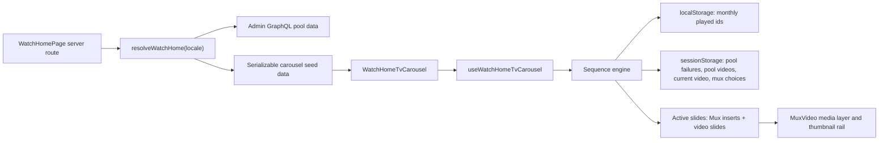

# Source-parity watch home carousel sequence

## Summary

Implement the full Core watch-home carousel behavior on top of the merged Forge carousel: source data remains admin-backed, the current home page sections stay intact, and the client gains the original sequence engine semantics for progressive loading, played-video memory, pool exhaustion, current-session state, and Mux insert handling.

---

## Problem Frame

`feat-159` delivered the portable TV-like carousel and admin-backed slide data, but it still behaves like a bounded flat carousel. The original Core experience is stateful: it progressively picks videos from playlist pools, remembers what the viewer has already seen, avoids repeating videos, inserts Mux editorial clips at defined positions, and keeps playback moving as the user skips, completes, or manually selects items.

---

## Requirements

- R1. Preserve the existing Forge `/watch` home page composition: only the intro carousel behavior should change, and below-the-fold admin sections must continue to render.
- R2. Match Core's playlist pool sequence, including grouped collection pools, the injected `shortFilms` pool after each playlist cycle, blacklist filtering, and deterministic daily selection.
- R3. Match Core's browser storage contract: monthly persistent played-video memory, session pool exhaustion/failure tracking, and 24-hour current-video session state.
- R4. Match Core's progressive loading behavior: initial prefetch target of seven videos, then one video ahead during playback, with one in-flight load at a time.
- R5. Match Core's active-slide behavior: progress threshold advance near 95 percent, ended advance, explicit skip, manual card selection, and Mux insert completion handoff.
- R6. Match Core's Mux insert behavior where data is available: sequence-start inserts, after-count inserts, session-stable playback selection, first start insert date prefix, and conditional time-of-day overlays.
- R7. Keep all runtime video, collection, language, image, title, and route data flowing through admin GraphQL and `@forge/admin-graphql`; do not add Core, Arclight, or Algolia runtime dependencies to `apps/web`.
- R8. Build public watch links with the existing route helpers and active/fallback audio-language slugs, never with message-catalog locale keys.
- R9. Keep the carousel hydration-safe and resilient when `localStorage`/`sessionStorage` is unavailable, corrupt, stale, or blocked.
- R10. Document any admin/source-data gaps that remain after implementation as follow-up work, not hidden behavior differences.
- R11. Verify visually against the live New Design experience on `https://www.jesusfilm.org/watch` and local `/watch` on desktop and mobile.

---

## Scope Boundaries

- This plan does not replace the rest of the current Forge home page or re-port Core's full below-the-fold `CollectionsRail`.
- This plan does not add upstream `apps/watch-modern` or `apps/watch` package imports; Core source is a behavior reference only.
- This plan does not introduce a new global search UI or Algolia search path.
- This plan does not rewrite the watch-page player surface; the home carousel should stay local to `apps/web/src/components/home`.
- This plan does not make playlist or Mux insert editing fully admin-configurable unless the required admin model already exists cheaply enough to reuse.

### Deferred to Follow-Up Work

- Admin-owned editorial management for playlist order, pool groups, blacklists, Mux insert records, conditional overlays, action links, and logo flags.
- Admin media-asset parity for upstream local poster/thumbnail overrides, blurhash placeholders, and dominant-color placeholders.
- Bounded admin pool/count endpoints for playlist-only carousel sources; the current broad `watchHomeVideos` payload times out when every upstream playlist Core ID is requested at once.
- Full admin-backed below-the-fold Core `CollectionsRail` parity.
- Stronger editorial tooling for language-specific fallbacks when a requested language has too few playable videos.
- Analytics instrumentation for carousel sequence events, unless an existing home-carousel event surface is discovered during implementation.

---

## Context & Research

### Relevant Code and Patterns

- `apps/web/src/components/home/WatchHomePage.tsx` wraps the TV carousel above the existing Forge home sections, promo, and footer.
- `apps/web/src/components/home/WatchHomeTvCarousel.tsx` owns the visual shell, media layer, overlay controls, and Embla thumbnail rail.
- `apps/web/src/components/home/useWatchHomeTvCarousel.ts` currently handles simple active index, mute, progress, image-slide fallback timing, and monthly localStorage played IDs.
- `apps/web/src/lib/watch-home.ts` currently fetches static configured admin home records, normalizes hero slides/sections, and reports missing data.
- `apps/web/src/lib/watch-home-config.ts` currently defines static hero and section Core IDs for the merged home page.
- `apps/admin/src/services/video.service.ts` supports list/count filters for category, collection, language, search, sort, limit, and offset.
- `apps/admin/src/graphql/types/video.ts` exposes the public `videos(...)` resolver and can be extended if the carousel needs a narrower pool contract.
- `apps/web/AGENTS.md` and `apps/web/CLAUDE.md` require admin GraphQL data access, server-only admin credentials, RSC boundaries, and correct public audio-language slugs.

### Institutional Learnings

- `docs/solutions/architecture-patterns/admin-owned-watch-route-manifest-20260530.md` establishes the pattern for compact admin-owned read contracts consumed by web when request-time rediscovery would be expensive.
- `docs/solutions/design-patterns/embla-carousel-bleed-alignment-port-pattern-20260508.md` documents the Embla rail alignment and test-polyfill pitfalls to preserve if the thumbnail rail is adjusted.
- `docs/roadmap/platform/feat-160-watch-home-carousel-data-parity.md` already tracks data gaps from the first carousel PR, including collection count/pool endpoints and admin-owned insert metadata.

### External References

- Core `useWatchHeroCarousel`: `https://github.com/JesusFilm/core/blob/main/apps/watch/src/components/PageMain/useWatchHeroCarousel.ts`
- Core `useCarouselVideos`: `https://github.com/JesusFilm/core/blob/main/apps/watch/src/components/VideoHero/libs/useCarouselVideos/useCarouselVideos.ts`
- Core carousel storage/selection utilities: `https://github.com/JesusFilm/core/blob/main/apps/watch/src/components/VideoHero/libs/useCarouselVideos/utils.ts`
- Core Mux insert merge logic: `https://github.com/JesusFilm/core/blob/main/apps/watch/src/components/VideoHero/libs/useCarouselVideos/insertMux.ts`
- Core playlist config: `https://github.com/JesusFilm/core/blob/main/apps/watch/config/video-playlist.json`
- Core Mux insert config: `https://github.com/JesusFilm/core/blob/main/apps/watch/config/video-inserts.mux.json`

---

## Key Technical Decisions

- Build a Forge-native sequence engine rather than importing Core code: Core uses Apollo/Arclight, generated Core types, and app-specific player context that would violate Forge's admin-backed web boundary.
- Keep server and client responsibilities separate: server-side Forge resolves admin-backed pool candidates and metadata; the client owns browser storage, active sequence state, and progressive loading decisions.
- Preserve Core storage key semantics unless implementation discovers an unavoidable collision: using `carousel-played-ids`, `carousel-current-video`, and `mux-insert-selections` keeps behavior closest to source and makes manual QA against Core easier.
- Add a narrow admin pool contract only if the current `videos(...)` query cannot support source-parity selection without broad overfetch. The preferred shape is an admin-owned count/children read model, following the route-manifest pattern, rather than moving relation walking into the browser.
- Treat static Forge playlist/Mux configs as migration fallback data for this behavior PR. Admin editorialization is a follow-up unless an existing admin block or media model can represent the data without widening scope.
- Characterize behavior before refactoring the hook. The current tests are flat-carousel tests; source parity needs storage, sequence, duplicate, pool-exhaustion, and insert tests before the UI wiring changes.

---

## High-Level Technical Design

This illustrates the intended approach and is directional guidance for review, not implementation specification. The implementing agent should treat it as context, not code to reproduce.

The target design keeps all privileged/admin calls server-side. The client receives enough admin-derived pool metadata and video candidates to reproduce Core's sequence semantics without knowing admin credentials or Core APIs.

---

## Implementation Units

### U1. Characterize Core Sequence Semantics

**Goal:** Add focused behavior tests and fixtures that make Core parity executable before changing the current flat-carousel hook.

**Requirements:** R2, R3, R4, R5, R6, R9.

**Dependencies:** None.

**Files:**

- `apps/web/src/lib/watch-home-carousel-sequence.test.ts`
- `apps/web/src/components/home/__tests__/useWatchHomeTvCarousel.test.ts`
- `apps/web/src/lib/__tests__/watch-home.test.ts`
- `apps/web/vitest.setup.ts`

**Approach:** Create small Forge-shaped fixtures for playlist groups, short films, video slides, and Mux inserts. Tests should cover the behavior contract rather than Core implementation details: deterministic daily offsets, monthly played-id reset, corrupt storage recovery, pool exhaustion, duplicate avoidance, initial prefetch count, playback prefetch count, manual jump tracking, and insert merge order.

**Execution note:** Add characterization coverage first. The source behavior is complex enough that implementation should be guided by failing behavior tests, not visual checking alone.

**Patterns to follow:** Existing helper tests in `apps/web/src/components/home/__tests__/useWatchHomeTvCarousel.test.ts`; storage-safe helper style from Core `utils.ts`; Embla/jsdom polyfill guidance in `apps/web/vitest.setup.ts`.

**Test scenarios:**

- Happy path: empty storage plus available pools yields the first playable video from the configured pool order and records it as played.
- Happy path: initial load keeps adding videos until seven playable video slides are available.
- Happy path: after playback begins, only one playable video ahead is prefetched.
- Edge case: `carousel-played-ids` from a previous month is ignored and removed.
- Edge case: corrupt `localStorage` or `sessionStorage` values do not throw and fall back to empty state.
- Edge case: a pool whose played count reaches its available count is skipped until cycling resets.
- Edge case: a duplicate video returned from a small pool is not appended and marks the pool as temporarily played.
- Integration scenario: selecting a video manually updates current index, pool index, persistent played IDs, and pool played IDs.
- Integration scenario: selecting a Mux insert does not mark a video played but keeps the active slide stable.

**Verification:** Tests fail against the current flat implementation for the missing source-parity behaviors and pass after later units.

### U2. Add or Confirm Admin Pool Read Contract

**Goal:** Ensure Forge can query the admin data needed for Core-like pool selection without falling back to broad overfetch or Core runtime APIs.

**Requirements:** R2, R4, R7, R10.

**Dependencies:** U1 for expected behavior boundaries.

**Files:**

- `apps/admin/src/services/video.service.ts`
- `apps/admin/src/services/video.service.test.ts`
- `apps/admin/src/graphql/types/video.ts`
- `apps/admin/src/graphql/types/video.principal-filter.test.ts`
- `apps/admin/src/graphql/public-resolvers.regression.test.ts`
- `apps/admin/schema.graphql`
- `packages/admin-graphql/src/admin-graphql-env.d.ts`
- `apps/web/src/lib/watch-home.ts`
- `apps/web/src/lib/__tests__/watch-home.test.ts`

**Approach:** First verify whether existing `videos(...)`, `Video.children`, `Video.childrenCount`, and `VideoService.countActive(...)` can provide the same inputs as Core's collection count, collection children, and short-film queries with bounded payloads. If they cannot, add the smallest public admin GraphQL contract needed for carousel pools, such as count-by-pool and children-by-parent queries that reuse `VideoService` visibility, language, and playable-dub filters.

**Patterns to follow:** Public resolver posture in `apps/admin/src/graphql/types/video.ts`; compact producer-owned contract pattern from `docs/solutions/architecture-patterns/admin-owned-watch-route-manifest-20260530.md`; existing service tests for category, collection, and language filters.

**Test scenarios:**

- Happy path: count contract returns the same count scope as `videos(collection, language)` for a collection pool.
- Happy path: children contract returns only non-deleted, publicly visible, playable active-language children.
- Happy path: short-film pool contract returns playable short films bounded by the configured limit.
- Edge case: unknown collection returns zero count/empty children without throwing.
- Edge case: requested language with no playable dubs excludes those videos from the playable candidate count.
- Failure path: public resolver does not expose privileged or deleted rows.
- Integration scenario: generated admin GraphQL types allow `apps/web` operations to compile without inline web operations or hand-edited env outputs.

**Verification:** Admin SDL and `packages/admin-graphql` generated types are updated only if schema changes are needed; web resolver tests prove the selected admin contract supports source-parity pool behavior.

### U3. Refactor Web Carousel Data Into Pool Seeds

**Goal:** Replace the current broad flat slide resolver with an admin-backed pool seed model that the client sequence engine can consume progressively.

**Requirements:** R2, R4, R7, R8, R10.

**Dependencies:** U1, U2.

**Files:**

- `apps/web/src/lib/watch-home.ts`
- `apps/web/src/lib/watch-home-config.ts`
- `apps/web/src/lib/watch-home-carousel-sequence.ts`
- `apps/web/src/lib/__tests__/watch-home.test.ts`
- `apps/web/src/lib/watch-home-carousel-sequence.test.ts`

**Approach:** Split normalization from sequencing. Keep server-only admin fetching in `watch-home.ts`, but return a compact serializable model that includes playlist groups, available counts, initial candidate windows, short-film candidates, blacklist data, language slug, missing-data report, and Mux insert config alongside the existing home sections. Move pure sequence helpers into `watch-home-carousel-sequence.ts` so tests can exercise them without React.

**Patterns to follow:** Current `normalizeCard` for route-safe video card shape; `tryAsContentSlug`, `tryAsLocaleSlug`, `watchVideoPath`, and `watchEpisodePath` for links; existing missing-data report shape in `WatchHomeMissingData`.

**Test scenarios:**

- Happy path: resolver emits pool seed data in playlist order and includes the injected short-film pool metadata.
- Happy path: normalized video slides use active or fallback audio language slug in `href`.
- Edge case: missing slug, title, playable variant, or invalid language slug records a skipped-video reason and does not emit a playable slide.
- Edge case: missing configured collection is reported in `missingData.missingCollections`.
- Edge case: active-language shortage records fallback usage without breaking the page.
- Integration scenario: resolver payload is serializable and safe to pass from a Server Component into `WatchHomeTvCarousel`.

**Verification:** The web data layer no longer needs to flatten all pools into the final slide order before the client runs sequence state.

### U4. Implement Browser Storage and Progressive Sequence Engine

**Goal:** Port Core's sequence lifecycle into Forge's client hook while preserving hydration safety and current visual component APIs.

**Requirements:** R2, R3, R4, R5, R9.

**Dependencies:** U1, U3.

**Files:**

- `apps/web/src/lib/watch-home-carousel-sequence.ts`
- `apps/web/src/lib/watch-home-carousel-sequence.test.ts`
- `apps/web/src/components/home/useWatchHomeTvCarousel.ts`
- `apps/web/src/components/home/__tests__/useWatchHomeTvCarousel.test.ts`
- `apps/web/src/components/home/WatchHomeTvCarousel.tsx`

**Approach:** Introduce a storage adapter that reads/writes Core-compatible keys only after mount and catches all browser-storage failures. The sequence engine should track videos, current index, pool index, loading queue, and pool exhaustion; choose deterministic offsets using the New York business date; save the current video session for 24 hours; honor the stored pool/current-video state when the data is available; and expose stable actions for next, previous, skip, jump, and progress-driven advance.

**Patterns to follow:** Current hook's `progressPercent` and threshold helpers; Core `utils.ts` storage semantics; hydration-safe client-state patterns already used in the merged carousel work.

**Test scenarios:**

- Happy path: first available video is marked played in local and session pool storage.
- Happy path: moving next records the next video and updates pool index.
- Happy path: current video session less than 24 hours old seeds the pool/current-video state when the referenced video exists in loaded seed data.
- Edge case: current video session older than 24 hours is cleared and ignored.
- Edge case: storage unavailable behaves like empty storage and never prevents rendering.
- Edge case: exhaustion reset after repeated cycling prevents the carousel from dead-ending.
- Integration scenario: progress crossing 95 percent advances exactly once per active media item.
- Integration scenario: skip at the end requests another video rather than wrapping to stale slides.

**Verification:** The hook returns stable active-slide state, slide list, progress, mute state, and handlers consumed by `WatchHomeTvCarousel` without reintroducing SSR/client mismatches.

### U5. Bring Mux Inserts to Source Parity

**Goal:** Match Core's Mux insert sequencing and session-stable playback selection while documenting admin metadata still missing from Forge.

**Requirements:** R5, R6, R9, R10.

**Dependencies:** U1, U3, U4.

**Files:**

- `apps/web/src/lib/watch-home-config.ts`
- `apps/web/src/lib/watch-home-carousel-sequence.ts`
- `apps/web/src/lib/watch-home-carousel-sequence.test.ts`
- `apps/web/src/components/home/useWatchHomeTvCarousel.ts`
- `apps/web/src/components/home/__tests__/useWatchHomeTvCarousel.test.ts`
- `docs/roadmap/platform/feat-160-watch-home-carousel-data-parity.md`

**Approach:** Expand the existing Forge insert config to represent Core's enabled flag, multiple playback IDs, conditional overlays, poster override, logo, action, sequence-start trigger, and after-count trigger. Use `sessionStorage` to store `mux-insert-selections` and `mux-insert-selections-seed`, select playback IDs deterministically per session, prefix only the first sequence-start insert title with the date, and advance from inserts into the next video with the same guard behavior as Core.

**Patterns to follow:** Current `watchHomeHeroSlidesToTvCarouselSlides` adapter, Core `insertMux.ts`, and existing missing-data follow-up list in `docs/roadmap/platform/feat-160-watch-home-carousel-data-parity.md`.

**Test scenarios:**

- Happy path: sequence-start insert appears before videos and first start title receives the date prefix once.
- Happy path: after-count inserts appear after the first and third video counts and are inserted only once.
- Happy path: a stored playback ID is reused for the same insert in the same session.
- Edge case: corrupt `mux-insert-selections` storage falls back to a new stable choice without throwing.
- Edge case: conditional time-range overlays select the highest-priority matching overlay.
- Integration scenario: completing a Mux insert advances to the next slide and does not mark a video as played.

**Verification:** Mux insert behavior is source-compatible for all config data present in Forge, and any missing admin ownership is visible in the roadmap follow-up.

### U6. Preserve Home UI, Player Controls, and Mobile Behavior

**Goal:** Wire the source-parity sequence engine into the existing TV-like component without regressing layout, scroll, controls, or below-the-fold rendering.

**Requirements:** R1, R5, R8, R9, R11.

**Dependencies:** U3, U4, U5.

**Files:**

- `apps/web/src/components/home/WatchHomeTvCarousel.tsx`
- `apps/web/src/components/home/WatchHomePage.tsx`
- `apps/web/src/components/home/__tests__/WatchHomePage.test.tsx`
- `apps/web/src/components/home/__tests__/useWatchHomeTvCarousel.test.ts`
- `apps/web/src/app/[locale]/[htmlLang]/page.tsx`
- `apps/web/src/app/[locale]/[htmlLang]/[...rest]/page.tsx`

**Approach:** Keep the component API centered on the merged home model, but update the TV carousel to render dynamic sequence slides from the hook rather than a static hero-only array. Keep next/mute controls icon-based, keep the CTA tied to the active video route or Mux action, and preserve the existing home sections, promo, footer, and vertical scrolling. Ensure mobile height, rail sizing, and overlay text remain stable as the dynamic slide list grows.

**Patterns to follow:** Current merged `WatchHomeTvCarousel`; Embla carousel primitive in `@/components/ui/carousel`; route integration from the previous `feat-159` plan; `apps/web/AGENTS.md` watch-link guidance.

**Test scenarios:**

- Happy path: `/watch` renders the carousel followed by non-intro below-fold blocks.
- Happy path: active video slide CTA links to `/watch/{video}.html/{language}.html` using an audio-language slug.
- Happy path: active Mux slide CTA renders the external action when configured and no watch link when not configured.
- Edge case: empty or all-skipped carousel data does not remove below-the-fold home sections.
- Edge case: dynamic slide append does not reset the active slide or progress unexpectedly.
- Integration scenario: thumbnail click selects that slide and updates the active hero media/overlay.
- Integration scenario: mute toggles the underlying media element and persists through active slide changes during the current mount.

**Verification:** Component tests cover the page composition and handler wiring; local visual smoke confirms desktop and mobile do not overlap text, controls, rail, or below-fold content.

### U7. Document Gaps and Complete Visual Proof

**Goal:** Make the implementation reviewable by explicitly proving source parity, local behavior, and remaining data gaps.

**Requirements:** R10, R11.

**Dependencies:** U1, U2, U3, U4, U5, U6.

**Files:**

- `docs/roadmap/platform/feat-160-watch-home-carousel-data-parity.md`
- `docs/plans/2026-06-05-002-feat-watch-home-carousel-sequence-parity-plan.md`
- `apps/web/src/lib/__tests__/watch-home.test.ts`
- `apps/web/src/components/home/__tests__/useWatchHomeTvCarousel.test.ts`
- `apps/web/src/lib/watch-home-carousel-sequence.test.ts`

**Approach:** Update the roadmap ticket with the final missing-data list discovered during implementation. Capture visual QA against local `/watch` and the live New Design reference, explicitly noting that `https://www.jesusfilm.org/watch` must be switched to the New Design experience before comparison. Keep screenshots or notes in the PR body rather than committing generated browser artifacts unless the repo has an existing artifact convention.

**Patterns to follow:** `feat-159` verification notes; project instruction to use Helium for browser testing; `apps/web/AGENTS.md` route/link guidance.

**Test scenarios:**

- Manual desktop proof: local `/watch` first viewport visually matches the live New Design reference in layout, media scale, overlay, controls, rail behavior, and preserved below-fold home sections.
- Manual mobile proof: local `/watch` around a phone viewport keeps CTA, title, next/mute controls, and rail usable without overlap.
- Manual storage proof: with `carousel-played-ids` prefilled, local `/watch` starts on a different available video than a clean profile.
- Manual session proof: after navigating away/back within 24 hours, local `/watch` honors the remembered current-video/pool state or documents an intentional source-matching fallback.
- Manual old/new reference guard: live comparison confirms the New Design experience is active before screenshots are treated as source parity.

**Verification:** PR handoff includes targeted test commands, visual proof notes, source-parity notes, and the follow-up data-gap list.

---

## System-Wide Impact

- **End users:** The watch home page should feel less repetitive across visits and should continue playing a curated stream instead of cycling a small fixed list.
- **Editors:** Runtime content still comes from admin video data, but playlist and insert editorial controls remain a documented follow-up unless implemented through an existing admin surface.
- **Web developers:** Carousel logic becomes more stateful and needs dedicated sequence/storage tests to avoid future regressions.
- **Admin/API maintainers:** A narrow pool count/children contract may be added; if so, admin SDL and `packages/admin-graphql` outputs must be regenerated together.
- **QA/reviewers:** Live reference comparison must explicitly use the New Design experience cookie/state on `https://www.jesusfilm.org/watch`.

---

## Phased Delivery

- Phase 1: Characterize behavior, confirm/admin-fill the pool read contract, and refactor web data into pool seed data.
- Phase 2: Implement browser storage, progressive loading, deterministic pool selection, and active-slide actions.
- Phase 3: Complete Mux insert parity, wire the UI, preserve below-fold sections, and run visual proof.

The recommended PR shape is one coherent PR for sequence behavior parity. If U2 requires a larger admin schema/read-model addition than expected, split the admin contract into a first PR and the client sequence engine into a second PR, with the first PR landing generated GraphQL artifacts.

---

## Risk Analysis & Mitigation

- **Risk: broad admin overfetch hurts `/watch` performance.** Mitigation: prefer count/children contracts and keep client seed payload bounded; avoid fetching every child in large collections.
- **Risk: browser storage causes hydration mismatch or private-mode crashes.** Mitigation: all storage reads happen after mount through guarded adapters; server payload remains deterministic and serializable.
- **Risk: source parity conflicts with Forge route/language rules.** Mitigation: normalize every playable video through existing route helpers and test active/fallback language slugs.
- **Risk: sequence can dead-end when pools are exhausted or language coverage is sparse.** Mitigation: implement pool exhaustion/failure fallback, short-film injection, and documented fallback behavior.
- **Risk: visual regressions repeat earlier page-restoration issues.** Mitigation: keep `WatchHomePage` below-fold block tests in scope and manually smoke vertical scrolling.
- **Risk: live reference comparison accidentally uses the old design.** Mitigation: QA checklist requires proving the New Design experience is active before comparison.

---

## Open Questions

### Resolved During Planning

- Should this reopen the old full-page replacement approach? No. The current home sections stay, and the carousel is treated as the portable intro component.
- Should Forge import Core carousel/player code directly? No. Core source is a behavior reference only; Forge must stay admin-backed and design-system-native.
- Should playlist/Mux configs be admin-editable in this same behavior PR? Not by default. The behavior PR can use Forge config as fallback data and keep admin editorialization as follow-up unless existing models cover it cleanly.

### Deferred to Implementation

- Exact admin contract shape for pool counts/children: resolve after trying the existing `videos(...)`, `Video.children`, and `countActive(...)` paths against the needed payload size.
- Exact fallback language policy when active language has sparse playable coverage: start with current resolver behavior, then document any divergence discovered in tests.
- Exact visual tolerances against the live reference: settle during Helium screenshots after behavior is in place.

---

## Sources & References

- `docs/plans/2026-06-04-003-feat-watch-home-modernization-plan.md`
- `docs/roadmap/platform/feat-159-watch-home-modernization.md`
- `docs/roadmap/platform/feat-160-watch-home-carousel-data-parity.md`
- `docs/solutions/architecture-patterns/admin-owned-watch-route-manifest-20260530.md`
- `docs/solutions/design-patterns/embla-carousel-bleed-alignment-port-pattern-20260508.md`
- `apps/web/AGENTS.md`
- `apps/web/CLAUDE.md`
- `apps/web/src/components/home/WatchHomeTvCarousel.tsx`
- `apps/web/src/components/home/useWatchHomeTvCarousel.ts`
- `apps/web/src/lib/watch-home.ts`
- `apps/web/src/lib/watch-home-config.ts`
- `apps/admin/src/services/video.service.ts`
- `apps/admin/src/graphql/types/video.ts`
- Core source links listed in Context & Research.
