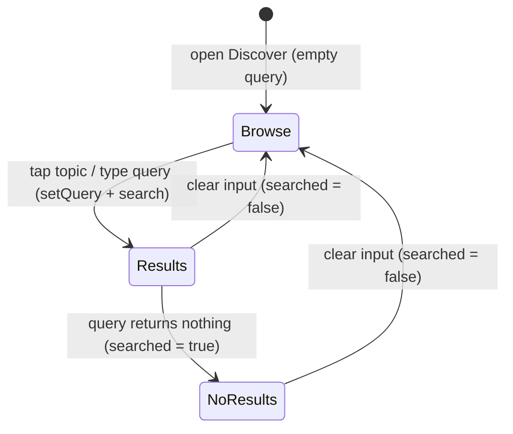

# feat: Mobile Discover Browse Topics

## Summary

Add a browse-topics empty state to the mobile Discover tab (`apps/mobile/app/(tabs)/watch.tsx`): six gradient "bubble" chips — the same categories the web search overlay shows — rendered when the search box is empty. Tapping a bubble fills the search input with its term and runs the existing search inline; clearing the box returns to the bubbles. New presentational components plus a hardcoded topics constant — no backend, GraphQL, or search-query changes.

---

## Problem Frame

When the Discover search box is focused and empty, the screen shows one dead-end line — _"Search for videos about any topic"_ (`apps/mobile/app/(tabs)/watch.tsx`, the `!searched && !loading` block). A user with no specific title in mind has nothing to act on. Web already solved this: focusing its search bar reveals six tappable category cards. This brings the same one-tap entry point to mobile, in a mobile-shaped form.

---

## Requirements

Carried from origin (`docs/brainstorms/2026-06-08-mobile-discover-browse-topics-requirements.md`).

**Topics & content**

- R1. The Discover empty state presents six browse topics matching web: Bible Stories, Parables, Animated, Study, Family, Christmas.
- R2. Each topic has a display label and a distinct search term (mirroring web's term per category); the search term runs the query, not the label.
- R3. The topic set is hardcoded in the mobile app — no fetch and no admin configuration.

**Interaction**

- R4. Topics appear only when the search input is empty and no search has run or returned.
- R5. Tapping a topic fills the input with its search term and runs the search inline on Discover, with no navigation away from the tab.
- R6. Once a search runs, the existing result grid (or the existing no-results state) replaces the topics.
- R7. Clearing the search input back to empty returns the user to the browse-topics state.

**Visual & accessibility**

- R8. Topics render as gradient "bubble" chips — rounded pills with a soft per-topic gradient fill, a small leading icon, and the label — wrapping to fit the viewport width.
- R9. Each topic keeps a distinct color and icon identity, reusing web's per-category palette where practical, within the app's existing typography, spacing, and color tokens.
- R10. Each bubble is an accessible, tappable button with press feedback and a label conveying that it searches that topic.

---

## Key Technical Decisions

- KTD1. Route the tap through the existing search path, not the query setter. `watch.tsx` has no `query`-keyed effect — `handleChangeText(text)` both sets `query` and schedules the debounced, stale-guarded `search(text)`. A bubble tap calls `setQuery(term)` then the existing `search(term)` `useCallback` directly (fires immediately, skipping the 300ms debounce, while reusing the same `requestIdRef` stale-guard). Calling `setQuery` alone would update the text but never search.
- KTD2. Clearing to empty returns to browse. `search("")` already resets `searched` to `false` (the `!trimmed` branch in `watch.tsx`), so R7 holds with no change — clearing the box re-renders the `!searched && !loading` block today. Optionally short-circuit the empty case in the change handler to skip the no-op fetch and the 300ms delay; that is an optimization, not a correctness requirement.
- KTD3. Soft per-topic gradients via `expo-linear-gradient` (`^15.0.8`, already installed, Expo Go-safe). Mirror the `Pressable → LinearGradient(flex:1) → row content` shape in `apps/mobile/src/components/sections/QuizButtonRenderer.tsx`. Build each fill from a per-topic base hex as `[hexToRgba(base, 0.35), hexToRgba(base, 0.12)]`. Never use the literal `"transparent"` — it renders as transparent black and dark-bands over a light stop (see `docs/solutions/mobile/linear-gradient-dark-banding-transparent-keyword.md`).
- KTD4. Icons from `@expo/vector-icons/Ionicons` (Expo Go-safe, already used in `apps/mobile/src/components/ui/HomeHeader.tsx`). No new dependencies; do not add `react-native-svg` or anything gesture-handler-adjacent.
- KTD5. Each bubble is a `Pressable` (not a plain `View`) with `accessibilityRole="button"` and an `accessibilityLabel`; the decorative glyph is hidden from the a11y tree (`accessibilityElementsHidden` + `importantForAccessibility="no-hide-descendants"`). A plain `View` would silently drop the role/label from the iOS a11y tree (see `docs/solutions/mobile/rn-view-accessible-required-for-accessibilityrole.md`); verify in the simulator, not by reading props.
- KTD6. Topics are a hardcoded constant module mirroring web's labels and lowercase search terms. Per-topic base color and Ionicons glyph are net-new design tokens introduced here (the codebase defines none), derived from web's category palette and softened for the dark background; final hex/alpha and glyph choices are tuned in the simulator.
- KTD7. Label uses `TEXT_PRIMARY` (`#f5f5f4`) at `typography.bodySmall` (14/20) with `fontFamily: "System"`; the glyph carries the per-topic color. Do not use `ACCENT` (`#CB333B`) for the small label text — it fails AA contrast at body size on the dark palette (`apps/mobile/src/lib/color.ts`). The bubble's `Pressable` carries a minimum height of 44 (iOS HIG / Material tap target) so short labels like "Study" stay thumb-safe.
- KTD8. Tests follow the repo's existing convention — pure-logic `.test.ts` files (the app ships 14 of these and no `.test.tsx`; `@testing-library/react-native` is not a dependency and is not being added). Unit-test the topics constant and any extracted pure handlers; verify component rendering, the tap-to-search flow, and accessibility in the simulator (`idb ui describe-all` + screenshots), per the project's verify-in-simulator discipline and `docs/solutions/mobile/rn-view-accessible-required-for-accessibilityrole.md`.

### Topic design tokens (directional — tune in sim)

Starting mapping; the implementer adjusts hex/alpha and glyph names against the running simulator (KTD6).

| Topic         | Label           | Search term     | Base color | Ionicons glyph        |
| ------------- | --------------- | --------------- | ---------- | --------------------- |
| Bible Stories | "Bible Stories" | `bible stories` | `#667EEA`  | `book-outline`        |
| Parables      | "Parables"      | `parables`      | `#F5576C`  | `chatbubbles-outline` |
| Animated      | "Animated"      | `animated`      | `#4FACFE`  | `film-outline`        |
| Study         | "Study"         | `study`         | `#43E97B`  | `bulb-outline`        |
| Family        | "Family"        | `family`        | `#FA709A`  | `people-outline`      |
| Christmas     | "Christmas"     | `christmas`     | `#DC2626`  | `star-outline`        |

---

## High-Level Technical Design

The bubbles live entirely inside the Discover screen's existing empty-state slot. The render condition is the same `!searched && !loading` flag that gates today's placeholder line; the tap path reuses the existing `search()` call. The only state change is resetting `searched` to `false` when the query empties.

Component shape: a presentational `TopicBubble` (gradient pill + glyph + label + press feedback + a11y) and a `BrowseTopics` container that maps the topics constant to bubbles in a wrapping row and exposes an `onSelect(term)` callback. `watch.tsx` renders `<BrowseTopics onSelect={...} />` in the empty-state block and wires `onSelect` to `setQuery(term)` + `search(term)`.

---

## Implementation Units

### U1. Topics constant and `TopicBubble` component

- **Goal:** A hardcoded topics module and a single reusable gradient-bubble chip.
- **Requirements:** R1, R2, R3, R8, R9, R10.
- **Dependencies:** none.
- **Files:**
  - Create `apps/mobile/src/lib/browseTopics.ts` — the six topics as `readonly` entries (`label`, `searchTerm`, `baseColor`, `glyph`), typed so `searchTerm` and `baseColor` are explicit.
  - Create `apps/mobile/src/lib/__tests__/browseTopics.test.ts` — pure-logic, matching the repo's `.test.ts` convention (KTD8).
  - Create `apps/mobile/src/components/search/TopicBubble.tsx`.
- **Approach:** `Pressable` (owns touch + a11y, `minHeight: 44`) wrapping a `LinearGradient` (`borderRadius` + `overflow: "hidden"`, horizontal sweep, `flex: 1`) with a row of `Ionicons` glyph + `Text` label. Gradient colors from `[hexToRgba(baseColor, 0.35), hexToRgba(baseColor, 0.12)]` (KTD3). Press feedback via `feedback.pressed` from `apps/mobile/src/styles/shared.ts`. Label `TEXT_PRIMARY` + `typography.bodySmall`; glyph tinted `baseColor`, size hardcoded (~16), hidden from a11y (KTD5, KTD7). `onPress` calls `onSelect(searchTerm)`.
- **Patterns to follow:** `apps/mobile/src/components/sections/QuizButtonRenderer.tsx` (Pressable→LinearGradient→row), `apps/mobile/src/components/ui/HomeHeader.tsx` (`glassPill` sizing, Ionicons usage), `apps/mobile/src/lib/color.ts` (`hexToRgba`, tokens), `apps/mobile/src/hooks/useTypography.ts`.
- **Test scenarios** (`browseTopics.test.ts`, pure-logic per KTD8):
  - Exports exactly six topics; each `label` and `searchTerm` matches the design-tokens table; every `searchTerm` is lowercase and non-empty.
  - `baseColor` and `glyph` are present and distinct per topic.
  - `TopicBubble` rendering, press → `onSelect(searchTerm)` (term, not label), and a11y (button role + label, decorative glyph hidden) are verified in the simulator — see Verification (no component-test library in the app, KTD8).
- **Verification:** Typecheck and `browseTopics.test.ts` pass. In the simulator (`idb ui describe-all`): a bubble renders with its label and soft gradient (no dark banding on the dark background), surfaces as a `button` with an accessibility label, and the decorative glyph is absent from the a11y tree.

### U2. Render the browse grid in Discover and wire tap + clear

- **Goal:** Show the six bubbles in the empty state, run a search on tap, and return to the bubbles when the query empties.
- **Requirements:** R4, R5, R6, R7.
- **Dependencies:** U1.
- **Files:**
  - Create `apps/mobile/src/components/search/BrowseTopics.tsx` — maps `browseTopics` to `TopicBubble`s in a wrapping row; props `onSelect(term)`.
  - Modify `apps/mobile/app/(tabs)/watch.tsx` — render `<BrowseTopics>` in the `!searched && !loading` empty-state block; wire `onSelect` to `setQuery(term)` + `search(term)` (KTD1).
  - Optional: extract the topic-select / empty-query logic into a pure helper (e.g. `apps/mobile/src/lib/searchInput.ts` + `apps/mobile/src/lib/__tests__/searchInput.test.ts`) so the decision is unit-testable (KTD8).
- **Approach:** Replace the placeholder `Text` in the empty-state block with `<BrowseTopics onSelect={handleSelectTopic} />`. `handleSelectTopic(term)` sets the input text and calls the existing stale-guarded `search(term)` immediately (KTD1). An empty query returns to the browse state via the existing `search("")` reset of `searched` (optionally short-circuited per KTD2). After a tap, `loading` becomes true and the bubbles give way to the screen's existing delayed search skeleton — no new in-flight state is needed. Bubbles never show while `loading` or after `searched` is true, so the existing result and no-results states are untouched (R6).
- **Patterns to follow:** the existing empty-state conditional, `handleChangeText`, and `search` `useCallback` in `apps/mobile/app/(tabs)/watch.tsx`; the mobile search guards in `docs/solutions/best-practices/mobile-search-ui-patterns-20260416.md` (reuse the `requestIdRef` path, do not add a second fetch).
- **Test scenarios:**
  - Pure-logic (`.test.ts`, KTD8): the extracted select / empty-query helper maps a non-empty term to a search and an empty term to a browse-state reset.
  - Simulator (`idb ui describe-all`, covers AE1–AE4): the empty Discover shows six topic `button`s (AE1); tapping one fills the input and renders results inline (AE2); a topic that returns nothing shows the existing no-results state, not the bubbles (AE3); clearing the input returns the six bubbles (AE4).
- **Execution note:** Keep the search path single — route the tap through the existing stale-guarded `search`, never a second fetch. Prefer extracting the select / empty-query logic into a pure helper so it is unit-testable; the wired route behavior is verified in the simulator, since the app has no route-component test harness.
- **Verification:** Typecheck and jest pass. In the simulator (`idb ui describe-all`): the empty Discover shows six `button` nodes with topic labels; tapping one fills the input and renders results inline; clearing the input returns to the six bubbles. Screenshot the gradients over the dark empty-state background to confirm no banding.

---

## Acceptance Examples

From origin; enforced by the test scenarios above.

- AE1. Empty Discover renders the six topic bubbles in place of the old placeholder text. (R1, R4, R8 — U2)
- AE2. Tapping "Christmas" sets the input to its term and renders its results inline. (R2, R5, R6 — U1, U2)
- AE3. A tapped topic that returns nothing shows the existing no-results state, not the bubbles. (R6 — U2)
- AE4. Clearing the input after results returns to the six bubbles. (R7 — U2)

---

## Scope Boundaries

- Admin-configurable or dynamically fetched topics — deferred; revisit if keeping web and mobile in sync becomes a maintenance pain.
- Search history, recent searches, and personalized or recommended topics — separate feature.
- Changes to the Home tab, the `search` query/GraphQL surface, the result cards, or result navigation — out of scope; reused as-is.
- Per-topic dedicated landing pages instead of running a search — out; tapping runs a search, matching web.

### Deferred to Follow-Up Work

- A shared cross-platform source for the six categories (web + mobile currently each hardcode them) — only if drift becomes a real cost.

---

## Risks & Dependencies

- Depends on the existing Discover search on `main` (`apps/mobile/app/(tabs)/watch.tsx`, the `SEARCH` op in `apps/mobile/src/lib/queries.ts`). The search hits admin anonymously (no bearer, per-IP rate limit) — the six terms are plain query text, so no new GraphQL surface (`docs/solutions/architecture-patterns/mobile-admin-data-layer-cutover-pattern-20260525.md`).
- Gradient banding risk if `"transparent"` slips into a `colors` array — mitigated by KTD3 and a sim screenshot.
- A11y-tree risk: role/label can silently miss the native tree — mitigated by building on `Pressable` (KTD5) and verifying with `idb ui describe-all`.

---

## Open Questions

Deferred to implementation, resolved against the running simulator.

- Final per-topic colors, alpha, and Ionicons glyph names (starting mapping in the design-tokens table).
- Whether to show a small "Browse" heading above the bubbles. (Layout is a wrapping row — see U2 — not a horizontal scroll.)

---

## Sources / Research

- Web prior art: `apps/web/src/lib/search-categories.ts` (the six categories + terms + gradients), `apps/web/src/components/SearchOverlay.tsx` (grid + tap-runs-search), `apps/web/src/components/SearchCategoryIcons.tsx` (per-category icons).
- Mobile target and patterns: `apps/mobile/app/(tabs)/watch.tsx` (Discover screen, empty-state slot, `handleChangeText`/`search`), `apps/mobile/src/components/sections/QuizButtonRenderer.tsx` (gradient-pill pattern), `apps/mobile/src/components/ui/HomeHeader.tsx` (`glassPill`, Ionicons), `apps/mobile/src/lib/color.ts`, `apps/mobile/src/hooks/useTypography.ts`, `apps/mobile/src/styles/shared.ts`.
- Learnings: `docs/solutions/mobile/linear-gradient-dark-banding-transparent-keyword.md`, `docs/solutions/mobile/rn-view-accessible-required-for-accessibilityrole.md`, `docs/solutions/best-practices/mobile-search-ui-patterns-20260416.md`, `docs/solutions/best-practices/expo-glass-effect-interactive-flash-2026-04-08.md`, `docs/solutions/architecture-patterns/mobile-admin-data-layer-cutover-pattern-20260525.md`.
