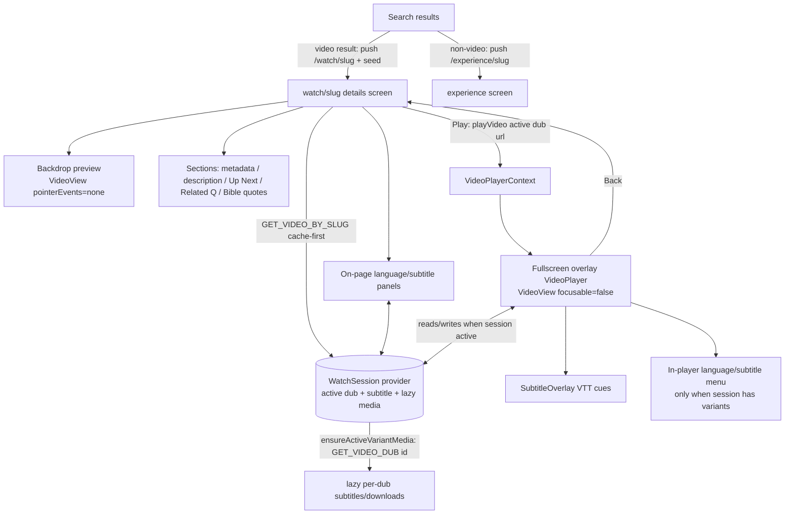

# feat: TV video-details page

## Summary

Add a video-details screen to `apps/tv`, reached when a viewer selects a search result. A muted cinematic backdrop previews the film while a focused Play hands off to the existing fullscreen overlay player; below it sit title/metadata, description, an Up Next rail, Related Questions, and a Bible-quotes carousel — with language & subtitle selection (on-page and in-player) and capability-gated Share/Download. Client-only change: the admin schema already exposes `videoBySlug` and `videoDub(id)`.

---

## Problem Frame

The TV app has no surface that shows what a video _is_. Selecting a search result routes to `/experience/{slug}`; the only path to playback is a card's `onPress` inside a rendered Experience, which jumps straight into a global fullscreen overlay. There is nowhere to see a video's description, languages, related questions, or siblings around playback. This plan adds that surface for TV, mirroring the web/mobile video-details experience at couch distance, and reuses the app's existing renderers, the overlay player, and the QR `LinkModal` rather than rebuilding them. See origin for the full problem frame and decision rationale (origin: `docs/brainstorms/2026-06-08-tv-video-details-page-requirements.md`).

---

## Requirements

R-IDs match the origin brainstorm 1:1 for traceability.

**Page & entry**

- R1. A video-details screen exists as its own TV screen, reached when a viewer selects a search result.
- R2. Selecting a search result navigates to the details screen rather than starting playback; experience-page video cards keep instant-play in v1.
- R3. The screen paints immediately with seed data (title, thumbnail) while the full payload loads.

**Backdrop preview & playback handoff**

- R4. The upper region shows a muted, looping autoplay backdrop, fading into warm stone, falling back to a cinematic still when no stream exists; it is non-interactive.
- R5. A focused Play control starts playback in the existing fullscreen overlay player; the details screen never becomes the playback surface.
- R6. The backdrop pauses while the overlay is open and resumes when it closes.
- R7. Returning from the overlay restores focus to the details screen.

**Language & subtitles**

- R8. The viewer can choose the audio dub on the details screen before playing; the chosen dub plays.
- R9. The viewer can toggle subtitles on/off and choose a subtitle language on the details screen.
- R10. The viewer can change audio dub and subtitles during fullscreen playback via an in-player menu, without exiting.
- R11. Active dub and subtitle selection are a single shared source of truth across the screen and the in-player menu, persisting across the screen ↔ fullscreen round trip.
- R12. Subtitles render as readable cues during fullscreen playback.
- R13. Selection surfaces are focusable-list overlays (checkmark on active row, crimson focus glow), not touch-style sheets.

**Content sections**

- R14. The screen shows title, metadata (label, duration, available-language count), and description.
- R15. An Up Next rail shows sibling videos under the same parent; selecting a card opens that video's details screen.
- R16. A Related Questions section shows the video's study questions as expandable rows; since the video data carries questions without inline answers, expanding presents a QR/CTA handoff rather than an in-page answer.
- R17. A Bible Quotes section shows the verses referenced by the video.

**Share & Download (capability-gated)**

- R18. Share and Download are capability-probed per platform: native intent when available, else a QR-to-phone handoff, else the action is hidden.
- R19. Share continues on the viewer's phone; Download continues the download on the phone. No file is stored on the TV.

**Data & performance**

- R20. The screen fetches a lean video + dub-list payload (excluding per-dub media) and lazily fetches subtitles/downloads only for the active dub.
- R21. Re-entering a previously viewed video reads from cache without a blocking refetch.

**TV UX & focus**

- R22. Every interactive element is D-pad focusable with the crimson focus treatment; layout respects the 80px safe-gutter and 10-foot type.
- R23. The screen follows Crimson Gallery — warm stone surfaces, sparing crimson accent, no borders.

---

## Key Technical Decisions

- KTD1. Extend the existing overlay player in place rather than building a new one. Live dub-switching, VTT subtitle rendering, and an in-player language/subtitle menu are added to `apps/tv/src/components/VideoPlayer.tsx`, gated on an active watch session so today's experience-card playback is unaffected. Keeps one playback path (origin KTD: hybrid model + reuse).
- KTD2. A global watch-session provider is the single source of truth for active dub + subtitle selection, ported from mobile's `WatchSessionProvider`. It wraps the app alongside `VideoPlayerProvider` so both the details screen's pickers and the overlay's in-player menu read/write the same state, satisfying R11 across the screen ↔ overlay round trip. The overlay is a global sibling of the Stack, so shared state — not prop drilling — is required.
- KTD3. Lean-bulk + lazy-per-dub fetch: a `GET_VIDEO_BY_SLUG` that omits per-dub `downloads` and `videoEdition.subtitles`, plus a lazy `GET_VIDEO_DUB(id)` for the active dub only, with Apollo `fetchPolicy: "cache-first"` + `returnPartialData: true` and a `WeakMap`-memoized normalizer. Videos carry thousands of dubs (birth-of-jesus: 2,259 → 9.5MB/13s if media is inlined); this is the proven mobile pattern (R20, R21).
- KTD4. Inline backdrop `VideoView` is wrapped in `<View pointerEvents="none">`; the fullscreen overlay `VideoView` uses `focusable={false}` directly and is NOT wrapped in `pointerEvents="none"`. These opposite rules are load-bearing — the wrong one black-screens the overlay (`AVPlayerLayer` compositing) or lets the backdrop steal D-pad focus. Both are documented TV bugs.
- KTD5. Up Next depends on the admin `Video.parents`/`Video.children` relation, whose labels are inverted on `main`. A live `videoBySlug(...).children` probe returns only self-references today, so after the normalizer's self-filter the sibling list is **empty** — not merely unordered. The 2-line admin `@relation` fix is therefore a **hard dependency** for a populated Up Next, not an optional follow-up: TV reads admin GraphQL directly, with no data-layer-flip gate in front of it. v1 ships Up Next **empty-but-stable** until that fix lands; the normalizer still self-filters and dedupes so the rail is correct the moment the relation is fixed. Admin is out of this plan's ownership — the fix is handed off; this plan does not edit admin.
- KTD6. Share and Download are capability-probed: native intent if the platform exposes one, else a QR handoff via the existing `LinkModal`, else the action is hidden. A living-room TV has no offline-viewing use case or guaranteed native share (R18, R19).
- KTD7. Existing section renderers are fed via small adapter objects rather than rebuilt: study questions → a `relatedQuestions`-shaped block with empty answers + a QR CTA; description → `TextRenderer` input; bible citations → a `bibleQuotes`-shaped block at reference level. Honors the renderers' aliased `@_unmask` field names (`rqHeading`, `textHeading`, `bqcHeading`).
- KTD8. The backdrop preview mirrors the non-interactive focus-driven hero pattern: the hero subtree holds no focusables, the page's first focusable owns initial focus, poster-hold masks the HLS swap flash, concurrent players are bounded to ≤2 (tvOS AVPlayer cap), overlaid gradients use `collapsable={false}` on Android and `hexToRgba(color, 0)` stops (never `"transparent"`).

---

## High-Level Technical Design



The overlay is shared infrastructure: when `playVideo` is invoked from an experience-card (no watch session), the overlay behaves exactly as today (plain playback, no menu, no subtitles). When invoked from the details screen, the session is populated and the overlay exposes the in-player menu and renders the active subtitle track.

---

## Output Structure

New files under `apps/tv` (existing files modified are listed per unit):

```
apps/tv/
├── app/watch/[slug].tsx                       # details screen route
├── src/
│   ├── contexts/WatchSessionProvider.tsx      # active dub + subtitle + lazy media
│   ├── components/watch/
│   │   ├── VideoBackdrop.tsx                   # muted non-interactive preview
│   │   ├── DetailsActionRow.tsx               # Play + Language/Subtitles/Share/Download
│   │   ├── UpNextRail.tsx                      # ContentRail + FocusableCard → details
│   │   ├── LanguagePanel.tsx                   # focused-list overlay
│   │   ├── SubtitlePanel.tsx                   # focused-list overlay
│   │   ├── SubtitleOverlay.tsx                 # VTT cue rendering
│   │   └── detailsAdapters.ts                  # video → renderer block shapes
│   └── lib/
│       ├── videoQueries.ts                     # GET_VIDEO_BY_SLUG + GET_VIDEO_DUB + fragments
│       ├── normalizeVideo.ts                   # WeakMap-memoized; defensive siblings
│       ├── dubMediaFetch.ts                    # dedupe ledger
│       ├── parseVtt.ts                         # VTT → cues
│       ├── pickLocalizedName.ts
│       ├── resolveDefaultLanguage.ts           # slug-keyed default resolution
│       └── muxUrl.ts                           # playbackId ↔ HLS helpers
```

The tree is a scope declaration, not a constraint; per-unit `Files` are authoritative.

---

## Implementation Units

### U1. Video data layer (lean + lazy queries)

- Goal: Define the TV-side `GET_VIDEO_BY_SLUG` (lean video + dub list, no per-dub media) and lazy `GET_VIDEO_DUB(id)` (downloads + `videoEdition.subtitles`), mirroring mobile.
- Requirements: R20, R21.
- Dependencies: none.
- Files: `apps/tv/src/lib/videoQueries.ts` (new), `apps/tv/src/lib/videoQueries.test.ts` (new).
- Approach: Define operations with `adminGraphql`/`AdminResultOf` from `@forge/admin-graphql`, mirroring `apps/mobile/src/lib/queries.ts` (`watchVideoFragment`, `watchDubMediaFragment`). Bulk fragment selects per-dub `documentId, slug, published, hls, duration, language{coreId,bcp47,slug,name}, muxVideo{playbackId}` plus `images`, `primaryLanguage`, `locales(locale)`, `parents{parent{...children{child}}}`, `studyQuestions`, `bibleCitations`; it deliberately omits `downloads` and `videoEdition.subtitles`. Pass `locale: "en"`. No admin/schema/codegen change — `videoBySlug`/`videoDub` already exist.
- Patterns to follow: `apps/mobile/src/lib/queries.ts`; existing TV operation style in `apps/tv/src/lib/queries.ts` (aliasing, `@_unmask`).
- Test scenarios:
  - Covers AE6. The bulk operation's selection set excludes `downloads` and `videoEdition.subtitles` (guards the payload regression).
  - Exported result types compile and expose the dub list + siblings + study questions + citations.
- Verification: typecheck passes; the operation shape matches the mobile template field-for-field except TV-local aliases.

### U2. Video normalizer + helpers

- Goal: Normalize the raw video into a TV consumer record (memoized), including defensive sibling derivation, slug-keyed default-language resolution, and Mux URL helpers.
- Requirements: R14, R15, R20, R21.
- Dependencies: U1.
- Files: `apps/tv/src/lib/normalizeVideo.ts` (new), `apps/tv/src/lib/pickLocalizedName.ts` (new), `apps/tv/src/lib/resolveDefaultLanguage.ts` (new), `apps/tv/src/lib/muxUrl.ts` (new), and colocated `.test.ts` for each.
- Approach: Port `apps/mobile/src/lib/normalizeVideo.ts` — `WeakMap`-memoize on the raw object to avoid re-normalizing thousands of dubs on re-entry. Siblings come from `parents?.[0]?.parent?.children`, with the self-reference dropped and dedupe by `documentId` (KTD5 — tolerates the inverted relation). `resolveDefaultLanguage` keys on language **slug**, not bcp47 (bcp47 is not unique), resolving persisted → device → primary → English → first. `muxUrl` provides `extractMuxPlaybackId(url)` and `muxHlsUrlFromPlaybackId(id)` so a `SearchResult.playbackId` seed can start playback.
- Execution note: Implement the normalizer and helpers test-first — the sibling self-filter and slug-keyed resolution are the bug-prone parts.
- Patterns to follow: `apps/mobile/src/lib/normalizeVideo.ts`; `apps/tv/src/lib/resolveImageUrl.ts`, `apps/tv/src/lib/types.ts` (`pickThumbnailUrl`).
- Test scenarios:
  - Covers AE6. Re-normalizing the same raw reference returns the memoized record (no re-walk).
  - Up Next, current (inverted) schema: a `children` array of only self-references yields an empty sibling list and the rail renders nothing without crashing — matches the live inverted-relation probe.
  - Up Next, post-fix schema: a `children` array of genuine siblings (including a stray self-reference and a duplicate) yields the siblings with self removed and duplicates collapsed (covers R15).
  - Default language resolves by slug; `ko-kmr` vs `ko` do not collide.
  - `extractMuxPlaybackId` / `muxHlsUrlFromPlaybackId` round-trip a Mux URL; non-Mux input returns null.
- Verification: unit tests green; normalizer returns the documented record shape.

### U3. Lazy dub-media fetch + watch-session provider

- Goal: A deduped lazy per-dub media fetcher and a global watch-session provider holding active dub + subtitle selection + lazy media, reset on video change.
- Requirements: R8, R9, R11, R20, R21.
- Dependencies: U1, U2.
- Files: `apps/tv/src/lib/dubMediaFetch.ts` (new), `apps/tv/src/contexts/WatchSessionProvider.tsx` (new), `apps/tv/app/_layout.tsx` (modify — wrap alongside `VideoPlayerProvider`), colocated `.test.ts`.
- Approach: Port `apps/mobile/src/lib/dubMediaFetch.ts` (`ensureDubMedia` with a `requested` Set; remove the id on failure so the next call retries; wrap the whole dispatch in try/catch so a synchronous throw releases the slot). Port `WatchSessionProvider` state: `video`, `activeVariantIndex`/`activeVariant` (clamped), `subtitleEnabled`, `activeSubtitleSlug`, `activeVariantMedia` (null = not loaded, distinct from loaded-empty `{[],[]}`), `activeVariantMediaLoading`/`Error`, `ensureActiveVariantMedia()` (calls `GET_VIDEO_DUB` at `cache-first`). Reset per-dub media + ledger on `video?.documentId` change. ("variant" is the ported state-field name for what the origin and UI call a "dub" — same concept.)
  - The port is a **structural rewrite, not an import removal**. Mobile's provider is woven through `useWatchPreferences`: `subtitleEnabled` is sourced from it, both default-resolution effects gate on its `preferencesReady`, and the setters persist through it. The TV port instead holds `subtitleEnabled` as local `useState`, replaces the `preferencesReady` gate with `true` (or a TV readiness signal) in both resolution effects, and strips the persist calls — otherwise default-language resolution silently never fires and every video opens on `variants[0]`. Drop mobile's `snackbarMessage`/`setSnackbarMessage` (no TV consumer — Download is a QR handoff).
  - **Nesting (correctness):** `WatchSessionProvider` must **wrap** `VideoPlayerProvider` (be the outer/ancestor provider) so the overlay `VideoPlayer` rendered inside `VideoPlayerProvider` can call `useWatchSession()`; place it **below** the existing `ErrorBoundary` so a provider throw degrades to the error screen, not a white screen.
  - **Truly inert when empty:** guard the resolution effects and Apollo usage on a populated `video`, so screens that never call `setVideo` register zero effects/queries. `setVideo` is called **only** from `watch/[slug]`; experience-card playback never populates the session.
- Execution note: Test-first for the ledger and state transitions.
- Patterns to follow: `apps/mobile/src/lib/dubMediaFetch.ts`, `apps/mobile/src/contexts/WatchSessionProvider.tsx`; lazy Apollo via `getApolloClient()`.
- Test scenarios:
  - Dedupe ledger: concurrent requests for the same dub id fetch once; a failed fetch is removed and a subsequent call retries; a synchronous throw in dispatch releases the slot (no permanent wedge).
  - Session distinguishes null / loading / error / loaded-empty media states.
  - Changing `video.documentId` clears prior media and the ledger.
  - Active variant index clamps to the variants length.
- Verification: unit tests green; provider mounts in `_layout` without breaking existing playback.

### U4. VTT parsing + TV SubtitleOverlay

- Goal: Parse VTT into cues and render the active cue as a non-interactive overlay during playback.
- Requirements: R12.
- Dependencies: none (standalone; consumed by U7).
- Files: `apps/tv/src/lib/parseVtt.ts` (new), `apps/tv/src/components/watch/SubtitleOverlay.tsx` (new), `apps/tv/src/lib/parseVtt.test.ts` (new).
- Approach: Port `apps/mobile/src/lib/parseVtt.ts` (cue parse, tag stripping, SMPTE-offset normalization). Port `SubtitleOverlay` — validate the VTT URL (`validateActionUrl`, AbortController), fetch+parse, binary-search the active cue on a ~100ms (playing) / ~400ms (paused) poll of `player.currentTime`, render absolute-bottom `Animated.Text` with `pointerEvents="none"`, using `scale()` sizing and `COLORS`/`hexToRgba`.
- Patterns to follow: `apps/mobile/src/lib/parseVtt.ts`, `apps/mobile/src/components/watch/SubtitleOverlay.tsx`.
- Test scenarios:
  - `parseVtt` parses well-formed cues, strips inline tags, and normalizes a 01:00:00-offset file to 0:00.
  - Active-cue selection returns the correct cue at a given time and nothing in a gap.
- Verification: parse tests green; overlay renders cues against a mock player time source.

### U5. Video-details screen

- Goal: The `watch/[slug]` screen — backdrop preview, metadata, description, Up Next, Related Questions, Bible quotes, the action row, and capability-gated Share/Download — painting from seed then full data.
- Requirements: R1, R3, R4, R5, R6, R7, R14, R15, R16, R17, R18, R19, R22, R23.
- Dependencies: U2, U3.
- Files: `apps/tv/app/watch/[slug].tsx` (new), `apps/tv/src/components/watch/VideoBackdrop.tsx` (new), `DetailsActionRow.tsx` (new), `UpNextRail.tsx` (new), `detailsAdapters.ts` (new), colocated `.test.tsx`. Reuses `src/components/sections/RelatedQuestionsRenderer.tsx`, `TextRenderer.tsx`, `BibleQuotesCarouselRenderer.tsx`, `FocusableCard.tsx`, `ContentRail.tsx`, `TVFocusGuideView.tsx`, `LinkModal.tsx`.
- Approach: `useLocalSearchParams<{ slug; seed? }>()`; query `GET_VIDEO_BY_SLUG` at `cache-first` + `returnPartialData: true`; seed first paint from `SearchResult.playbackId`/`title`/`imageUrl`. **Seed is untrusted** (deep links are externally addressable): a new `decodeWatchSeed` must replicate mobile's sanitization — `imageUrl` through `resolveImageUrl`, `playbackId` kept only if `validateStreamingUrl(muxHlsUrlFromPlaybackId(id))` passes, malformed JSON/types drop to a null seed (skeleton). Publish the normalized video into the watch session.
  - `VideoBackdrop` mirrors `HomeHero`/`VideoHeroRenderer` (muted loop, poster-hold, `pointerEvents="none"` wrapper, `collapsable={false}` on Android, gradient via `hexToRgba(_,0)`); non-interactive, pauses when `VideoPlayerContext` state `isVisible` (R6).
  - **Initial focus:** the Play button receives a one-shot `hasTVPreferredFocus` on mount (cleared via `useEffect`); the same one-shot restores focus to Play when the overlay dismisses (resolves R7 → Play is the restore target; last-focused tracking deferred). Play calls `playVideo(activeVariant.hls, title, subtitle)` — `hls` validated via `validateStreamingUrl` at the call site (R5).
  - **Action row** order `[Language] [Subtitles] [Play] [Share] [Download]` (Play centered as the crimson anchor), wrapped in a `TVFocusGuideView` so D-pad LEFT/RIGHT traverses it and focus can't escape upward into the non-interactive backdrop.
  - **Degraded states:** when a section has zero items after normalization, omit the heading and content entirely (no empty-state copy) — Up Next (no siblings → no rail), Related Questions (no questions → no section), Bible Quotes (no citations → no section). Below-fold sections render only after the full query resolves (seed paints title/poster first; no per-section spinners).
  - Up Next uses `ContentRail` + `FocusableCard` whose `onPress` does `router.push('/watch/{siblingSlug}')` (R15) — not `playVideo`. Feed `RelatedQuestionsRenderer`/`TextRenderer`/`BibleQuotesCarouselRenderer` via `detailsAdapters.ts` using **TV's aliased field names** (`rqHeading`, `textHeading`, `bqcHeading`) and a per-question `id` (KTD7). Related Questions need a QR-handoff-on-expand path: either add an `onExpand`/CTA prop to the shared renderer (verify the Experience-screen call site is unaffected) or build a details-local question list — the shared renderer shows `answer` inline today and has no QR path. Share/Download/QR CTAs run `validateActionUrl` before constructing the `LinkModal`; fail → treat as capability-unavailable and hide (R18, R19). Bible quotes render at reference level (book/chapter/verse synthesized into `reference`, empty `text`) — see Open Questions for the verse-text fork.
- Patterns to follow: `apps/tv/app/experience/[slug].tsx` (screen scaffold, `useQuery`, normalize, ScrollView), `apps/tv/src/components/HomeHero.tsx` + `sections/VideoHeroRenderer.tsx` (backdrop), `apps/mobile/app/watch/[slug].tsx` (composition + adapters).
- Test scenarios:
  - Covers AE1. When `VideoPlayerContext` reports the overlay visible, the backdrop pauses; on close it resumes.
  - Covers AE4. With no native share capability, Share renders a QR; with neither native nor QR-capable, the action is hidden.
  - Covers AE5. Expanding a study question (no answer) opens a QR CTA, not an inline answer.
  - Seed paints title/poster before the full query resolves; full data replaces it without flush of focus.
  - Play invokes `playVideo` with the active dub's HLS, not the base URL.
  - An Up Next card navigates to `/watch/{siblingSlug}` and does not start playback.
  - Description, Related Questions, and Bible quotes render through the adapters with correct aliased fields.
- Verification: screen renders from seed and full data; all sections present; focus reachable per R22; Crimson Gallery tokens used (R23).

### U6. On-page language & subtitle panels

- Goal: Focused-list overlay panels on the details screen for choosing dub and subtitles, lazy-loading the active dub's media on open.
- Requirements: R8, R9, R11, R13.
- Dependencies: U3, U5.
- Files: `apps/tv/src/components/watch/LanguagePanel.tsx` (new), `apps/tv/src/components/watch/SubtitlePanel.tsx` (new), colocated `.test.tsx`.
- Approach: Full-screen dimmed overlay with a `TVFocusGuideView` trapping focus, a focusable list (`FocusableCard` rows), checkmark on the active row, crimson glow on focus (R13). Language list reads `session.video.variants`; selecting sets `activeVariantIndex`; a published dub with `hls == null` renders as a disabled/annotated row (not selectable). Subtitle panel calls `ensureActiveVariantMedia()` on open (lazy `GET_VIDEO_DUB`) and renders all four media states: a non-focusable "Loading…" row while loading, a non-focusable error row on failure, a "No subtitles available" row when loaded-empty, and the list otherwise — toggling `subtitleEnabled` / setting `activeSubtitleSlug` (keyed by slug). The panel's dismiss affordance stays focusable in every state so the viewer is never trapped in an empty panel. No bottom sheets.
- Patterns to follow: `apps/tv/src/components/LinkModal.tsx` (full-screen overlay + close), `apps/tv/src/components/sections/RelatedQuestionsRenderer.tsx` (focus rows), DESIGN.md §4 selection-panel vocabulary.
- Test scenarios:
  - Covers AE2. Selecting a non-default dub updates the session; the value persists when re-opening the panel.
  - Opening the subtitle panel triggers `ensureActiveVariantMedia`; loading and error states render; loaded list reflects the active dub's subtitles.
  - Subtitle selection is keyed by slug and survives a dub switch where the same subtitle slug exists.
- Verification: panels render as focusable-list overlays; selections write through to the session.

### U7. Overlay player extension (dub-switch, subtitles, in-player menu)

- Goal: Extend the fullscreen overlay to switch dubs live, render VTT subtitles, and present an in-player language/subtitle menu — only when a watch session with variants is active.
- Requirements: R5, R10, R11, R12.
- Dependencies: U3, U4, U5.
- Files: `apps/tv/src/components/VideoPlayer.tsx` (modify), `apps/tv/src/contexts/VideoPlayerContext.tsx` (modify only if a richer handoff signal is needed), `apps/tv/src/components/watch/InPlayerMenu.tsx` (new), colocated `.test.tsx`.
- Approach:
  - **Refactor first (load-bearing).** The existing overlay calls `useVideoPlayer(streamingUrl)` on a _prop_ — safe today only because the overlay unmounts/remounts per `playVideo`. Live switching removes that safety. Before adding `replaceAsync`, refactor to a frozen `creationSource = useRef(initialUrl).current`, derive the _current_ source from `useWatchSession().activeVariant?.hls` (falling back to the prop when no session is active), and track `loadedUrlRef` separately. Add a characterization test capturing today's remount-per-play behavior so the change is visible, and assert the player instance identity is **stable** across a dub switch (not recreated).
  - **Switch mechanics.** On active-dub change, compare by Mux playback id; if equal, **no-op** (do not reset/rebuffer — only the subtitle slug updates from the session). Otherwise `player.replaceAsync(url)` (fallback `player.replace(url, true)`), re-`play()` if `wasPlaying`; the play/pause toggle reads live `player.playing`. Guard rapid switches with a "switch-in-flight" ref so only the latest target resumes. Validate `activeVariant.hls` with `validateStreamingUrl` before it reaches the player.
  - **Subtitles.** Disable Mux auto-subtitle tracks (`player.subtitleTrack = null` on `availableSubtitleTracksChange`/`subtitleTrackChange`/`sourceLoad`) and render `SubtitleOverlay` from the session's active subtitle (R12). `SubtitleOverlay` is a passive consumer — its poll must not call `scheduleHide`/`revealControls`.
  - **Session gate (correctness).** The in-player menu shows only when the overlay's `state.currentUrl` **matches** the session's `activeVariant.hls` — not merely "any session populated" — so a stale session from a prior details visit does not attach a menu (or apply prior selections) to an experience-card play. Clear the session (`setVideo(null)`) on details-screen unmount as a second guard.
  - **In-player menu.** `InPlayerMenu` is a `TVFocusGuideView` with `trapFocus*` while open; on close, focus returns to the play/pause button via a one-shot `hasTVPreferredFocus`. It renders loading / error / "no subtitles" rows (mirroring U6) without ejecting focus from the overlay. A published dub with `hls == null` is shown disabled. Opening the menu suppresses auto-hide; opening from a hidden-chrome state is not supported (press D-pad to reveal first).
  - Keep the overlay `VideoView` `focusable={false}` and NOT wrapped in `pointerEvents="none"` (KTD4). Integrate with the existing auto-hide state machine: gate the focus-catcher on the synchronous focusability flag, capture `Animated.CompositeAnimation` handles with `if (finished)` guards, keep the `useTVEventHandler` denylist.
- Execution note: Characterization-first. The overlay's async-native-event state machine has a documented history of bugs that survive manual QA and green CI — add characterization coverage before changing behavior, and run a Tier-2 `/ce-code-review` (reliability/correctness) before push.
- Patterns to follow: `apps/mobile/src/components/watch/VideoPlayer.tsx` (frozen source + `replaceAsync` + disable Mux subs), `apps/tv/src/components/VideoPlayer.tsx` (existing chrome, auto-hide, `TVFocusGuideView` traps), DESIGN.md §4 (menu as focused-list overlay).
- Test scenarios:
  - Covers AE3. Switching subtitle language via the in-player menu updates cues without leaving playback; the details screen reflects the same selection on return.
  - A dub switch via `replaceAsync` preserves the playing state and does not release the player (no black/stuck frame).
  - The in-player menu is absent when `playVideo` is called without a watch session (experience-card playback unchanged).
  - Subtitles render and update as `currentTime` advances; Mux auto-subtitle tracks stay disabled.
  - Opening the menu suppresses auto-hide; closing it resumes the inactivity timer.
- Verification: live switching works on a tvOS simulator with the actual rendered frame visible (not just controls); experience-card playback is byte-for-byte unchanged in behavior.

### U8. Route search results to the details screen

- Goal: Send video search results to `/watch/{slug}` (with seed); keep non-video results on `/experience/{slug}`.
- Requirements: R1, R2.
- Dependencies: U5.
- Files: `apps/tv/src/components/search/SearchResultsGrid.tsx` (modify), colocated `.test.tsx`.
- Approach: In `openResult`, branch on `result.type`: `video` → `router.push('/watch/{slug}?seed=...')` with an encoded seed built from `playbackId`/`title`/`imageUrl`; other types → existing `/experience/{slug}`. No change to `ResultCard`/`ResultsList`.
- Patterns to follow: existing `SearchResultsGrid.openResult`; mobile's `watchSeed` encode (`apps/mobile/src/lib/watchSeed.ts`).
- Test scenarios:
  - Covers F1. A `video` result pushes `/watch/[slug]` with a sanitized, decodable seed.
  - A non-video result still pushes `/experience/[slug]`.
- Verification: selecting a video search result lands on the details screen with an instant seed paint.

---

## Scope Boundaries

**Deferred for later** (origin):

- Routing experience-page video cards through the details screen — they keep instant-play in v1.
- Any richer on-page engagement surface beyond Related Questions (e.g., a web-style floating question panel).

**Outside scope** (origin):

- Offline / local download to TV storage — Download is a QR handoff only.
- Editorial Experience-override composition of the video page (video-derived, not SDUI-driven).
- A series/collection page variant.

**Deferred to follow-up work** (plan-local):

- The upstream admin `Video.parents`/`Video.children` relation-label fix (2-line `@relation` swap + `db:generate`, no migration). This is a **hard dependency for a populated Up Next** (TV reads admin directly, no data-layer-flip gate) — v1 ships the rail empty-but-stable until it lands. Handed off — not performed in this plan.
- Cross-restart persistence of the viewer's dub/subtitle preference (mobile's `WatchPreferencesProvider` + AsyncStorage). v1 keeps selection in memory only; R11's "persist" scope is the screen ↔ fullscreen round trip, not across navigation/restart.
- Full Bible verse-text fetch on TV (porting mobile's `useBibleVerses`) if reference-level quotes prove insufficient.

---

## Risks & Dependencies

- The overlay player is shared infrastructure. The biggest risk is regressing existing experience-card playback while adding session-gated behavior. Mitigation: gate every new behavior on an active session; add an explicit "no session ⇒ unchanged" test (U7); characterization-first; Tier-2 review before push.
- The overlay's async-native-event state machine is bug-prone (three documented recurrences, all surviving manual QA). Mitigation: ref-mirror + eager-sync, captured `Animated` handles, focusability-vs-visibility flag separation, `useTVEventHandler` denylist (U7).
- Inverted admin relation (decision-changing): on current `main`, `videoBySlug(...).children` returns only self-references, so Up Next renders **empty** after the normalizer's self-filter. A populated rail is **blocked on** the upstream 2-line `@relation` fix — a hard dependency, since TV reads admin directly. v1 accepts empty-but-stable Up Next until then; verify against a live `children` response before claiming the rail is populated.
- Dependency: admin schema `videoBySlug` + `videoDub(id)` (already present — no admin work, no codegen). If a TV fragment ever adds a not-yet-deployed admin field, ship admin-first and regenerate `@forge/admin-graphql` — not expected here.
- Platform: `EXPO_TV=1 npx expo prebuild --clean` required when switching targets; New Architecture must stay disabled; dev-client only.

---

## System-Wide Impact

- `apps/tv/app/_layout.tsx` gains a global watch-session provider wrapping the Stack — a new app-wide context, but inert for screens that don't populate it.
- `apps/tv/src/components/VideoPlayer.tsx` changes behavior for all playback paths; the session gate keeps experience-card playback unchanged but the file is now exercised by two callers with different feature sets.
- Search result selection changes destination for `video`-typed results (behavior change on an existing screen, scoped by `result.type`).

---

## Sources / Research

- Acceptance Examples AE1–AE6 and full flows are carried from origin: `docs/brainstorms/2026-06-08-tv-video-details-page-requirements.md`.
- Overlay player + handoff: `apps/tv/src/components/VideoPlayer.tsx`, `apps/tv/src/contexts/VideoPlayerContext.tsx`, `apps/tv/app/_layout.tsx`.
- Backdrop / focus-driven hero: `apps/tv/src/components/HomeHero.tsx`, `apps/tv/src/components/sections/VideoHeroRenderer.tsx`; learning `docs/solutions/best-practices/tv-focus-driven-hero-patterns-20260420.md`.
- Inline-vs-overlay VideoView rule: `docs/solutions/ui-bugs/tv-videoview-steals-dpad-focus-20260413.md`, `docs/solutions/ui-bugs/tv-videoplayer-pointerevents-blocks-avplayerlayer-tvos-20260415.md`.
- Async-native-event patterns: `docs/solutions/design-patterns/rntvos-video-overlay-async-native-event-patterns-2026-04-23.md`.
- Lean-bulk + lazy-per-dub: `docs/solutions/design-patterns/lean-bulk-lazy-per-item-graphql-fetch-20260604.md`; templates `apps/mobile/src/lib/queries.ts`, `normalizeVideo.ts`, `dubMediaFetch.ts`, `contexts/WatchSessionProvider.tsx`.
- Live dub-switching + freeze-the-source: `docs/solutions/best-practices/mobile-video-detail-page-patterns-20260527.md`, `apps/mobile/src/components/watch/VideoPlayer.tsx`, `apps/mobile/src/components/watch/SubtitleOverlay.tsx`, `apps/mobile/src/lib/parseVtt.ts`.
- Inverted relation: `docs/solutions/database-issues/prisma-video-relation-inverted-back-references-20260514.md`.
- Reusable renderers/primitives: `apps/tv/src/components/sections/{RelatedQuestionsRenderer,TextRenderer,BibleQuotesCarouselRenderer}.tsx`, `apps/tv/src/components/{FocusableCard,ContentRail,TVFocusGuideView,LinkModal}.tsx`.
- Search routing: `apps/tv/src/components/search/SearchResultsGrid.tsx`, `apps/tv/app/search.tsx`.
- Conventions: `apps/tv/CLAUDE.md`, `apps/tv/.stitch/DESIGN.md`; gradient banding `docs/solutions/mobile/linear-gradient-dark-banding-transparent-keyword.md`.

---

## Open Questions

**Deferred to planning — resolved:**

- Route path → `apps/tv/app/watch/[slug].tsx` (mirrors mobile). Resolved (U5).
- Shared session mechanism → global watch-session provider that **wraps** `VideoPlayerProvider`, below `ErrorBoundary` (KTD2, U3). Resolved.
- Subtitle rendering in the overlay → port `parseVtt` + `SubtitleOverlay`, disable Mux auto-subs (U4, U7). Resolved.
- Up Next renderer → `ContentRail` + `FocusableCard` navigating to details, not `VideoCardRenderer` instant-play (U5). Resolved.
- Initial + back-restore focus (R7) → the Play button via one-shot `hasTVPreferredFocus` (U5). Resolved.

**Deferred to implementation:**

- Bible quotes depth: v1 renders reference-level quotes (book/chapter/verse) via the existing carousel; whether to port mobile's `useBibleVerses` for full verse text is a follow-up if reference-level proves insufficient.
- Exact in-player menu placement within the overlay's bottom control panel (new control vs new row) — settle during U7 against the live focus layout.
