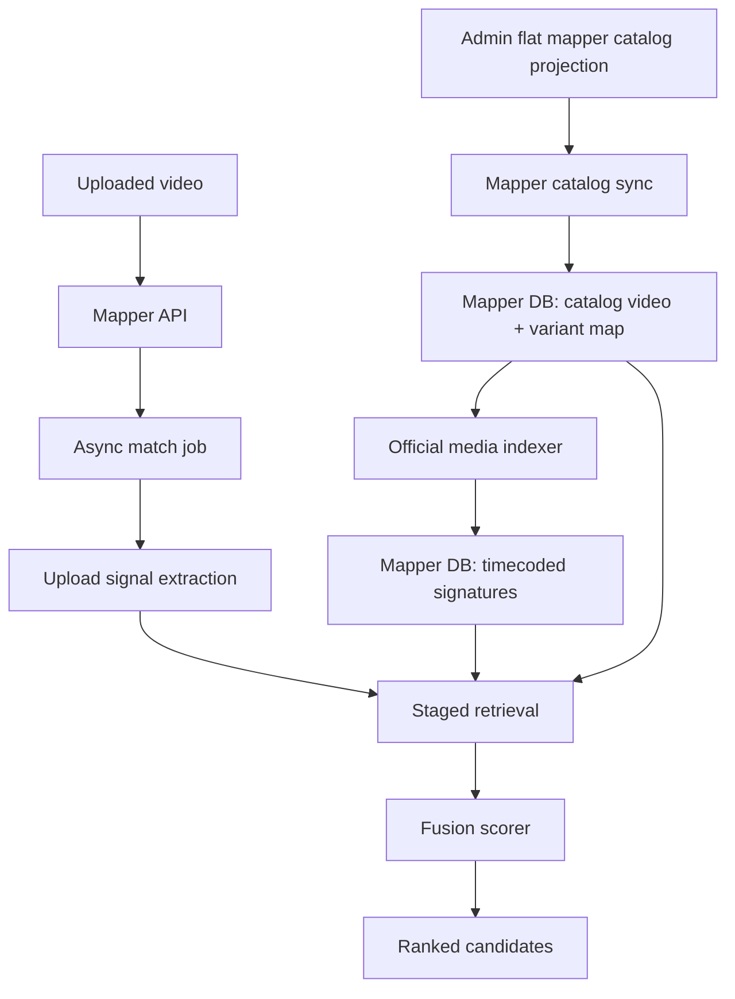

# feat: YouTube video mapper broad-catalog prototype

## Summary

Build the first broad-catalog prototype for `apps/yt-video-mapper-backend`: a
mapper-owned database, Admin-fed Core ID catalog map, official media signature
indexer, async upload jobs, staged retrieval, and fused ranked candidates.

## Problem Frame

The mapper needs to attribute an uploaded external video back to Core
identifiers: `coreId` from `Video.coreId` and `videoVariantId` from
`VideoDub.coreId`. Existing Forge/Admin scene and transcript embeddings are
useful context, but this service needs identity-oriented media signatures and
async job state with a lifecycle separate from Admin's catalog.

The prototype should start from broad catalog coverage, not a hand-picked
catalog-only slice. That means the catalog feed must be bounded and flat, the
indexer must be resumable, and operators need a lightweight Core ID map with
titles for every included source video.

## Requirements

- R1. The mapper stores a lightweight catalog map keyed by `coreId`, including
  the selected display title for each included video.
- R2. The mapper stores variant rows keyed by Core `videoVariantId`, with enough
  Dub, language, edition, duration, and media-source metadata to index and rank
  candidates.
- R3. Catalog ingestion reads from Admin as source of truth and does not import
  Admin code or call Core directly.
- R4. Admin exposes a bounded flat mapper catalog projection so broad indexing
  does not depend on nested `videos { dubs }` fan-out.
- R5. Official media indexing is idempotent, resumable, and records per-variant
  failures without aborting the broad catalog run.
- R6. Official media indexes store compact timecoded signatures, not raw
  official videos.
- R7. Uploaded videos are processed through async jobs and raw uploaded media is
  not retained long-term by default.
- R8. Public job results return a ranked `candidates` list whose entries contain
  `coreId`, `videoVariantId`, `confidence`, and `matchStrength`.
- R9. Retrieval is staged: visual/source retrieval first, variant ranking second,
  fusion scoring last.
- R10. Evidence breakdown stays internal in v1, but the system stores enough
  internal evidence to tune confidence and debug surprising rankings.
- R11. Model-assisted video comparison is deferred until the signature retrieval
  prototype is validated.
- R12. The prototype includes a validation harness with labeled uploaded samples
  so broad catalog indexing can be evaluated without exposing evidence publicly.

## High-Level Technical Design

Admin remains the catalog authority. The mapper keeps a derived catalog map and
matching index because those records are not editorial data and have different
refresh, failure, and retention behavior.

## Key Technical Decisions

- **KTD1. Use Admin's GraphQL contract for catalog data.** Add a bounded flat
  Admin projection for mapper indexing and consume it through
  `@forge/admin-graphql`; do not cross-import Admin services from the mapper.
- **KTD2. Store a minimal catalog mirror, not a duplicate catalog.** The mapper
  keeps `coreId`, title, and variant/media fields needed for matching, while
  Admin remains source of truth for the full Core-synced model.
- **KTD3. Prefer downloadable renditions for official indexing.** Use
  `VideoDubDownload.url` when an acceptable MP4 rendition exists, with HLS/DASH
  fallback recorded as a media-source decision.
- **KTD4. Make indexing resumable at the variant level.** Broad catalog runs will
  encounter missing media, network failures, and long videos; one bad variant
  should not poison the run.
- **KTD5. Start with deterministic media signatures.** Use visual frame
  signatures, audio fingerprints, subtitles/transcript text, and duration
  structure before adding model-assisted comparison.
- **KTD6. Use fusion scoring as the public ranking boundary.** Individual
  signals can evolve, but only the fused candidate list is public in v1.

## Implementation Units

### U1. Admin flat mapper catalog projection

**Goal:** Provide a bounded, flat Admin read model for broad mapper catalog
sync.

**Requirements:** R1, R2, R3, R4.

**Files:**

- `apps/admin/src/services/video-mapper-catalog.service.ts`
- `apps/admin/src/services/video-mapper-catalog.service.test.ts`
- `apps/admin/src/graphql/types/video-mapper-catalog.ts`
- `apps/admin/src/graphql/schema.ts`
- `apps/admin/src/graphql/schema.test.ts`
- `packages/admin-graphql/src/admin-graphql-env.d.ts`
- `packages/admin-graphql/src/index.ts`

**Approach:**

- Add a service-mediated flat projection that pages rows by `VideoDub`, not by
  nested `Video.dubs`.
- Include the Core-facing fields the mapper needs: `coreId`, selected title,
  title locale, local Admin video ID, `videoVariantId`, local Dub ID, edition
  Core ID, language identifiers, duration, playback URLs, and download
  renditions.
- Gate the projection behind an internal/service permission, matching the
  posture of Admin's existing enrichment metadata lookup.
- Regenerate `@forge/admin-graphql` after the Admin schema changes, then define
  the mapper catalog query in the consuming mapper app using the generated
  Admin GraphQL contract.

**Test scenarios:**

- Paginates by Dub rows and returns stable ordering across pages.
- Omits deleted videos and deleted dubs.
- Includes a title for each included `coreId`, using the configured fallback
  order.
- Includes downloads and HLS/DASH fields without requiring a nested all-dubs
  video query.
- Enforces the intended internal permission.

**Verification:**

- `pnpm --filter @forge/admin test video-mapper-catalog`
- `pnpm --filter @forge/admin schema:print`
- `pnpm --filter @forge/admin-graphql generate`
- `pnpm --filter @forge/admin-graphql typecheck`

### U2. Mapper database and configuration foundation

**Goal:** Give the mapper its own database schema and configuration for catalog
maps, index runs, signatures, jobs, candidates, and internal evidence.

**Requirements:** R1, R2, R5, R6, R7, R10.

**Files:**

- `apps/yt-video-mapper-backend/prisma/schema.prisma`
- `apps/yt-video-mapper-backend/package.json`
- `apps/yt-video-mapper-backend/.env.example`
- `apps/yt-video-mapper-backend/src/config/env.ts`
- `apps/yt-video-mapper-backend/src/db/client.ts`
- `apps/yt-video-mapper-backend/src/db/schema.test.ts`

**Approach:**

- Add Prisma to the mapper app, following the app-local Prisma posture used by
  `apps/auth` and `apps/mastra-gateway`.
- Model these groups:
  - catalog videos keyed by `coreId`, with selected title and inclusion state;
  - catalog variants keyed by `videoVariantId`, linked to `coreId`;
  - catalog sync/index runs with counts and failure summaries;
  - timecoded visual, audio, and text signatures;
  - async match jobs, candidate rows, and internal evidence rows.
- Keep raw upload storage paths short-lived and separate from permanent match
  results.

**Test scenarios:**

- Schema enforces unique `coreId` and `videoVariantId`.
- Candidate rows can store multiple variants for the same `coreId`.
- Evidence rows are internal and linked to a match job and candidate.
- Index runs can be resumed without duplicating signatures.

**Verification:**

- `pnpm --filter @forge/yt-video-mapper-backend db:generate`
- `pnpm --filter @forge/yt-video-mapper-backend typecheck`
- `pnpm --filter @forge/yt-video-mapper-backend test`

### U3. Broad catalog sync and Core ID title map

**Goal:** Populate the mapper's broad catalog map and variant table from Admin.

**Requirements:** R1, R2, R3, R4.

**Files:**

- `apps/yt-video-mapper-backend/src/services/admin-graphql-client.ts`
- `apps/yt-video-mapper-backend/src/services/catalog-sync.ts`
- `apps/yt-video-mapper-backend/src/services/catalog-sync.test.ts`
- `apps/yt-video-mapper-backend/src/scripts/sync-catalog.ts`
- `apps/yt-video-mapper-backend/README.md`

**Approach:**

- Add an Admin GraphQL client with injectable fetch, service bearer
  configuration, bounded retries, and safe error messages.
- Page through the Admin mapper catalog projection and upsert catalog video and
  variant rows.
- Store the selected title on the catalog video row so every included `coreId`
  can be inspected without re-querying Admin.
- Record missing media-source blockers per variant but keep the catalog row for
  observability.

**Test scenarios:**

- Sync creates and updates catalog video rows with titles.
- Sync creates and updates variant rows keyed by `videoVariantId`.
- Sync handles pagination and resumes after a failed page.
- Sync records variants with no usable media URL as non-indexable, not missing.
- Sync does not delete catalog rows on a partial Admin failure.

**Verification:**

- `pnpm --filter @forge/yt-video-mapper-backend test catalog-sync`
- `pnpm --filter @forge/yt-video-mapper-backend typecheck`

### U4. Official media signature indexer

**Goal:** Process broad catalog variants into compact reusable media signatures.

**Requirements:** R5, R6, R9, R11.

**Files:**

- `apps/yt-video-mapper-backend/src/services/media-source-selector.ts`
- `apps/yt-video-mapper-backend/src/services/media-extraction.ts`
- `apps/yt-video-mapper-backend/src/services/signature-indexer.ts`
- `apps/yt-video-mapper-backend/src/services/signature-indexer.test.ts`
- `apps/yt-video-mapper-backend/src/scripts/index-official-media.ts`
- `apps/yt-video-mapper-backend/railway.toml`

**Approach:**

- Select the best official source per variant, preferring downloadable MP4
  renditions before HLS/DASH fallback.
- Wrap media extraction behind an adapter so FFmpeg/ffprobe and any future
  fingerprint tools are isolated from matching logic.
- Generate timecoded visual frame signatures and audio signatures, plus text
  signatures from available official subtitles.
- Store signatures with `coreId`, `videoVariantId`, offset, duration, signature
  type, algorithm version, and source media metadata.
- Keep concurrency bounded and record per-variant failures for retry.

**Test scenarios:**

- Source selector chooses preferred downloads before HLS/DASH.
- Indexer skips non-indexable variants and records why.
- Re-running an indexer version is idempotent for already-indexed variants.
- A variant failure does not abort the run.
- Signatures preserve time offsets and Core IDs.

**Verification:**

- `pnpm --filter @forge/yt-video-mapper-backend test signature-indexer`
- `pnpm --filter @forge/yt-video-mapper-backend typecheck`

### U5. Upload signal extraction and async job API

**Goal:** Accept uploaded videos, create async jobs, extract comparable signals,
and expose polling endpoints.

**Requirements:** R7, R8.

**Files:**

- `apps/yt-video-mapper-backend/src/server.ts`
- `apps/yt-video-mapper-backend/src/routes/match-jobs.ts`
- `apps/yt-video-mapper-backend/src/services/match-job.service.ts`
- `apps/yt-video-mapper-backend/src/services/upload-storage.ts`
- `apps/yt-video-mapper-backend/src/services/upload-signal-extraction.ts`
- `apps/yt-video-mapper-backend/src/routes/match-jobs.test.ts`
- `apps/yt-video-mapper-backend/src/services/match-job.service.test.ts`

**Approach:**

- Replace the placeholder `/match` endpoint with an async job surface:
  upload creates a job, and polling returns status plus candidates when ready.
- Store upload bytes only long enough to extract signals and run matching.
- Persist job state transitions and failure reasons.
- Keep upload size, result retention, and candidate count configurable.

**Test scenarios:**

- Upload creates a queued job and returns a job ID.
- Polling a queued or running job returns status without candidates.
- Polling a complete job returns ranked candidates in the public shape.
- Failed extraction returns a failed job status with a safe error code.
- Cleanup removes raw upload storage without deleting match results.

**Verification:**

- `pnpm --filter @forge/yt-video-mapper-backend test match-job`
- `pnpm --filter @forge/yt-video-mapper-backend lint`
- `pnpm --filter @forge/yt-video-mapper-backend typecheck`

### U6. Staged retrieval and fusion scorer

**Goal:** Produce ranked candidates from uploaded signals and official
signatures.

**Requirements:** R8, R9, R10, R11.

**Files:**

- `apps/yt-video-mapper-backend/src/services/retrieval/visual-retriever.ts`
- `apps/yt-video-mapper-backend/src/services/retrieval/audio-retriever.ts`
- `apps/yt-video-mapper-backend/src/services/retrieval/text-retriever.ts`
- `apps/yt-video-mapper-backend/src/services/fusion-scorer.ts`
- `apps/yt-video-mapper-backend/src/services/fusion-scorer.test.ts`
- `apps/yt-video-mapper-backend/src/services/retrieval/retrievers.test.ts`

**Approach:**

- Use visual signatures to retrieve likely source `coreId` candidates first.
- Rank likely `videoVariantId` values under the strongest source candidates
  with audio signatures and text/subtitle overlap when available.
- Apply duration and sequence agreement as supporting evidence.
- Fuse signals into candidate confidence and `matchStrength`.
- Store internal evidence rows, but return only the public candidate shape.

**Test scenarios:**

- Strong visual and strong audio evidence for the same pair yields a high
  candidate.
- Strong visual evidence with weak audio returns multiple likely variants under
  the same `coreId`.
- Audio evidence pointing at a different source lowers confidence instead of
  creating separate answers.
- Duration mismatch lowers confidence without erasing strong content evidence.
- Public response omits internal evidence fields.

**Verification:**

- `pnpm --filter @forge/yt-video-mapper-backend test retrieval fusion`
- `pnpm --filter @forge/yt-video-mapper-backend typecheck`

### U7. Broad-catalog validation harness

**Goal:** Measure whether broad catalog retrieval returns useful candidates
against labeled examples.

**Requirements:** R8, R9, R12.

**Files:**

- `apps/yt-video-mapper-backend/src/services/evaluation/eval-runner.ts`
- `apps/yt-video-mapper-backend/src/services/evaluation/eval-runner.test.ts`
- `apps/yt-video-mapper-backend/src/scripts/run-eval.ts`
- `apps/yt-video-mapper-backend/docs/evaluation.md`
- `apps/yt-video-mapper-backend/.gitignore`

**Approach:**

- Define a small labeled sample manifest that points to local or object-storage
  uploads and expected `coreId` / `videoVariantId` values.
- Run the same async matching path against each sample and report top-1,
  top-3, and match-strength distribution.
- Keep validation samples separate from the catalog selection so broad indexing
  does not hide weak ranking quality.

**Test scenarios:**

- Eval runner scores exact top-1 match.
- Eval runner scores top-3 match separately from top-1.
- Eval runner reports no-match/failure cases without crashing.
- Eval report omits raw media bytes and credentials.

**Verification:**

- `pnpm --filter @forge/yt-video-mapper-backend test eval-runner`
- A local dry-run report can be generated from fixture metadata.

### U8. Deployment, operations, and docs

**Goal:** Make the prototype deployable and operable without hiding catalog
indexing state.

**Requirements:** R1, R5, R7, R12.

**Files:**

- `apps/yt-video-mapper-backend/README.md`
- `apps/yt-video-mapper-backend/railway.toml`
- `apps/yt-video-mapper-backend/.env.example`
- `apps/yt-video-mapper-backend/AGENTS.md`

**Approach:**

- Add Railway build/start configuration once the runtime and Prisma setup are
  in place.
- Document required env vars for mapper DB, Admin GraphQL URL, Admin service
  bearer, upload storage, and media tooling.
- Document operator commands for catalog sync, official indexing, match job
  processing, and evaluation.
- Update the roadmap ticket as implementation progresses.

**Test scenarios:**

- Health endpoint reflects DB connectivity and build version.
- Missing required env vars fail fast with safe messages.
- README commands match package scripts.

**Verification:**

- `pnpm --filter @forge/yt-video-mapper-backend lint`
- `pnpm --filter @forge/yt-video-mapper-backend test`
- `pnpm --filter @forge/yt-video-mapper-backend typecheck`
- `pnpm --filter @forge/yt-video-mapper-backend build`

## Scope Boundaries

In scope:

- Broad catalog ingestion through Admin.
- Mapper-owned database and match index.
- Core ID title map for included videos.
- Async upload jobs and polling.
- Signature retrieval and fusion scoring.
- Internal evidence storage for tuning and evaluation.

Out of scope:

- Model-assisted video comparison.
- YouTube URL ingestion.
- Long-term raw upload retention.
- Moderation, enforcement, or suspicious-video discovery.
- Duplicating the full Admin/Core catalog in the mapper database.

## Risks & Dependencies

- Broad indexing may be expensive. The indexer must be resumable, bounded, and
  observable before running against the full catalog.
- Admin may need a new flat projection because existing `videos { dubs }`
  relation queries are not the right shape for broad indexing.
- Media tooling availability on Railway must be verified before relying on
  FFmpeg or fingerprint binaries in production.
- Audio/transcript evidence may be sparse for edited uploads. Fusion tests
  should cover visual-strong/audio-weak cases.
- Confidence thresholds will need calibration from labeled examples before
  analytics automation should trust them.

## Open Questions

- Which title fallback order should the Core ID title map use after the primary
  locale title is unavailable?
- What candidate count should be the default public response limit?
- What retention window should apply to job results and internal evidence?
- Which exact visual and audio signature algorithms should ship first after
  library/tool validation?

## Sources / Research

- `apps/yt-video-mapper-backend/docs/brainstorms/video-source-mapper-requirements.md`
- `apps/admin/prisma/schema.prisma`
- `apps/admin/src/graphql/types/video.ts`
- `apps/admin/CLAUDE.md`
- `CONCEPTS.md`
- `docs/plans/2026-05-21-001-feat-mixed-scene-transcript-video-semantic-search-plan.md`
- `docs/plans/2026-05-04-001-refactor-harden-core-dub-sync-after-flat-pagination-cutover-plan.md`
