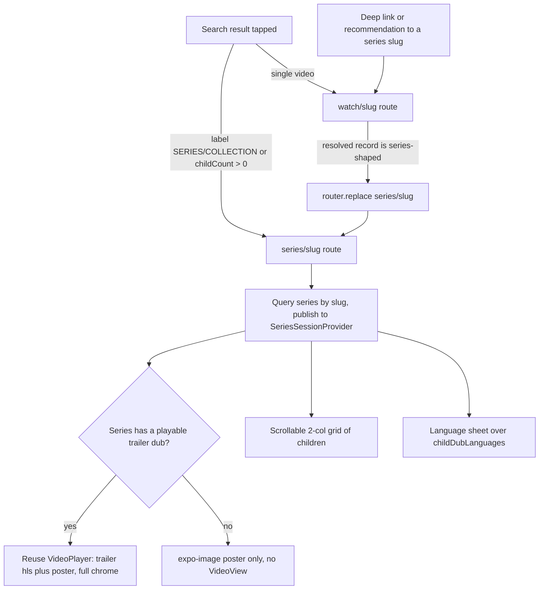
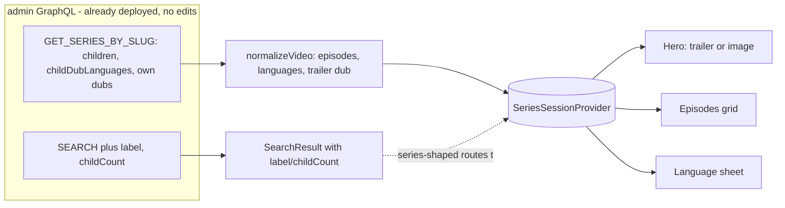
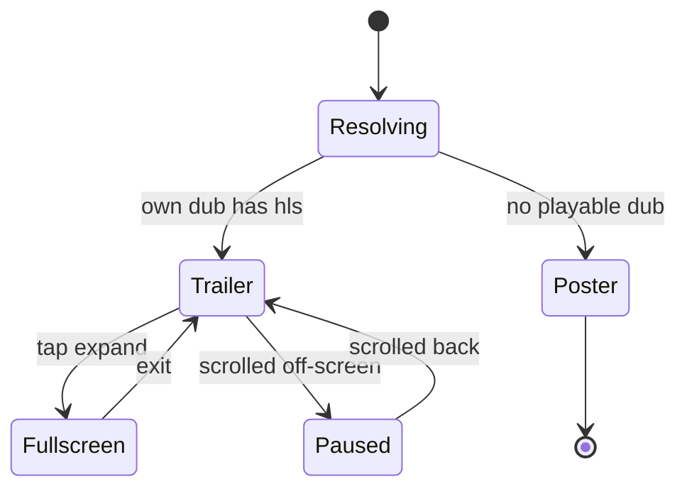
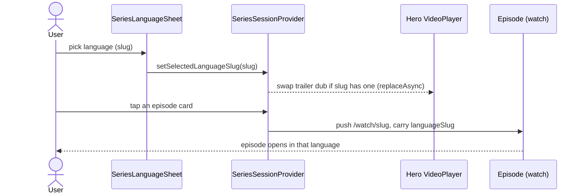

# feat: Mobile Series Detail Page

## Summary

Add a dedicated series detail page to `apps/mobile`, porting the web series
experience. Reached from search (and any deep link), it shows the series
trailer by reusing the existing video-detail `VideoPlayer` — or a plain poster
image when there is no trailer — then the series title, a "Read more"
description, a Language + Share action row, and a scrollable grid of the
series' videos that each open in the normal video detail page.

The work is mobile-only: every admin field it needs (`label`, `childCount`,
`children`, `childDubLanguages`, the series' own dubs, images) is already
exposed, so there are zero `apps/admin` edits and no deploy-ordering coupling.

---

## Problem Frame

A series is a `Video` with `label: SERIES`/`COLLECTION` (or any record with
children). Web renders these on a purpose-built page; mobile has none, so
tapping a series in search routes it through `apps/mobile/app/watch/[slug].tsx`
and renders a collection as a single video — a chrome-heavy player, an "Up
Next" sibling carousel, Bible Quotes, and a Download/Subtitles row, none of
which fit a series. When a series has no trailer, that screen has no image-only
fallback.

---

## Requirements

Carried from origin (`docs/brainstorms/2026-06-08-mobile-series-detail-page-requirements.md`).

**Entry and routing**

- R1. A series-shaped record (label `SERIES`/`COLLECTION`, or any record with
  children) renders the series detail page, not the single-video page.
- R2. Mobile search routes a series-shaped result to the series page; the
  search query selects `label` and `childCount`. No `apps/admin` change.
- R3. Any navigation resolving to a series slug lands on the series page:
  `watch/[slug]` redirects when the resolved record is series-shaped, so deep
  links and non-search entry points behave identically.

**Hero**

- R4. With a playable trailer (the series' own dub with a non-null `hls`), the
  hero reuses the existing `VideoPlayer`, same chrome and controls as the video
  page.
- R5. With no playable trailer, the hero is a plain poster image — no player is
  mounted, no player chrome appears.
- R6. The poster falls back through the series images in the app's existing
  precedence (`mobileCinematicHigh` → … → `url`).

**Title, description, actions**

- R7. The page shows a "SERIES" label and the series title.
- R8. The page shows the series description with a collapsed "Read more"
  expansion, matching the video page.
- R9. The action row has exactly two actions: Language and Share.
- R10. Share invokes the native share sheet with the series' shareable link and
  title.

**Language**

- R11. Language opens a language selection sheet.
- R12. Selecting a language swaps the trailer dub when a matching dub exists.
- R13. The selected language is carried into an episode when tapped — the
  episode opens in that language.

**Video grid**

- R14. The page shows a scrollable grid of the series' videos (its children, in
  defined order). No in-grid search or filter.
- R15. Each grid card shows the video thumbnail and title.
- R16. Tapping a grid card pushes to that video's existing detail page,
  carrying the selected language and a seed for instant paint.

---

## Key Technical Decisions

- KTD1. **Series is a label-based discriminator, fetched as a standalone
  slug route.** `isSeriesRecord` = label in `{series, collection}`
  (case-insensitive) OR `children.length > 0`, mirroring web's
  `apps/web/src/lib/content.ts` `isSeriesRecord`. The page is an independent
  slug-fetched route like `apps/mobile/app/watch/[slug].tsx`, not an
  Experience block-index lookup (that path loses parent/child siblings — see
  `docs/solutions/mobile/sdui-experience-provider-block-index-parent-child-loss.md`).

- KTD2. **Only the hero holds a live video; everything else is an image.**
  With a trailer, reuse `VideoPlayer` and its frozen-source + `replaceAsync`
  contract verbatim (see `docs/solutions/best-practices/mobile-video-detail-page-patterns-20260527.md`).
  With no trailer, render `expo-image` only — absence of a player _is_ the
  mode (R5). Grid cells are static posters, never players, because mid-range
  Android has only 3–5 hardware decoder slots
  (`docs/solutions/mobile/android-lazy-section-viewport-gating-oom-fix.md`).

- KTD3. **Cross-route state via a lightweight `SeriesSessionProvider`.**
  Mounted above the series screen and its language sheet route so the sheet's
  selection reaches the page through context, not router params (the pattern a
  prior bug demanded — `docs/solutions/design-patterns/lean-bulk-lazy-per-item-graphql-fetch-20260604.md`).
  A new provider rather than reusing `WatchSessionProvider` sheds the
  download/subtitle/snackbar/lazy-media machinery the series page never touches.

- KTD4. **Language list is `childDubLanguages`; matching is slug-keyed.** The
  picker lists the languages the _episodes_ are available in (the series-level
  union), per origin. Selection persists and re-applies by `languageSlug`
  exact-match — never bcp47, which mis-selects `ko` → `ko-kmr`
  (`docs/solutions/best-practices/language-identity-on-slug-not-bcp47-20260605.md`).
  The trailer dub swap is best-effort: swap when the trailer has a dub for the
  selected slug, otherwise leave the trailer playing its current dub.

- KTD5. **A new 2-button `SeriesActionRow`; Share uses the two-segment public
  URL.** `ActionButtonRow` is a fixed four-button component, so the Language +
  Share row (R9) is a new small component. Share targets
  `{slug}.html/{language}.html` — a bare `/watch/{slug}` 404s in production
  (`docs/solutions/conventions/public-watch-url-two-segment-contract-20260608.md`).

- KTD6. **Entry wiring lands last.** The search branch and the `/watch`
  redirect (U6) ship after the page is fully built (U3–U5), so nothing routes
  users to a half-built screen.

- KTD7. **Image and route hygiene.** All poster/thumbnail URLs go through
  `resolveImageUrl` (expo-image silently drops relative paths —
  `docs/solutions/integration-issues/mobile-relative-image-url-no-base-origin-20260408.md`);
  slugs are `encodeURIComponent`-encoded in route params (Expo Router splits on
  `/` — `docs/solutions/mobile/expo-router-slash-in-dynamic-route-params.md`).

---

## High-Level Technical Design

Four views of the same feature: how a tap resolves to the right page, how data
flows into it, how the hero behaves, and how a language choice travels to an
episode.

#### Entry & routing — one page for every entry point



Search detection uses `label`/`childCount`; the `/watch` redirect uses `label`
on the lean fragment. Both land on one `series/[slug]` page, so deep links and
recommendations behave identically (R1–R3).

#### Data flow — admin fields already exist; mobile only adds selections



The shared `watchVideoFragment` stays lean; series-only fields live on
`GET_SERIES_BY_SLUG` (U1, KTD2).

#### Hero states — only this surface holds a decoder slot



Grid cells are always static images, so the hero is the only live `VideoView`
(KTD2).

#### Language carry-through — slug-keyed, across the route boundary



Selection matches on `languageSlug` exact equality, never bcp47 (KTD4).

#### Route tree (mirrors the existing `app/watch` group)

```text
app/_layout.tsx                 → registers `series` (defensive require)
app/series/_layout.tsx          → Stack wrapped in <SeriesSessionProvider>
  app/series/[slug].tsx         → series screen (hero + meta + desc + actions + grid)
  app/series/language.tsx       → language sheet (formSheet route)
```

---

## Implementation Units

### U1. GraphQL selections + normalizer for series data

- **Goal:** Surface what the series page needs — search results that flag a
  series, and the series' own children + dub-language union — with no admin
  change.
- **Requirements:** R1 (children fallback for detection), R2, R11, R14, R15.
- **Dependencies:** none.
- **Files:**
  - `apps/mobile/src/lib/queries.ts` — add `label`, `childCount` to
    `SEARCH.results`; add a series-scoped `GET_SERIES_BY_SLUG` operation that
    composes `watchVideoFragment` plus `children { child { … } }` (with `order`)
    and `childDubLanguages { bcp47, name, slug }`. Do **not** widen the shared
    `watchVideoFragment` — the single-video query stays lean, and the U6 redirect
    detects a series by `label` (already on the fragment), not children.
  - `apps/mobile/src/lib/normalizeVideo.ts` — extend `WatchVideoRecord` with an
    `episodes` array (from the video's own `children`) and a `languages` array
    (from `childDubLanguages`).
  - `apps/mobile/src/lib/__tests__/normalizeVideo.test.ts`
- **Approach:** `SearchResult` widens automatically when `label`/`childCount`
  are added (gql.tada infers from existing admin introspection — no codegen).
  In `GET_SERIES_BY_SLUG`, each `children.child` selects `documentId: id, slug,
label, locales(locale:$locale){ title }, images{ url, thumbnail,
mobileCinematicHigh, mobileCinematicLow }`, ordered by `order`. Normalize
  children → episodes (slug, title from locales, poster via the existing
  `pickPosterUrl` precedence) and `childDubLanguages` → languages (slug, name via
  `pickLocalizedName`, bcp47). Keep the lean posture — do **not** project
  `downloads`/`videoEdition.subtitles` across children, and keep these fields off
  the shared `watchVideoFragment`
  (`docs/solutions/design-patterns/lean-bulk-lazy-per-item-graphql-fetch-20260604.md`).
- **Patterns to follow:** existing sibling mapping + `pickPosterUrl` in
  `normalizeVideo.ts`; `pickLocalizedName` for `name: JSON` locale maps.
- **Test scenarios:**
  - Children map in `order`, title from `locales`, poster precedence
    `mobileCinematicHigh → url → thumbnail` (the existing `pickPosterUrl` order;
    it does not consult `mobileCinematicLow`).
  - `childDubLanguages` map to `{ slug, name (localized), bcp47 }`.
  - Empty `children` → empty episodes array (no throw).
  - Child with null `locales` → title null, card still normalizes.
  - `SearchResult` type exposes `label` and `childCount` after the selection
    change (typecheck).
- **Verification:** normalizer unit tests green; a series-slug query returns
  populated `episodes` + `languages`; `pnpm --filter @forge/mobile typecheck`
  passes with the widened `SearchResult`.

### U2. SeriesSessionProvider + series route registration

- **Goal:** A lightweight cross-route context and the route skeleton so the
  series screen and its language sheet share selection state.
- **Requirements:** R3, R11, R12, R13.
- **Dependencies:** U1.
- **Files:**
  - `apps/mobile/src/contexts/SeriesSessionProvider.tsx`
  - `apps/mobile/app/series/_layout.tsx`
  - `apps/mobile/app/_layout.tsx` — register the `series` screen.
  - `apps/mobile/src/contexts/__tests__/SeriesSessionProvider.test.tsx`
- **Approach:** Provider exposes `{ series, setSeries, languages,
selectedLanguageSlug, setSelectedLanguageSlug }`. `languages` derives from
  `series.languages`; `selectedLanguageSlug` defaults to the series' primary /
  first available language and **resets when `series.documentId` changes** so a
  prior series' selection never leaks (KTD3). `useSeriesSession()` throws
  outside the provider. `app/series/_layout.tsx` mirrors
  `apps/mobile/app/watch/_layout.tsx`: a `<Stack>` wrapped in
  `<SeriesSessionProvider>`, a `[slug]` screen with the custom chevron-back
  header (ACCENT tint, copied from the `video`/`collection` header block in
  `app/_layout.tsx`), and a `language` sheet screen using `LIST_SHEET_OPTIONS`.
  Register `<Stack.Screen name="series" options={{ headerShown: false }} />` in
  the root layout using its defensive `require()` import pattern.
- **Patterns to follow:** `app/watch/_layout.tsx` (provider-wraps-Stack +
  `SHEET_BASE_OPTIONS`/`LIST_SHEET_OPTIONS`); `WatchSessionProvider`
  reset-on-id-change; defensive `require()` in `app/_layout.tsx`.
- **Test scenarios:**
  - Provider exposes and updates `selectedLanguageSlug`.
  - `useSeriesSession()` throws when consumed outside the provider.
  - Selection resets when `series.documentId` changes.
  - `languages` derives from the series' `childDubLanguages`.
  - Default `selectedLanguageSlug` chosen when none set.
- **Verification:** navigating to `/series/<slug>` mounts an (empty) screen
  inside the provider; `useSeriesSession` resolves in both the screen and the
  sheet route.

### U3. Series detail screen — hero, metadata, description, actions

- **Goal:** Resolve the series and render the trailer-or-image hero, the SERIES
  label/title, the Read-more description, and a Language + Share row.
- **Requirements:** R4, R5, R6, R7, R8, R9, R10.
- **Dependencies:** U1, U2.
- **Files:**
  - `apps/mobile/app/series/[slug].tsx`
  - `apps/mobile/src/components/series/SeriesActionRow.tsx`
  - reuse `apps/mobile/src/components/watch/VideoPlayer.tsx`,
    `VideoMetadata.tsx`, `VideoDescription.tsx`.
  - `apps/mobile/app/series/__tests__/series-screen.test.tsx`
- **Approach:** Read `{ slug, seed }`, decode the slug, `decodeWatchSeed(seed)`
  for instant hero paint (F1). Run `GET_SERIES_BY_SLUG` `cache-first` with
  `returnPartialData` (match the watch screen's payload posture). Normalize and
  publish via `setSeries`. Derive the trailer = the series' own playable dub
  (`variants.find(published && hls)`) for `selectedLanguageSlug` when present,
  else the primary/first playable. Hero branch: a playable trailer →
  `<VideoPlayer streamingUrl={trailerHls} posterUrl={poster} fullscreen
onToggleFullscreen … />`, owning `isFullscreen` state and replicating the
  orientation/header effects from `app/watch/[slug].tsx`; no trailer →
  `expo-image` `<Image>` at 16:9 with the poster, no `VideoPlayer` mounted
  (KTD2). `VideoMetadata` with `label="SERIES"`, `title={seriesTitle}`;
  `VideoDescription({ description: series.description })`. `SeriesActionRow`
  with `onLanguage={() => router.push('/series/language')}` and
  `onShare={handleShare}`. `handleShare` uses `Share.share` with
  `https://www.jesusfilm.org/${slug}.html/${selectedLanguageSlug}.html` (KTD5).
  Poster through `resolveImageUrl` (KTD7). Mirror the watch screen's resolution
  states: the seed image paints first; a spinner shows while the query is in
  flight with no seed; a query failure renders the watch screen's error view with
  a back affordance, never a blank dead-end. Pause/release the trailer when it
  scrolls off-screen so the grid below never holds a second decoder slot (KTD2);
  do not bridge scroll position to the player via `Animated.Value.addListener`
  under the native driver
  (`docs/solutions/mobile/full-bleed-video-hero-with-scroll-over-content.md`).
  Give the hero, action buttons, and grid cards accessibility roles/labels and
  ≥44pt targets, mirroring `ActionButtonRow`/`SearchResultCard`.
- **Patterns to follow:** `app/watch/[slug].tsx` (params/seed/query/normalize/
  publish, fullscreen effects, `handleShare`); `VideoPlayer` frozen-source
  contract; `expo-image` + `resolveImageUrl`.
- **Test scenarios:**
  - Covers AE1. Trailer present → `VideoPlayer` mounted with the trailer `hls`.
  - Covers AE2. No trailer → `expo-image` poster, `VideoPlayer` not mounted.
  - Label renders "SERIES"; title renders.
  - Description collapses to 3 lines and expands on "Read more".
  - Share invokes with the two-`.html`-segment URL and the selected language.
  - Poster resolves through `resolveImageUrl`; relative path → no blank-image.
  - Seed paints the hero before the query resolves; query-in-flight with no seed
    shows a spinner; query failure shows the error view, not a blank screen.
  - Trailer pauses/releases when scrolled off-screen.
  - Hero, action buttons, and grid cards expose accessibility labels/roles.
- **Verification:** a series with a trailer shows the chrome-bearing player; one
  without shows a static image; the action row shows only Language + Share.

### U4. Series episodes grid + episode navigation

- **Goal:** The scrollable 2-column grid of the series' children; tapping pushes
  to the video page in the selected language.
- **Requirements:** R14, R15, R16.
- **Dependencies:** U1, U2, U3.
- **Files:**
  - `apps/mobile/app/series/[slug].tsx` — add the grid section.
  - `apps/mobile/src/components/series/SeriesEpisodesGrid.tsx`
  - `apps/mobile/src/components/series/SeriesEpisodeCard.tsx`
  - colocated tests for the grid and card.
- **Approach:** Render `series.episodes` as a 2-column grid (`FlatList
numColumns={2}` with `columnWrapperStyle`, mirroring search results, or
  `FlashList numColumns`; screen-level, so the formSheet-height workaround does
  not apply). Each card = `expo-image` thumbnail + 2-line title at 4:3 (matching
  `SearchResultCard`), title-only — no episode-index or duration pill in v1.
  When the series has zero children, omit the grid section entirely (no empty
  placeholder). No search input (R14). Tap:
  `encodeWatchSeed({ slug, title, imageUrl: poster, playbackId: null })` then
  `router.push('/watch/${encodeURIComponent(childSlug)}?seed=…')`, carrying the
  selected language so the episode opens in it (R15/F5). Carry-through is
  slug-keyed (KTD4); see Open Questions for the param-vs-preference mechanism.
  Grid cells are static images only (KTD2). `renderItem`/derived values
  memoized (Android is the primary tier).
- **Patterns to follow:** `SearchResultCard` (thumbnail + title card);
  `app/(tabs)/watch.tsx` `FlatList numColumns` + `columnWrapperStyle`;
  `UpNextCarousel` `handlePress` (`encodeWatchSeed` + `router.push`);
  `shared.ts` card styles.
- **Test scenarios:**
  - Grid renders all children in `order`.
  - Card shows thumbnail (through `resolveImageUrl`) + title.
  - Covers AE5. Tap navigates to `/watch/<childSlug>?seed=<encoded>` carrying the
    seed and the selected language, so the episode opens in that language with
    instant paint.
  - Zero children → the grid section is omitted, no crash.
  - Child slug containing `/` is encoded at navigation.
- **Verification:** the grid lists every episode; tapping opens the episode's
  video page in the selected language.

### U5. Series language sheet + language carry-through

- **Goal:** A language sheet over the series' `childDubLanguages`; selection
  updates the session, swaps the trailer dub best-effort, and sets the
  carry-through language.
- **Requirements:** R11, R12, R13.
- **Dependencies:** U1, U2, U3.
- **Files:**
  - `apps/mobile/app/series/language.tsx`
  - `apps/mobile/src/components/series/SeriesLanguageSheet.tsx`
  - colocated test.
- **Approach:** The sheet route reads `{ languages, selectedLanguageSlug,
setSelectedLanguageSlug }` from `useSeriesSession`. Render a searchable
  `FlashList` over `languages` (`{ slug, name, bcp47 }`), names via
  `pickLocalizedName`. Build a dedicated `SeriesLanguageSheet` rather than reusing
  `LanguageSheetContent`: that component hard-returns on `!variant.hls` and keys
  `keyExtractor` on `documentId`, neither of which a `ChildDubLanguage` row has —
  reusing it verbatim makes every row unselectable and breaks key extraction.
  `SeriesLanguageSheet` keys on `slug` and drops the `hls` guard. On select:
  `setSelectedLanguageSlug(slug)`
  (exact slug match — KTD4), write the slug-keyed audio preference for
  carry-through, best-effort swap the trailer dub when the series' own
  `variants` contain a dub with that `languageSlug` (the player swaps via
  `replaceAsync`), then `router.back()`. Disable
  `maintainVisibleContentPosition` on the filtered list
  (`docs/solutions/best-practices/flashlist-v2-maintainvisiblecontentposition-default-20260605.md`).
  Native formSheet via the layout's `LIST_SHEET_OPTIONS`; no gesture-handler
  (`docs/solutions/best-practices/bottom-sheet-migration-expo-sdk54-pitfalls-20260527.md`).
- **Patterns to follow:** `LanguageSheet.tsx` (search box, sort, debounce,
  `useSheetListHeight`); `app/watch/language.tsx` (thin route reading the
  session); `LIST_SHEET_OPTIONS`.
- **Test scenarios:**
  - Sheet lists `childDubLanguages`, sorted, with localized names.
  - Search filters the list; `maintainVisibleContentPosition` disabled (no
    scroll jump on filter).
  - Select sets `selectedLanguageSlug` by exact slug — `ko` does not match
    `ko-kmr`.
  - Trailer dub swaps when a matching dub exists.
  - No matching trailer dub → selection still set, trailer unchanged, no crash.
  - Sheet dismisses after select.
- **Verification:** Language opens the sheet; picking a language updates the
  selection, swaps the trailer when available, and the next episode tap opens in
  that language.

### U6. Series detection + search/watch routing (entry wiring)

- **Goal:** Route series-shaped records to the series page from search and from
  any `/watch` resolution. Lands last so the destination is complete.
- **Requirements:** R1, R2, R3.
- **Dependencies:** U1, U3, U4, U5.
- **Files:**
  - `apps/mobile/src/lib/isSeriesRecord.ts`
  - `apps/mobile/app/(tabs)/watch.tsx` — branch `handleSelectResult`.
  - `apps/mobile/app/watch/[slug].tsx` — add the redirect effect.
  - colocated tests.
- **Approach:** The two call sites carry different shapes, so split the check.
  `isSeriesRecord({ label, children })` → `label.toLowerCase()` in
  `{ "series", "collection" }` OR `(children?.length ?? 0) > 0`, mirroring web
  `content.ts`, runs on the normalized record in the `app/watch/[slug].tsx`
  redirect (the lean fragment carries `label`; `children` is absent there, so it
  resolves as a label check). The search branch has no children array — a
  `SearchResult` carries `childCount` — so `handleSelectResult` (after the
  `EXPERIENCE` check) uses an inline guard: `label.toLowerCase()` in
  `{ "series", "collection" }` OR `(childCount ?? 0) > 0` →
  `router.push('/series/<slug>?seed=…')` with the same `encodeWatchSeed`. On the
  watch screen, after `normalized` resolves, an effect: if
  `isSeriesRecord(normalized)`, `router.replace('/series/<slug>?seed=…')`
  carrying the same seed — covers deep links and any non-search entry (R3).
  Guard the effect to fire **once** per resolution (a ref keyed on the resolved
  slug) and only after the record resolves. Encode the slug in the param (KTD7).
- **Patterns to follow:** web `isSeriesRecord` (`apps/web/src/lib/content.ts`);
  `app/(tabs)/watch.tsx` `handleSelectResult`; `useRouter` already in scope in
  `app/watch/[slug].tsx`.
- **Test scenarios:**
  - Covers AE3. Search result `label=SERIES` → `/series` route; single video →
    `/watch` route.
  - `childCount > 0` with no `label` → series route.
  - Covers AE4. `/watch/<seriesSlug>` resolving series-shaped →
    `router.replace` to `/series`.
  - `/watch/<videoSlug>` non-series → no redirect.
  - Redirect fires once (no loop) and only after resolution.
- **Verification:** tapping a series in search opens the series page; a deep
  link or direct `/watch` to a series slug redirects to it; single videos are
  unaffected.

---

## Acceptance Examples

Carried from origin; referenced by the `Covers AE<N>` test scenarios above.

- AE1. Given a series with a playable trailer, when the page opens, the hero is
  the reused `VideoPlayer` showing the trailer. (R4)
- AE2. Given a series with no playable trailer, when the page opens, the hero is
  a plain poster image and no player is mounted. (R5, R6)
- AE3. Given a search result whose `label` is `SERIES`, tapping opens the series
  page; a single-video result opens the video page. (R1, R2)
- AE4. Given a deep link to a series slug routed through `watch/[slug]`, when it
  resolves series-shaped, it redirects to the series page. (R3)
- AE5. Given a language selected on the series page, tapping an episode opens its
  detail page in that language, with an encoded seed for instant paint. (R13, R16)

---

## Scope Boundaries

**Deferred for later** (origin)

- Re-translating grid episode titles when the language changes — the trailer dub
  and episode carry-through still swap; the grid labels stay in their fetched
  locale.
- An in-grid search/filter input over the series' videos.
- Series-level Download and Subtitles actions.

**Outside this page's identity** (origin)

- The single-video page's "Up Next" carousel, Bible Quotes, and
  related-questions blocks. The series page is trailer/image + title +
  description + grid.
- Any `apps/admin` or schema change — the required fields already exist.

---

## System-Wide Impact

- **Search result routing.** `handleSelectResult` gains a series branch, so
  every search tap is affected. Additive and low-risk — experiences and single
  videos are unchanged.
- **`/watch` redirect.** Every navigation to a series-shaped slug now redirects
  to `/series`, covering deep links, recommendations, and future entry points.
  Must fire once per resolution to avoid a redirect loop.
- **Decoder-slot posture.** The hero is the only live `VideoView`; grid cells
  are static images, preserving the Android decoder-slot budget.

---

## Risks & Dependencies

- **No deploy-ordering coupling.** Unlike the dub-payload work, this needs no
  admin field — `label`, `childCount`, `children`, `childDubLanguages` are
  already in prod admin. Mobile ships standalone via EAS.
- **Trailer dub may not cover the selected language.** Accepted: the swap is
  best-effort (KTD4); the trailer keeps its current dub, the episodes (the real
  payload) still open in the selected language.
- **Redirect loop.** The `/watch` → `/series` effect must be single-fire and
  post-resolution; a careless dependency array re-triggers it.
- **Reused `VideoPlayer` fullscreen.** The series screen must own `isFullscreen`
  and copy the watch screen's orientation/header effects verbatim (~40 lines:
  `setOptions` orientation, enter/exit landscape, the BackHandler/AppState
  handler, the unmount portrait reset), or fullscreen desyncs from orientation.
- **Redirect flash.** During the `/watch` → `/series` window the watch screen
  briefly mounts for a series; fire `router.replace` as soon as
  `isSeriesRecord(normalized)` is true (its seed has `playbackId: null`, so no
  stream loads) to minimize it.

---

## Open Questions

Deferred to implementation — none block planning.

- **Carry-through mechanism (U4/U5).** Set the slug-keyed `WatchPreferences`
  audio language vs. pass an explicit nav param the watch screen honors. Lean
  preference, since the infra exists and the watch screen already resolves its
  default dub from it. The trade-off to confirm: the preference is app-wide and
  persisted, so picking a series language changes the default audio for every
  future video until changed again. Settle this before U4/U5 are built so the
  write side and read side agree on the same slug-keyed mechanism.

---

## Documentation / Operational Notes

After this lands, two gotchas the learnings search relied on live only in the
author's auto-memory, not in `docs/solutions/` — worth capturing via
`ce-compound` so other agents see them: looped `Animated.sequence` runs once on
Fabric, and FlashList-in-a-formSheet needs an explicit height from the detent
index. Neither blocks this work (the grid is screen-level; the hero uses no
looped pulse), but both are adjacent to this surface.

---

## Sources / Research

- Origin: `docs/brainstorms/2026-06-08-mobile-series-detail-page-requirements.md`
- Port source: `apps/web/src/components/watch/SeriesPageClient.tsx`,
  `SeriesHero.tsx`, `SeriesEpisodesGrid.tsx`;
  `apps/web/src/lib/content.ts` (`isSeriesRecord`, `resolveSeriesBySlug`).
- Mobile patterns to mirror: `apps/mobile/app/watch/[slug].tsx`,
  `app/watch/_layout.tsx`, `app/watch/language.tsx`,
  `src/components/watch/VideoPlayer.tsx`, `LanguageSheet.tsx`,
  `VideoDescription.tsx`, `VideoMetadata.tsx`, `ActionButtonRow.tsx`;
  `src/contexts/WatchSessionProvider.tsx`; `app/(tabs)/watch.tsx`;
  `src/components/search/SearchResultCard.tsx`; `src/lib/queries.ts`,
  `normalizeVideo.ts`, `watchSeed.ts`, `pickLocalizedName.ts`, `validateUrl.ts`,
  `src/styles/shared.ts`, `src/lib/color.ts`.
- Admin surface (read-only, already deployed): `apps/admin/schema.graphql`
  `HybridSearchResult.label` + `.childCount`, `Video.children` / dubs /
  `childDubLanguages` / images.
- Learnings: `docs/solutions/best-practices/mobile-video-detail-page-patterns-20260527.md`,
  `docs/solutions/design-patterns/lean-bulk-lazy-per-item-graphql-fetch-20260604.md`,
  `docs/solutions/best-practices/language-identity-on-slug-not-bcp47-20260605.md`,
  `docs/solutions/mobile/android-lazy-section-viewport-gating-oom-fix.md`,
  `docs/solutions/best-practices/flashlist-v2-maintainvisiblecontentposition-default-20260605.md`,
  `docs/solutions/best-practices/bottom-sheet-migration-expo-sdk54-pitfalls-20260527.md`,
  `docs/solutions/integration-issues/mobile-relative-image-url-no-base-origin-20260408.md`,
  `docs/solutions/conventions/public-watch-url-two-segment-contract-20260608.md`,
  `docs/solutions/mobile/expo-router-slash-in-dynamic-route-params.md`,
  `docs/solutions/mobile/sdui-experience-provider-block-index-parent-child-loss.md`.
