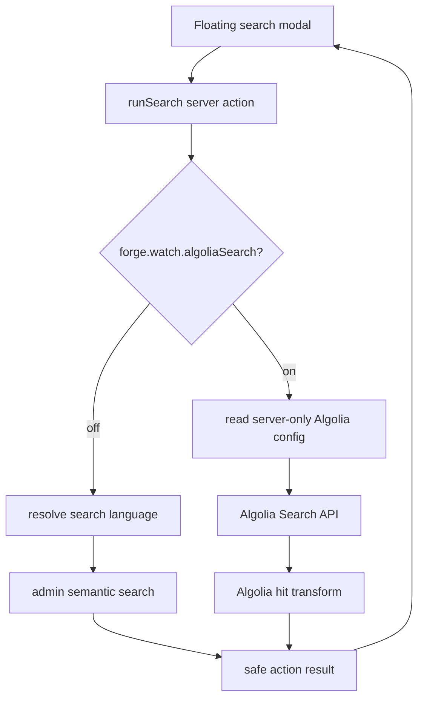
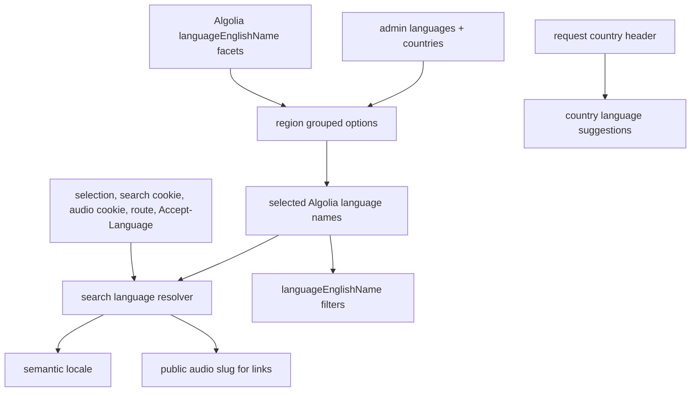

# Forge Algolia Search Modal Plan

## Summary

Add a server-evaluated LaunchDarkly flag that lets Forge's existing global search modal swap from semantic search to Core-compatible Algolia Watch video results. Keep the modal as the only v1 search surface, add region-grouped language filtering in the modal, and derive a search language for both semantic and Algolia modes without exposing Algolia secrets to the browser.

---

## Problem Frame

Forge already owns the floating search modal, query URL sync, category search, pagination, loading states, and card rendering. The missing pieces are Core's Algolia Watch video source, Core's `languageEnglishName` refinement behavior, and a language default that lets semantic search stop hardcoding English (see origin: `docs/brainstorms/2026-06-10-forge-algolia-search-modal-requirements.md`).

The implementation should borrow Core behavior without importing Core's full client-side InstantSearch architecture. Forge has a server-action search boundary, server-only feature flag foundation, public admin reference-data queries, public Watch route builders, and prior guidance to keep search inside the global modal.

---

## Requirements

**Search surface and rollout**

- R1. The existing Forge global search modal remains the canonical UI; no new full search page is introduced for v1. Covers origin R1, R4.
- R2. With `forge.watch.algoliaSearch` off, the modal keeps semantic search and its current mix of video and experience results. Covers origin R2, F1, AE1.
- R3. With `forge.watch.algoliaSearch` on, the modal returns Watch Algolia video results only. Covers origin R3, F2, AE2.
- R4. Category clicks, typed queries, URL `?q=` hydration, load-more, empty states, close behavior, and retry behavior keep working in both modes. Covers origin R5.
- R5. The flag is evaluated on the server with a default-off local fallback and can roll users back to semantic search without a deploy. Covers origin R21, R23.

**Algolia results and security**

- R6. Forge queries the same Algolia app/index source as Core using server-only environment variables for app id, search key, and index. Covers origin R6, R22.
- R7. Algolia queries apply Core's Watch visibility filter: `NOT restrictViewPlatforms:watch AND published:true AND videoPublished:true`. Covers origin R7.
- R8. Algolia hits are transformed into Forge's `SearchResult` card contract with stable id, title, slug, image, duration, label, child count, and result source. Covers origin R8.
- R9. Missing Algolia configuration and upstream failures return safe user-facing errors and never serialize secrets or raw upstream diagnostics to the browser. Covers origin R9, AE5.

**Language behavior**

- R10. Search language resolution uses explicit search selection first, then a search preference cookie, existing Forge audio preference, current route/audio language, browser `Accept-Language`, and English fallback. Covers origin R10, R12.
- R11. Semantic search receives the resolved locale instead of hardcoded `"en"`. Covers origin R11, AE1.
- R12. Algolia language refinements use the `languageEnglishName` facet and allow multiple selected languages in flag-on mode. Covers origin R13, R15, R17, AE3.
- R13. The modal groups language options by region but treats only languages as selected filters; selecting a region is never a search filter. Covers origin R14.
- R14. Country suggestions appear when a request country signal maps to public admin country/language data and those languages are present in Algolia facets. Covers origin R16, AE4.
- R15. Search language selection must not mutate UI locale, route locale, persisted audio preference, or URL language segments. Covers origin R18.

**Links and routing**

- R16. Search result links use Forge route builders and public audio language slugs, not internal UI locale keys. Covers origin R19, F4.
- R17. When a selected or result language maps safely to a public audio slug, result links prefer that slug; otherwise they fall back to the current Forge default. Covers origin R20.
- R18. Generated GraphQL environment/type files are not hand-edited. Covers origin R24.

---

## Key Technical Decisions

- KTD1. Keep the modal provider as the orchestration point: `apps/web/src/components/FloatingSearchProvider.tsx` already owns query state, pagination, freshness checks, and URL sync, so the flag should swap search data behind `runSearch` rather than branching the UI into two search products.
- KTD2. Use a server-side Algolia REST adapter instead of porting Core's browser InstantSearch provider: Forge can call Algolia from a server action, keep app/index/key values server-only, and still apply official Search API parameters for query, filters, facets, and pagination.
- KTD3. Return a discriminated search action result: Forge should avoid throwing raw server-action errors for expected upstream/config states, preserve existing modal retry UX, and expose `mode: "semantic" | "algolia"` for UI affordances and tests.
- KTD4. Add a search-specific language preference separate from `forge_watch_lang`: existing audio preference can seed search language, but search filtering must not rewrite the viewer's persisted audio choice or route language.
- KTD5. Build language metadata from public admin reference queries and Algolia facet counts: `languages` and `countries` are already public, while `managerLanguageGeo` is manager/backend-gated, so v1 should avoid admin schema changes unless implementation proves the public data cannot produce region groups and suggestions.
- KTD6. Map vocabularies at boundaries: Algolia filters use English names, semantic search uses locale codes, and Watch links use public audio slugs. A dedicated mapping layer keeps those vocabularies from leaking into modal UI and card components.

---

## Assumptions

- A1. The rollout flag key will be `forge.watch.algoliaSearch` with local override env `FORGE_WATCH_ALGOLIA_SEARCH_DEFAULT`.
- A2. Server-only Algolia env names will be `ALGOLIA_APP_ID`, `ALGOLIA_SEARCH_API_KEY`, and `ALGOLIA_INDEX`; the rollout owner will supply values outside the repository.
- A3. Public admin `languages` and `countries` queries provide enough metadata for region grouping, country suggestions, locale mapping, and public audio slug mapping.
- A4. If multiple Algolia languages are selected, the first or most recently selected language can be used as the primary preferred search language for semantic locale defaults and result-link language preference.
- A5. v1 will not add Algolia click analytics because Forge is not porting the browser InstantSearch client; this can be a follow-up if product needs analytics parity.

---

## High-Level Technical Design

### Search Dispatch

### Language State

### Mode Matrix

| Mode                  | Result source            | Result types           | Language effect                                                         | Rollback                                |
| --------------------- | ------------------------ | ---------------------- | ----------------------------------------------------------------------- | --------------------------------------- |
| Flag off              | Admin semantic search    | Videos and experiences | One resolved locale passed to admin search                              | Current behavior path remains live      |
| Flag on               | Algolia Search API       | Watch videos only      | Multi-select `languageEnglishName` filters plus primary search language | Disable flag to restore semantic search |
| Algolia misconfigured | Safe server-action error | None                   | Current selections remain visible                                       | Disable flag or fix env                 |

---

## Implementation Units

### U1. Roadmap, Feature Flag, and Environment Contract

- **Goal:** Create the roadmap ticket, register the LaunchDarkly flag, and add optional server-only Algolia env validation.
- **Files:** `docs/roadmap/content-discovery/feat-172-forge-algolia-search-modal.md`, `packages/feature-flags/src/registry.ts`, `packages/feature-flags/src/launchdarkly.test.ts`, `apps/web/src/lib/feature-flags.ts`, `apps/web/src/lib/feature-flags.test.ts`, `apps/web/src/env.ts`, `apps/web/.env.example`, `apps/web/.env.ci`.
- **Patterns:** Follow `docs/solutions/platform/launchdarkly-feature-flag-foundation-20260527.md` and existing `FORGE_WATCH_*_DEFAULT` entries.
- **Test scenarios:** Verify the flag resolves false by default, respects `FORGE_WATCH_ALGOLIA_SEARCH_DEFAULT=true`, passes through LaunchDarkly when configured, keeps Algolia env optional when the flag is off, and never includes Algolia env values in the client env schema.
- **Verification:** Feature-flag package and web env tests cover local fallback parsing, no client exposure of Algolia variables, and default-off behavior.

### U2. Search Language Metadata and Resolver

- **Goal:** Build the language mapping layer for semantic locale, Algolia English-name filters, public audio slugs, region groups, and country suggestions.
- **Files:** `apps/web/src/lib/search-language.ts`, `apps/web/src/lib/search-language.test.ts`, `apps/web/src/lib/search-language-actions.ts`, `apps/web/src/lib/search-language-actions.test.ts`, `apps/web/src/lib/search-language-preference-constants.ts`, `apps/web/src/lib/search-language-preference-client.ts`, `apps/web/src/lib/search-language-preference-server.ts`, `apps/web/src/lib/language-preference-server.ts`.
- **Patterns:** Reuse `apps/web/src/lib/locale.ts`, `apps/web/src/lib/routes.ts`, existing language preference helpers, admin public `languages` / `countries`, and Core's `sortLanguageContinents` / `getTopSpokenLanguages` behavior.
- **Test scenarios:** Resolve Spanish from explicit selection over cookies, fall back from unsupported browser language to English, map `languageEnglishName` to a public slug when possible, group one language under multiple regions without duplicate selected filters, and return country suggestions only for languages present in available facets.
- **Verification:** Resolver unit tests cover precedence, ambiguity, fallback, country headers, and the guarantee that search selection writes only the search preference cookie while reading the existing audio preference as an input signal.

### U3. Server-Side Algolia Adapter and Hit Transform

- **Goal:** Query Algolia from the server action boundary and transform hits into Forge search results.
- **Files:** `apps/web/src/lib/algolia-search.ts`, `apps/web/src/lib/algolia-search.test.ts`, `apps/web/src/lib/algolia-video-transform.ts`, `apps/web/src/lib/algolia-video-transform.test.ts`.
- **Patterns:** Use the direct REST shape from `apps/admin/src/app/watch/demo-keyword-search/algolia-action.ts` but return safe discriminated errors; mirror Core's `WATCH_VISIBILITY_FILTER`, `AlgoliaVideo` hit fields, and transform behavior.
- **Test scenarios:** Build the Algolia URL and headers without browser env vars, send the Watch visibility filter, request `languageEnglishName` facets, OR selected languages in filters, paginate with page/hits-per-page, truncate long queries, transform titles with preferred language when present, and sanitize upstream 403/404/timeout responses.
- **Verification:** Unit tests assert request body shape, secret-free errors, missing-config behavior, filter escaping for language values with punctuation, and transformation parity for singular videos and series-shaped records.

### U4. Search Action Dispatcher and Semantic Locale Wiring

- **Goal:** Replace the hardcoded semantic locale with resolved search language and dispatch between semantic and Algolia modes behind the flag.
- **Files:** `apps/web/src/lib/search-actions.ts`, `apps/web/src/lib/search-actions.test.ts`, `apps/web/src/lib/search.ts`, `apps/web/src/lib/search.test.ts`.
- **Patterns:** Preserve `searchVideos` as the semantic adapter, add a locale argument, and keep admin GraphQL interaction in `apps/web/src/lib/search.ts`.
- **Test scenarios:** Flag-off calls semantic search with the resolved locale and returns experiences, flag-on calls Algolia and returns videos only, missing Algolia config yields a safe error result, load-more uses the same mode and selected languages, and stale responses remain ignored by the provider.
- **Verification:** Server-action tests mock flag resolution, language resolution, admin search, and Algolia search without requiring real secrets.

### U5. Modal Language Filter UI

- **Goal:** Add Core-style language controls to Forge's search modal while keeping the existing modal layout and interaction model.
- **Files:** `apps/web/src/components/FloatingSearchProvider.tsx`, `apps/web/src/components/SearchOverlay.tsx`, `apps/web/src/components/search/SearchLanguageFilter.tsx`, `apps/web/src/components/search/SearchLanguageFilter.test.tsx`, `apps/web/src/components/__tests__/FloatingSearchProvider.test.tsx`, locale message files under `apps/web/src/messages/`.
- **Patterns:** Follow Core's `SearchBarProvider`, `RefinementGroups`, `RefinementGroup`, `LanguageButtons`, and `CountryLanguageSelector`, but implement with Forge's Tailwind/lucide UI and provider state rather than React InstantSearch hooks.
- **Test scenarios:** Opening the modal loads language options only when needed, selecting Spanish and French applies language filters and reruns Algolia search, selected pills remove individual languages, clear all resets filters, the same language is not selected twice through two regions, country suggestions apply only after click, keyboard focus stays inside the modal, screen-reader labels distinguish region groups from selected filters, and the surface is hidden or inert when the flag-off semantic mode does not support Algolia facets.
- **Verification:** Component tests cover keyboard/focus behavior, mobile-friendly text fit, empty facet states, loading states, and no regressions to category-grid behavior.

### U6. Result Card Links and Card Compatibility

- **Goal:** Make semantic and Algolia results render through the same `VideoCard` surface with language-aware Watch links.
- **Files:** `apps/web/src/components/search/VideoCard.tsx`, `apps/web/src/components/search/VideoCard.test.tsx`, `apps/web/src/lib/search.ts`, `apps/web/src/lib/algolia-video-transform.ts`.
- **Patterns:** Use `watchVideoPath`, `watchEpisodePath` only when result data supports them, `searchPath` for malformed fallbacks, and public audio slug helpers from `apps/web/src/lib/locale.ts`.
- **Test scenarios:** Algolia video results link with the selected public audio slug, semantic video results link with the resolved search language when safe, malformed slugs fall back to the modal-capable search path, experience chips remain unchanged in flag-off mode, and card pills still show duration or episode count correctly.
- **Verification:** Card tests assert hrefs, labels, pills, thumbnails, and experience compatibility.

### U7. Rollout Documentation and End-to-End Validation

- **Goal:** Document the operational contract and verify both flag modes from the modal.
- **Files:** `docs/roadmap/content-discovery/feat-172-forge-algolia-search-modal.md`, `docs/solutions/integration-issues/algolia-server-key-vs-public-key-cross-domain-20260430.md` if the env contract changes, `CONCEPTS.md` only if a missing domain term is used in code or docs.
- **Patterns:** Follow existing roadmap status conventions and the prior Algolia server-key solution note.
- **Test scenarios:** Flag-off manual pass searches with a non-English preferred language and still shows semantic results; flag-on manual pass searches with provided Algolia env and shows video-only results; toggling the fallback env locally changes modes without code changes; no Algolia env values appear in client bundles or rendered HTML.
- **Verification:** Focused unit tests, type checking for touched packages, lint for touched packages, and one browser pass over the modal at desktop and mobile widths.

---

## Scope Boundaries

### In Scope

- Existing Forge modal integration, not a new search page.
- Server-side Algolia querying and result transformation.
- Language groups, selected language pills, country suggestions, and search-language defaults.
- Feature flag registration and local fallback behavior.

### Deferred to Follow-Up Work

- Full Core `/videos` page parity.
- Algolia click analytics parity.
- Blending Algolia video results with semantic experience results while the flag is on.
- Search relevance evaluation and ranking optimization.
- Remote LaunchDarkly dashboard flag creation.

### Outside This Product Identity

- Changing Core's Algolia index, ranking, synonyms, or indexing jobs.
- Replacing Forge's modal with Core's full InstantSearch UI.
- Mutating UI locale, route locale, or persisted audio language as a side effect of search filtering.

---

## Risks and Dependencies

- **Algolia key shape:** Core's public key pattern does not guarantee Forge can search from deployed server environments. Mitigation: support server-only `ALGOLIA_SEARCH_API_KEY`, safe missing-config errors, and no client exposure.
- **Language name ambiguity:** Algolia English names may not map one-to-one to Forge audio slugs. Mitigation: isolate matching, prefer exact public slug matches, and fall back to English rather than emitting invalid routes.
- **Public metadata limits:** Public `languages` and `countries` may be enough, but they may not expose every manager geo convenience. Mitigation: implement against public data first and open an admin schema/codegen follow-up only if tests show a real gap.
- **Mode drift:** Load-more and selected language state must stay tied to the mode used for the current query. Mitigation: include mode and selected language inputs in the provider's request freshness model.
- **Server-action redaction:** Throwing expected errors from server actions can hide useful state in production. Mitigation: use discriminated action results for config/upstream failures.

---

## Acceptance Examples

- AE1. Flag off with preferred Spanish: when the flag is off and Spanish is the best search language, modal search calls semantic search with Spanish or its closest supported locale and can return videos plus experiences.
- AE2. Flag on with no language selected: when Algolia config is present and the flag is on, modal search returns video-only Watch Algolia results with Core's public Watch visibility filter.
- AE3. Selecting region-grouped languages: when Spanish and French are selected from region groups, both apply as language filters, selected pills appear, and no region becomes a filter.
- AE4. Country language suggestion: when a country signal resolves to available top spoken languages, the modal shows chips and applies a language filter only after the viewer chooses one.
- AE5. Algolia unavailable: when the flag is on but Algolia cannot complete, the modal shows a safe retryable error and the rollout owner can disable the flag to restore semantic search.

---

## Sources and Research

- Origin requirements: `docs/brainstorms/2026-06-10-forge-algolia-search-modal-requirements.md`
- Forge modal/provider: `apps/web/src/components/FloatingSearchProvider.tsx`, `apps/web/src/components/SearchOverlay.tsx`
- Forge semantic search: `apps/web/src/lib/search-actions.ts`, `apps/web/src/lib/search.ts`
- Forge flag foundation: `apps/web/src/lib/feature-flags.ts`, `packages/feature-flags/src/registry.ts`, `docs/solutions/platform/launchdarkly-feature-flag-foundation-20260527.md`
- Forge language/routing helpers: `apps/web/src/lib/locale.ts`, `apps/web/src/lib/routes.ts`, `apps/web/src/lib/language-preference-server.ts`
- Forge public admin reference data: `apps/admin/src/graphql/types/reference.ts`
- Core Algolia language provider: `.tmp/core/libs/journeys/ui/src/libs/algolia/SearchBarProvider/SearchBarProvider.tsx`
- Core region language UI: `.tmp/core/libs/journeys/ui/src/components/SearchBar/SearchDropdown/RefinementGroups/RefinementGroups.tsx`, `.tmp/core/libs/journeys/ui/src/components/SearchBar/SearchDropdown/RefinementGroups/RefinementGroup/RefinementGroup.tsx`
- Core country suggestions: `.tmp/core/libs/journeys/ui/src/components/SearchBar/SearchDropdown/CountryLanguageSelector/CountryLanguageSelector.tsx`, `.tmp/core/libs/journeys/ui/src/libs/algolia/getTopSpokenLanguages/getTopSpokenLanguages.ts`
- Core Algolia video hook/filter/transform: `.tmp/core/libs/journeys/ui/src/libs/algolia/useAlgoliaVideos/useAlgoliaVideos.ts`, `.tmp/core/libs/journeys/ui/src/libs/algolia/useAlgoliaVideos/searchConfigure.ts`, `.tmp/core/apps/watch/src/libs/algolia/transformAlgoliaVideos/transformAlgoliaVideos.ts`
- Algolia Search API: `https://www.algolia.com/doc/rest-api/search`
- Algolia filters/facets: `https://www.algolia.com/doc/api-reference/api-parameters/filters`, `https://www.algolia.com/doc/api-reference/api-parameters/facets`
- Algolia API key security: `https://www.algolia.com/doc/guides/security/api-keys`
- LaunchDarkly server-side Node SDK and SDK key guidance: `https://launchdarkly.com/docs/sdk/server-side/node-js`, `https://launchdarkly.com/docs/sdk/concepts/client-side-server-side`
