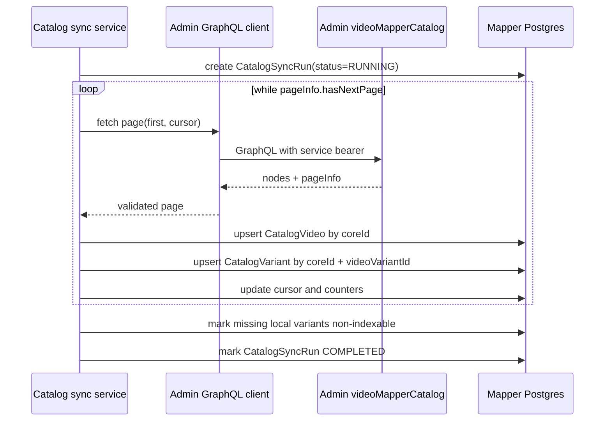

# feat: Add mapper catalog sync

## Summary

Implement YTM-003 by syncing Admin's `videoMapperCatalog(first, after)` GraphQL
projection into mapper-owned catalog tables. The mapper will keep a local,
idempotent projection keyed by `coreId` and `coreId + videoVariantId`, record
sync-run progress and failures, and leave official media signature generation
for YTM-004.

---

## Problem Frame

YTM-001 gave `apps/yt-video-mapper-backend` durable Postgres-backed state, and
YTM-002 added the Admin projection that exposes the broad catalog through a
bounded, service-authorized GraphQL query. The mapper now needs to consume that
projection without direct Admin database reads so matching and indexing can
work against local rows while Admin remains the source of truth.

The current mapper schema already includes initial catalog models, but the sync
implementation is missing and the variant rows need to preserve the Admin
projection's publication, deletion, no-index, indexability, and diagnostic
fields precisely enough for later indexing decisions.

---

## Requirements

- R1. Read catalog data only through Admin `videoMapperCatalog(first, after)`.
- R2. Validate mapper configuration for `ADMIN_GRAPHQL_URL` and
  `ADMIN_SERVICE_BEARER_TOKEN` when a catalog sync is executed.
- R3. Upsert `CatalogVideo` by `coreId`, storing selected title and title
  locale for a local Core ID title map.
- R4. Upsert `CatalogVariant` by `coreId + videoVariantId`, storing language,
  locale, edition, duration, media source, Admin debug IDs, and indexability
  state.
- R5. Mark deleted, missing, or non-indexable variants safely instead of
  hard-deleting local rows during normal sync.
- R6. Record each `CatalogSyncRun` with status, counters, cursor,
  started/finished timestamps, and a safe failure summary.
- R7. Make sync repeated-run safe: no duplicate videos, variants, or sync-side
  state when Admin returns the same rows again.
- R8. Preserve enough cursor and row-error context to retry after failed pages
  or malformed rows without storing secrets or large payloads.
- R9. Cover pagination, idempotent upserts, indexability mapping, run counters,
  safe failures, and env/config validation with focused tests.

---

## High-Level Technical Design

The sync boundary is service-layer code. Routes may call the service later, but
the first YTM-003 implementation should be runnable and testable without adding
public HTTP surface area.

---

## Key Technical Decisions

- **Use a small local Admin GraphQL client.** The mapper app does not currently
  consume generated Admin GraphQL packages, and YTM-003 only needs one
  operation. A local typed client with injectable `fetch` keeps tests tight
  while preserving the GraphQL-only boundary.
- **Require Admin credentials at sync time, not generic server boot.** Production
  upload/poll endpoints should not fail to start because catalog sync is not
  configured, but running the sync without `ADMIN_GRAPHQL_URL` or
  `ADMIN_SERVICE_BEARER_TOKEN` must fail clearly.
- **Persist the full indexability decision from Admin.** Store both booleans
  such as published/deleted/no-index and `nonIndexableReason` so YTM-004 can
  skip safely without re-deriving Admin policy locally.
- **Keep normal sync non-destructive.** Rows missing from a completed snapshot
  are marked non-indexable with a local reason rather than deleted, preserving
  candidate/evidence foreign keys and diagnostic history.
- **Treat failure summaries as diagnostic envelopes.** Store error class,
  message, cursor, page index, and a bounded set of malformed-row identifiers;
  do not store bearer tokens, media URLs in bulk, or whole row payloads.

---

## Implementation Units

### U1. Config and Schema Alignment

**Goal:** Align mapper configuration and catalog models with the YTM-003 sync
contract.

**Requirements:** R2, R4, R5, R6, R9.

**Dependencies:** None.

**Files:**

- `apps/yt-video-mapper-backend/prisma/schema.prisma`
- `apps/yt-video-mapper-backend/prisma/migrations/*/migration.sql`
- `apps/yt-video-mapper-backend/src/config/env.ts`
- `apps/yt-video-mapper-backend/src/config/env.test.ts`
- `apps/yt-video-mapper-backend/src/db/schema.test.ts`
- `apps/yt-video-mapper-backend/.env.example`

**Approach:** Add any catalog fields missing from the Admin projection:
`editionName`, separate video/dub published flags, video no-index, video/dub
deleted flags, and a sync-safe missing/non-indexable representation. Keep
`CatalogVideo.coreId` unique and make the active variant identity the composite
`coreId + videoVariantId`. Add a config helper that asserts Admin sync env only
when the sync path runs.

**Patterns to Follow:** Existing `RuntimeEnvError` validation in
`src/config/env.ts`; existing schema snapshot tests in `src/db/schema.test.ts`;
the Core-facing terminology in `CONCEPTS.md`.

**Test Scenarios:**

- Loading env with blank Admin sync vars leaves the regular app bootable.
- Calling the catalog-sync env assertion without `ADMIN_GRAPHQL_URL` fails with
  a safe missing-var message.
- Calling the assertion without `ADMIN_SERVICE_BEARER_TOKEN` fails with a safe
  missing-var message.
- Schema tests assert variant rows carry Admin debug IDs, source media fields,
  publication/deletion/no-index fields, and the composite variant key.

**Verification:** Type generation reflects the updated schema, config tests pass,
and schema assertions describe the intended catalog identity model.

### U2. Admin GraphQL Client

**Goal:** Add a testable client for Admin `videoMapperCatalog(first, after)`.

**Requirements:** R1, R2, R8, R9.

**Dependencies:** U1.

**Files:**

- `apps/yt-video-mapper-backend/src/services/admin-graphql-client.ts`
- `apps/yt-video-mapper-backend/src/services/admin-graphql-client.test.ts`

**Approach:** Implement one GraphQL operation with typed result parsing,
injectable `fetch`, service bearer header injection, cursor/page-size arguments,
and safe error normalization. Treat GraphQL errors and malformed response
shapes as sync-safe failures with bounded messages.

**Patterns to Follow:** Existing service tests use small in-memory doubles and
safe domain errors; YTM-002 Admin field names and nullability are defined in
`apps/admin/src/graphql/types/video.ts` and
`apps/admin/src/services/video.service.ts`.

**Test Scenarios:**

- Fetching the first page sends `first` and omits `after` when no cursor exists.
- Fetching a later page sends the previous `pageInfo.endCursor`.
- Requests include `Authorization: Bearer <token>` without exposing the token
  in thrown errors.
- GraphQL error responses become safe client errors with a bounded summary.
- Malformed Admin payloads fail before database writes.

**Verification:** Client tests prove pagination arguments, auth header behavior,
and safe error handling without making a network call.

### U3. Catalog Sync Service

**Goal:** Page through Admin catalog rows and upsert mapper catalog tables.

**Requirements:** R1, R3, R4, R5, R6, R7, R8, R9.

**Dependencies:** U1, U2.

**Files:**

- `apps/yt-video-mapper-backend/src/services/catalog-sync.ts`
- `apps/yt-video-mapper-backend/src/services/catalog-sync.test.ts`

**Approach:** Create a service that opens a `CatalogSyncRun`, fetches pages until
Admin reports no next page, validates each row's required identity fields,
upserts `CatalogVideo` and `CatalogVariant`, updates counters and cursor after
each successful page, and finalizes the run. Track seen variant keys during a
completed snapshot, then mark previously local-but-missing rows non-indexable
with a local missing reason. On page or row failure, mark the run failed with
cursor and bounded diagnostics.

**Patterns to Follow:** Durable job lifecycle in `src/services/match-job.service.ts`;
Prisma-backed repository style in `src/db/match-job.repository.ts`; Admin
non-indexability reason vocabulary from YTM-002.

**Test Scenarios:**

- Two Admin pages create one run, two catalog videos, matching variants, and a
  completed status with final cursor.
- Re-running the same pages updates existing rows without increasing video or
  variant row counts.
- Rows with `indexable=false` preserve Admin `nonIndexableReason` and become
  unavailable to later indexing.
- Deleted or unpublished variants remain present and non-indexable rather than
  being deleted.
- A client failure after page one leaves the sync run failed with the last
  successful cursor and safe error summary.
- A malformed row records a bounded row failure summary and does not dump the
  full row payload.
- A completed snapshot marks missing previous variants non-indexable with a
  local missing reason.

**Verification:** Service tests prove idempotency, state mapping, counter
accuracy, failure summaries, and cursor preservation.

### U4. Operator Entry Point and Documentation

**Goal:** Provide a small internal job entry point and operator-facing notes for
running catalog sync.

**Requirements:** R1, R2, R6.

**Dependencies:** U1, U2, U3.

**Files:**

- `apps/yt-video-mapper-backend/src/scripts/sync-catalog.ts`
- `apps/yt-video-mapper-backend/package.json`
- `apps/yt-video-mapper-backend/README.md`
- `apps/yt-video-mapper-backend/docs/railway-deployment.md`

**Approach:** Add a script command that constructs the Prisma client, Admin
client, and sync service, runs one full catalog sync, prints safe counters, and
sets a non-zero exit code on failure. Document the required env vars and clarify
that sync is a local projection from Admin, not an Admin database import.

**Patterns to Follow:** Existing package scripts and Railway deployment docs;
root guidance that service boundaries stay strict.

**Test Scenarios:** Test expectation: none for the script wrapper itself beyond
service/config coverage; keep behavior in U2/U3 tests and verify script typing.

**Verification:** Typecheck covers the script entry point, and docs identify the
Admin GraphQL env contract.

---

## Scope Boundaries

- In scope: mapper-side config, Admin GraphQL client, catalog sync service,
  Prisma schema/client updates, tests, and operator docs.
- Deferred to YTM-004: media signature generation, match indexing, and any
  official media processing.
- Deferred to later ops hardening: scheduler wiring, dashboarding, metrics, and
  retry orchestration beyond storing retry-safe cursor/failure context.
- Out of scope: direct Admin database reads and changes to the Admin
  `videoMapperCatalog` contract unless implementation discovers a blocking
  YTM-002 bug.

---

## Risks & Dependencies

- **Admin contract drift:** The mapper client depends on YTM-002 field names and
  nullability. Keep client tests shaped around the Admin GraphQL response, and
  use safe malformed-response errors when fields drift.
- **Large sync snapshots:** A full Admin catalog page sequence may be long.
  Persist cursor and counters after each successful page so failures are
  inspectable and retryable.
- **Local state preservation:** Hard-deleting missing or non-indexable rows
  could break future candidate/evidence foreign keys. Mark rows non-indexable by
  default.
- **Secret leakage:** GraphQL failures can include request context if handled
  carelessly. Bound summaries and never include authorization headers.

---

## Sources & Research

- `docs/prototypes/yt-video-mapper/tickets/ytm-003-mapper-catalog-sync.md`
  defines the implementation slice and acceptance criteria.
- `CONCEPTS.md` defines `coreId`, `videoVariantId`, Mapper Catalog, and local
  projection terminology.
- `docs/solutions/architecture-patterns/admin-mapper-catalog-projection-narrow-bearer-pattern-20260609.md`
  defines the Admin projection and bearer boundary from YTM-002.
- `docs/solutions/platform/yt-video-mapper-backend-app-durable-match-job-upload-poll-process-pattern.md`
  defines mapper job durability and catalog identity patterns.
- `apps/admin/src/graphql/types/video.ts` and
  `apps/admin/src/services/video.service.ts` define the `videoMapperCatalog`
  GraphQL result shape and derived indexability fields.
