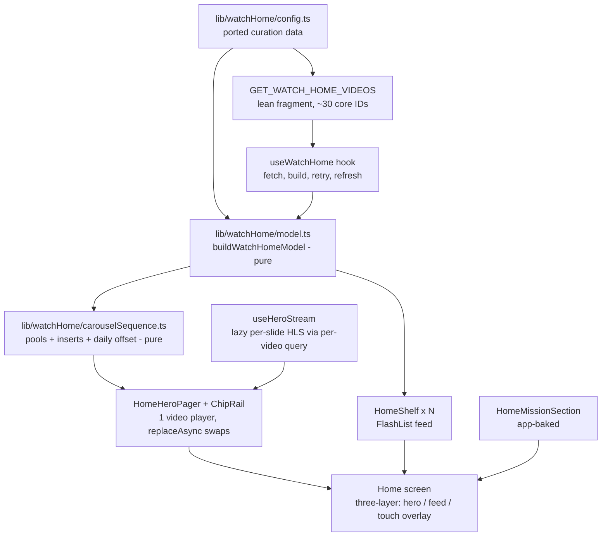

## Summary

Give `apps/mobile` a dedicated, content-rich Home tab that renders the same curated content as web's `/watch` home: a full-bleed swipeable video hero with a chip rail that swaps the featured item in place, horizontal content shelves, a slim logo + search top bar, an app-baked mission section, and footer essentials on the Profile tab. Content comes from a mobile-local port of web's watch-home curation config plus the public `watchHomeVideos` query — not from the (null) admin homepage Experience.

---

## Problem Frame

Mobile's Home renders nothing in prod: `ExperienceShell` resolves `watchSetting.homepageExperience`, which is null, and the shell gates the entire root layout on it — fresh installs land on a spinner/blank screen. Web's `/watch` home is full of content because it bypasses Experiences entirely: a hardcoded curation config (`apps/web/src/lib/watch-home-config.ts`) plus the public `watchHomeVideos(coreIds:)` resolver feed a pure model builder (`apps/web/src/lib/watch-home.ts`). This plan ports that curation to mobile with a mobile-native presentation, and unblocks the root layout so the new Home is reachable. (Origin: `docs/brainstorms/2026-06-09-mobile-home-watch-parity-requirements.md`.)

---

## Requirements

Carried from origin R1–R14; plan-added requirements continue the numbering.

**Content and source**

- R1. Home renders the curated set web's `/watch` shows, sourced from a ported curation config + `watchHomeVideos` — not `watchSetting.homepageExperience`. (Origin R1)
- R2. Each configured section renders as a horizontal shelf in config order with its eyebrow/title/description. (Origin R2)
- R3. The ported config carries an explicit sync obligation back to `apps/web/src/lib/watch-home-config.ts`. (Origin R3; see KTD-1)
- R4. The layout is mobile-native: full-bleed hero + vertical feed of shelves. (Origin R4)

**Hero and chip rail**

- R5. The hero is full-bleed, auto-advancing, and swipeable, with page indicators. (Origin R5)
- R6. A chip rail under the hero mirrors the hero queue; tapping a chip swaps the hero in place without navigating. (Origin R6)
- R7. The hero keeps Watch Now, mute/unmute, and a poster frame. (Origin R7)

**Header and search**

- R8. A slim translucent top bar over the hero shows the JesusFilm logo (left) and a search affordance (right) that opens the existing Discover surface. (Origin R8, R9)

**Mission and Profile**

- R9. A compact mission section renders near the end of the Home feed: "Built for global missions" framing, three mission points, "what we're building next" highlights, and the invitation. (Origin R10)
- R10. "Become a beta tester" opens the external mailchimp signup via the system browser. (Origin R11)
- R11. Profile surfaces footer essentials: social links (X, Facebook, Instagram, YouTube), Give, Privacy Policy, Legal Statement, Newsletter signup, About/Contact. Marketing nav (Products/Resources/Partners) is not carried. (Origin R12, R13)

**Resilience and reachability**

- R12. Failed or empty fetch shows loading/error-with-retry/empty states — never a blank screen. A degraded fetch (some core IDs missing) renders what resolved. (Origin R14)
- R13. The root layout no longer blocks on Experience resolution; tabs mount on fresh installs with no persisted Experience slug. (Plan-added — prerequisite for R1)
- R14. The existing Experience-selection flows (Discover results, Library) keep working via a dedicated experience screen. (Plan-added — origin scope boundary "existing Experience-selection flow untouched")
- R15. The bulk home query stays card-lean: no per-dub/variant collections in the bulk fragment. Hero playback streams resolve lazily per slide. (Plan-added — payload guard)

---

## Key Technical Decisions

- **KTD-1 — Mobile-local adapted copy of the curation, not a shared package.** Config + pure model logic copy into `apps/mobile/src/lib/watchHome/` with a header comment naming the web source files and the sync obligation. Roadmap feat-160 (in-progress) already plans to move this editorial config into admin; a first-of-kind shared config package would be interim scaffolding discarded by that migration.
- **KTD-2 — Lean bulk fragment + lazy per-slide stream resolution.** Web's `WatchHomeVideo` fragment selects all `dubs` per video; the fetched set includes the JESUS film (~2,259 dubs), which on-device re-creates the 9.5MB payload incident. Mobile's fragment selects card fields only (ids, slug, label, durationSeconds, images, locales, lean children). The hero resolves a playable HLS stream per slide on demand via the existing per-video query (cache-first, prefetch-next), following the documented lean-bulk/lazy-per-item pattern. No admin schema change needed.
- **KTD-3 — The hero queue is the ported carousel sequence over the same core-ID set web fetches.** Pools from the playlist sequence + mux promo inserts + the synthesized short-films pool, with web's deterministic daily offset. Pool IDs absent from `getWatchHomeCoreIds()` resolve to nothing on web too, so porting as-is reproduces web's visible queue without extending the fetch. Played-slide state is in-memory only; web's `localStorage`/`sessionStorage` persistence does not port (those globals don't exist on Hermes — the `typeof window` guards pass and the calls throw).
- **KTD-4 — Slide eligibility drops the build-time HLS requirement.** Web filters carousel slides to cards with `hls`; mobile's lean fragment has none at build time. A mobile video slide needs a poster image + slug; the stream arrives lazily (KTD-2). Unplayable slides are skipped at display time, not build time.
- **KTD-5 — Swipe via `pagingEnabled` horizontal FlatList; one video player swapped with `replaceAsync`.** `react-native-gesture-handler` is banned (Expo Go crash); `pagingEnabled` FlatList is the codebase-consistent swipe surface (`BibleQuotesCarouselRenderer`). The hero holds a single frozen-source `useVideoPlayer`; slide changes swap via `player.replaceAsync(...)`, never by mutating the hook source. `videoReady` latches once true; advance fires on `playToEnd` (video) or a 7s timer (image/insert slides), with an error/max-dwell skip so one bad stream can't freeze the pager.
- **KTD-6 — Experience rendering moves to a dedicated `/experience/[slug]` route; the root shell stops gating.** `ExperienceShell` renders children unconditionally and stops blocking on the null homepage. Home stops consuming the Experience context. Discover's Experience results and Library's active-Experience entry route to the new screen, which reuses `CuratedHomeLayout` via the existing root provider — so `/video/[sectionKey]` and `/collection/[sectionKey]` (which read the root provider) keep working unchanged.
- **KTD-7 — Locale pair hardcoded as `locale: "en"` + `languageSlug: "english"`.** The model's variant/locale selection keys on `languageSlug`, never bcp47 (`en-nai`/`en` collision). Matches mobile's app-wide hardcoded-locale posture.
- **KTD-8 — Tests are jest fixtures in `apps/mobile/src/lib/__tests__/`.** Mobile's convention (jest-expo, `__tests__/` dirs, pure-logic tests) — not vitest, not colocated. Ported pure logic gets real-shape fixtures per discriminator branch (mocked-shape vs real-contract discipline); web's `watch-home-carousel-sequence.test.ts` is a fixture source to adapt.

---

## High-Level Technical Design



Hero pager advance rules (directional guidance, not implementation specification):

```text
on slide shown:    poster paints from bulk images; resolve stream lazily (cache-first);
                   prefetch next slide's stream
on stream ready:   latch videoReady (never un-latch on transient idle); play
advance when:      video slide -> playToEnd | image/insert slide -> 7s timer
skip when:         stream error (statusChange) OR max-dwell timeout -> advance to next
on chip tap:       same slide -> no-op; otherwise jump pager; ignore taps while a
                   replaceAsync swap is in flight (serialize swaps)
on end of queue:   wrap to start
suspend when:      tab blur OR scroll past hero threshold -> pause player, stop timers;
                   resume restores current slide (re-issue replaceAsync if it was in flight)
mute:              user unmute persists across swaps within the session; reset on tab blur
overlays:          insert overlay text computed at display time (Eastern-hour rule), not model-build time
```

---

## Implementation Units

### U1. Unblock the root layout and re-home Experience rendering

- **Goal:** Tabs mount unconditionally; Experience rendering lives on a dedicated route; existing Experience flows reroute.
- **Requirements:** R13, R14
- **Dependencies:** none
- **Files:** `apps/mobile/src/contexts/ExperienceShell.tsx`, `apps/mobile/app/_layout.tsx`, `apps/mobile/app/experience/[slug].tsx` (new), `apps/mobile/app/(tabs)/watch.tsx`, `apps/mobile/app/(tabs)/library.tsx`
- **Approach:** `ExperienceShell` renders children always — no full-screen spinner/null gate; the homepage auto-resolve effect stays but its failure is silent (context stays null). New `/experience/[slug]` screen calls `selectExperience(slug)` and hosts `CuratedHomeLayout` (with a back affordance) reading the existing root provider. Discover's `handleSelectResult` EXPERIENCE branch and Library's active-Experience entry push that route instead of `/(tabs)`. `/video/[sectionKey]` and `/collection/[sectionKey]` keep reading the root provider unchanged.
- **Patterns to follow:** Existing route shells in `apps/mobile/app/series/[slug].tsx`; provider wiring in `apps/mobile/app/_layout.tsx`.
- **Test scenarios:**
  - Covers AE1 (reachability half): with `homepageExperience` null and no persisted slug, tabs render (no permanent spinner).
  - Selecting an EXPERIENCE search result routes to `/experience/<slug>` and renders that Experience's blocks; back returns to Discover.
  - Library's active-Experience entry opens the same route.
  - With a persisted slug from a previous session, cold start still mounts tabs and does not hijack Home.
- **Verification:** Fresh-install simulator run reaches Home, Discover, Library, Profile with prod admin (null homepage). Experience selection round-trips.

### U2. Port curation config and pure model/carousel logic

- **Goal:** Mobile owns a faithful, adapted copy of web's curation data and pure builders.
- **Requirements:** R1, R2, R3 (advances F1)
- **Dependencies:** none
- **Files:** `apps/mobile/src/lib/watchHome/config.ts` (new), `apps/mobile/src/lib/watchHome/model.ts` (new), `apps/mobile/src/lib/watchHome/carouselSequence.ts` (new), `apps/mobile/src/lib/__tests__/watchHomeModel.test.ts` (new), `apps/mobile/src/lib/__tests__/watchHomeCarouselSequence.test.ts` (new)
- **Approach:** Copy `WATCH_HOME_*` data + types verbatim where pure (sections, hero source IDs, playlist sequence, mux inserts, blacklist, `getWatchHomeCoreIds`), with a sync-obligation header naming the three web source files. Port `buildWatchHomeModelFromVideos` and helpers (`selectPlayableVariant` retained for future use, `pickAdminImage`, `muxThumbnail`, `buildMetaLabel`, `buildSections`, `buildCarouselPools`, `LABEL_TEXT`) dropping web's `buildHref` — cards keep `slug`/`coreId`/`label`/`childCount`/`playbackId?` and components decide routes. Port pure carousel pieces (deterministic daily offset, `mergeWatchHomeMuxInserts`, overlay picker refactored to take a `now` at call time, queue builder) with storage-dependent pool-exhaustion tracking replaced by an in-memory played set. Apply KTD-4 slide eligibility.
- **Execution note:** Adapt web's `watch-home-carousel-sequence.test.ts` fixtures first; port logic against them.
- **Test scenarios:**
  - Model build from a real-shape `watchHomeVideos` fixture (parents with children, missing images, blacklisted ID): sections in config order, blacklisted ID excluded, zero-card sections dropped, missing-image card falls through the image-priority chain.
  - Covers AE4: fixture missing several core IDs (resolver omits unknowns) → those cards/sections absent, others intact, `missingData` populated.
  - Carousel queue: deterministic offset stable for a fixed date/pool; inserts merge at sequence-start and after-count positions; short-films pool synthesized from SHORT_FILM labels; queue wraps; in-memory played set advances; no storage APIs referenced (regression guard: module imports nothing from storage).
  - Overlay picker returns morning/afternoon/evening copy per injected Eastern-hour `now`, at call time.
  - Lean-payload guard: the config's core-ID count stays ≤ 100 (resolver cap).
- **Verification:** Jest suite green; module has zero React/RN imports (pure).

### U3. Home data layer: lean fragment, query, hooks

- **Goal:** One lean bulk fetch feeds the model; hero streams resolve lazily per slide.
- **Requirements:** R1, R15 (advances F1)
- **Dependencies:** U2
- **Files:** `apps/mobile/src/lib/queries.ts`, `apps/mobile/src/hooks/useWatchHome.ts` (new), `apps/mobile/src/hooks/useHeroStream.ts` (new), `apps/mobile/src/lib/__tests__/watchHomeQueries.test.ts` (new)
- **Approach:** Add `watchHomeVideoFragment` (card-lean per KTD-2: ids, coreId, slug, label, durationSeconds, images, `locales(locale:, languageSlug:)`, children limited to id/coreId/slug/label/images/locales — no `dubs` anywhere) and `GET_WATCH_HOME_VIDEOS` with `locale: "en"`, `languageSlug: "english"` (KTD-7), following `queries.ts` section-banner structure and the duplicate-of-web precedent (`watchVideoFragment`). `useWatchHome`: imperative `getApolloClient().query` with stale-response guard, loading/error/retry, exposed `refetch` for pull-to-refresh. `useHeroStream(slug)`: resolves a playable HLS via the existing `GET_VIDEO_BY_SLUG` (cache-first), validated by `validateStreamingUrl`; deduped, with a prefetch entry point for the next slide (mirror Discover's capped prefetch pattern).
- **Test scenarios:**
  - Fragment regression guard: the printed `GET_WATCH_HOME_VIDEOS` document contains no `dubs` selection (the payload trap stays fixed).
  - `useHeroStream` resolution order for a real-shape per-video fixture: languageSlug match → published+hls filter → null when no playable variant (slide skip path).
  - Stale-guard: a second fetch superseding the first discards the first's results.
  - Error mapping: network failure surfaces a retryable error, not a throw.
- **Verification:** Against prod admin (`https://admin.jesusfilm.org/api/graphql`), the bulk query returns in single-digit-hundreds of KB and resolves ~30 core IDs; jest suite green.

### U4. Hero pager and chip rail

- **Goal:** The signature hero interaction: swipe/auto-advance/chip-swap with one resilient video player.
- **Requirements:** R5, R6, R7 (advances F2; AE2, AE3)
- **Dependencies:** U2, U3
- **Files:** `apps/mobile/src/components/home/HomeHeroPager.tsx` (new), `apps/mobile/src/components/home/HomeChipRail.tsx` (new), `apps/mobile/src/components/home/HomePagerDots.tsx` (new), `apps/mobile/src/lib/watchHome/pagerReducer.ts` (new), `apps/mobile/src/lib/__tests__/watchHomePagerReducer.test.ts` (new)
- **Approach:** Pager = full-width `pagingEnabled` horizontal FlatList of slides (poster via expo-image with `recyclingKey`; the single `VideoView` renders only on the active slide). Player lifecycle per KTD-5 and the HTD advance rules; transition/advance/skip/serialize decisions live in a pure `pagerReducer` so jest covers them without RN. Chips render the queue (inserts included) with `accessibilityState: { selected }`; dots announce "slide N of M". Watch Now routes via the series/watch rule (`isSeriesRecord` helpers) + `encodeWatchSeed` (playbackId nullable); insert CTA opens externally via `validateActionUrl` + `Linking`; plain tap on an insert slide does nothing. Suspend on tab blur and on scroll-past (prop from the screen); mute behavior per HTD.
- **Execution note:** Build the pager reducer test-first; wire components to it after.
- **Test scenarios (reducer, jest):**
  - Covers AE2: single-slide queue → chips and dots hidden, no auto-advance.
  - Covers AE3: chip tap targets a slide → state jumps, no navigation action emitted; chip tap on current slide → no-op.
  - Chip tap while a swap is in flight → ignored (serialized).
  - `playToEnd` advances; image/insert slide advances on timer; stream error or max-dwell advances (skip); end of queue wraps.
  - Blur/scroll-past suspends (player pause + timers cleared); resume restores the current slide.
  - Unmute persists across an auto-advance; resets on blur.
- **Test scenarios (manual/sim):** swipe vs auto-advance interplay; poster→video handoff with no black flash on `replaceAsync` swaps (frozen source honored); insert CTA opens the system browser.
- **Verification:** Simulator: hero plays, chips swap in place, a deliberately bad stream slide is skipped, scrolling away pauses, returning resumes.

### U5. Content shelves

- **Goal:** Curated sections render as horizontal shelves with routed cards.
- **Requirements:** R2, R4 (advances F4)
- **Dependencies:** U2, U3
- **Files:** `apps/mobile/src/components/home/HomeShelf.tsx` (new), `apps/mobile/src/components/home/HomeCard.tsx` (new)
- **Approach:** Shelf = section header (eyebrow/title) + horizontal FlatList with the established snap recipe (`snapToInterval = cardWidth + CARD_GAP`, `decelerationRate="fast"`, width = `Math.round(screenWidth * ratio)`); map config `layout: "rail" | "grid"` and `orientation` to landscape (16:9) vs portrait (3:4) card variants — both render as shelves on mobile. Cards: expo-image with `recyclingKey`, meta badge (duration via `formatDuration`-equivalent or "N episodes" from childCount), tap routes via series/watch rule + seed, touch-down prefetch reusing Discover's capped pattern.
- **Patterns to follow:** `apps/mobile/src/components/sections/MediaCollectionRenderer.tsx` (portrait recipe), `VideoCarouselRenderer.tsx` (landscape recipe), shared tokens in `apps/mobile/src/styles/shared.ts`.
- **Test expectation:** none — presentational composition of tested model data and existing routing helpers; routing rule itself is covered by existing `isSeriesRecord` tests, card meta derivation covered in U2's model tests.
- **Verification:** Simulator: all sections that resolve render in config order; series-shaped card opens `/series/...`, video card opens `/watch/...` with instant seed paint.

### U6. Mission section

- **Goal:** App-baked mission storytelling + beta invitation at the feed's end.
- **Requirements:** R9, R10 (advances F5)
- **Dependencies:** none
- **Files:** `apps/mobile/src/components/home/HomeMissionSection.tsx` (new)
- **Approach:** Static content ported from `apps/web/src/components/home/WatchHomePromo.tsx` (three mission points, three "building next" highlights, invitation copy), compact mobile presentation (stacked cards, no hover effects). Beta CTA opens the mailchimp URL via `validateActionUrl` + `Linking.openURL`.
- **Patterns to follow:** External-link handling in `apps/mobile/src/components/sections/RelatedQuestionsRenderer.tsx`.
- **Test expectation:** none — static content; URL validation is covered by existing `validateUrl` tests.
- **Verification:** Simulator: section renders at feed end; CTA opens the system browser.

### U7. Home screen assembly

- **Goal:** The new Home composes hero, shelves, and mission in the three-layer architecture with full state handling.
- **Requirements:** R1, R4, R8, R12 (advances F1, F3; AE1)
- **Dependencies:** U1, U3, U4, U5, U6
- **Files:** `apps/mobile/app/(tabs)/index.tsx`, `apps/mobile/src/components/home/HomeScreen.tsx` (new), `apps/mobile/src/components/ui/HomeHeader.tsx`
- **Approach:** Rewrite `index.tsx` to drop `useExperienceContext` and render `HomeScreen`: absolute hero layer (zIndex 0) hosting the pager, transparent FlashList feed (shelves + mission; translucent per-item backgrounds, never a `contentContainerStyle` background), `pointerEvents="box-none"` touch overlay (zIndex 2) for hero controls — the architecture four solution docs encode. Scroll handler drives hero suspend/blur/title opacity (existing quantized-bracket pattern). `HomeHeader` gains the JesusFilm wordmark on the left; search button already routes to Discover. States: loading skeleton, error + retry, pull-to-refresh via `RefreshControl`, hero-less-but-shelves degraded render (acceptable per origin), full-empty state.
- **Patterns to follow:** `apps/mobile/src/components/sections/CuratedHomeLayout.tsx` (three-layer + scroll brackets — reference, do not modify; it stays serving `/experience/[slug]`).
- **Test scenarios:**
  - Covers AE1: fetch failure → error state with retry, retry refetches; empty model → non-broken empty state.
  - Degraded model (hero queue empty, shelves present) → shelves render without the hero layer.
  - Pull-to-refresh triggers refetch and re-renders updated sections.
- **Verification:** Chrome-MCP-style simulator screenshots of: populated Home, error state, degraded hero-less state. Scroll past hero pauses playback (no audio from another tab).

### U8. Profile footer essentials

- **Goal:** Footer content lands where mobile users expect it.
- **Requirements:** R11
- **Dependencies:** none
- **Files:** `apps/mobile/app/(tabs)/profile.tsx`, `apps/mobile/src/components/profile/ProfileLinksSection.tsx` (new)
- **Approach:** Replace the `PlaceholderScreen` with a sectioned list: social icon row (X/Facebook/Instagram/YouTube via Ionicons), link rows for Give, About/Contact, Newsletter signup, Privacy Policy, Legal Statement — all external via `validateActionUrl` + `Linking`. No Products/Resources/Partners.
- **Test expectation:** none — static link list using validated external-link helpers.
- **Verification:** Simulator: each row opens the correct external destination.

---

## Scope Boundaries

**Deferred to follow-up work**

- Admin-owned curation (playlist ordering, inserts, blacklist in admin) — tracked as roadmap feat-160; supersedes the local config copy when it lands.
- Persisted played-slide state (AsyncStorage) so cold starts don't always lead with the welcome insert — in-memory only for v1.
- Foreground-refetch TTL beyond pull-to-refresh.
- Extending the core-ID fetch to fill playlist pools web also leaves empty.

**Deferred for later (origin)**

- Mobile-native personalization (Continue Watching, recommendations).

**Outside this work (origin)**

- Any change to web's `/watch` home or its config.
- Carrying the marketing footer nav into the app.
- Language picker / locale plumbing beyond the hardcoded `"en"`/`"english"` pair.

---

## Risks & Dependencies

- **Payload regression risk:** any future fragment edit that adds `dubs`/variants to the bulk query re-opens the 9.5MB incident. Mitigation: U3's fragment regression test + R15.
- **Config drift:** web's curation evolves; the copy goes stale silently. Mitigation: sync-obligation header naming web sources; feat-160 removes the duplication permanently.
- **`replaceAsync` race conditions:** rapid chip taps/swipes during swaps are the known black/stuck failure mode. Mitigation: serialized swaps in the pager reducer (U4), frozen hook source.
- **Android decoder budget:** only the hero holds a live player; shelf cards are expo-image posters. Any future per-card video must viewport-gate.
- **Resolver cap:** `watchHomeVideos` accepts ≤ 100 core IDs (~30 today); U2's guard test catches config growth past the cap.
- **Insert assets:** mux insert playbackIds/posters are referenced by the ported config; if upstream rotates them, slides degrade to skip-on-error (U4) rather than freezing.

---

## Acceptance Examples

- AE1. Empty/failed fetch — **Given** the bulk fetch errors or returns nothing, **when** Home loads, **then** an error-with-retry or empty state shows; never a blank screen. (Origin AE1; U1 + U7)
- AE2. Single-slide queue — **Given** one hero slide, **then** chips, dots, and auto-advance are off; **given** multiple, **then** all render. (Origin AE2; U4)
- AE3. Chip swaps in place — **Given** a chip tap, **then** the hero swaps and the user stays on Home. (Origin AE3; U4)
- AE4. Partial resolution — **Given** the resolver omits unknown core IDs, **then** affected cards/sections drop and the rest render; a hero-less-but-shelves Home is valid, not an error state. (U2 + U7)
- AE5. Bad stream skipped — **Given** the active slide's stream errors or stalls past max-dwell, **then** the pager advances rather than freezing. (U4)
- AE6. Suspension — **Given** tab blur or scroll past the hero threshold, **then** playback pauses and timers stop; returning resumes the current slide muted-per-session-rules. (U4 + U7)

---

## Documentation / Operational Notes

- Create roadmap ticket `feat-172` (next free ID) for this work in `docs/roadmap/topic-experiences/`, `status: in-progress`, owner urim, tagged mobile; reference feat-159 (source of the web curation) and feat-160 (admin migration that will supersede KTD-1's copy).
- `apps/mobile/CLAUDE.md` gains a short "Curated config Home" note after ship: Home is config-driven (not Experience SDUI), where the config lives, and the sync obligation — its current SDUI-pipeline description otherwise misleads.
- No admin deploy ordering applies: the resolver, SDL, and public auth scope already exist.
- After ship, run `ce-compound`: the watch-home curation port has no `docs/solutions/` entry yet (first-of-kind learning).

---

## Sources / Research

- Port source: `apps/web/src/lib/watch-home-config.ts`, `apps/web/src/lib/watch-home.ts` (`buildWatchHomeModelFromVideos` is pure and exported), `apps/web/src/lib/watch-home-carousel-sequence.ts` (pure vs storage-coupled split), `apps/web/src/lib/fragments/watch-home.ts` (fragment shape — too heavy to port verbatim, see KTD-2).
- Behavioral prior art for auto-advance: `apps/web/src/components/home/useWatchHomeTvCarousel.ts` (95% progress threshold, 7s image timer, skip rules).
- Mission/footer content: `apps/web/src/components/home/WatchHomePromo.tsx`, `WatchHomeFooter.tsx`.
- Mobile architecture to reuse: `apps/mobile/src/components/sections/CuratedHomeLayout.tsx` (three-layer), `VideoHeroRenderer.tsx` (player lifecycle, poster handoff), `apps/mobile/src/components/ui/HomeHeader.tsx`, shelf recipes in `MediaCollectionRenderer.tsx`/`VideoCarouselRenderer.tsx`, routing helpers `apps/mobile/src/lib/watchSeed.ts` + `isSeriesRecord.ts`.
- Admin surface verified: `watchHomeVideos` is `authScopes: { public: true }` (`apps/admin/src/graphql/types/video.ts`), SDL `apps/admin/schema.graphql` — "Max 100 Core ids per call; unknown Core ids are omitted." `watchSetting.homepageExperience` confirmed null on prod admin.
- Institutional learnings applied: `docs/solutions/mobile/full-bleed-video-hero-with-scroll-over-content.md`, `docs/solutions/runtime-errors/expo-video-backdrop-seamless-loop-20260609.md`, `docs/solutions/design-patterns/lean-bulk-lazy-per-item-graphql-fetch-20260604.md`, `docs/solutions/conventions/tv-mobile-clients-consume-only-public-admin-queries.md`, `docs/solutions/best-practices/language-identity-on-slug-not-bcp47-20260605.md`, `docs/solutions/best-practices/mocked-shape-vs-real-contract-discipline-20260506.md`, plus the HomeHeader z-index, FlashList background, and hero-overlay touch-target docs.
- Roadmap context: `docs/roadmap/platform/feat-159-watch-home-modernization.md` (complete — created the web curation), `docs/roadmap/platform/feat-160-watch-home-carousel-data-parity.md` (in-progress — admin-owned curation future).
