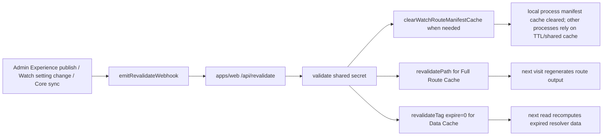

# Harden Watch Cache Invalidation

## Overview

The watch pages are now static/ISR-style routes after the internal locale rewrite work. They are a good fit for longer cache lifetimes because the product is a video catalog, not a news surface, and most page content changes only when Admin publishes an Experience, Watch settings change, or Core sync brings in updated video/dub/language data.

The blocker is not whether these pages can be cached. They can. The blocker is that the current invalidation only clears the Full Route Cache via `revalidatePath`, while the watch resolvers also sit behind `unstable_cache` entries that have no tags. If we simply raise `revalidate` / `s-maxage` from 60 seconds to 1 hour or 1 day, stale resolver data can survive until its own TTL expires, and some Core sync updates do not currently emit any video-page invalidation at all.

This plan fixes cache correctness first, then cautiously raises route TTLs once the invalidation path is provably coherent. U1-U4 shipped first with a 60 second route TTL; after production webhook and topology proof on 2026-06-10, U5 raised the route TTL to 3600 seconds while keeping resolver TTLs unchanged.

## Problem Statement

### Current cache shape

The public watch route renders through `apps/web/src/app/[locale]/[htmlLang]/**` with route-level ISR:

- `apps/web/src/app/[locale]/[htmlLang]/page.tsx`
- `apps/web/src/app/[locale]/[htmlLang]/[...rest]/page.tsx`

The page routes export `revalidate = 3600`, `dynamic = "force-static"`, and `dynamicParams = true`. Live probing before the TTL follow-up showed `x-nextjs-prerender: 1`, a stale-then-hit `x-nextjs-cache` pattern, and compressed HTML around 43 KB for the Gospel of John URL, which matches the intended ISR behavior.

The render tree then calls resolver helpers in:

- `apps/web/src/lib/content.ts`
- `apps/web/src/lib/watch-home.ts`
- `apps/web/src/lib/watch-route-manifest.ts`

Most watch resolver helpers use `unstable_cache(..., { revalidate: 60 })`; `fetchVideoChildDubLanguages` uses 1 hour; the route manifest has its own 60 second process-local memory cache and an explicit `clearWatchRouteManifestCache()` helper.

### Current invalidation gap

`apps/web/src/app/api/revalidate/route.ts` accepts Admin webhooks for:

- `experience`
- `video`
- `watch-route-manifest`
- `watch-setting`

It currently calls `revalidatePath` for relevant public, internal, and legacy paths. It does not import or call `revalidateTag`. `apps/web/CLAUDE.md` already calls this out: `revalidatePath` from `/api/revalidate` does not invalidate `unstable_cache` entries, and tag-based invalidation is a known follow-up.

That means a path can be regenerated while still reading stale data from the Data Cache. With 60 second data TTLs the bug is usually small. With 1 hour or 1 day data TTLs it becomes very visible.

### Current emitter gap

Admin Experience publishing has explicit revalidation emitters in `apps/admin/src/services/experience.service.ts`. Core sync currently refreshes the watch route manifest after route-relevant phases through `apps/admin/src/services/watch-route-manifest-refresh.service.ts`, and that service emits only `model: "watch-route-manifest"`.

There is no production `emitRevalidateWebhook({ model: "video", ... })` call for actual video metadata/dub/subtitle/image updates. `apps/admin/src/services/video.service.ts` is read-only in v1; writes come through Core sync. So the `video` model exists in the revalidation contract, but current Core sync does not use it for rendered video page data.

## Requirements

1. Keep the public watch URL contract unchanged; cache fixes must work with the internal `/{locale}/{htmlLang}` rewrite and the existing `.html` public URLs.
2. Preserve current `revalidatePath` coverage for Full Route Cache invalidation across public, internal, generated-UI-locale, and legacy path shapes.
3. Add tag invalidation for every `unstable_cache` entry that can feed watch home, watch experience, collection, video, episode, series, and child-dub language UI.
4. Use the supported Route Handler API: `revalidateTag(tag, { expire: 0 })`, not `updateTag`, because `updateTag` is server-action-only and `profile="max"` serves stale data before background refresh.
5. Ensure Admin Experience publishing, Watch settings changes, watch route manifest refreshes, and render-relevant Core sync phases all invalidate both route output and resolver data.
6. Treat webhook delivery as best-effort but observable. Failures may still be swallowed to avoid blocking Admin writes, but logs/tests must make it obvious what was attempted.
7. Do not increase data-cache TTLs in the first correctness slice. Longer data TTLs are only safe after tag coverage and production cache topology are confirmed.
8. Keep route-level `revalidate` at 60 seconds for the first correctness PR; raise it toward 1 hour only after preview/topology proof, rather than jumping straight to 1 day. Completed on 2026-06-10 after production webhook and topology proof.
9. Document the remaining multi-instance/self-hosted cache risk before declaring invalidation "instant" in production.

## Context & Research

### Repo findings

- `apps/web/src/app/api/revalidate/route.ts` clears paths only. It already knows the relevant public/internal/legacy path matrix, so the path logic should be extended, not replaced.
- `apps/web/src/app/api/revalidate/route.test.ts` mocks only `revalidatePath`; tests should be extended to mock and assert `revalidateTag`.
- `apps/web/src/lib/content.ts` defines watch resolver caches without tags: `watch-page`, `watch-experience-page`, `watch-video`, `watch-video-by-slug`, and `series-by-slug`.
- `apps/web/src/lib/watch-home.ts` caches the homepage model behind `["watch-home", WATCH_HOME_CACHE_VERSION]`.
- `apps/web/src/lib/watch-route-manifest.ts` keeps a 60 second in-process manifest cache and exposes `clearWatchRouteManifestCache()`.
- `apps/admin/src/services/revalidate-webhook.ts` already supports `model: "video"` but does not throw on webhook failure.
- `apps/admin/src/services/watch-route-manifest-refresh.service.ts` emits `model: "watch-route-manifest"` after route-relevant Core sync phases: `languages`, `videos`, and `video-dubs`.
- Core sync has more render-relevant phases than route-relevant phases: `video-images`, `video-editions`, `video-subtitles`, and `video-dub-downloads` can change visible watch page content without necessarily changing the route manifest.
- `docs/solutions/web/nextjs16-cachecomponents-isr.md` records the earlier route-level ISR decision.
- `docs/solutions/web/nextjs-headers-defeats-route-cache.md` explains why dynamic APIs must stay out of the render path.
- `docs/solutions/architecture-patterns/admin-owned-watch-route-manifest-20260530.md` explains why the manifest is Admin-owned and refreshed after languages/videos/video-dubs changes.
- `docs/roadmap/platform/feat-163-admin-experience-watch-revalidation.md` is complete and covers a narrower precursor: Admin Experience Watch Revalidation.

### External framework findings

Official Next.js docs shape the implementation:

- [`revalidateTag`](https://nextjs.org/docs/app/api-reference/functions/revalidateTag) invalidates cached data by tag. `profile="max"` is stale-while-revalidate; webhook-driven watch invalidation uses `{ expire: 0 }` so the first render after the webhook does not rehydrate the route from stale resolver data. Calling without the second argument is deprecated.
- [`revalidatePath`](https://nextjs.org/docs/app/api-reference/functions/revalidatePath) revalidates route output and can be called from Route Handlers. In Route Handlers, it marks a path for revalidation and regeneration happens on the next visit.
- [`unstable_cache`](https://nextjs.org/docs/app/api-reference/functions/unstable_cache) supports a `tags` option; tags are not part of the cache key but are used for invalidation.
- [`updateTag`](https://nextjs.org/docs/app/api-reference/functions/updateTag) is server-action-only, so it should not be used in `/api/revalidate`.
- [`Self-Hosting`](https://nextjs.org/docs/app/guides/self-hosting) warns that App Router cache assets are local to the Next server by default. Multi-instance deployments need shared cache/tag coordination if they require immediate global invalidation.

Context7 could not be used during research because its OAuth token was expired, so the plan uses official Next.js web docs directly.

## Key Technical Decisions

1. **Keep path invalidation and add tags.** `revalidatePath` and `revalidateTag` solve different cache layers. Path invalidation should continue to clear rendered route output; tag invalidation should clear resolver data.
2. **Use a small tag helper module in web.** Add a single web-owned helper such as `apps/web/src/lib/watch-cache-tags.ts` so cache declarations and `/api/revalidate` use the same tag names.
3. **Use coarse tags in the first PR.** The existing `unstable_cache` wrappers are module-level declarations, so their `tags` options should be treated as static. Coarse tags guarantee correctness for broad Core sync events without reshaping cache wrappers. Scoped tags can be a later optimization if the implementation deliberately moves to a cache-factory pattern or a newer dynamic tagging API.
4. **Treat Core sync render relevance separately from manifest route relevance.** The manifest only needs refreshing for route admission changes, but rendered page data changes for more phases. Core sync should emit a broad watch-data invalidation whenever render-relevant phases ran, even if the manifest did not change.
5. **Do not lengthen TTLs in the same correctness slice.** Leave route-level `revalidate` at 60 seconds and leave `unstable_cache` `revalidate` values at 60 seconds / 1 hour initially. After tag invalidation is tested in preview and production topology is understood, route-level `revalidate` can move to 3600 seconds. U5 completed this follow-up after production proof.
6. **Production multi-instance behavior is an ops decision, not a code assumption.** If Railway runs multiple isolated Next instances without a shared cache handler, tag invalidation may not fan out immediately everywhere. The plan must document that limitation and keep a TTL fallback.

## High-Level Technical Design



The web route handler remains the single public invalidation surface. Admin continues to send semantic models rather than raw Next cache details. Web maps those semantic models to paths and tags.

## Proposed Tag Taxonomy

Use constants rather than ad hoc strings. Final naming can change during implementation, but the first PR should keep to coarse tags that existing module-level `unstable_cache` wrappers can attach statically:

- `watch:home` for `getCachedWatchHomeModel`
- `watch:settings` for watch homepage/template settings dependencies
- `watch:experience` for all experience/collection resolver data
- `watch:video` for all video/episode resolver data
- `watch:series` for series/child episode data
- `watch:child-dub-languages` for the 1 hour child-dub language cache
- `watch:route-manifest` for manifest/admission dependencies when represented in Next's Data Cache

Future scoped tags such as `watch:video:{slug}` or `watch:experience:{locale}:{slug}` are useful only if the cache declaration can reliably attach that same scoped tag. Do not emit scoped invalidations in the first PR unless a matching scoped cache tag exists.

## Scope Boundaries

### In scope

- Web cache tag helper and watch resolver tag coverage.
- `/api/revalidate` tag mapping and tests.
- Admin/Core sync invalidation emission for render-relevant watch data.
- Route-level TTL recommendation and implementation after correctness proof.
- Documentation of remaining production cache-topology risks.

### Out of scope

- Cloudflare HTML caching rules or CDN cache-control changes.
- A custom shared Next cache handler or Redis-backed tag store.
- Rebuilding the watch route manifest architecture.
- New comments, ratings, personalization, auth-aware UI, or player feature work.
- Moving from `unstable_cache` to Cache Components/cacheTag in this PR.

## Implementation Units

### U1. Add web watch cache tag helpers

**Files**

- `apps/web/src/lib/watch-cache-tags.ts` (new)
- `apps/web/src/lib/watch-cache-tags.test.ts` (new, if the repo's test layout accepts sibling lib tests)

**Approach**

Define a small set of constants for coarse watch tags. The helper should be boring and deterministic; no access to request state, env, GraphQL, or Next APIs.

**Test scenarios**

- Exported tag constants match the documented names.
- Group helpers, if added, return deduped tag arrays for `watch-setting`, `experience`, `video`, and `watch-route-manifest`.
- No helper can produce `undefined`-suffixed strings.

### U2. Tag every watch resolver cache

**Files**

- `apps/web/src/lib/content.ts`
- `apps/web/src/lib/watch-home.ts`
- `apps/web/src/lib/watch-route-manifest.ts` only if a Next Data Cache wrapper is introduced later; otherwise keep the process cache explicit.

**Approach**

Add `tags` to each `unstable_cache` options object. Keep tags coarse for the first implementation because the current wrappers are module-level declarations. Do not move cache wrapper construction into hot code just to get scoped tags unless a later performance measurement proves broad invalidation is too expensive.

Keep the existing `revalidate` values unchanged:

- 60 seconds for the main watch resolvers.
- 1 hour for child-dub language data.

**Test scenarios**

- Existing watch resolver tests remain green.
- Where cache options are directly testable, assert that each watch cache includes at least one coarse watch tag.
- Manual smoke in development can still render home, experience, video, episode, and series pages.

### U3. Extend `/api/revalidate` to invalidate tags

**Files**

- `apps/web/src/app/api/revalidate/route.ts`
- `apps/web/src/app/api/revalidate/route.test.ts`

**Approach**

Import `revalidateTag` from `next/cache`. Keep the existing path push helpers, then add tag push helpers that dedupe tag names and call `revalidateTag(tag, { expire: 0 })`.

Map semantic models to tags:

- `watch-setting`: `watch:home`, `watch:settings`, and broad experience/video tags if homepage composition can include either.
- `experience`: broad experience tag, plus home/settings tags if homepage changes are indicated by payload.
- `video`: broad video, series, and child-dub tags.
- `watch-route-manifest`: clear process manifest cache, invalidate `watch:route-manifest`, and revalidate watch layouts; consider broad video/experience/home tags only when the Admin payload says render-relevant Core sync phases ran.

Support `video` payloads without a slug as broad invalidations. Missing-slug video events must still invalidate broad tags and the watch layouts.

**Test scenarios**

- Authorized `experience` payload calls both `revalidatePath` for the existing path matrix and `revalidateTag(..., { expire: 0 })` for broad experience tags.
- Authorized `video` payload with slug/language calls the existing path matrix and broad video tags.
- Authorized `video` payload without slug calls broad tags, revalidates watch layouts, and does not throw.
- Authorized `watch-setting` payload invalidates home/settings tags and existing homepage/layout paths.
- Authorized `watch-route-manifest` payload clears the manifest cache, invalidates the manifest tag, and revalidates watch layouts.
- Unauthorized, invalid secret, and invalid JSON requests call neither `revalidatePath` nor `revalidateTag`.
- Repeated path/tag candidates are deduped before invoking Next cache APIs.

### U4. Wire Admin/Core sync render-relevant invalidation

**Files**

- `apps/admin/src/services/revalidate-webhook.ts`
- `apps/admin/src/services/watch-route-manifest-refresh.service.ts`
- `apps/admin/src/services/core-sync/orchestrator.ts` if the phase summary must be carried farther than the manifest service currently receives it.
- `apps/admin/src/services/watch-route-manifest-refresh.service.test.ts`
- `apps/admin/src/services/revalidate-webhook.test.ts`

**Approach**

Keep the Admin webhook semantic and best-effort. Add a render-relevant phase set distinct from the existing route-manifest phase set:

- Route-manifest relevant: `languages`, `videos`, `video-dubs`.
- Watch-render relevant: `languages`, `videos`, `video-images`, `video-editions`, `video-subtitles`, `video-dubs`, `video-dub-downloads`.

When render-relevant phases ran, emit a broad watch video invalidation. The lowest-risk contract is `model: "video", slug: null, locale: null`, because web can interpret missing slug as "all watch video data". If the implementation can cheaply derive changed slugs from Core sync outputs, add scoped payloads as a follow-up, not as a prerequisite.

If route-manifest and render-relevant phases overlap, send both semantic events or a single richer event only if the web contract remains simple and tests cover both effects. Prefer explicit events over overloading `watch-route-manifest` to mean all rendered video data.

**Test scenarios**

- Core sync with only `countries` or `keywords` does not emit watch-render invalidation.
- Core sync with `video-images` emits watch-render invalidation even though the route manifest does not need refreshing.
- Core sync with `videos` refreshes the route manifest and emits watch-render invalidation.
- Webhook failure remains non-blocking and logged.
- Existing Experience publish/update/archive revalidation tests remain green.

### U5. Follow-up: raise route-level TTL after preview/topology proof

**Files**

- `apps/web/src/app/[locale]/[htmlLang]/page.tsx`
- `apps/web/src/app/[locale]/[htmlLang]/[...rest]/page.tsx`
- `apps/web/src/app/[locale]/[htmlLang]/videos/page.tsx` if it declares its own route-level revalidate.
- `apps/web/CLAUDE.md`

**Approach**

After U1-U4 pass and preview/topology proof is collected, change route-level `revalidate` from 60 to 3600 seconds for the static watch page routes. This targets fast repeat loads while keeping a 1 hour fallback if a webhook is missed or a process does not receive tag invalidation.

Completed on 2026-06-10 after authorized production webhook smoke for `experience`, broad `video`, and `watch-route-manifest` payloads plus Helium smoke of representative live watch pages.

Do not increase resolver/data-cache TTLs in this unit. The Data Cache should stay short until production invalidation evidence is collected.

**Test scenarios**

- Build/typecheck verifies the route exports still compile.
- Existing route tests pass.
- Manual or scripted curl against a deployed preview shows first request may regenerate, repeat request is a HIT within the 3600 second window, and Admin revalidation still causes a new render on next visit.

### U6. Document production topology and rollout proof

**Files**

- `apps/web/CLAUDE.md`
- `apps/admin/CLAUDE.md`
- Optional follow-up solution doc under `docs/solutions/web/` after implementation proves the behavior.

**Approach**

Document the exact cache contract:

- Route paths are invalidated with `revalidatePath`.
- Resolver data is invalidated with `revalidateTag(tag, { expire: 0 })`.
- Admin webhooks are best-effort and require matching `REVALIDATION_SECRET`.
- In-process route manifest caches clear only in the process that receives the webhook; other processes rely on TTL unless production uses a shared cache/instance fan-out.
- If Railway runs more than one Next instance, instant global invalidation requires a shared cache handler or all-instance webhook delivery.

**Test expectation**

Documentation-only; no automated test required beyond keeping existing docs links and names accurate.

## Validation Plan

Run focused validation before raising TTL:

```bash
pnpm --filter @forge/web test -- src/app/api/revalidate/route.test.ts
pnpm --filter @forge/web test -- src/lib/watch-cache-tags.test.ts
pnpm --filter @forge/admin test -- src/services/watch-route-manifest-refresh.service.test.ts
pnpm --filter @forge/admin test -- src/services/revalidate-webhook.test.ts
pnpm --filter @forge/web typecheck
pnpm --filter @forge/admin typecheck
```

Then run a preview smoke:

1. Request a known video URL twice and confirm the second request is served from the Next cache.
2. Send an authorized `experience` revalidation payload and confirm the next request regenerates route output and refreshes resolver data.
3. Send an authorized broad `video` revalidation payload and confirm video resolver data is not held by the old cache entry.
4. Send a `watch-route-manifest` payload and confirm the receiving process clears `clearWatchRouteManifestCache()`.
5. Confirm unauthorized revalidation attempts do not touch paths or tags.

## Rollout Plan

1. Ship U1-U4 with route TTL still at 60 seconds.
2. Deploy to preview/staging and verify path + tag invalidation with real webhook payloads.
3. Check production topology: number of web instances, whether Next cache storage is shared, whether Railway can fan out webhooks, and whether Cloudflare is caching HTML or only proxying.
4. If topology is single-instance or shared-cache enough for current expectations, ship the TTL follow-up and raise route-level `revalidate` to 3600.
5. Watch logs for revalidation failures and unexpected route regeneration volume.
6. Consider a later PR for 6 hour or 24 hour route TTL only after missed-webhook behavior and multi-instance cache behavior are understood.

## Risks & Mitigations

- **Risk: broad Core sync invalidation causes many pages to regenerate after sync.** Mitigation: start with correctness; measure regeneration volume; add scoped slug derivation later if needed.
- **Risk: broad tags regenerate more content than strictly necessary.** Mitigation: measure regeneration volume before adding scoped tags; correctness is more important than fine-grained invalidation in the first PR.
- **Risk: webhook failure remains silent to editors.** Mitigation: keep non-blocking writes, but improve structured logs and optionally add an ops follow-up for failed invalidation alerts.
- **Risk: multi-instance Next caches do not all receive tag invalidation.** Mitigation: keep TTL fallback, document the limitation, and defer shared cache handler/fan-out until production topology proves it is needed.
- **Risk: stale route manifest survives in another process.** Mitigation: keep the 60 second process cache TTL and do not claim manifest invalidation is globally instant without shared cache support.
- **Risk: data TTL is raised too early.** Mitigation: explicitly leave resolver TTLs unchanged in this plan's first implementation slice.

## Open Questions

1. How many `apps/web` instances run in production, and do they share Next cache storage? Railway showed `@forge/web` online in one visible US West region, but the available CLI path did not expose exact replica count. The 1 hour route TTL remains the fallback if invalidation does not reach every process immediately.
2. Does Cloudflare currently cache any watch HTML, or is it only proxying dynamic responses? Production probing on 2026-06-10 showed `cf-cache-status: DYNAMIC`, so Cloudflare was proxying watch HTML rather than serving an HTML edge cache hit.
3. Can Core sync cheaply report changed video slugs per phase, or should the first implementation intentionally stay broad?
4. Should `watch-route-manifest` remain admission-only, or should Admin send a second broad `video` event whenever manifest-relevant phases also changed rendered data? This plan recommends the second event for clarity.
5. After route TTL moves to 3600, what stale-content SLO is acceptable for a missed webhook: 1 hour, 6 hours, or 24 hours?

## Acceptance Criteria

- `/api/revalidate` calls `revalidateTag(tag, { expire: 0 })` for all relevant semantic models while preserving existing `revalidatePath` behavior.
- Watch resolver `unstable_cache` declarations include tags that correspond to the route-handler invalidation map.
- Broad `video` invalidation works even when Admin/Core sync cannot provide a slug.
- Core sync emits watch-render invalidation for render-relevant phases, including at least `video-images`, `video-editions`, `video-subtitles`, and `video-dub-downloads`.
- Unauthorized revalidation calls do not invalidate paths or tags.
- Route-level `revalidate` was not raised in the first correctness PR; U5 raised it only after path + tag invalidation tests, production smoke, and topology proof.
- Route-level `revalidate` is now 3600 seconds.
- Documentation names the residual multi-instance/process-local manifest cache limitation.

## Recommended TTL Policy

For the current product shape:

- **Now:** route-level watch pages use `revalidate = 3600` after U1-U4 plus production smoke/topology proof.
- **Fallback:** missed route-output invalidation can leave a route stale for up to 1 hour.
- **Data caches:** keep main resolver `unstable_cache` TTLs at 60 seconds for the first correctness rollout; keep child-dub language data at 1 hour.
- **Later:** consider 6 to 24 hour route TTLs after production invalidation evidence, not before.

This gives fast repeat loads while preserving a reasonable fallback if an Admin webhook is missed.
