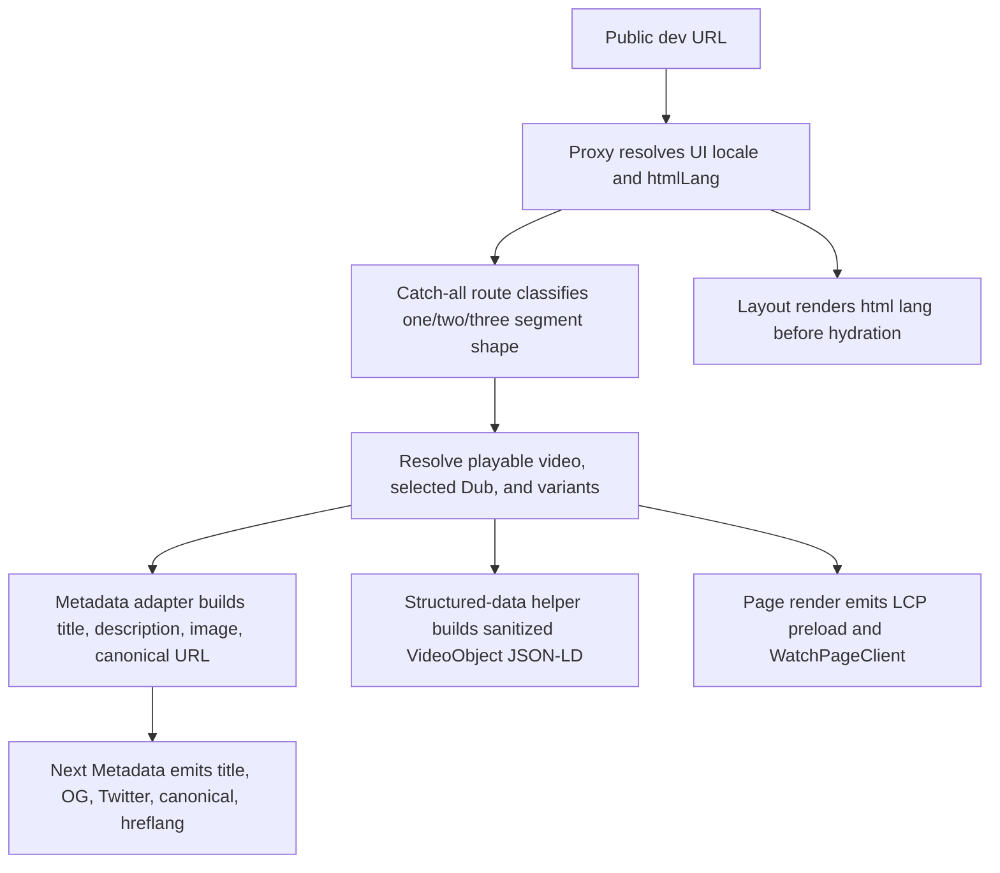

# fix: Watch Dev Launch Readiness

## Summary

Fix the Watch dev-server audit regressions that matter before the redesigned
Watch app can replace production: readable video metadata, film-relevant social
images, hreflang and structured data, server-rendered language semantics,
single-H1 and image-alt hygiene, and a targeted mobile LCP recheck. The plan
keeps canonical URLs pointed at production `www.jesusfilm.org`; that is the
right contract for a dev server.

---

## Problem Frame

The June 9 audit of
`https://watch.jesusfilm.org/watch/life-of-jesus-gospel-of-john.html/english.html`
showed a strong base: Lighthouse SEO was high, accessibility was 96, CLS was 0,
and the page already emitted canonical, robots, Open Graph locale, and Twitter
card metadata. The remaining issues are launch-blocking polish rather than a
rewrite: slug-based titles in social metadata, a generic stock image, missing
hreflang and JSON-LD, a WAVE language warning, empty-alt and duplicate-H1
warnings, and mobile LCP around 10.9 s.

The user clarified that `watch.jesusfilm.org` is the dev server and
`www.jesusfilm.org` is production. Existing roadmap ticket
`docs/roadmap/platform/feat-160-watch-public-metadata-origin.md` and the current
`WATCH_PUBLIC_METADATA_ORIGIN` code establish that SEO metadata from dev,
preview, or watch-only deployments should still name the indexed production
host.

---

## Requirements

**SEO and Social Metadata**

- R1. Video and episode metadata uses the resolved video title, not the URL
  slug, for `<title>`, Open Graph title, and Twitter title.
- R2. Open Graph and Twitter images use a film-relevant still from the resolved
  video or selected Dub before falling back to generic Watch imagery.
- R3. Canonical and `og:url` continue to point at
  `https://www.jesusfilm.org/watch/...` on dev, preview, and watch-only hosts.
- R4. Video pages emit hreflang alternates for playable language variants using
  public audio-language URL slugs and BCP-47 tags.
- R5. Playable video pages emit sanitized JSON-LD structured data that
  describes the watchable video page.

**Accessibility and Semantics**

- R6. Raw server-rendered HTML includes a valid `<html lang>` before client
  JavaScript runs.
- R7. The watch page has exactly one semantic H1 for the playable title.
- R8. Empty image alt attributes are reserved for decorative images; informative
  thumbnails, posters, and social/modal previews have meaningful alt text.

**Performance**

- R9. The LCP poster preload remains discoverable in initial HTML and matches
  the hero poster URL exactly.
- R10. Mobile LCP remediation stays targeted to the hero/player and known
  unused-JavaScript contributors surfaced by the audit.

---

## Acceptance Examples

- AE1. Given the English Gospel of John dev URL, when metadata is rendered, then
  title, Open Graph title, and Twitter title read as a human video title plus
  the brand suffix, not `life-of-jesus-gospel-of-john`.
- AE2. Given the same URL on the dev server, when canonical and `og:url` are
  inspected, then both point at the matching `www.jesusfilm.org/watch/...`
  production URL.
- AE3. Given a playable video with English and Spanish Dubs, when metadata is
  rendered, then hreflang links include the English and Spanish public watch
  URLs with BCP-47 language tags.
- AE4. Given a playable video with a Mux playback id but no curated still, when
  social metadata and JSON-LD are rendered, then the fallback image is a Mux
  video thumbnail rather than the generic Unsplash image.
- AE5. Given raw server HTML for the dev URL, when an accessibility crawler
  reads it before hydration, then it can detect a valid page language and one
  H1.

---

## Key Technical Decisions

- KTD1. **Canonical production host stays pinned:** `watch.jesusfilm.org` is a
  dev server, so canonical and `og:url` must continue using
  `WATCH_PUBLIC_METADATA_ORIGIN` instead of the request host or
  `NEXT_PUBLIC_CANONICAL_ORIGIN`.
- KTD2. **Video-route metadata should reuse the richer watch-video resolution
  path:** The page body already resolves the selected video and Dub for
  rendering. Metadata for two- and three-segment video routes should consume
  the same normalized title, description, image, language, and selected Dub
  source instead of falling through to a separate slug/template fallback that
  can expose raw slugs.
- KTD3. **Social image fallback follows the Watch poster chain:** Use the same
  `resolvePosterUrl` priority as the visible Watch page so curated cinematic
  stills win, thumbnail crops are acceptable fallbacks, and Mux thumbnails are
  the final video-specific fallback.
- KTD4. **Hreflang is generated from playable Dubs, not UI catalogs:** The
  public URL language segment is the audio language slug, while the hreflang
  value is the Dub language's BCP-47 tag. UI message catalog availability does
  not decide whether a playable audio page is an alternate.
- KTD5. **JSON-LD renders as a native script in the route tree:** Next.js does
  not put arbitrary scripts inside the Metadata API; structured data should be
  rendered from the page/layout component with JSON output sanitized for `<`.
- KTD6. **Accessibility fixes distinguish bugs from decorative intent:** Empty
  alt text is correct for decorative overlays or atmospheric Bible quote cards
  when they are hidden from assistive technology. Content-bearing posters and
  thumbnails should use the title or authored alt text fallback.
- KTD7. **Performance work starts from the existing Watch LCP playbook:** The
  page already has Mux preconnects, a matching LCP preload, MuxVideo path, HLS
  buffer caps, and lazy sibling thumbnails. The implementation should first
  verify those are active in the dev build before adding new bundle work.

---

## High-Level Technical Design

The metadata adapter is the center of the change. It should accept already
resolved video data when the route has it, fall back to existing
`getWatchPageMetadata` behavior for experience pages, and keep canonical URL
construction inside the established route builders.

---

## Scope Boundaries

- In scope: the audited video and episode metadata path, social image fallback,
  hreflang, structured data, raw HTML language semantics, H1/alt verification,
  and targeted LCP remediation.
- In scope: regression tests that preserve production canonical ownership while
  fixing dev-server metadata content.
- Out of scope: switching indexed ownership from `www.jesusfilm.org` to
  `watch.jesusfilm.org`.
- Out of scope: a broad redesign of the Watch page, search, recommendations,
  language picker, or download flow.

### Deferred to Follow-Up Work

- A full sitemap-level hreflang matrix can follow if implementation proves
  page-head hreflang for high-Dub-count videos is too large for reliable
  crawler or runtime behavior.
- Removing the hero MuxPlayer flag-off branch can follow after the MuxVideo path
  has been enabled and stable for a release.
- Replacing generic imagery in non-video Bible quote or editorial blocks can
  follow if the audit confirms those images are content-bearing rather than
  decorative.

---

## Implementation Units

### U1. Video Metadata Source Alignment

- **Goal:** Make video and episode metadata use the same resolved video and Dub
  data that the page body renders.
- **Requirements:** R1, R2, R3, AE1, AE2, AE4.
- **Dependencies:** None.
- **Files:** `apps/web/src/app/[locale]/[htmlLang]/[...rest]/page.tsx`,
  `apps/web/src/lib/experience-metadata.ts`,
  `apps/web/src/lib/content.ts`,
  `apps/web/src/lib/fragments/watch-video.ts`,
  `apps/web/src/lib/experience-metadata.test.ts`,
  `apps/web/src/lib/__tests__/experience-metadata-watch-page.test.ts`,
  `apps/web/src/app/[locale]/[htmlLang]/[...rest]/__tests__/page-routing.test.tsx`.
- **Approach:** Add a route-video metadata path that accepts the resolved
  playable video, selected Dub, and public path language slug. Use it in the
  two-segment video route and three-segment episode route before falling back to
  the existing template/experience metadata helper. Preserve the completed
  production-origin contract by continuing to build absolute metadata URLs from
  `WATCH_PUBLIC_METADATA_ORIGIN`.
- **Execution note:** Add characterization coverage for the current canonical
  contract before changing title or image behavior.
- **Patterns to follow:** `generateSeriesMetadata` in
  `apps/web/src/lib/experience-metadata.ts`; public URL builders in
  `apps/web/src/lib/routes.ts`; canonical origin tests in
  `apps/web/src/lib/__tests__/experience-metadata-watch-page.test.ts`.
- **Test scenarios:**
  - Covers AE1. A two-segment video route with a resolved title renders title,
    Open Graph title, and Twitter title from that title.
  - Covers AE2. The same route renders canonical and `openGraph.url` on
    `https://www.jesusfilm.org/watch/...` even when the app is served from the
    dev host.
  - A route whose video resolver throws still returns safe fallback metadata
    rather than dropping metadata entirely.
  - An episode route uses the playable episode title and selected language,
    while keeping the episode production URL shape.
  - A series route still delegates to `generateSeriesMetadata` and does not
    regress series poster behavior.
- **Verification:** Metadata snapshots show no slug fallback when resolved video
  title data is present, and canonical-origin tests keep passing.

### U2. Social Image and Twitter Metadata Parity

- **Goal:** Ensure shared links show readable video titles and film-relevant
  imagery across Open Graph and Twitter cards.
- **Requirements:** R1, R2, R8, AE1, AE4.
- **Dependencies:** U1.
- **Files:** `apps/web/src/lib/experience-metadata.ts`,
  `apps/web/src/lib/url.ts`,
  `apps/web/src/lib/experience-metadata.test.ts`,
  `apps/web/src/components/watch/__tests__/ShareModal.test.tsx`.
- **Approach:** Reuse `resolvePosterUrl` for metadata image selection and set
  Twitter title, description, and image from the same values used by Open Graph.
  Keep `DEFAULT_OG_IMAGE` as a last resort for non-video or data-missing pages,
  not for playable videos with posters or Mux playback ids.
- **Patterns to follow:** `WatchPageClient` poster selection in
  `apps/web/src/components/watch/WatchPageClient.tsx`; `resolvePosterUrl` in
  `apps/web/src/lib/url.ts`.
- **Test scenarios:**
  - Covers AE4. A playable video with `mobileCinematicHigh` uses that URL for
    Open Graph and Twitter images.
  - A playable video without curated images but with a Mux playback id uses the
    Mux thumbnail fallback rather than `DEFAULT_OG_IMAGE`.
  - Twitter metadata includes the same title and image as Open Graph for the
    resolved video.
  - A video with authored image alt uses it; a video without authored alt uses
    the resolved title fallback.
  - A non-video experience without imagery still uses the existing generic
    fallback image.
- **Verification:** Share metadata tests fail if a playable video falls back to
  the Unsplash default while a poster or Mux thumbnail is available.

### U3. Hreflang and Structured Data

- **Goal:** Add crawler-facing language alternates and structured data for
  playable watch pages.
- **Requirements:** R4, R5, AE3, AE4.
- **Dependencies:** U1, U2.
- **Files:** `apps/web/src/lib/experience-metadata.ts`,
  `apps/web/src/lib/routes.ts`,
  `apps/web/src/app/[locale]/[htmlLang]/[...rest]/page.tsx`,
  `apps/web/src/lib/watch-structured-data.ts`,
  `apps/web/src/lib/experience-metadata.test.ts`,
  `apps/web/src/app/[locale]/[htmlLang]/[...rest]/__tests__/page-routing.test.tsx`.
- **Approach:** Generate `alternates.languages` from playable Dubs that have a
  public language slug and BCP-47 tag, de-duping duplicate tags by first
  playable URL. Render a sanitized native `application/ld+json` script for
  video and episode pages using the same title, description, canonical URL, and
  thumbnail source as metadata. Use no new dependency unless implementation
  reveals typing value that outweighs the extra package.
- **Technical design:** Directional only: a metadata candidate should carry
  `title`, `description`, `canonicalUrl`, `image`, `selectedLanguage`, and
  `alternateLanguages`; structured data should consume that candidate rather
  than rebuilding URLs independently.
- **Patterns to follow:** Next.js Metadata API `alternates.languages`; Next.js
  JSON-LD guide for native script rendering and `<` escaping; existing route
  builders in `apps/web/src/lib/routes.ts`.
- **Test scenarios:**
  - Covers AE3. English and Spanish playable Dubs produce English and Spanish
    hreflang links with production absolute URLs.
  - Duplicate BCP-47 tags do not produce duplicate hreflang keys.
  - A Dub missing a public slug or BCP-47 tag is omitted from alternates without
    breaking metadata for the selected page.
  - Covers AE4. JSON-LD uses the same Mux fallback thumbnail when no curated
    image exists.
  - JSON-LD sanitizes `<` in title or description before it reaches the script
    body.
- **Verification:** Rendered head includes canonical plus alternate hreflang
  links for playable Dubs, and the page body contains one JSON-LD script that
  validates structurally in tests.

### U4. Server-Rendered Accessibility Semantics

- **Goal:** Resolve or guard the WAVE language, duplicate-H1, and image-alt
  findings without changing visual design.
- **Requirements:** R6, R7, R8, AE5.
- **Dependencies:** U1.
- **Files:** `apps/web/src/app/[locale]/[htmlLang]/layout.tsx`,
  `apps/web/src/proxy.ts`,
  `apps/web/src/lib/locale.ts`,
  `apps/web/src/components/watch/HeroPlayer.tsx`,
  `apps/web/src/components/watch/WatchBody.tsx`,
  `apps/web/src/components/watch/BibleQuotesSection.tsx`,
  `apps/web/src/components/watch/__tests__/HeroPlayer.test.tsx`,
  `apps/web/src/components/watch/__tests__/WatchBody.test.tsx`,
  `apps/web/src/components/watch/__tests__/BibleQuotesSection.test.tsx`,
  `apps/web/src/proxy.test.ts`.
- **Approach:** First prove whether raw server HTML already carries
  `<html lang>` for the public dev URL; patch the locale rewrite/layout only if
  the raw HTML is missing or mismatched. Keep `HeroPlayer` as the single H1
  owner, keep body title copies as H2 or lower, and classify each empty-alt
  image in the audited page as decorative or informative. Decorative images
  should stay empty-alt with assistive-tech-hidden semantics; informative
  images should use authored alt or title fallback.
- **Execution note:** Treat the duplicate-H1 finding as characterization-first
  because `WatchBody` already appears to render the repeated body title as H2
  on this branch.
- **Patterns to follow:** The H2 comment in `WatchBody`; `SeriesHero` decorative
  poster treatment; the locale identity separation documented in
  `apps/web/CLAUDE.md`.
- **Test scenarios:**
  - Covers AE5. The public English route resolves to a server-rendered
    `<html lang="en">` before hydration.
  - Rendering `HeroPlayer` plus `WatchBody` for the same video produces one H1
    and one repeated body heading below H1 level.
  - Decorative Bible quote images are hidden from assistive technology and keep
    empty alt.
  - Informative poster/modal images use authored alt when present and title
    fallback otherwise.
  - Non-English public audio slug routes keep content-language and UI-locale
    identities separate while still producing a valid HTML lang tag.
- **Verification:** Raw HTML and component tests explain the WAVE finding: fixed
  if real, documented as decorative/false-positive if already correct.

### U5. Mobile LCP and Unused-JavaScript Readiness Check

- **Goal:** Reduce the reported mobile LCP risk with targeted Watch hero/player
  checks rather than a broad bundle rewrite.
- **Requirements:** R9, R10.
- **Dependencies:** U1, U2.
- **Files:** `apps/web/src/app/[locale]/[htmlLang]/[...rest]/page.tsx`,
  `apps/web/src/app/[locale]/[htmlLang]/layout.tsx`,
  `apps/web/src/components/watch/HeroPlayer.tsx`,
  `apps/web/src/components/watch/SiblingCarousel.tsx`,
  `apps/web/src/components/sections/index.tsx`,
  `apps/web/src/env.ts`,
  `packages/video-player/package.json`,
  `apps/web/src/components/watch/__tests__/HeroPlayer.test.tsx`.
- **Approach:** Verify the dev deployment has the existing LCP improvements
  active: Mux preconnects, exactly one hero poster preload, matching
  `thumbnail.webp?width=1280` poster URL, MuxVideo flag path where expected,
  HLS buffer caps, lazy sibling thumbnails, and dynamic section renderer
  splitting. If the MuxVideo flag is off on the dev server, treat enabling it
  as the first remediation before adding code. If unused JavaScript remains the
  dominant issue after that, inspect whether section players still pull legacy
  player code through barrel imports and apply the existing subpath-export
  pattern.
- **Patterns to follow:**
  `docs/solutions/performance-issues/web-watch-route-lighthouse-perf-campaign-lcp-bundle-fonts-20260527.md`;
  `docs/solutions/performance-issues/watch-hero-muxplayer-to-muxvideo-swap-20260526.md`.
- **Test scenarios:**
  - The HeroPlayer MuxVideo path still receives the exact poster URL emitted by
    the server preload.
  - The hero path keeps HLS buffer caps at the previously tuned values.
  - The MuxVideo path does not fetch or depend on MuxPlayer chrome props.
  - Sibling carousel images do not emit priority/eager preloads that compete
    with the hero poster.
  - Build output inspection after implementation confirms no obvious loser
    backend or video.js chunk enters the audited route when the intended flag is
    enabled.
- **Verification:** Lighthouse or Helium-assisted smoke compares LCP, Speed
  Index, Total Blocking Time, script transfer, and preload count against the
  June 9 report baseline.

---

## System-Wide Impact

This change affects crawler-visible metadata, social sharing previews,
accessibility semantics, and mobile performance posture for Watch video pages.
It should not change user-visible route shapes, canonical ownership, admin data
ownership, or Watch page layout. The highest blast-radius area is metadata:
wrong canonical or hreflang output can fragment indexing even when the page
renders correctly.

---

## Risks & Dependencies

- **Canonical drift:** Accidentally using the dev request host would undo
  `feat-160`. Keep production-origin tests beside every metadata change.
- **Hreflang volume:** Some videos may have many playable Dubs. If page-head
  alternates become too large, move the full matrix to sitemap follow-up and
  keep a bounded page-head strategy.
- **Data sparsity:** Some admin records may lack localized title, image alt, or
  curated stills. The plan must preserve graceful fallbacks without reverting to
  raw slugs when a better page-body title is available.
- **Performance false positives:** The report is lab-only for the dev subdomain.
  Treat Lighthouse deltas as directional until the dev build's flags and cache
  state are confirmed.
- **Framework API shape:** Next.js supports `alternates.languages` in Metadata,
  but JSON-LD is still rendered from the route tree as a script, not as a
  metadata field.

---

## Sources & Research

- User-provided June 9 Watch dev-server audit report: baseline findings for
  slug title, generic social image, missing hreflang/JSON-LD, language warning,
  H1/alt issues, and mobile LCP.
- `apps/web/CLAUDE.md`: Next.js App Router, admin GraphQL, static locale layout,
  and public audio-language slug conventions.
- `docs/roadmap/platform/feat-160-watch-public-metadata-origin.md`: completed
  production-origin canonical contract.
- `docs/roadmap/platform/feat-148-watch-static-render-locale-rewrite.md` and
  `docs/solutions/performance-issues/watch-static-locale-rewrite-route-manifest-admission-20260529.md`:
  public route, internal locale, and HTML language separation.
- `docs/solutions/performance-issues/web-watch-route-lighthouse-perf-campaign-lcp-bundle-fonts-20260527.md`:
  existing Watch LCP playbook and prevention rules.
- Next.js `generateMetadata` docs:
  `https://nextjs.org/docs/app/api-reference/functions/generate-metadata` for
  `alternates.languages`, metadata URL composition, and resource hint limits.
- Next.js JSON-LD guide: `https://nextjs.org/docs/app/guides/json-ld` for
  native script rendering and JSON escaping guidance.
