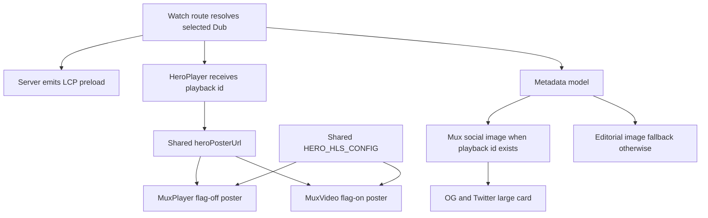

# fix: Watch Cold-Path Performance Follow-Up

## Summary

Address the four follow-ups from the validated Watch launch audit: make the
current deployed hero backend reuse the LCP preload and bounded HLS buffering,
verify the MuxVideo path remains ready for a flag-on build, replace the
undersized social card image with a full-size video-specific Mux thumbnail, and
record the cold TTFB/cache-topology evidence separately from canonical SEO
behavior.

---

## Problem Frame

The raw server HTML for
`https://watch.jesusfilm.org/watch/life-of-jesus-gospel-of-john.html/english.html`
now has readable server-rendered title metadata, valid `<html lang>`,
canonical/hreflang links, JSON-LD, and one H1. The remaining launch issue is
the first-load path. Lighthouse mobile still reports poor LCP and the waterfall
shows the deployed flag-off MuxPlayer backend fetching `thumbnail.webp` after a
server preload for `thumbnail.webp?width=1280`; because the URLs differ, the
browser cannot reuse the preload. The same flag-off backend is also missing the
HLS buffer caps already present in the flag-on MuxVideo branch.

Social preview metadata also points at an editorial still that is relevant, but
that still resolves to 640x300 while large-card metadata claims a larger image.
The selected Mux playback id can produce a 1200x630 JPG thumbnail, so playable
video pages should prefer that image for Open Graph and Twitter cards.

Repeated TTFB checks show a cold first response around 1.8 s and fast repeat
responses around 0.3 s. That points at deployment/cache topology work, not a
canonical-domain bug, so this slice should capture evidence and avoid changing
the `www.jesusfilm.org` metadata origin.

---

## Requirements

- R1. The MuxPlayer flag-off hero backend uses the exact same poster URL as the
  route-level LCP preload: `https://image.mux.com/{playbackId}/thumbnail.webp?width=1280`.
- R2. The MuxPlayer flag-off backend receives the same HLS buffer cap used by
  the MuxVideo backend.
- R3. The MuxVideo flag-on backend keeps parity coverage for poster URL,
  metadata, tracking, and HLS config.
- R4. Watch video and episode Open Graph metadata prefer a selected Mux
  playback thumbnail at 1200x630 when one exists.
- R5. Twitter image metadata stays in sync with the Open Graph image.
- R6. Canonical and `og:url` keep using the production public metadata origin.
- R7. The TTFB finding is documented as a cold-cache/topology follow-up with
  current live evidence instead of being folded into unrelated SEO fixes.

## Acceptance Examples

- AE1. Given the flag-off hero backend and a selected playback id, when
  `HeroPlayer` mounts, then `<MuxPlayer>` receives the preload-matching poster
  URL and bounded `_hlsConfig`.
- AE2. Given the flag-on hero backend and the same playback id, when
  `HeroPlayer` mounts, then `<MuxVideo>` still receives the preload-matching
  poster URL and bounded `_hlsConfig`.
- AE3. Given a playable Watch video with a selected Mux playback id, when
  metadata is generated, then OG/Twitter image URLs use a
  `thumbnail.jpg?width=1200&height=630&fit_mode=smartcrop` Mux URL with
  1200x630 metadata dimensions.
- AE4. Given a playable Watch video without a selected Mux playback id, when
  metadata is generated, then existing editorial poster fallback behavior
  remains intact.
- AE5. Given the audited dev URL, when live evidence is captured, then cold
  TTFB, repeat TTFB, LCP poster/preload behavior, and social image dimensions
  are recorded for launch follow-up.

---

## Key Technical Decisions

- KTD1. **Patch the deployed flag-off branch before removing it:** The live page
  still renders `<MuxPlayer>`, so this fix makes that branch safe instead of
  relying only on a future Railway env flip.
- KTD2. **Use one hero poster constant per render:** Building the poster URL in
  one local value prevents drift between MuxPlayer and MuxVideo props and keeps
  the string identical to the server preload.
- KTD3. **Share one HLS config object:** The 10 s lookahead, 5 MB cap, and 5 s
  back buffer are the prior measured Watch performance tuning and should not
  fork by backend.
- KTD4. **Social metadata should prefer selected Mux thumbnails:** The visible
  hero and the share card can use different image sources. For social crawlers,
  a deterministic 1200x630 video frame is better than an editorial still that
  cannot be upscaled past 640x300.
- KTD5. **Canonical remains production-owned:** `watch.jesusfilm.org` is the dev
  server, so cold-path and image fixes must not change
  `WATCH_PUBLIC_METADATA_ORIGIN`.
- KTD6. **TTFB is operational evidence, not a local code assertion:** The first
  response vs repeat response delta should be captured in docs and verified in
  deployment tooling, because a local unit test cannot prove edge/origin cache
  topology.

---

## High-Level Technical Design

The server route already emits the correct preload string. The client hero
needs to consume that same string, and the metadata model needs a separate
social-card image builder keyed by the selected playback id.

---

## Implementation Units

### U1. Roadmap and Plan

- **Goal:** Create the traceable work item and implementation plan before code
  changes.
- **Requirements:** R7.
- **Files:** `docs/roadmap/platform/feat-175-watch-cold-path-performance-follow-up.md`,
  `docs/plans/2026-06-10-003-fix-watch-cold-path-performance-plan.md`,
  `docs/roadmap/README.md`.

### U2. Hero LCP and HLS Parity

- **Goal:** Make the MuxPlayer branch match the existing MuxVideo cold-path
  behavior.
- **Requirements:** R1, R2, R3, AE1, AE2.
- **Files:** `apps/web/src/components/watch/HeroPlayer.tsx`,
  `apps/web/src/components/watch/__tests__/HeroPlayer.test.tsx`.

### U3. Full-Size Social Image Metadata

- **Goal:** Prefer selected Mux thumbnails for playable video social previews
  and keep Twitter in sync.
- **Requirements:** R4, R5, R6, AE3, AE4.
- **Files:** `apps/web/src/lib/experience-metadata.ts`,
  `apps/web/src/lib/experience-metadata.test.ts`.

### U4. Evidence and Completion

- **Goal:** Validate the patch, capture remaining cold TTFB behavior, and close
  the roadmap item.
- **Requirements:** R7, AE5.
- **Files:** `docs/solutions/performance-issues/`,
  `docs/roadmap/platform/feat-175-watch-cold-path-performance-follow-up.md`,
  `docs/plans/2026-06-10-003-fix-watch-cold-path-performance-plan.md`.

---

## Validation Plan

- Unit tests cover hero backend props and metadata image selection.
- Typecheck and lint cover app-wide contract drift.
- Helium smoke covers the user-facing Watch page after the local build is
  available.
- Lighthouse/mobile or equivalent live evidence captures whether the next
  deployed build reuses the preload and whether the cold TTFB delta remains.

---

## Open Questions

- OQ1. The final Railway flag flip for
  `NEXT_PUBLIC_FORGE_WATCH_HERO_MUX_VIDEO=true` is an environment operation,
  not a repo code change. This PR should make flag-off safe and leave the flag
  flip as the deployment step.
- OQ2. If social reviewers prefer authored editorial stills over Mux frames, a
  future admin/image pipeline should ingest true 1200x630 editorial share
  images. This slice uses Mux because it is available and verifiably full-size.
