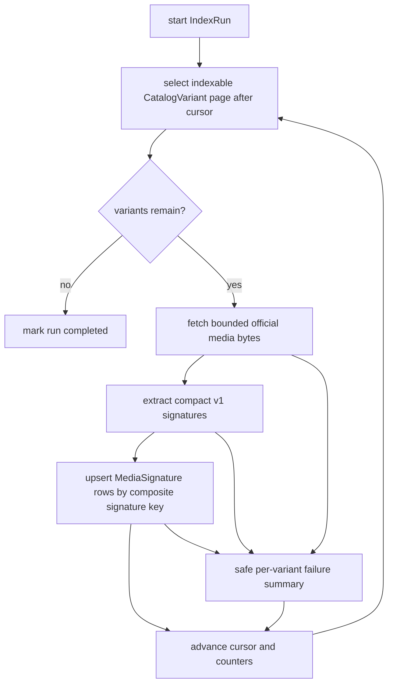

# feat: Index official media signatures for catalog variants

## Summary

YTM-004 adds a mapper-side indexing service over local `CatalogVariant` rows so official media can be converted into compact, versioned `MediaSignature` rows. The slice stays modest: index only Admin-derived, mapper-local, indexable variants; record durable `IndexRun` state; and seed retrieval-facing official signatures without implementing final matching.

---

## Problem Frame

YTM-003 made Admin catalog metadata available as mapper-owned projection rows. Future matching needs a local official-side media index keyed by `coreId + videoVariantId`, not ad hoc media fetches or metadata search at match time. The indexer must tolerate catalog scale, partial media failures, and repeated runs while keeping Admin the source of truth for catalog metadata.

---

## Requirements

- R1. The indexer selects only local `CatalogVariant` rows where Admin marked the variant `indexable` and a mapper-owned `mediaSourceUrl` exists.
- R2. Each run writes durable `IndexRun` state with status, algorithm version, cursor, attempted/indexed/failed counters, timestamps, and safe failure summaries.
- R3. Per-variant failures are summarized and counted without failing the whole run unless the repository or run itself cannot continue.
- R4. `MediaSignature` writes are idempotent under the key `coreId + videoVariantId + signatureType + algorithmVersion + offsetMilliseconds`.
- R5. A new algorithm version can coexist with older signatures, while repeated runs of the same version skip or upsert existing signatures without duplicates.
- R6. The first algorithm is deterministic and compact, using catalog duration/structure plus bounded media sampling/hash metadata rather than fake matcher-only placeholders.
- R7. Retrieval tests can seed official signatures shaped like production `MediaSignature` output, but YTM-004 does not implement the final matcher.

---

## Key Technical Decisions

- KTD1. Service-layer indexing mirrors catalog sync: `MediaIndexingService` owns run lifecycle, variant iteration, safe summaries, and counters; a Prisma repository owns database writes.
- KTD2. The cursor is the ordered `CatalogVariant.id`: this matches the existing `IndexRun.cursorVariantId`, gives resumable pagination without adding schema fields, and avoids leaking media URLs in run state.
- KTD3. Keep source-of-truth boundaries local: the indexer reads mapper projection rows only and never calls Admin directly during indexing.
- KTD4. Add a structural signature type if needed for duration/shape hints instead of overloading text, visual, or audio enum values.
- KTD5. Use a deterministic v1 extractor that hashes bounded bytes and catalog metadata. Real audio fingerprints remain deferred until a real local library is selected.
- KTD6. Failure summaries store bounded identifiers, codes, and messages, not request headers, bearer tokens, full row payloads, or long media URLs.

---

## High-Level Technical Design

---

## Scope Boundaries

- In scope: official-side indexing over the mapper's local catalog projection, deterministic v1 signatures, run persistence, idempotence, resume behavior, and tests.
- Deferred to YTM-005: final candidate retrieval, fusion changes, confidence thresholds, and public match result behavior.
- Deferred to follow-up work: real visual frame extraction through ffmpeg or a media library, real audio fingerprinting, subtitle-source ingestion, background queue scheduling, and cleanup/rebuild operations beyond algorithm-version coexistence.

---

## Implementation Units

### U1. Ticket State And Schema Contract

- **Goal:** Mark YTM-004 in progress and update the schema only where the signature contract needs a missing enum value.
- **Requirements:** R2, R4, R6.
- **Dependencies:** none.
- **Files:** `docs/prototypes/yt-video-mapper/tickets/ytm-004-official-media-signature-indexing.md`, `apps/yt-video-mapper-backend/prisma/schema.prisma`, `apps/yt-video-mapper-backend/prisma/migrations/*/migration.sql`, `apps/yt-video-mapper-backend/src/db/schema.test.ts`.
- **Approach:** Preserve existing `IndexRun` and `MediaSignature` tables. Add a structural/duration signature enum value only if implementation cannot represent duration hints cleanly with the current enum.
- **Patterns to follow:** `apps/yt-video-mapper-backend/prisma/migrations/20260610010000_ytm003_catalog_sync_fields/migration.sql`.
- **Test scenarios:** Assert the schema keeps the composite media signature uniqueness key and includes any new structural signature enum value.
- **Verification:** The Prisma schema and migration describe the same enum/table contract expected by service tests.

### U2. Media Signature Extraction

- **Goal:** Build a deterministic, compact v1 extractor for official media inputs.
- **Requirements:** R4, R5, R6.
- **Dependencies:** U1.
- **Files:** `apps/yt-video-mapper-backend/src/services/media-signature-extraction.ts`, `apps/yt-video-mapper-backend/src/services/media-signature-extraction.test.ts`.
- **Approach:** Accept catalog metadata plus bounded source bytes. Emit structural duration hints when duration metadata exists, visual byte-sample hashes for the first practical media slice, and optional text segments only when source text is supplied. Keep audio absent unless backed by a real implementation.
- **Patterns to follow:** `apps/yt-video-mapper-backend/src/services/upload-signal-extraction.ts`.
- **Test scenarios:** Deterministic hashes for identical bytes, different algorithm version carried through all signatures, no audio placeholders when no audio extractor exists, duration hints use `lengthInMilliseconds` before `durationSeconds`, and emitted payloads stay compact.
- **Verification:** Unit tests prove extraction is stable and versioned without requiring external media binaries.

### U3. Indexing Repository

- **Goal:** Add repository operations for index run lifecycle, indexable variant paging, existing-signature checks, and idempotent signature upserts.
- **Requirements:** R1, R2, R4, R5.
- **Dependencies:** U1, U2.
- **Files:** `apps/yt-video-mapper-backend/src/services/media-indexing.ts`, `apps/yt-video-mapper-backend/src/services/media-indexing.test.ts`.
- **Approach:** Define a repository interface plus in-memory test repository in the service file, with a Prisma adapter beside it. Select variants by `indexable=true`, non-null `mediaSourceUrl`, optional cursor `id > cursor`, stable order by `id`, and page limit.
- **Patterns to follow:** `PrismaCatalogRepository` and `InMemoryCatalogRepository` in `apps/yt-video-mapper-backend/src/services/catalog-sync.ts`.
- **Test scenarios:** Select only indexable variants with source URLs, advance cursor by variant id, skip variants already indexed for the same algorithm version, index the same variant for a new algorithm version, and upsert signatures without duplicate rows.
- **Verification:** Service tests exercise both repository-independent behavior and Prisma-shaped adapter inputs where practical.

### U4. Indexing Service Run Lifecycle

- **Goal:** Implement `MediaIndexingService` that coordinates variant pages, media fetching, extraction, writes, counters, and safe failures.
- **Requirements:** R1, R2, R3, R4, R5, R6.
- **Dependencies:** U2, U3.
- **Files:** `apps/yt-video-mapper-backend/src/services/media-indexing.ts`, `apps/yt-video-mapper-backend/src/services/media-indexing.test.ts`.
- **Approach:** Start an `IndexRun`, loop through pages, fetch bounded official media bytes via injectable `fetch`, pass metadata into the extractor, upsert signatures, update cursor/counters after each variant, and complete or fail the run. Treat per-variant fetch/extract/write failures as counted failures unless run state persistence fails.
- **Patterns to follow:** `CatalogSyncService` failure summaries and `MatchJobService` safe terminal states.
- **Test scenarios:** Completed run records attempted/indexed/failed counts, per-variant failure does not stop later variants, unrecoverable repository failure marks the run failed, failure summaries omit media URLs, cursor resume starts after the recorded cursor, and repeated runs do not duplicate signatures.
- **Verification:** Unit tests cover the acceptance criteria without network access by using injected fetchers and in-memory repositories.

### U5. Script, Env, And Operator Surface

- **Goal:** Provide an operator-run script for catalog indexing without creating route-handler logic.
- **Requirements:** R1, R2, R3.
- **Dependencies:** U3, U4.
- **Files:** `apps/yt-video-mapper-backend/package.json`, `apps/yt-video-mapper-backend/src/scripts/index-media.ts`, `apps/yt-video-mapper-backend/src/config/env.ts`, `apps/yt-video-mapper-backend/src/config/env.test.ts`, `apps/yt-video-mapper-backend/.env.example`, `apps/yt-video-mapper-backend/README.md`.
- **Approach:** Add `index:media` with optional env-backed page size, algorithm version, and maximum fetch bytes. Keep new env vars optional with defaults so Railway deploys do not require immediate provisioning.
- **Patterns to follow:** `apps/yt-video-mapper-backend/src/scripts/sync-catalog.ts` and the optional-env guidance in `CONCEPTS.md` / root `CLAUDE.md`.
- **Test scenarios:** Env tests cover defaults and empty-string handling; script output reports run id, status, counters, cursor, and safe failures.
- **Verification:** Operators can run broad indexing from the package script after catalog sync has populated projection rows.

### U6. Retrieval Fixtures And Regression Coverage

- **Goal:** Seed retrieval tests with official signatures shaped like stored `MediaSignature` rows while keeping matcher implementation deferred.
- **Requirements:** R7.
- **Dependencies:** U2, U4.
- **Files:** `apps/yt-video-mapper-backend/src/services/retrieval/retrievers.test.ts`, `apps/yt-video-mapper-backend/src/services/retrieval/types.ts`.
- **Approach:** Add small helpers that project seeded signature payloads into existing retrieval inputs, or adjust test fixtures to include `coreId`, `videoVariantId`, offset, type, algorithm version, and compact payload fields.
- **Patterns to follow:** Existing visual/audio/text retrieval tests and the composite key guidance in `docs/solutions/platform/yt-video-mapper-backend-app-durable-match-job-upload-poll-process-pattern.md`.
- **Test scenarios:** Retrieval fixtures search against seeded official visual/text signatures by composite identity; no final matcher or fusion behavior changes.
- **Verification:** Retrieval tests still prove candidate signal retrieval while documenting the production signature shape YTM-005 will consume.

---

## System-Wide Impact

The change adds a durable indexing lifecycle to the mapper backend, but it does not change Admin, public match APIs, or cross-app GraphQL contracts. Database impact is limited to existing mapper-owned tables plus a small enum migration if structural signatures need their own type. Operationally, indexing becomes an explicit script that can run after catalog sync and before future match retrieval.

---

## Risks & Dependencies

- Media URLs may be large, signed, or stream-oriented; the first implementation should fetch only bounded bytes and avoid storing full URLs in failures.
- HLS/DASH manifests may not expose representative media bytes through the same path as direct downloads; v1 can still record structural signatures and safe failures for unsupported fetch shapes.
- Prisma enum changes require migration and generated client refresh before typecheck can pass.
- Real visual/audio extraction is intentionally deferred; v1 signatures should not be presented as production-quality matching evidence.

---

## Sources & Research

- `docs/prototypes/yt-video-mapper/tickets/ytm-004-official-media-signature-indexing.md` defines the YTM-004 scope and acceptance criteria.
- `apps/yt-video-mapper-backend/AGENTS.md` requires Core-facing terminology and content-first matching.
- `docs/solutions/architecture-patterns/mapper-admin-catalog-sync-local-projection-pattern.md` establishes local projection ownership, composite identity, idempotent run state, and safe summaries.
- `docs/solutions/platform/yt-video-mapper-backend-app-durable-match-job-upload-poll-process-pattern.md` establishes durable job/run patterns and the future retrieval boundary.
- `apps/yt-video-mapper-backend/src/services/catalog-sync.ts` is the primary service/repository pattern for YTM-004.
