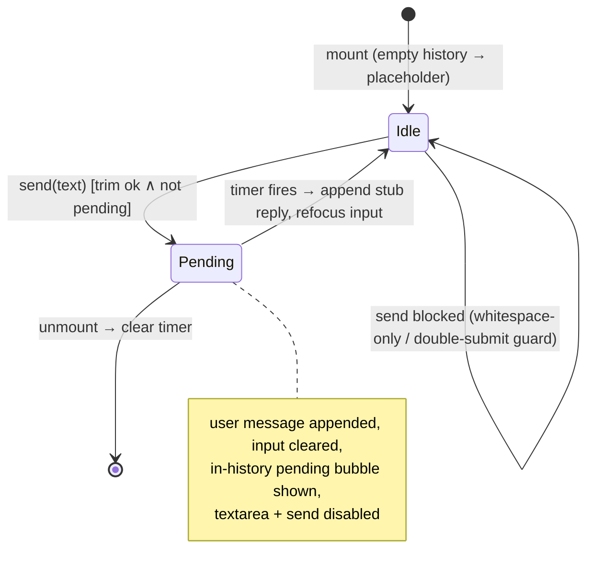

# feat: Scaffold apps/chat with stubbed agent chat page

## Summary

Create `apps/chat` (`@forge/chat`): a minimal Next.js App Router app with one full-screen chat page whose assistant replies come from a pure client-side stub, plus README/CLAUDE.md/AGENTS.md, a config-as-code `railway.toml`, and root-doc registration. Hybrid template per the origin's key decision: `apps/roadmap` models the dependency footprint and Railway config; `apps/web` models every CI-exercised engineering config.

## Problem Frame

A chat UI for the Mastra agents in `apps/mastra` needs a home, but agent integration, auth, and persistence decisions aren't ready (roadmap ticket feat-200). Scaffolding the shell now establishes the conventions, CI integration, and deploy path before any real wiring, so later work swaps a stub for an agent instead of inventing an app under pressure.

---

## Requirements

Carried from origin (`docs/brainstorms/2026-06-10-chat-app-scaffold-requirements.md`); R-IDs preserved.

**App scaffold**

- R1. New pnpm workspace app at `apps/chat` named `@forge/chat`: Next.js App Router, strict TypeScript, Tailwind v4 — roadmap-minimal footprint with web's engineering config.
- R2. Standard scripts (`dev`, `build`, `start`, `lint`, `typecheck`) so CI picks the app up with zero CI changes.
- R3. Dev server on port 3200.

**Chat UI and stub**

- R4. One full-screen chat page: message history, text input, send action; empty history shows a centered placeholder prompt.
- R5. Replies from a client-side stub — no API route, no network; state resets on refresh; simulated delay with a visible pending indicator.
- R6. Stubbed replies are recognizable as stubbed.
- R7. Input and send disabled while a reply is pending.

**Documentation**

- R8. README: what the app is, local dev, Railway service setup checklist.
- R9. CLAUDE.md (short, roadmap-style): what this is, eventual `apps/mastra` connection with the integration path stated as undecided (direct vs `apps/mastra-gateway`), intentionally-absent list, conventions, Development commands, deployment.
- R10. AGENTS.md (pointer-style): scope boundary + stub-only guardrail.
- R11. Root `CLAUDE.md` and root `AGENTS.md` register the new app following their existing patterns.

**Deployment**

- R12. `apps/chat/railway.toml` with the railpack builder, modeled on `apps/roadmap/railway.toml`, `watchPatterns` scoped to `apps/chat/**`.
- R13. README's Railway checklist covers manual service wiring and verifying the deployment record's `configFile` field (build logs secondary).
- R14. Railway-generated domain only; no `jesusfilm.org` DNS. README states this.

---

## Assumptions

Un-validated agent bets made in headless planning. The origin explicitly deferred the first three to planning; the rest interpret gaps the origin is silent on.

- **Stub contract: prefix-echo.** `buildStubReply(text)` returns a fixed stub-identifying sentence that quotes the user's message (e.g. `Stubbed reply — no agent is connected yet. You said: "…"`). Deterministic and self-evidently fake (satisfies R6), and echoes prove the round-trip through state. Delay is one exported constant (`STUB_REPLY_DELAY_MS = 800`), no jitter, so tests run against fake timers.
- **Message shape: minimal with AI-SDK-aligned names.** `{ id: string; role: "user" | "assistant"; content: string }`. The later Mastra swap renames nothing; no `parts` array until real wiring exists.
- **Vitest ships in this scaffold PR** (resolving the origin's deferred question toward "include now", not "with the first real logic"). The stub and the interaction states (R4–R7) are real client logic worth pinning now. CI runs `test` via `--if-present`, and `vitest run` with zero test files _fails_ — so the `test`/`test:watch` scripts, `vitest.config.ts`, and the `vitest`/`jsdom` devDeps all land in U2 together with the first test files; U1's `package.json` carries no `test` script. Component tests mirror `apps/admin`'s style (plain `react-dom/client` + `act`, per-file `// @vitest-environment jsdom`, no testing-library) to add zero new dependency surface beyond `vitest` + `jsdom`.
- **Composer is a textarea**: Enter sends, Shift+Enter inserts a newline — mirrors the admin experience-chat-panel precedent. The IME composition guard (`nativeEvent.isComposing`) is an addition with no in-repo precedent.
- **Pending indicator is an in-history assistant bubble** (admin's "Thinking…" idiom with stub-flavored copy); focus returns to the input on pending → idle; history container is a `role="log"` live region; the send handler carries an imperative double-submit guard in addition to the disabled attribute; the reply timer is cleaned up on unmount.
- **`railway.toml` keeps roadmap's `[deploy.env] HOSTNAME` block** for template fidelity, but the README checklist independently verifies `HOSTNAME=0.0.0.0` as a dashboard service variable, because `[deploy.env]` has been observed unreliable (`docs/solutions/deployment/nextjs-pnpm-monorepo-railway-standalone.md`).
- **The stale "Port assignment" bullet in `docs/solutions/platform/adding-new-apps.md` is corrected while registering chat** — it currently stops at `manager=3002`; U6 extends it to the verified current set plus `chat=3200`.

---

## Key Technical Decisions

- **Hybrid template, resolved to exact artifacts** (origin Key Decision; see origin). From `apps/web`: the `eslint.config.mjs` skeleton (`defineConfig([...commonConfig, ...nextVitals, globalIgnores([...])])`), `tsconfig.json` near-verbatim (ES2022, `strict`, `allowJs: false`, `@/*` → `./src/*`, includes `src/**` + `.next/types/**`), `vitest.config.ts` shape (node default env, `src/**/*.test.{ts,tsx}` include), and dependency versions verbatim: `next ^16.2.4`, `react ^19.0.0`, `react-dom ^19.0.0`, `typescript ^5`, `eslint ^9.0.0`, `eslint-config-next ^16.1.6`, `vitest 3.2.4`, `jsdom ^26.1.0`, `tailwindcss ^4.1.18`, `@tailwindcss/postcss ^4.1.18`, `postcss ^8.5.6`, `@types/react ^19.0.0`, `@types/react-dom ^19.0.0`. From `apps/roadmap`: dependency count discipline (zero runtime deps beyond next/react), minimal typed `next.config.ts`, `postcss.config.mjs`, and the `railway.toml` shape.
- **CI is satisfied by construction, not by CI edits.** The affected matrix admits only `@forge/*`-named packages (`.github/workflows/ci.yml`), then runs `lint --max-warnings=0`, `typecheck`, `test`, `build` per package via `--if-present`. The unconditional `format` job runs `prettier --check .` repo-wide — every new file must be prettier-clean under the root `.prettierrc` (`semi: false`, 2-space indent).
- **Stub lives in a plain module, UI in one client component.** `src/lib/chat-stub.ts` owns the message type, delay constant, and reply builder (unit-testable in node env); `src/components/chat/chat.tsx` (`'use client'`) owns state and interaction; `src/app/page.tsx` stays a server component that renders it. This is the seam where Mastra wiring later replaces the stub without touching the page structure.
- **Scripts**: `dev: next dev -p 3200`, `build: next build`, `start: next start -p 3200`, `lint: eslint .`, `typecheck: tsc --noEmit`, `test: vitest run`, `test:watch: vitest`. Web's script names with the locale-generation prefixes stripped; ports follow roadmap's explicit `-p` pattern. (Next 16 defaults dev to Turbopack; no flag needed.)
- **`railway.toml` mirrors roadmap with chat substitutions**: railpack builder; `buildCommand` pins `corepack prepare pnpm@9.12.3 --activate` (matches root `packageManager`) then `pnpm install --frozen-lockfile && pnpm --filter @forge/chat build`; `watchPatterns = ["apps/chat/**"]` only (chat reads no sibling dirs); `startCommand = "cd apps/chat && npx next start -p ${PORT:-3200}"`; restart policy on_failure ×3.
- **No env vars, so no `env.ts`.** The t3-oss validation scaffold from `docs/solutions/platform/adding-new-apps.md` is deliberately skipped (nothing to validate); the CLAUDE.md intentionally-absent list says so to pre-empt reviewer cargo-culting.

---

## Output Structure

Scope declaration for the new directory; per-unit Files lists are authoritative.

```
apps/chat/
├── package.json          # @forge/chat, scripts, web-pinned versions
├── tsconfig.json         # web's strict src/-layout config
├── eslint.config.mjs     # extends root + next core-web-vitals
├── postcss.config.mjs    # @tailwindcss/postcss
├── next.config.ts        # minimal typed NextConfig
├── vitest.config.ts      # node default env, @ alias
├── railway.toml          # railpack config-as-code
├── README.md             # local dev + Railway wiring checklist
├── CLAUDE.md             # roadmap-style app guide
├── AGENTS.md             # pointer-style guardrails
└── src/
    ├── app/
    │   ├── layout.tsx    # html/body, metadata, globals.css import
    │   ├── globals.css   # @import "tailwindcss" + minimal theme
    │   └── page.tsx      # server component rendering <Chat />
    ├── components/chat/
    │   ├── chat.tsx      # 'use client' — state + interaction
    │   └── chat.test.tsx # jsdom component tests
    └── lib/
        ├── chat-stub.ts       # Message type, delay constant, buildStubReply
        └── chat-stub.test.ts  # stub contract unit tests
```

## High-Level Technical Design

The page is a two-state interaction loop with guarded transitions; everything else is rendering.



Directional guidance, not implementation specification: state is `messages: Message[]` plus a `pending` flag in the client component; the transition guard lives imperatively in the send handler (disabled attributes alone don't survive double-keydown before re-render — admin panel precedent).

---

## Implementation Units

### U1. Workspace scaffold and engineering config

- **Goal**: `apps/chat` exists as a CI-green workspace member: installable, lintable, typecheckable, buildable, dev-bootable on 3200 — with a placeholder page.
- **Requirements**: R1, R2, R3.
- **Dependencies**: none.
- **Files**: `apps/chat/package.json`, `apps/chat/tsconfig.json`, `apps/chat/eslint.config.mjs`, `apps/chat/postcss.config.mjs`, `apps/chat/next.config.ts`, `apps/chat/src/app/layout.tsx`, `apps/chat/src/app/globals.css`, `apps/chat/src/app/page.tsx` (placeholder content this unit; replaced in U3), root `pnpm-lock.yaml` (via install).
- **Approach**: package named `@forge/chat`, `private: true`, version `0.0.1`. Scripts and dependency versions per Key Technical Decisions — except the `test`/`test:watch` scripts and `vitest`/`jsdom` devDeps, which land in U2 with the first test files (a `test` script with zero test files fails CI). eslint config copies web's skeleton minus the app-specific video.js block; ignores `.next/**`, `out/**`, `next-env.d.ts`. tsconfig copies web's with no changes needed. `globals.css` is `@import "tailwindcss";` plus at most a tiny `@theme` block. `layout.tsx` exports `metadata` (title "Forge Chat" or similar, clearly non-final) and a `viewport` export with `interactiveWidget: "resizes-content"` so the dvh-sized composer stays above the mobile soft keyboard. Run `pnpm install` from root to register the workspace and update the lockfile.
- **Patterns to follow**: `apps/web/eslint.config.mjs`, `apps/web/tsconfig.json`, `apps/roadmap/package.json` (footprint), `apps/roadmap/next.config.ts`, `apps/web/postcss.config.mjs`, `docs/solutions/platform/adding-new-apps.md` checklist.
- **Test expectation: none** — pure scaffolding; behavior arrives in U2/U3. (The `test` script is added in U2 together with the first test file, so no intermediate state has `vitest run` with zero test files.)
- **Verification**: `pnpm --filter @forge/chat lint`, `typecheck`, `build` all pass; `pnpm --filter @forge/chat dev` serves on `http://localhost:3200` (use `localhost`, not `127.0.0.1` — Next 16 dev-origin hydration gotcha); `pnpm prettier --check apps/chat` clean.

### U2. Chat stub module

- **Goal**: the stub contract exists as a typed, tested, UI-independent module — the seam later Mastra wiring replaces.
- **Requirements**: R5, R6.
- **Dependencies**: U1.
- **Files**: `apps/chat/src/lib/chat-stub.ts`, `apps/chat/src/lib/chat-stub.test.ts`, `apps/chat/vitest.config.ts`, `apps/chat/package.json` (add `test`/`test:watch` scripts + `vitest`/`jsdom` devDeps — deliberately absent from U1).
- **Approach**: export `type Message = { id: string; role: "user" | "assistant"; content: string }`, `STUB_REPLY_DELAY_MS = 800`, and `buildStubReply(userText: string): string` returning the fixed stub-identifying sentence quoting `userText`. Pure functions only — the timer lives in the component (U3) so the module needs no async machinery. vitest config mirrors web's minus the `server-only` alias and setupFiles (not needed).
- **Patterns to follow**: `apps/web/vitest.config.ts` (shape), repo test conventions (colocated, behavior-focused).
- **Test scenarios**:
  - Happy path: `buildStubReply("hello")` returns a string containing both a stub self-identification marker and the verbatim text `hello` (the R6 assertion).
  - Edge: input with quotes/newlines is embedded verbatim without throwing or truncating.
  - Contract: `STUB_REPLY_DELAY_MS` is a positive finite number (guards accidental `NaN`/negative edits breaking the UI timer).
- **Verification**: `pnpm --filter @forge/chat test` passes; module imports cleanly from a node-env test (no DOM dependency).

### U3. Chat page UI

- **Goal**: the full-screen chat page with empty state, send flow, pending indicator, and disabled-while-pending behavior — wired to the U2 stub.
- **Requirements**: R4, R5, R6, R7.
- **Dependencies**: U1, U2.
- **Files**: `apps/chat/src/components/chat/chat.tsx`, `apps/chat/src/components/chat/chat.test.tsx`, `apps/chat/src/app/page.tsx` (render `<Chat />`).
- **Approach**: single `'use client'` component holding `messages` + `pending` state. Layout: `h-dvh` flex column; history scrolls independently (`min-h-0 flex-1 overflow-y-auto`), composer pinned at bottom inside a `<form>` with a `<textarea>` (explicit `aria-label` — placeholder text is not an accessible name) and a real `<button type="submit">`; the send button is `disabled` while pending or when the trimmed input is empty (button-level disable, matching the admin panel). Empty history renders a centered placeholder whose copy itself states the stub nature (heading plus a sub-line like "Replies come from a stub — no agent is connected yet."), so R6 holds at first render. Send: trim guard + imperative pending guard, append user message (`crypto.randomUUID()` id), clear input, show in-history pending bubble, `setTimeout(STUB_REPLY_DELAY_MS)` appends the stub reply, refocus the textarea. Enter sends; Shift+Enter newline; IME guard via `nativeEvent.isComposing`. Timer canceled on unmount. History container `role="log"` with an accessible label; messages render `whitespace-pre-wrap break-words`; auto-scroll via `el.scrollTop = el.scrollHeight` (instant, not smooth) on messages/pending change.
- **Patterns to follow**: `apps/admin/src/app/dashboard/experiences/experience-editor/experience-chat-panel.tsx` (trim/double-submit guards, disabled idiom, in-history pending bubble, auto-scroll, Enter/Shift+Enter) and its colocated test (createRoot + act + per-file jsdom style; it also sets `IS_REACT_ACT_ENVIRONMENT` inline — copy that). Fake timers and the IME guard have no in-repo precedent and are authored fresh here. Do **not** copy its missing a11y treatment — the live region is deliberate divergence.
- **Test scenarios** (jsdom, fake timers):
  - Empty history renders the centered placeholder including its stub-identifying copy; placeholder is gone after the first send, before the reply arrives.
  - Send appends the user message, shows the pending bubble, disables textarea and send button; after `STUB_REPLY_DELAY_MS`, the stub reply appends, bubble is gone, controls re-enable.
  - Send button is disabled when the textarea is empty or whitespace-only, and enabled with non-whitespace text while idle.
  - Reply content equals `buildStubReply(sent text)` exactly.
  - Whitespace-only input: submit is a no-op; history unchanged.
  - Rapid double-submit (two submits before re-render): exactly one user message, one reply.
  - Enter sends; Shift+Enter does not send.
  - Input clears on send.
  - Unmount mid-pending: timer cleared, no post-unmount state update (no act warning).
  - Multiple exchanges: append-only ordering, alternating roles, no orphaned pending bubble.
  - A11y smoke: history container has `role="log"`; textarea has an accessible name; pending bubble text renders inside the log container.
- **Verification**: all chat tests pass; manual dev-server check on `localhost:3200` — send a message, watch the pending bubble, receive a visibly-stubbed reply; refresh resets history.

### U4. Railway config-as-code

- **Goal**: a committed `railway.toml` that a Railway service can be pointed at, mirroring the repo's live config-as-code precedent.
- **Requirements**: R12.
- **Dependencies**: U1 (build must exist for the buildCommand to be meaningful).
- **Files**: `apps/chat/railway.toml`.
- **Approach**: per Key Technical Decisions. Open with a comment noting Railway only reads this file when the service's Config-as-code Path points at it (mirrors `apps/mastra-gateway/railway.toml`'s header).
- **Patterns to follow**: `apps/roadmap/railway.toml` (primary), `apps/mastra-gateway/railway.toml` (header comment), `apps/admin/railway.toml` (the failure mode being designed against).
- **Test expectation: none** — config file; verified by the README checklist at service-wiring time (manual dashboard work, out of repo scope per origin).
- **Verification**: file parses as TOML; buildCommand's pnpm pin matches root `packageManager`; filter name matches the package name exactly.

### U5. App documentation

- **Goal**: README, CLAUDE.md, and AGENTS.md that make the app self-describing and guard its scope.
- **Requirements**: R8, R9, R10, R13, R14.
- **Dependencies**: U1–U4 (documents what exists).
- **Files**: `apps/chat/README.md`, `apps/chat/CLAUDE.md`, `apps/chat/AGENTS.md`.
- **Approach**:
  - README: what the app is (stub-only chat shell for eventual Mastra agents), local dev commands, and a literal Railway wiring checklist synthesized from the institutional learnings: create service → set Config-as-code Path to `apps/chat/railway.toml` → deploy → **assert the deployment record's `configFile` field is non-null and reads `/apps/chat/railway.toml`** (build logs secondary) → confirm `HOSTNAME=0.0.0.0` as a dashboard service variable → stay on the Railway-generated domain; no `jesusfilm.org` DNS until Cloudflare fronting lands with auth. Cite `apps/admin/railway.toml` as the cautionary dead-config example.
  - CLAUDE.md: roadmap-length (~45 lines). Sections: What This Is / Eventual Mastra connection (**integration path undecided — direct to `apps/mastra` vs via `apps/mastra-gateway`**; do not imply either) / Intentionally absent (no auth, no database, no API routes, no real agent, no env vars — hence no `env.ts`) / Key Conventions / Development (`pnpm --filter @forge/chat dev|build|lint|typecheck|test`) / Deployment.
  - AGENTS.md: pointer-style per `apps/web/AGENTS.md` — scope line, alignment line, Do/Do-not bullets with the stub-only guardrail: do not wire real agents, auth, or a database without a roadmap ticket; no cross-app imports.
- **Patterns to follow**: `apps/roadmap/CLAUDE.md` (size/shape), `apps/web/AGENTS.md` (pointer style), `docs/solutions/deployment/railway-dashboard-override-shadows-railway-toml-20260429.md` + `docs/solutions/workflow-issues/yt-video-mapper-railway-prisma-backend-deployment.md` (checklist content).
- **Test expectation: none** — documentation.
- **Verification**: all three files exist and state the stub-only scope; README checklist contains the `configFile` verification step and the no-DNS rule; CLAUDE.md states the Mastra path as undecided.

### U6. Root registration

- **Goal**: the monorepo's root docs and the app-scaffold learning doc know about `apps/chat`.
- **Requirements**: R11.
- **Dependencies**: U1 (app must exist), U5 (files being pointed at must exist).
- **Files**: `CLAUDE.md` (root), `AGENTS.md` (root), `docs/solutions/platform/adding-new-apps.md`.
- **Approach**: root CLAUDE.md — add `apps/chat/` to the Monorepo Structure list (one line, roadmap-entry shape) and a `Working in apps/chat/? Also read apps/chat/CLAUDE.md` line to Package-Specific Instructions. Root AGENTS.md — add `- apps/chat/AGENTS.md + apps/chat/CLAUDE.md` to Package guidance. `adding-new-apps.md` — extend its stale "Port assignment" bullet (currently ends at `manager=3002`) to the verified current set: web=3000, manager=3002, admin=3003, auth=3004, mastra-gateway=3005, roadmap=3100, chat=3200. Do **not** touch roadmap lane structure, lane tags, or `apps/roadmap/lib/features.ts` (gated by `todos/007-pending-p2-ai-chat-roadmap-lane-pending-team-decision.md`).
- **Patterns to follow**: existing per-app lines in both root files; update root docs together per `docs/solutions/platform/agent-instructions-should-stay-tool-agnostic-and-current.md`.
- **Test expectation: none** — documentation.
- **Verification**: `rg -n "apps/chat|@forge/chat" CLAUDE.md AGENTS.md docs/` shows the registrations (the ticket's own grep).

---

## Scope Boundaries

Carried from origin; deferred and documented as deferred in the app's own docs:

- Auth (later, alongside Cloudflare fronting)
- Database / persistence
- Real Mastra agent connection, API routes, server actions, streaming
- Multi-conversation UI / sidebar
- i18n, design-system sharing with `apps/web`

### Deferred to Follow-Up Work

- Railway service creation and Config-as-code wiring — manual dashboard work by someone with Railway access; the repo carries only the config file and README checklist (origin Dependencies/Assumptions).
- `ai-chat` roadmap lane registration — explicitly gated by `todos/007-pending-p2-ai-chat-roadmap-lane-pending-team-decision.md`; not a side effect of this scaffold.
- Compound-time follow-ups: set feat-200 to `complete`, run `ce:compound`.

---

## Risks & Dependencies

- **`vitest run` fails on zero test files** — the `test` script must never land without at least one test file (U2 bundles them). A future PR deleting all tests without deleting the script would break CI.
- **Repo-wide prettier gate**: the `format` CI job checks every file unconditionally; `semi: false` is the most likely authoring slip.
- **`[deploy.env]` unreliability** on Railway is a known trap; mitigated by the README checklist's dashboard-variable verification step rather than by trusting the toml block.
- **Template drift**: web's dependency ranges move; the scaffold pins what web has today (2026-06-10). Acceptable — chat upgrades independently after birth.
- **Pre-commit hook** (husky + lint-staged: eslint `--max-warnings=0` + prettier on staged files) must pass; never `--no-verify`.

## Sources & Research

- Origin requirements: `docs/brainstorms/2026-06-10-chat-app-scaffold-requirements.md`; ticket: `docs/roadmap/ai-chat/feat-200-chat-app-scaffold.md`.
- CI mechanics: `.github/workflows/ci.yml` (affected matrix `@forge/*` filter, `--if-present` task invocation, unconditional format job).
- Scaffold checklist: `docs/solutions/platform/adding-new-apps.md` (confirms the zero-CI-change claim; its port bullet is stale — corrected in U6 — and its `@forge/graphql` / t3-oss `env.ts` guidance predates current reality: noted, not fixed, in this PR).
- Railway: `docs/solutions/deployment/railway-dashboard-override-shadows-railway-toml-20260429.md` (dead-config incident + service-creation checklist), `docs/solutions/workflow-issues/yt-video-mapper-railway-prisma-backend-deployment.md` (positive `configFile` verification, 2026-06-09), `docs/solutions/deployment/nextjs-pnpm-monorepo-railway-standalone.md` (`[deploy.env]` unreliability, corepack pin).
- Chat interaction prior art: `apps/admin/src/app/dashboard/experiences/experience-editor/experience-chat-panel.tsx` + colocated test (guards, disabled idiom, pending bubble, auto-scroll; test style: createRoot + act + per-file jsdom — fake timers and the IME guard are new in chat).
- Dev-server gotcha: `docs/solutions/runtime-errors/nextjs-alloweddevorigins-hydration-dead-127-0-0-1-20260520.md` (verify via `localhost:3200`).
- Mastra-path context for CLAUDE.md wording: `docs/solutions/platform/mastra-studio-gateway-auth-railway-pattern-20260522.md`.
